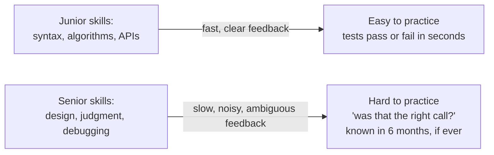
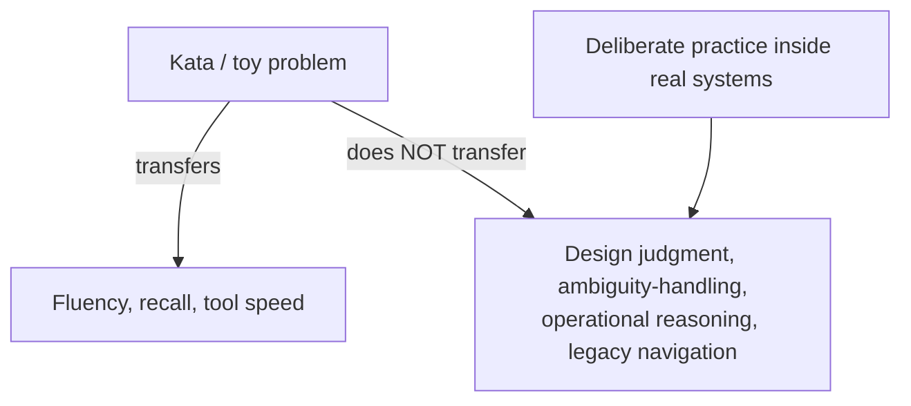

> **What?** At the senior level, deliberate practice is the disciplined development of *judgment* — design, debugging, code review, writing, system reasoning — not just coding fluency. The hard part is that the highest-value skills have slow, noisy feedback (a design decision may not be "graded" for a year), so the senior craft is *engineering faster feedback loops for skills that don't naturally have them.*
>
> **How?** You stop relying on katas alone (they have no design content) and instead manufacture deliberate practice out of real work: postmortems as feedback, design alternatives written and compared, predictions logged and checked, expert solutions deconstructed, and reviewers asked sharp targeted questions. You treat the transfer gap between toy problems and real systems as the central problem, and you build practice *inside* the system, not beside it.

---

## 1. Why senior skill is harder to practice

The skills that distinguish a senior — design, judgment under uncertainty, debugging gnarly production issues, reviewing well, writing clearly — share a property that makes Ericsson's model awkward to apply:



Ericsson noted exactly this: deliberate practice is straightforward in domains with **immediate, unambiguous feedback** (chess, music, sprinting) and *hard* in domains where outcomes are delayed and confounded (management, design, medicine). Software design lives in the hard category. A junior can drill FizzBuzz to a green test bar. You cannot drill "good architecture" the same way, because the feedback — did this design age well? — arrives long after the rep, mixed with a hundred other causes.

The senior move is therefore: **engineer the feedback that the skill lacks.**

## 2. Manufacturing feedback for judgment skills

### 2.1 Write the alternatives, then compare

Most engineers design by picking the first plausible option. To practice design deliberately, force *generation and comparison*:

```text
Rep: For a real design decision you face this week —
  1. Write down 3 genuinely different approaches (not 3 flavors of one).
  2. For each: failure modes, what it costs, what it forecloses.
  3. Predict which you'll regret and why. Write it down. Date it.
  4. Pick one, ship it.
  5. Calendar a review in 1–3 months: which prediction was right?
```

Step 3 + step 5 is the feedback loop you manufactured. Without the written prediction, you'll hindsight-rationalize whatever happened. This connects directly to [debugging your own reasoning](../02-debugging-your-own-reasoning/) — you're building a track record you can audit.

### 2.2 Postmortems as deliberate practice

An incident is an expensive, real, high-stakes rep with a built-in oracle (the system actually broke). The practice is not "write a blameless doc" — it's:

- Before reading the timeline, **predict** the root cause from symptoms. Then check.
- Ask: *what would I have had to know to catch this in review?* Add that to your review checklist.
- Reconstruct the failing reasoning: where did the original author's mental model diverge from reality?

Done this way, every incident is a debugging kata with ground truth.

### 2.3 Deconstruct expert systems, not just expert snippets

Mid-level deconstructs a function. Senior deconstructs a *system*: read a serious open-source system (a database, a scheduler, a consensus implementation) and reconstruct the *decisions*. Why this storage layout? Why this consistency level? What did they trade away? Reading the source plus the design docs/RFCs and asking "what forces produced this shape?" is deliberate practice for architecture — and it pairs with [first-principles thinking](../../05-first-principles-thinking/) to separate essential constraints from incidental ones.

### 2.4 The reviewer as coach

A stronger reviewer is the closest thing software has to a music teacher. But you must *use them as a coach, not a gate.* Ask targeted questions tied to your practice goal:

| Weak ask (gate) | Strong ask (coaching) |
|---|---|
| "LGTM?" | "I chose eventual consistency here; where will that bite me?" |
| "Any issues?" | "What failure mode am I not seeing in this retry logic?" |
| "Can you review?" | "Rate my naming and error handling specifically — that's what I'm working on." |

## 3. The transfer problem, taken seriously

Katas and toy problems build *fluency* — fast recall, pattern vocabulary, comfort with the tools. They build essentially **zero** design judgment, because toy problems have no scale, no legacy, no humans, no ambiguity, no operational reality.



Practical consequences for a senior:

- **Don't measure your growth by LeetCode.** It plateaus on judgment because it can't reach it.
- **Stage difficulty in real work.** The way to practice "design a system at the edge of my ability" is to volunteer for the design that scares you a little — then get it reviewed by someone better. That's a real-system rep in the learning zone.
- **Reflection is the transfer mechanism.** Skill from toys transfers to real work only when you *consciously map* it: "the state-machine kata is why I structured this saga as states." Without the bridge, the gym work stays in the gym.

## 4. Deliberate practice of the non-coding senior skills

| Skill | A deliberate rep | The feedback you wire in |
|---|---|---|
| **Design** | Write 3 alternatives + predicted regret (2.1) | Dated prediction checked in 1–3 months |
| **Debugging** | Predict root cause from symptoms before diagnosing | The actual cause |
| **Code review** | Review *one* PR deeply: correctness, design, what's missing — then compare your comments to a senior's | Their comments as reference solution |
| **Technical writing** | Rewrite the same design doc for 3 audiences (exec, peer, on-call) | A reader who asks clarifying questions = your bugs |
| **Estimation** | Estimate a task, log it, measure actual | The actual time/effort |
| **Reading** | Read a paper/system, reimplement the core idea | Diff against the original |

Note the shape every row shares: **a prediction or artifact + a later ground truth.** That is what makes it deliberate rather than just "doing it again."

## 5. Difficulty calibration at senior scale

The comfort/learning/panic zones apply, but the bar moves:

- **Comfort zone for a senior** is the dangerous one — you can ship most things competently, so the job rarely forces growth. You must *choose* discomfort: the unfamiliar subsystem, the design you'd avoid, the language you don't know.
- **Panic zone** for a senior is usually *unbounded ambiguity*, not difficulty: a problem so under-specified you can't tell a good answer from a bad one. Reduce it by carving out a well-defined slice you *can* get feedback on.

> Senior heuristic: if the last five things you built were all comfortable, you're plateauing, no matter how senior the title. Skill is not the title; it's the slope.

## 6. Sustainability and compounding

Deliberate practice is metabolically expensive — full concentration can't be sustained for hours. The senior version of "sustainable" is structural, not heroic:

- **Embed reps in the work** so practice isn't a separate budget you'll cut when busy: the design-alternatives habit, the prediction log, the deep review of one PR a week.
- **Keep a practice journal.** Targets, predictions, outcomes, what's no longer hard. Re-reading it is how you notice the plateau and re-aim.
- **Spaced, not crammed.** A small rep most days compounds; a weekend binge doesn't.

## 7. A senior regimen

```text
Quarterly theme: sharpen system-design judgment.

Weekly:
  - One real design decision → 3 written alternatives + dated regret prediction.
  - One deep PR review → compare your comments against a principal's.
  - One expert-system deconstruction (source + RFC) → write the "why" doc.
Per incident:
  - Predict root cause before reading timeline; update your review checklist.
Monthly:
  - Review last month's dated predictions. Score them. What's your bias?
Always:
  - Pick the one task this sprint that scares you a little. Do it. Get it reviewed.
```

## 8. Pitfalls at the senior level

- **Practicing only what's measurable** (algorithms, speed) and neglecting judgment because it's hard to grade. The hard-to-grade skills are exactly the senior ones.
- **No manufactured feedback.** Doing design work without dated predictions = experience without learning. You'll just accumulate confident, unverified opinions.
- **Confusing tenure with skill.** Ten years can be one year ten times at any level. The slope is the only honest metric.
- **Abandoning practice "because I'm senior now."** Plateau is the default; opting out of deliberate practice *is* opting into the plateau.
- **Over-indexing on katas.** They cap out below the level you need. Move practice into real systems with reflection as the bridge.

---

## Where to go next

- [Professional →](./professional.md) — building a team learning culture and breaking organizational plateaus.
- [Debugging your own reasoning](../02-debugging-your-own-reasoning/) · [Knowing what you don't know](../04-knowing-what-you-dont-know/)
- [First-principles thinking](../../05-first-principles-thinking/)
- [Section overview](../) · [Engineering Thinking root](../../README.md)
