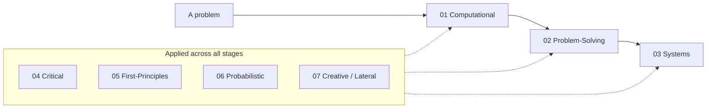

# Engineering Thinking Roadmap

> *"The hardest part of software is not writing code. It is deciding what to write, why, and whether the idea in your head survives contact with reality."*

This roadmap is about **the thinking that happens before, around, and between the keystrokes** — the cognitive disciplines that separate someone who can write code from someone who can solve problems with it. Where [Software Engineering](../../Software-Engineering/) teaches you how to *write* code well, this teaches you how to *reason* well about the problem the code is meant to solve.

> Looking for the *craft* of refactoring, design patterns, and anti-patterns? See [Software Engineering](../../Software-Engineering/).
>
> Looking for *object-oriented* modeling thought (tell-don't-ask, CRC cards)? That now lives here as [08 — Object Thinking](08-object-thinking/). For the broader OO paradigm see [Object-Oriented Programming](../../Software-Engineering/object-oriented-programming/README.md).
>
> Looking for *diagnostics and observability* (debugging, logging, tracing, metrics, incident response)? That lives here as [11 — Diagnostics & Observability Thinking](11-diagnostics-and-observability-thinking/).

---

## Why a Dedicated Roadmap

Most engineering failures are not failures of typing — they are failures of thought: the wrong problem solved correctly, a confident decision built on an unexamined assumption, a local optimization that broke the system, a "rare" edge case that was never rare. None of these are fixed by knowing another language or framework. They are fixed by sharper thinking.

These disciplines are cross-cutting and language-agnostic. They apply equally to a one-line bug fix and a multi-year platform migration, and they compound: an engineer who thinks in feedback loops, base rates, and first principles makes better decisions *every single day*, not just in interviews.

| Roadmap | Question it answers |
|---|---|
| [Software Engineering](../../Software-Engineering/) | How do I write code that doesn't smell? |
| **Engineering Thinking** (this) | How do I reason about the problem before I reach for a solution? |

---

## Sections

| # | Topic | Focus |
|---|---|---|
| [01](01-computational-thinking/) | Computational Thinking | Decomposition, pattern recognition, abstraction, modeling a problem in code |
| [02](02-problem-solving/) | Problem-Solving | Pólya's method — understand, plan, execute, reflect; debugging as inquiry; getting unstuck |
| [03](03-systems-thinking/) | Systems Thinking | Emergence, feedback loops, second-order effects, tradeoffs, leverage points |
| [04](04-critical-thinking/) | Critical Thinking | Claims vs evidence, logical fallacies, cognitive biases, objective tradeoff evaluation |
| [05](05-first-principles-thinking/) | First-Principles Thinking | Reasoning from fundamentals, questioning assumptions, rebuilding from scratch |
| [06](06-probabilistic-thinking/) | Probabilistic Thinking | Reasoning under uncertainty, base rates, expected value, risk and estimation |
| [07](07-creative-and-lateral-thinking/) | Creative & Lateral Thinking | Divergent vs convergent, inversion, analogy, constraint-driven creativity |
| [08](08-object-thinking/) | Object Thinking | Behavior-first mindset, tell-don't-ask, responsibility-driven design, CRC cards, anthropomorphism, when it fails |
| [09](09-scientific-and-hypothesis-driven/) | Scientific & Hypothesis-Driven | Hypotheses, experiments and A/B testing, falsifiability, spikes and prototypes |
| [10](10-metacognition-and-learning/) | Metacognition & Learning | Debugging your own reasoning, deliberate practice, knowing what you don't know |
| [11](11-diagnostics-and-observability-thinking/) | Diagnostics & Observability Thinking | Debugging, logging, error handling, metrics, tracing, crash reporting, diagnostic endpoints, panic/recovery, post-mortem analysis, audit logging, continuous profiling, dynamic instrumentation, telemetry cost & sampling |

---

## How the Sections Relate

The seven disciplines are not a strict sequence — you use them in combination — but they form a rough progression from *narrow* to *broad*:

- **01–02** are about a single problem in front of you: break it down (computational), then work it through (problem-solving).
- **03** widens the lens to the *system* the problem lives in, where parts interact and consequences ripple.
- **04–07** are the *quality controls and idea generators* you apply across all of the above: think critically so you don't fool yourself (04), reason from first principles so you don't cargo-cult (05), reason probabilistically so you don't mistake the likely for the certain (06), and think laterally so you don't miss the better solution entirely (07).

---

## Scope & Deduplication

This roadmap deliberately stays in the *thinking* lane and defers technique to its proper home:

| Looks similar to | But here we cover | The technique lives in |
|---|---|---|
| `01/03-abstraction-and-generalization` | abstraction *as a way of thinking* | [Software Engineering](../../Software-Engineering/) — abstraction in code |
| `02/05-debugging-as-problem-solving` | the *mindset* of inquiry under failure | [11 — Diagnostics & Observability Thinking → Debugging](11-diagnostics-and-observability-thinking/01-debugging/) (the practice side) |

---

## Status

Skeleton — topic folders are scaffolded; content is written per topic following the Code Craft file convention (`junior.md` → `middle.md` → `senior.md` → `professional.md`, plus practice files). All content in **English**.
