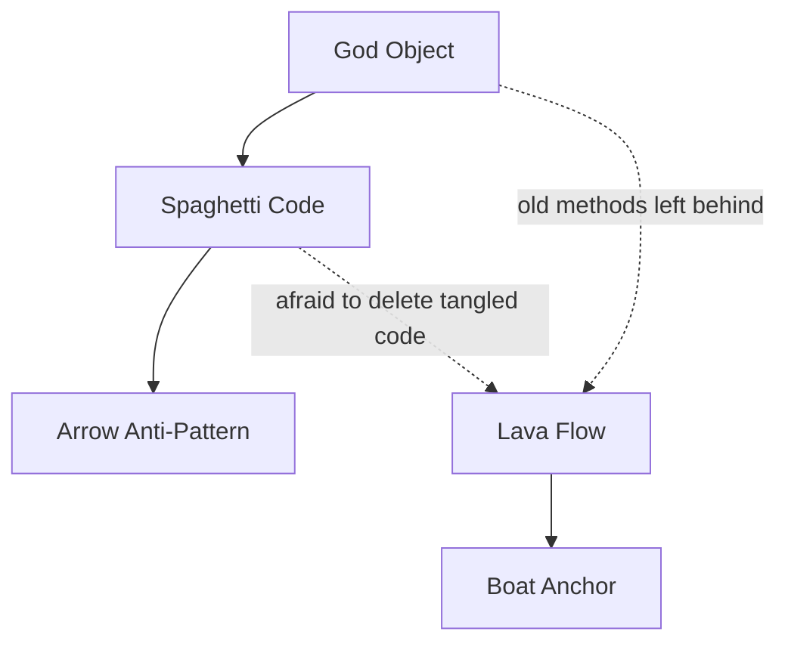

# Bad Structure Anti-Patterns — Junior Level

> **Category:** [Development Anti-Patterns](../README.md) → **Bad Structure** — *code that has grown into a shape that resists change.*
> **Covers (collectively):** God Object · Spaghetti Code · Lava Flow · Boat Anchor · Arrow Anti-Pattern

---

## Table of Contents

1. [Introduction](#introduction)
2. [Prerequisites](#prerequisites)
3. [Glossary](#glossary)
4. [The Five at a Glance](#the-five-at-a-glance)
5. [God Object](#god-object)
6. [Spaghetti Code](#spaghetti-code)
7. [Lava Flow](#lava-flow)
8. [Boat Anchor](#boat-anchor)
9. [Arrow Anti-Pattern](#arrow-anti-pattern)
10. [How They Reinforce Each Other](#how-they-reinforce-each-other)
11. [A Quick Spotting Checklist](#a-quick-spotting-checklist)
12. [Common Mistakes](#common-mistakes)
13. [Test Yourself](#test-yourself)
14. [Cheat Sheet](#cheat-sheet)
15. [Summary](#summary)
16. [Further Reading](#further-reading)
17. [Related Topics](#related-topics)

---

## Introduction

> Focus: **What does it look like?** and **Why is it bad?**

Every anti-pattern in this file shares one root symptom: **the code has a shape that fights you when you try to change it.** You open a file to fix a small bug and discover the change ripples into ten places, or you can't even find where the logic lives, or you're afraid to delete code because nobody knows what it does.

That feeling — *"I don't want to touch this"* — is the human signal of bad structure. The five anti-patterns here are the named, recognizable shapes that produce it:

- **God Object** — one class that does everything.
- **Spaghetti Code** — control flow with no recognizable structure.
- **Lava Flow** — fossilized dead code nobody dares delete.
- **Boat Anchor** — code kept "just in case" but never used.
- **Arrow Anti-Pattern** — deeply nested `if`s forming a `→` shape.

At the junior level your goal is simply to **recognize each shape on sight** and understand **why** it makes code expensive to change. You don't need to fix large systems yet — that's `senior.md`. You need to stop *creating* these shapes in the code you write today.

> **The mindset shift:** code is read far more often than it is written, and changed far more often than it is read once. "It works" is the floor, not the goal. Structure is what lets the *next* change — yours, next week — stay cheap.

---

## Prerequisites

- **Required:** You can read and write functions, classes, and conditionals in at least one language (examples here use Go, Java, and Python).
- **Required:** You understand what a *responsibility* is — the one job a function or class is supposed to do.
- **Helpful:** Basic familiarity with `git` (Lava Flow and Boat Anchor are partly about trusting version control instead of keeping dead code around).
- **Helpful:** You've felt the pain at least once — edited code and broke something far away from your change. That pain is what these anti-patterns explain.

---

## Glossary

| Term | Definition |
|------|-----------|
| **Anti-pattern** | A recurring "solution" that looks reasonable but reliably produces bad outcomes — fragile, coupled, hard-to-change code. |
| **Responsibility** | The single reason a unit of code should change. A class with many responsibilities changes for many reasons. |
| **Coupling** | How much one piece of code depends on another. High coupling means a change here forces a change there. |
| **Cohesion** | How well the parts of a unit belong together. A cohesive class does one focused job. |
| **Control flow** | The path execution takes through your code — the branches, loops, and calls. Spaghetti and Arrow are control-flow shapes. |
| **Guard clause** | An early `return` / `continue` that handles an edge case up front so the main logic isn't nested. The cure for Arrow code. |
| **Dead code** | Code that can never run, or runs but has no effect. The substance of Lava Flow and Boat Anchor. |
| **Cyclomatic complexity** | A rough count of the independent paths through a function. More branches → higher number → harder to test and read. |

---

## The Five at a Glance

| Anti-pattern | One-line symptom | The smell you feel |
|---|---|---|
| **God Object** | One class knows and does everything | "Everything imports `Manager`." |
| **Spaghetti Code** | Tangled flow, no structure | "I can't follow what calls what." |
| **Lava Flow** | Fossilized code nobody understands | "Don't touch it, it might be load-bearing." |
| **Boat Anchor** | Unused code kept "just in case" | "We might need this someday." |
| **Arrow Anti-Pattern** | Deep `if`-nesting, `→` shape | "The real logic is 8 indents deep." |

These are **structural** anti-patterns: you spot them by the *shape* of the code, not by a single bad line. Read each section below for the shape, a concrete example, and the junior-level fix.

---

## God Object

### What it looks like

A **God Object** (or God Class) is a single class that has accumulated dozens of responsibilities. It talks to the database, formats output, validates input, sends emails, and holds business rules — all in one place. It's usually the biggest file in the repo and named something like `Manager`, `Helper`, `Util`, `Service`, or `Engine`.

```java
// Java — a God Object in the wild
public class OrderManager {
    // ... 2,400 lines ...

    public void createOrder(...) { /* validation + DB + pricing */ }
    public void chargeCard(...) { /* payment gateway calls */ }
    public void sendConfirmationEmail(...) { /* SMTP */ }
    public String renderInvoiceHtml(...) { /* templating */ }
    public void exportToCsv(...) { /* file I/O */ }
    public boolean isInventoryAvailable(...) { /* warehouse logic */ }
    public void applyLoyaltyPoints(...) { /* marketing rules */ }
    public void logAuditTrail(...) { /* logging */ }
    // ... 40 more methods, 18 fields ...
}
```

### Why it's bad

- **Every change touches it.** Payments, email, pricing, and reporting all live here, so almost every feature edits the same file — guaranteeing merge conflicts and accidental breakage.
- **It can't be tested in isolation.** To test order creation you must wire up email, payments, and the database, because they're all entangled.
- **Nobody understands it whole.** 2,400 lines exceed what a person can hold in their head, so changes are made by guessing.
- **It violates the [Single Responsibility Principle](../../../clean-code/09-classes/README.md):** a class should have one reason to change; this one has forty.

### The junior-level fix

Split by responsibility. Each "and" in the description is a hint at a new class.

```java
// Each collaborator owns one job; OrderService coordinates them.
class OrderValidator { /* validation only */ }
class PaymentGateway { /* charging only */ }
class EmailSender    { /* email only */ }
class InvoiceRenderer{ /* rendering only */ }

class OrderService {
    OrderService(OrderValidator v, PaymentGateway p, EmailSender e) { /* inject */ }
    void createOrder(Order o) {
        validator.validate(o);
        payment.charge(o);
        email.sendConfirmation(o);
    }
}
```

> **Smell test:** if you describe a class and the sentence needs the word *"and"* more than once — *"it validates the order **and** charges the card **and** sends email"* — it's becoming a God Object.

---

## Spaghetti Code

### What it looks like

**Spaghetti Code** has control flow that tangles across functions and files with no recognizable structure. Reading it top to bottom doesn't reveal the logic; execution jumps around through flags, shared mutable state, and functions that secretly depend on the order they're called in.

```python
# Python — spaghetti: behavior controlled by scattered flags and order-of-calls
state = {}

def step1(data):
    state['parsed'] = parse(data)
    state['ready'] = True          # secret signal to step3

def step3():
    if state.get('ready'):         # only works if step1 ran first
        if state.get('valid'):     # ...and step2 set this
            do_the_thing(state['parsed'])
        else:
            state['retry'] = True  # step5 reads this, somewhere

def step2():
    state['valid'] = check(state['parsed'])  # crashes if step1 didn't run
```

You can't call these functions in any obvious order, and the real "program" is the implicit sequence in someone's head.

### Why it's bad

- **No locality.** To understand any one function you must understand all of them, because they communicate through hidden shared state.
- **Fragile to reorder.** Move one line and behavior breaks in a distant place.
- **Untestable.** A function only works inside a precise global setup, so unit tests are nearly impossible.

### The junior-level fix

Make data flow **explicit** — pass values in and return values out, instead of mutating shared state. Replace flags with a clear sequence.

```python
def run(data):
    parsed = parse(data)               # input → output
    if not is_valid(parsed):           # explicit decision
        return retry(parsed)
    return do_the_thing(parsed)        # linear, readable, testable
```

> **Smell test:** if you can't tell what a function needs without reading three other functions, the structure is spaghetti.

---

## Lava Flow

### What it looks like

**Lava Flow** is dead-but-fossilized code: blocks, files, or whole modules that nobody understands, nobody can confidently explain, and therefore nobody dares delete. It often comes with nervous comments.

```go
// Go — classic lava flow
// TODO: figure out why this is here. DO NOT REMOVE — broke prod in 2019??
// legacy path, kept for "compatibility" — Sergey, maybe?
func recalcLegacy(x int) int {
    tmp := x * 2
    _ = tmp // unused, but removing it "felt risky"
    return oldFormula(x)
}
```

The name comes from molten lava that hardens into rock before anyone decides where it should go — then it's permanent.

### Why it's bad

- **It grows.** Each developer adds *around* the scary code instead of through it, so the fossil layer thickens.
- **It misleads.** Readers assume dead code is alive and reason about behavior that never executes.
- **It taxes everything.** Every search, refactor, and compile carries the dead weight.

### The junior-level fix

You have version control — **deleting is safe.** If code is unreachable or unexplained, find out via coverage and `git blame`, then delete it. The history keeps a copy forever.

```bash
git log -p path/to/file     # what was this, who added it, why
# if coverage shows it never runs and blame gives no reason → delete it
```

> **Smell test:** a comment that says *"don't remove this, not sure why it's here"* is a Lava Flow marker. Uncertainty is the disease; deletion (backed by git) is the cure.

---

## Boat Anchor

### What it looks like

A **Boat Anchor** is a piece of code, a library, a class, or even a whole subsystem kept around "just in case" or "we might need it later" — but never actually used. Unlike Lava Flow (which people are *afraid* to delete), a Boat Anchor is something people *intend* to use someday and never do.

```go
// Go — a boat anchor: a fully-built abstraction with zero call sites
type ReportExporter interface {
    ExportPDF(r Report) error
    ExportXLSX(r Report) error
    ExportXML(r Report) error   // nobody has ever asked for XML
}

// 300 lines implementing all three formats.
// The app only ever calls ExportPDF. The rest is ballast.
```

### Why it's bad

- **Maintenance cost with no benefit.** The unused code still needs to compile, gets refactored "for consistency," and shows up in every search.
- **False signals.** New developers assume the XML exporter is used and important.
- **It rots.** Unused code isn't exercised by tests or real traffic, so it quietly breaks and nobody notices until someone finally tries to use it.

### The junior-level fix

Delete what isn't used. You aren't losing it — it's in git, retrievable the day a real requirement appears (and by then you'll build it better, against a real need).

> **Smell test:** "We might need this someday" is the Boat Anchor's catchphrase. *Someday* is not a requirement. [YAGNI](../03-over-engineering/junior.md) — You Aren't Gonna Need It.

---

## Arrow Anti-Pattern

### What it looks like

The **Arrow Anti-Pattern** is deeply nested `if`/`else` blocks that push the real logic far to the right, creating an arrowhead `→` shape. The interesting code is buried at the deepest indent; everything around it is gatekeeping.

```go
// Go — arrow code: the real work is 5 levels deep
func process(u *User) error {
    if u != nil {
        if u.Active {
            if u.HasPermission("write") {
                if u.Quota > 0 {
                    if validate(u.Payload) {
                        return doWork(u)          // ← the only line that matters
                    } else {
                        return errors.New("invalid payload")
                    }
                } else {
                    return errors.New("no quota")
                }
            } else {
                return errors.New("no permission")
            }
        } else {
            return errors.New("inactive")
        }
    }
    return errors.New("nil user")
}
```

### Why it's bad

- **High cognitive load.** To read the success path you must mentally track five open conditions at once.
- **Easy to mismatch braces / `else`s,** and easy to add a sixth condition that makes it worse.
- **The happy path is hidden** at the bottom of a pyramid instead of being obvious.

### The junior-level fix

Use **guard clauses**: handle each failure condition first and `return` early. The main logic drops back to the left, flat and obvious.

```go
func process(u *User) error {
    if u == nil               { return errors.New("nil user") }
    if !u.Active              { return errors.New("inactive") }
    if !u.HasPermission("write") { return errors.New("no permission") }
    if u.Quota <= 0           { return errors.New("no quota") }
    if !validate(u.Payload)   { return errors.New("invalid payload") }
    return doWork(u)          // happy path, flat and last
}
```

> **Smell test:** if your code indents further and further to the right and the meaningful line is the deepest one, flip it into guard clauses.

---

## How They Reinforce Each Other

Bad-structure anti-patterns rarely appear alone — they pull each other in like gravity wells:



- A **God Object** has so many intertwined methods that its internal flow becomes **Spaghetti**.
- Spaghetti is hard to follow, so conditionals pile up into **Arrow** code.
- When a feature is replaced, the old tangled code is too scary to remove → it becomes **Lava Flow**.
- Abstractions built "for later" that the God Object never adopts become **Boat Anchors**.

The practical lesson: fixing one often requires recognizing the others. They're symptoms of the same underlying habit — *adding code is easier than shaping it.*

---

## A Quick Spotting Checklist

Run this over any file you touch this week:

- [ ] Is one class far bigger than the others, imported almost everywhere? → **God Object**
- [ ] Can I tell what a function needs *without* reading other functions? If no → **Spaghetti**
- [ ] Is there code with comments like "don't remove, not sure why"? → **Lava Flow**
- [ ] Is there a class/feature/library with zero real call sites? → **Boat Anchor**
- [ ] Does the indentation march steadily rightward toward the real logic? → **Arrow**

If you check any box, you've found a refactoring opportunity — and probably a smaller, safer change than you fear.

---

## Common Mistakes

Mistakes juniors make *about* these anti-patterns (not just the patterns themselves):

1. **Thinking "it works, so it's fine."** Working code can still be unchangeable code. The cost of bad structure is paid by the *next* edit, not this run.
2. **Keeping dead code "to be safe."** Git is the safety net. Commented-out blocks and unused classes are Lava Flow and Boat Anchors in the making.
3. **Solving Arrow code by adding more `else`s.** Adding branches deepens the pyramid. Guard clauses *flatten* it.
4. **Confusing "big file" with "God Object."** A long file of cohesive, single-purpose functions is fine. The problem is many *unrelated responsibilities*, not line count alone.
5. **Refactoring without tests.** Changing structure without a safety net turns one anti-pattern into a bug. Get a test around the behavior first (more in `senior.md`).
6. **Treating naming as cosmetic.** `Manager`/`Util`/`Helper` names are God-Object magnets — vague names invite vague responsibilities.

---

## Test Yourself

1. Name the five Bad-Structure anti-patterns and give the one-line symptom of each.
2. Your teammate's class is called `UserHelper` and has 35 methods touching auth, email, billing, and reporting. Which anti-pattern is this, and what's the first step to fix it?
3. What is the difference between **Lava Flow** and a **Boat Anchor**? (Hint: it's about *why* the dead code is still there.)
4. Rewrite this into guard clauses:
   ```go
   func canEnter(u *User) bool {
       if u != nil {
           if u.Age >= 18 {
               if u.HasTicket {
                   return true
               }
           }
       }
       return false
   }
   ```
5. A function works perfectly and passes all tests, but every coworker says "ugh" when they have to edit it. Is there still a problem? Why?

<details>
<summary>Answers</summary>

1. **God Object** (one class does everything), **Spaghetti Code** (tangled flow), **Lava Flow** (fossilized code nobody dares delete), **Boat Anchor** (unused code kept "just in case"), **Arrow Anti-Pattern** (deep `if`-nesting).
2. **God Object.** First step: list its responsibilities (auth, email, billing, reporting) and extract each into its own focused class, leaving a thin coordinator.
3. **Lava Flow** = code nobody dares delete because nobody *understands* it (fear born of ignorance). **Boat Anchor** = code deliberately kept for a future that never arrives (fear born of "maybe later"). Both are dead; the difference is the reason it survives.
4. ```go
   func canEnter(u *User) bool {
       if u == nil      { return false }
       if u.Age < 18    { return false }
       return u.HasTicket
   }
   ```
5. **Yes, there's still a problem.** "Works + passes tests" is correctness. The "ugh" is the signal of bad structure — high change-cost. The code will slow down every future feature and invite bugs when someone finally has to modify it.

</details>

---

## Cheat Sheet

| Anti-pattern | Spot it by | Fix it with |
|---|---|---|
| **God Object** | One huge class, imported everywhere, many `and`s in its description | Extract responsibilities into focused classes ([SRP](../../../clean-code/09-classes/README.md)) |
| **Spaghetti Code** | Hidden shared state, order-dependent calls | Explicit data in/out; linear, returnable functions |
| **Lava Flow** | "Don't remove, not sure why" comments | Coverage + `git blame`, then delete (git keeps history) |
| **Boat Anchor** | Zero call sites, "might need it later" | Delete; rebuild when a real requirement appears |
| **Arrow Anti-Pattern** | Indentation marching right; deepest line is the point | Guard clauses + early `return` |

> **One rule to remember:** *Code is changed more often than it's written. Optimize for the next change, not just this run.*

---

## Summary

- **Bad-structure anti-patterns** are recognizable *shapes* that make code expensive to change. The human signal is "I don't want to touch this."
- **God Object** centralizes too many responsibilities; **Spaghetti** loses all structure; **Lava Flow** fossilizes unexplained dead code; **Boat Anchor** hoards unused code; **Arrow** buries logic under nested `if`s.
- At the junior level your job is to **recognize each shape** and **avoid creating it** — split by responsibility, make data flow explicit, trust git enough to delete, and flatten conditionals with guard clauses.
- They reinforce each other, so a real codebase usually shows several at once. That's normal — start with the one in the file you're editing today.
- Next: [`middle.md`](middle.md) — *when these creep in during real projects, and what to do instead before they take root.*

---

## Further Reading

- **AntiPatterns: Refactoring Software, Architectures, and Projects in Crisis** — Brown, Malveau, McCormick, Mowbray (1998) — the canonical catalog.
- **Refactoring** — Martin Fowler (2nd ed. 2018) — Extract Method, Extract Class, Replace Nested Conditional with Guard Clauses.
- **Clean Code** — Robert C. Martin (2008) — Chapters on Functions and Classes.
- **The Pragmatic Programmer** — Hunt & Thomas (20th anniv. ed., 2019) — "Don't Live with Broken Windows," DRY, the case for deleting code.

---

## Related Topics

- [Clean Code → Classes](../../../clean-code/09-classes/README.md) — the Single Responsibility cure for God Objects.
- [Clean Code → Functions](../../../clean-code/02-functions/README.md) — small functions and guard clauses.
- [Refactoring → Code Smells](../../../refactoring/01-code-smells/README.md) — the smell-level view (Large Class, Long Method).
- [Bad Shortcuts](../02-bad-shortcuts/junior.md) — the sibling category: convenience that compounds.
- [Over-Engineering](../03-over-engineering/junior.md) — YAGNI and the case against Boat Anchors and Speculative Generality.
