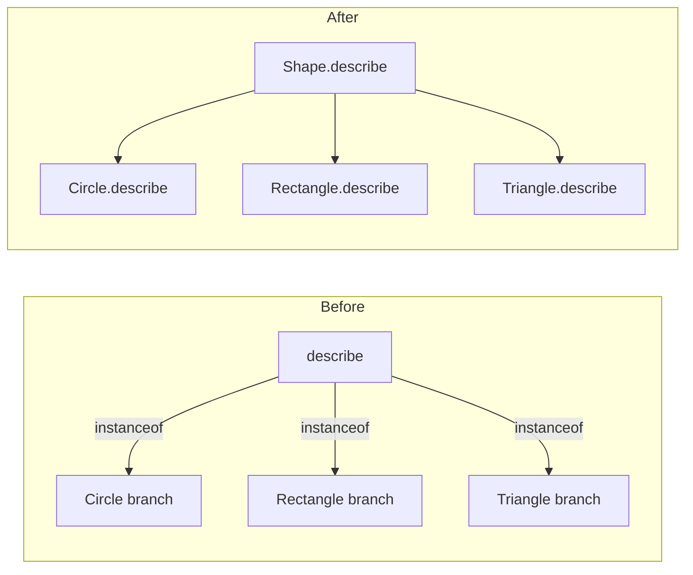
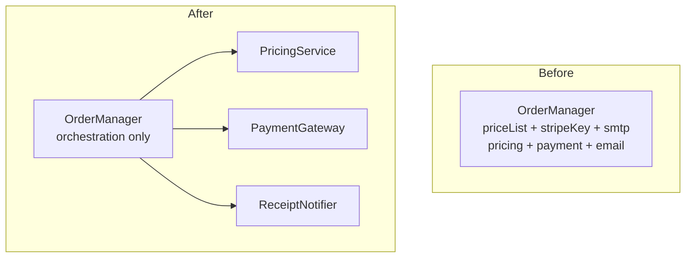
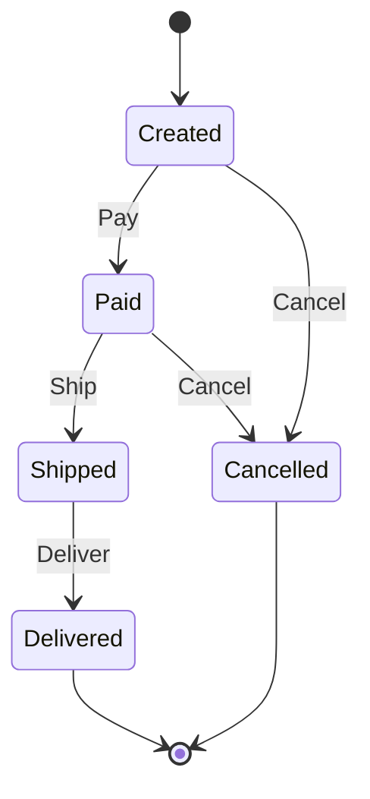

# Bad Structure Anti-Patterns — Refactoring Practice

> **Category:** [Development Anti-Patterns](../README.md) → **Bad Structure** — *code that has grown into a shape that resists change.*
> **Covers (collectively):** God Object · Spaghetti Code · Lava Flow · Boat Anchor · Arrow Anti-Pattern

---

These are not "spot the smell" puzzles — [`find-bug.md`](find-bug.md) does that. Here the code is **structurally bad but already working**, and your job is to **transform it into clean code without changing behavior**. The skill on display is the *process*, not the destination:

1. **Pin behavior first.** Write a *characterization test* — a test that records what the code does *now*, bugs included. You are freezing behavior, not blessing it.
2. **Take small, reversible steps.** One named refactoring at a time (Extract Method, Extract Class, …), tests green after each, commit.
3. **Separate structural from behavioral commits.** A refactor must preserve behavior; if a test goes red, the last step is the culprit — revert it.

Each worked solution names the **canonical refactoring moves** (from Fowler's *Refactoring* and Feathers' *Working Effectively with Legacy Code*) so you build the vocabulary, not just the instinct.

> **How to use this file:** read the "Before" code, write down the move sequence *yourself* before expanding the solution, then compare. The gap between your plan and the worked plan is where the learning is.

---

## Table of Contents

| # | Exercise | Anti-pattern(s) | Lang | Key moves |
|---|---|---|---|---|
| 1 | [Flatten the validation tower](#exercise-1--flatten-the-validation-tower) | Arrow | Go | Replace Nested Conditional with Guard Clauses |
| 2 | [Kill the boolean-flag function](#exercise-2--kill-the-boolean-flag-function) | Spaghetti | Java | Split Function, Remove Flag Argument |
| 3 | [Extract a method from a long block](#exercise-3--extract-a-method-from-a-long-block) | Spaghetti | Python | Extract Function, Introduce Explaining Variable |
| 4 | [Delete the boat anchor](#exercise-4--delete-the-boat-anchor) | Boat Anchor | Go | Inline Class / safe deletion with evidence |
| 5 | [Prove and remove lava flow](#exercise-5--prove-and-remove-lava-flow) | Lava Flow | Python | Evidence-driven dead-code removal |
| 6 | [Replace the type-switch arrow](#exercise-6--replace-the-type-switch-arrow) | Arrow + Spaghetti | Java | Replace Conditional with Polymorphism |
| 7 | [Table-driven dispatch](#exercise-7--table-driven-dispatch) | Arrow | Go | Replace Conditional with Lookup Table |
| 8 | [Introduce a parameter object](#exercise-8--introduce-a-parameter-object) | Spaghetti | Python | Introduce Parameter Object, Preserve Whole Object |
| 9 | [Split the God Object](#exercise-9--split-the-god-object) | God Object | Java | Extract Class, Move Method, Dependency Injection |
| 10 | [Untangle shared mutable state](#exercise-10--untangle-shared-mutable-state) | Spaghetti | Python | Combine Functions into Pipeline, Remove Global |
| 11 | [Spaghetti → explicit state machine](#exercise-11--spaghetti--explicit-state-machine) | Spaghetti | Go | Replace State-Flags with State Machine |
| 12 | [Strangler-fig a God Object module](#exercise-12--strangler-fig-a-god-object-module) | God Object + Lava Flow | Python | Strangler Fig, Branch by Abstraction |
| 13 | [The full combo cleanup](#exercise-13--the-full-combo-cleanup) | All five | Go | The whole toolbox, in order |

---

## Exercise 1 — Flatten the validation tower

**Anti-pattern:** Arrow. **Goal:** flatten the nesting so the happy path is obvious. **Constraints:** identical return values for every input; no behavior change.

```go
// Before — Arrow: the success line is 5 indents deep.
func Withdraw(acc *Account, amount int) (int, error) {
	if acc != nil {
		if !acc.Frozen {
			if amount > 0 {
				if amount <= acc.Balance {
					if acc.DailyWithdrawn+amount <= acc.DailyLimit {
						acc.Balance -= amount
						acc.DailyWithdrawn += amount
						return acc.Balance, nil
					} else {
						return 0, errors.New("daily limit exceeded")
					}
				} else {
					return 0, errors.New("insufficient funds")
				}
			} else {
				return 0, errors.New("amount must be positive")
			}
		} else {
			return 0, errors.New("account frozen")
		}
	}
	return 0, errors.New("nil account")
}
```

<details>
<summary>Refactored</summary>

**Move sequence**

1. **Characterize.** One table-driven test covering each error branch plus the success path — record the exact error strings the function returns today.
2. **Replace Nested Conditional with Guard Clauses.** Invert each outer condition into an early `return` for the failure case. Work outside-in: the outermost `if acc != nil` becomes the first guard.
3. The last surviving `else` (the two-line success body) drops to the left as the function's tail.
4. Run tests after *each* inverted condition — five tiny green steps, not one big edit.

```go
// After — guard clauses; happy path is flat and last.
func Withdraw(acc *Account, amount int) (int, error) {
	if acc == nil {
		return 0, errors.New("nil account")
	}
	if acc.Frozen {
		return 0, errors.New("account frozen")
	}
	if amount <= 0 {
		return 0, errors.New("amount must be positive")
	}
	if amount > acc.Balance {
		return 0, errors.New("insufficient funds")
	}
	if acc.DailyWithdrawn+amount > acc.DailyLimit {
		return 0, errors.New("daily limit exceeded")
	}

	acc.Balance -= amount
	acc.DailyWithdrawn += amount
	return acc.Balance, nil
}
```

**What improved & how to verify.** Nesting depth drops from 5 to 1 (path count unchanged), so each precondition is readable in isolation and the success path is unmistakable. **Verify** with the characterization test: every branch returns byte-for-byte the same `(int, error)` as before. Guard-clause inversion is mechanical, so a passing test is strong evidence behavior is preserved.

</details>

---

## Exercise 2 — Kill the boolean-flag function

**Anti-pattern:** Spaghetti (flag-driven). **Goal:** remove the boolean parameters so each behavior has its own clear entry point. **Constraints:** preserve all four current behaviors; callers may be updated.

```java
// Before — three booleans = up to 8 paths in one body.
void notify(User user, boolean isUrgent, boolean asSms, boolean dryRun) {
    String channel = asSms ? "sms" : "email";
    String prefix  = isUrgent ? "[URGENT] " : "";
    String body    = prefix + render(user);

    if (dryRun) {
        log.info("would send via {} to {}: {}", channel, user.contact(channel), body);
        return;
    }
    if (asSms) {
        sms.send(user.phone(), body);
    } else {
        email.send(user.email(), body, isUrgent ? Priority.HIGH : Priority.NORMAL);
    }
}
```

<details>
<summary>Refactored</summary>

**Move sequence**

1. **Characterize.** A test per flag combination that actually occurs at call sites (find them first — `grep` for `notify(`). Don't test combinations no caller uses; that over-specifies.
2. **Extract Function** for the shared body-building (`buildBody`) so it isn't duplicated across the split functions.
3. **Remove Flag Argument** (Fowler) one flag at a time: split `notify` on `asSms` into `notifyEmail` / `notifySms`. Re-run callers/tests. Then split on `isUrgent` by lifting it to a parameter that only affects priority. `dryRun` becomes a separate `previewNotification` (or a decorator).
4. Update call sites to the explicit functions; delete the old `notify`.

```java
// After — intent is in the function name, not in a boolean soup.
String buildBody(User user, boolean urgent) {
    return (urgent ? "[URGENT] " : "") + render(user);
}

void notifyEmail(User user, Priority priority) {
    email.send(user.email(), buildBody(user, priority == Priority.HIGH), priority);
}

void notifySms(User user, boolean urgent) {
    sms.send(user.phone(), buildBody(user, urgent));
}

// dry-run is a cross-cutting concern, not a behavior flag:
void previewEmail(User user, Priority priority) {
    log.info("would email {}: {}", user.email(), buildBody(user, priority == Priority.HIGH));
}
```

**What improved & how to verify.** Illegal/meaningless combinations (`asSms=true` *and* an email `Priority`) can no longer be expressed — the type system now rejects them. Each function has a single path. **Verify** by routing the original combinations through the new functions in the characterization test and asserting the same `sms.send` / `email.send` interactions (use a mock/spy). The `dryRun` split is the one place to double-check: confirm the log message is unchanged.

</details>

---

## Exercise 3 — Extract a method from a long block

**Anti-pattern:** Spaghetti (Long Method). **Goal:** decompose a 40-line procedure into named steps. **Constraints:** same return value; same side effects in the same order.

```python
# Before — one function doing parse + validate + transform + summarize.
def process_orders(rows):
    total = 0
    valid = []
    for r in rows:
        parts = r.strip().split(",")
        if len(parts) != 3:
            continue
        oid, qty_s, price_s = parts
        if not qty_s.isdigit():
            continue
        qty = int(qty_s)
        try:
            price = float(price_s)
        except ValueError:
            continue
        if qty <= 0 or price <= 0:
            continue
        line_total = qty * price
        if line_total > 10000:
            line_total *= 0.95  # bulk discount
        total += line_total
        valid.append({"id": oid, "qty": qty, "total": round(line_total, 2)})
    return {"orders": valid, "grand_total": round(total, 2)}
```

<details>
<summary>Refactored</summary>

**Move sequence**

1. **Characterize.** Feed a fixture list covering: malformed row, non-numeric qty, bad price, zero qty, a normal order, and a >10000 order that triggers the discount. Snapshot the returned dict.
2. **Extract Function** `parse_row(r)` returning a `(oid, qty, price)` tuple or `None` for invalid rows — this isolates the four `continue` rejections.
3. **Extract Function** `line_total(qty, price)` carrying the bulk-discount rule (one place to find it).
4. **Introduce Explaining Variable** is unnecessary once names exist; the loop body becomes three readable lines.

```python
# After — each step is named and independently testable.
def process_orders(rows):
    valid, total = [], 0.0
    for r in rows:
        parsed = parse_row(r)
        if parsed is None:
            continue
        oid, qty, price = parsed
        amount = line_total(qty, price)
        total += amount
        valid.append({"id": oid, "qty": qty, "total": round(amount, 2)})
    return {"orders": valid, "grand_total": round(total, 2)}

def parse_row(r):
    parts = r.strip().split(",")
    if len(parts) != 3:
        return None
    oid, qty_s, price_s = parts
    if not qty_s.isdigit():
        return None
    try:
        price = float(price_s)
    except ValueError:
        return None
    qty = int(qty_s)
    if qty <= 0 or price <= 0:
        return None
    return oid, qty, price

def line_total(qty, price):
    total = qty * price
    return total * 0.95 if total > 10000 else total  # bulk discount
```

**What improved & how to verify.** The top-level function now reads as a sentence; the discount rule and the parsing rules each have one home and their own unit tests. **Verify** with the snapshot test — the returned dict must be identical. Watch the **rounding order**: `round(amount, 2)` per line and `round(total, 2)` at the end must stay exactly where they were, or floating-point totals can drift by a cent.

</details>

---

## Exercise 4 — Delete the boat anchor

**Anti-pattern:** Boat Anchor. **Goal:** remove an abstraction built "for the future" that has zero real call sites. **Constraints:** no observable behavior change; don't break the build.

```go
// Before — a 3-format exporter interface; only PDF is ever called.
type ReportExporter interface {
	ExportPDF(r Report) ([]byte, error)
	ExportXLSX(r Report) ([]byte, error)
	ExportXML(r Report) ([]byte, error) // no caller, ever
}

type exporter struct{ tmpl *template.Template }

func (e *exporter) ExportPDF(r Report) ([]byte, error)  { /* used */ return renderPDF(e.tmpl, r) }
func (e *exporter) ExportXLSX(r Report) ([]byte, error) { /* 90 lines, no caller */ }
func (e *exporter) ExportXML(r Report) ([]byte, error)  { /* 70 lines, no caller */ }
```

<details>
<summary>Refactored</summary>

**Move sequence**

1. **Gather evidence the formats are unused.** Static call-site search across the whole module *and* its consumers:

   ```bash
   grep -rn "ExportXLSX\|ExportXML" --include="*.go" .
   go run golang.org/x/tools/cmd/deadcode@latest ./...
   ```

   Zero hits outside the definition + tests-of-itself ⇒ Boat Anchor confirmed. (A test that only tests the unused method does not count as a caller.)
2. **Delete the dead methods** and their now-unreferenced helpers, in one commit, with the evidence in the message.
3. **Inline Class / collapse the interface.** With one method left, the interface earns its keep *only* if a real seam needs it (a test fake, a published contract). If not, replace it with a concrete function.

```go
// After — only the capability that exists is kept.
func ExportPDF(tmpl *template.Template, r Report) ([]byte, error) {
	return renderPDF(tmpl, r)
}
```

**What improved & how to verify.** ~160 lines of untested, unexercised code (which would rot silently) are gone; the search/refactor/compile surface shrinks. **Verify**: the build still compiles, the PDF characterization test still passes, and `grep` confirms no references remain. The deleted code is recoverable from git the day a *real* XML requirement appears — and you'll build it better against an actual need (YAGNI). Keep this commit **structural-only**.

> **Boat Anchor vs Lava Flow:** here we *understood* the code and chose not to keep it (intentional ballast). The next exercise handles code nobody understands.

</details>

---

## Exercise 5 — Prove and remove lava flow

**Anti-pattern:** Lava Flow. **Goal:** safely delete a fossilized branch nobody understands. **Constraints:** you must produce *evidence* it's dead before deleting; behavior unchanged for live paths.

```python
# Before — a scary branch with a fear-comment. Is it alive?
def price_quote(cart, region):
    base = sum(i.price * i.qty for i in cart.items)

    # DO NOT REMOVE — legacy promo path, broke prod in 2019?? -- unknown
    if region == "LEGACY_EU" and cart.coupon == "SPRING07":
        base = _spring_2007_promo(base, cart)   # 120 lines, no docs

    if cart.coupon == "WELCOME":
        base *= 0.9
    return round(base, 2)
```

<details>
<summary>Refactored</summary>

**Move sequence — evidence before deletion**

1. **`git blame` / `git log` archaeology.** Find when `LEGACY_EU` + `SPRING07` was added and the linked ticket. If the promo ended in 2007 and the ticket is closed, the *reason* for keeping it is gone.
2. **Static reachability.** Check whether any code path can still set `region == "LEGACY_EU"`. `grep -rn "LEGACY_EU"` — if the only producer was a region migration finished years ago, the branch is unreachable.
3. **Runtime telemetry (the decisive step).** Don't trust reading alone. Add a counter and ship it:

   ```python
   if region == "LEGACY_EU" and cart.coupon == "SPRING07":
       metrics.increment("legacy.spring07_promo.hit")   # temporary probe
       base = _spring_2007_promo(base, cart)
   ```

   If it logs **zero hits over a meaningful window** (e.g., 30 days of real traffic spanning a billing cycle), it is dead.
4. **Delete in its own commit**, citing the evidence; delete `_spring_2007_promo` too once it has no other callers.

```python
# After — fossil removed; live discount path untouched.
def price_quote(cart, region):
    base = sum(i.price * i.qty for i in cart.items)
    if cart.coupon == "WELCOME":
        base *= 0.9
    return round(base, 2)
```

**What improved & how to verify.** Readers no longer reason about a branch that never runs; 120 undocumented lines leave the codebase. **Verify**: characterization tests for the *live* paths (`WELCOME` and no-coupon) stay green; the telemetry zero-hit report is attached to the PR as the deletion's justification. The commit message records the evidence — *"removed legacy promo: 0 prod hits 30d, ticket PROJ-204 closed 2008, no region producer remains."* This is the disciplined cure for fear: replace uncertainty with measurement.

</details>

---

## Exercise 6 — Replace the type-switch arrow

**Anti-pattern:** Arrow + Spaghetti (type-switching). **Goal:** remove the `instanceof` ladder. **Constraints:** same rendered output; adding a new shape must not require editing the renderer.

```java
// Before — Arrow by type-switch; every new shape adds a branch.
String describe(Shape s) {
    if (s instanceof Circle) {
        Circle c = (Circle) s;
        if (c.radius() > 0) {
            return "circle area=" + (Math.PI * c.radius() * c.radius());
        } else {
            return "degenerate circle";
        }
    } else if (s instanceof Rectangle) {
        Rectangle r = (Rectangle) s;
        if (r.width() > 0 && r.height() > 0) {
            return "rect area=" + (r.width() * r.height());
        } else {
            return "degenerate rect";
        }
    } else if (s instanceof Triangle) {
        Triangle t = (Triangle) s;
        return "triangle area=" + (0.5 * t.base() * t.height());
    }
    throw new IllegalArgumentException("unknown shape");
}
```

<details>
<summary>Refactored</summary>

**Move sequence**

1. **Characterize.** A test per shape, including the degenerate (zero-dimension) cases and the unknown-shape exception. Snapshot exact strings.
2. **Replace Conditional with Polymorphism** (Fowler). Add `String describe()` to the `Shape` interface. **Move** each branch's body into the corresponding class's method — one class at a time, tests green after each move.
3. The free function collapses to a single dispatch (`s.describe()`); the `instanceof` ladder and casts disappear.

```java
// After — each type owns its behavior; renderer never changes again.
interface Shape {
    String describe();
}

final class Circle implements Shape {
    private final double radius;
    Circle(double radius) { this.radius = radius; }
    public String describe() {
        return radius > 0 ? "circle area=" + (Math.PI * radius * radius)
                          : "degenerate circle";
    }
}

final class Rectangle implements Shape {
    private final double width, height;
    Rectangle(double w, double h) { this.width = w; this.height = h; }
    public String describe() {
        return width > 0 && height > 0 ? "rect area=" + (width * height)
                                       : "degenerate rect";
    }
}

final class Triangle implements Shape {
    private final double base, height;
    Triangle(double b, double h) { this.base = b; this.height = h; }
    public String describe() { return "triangle area=" + (0.5 * base * height); }
}

// caller:
String out = shape.describe();
```



**What improved & how to verify.** Adding a `Hexagon` now means *adding a class*, not *editing the renderer* — Open/Closed in action. The degenerate-case `if`s shrink to one ternary inside each type. **Verify**: the per-shape snapshot strings are identical; the unknown-shape case is now impossible to reach (a non-`Shape` won't compile), which is a behavior *tightening* — note it in the PR so reviewers expect the removed `throw`.

</details>

---

## Exercise 7 — Table-driven dispatch

**Anti-pattern:** Arrow (value-based dispatch). **Goal:** replace a string-`switch` arrow with a handler table. **Constraints:** identical results; unknown command still errors.

```go
// Before — a growing switch ladder over command names.
func Handle(cmd string, args []string) (string, error) {
	if cmd == "add" {
		return strconv.Itoa(atoi(args[0]) + atoi(args[1])), nil
	} else if cmd == "sub" {
		return strconv.Itoa(atoi(args[0]) - atoi(args[1])), nil
	} else if cmd == "mul" {
		return strconv.Itoa(atoi(args[0]) * atoi(args[1])), nil
	} else if cmd == "neg" {
		return strconv.Itoa(-atoi(args[0])), nil
	} else {
		return "", fmt.Errorf("unknown command: %s", cmd)
	}
}
```

<details>
<summary>Refactored</summary>

**Move sequence**

1. **Characterize.** Test each command and the unknown-command error.
2. **Extract Function** for each arm so they share a signature `func([]string) (string, error)`.
3. **Replace Conditional with Lookup Table.** Build a `map[string]handler`; dispatch is a single lookup with an `ok` check preserving the unknown-command error.

```go
// After — adding a command = adding one map entry.
type handler func(args []string) (string, error)

var handlers = map[string]handler{
	"add": func(a []string) (string, error) { return strconv.Itoa(atoi(a[0]) + atoi(a[1])), nil },
	"sub": func(a []string) (string, error) { return strconv.Itoa(atoi(a[0]) - atoi(a[1])), nil },
	"mul": func(a []string) (string, error) { return strconv.Itoa(atoi(a[0]) * atoi(a[1])), nil },
	"neg": func(a []string) (string, error) { return strconv.Itoa(-atoi(a[0])), nil },
}

func Handle(cmd string, args []string) (string, error) {
	h, ok := handlers[cmd]
	if !ok {
		return "", fmt.Errorf("unknown command: %s", cmd)
	}
	return h(args)
}
```

**What improved & how to verify.** Cyclomatic complexity of `Handle` drops to ~2 regardless of command count; the dispatcher is closed for modification, open for extension via the table. **Verify**: the characterization test passes unchanged. One thing to confirm — Go map iteration order is random, but here we only *look up*, never *iterate*, so behavior is deterministic. Keep the table and the dispatcher edit in one structural commit.

</details>

---

## Exercise 8 — Introduce a parameter object

**Anti-pattern:** Spaghetti (long, order-sensitive parameter lists). **Goal:** group a clump of always-together parameters. **Constraints:** preserve computed result; reduce the chance of arg-order bugs.

```python
# Before — six positional params; easy to transpose at the call site.
def shipping_cost(weight, length, width, height, dest_zone, express):
    volume = length * width * height
    dim_weight = volume / 5000
    billable = max(weight, dim_weight)
    rate = 2.0 if dest_zone == "domestic" else 5.0
    cost = billable * rate
    if express:
        cost *= 1.5
    return round(cost, 2)

# call site (which one is width vs height again?)
shipping_cost(3.2, 40, 30, 20, "intl", True)
```

<details>
<summary>Refactored</summary>

**Move sequence**

1. **Characterize.** Test domestic/intl × express/standard, plus a case where dimensional weight dominates actual weight.
2. **Introduce Parameter Object** (Fowler): the three dimensions always travel together and define a concept — `Parcel`. Group them.
3. **Preserve Whole Object** / move the derived `volume` and `dim_weight` onto `Parcel` as properties, so the formula lives with its data.

```python
# After — cohesive value object; the call site is self-describing.
from dataclasses import dataclass

@dataclass(frozen=True)
class Parcel:
    weight: float
    length: float
    width: float
    height: float

    @property
    def volume(self) -> float:
        return self.length * self.width * self.height

    @property
    def billable_weight(self) -> float:
        return max(self.weight, self.volume / 5000)

def shipping_cost(parcel: Parcel, dest_zone: str, express: bool) -> float:
    rate = 2.0 if dest_zone == "domestic" else 5.0
    cost = parcel.billable_weight * rate
    if express:
        cost *= 1.5
    return round(cost, 2)

# call site — impossible to transpose length/width silently:
shipping_cost(Parcel(weight=3.2, length=40, width=30, height=20), "intl", express=True)
```

**What improved & how to verify.** A six-arg positional list (where transposing `width`/`height` is a silent bug) becomes a named, immutable object with the weight math attached. **Verify**: identical `round(cost, 2)` for every characterized case. The `frozen=True` dataclass adds immutability for free — note it's a minor *behavioral* strengthening (no accidental mutation), acceptable here because no caller mutated the dims.

</details>

---

## Exercise 9 — Split the God Object

**Anti-pattern:** God Object. **Goal:** split a class with three unrelated field-clusters into cohesive collaborators, wired by dependency injection. **Constraints:** preserve the public `checkout()` behavior and its side effects; callers of `checkout()` must not change.

```java
// Before — one class does pricing, payment, and notification.
public class OrderManager {
    private final Map<String,Double> priceList;
    private final String stripeKey;
    private final SmtpClient smtp;

    public OrderManager(Map<String,Double> priceList, String stripeKey, SmtpClient smtp) {
        this.priceList = priceList; this.stripeKey = stripeKey; this.smtp = smtp;
    }

    public Receipt checkout(Order order) {
        // pricing
        double subtotal = 0;
        for (Item i : order.items()) subtotal += priceList.get(i.sku()) * i.qty();
        double tax = subtotal * 0.08;
        double total = subtotal + tax;

        // payment
        String charge = Stripe.charge(stripeKey, order.card(), (long)(total * 100));

        // notification
        smtp.send(order.email(), "Receipt", "You paid $" + total + " (charge " + charge + ")");

        return new Receipt(order.id(), total, charge);
    }
}
```

<details>
<summary>Refactored</summary>

**Move sequence**

1. **Characterize.** A test that calls `checkout()` with a fixed order and asserts: the returned `Receipt`, that `Stripe.charge` was invoked with the right cents, and that `smtp.send` got the right body. Use mocks for Stripe/SMTP — this *is* the safety net.
2. **Identify field-clusters → responsibilities.** `priceList` → pricing; `stripeKey` → payment; `smtp` → notification. Three reasons to change ⇒ three classes.
3. **Extract Class** + **Move Method** one cluster at a time:
   - `PricingService.total(order)` takes the pricing loop and tax.
   - `PaymentGateway.charge(order, total)` wraps Stripe.
   - `ReceiptNotifier.send(order, total, charge)` wraps SMTP.
   Run tests after each extraction.
4. **Inject collaborators.** `OrderManager` keeps only the `checkout` *orchestration* and receives the three services in its constructor (Dependency Injection). It now has zero data fields of its own — a thin coordinator.

```java
// After — three cohesive services, one thin coordinator.
public class PricingService {
    private final Map<String,Double> priceList;
    public PricingService(Map<String,Double> priceList) { this.priceList = priceList; }
    public double total(Order order) {
        double subtotal = 0;
        for (Item i : order.items()) subtotal += priceList.get(i.sku()) * i.qty();
        return subtotal + subtotal * 0.08; // tax
    }
}

public class PaymentGateway {
    private final String stripeKey;
    public PaymentGateway(String stripeKey) { this.stripeKey = stripeKey; }
    public String charge(Order order, double total) {
        return Stripe.charge(stripeKey, order.card(), (long)(total * 100));
    }
}

public class ReceiptNotifier {
    private final SmtpClient smtp;
    public ReceiptNotifier(SmtpClient smtp) { this.smtp = smtp; }
    public void send(Order order, double total, String charge) {
        smtp.send(order.email(), "Receipt", "You paid $" + total + " (charge " + charge + ")");
    }
}

public class OrderManager {
    private final PricingService pricing;
    private final PaymentGateway payment;
    private final ReceiptNotifier notifier;

    public OrderManager(PricingService pricing, PaymentGateway payment, ReceiptNotifier notifier) {
        this.pricing = pricing; this.payment = payment; this.notifier = notifier;
    }

    public Receipt checkout(Order order) {           // public API unchanged
        double total  = pricing.total(order);
        String charge = payment.charge(order, total);
        notifier.send(order, total, charge);
        return new Receipt(order.id(), total, charge);
    }
}
```



**What improved & how to verify.** Each service now changes for one reason and is unit-testable in isolation (price the order without touching Stripe). `OrderManager.checkout` reads as the three-step business process it is. **Verify**: the original characterization test passes against the new wiring — same `Receipt`, same mock interactions, same email body. **Do not** "fix" the `0.08` tax or the `double`-money rounding here; that's a behavioral change and belongs in a separate, later commit.

> **Don't over-correct.** Three cohesive services is the goal — not thirty one-line pass-throughs (that's [Lasagna Code](../03-over-engineering/middle.md)).

</details>

---

## Exercise 10 — Untangle shared mutable state

**Anti-pattern:** Spaghetti (global state, order-dependent calls). **Goal:** convert hidden-shared-state functions into an explicit pipeline. **Constraints:** same final output; functions must be callable independently.

```python
# Before — a module-level dict; functions must run in a secret order.
_ctx = {}

def load(path):
    _ctx["raw"] = open(path).read()

def parse():
    _ctx["rows"] = [l.split(",") for l in _ctx["raw"].splitlines()]  # KeyError if load() didn't run

def filter_valid():
    _ctx["rows"] = [r for r in _ctx["rows"] if len(r) == 3]

def total():
    return sum(float(r[2]) for r in _ctx["rows"])

def run(path):
    load(path); parse(); filter_valid()
    return total()
```

<details>
<summary>Refactored</summary>

**Move sequence**

1. **Characterize.** Test `run(path)` against a fixture file (valid + malformed rows); snapshot the total.
2. **Combine Functions into a Pipeline** (Fowler) by **removing the global**: each step takes its input and returns its output instead of reading/writing `_ctx`. Convert one step at a time — start at the leaf (`total`) and work back so callers stay green.
3. The implicit "secret order" becomes the *visible* data flow in `run`.

```python
# After — explicit pipeline; each function is pure and independently callable.
def load(path):
    with open(path) as f:
        return f.read()

def parse(raw):
    return [line.split(",") for line in raw.splitlines()]

def filter_valid(rows):
    return [r for r in rows if len(r) == 3]

def total(rows):
    return sum(float(r[2]) for r in rows)

def run(path):
    raw   = load(path)
    rows  = filter_valid(parse(raw))
    return total(rows)
```

**What improved & how to verify.** No hidden ordering, no `KeyError` landmines, no shared mutable module state — each step is a pure function you can test with a literal input. The pipeline order is now encoded in `run`, not in someone's memory. **Verify**: `run(path)` returns the same total; additionally, the new purity lets you add cheap unit tests per step (`parse("a,b,c")`), which the old design made nearly impossible. The `with open` is a small robustness gain (file handle closed) — call it out as a minor behavioral improvement.

</details>

---

## Exercise 11 — Spaghetti → explicit state machine

**Anti-pattern:** Spaghetti (scattered status flags). **Goal:** replace boolean-flag soup that encodes a lifecycle with an explicit state machine. **Constraints:** the same transitions are legal/illegal as before; same errors on illegal transitions.

```go
// Before — order lifecycle smeared across booleans; invalid combos are representable.
type Order struct {
	Paid      bool
	Shipped   bool
	Delivered bool
	Cancelled bool
}

func (o *Order) Pay() error {
	if o.Cancelled { return errors.New("cancelled") }
	if o.Paid      { return errors.New("already paid") }
	o.Paid = true
	return nil
}

func (o *Order) Ship() error {
	if o.Cancelled        { return errors.New("cancelled") }
	if !o.Paid            { return errors.New("not paid") }
	if o.Shipped          { return errors.New("already shipped") }
	o.Shipped = true
	return nil
}

func (o *Order) Cancel() error {
	if o.Delivered { return errors.New("already delivered") }
	if o.Shipped   { return errors.New("already shipped") }   // can't cancel once shipped
	o.Cancelled = true
	return nil
}
// (Deliver omitted) — note: {Paid:false, Shipped:true} is representable but illegal.
```

<details>
<summary>Refactored</summary>

**Move sequence**

1. **Characterize.** Drive every legal transition path (`Pay→Ship→Deliver`, `Cancel` from `Created`/`Paid`) and every illegal one (`Ship` before `Pay`, `Cancel` after `Ship`), asserting the exact errors. This locks the transition table.
2. **Replace State-Flags with a single `State` field.** Enumerate the *legal* states; four independent booleans can express 16 combinations, most nonsensical — collapse them to one value.
3. **Define an explicit transition table**, and make each method consult it. Illegal states become *unrepresentable*, not merely guarded-against.

```go
// After — one State; a table defines the only legal transitions.
type State int

const (
	Created State = iota
	Paid
	Shipped
	Delivered
	Cancelled
)

// allowed[from] = set of states reachable in one step
var allowed = map[State]map[State]bool{
	Created: {Paid: true, Cancelled: true},
	Paid:    {Shipped: true, Cancelled: true},
	Shipped: {Delivered: true},
	// Delivered, Cancelled: terminal
}

type Order struct{ State State }

func (o *Order) transition(to State, illegal error) error {
	if !allowed[o.State][to] {
		return illegal
	}
	o.State = to
	return nil
}

func (o *Order) Pay() error      { return o.transition(Paid, errors.New("cannot pay")) }
func (o *Order) Ship() error     { return o.transition(Shipped, errors.New("cannot ship")) }
func (o *Order) Deliver() error  { return o.transition(Delivered, errors.New("cannot deliver")) }
func (o *Order) Cancel() error   { return o.transition(Cancelled, errors.New("cannot cancel")) }
```



**What improved & how to verify.** The legal lifecycle is now visible in one table and one diagram; impossible states (`Shipped` but not `Paid`) can no longer exist in memory. Each method is one line. **Verify**: the transition characterization test must pass — note this is the one exercise where the *error messages change* (generic "cannot ship" instead of branch-specific "not paid"/"already shipped"). If the exact strings are part of the contract, keep a `reason(from, to)` helper to preserve them; otherwise document the message change as an intentional, reviewed behavioral delta in a *separate* commit from the structural rewrite.

</details>

---

## Exercise 12 — Strangler-fig a God Object module

**Anti-pattern:** God Object + Lava Flow. **Goal:** carve a focused module out of a large legacy class *incrementally*, while it stays in production. **Constraints:** zero downtime; old and new must coexist; each step independently shippable.

```python
# Before — a 1,500-line LegacyBilling class; we only need to extract tax logic safely.
class LegacyBilling:
    def invoice(self, account, lines):
        # ... 200 lines of intertwined discount + tax + ledger code ...
        tax = 0.0
        for ln in lines:
            rate = 0.08 if account.region == "US" else 0.20
            if ln.category == "food":         # lava-flow special-case from 2014
                rate = 0.0
            tax += ln.amount * rate
        # ... more intertwined code uses `tax` ...
        return self._assemble(account, lines, tax)
```

<details>
<summary>Refactored</summary>

**Move sequence — Strangler Fig (Fowler) + Branch by Abstraction**

1. **Characterize the seam, not the whole class.** Write tests that pin *tax* output for representative accounts/lines (US/EU, with/without the food special-case). You don't need to understand all 1,500 lines — only the slice you're extracting.
2. **Extract Function in place first.** Pull the tax loop into a private `_compute_tax(account, lines)` *inside* `LegacyBilling`, leaving `invoice` calling it. Ship. (Pure structural move; tests green.)
3. **Branch by Abstraction.** Introduce a `TaxCalculator` collaborator with the same signature. `LegacyBilling` delegates to it behind a flag, so the new path can be toggled per environment:

   ```python
   class TaxCalculator:
       def compute(self, account, lines):
           rate_for = lambda ln: 0.0 if ln.category == "food" \
                                 else (0.08 if account.region == "US" else 0.20)
           return sum(ln.amount * rate_for(ln) for ln in lines)

   class LegacyBilling:
       def __init__(self, tax: TaxCalculator | None = None, use_new_tax=False):
           self._tax = tax or TaxCalculator()
           self._use_new_tax = use_new_tax
       def invoice(self, account, lines):
           tax = self._tax.compute(account, lines) if self._use_new_tax \
                 else self._compute_tax(account, lines)   # old path still here
           return self._assemble(account, lines, tax)
   ```

4. **Run both, compare (the strangler's safety check).** In production, compute *both* and log mismatches (a "scientist" / parallel-run check). When mismatches are zero over a real window, the new path is proven.
5. **Strangle the old path.** Delete `_compute_tax` and the flag; `invoice` calls `TaxCalculator` unconditionally. The food special-case, now proven still-needed by the parallel run, is carried over deliberately — *not* as lava flow.

```python
# After (end state) — tax is its own tested unit; the God Object shrank by one responsibility.
class LegacyBilling:
    def __init__(self, tax: TaxCalculator):
        self._tax = tax
    def invoice(self, account, lines):
        tax = self._tax.compute(account, lines)
        return self._assemble(account, lines, tax)
```

**What improved & how to verify.** A 1,500-line class loses a responsibility *without a risky big-bang rewrite*; tax logic becomes independently testable and reusable; the 2014 special-case is either validated by the parallel run or revealed as dead (delete it then). **Verify** at every step: tests green after the in-place Extract; the parallel-run mismatch counter is the production-grade characterization test proving the new path matches the old before the old is strangled. Each numbered step is its own shippable commit — the essence of incremental refactoring.

</details>

---

## Exercise 13 — The full combo cleanup

**Anti-pattern:** all five at once. **Goal:** refactor a single handler exhibiting God-function tendencies, Arrow nesting, a flag, a lava-flow branch, and a boat-anchor helper. **Constraints:** preserve the HTTP-style result; tackle the patterns in a safe order.

```go
// Before — one function with a bit of everything.
func HandleUpload(req *Request, isAdmin bool) (int, string) {
	if req != nil {
		if req.User != nil {
			if req.User.Active {
				if len(req.Body) > 0 {
					if len(req.Body) < maxSize || isAdmin {
						// lava flow: old virus-scan stub, scanner removed in 2021
						if false && scanLegacy(req.Body) {
							return 500, "scan failed"
						}
						name := store(req.Body)
						return 200, name
					} else {
						return 413, "too large"
					}
				} else {
					return 400, "empty"
				}
			} else {
				return 403, "inactive"
			}
		} else {
			return 401, "no user"
		}
	}
	return 400, "nil request"
}

// boat anchor: never called anywhere.
func validateChecksum(b []byte, want string) bool { /* 30 lines, zero call sites */ }
```

<details>
<summary>Refactored</summary>

**Move sequence — order matters: safest, most-isolated moves first**

1. **Characterize.** Table test across every status code (200/400/401/403/413) for both `isAdmin` values. Snapshot `(int, string)`.
2. **Remove the Boat Anchor.** `grep -rn validateChecksum` → zero callers → delete it (its own structural commit, evidence in message). It can't affect `HandleUpload`, so this is risk-free.
3. **Remove the Lava Flow.** `if false && …` is statically dead — the scanner was removed in 2021. Delete the branch and `scanLegacy` if unreferenced (own commit).
4. **Replace Nested Conditional with Guard Clauses** to flatten the Arrow.
5. **Remove Flag Argument / clarify** `isAdmin` — it only relaxes the size limit, so fold it into the size guard rather than wrapping the whole body.
6. **Extract Function** for the size policy so the rule has a name and a home.

```go
// After — flat, named, dead-code-free.
func HandleUpload(req *Request, isAdmin bool) (int, string) {
	if req == nil {
		return 400, "nil request"
	}
	if req.User == nil {
		return 401, "no user"
	}
	if !req.User.Active {
		return 403, "inactive"
	}
	if len(req.Body) == 0 {
		return 400, "empty"
	}
	if !withinSizeLimit(len(req.Body), isAdmin) {
		return 413, "too large"
	}
	return 200, store(req.Body)
}

func withinSizeLimit(n int, isAdmin bool) bool {
	return n < maxSize || isAdmin
}
// validateChecksum and scanLegacy: deleted (no callers / statically dead).
```

**What improved & how to verify.** Nesting 5 → 1; ~60 lines of boat-anchor + lava-flow code removed; the size policy is named and testable; the admin flag's *one* real effect is localized. **Verify**: the status-code snapshot test is byte-identical for all inputs and both flag values. **Commit discipline**: four separate commits — *(a)* delete boat anchor, *(b)* delete lava flow, *(c)* guard clauses + extract (structural), with the characterization test green after each. Never bundle these; if a later test regresses, the small commits make `git bisect` trivial.

</details>

---

## Refactoring discipline — the recap

The exercises above all run the same loop. Internalize it and the specific moves become mechanical:

```text
green  →  one named refactoring  →  green  →  commit  →  repeat
          (behavioral change, if any, gets its OWN commit)
```

- **Characterize before you change.** A test that pins current behavior (bugs and all) is the seatbelt. Without it, "refactoring" is just editing and hoping. For production code you can't easily test, a **parallel run** (compute old and new, compare) is the characterization test (Exercise 12).
- **Small, reversible steps.** Extract one method, run tests, commit. If green turns red, your *last* step is the suspect — revert it. Small steps make `git bisect` and rollback trivial.
- **Separate structural from behavioral commits.** A refactor must preserve behavior; mixing in a bug fix destroys the signal that a red test gives you. When a fix is warranted (the `0.08` tax, the changed error strings), it gets its own reviewed commit *after* the structure is clean.
- **Name the move.** "Replace Nested Conditional with Guard Clauses," "Extract Class," "Replace Conditional with Polymorphism," "Introduce Parameter Object," "Combine Functions into Pipeline," "Inline Class," "Strangler Fig," "Branch by Abstraction." Naming the move means it's a known-safe, often IDE-automatable transformation — not an improvisation.
- **Delete with evidence, not courage.** Boat anchors fall to a call-site search; lava flow falls to coverage + telemetry + `git blame`. Git is the undo button, so deletion is cheap and reversible.
- **Don't over-correct.** Splitting a God Object into thirty pass-through layers just trades one anti-pattern for [Lasagna Code](../03-over-engineering/middle.md). Aim for *cohesive*, not *maximally small*.

| Move | Cures | Exercises |
|---|---|---|
| Replace Nested Conditional with Guard Clauses | Arrow | 1, 13 |
| Split Function / Remove Flag Argument | Spaghetti | 2, 13 |
| Extract Function / Introduce Explaining Variable | Spaghetti (Long Method) | 3, 12, 13 |
| Inline Class / safe deletion | Boat Anchor, Lava Flow | 4, 5, 13 |
| Replace Conditional with Polymorphism | Arrow + type-switch | 6 |
| Replace Conditional with Lookup Table | Arrow (value dispatch) | 7 |
| Introduce Parameter Object / Preserve Whole Object | Spaghetti (long arg lists) | 8 |
| Extract Class + Move Method + Dependency Injection | God Object | 9 |
| Combine Functions into Pipeline / Remove Global | Spaghetti (shared state) | 10 |
| Replace State-Flags with State Machine | Spaghetti (lifecycle flags) | 11 |
| Strangler Fig + Branch by Abstraction | God Object at scale | 12 |

---

## Related Topics

- [`tasks.md`](tasks.md) — guided exercises building these moves from scratch.
- [`find-bug.md`](find-bug.md) — the *spotting* counterpart: identify the anti-pattern, don't fix it.
- [`junior.md`](junior.md) · [`middle.md`](middle.md) · [`senior.md`](senior.md) — recognize → countermove → refactor-at-scale.
- [Refactoring → Refactoring Techniques](../../../refactoring/02-refactoring-techniques/README.md) — the mechanical catalog for every move named above.
- [Refactoring → Code Smells](../../../refactoring/01-code-smells/README.md) — Large Class, Long Method, Long Parameter List at the smell level.
- [Clean Code → Classes](../../../clean-code/09-classes/README.md) — SRP and cohesion, the target state for Exercise 9.
- [Clean Code → Functions](../../../clean-code/02-functions/README.md) — small functions, guard clauses, flag arguments.
- [Over-Engineering](../03-over-engineering/middle.md) — Lasagna Code, the over-correction to avoid when splitting a God Object.
