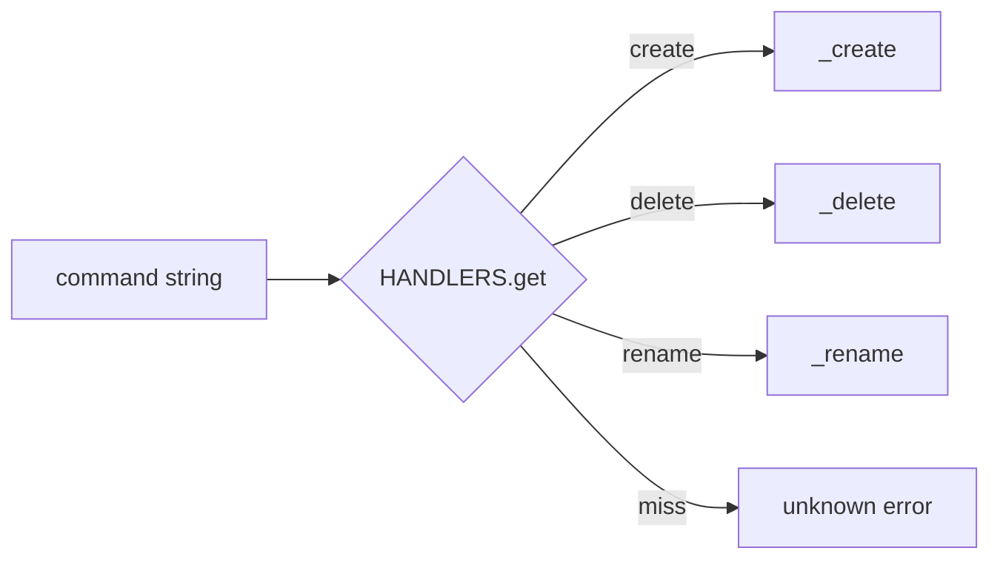
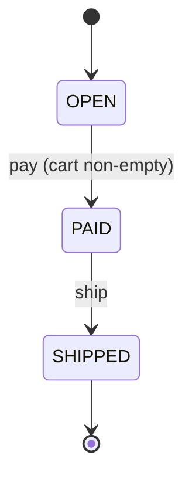

# Bad Structure Anti-Patterns — Exercises

> **Category:** [Development Anti-Patterns](../README.md) → **Bad Structure** — *hands-on practice fixing the shapes that resist change.*
> **Covers (collectively):** God Object · Spaghetti Code · Lava Flow · Boat Anchor · Arrow Anti-Pattern

---

These are **fix-it** exercises, not recognition quizzes. For each one you are given a problem statement, starting code (in Go, Java, or Python — the language varies on purpose), acceptance criteria, and a collapsible solution. The point is to *make the change*: split a God Object, flatten an arrow, prove code dead and delete it, and so on.

> **How to use this file.** Read the problem, try it in your editor *before* opening the solution, then compare. The "why it's better" note under each solution matters more than the diff — structure is a means, not an end. Refer back to [`junior.md`](junior.md) for the shapes and [`middle.md`](middle.md) for the countermoves.

---

## Table of Contents

| # | Exercise | Anti-pattern(s) | Lang | Difficulty |
|---|---|---|---|---|
| 1 | [Flatten the gatekeeper](#exercise-1--flatten-the-gatekeeper) | Arrow | Go | ★ easy |
| 2 | [Kill the boolean flags](#exercise-2--kill-the-boolean-flags) | Spaghetti | Java | ★ easy |
| 3 | [Prove the branch is dead](#exercise-3--prove-the-branch-is-dead) | Lava Flow | Python | ★ easy |
| 4 | [Delete the boat anchor](#exercise-4--delete-the-boat-anchor) | Boat Anchor | Go | ★★ medium |
| 5 | [Split the God Object](#exercise-5--split-the-god-object) | God Object | Python | ★★ medium |
| 6 | [Replace nesting with a handler map](#exercise-6--replace-nesting-with-a-handler-map) | Arrow + dispatch | Python | ★★ medium |
| 7 | [Untangle the shared-state pipeline](#exercise-7--untangle-the-shared-state-pipeline) | Spaghetti | Python | ★★ medium |
| 8 | [Replace type-switch with polymorphism](#exercise-8--replace-type-switch-with-polymorphism) | Arrow + dispatch | Java | ★★ medium |
| 9 | [Inject the collaborators](#exercise-9--inject-the-collaborators) | God Object | Go | ★★★ hard |
| 10 | [Tame the order-dependent state machine](#exercise-10--tame-the-order-dependent-state-machine) | Spaghetti | Python | ★★★ hard |
| 11 | [Lava Flow archaeology — evidence then delete](#exercise-11--lava-flow-archaeology--evidence-then-delete) | Lava Flow + Boat Anchor | (process) | ★★★ hard |
| 12 | [Mini-project: refactor the `ReportTool`](#exercise-12--mini-project-refactor-the-reporttool) | All five | Python | ★★★★ project |
| 13 | [Write a structure review checklist](#exercise-13--write-a-structure-review-checklist) | meta | — | ★★ medium |
| 14 | [Write a fitness test that fails the build](#exercise-14--write-a-fitness-test-that-fails-the-build) | meta | Go | ★★★ hard |

---

## Exercise 1 — Flatten the gatekeeper

**Anti-pattern:** Arrow · **Language:** Go · **Difficulty:** ★ easy

The success path is buried five indents deep. Flatten it.

```go
// withdraw returns the new balance, or an error explaining why it failed.
func withdraw(acc *Account, amount int) (int, error) {
	if acc != nil {
		if !acc.Frozen {
			if amount > 0 {
				if acc.Balance >= amount {
					acc.Balance -= amount
					return acc.Balance, nil
				} else {
					return 0, errors.New("insufficient funds")
				}
			} else {
				return 0, errors.New("amount must be positive")
			}
		} else {
			return 0, errors.New("account frozen")
		}
	}
	return 0, errors.New("nil account")
}
```

**Acceptance criteria**
- The happy path (`acc.Balance -= amount; return ...`) is at the lowest indentation level and is the last statement.
- Behavior is identical: same errors for the same inputs, in the same precedence.
- No `else` blocks remain.

**Hint:** invert each condition into a guard clause that returns early. Preserve the original *order* of checks so error precedence does not change.

<details>
<summary>Solution</summary>

```go
func withdraw(acc *Account, amount int) (int, error) {
	if acc == nil {
		return 0, errors.New("nil account")
	}
	if acc.Frozen {
		return 0, errors.New("account frozen")
	}
	if amount <= 0 {
		return 0, errors.New("amount must be positive")
	}
	if acc.Balance < amount {
		return 0, errors.New("insufficient funds")
	}
	acc.Balance -= amount
	return acc.Balance, nil
}
```

**Why it's better.** Each precondition is handled and dismissed on its own line; the reader never has to hold an open `if` in their head. The "real work" — the two lines that actually move money — is no longer hidden at the bottom of a pyramid. Adding a sixth check is now a one-line insert, not another level of nesting. Note the check *order* is preserved exactly, so error precedence is unchanged.

</details>

---

## Exercise 2 — Kill the boolean flags

**Anti-pattern:** Spaghetti (flag arguments) · **Language:** Java · **Difficulty:** ★ easy

One method does four different jobs depending on its flags. Callers can pass nonsense combinations.

```java
// Three booleans = up to eight behaviors crammed into one body.
void notify(User user, String text, boolean sms, boolean push, boolean urgent) {
    if (sms) {
        if (urgent) smsGateway.sendPriority(user.phone(), text);
        else        smsGateway.send(user.phone(), text);
    }
    if (push) {
        if (urgent) pushService.sendHighPriority(user.deviceToken(), text);
        else        pushService.send(user.deviceToken(), text);
    }
    // What does notify(u, "hi", false, false, true) even do? Nothing. Silently.
}
```

**Acceptance criteria**
- A caller cannot express a no-op or contradictory combination.
- Each delivery channel is reachable through a clearly named method.
- Urgency is modeled so that "urgent" is a property of the request, not a fourth multiplier.

**Hint:** the channel selection (`sms`/`push`) is *dispatch*; the urgency is a *property*. Split the channels into methods and pass priority as a typed value, not a boolean.

<details>
<summary>Solution</summary>

```java
enum Priority { NORMAL, URGENT }

void notifyBySms(User user, String text, Priority p) {
    if (p == Priority.URGENT) smsGateway.sendPriority(user.phone(), text);
    else                      smsGateway.send(user.phone(), text);
}

void notifyByPush(User user, String text, Priority p) {
    if (p == Priority.URGENT) pushService.sendHighPriority(user.deviceToken(), text);
    else                      pushService.send(user.deviceToken(), text);
}
```

A caller that wants both channels calls both methods — explicitly, at the call site, where the intent is visible.

**Why it's better.** The illegal states (`sms=false, push=false`) are now *unrepresentable* — there is no method that does nothing. `Priority` as an enum kills the "urgent" boolean and documents the only two valid values (and the compiler will force you to handle a third if you ever add one). Each method has one job and is trivially testable in isolation. The earlier version's combinatorial fan-out (`2³` paths) collapses to two methods with one branch each.

</details>

---

## Exercise 3 — Prove the branch is dead

**Anti-pattern:** Lava Flow · **Language:** Python · **Difficulty:** ★ easy

Here is a function with a branch nobody trusts. Your job is not to guess — it is to *prove* the branch is dead, then delete it.

```python
def price_for(plan: str, seats: int) -> int:
    if plan == "free":
        return 0
    elif plan == "team":
        return 12 * seats
    elif plan == "enterprise":
        return 20 * seats
    elif plan == "legacy_v1":
        # TODO: still needed? broke billing in 2021 when someone tried to remove it
        return 8 * seats
    raise ValueError(f"unknown plan {plan}")
```

You have access to the codebase and a year of production logs.

**Acceptance criteria**
- List the *evidence* you would gather, not just "I think it's unused."
- Only after the evidence supports it, produce the deleted version.

**Hint:** combine static evidence (call sites + git history) with runtime evidence (does the branch fire?).

<details>
<summary>Solution</summary>

**Evidence-gathering steps:**

1. **Find the callers.** Grep for the literal value that reaches this branch:
   ```bash
   git grep -n '"legacy_v1"'      # who ever passes this plan string?
   ```
   If the only hit is the function itself, no code path constructs that plan.

2. **Check the data source.** `plan` comes from somewhere — a DB column, an API field. Query it:
   ```sql
   SELECT plan, COUNT(*) FROM subscriptions GROUP BY plan;
   -- legacy_v1: 0 rows  →  no live customer is on this plan
   ```

3. **Add temporary telemetry and ship it.** If you still aren't sure, instrument the branch and let real traffic decide:
   ```python
   elif plan == "legacy_v1":
       log.warning("legacy_v1 pricing hit", extra={"seats": seats})
       return 8 * seats
   ```
   Zero hits after a full billing cycle (a month) is strong evidence.

4. **Read the history.** `git log -S '"legacy_v1"'` finds the commit that added it and links the closed ticket — the 2021 fear is almost certainly a migration that has long since completed.

**The deletion** (after evidence confirms it is dead):

```python
def price_for(plan: str, seats: int) -> int:
    prices = {"free": 0, "team": 12, "enterprise": 20}
    if plan not in prices:
        raise ValueError(f"unknown plan {plan}")
    return prices[plan] * seats
```

Commit it on its own with the evidence in the message:

```
remove dead legacy_v1 pricing branch

0 subscriptions on this plan (prod query 2026-06-09),
0 telemetry hits in 30d, ticket BILL-411 closed 2021.
```

**Why it's better.** The fear that kept the branch alive was *uncertainty*; we replaced it with evidence and let git hold the rollback. The rewrite also turns four `elif`s into a data-driven lookup, so adding a plan is a one-line table edit. The commit message means the *next* engineer never has to repeat this archaeology.

</details>

---

## Exercise 4 — Delete the boat anchor

**Anti-pattern:** Boat Anchor · **Language:** Go · **Difficulty:** ★★ medium

This package shipped a three-format exporter "so we're ready for anything." Two years on, only one format is used. Decide what is ballast and remove it — but do not amputate a real seam.

```go
// exporter.go
type ReportExporter interface {
	ExportCSV(r Report) ([]byte, error)
	ExportXLSX(r Report) ([]byte, error)
	ExportXML(r Report) ([]byte, error)
}

type fileExporter struct{}

func (fileExporter) ExportCSV(r Report) ([]byte, error)  { /* 30 lines, used by /download */ }
func (fileExporter) ExportXLSX(r Report) ([]byte, error) { /* 80 lines, no caller */ }
func (fileExporter) ExportXML(r Report) ([]byte, error)  { /* 60 lines, no caller */ }
```

A grep shows: `ExportCSV` has one caller (an HTTP handler); `ExportXLSX` and `ExportXML` have **zero** callers and no tests.

**Acceptance criteria**
- Unused, unrequested code is removed.
- The remaining interface (if any) is justified — either it earns its keep today or it is collapsed.
- You can articulate when you would have *kept* the interface.

**Hint:** an interface with one implementation and one method that one caller uses is not a seam — it is indirection. But check first whether the caller needs an interface for *testing*.

<details>
<summary>Solution</summary>

```go
// exporter.go — only the format anyone actually uses survives.
func ExportCSV(r Report) ([]byte, error) {
	// ... the same 30 lines ...
}
```

The `ReportExporter` interface and the `fileExporter` struct are gone. The HTTP handler now calls `ExportCSV(r)` directly.

**When you would keep the interface instead:** if the HTTP handler test needed to inject a *fake* exporter (e.g. to simulate an export error without generating real bytes), then a single-method seam is justified:

```go
type Exporter interface{ ExportCSV(Report) ([]byte, error) }
// handler holds an Exporter; tests pass a stub that returns an error.
```

The deciding question from [`middle.md`](middle.md): *does this abstraction earn its keep today?* A seam used by a test earns it; an interface invented for an imagined XML consumer does not.

**Why it's better.** We deleted ~140 lines of XLSX/XML code that compiled, showed up in every search, got "consistency" refactors, and silently rotted because no test or traffic exercised it. The git history still holds it: the day a customer genuinely needs XLSX, we rebuild it against that real requirement — and we will build it better than the speculative version. Crucially, we *kept the door open* for a real test seam, distinguishing ballast from a justified abstraction rather than deleting reflexively.

</details>

---

## Exercise 5 — Split the God Object

**Anti-pattern:** God Object · **Language:** Python · **Difficulty:** ★★ medium

`OrderManager` validates, prices, persists, and emails. Split it by responsibility.

```python
class OrderManager:
    def __init__(self, db, smtp_host):
        self.db = db
        self.smtp_host = smtp_host
        self.tax_rate = 0.08

    def place_order(self, cart, customer):
        # validation
        if not cart.items:
            raise ValueError("empty cart")
        if customer.email is None:
            raise ValueError("no email")
        # pricing
        subtotal = sum(i.price * i.qty for i in cart.items)
        total = subtotal * (1 + self.tax_rate)
        # persistence
        order_id = self.db.insert("orders", {"customer": customer.id, "total": total})
        # notification
        body = f"Thanks {customer.name}, your order #{order_id} is ${total:.2f}"
        self._send_email(customer.email, "Order confirmed", body)
        return order_id

    def _send_email(self, to, subject, body):
        # ... opens an SMTP connection to self.smtp_host and sends ...
        ...
```

**Acceptance criteria**
- Validation, pricing, persistence, and notification each live in their own focused unit.
- `OrderManager` (renamed if appropriate) becomes a thin coordinator.
- Each extracted unit is independently testable — no SMTP needed to test pricing.

**Hint:** every "# comment" in the original marks a responsibility boundary. Extract each, then have the coordinator call them in sequence.

<details>
<summary>Solution</summary>

```python
class OrderValidator:
    def validate(self, cart, customer):
        if not cart.items:
            raise ValueError("empty cart")
        if customer.email is None:
            raise ValueError("no email")


class Pricer:
    def __init__(self, tax_rate=0.08):
        self.tax_rate = tax_rate

    def total(self, cart) -> float:
        subtotal = sum(i.price * i.qty for i in cart.items)
        return subtotal * (1 + self.tax_rate)


class OrderRepository:
    def __init__(self, db):
        self.db = db

    def save(self, customer_id, total) -> int:
        return self.db.insert("orders", {"customer": customer_id, "total": total})


class EmailSender:
    def __init__(self, smtp_host):
        self.smtp_host = smtp_host

    def send(self, to, subject, body):
        ...  # SMTP details isolated here


class CheckoutService:
    """Thin coordinator: it orchestrates, it does not implement."""
    def __init__(self, validator, pricer, repo, mailer):
        self._validator = validator
        self._pricer = pricer
        self._repo = repo
        self._mailer = mailer

    def place_order(self, cart, customer) -> int:
        self._validator.validate(cart, customer)
        total = self._pricer.total(cart)
        order_id = self._repo.save(customer.id, total)
        body = f"Thanks {customer.name}, your order #{order_id} is ${total:.2f}"
        self._mailer.send(customer.email, "Order confirmed", body)
        return order_id
```

**Why it's better.** Each class now has exactly one reason to change: the tax team touches `Pricer`, the infra team touches `EmailSender`, the schema owner touches `OrderRepository`. You can unit-test `Pricer.total()` with a plain cart and no database or SMTP server. `CheckoutService` reads like the business process it represents — validate, price, save, notify — and its dependencies are injected, so a test can pass fakes. The original required wiring up SMTP just to assert a tax calculation; that coupling is gone.

</details>

---

## Exercise 6 — Replace nesting with a handler map

**Anti-pattern:** Arrow + value dispatch · **Language:** Python · **Difficulty:** ★★ medium

This dispatcher grows an `elif` for every new command, and each branch is itself nested. Guard clauses alone will not fix it — the nesting is *dispatch*.

```python
def handle(command: str, payload: dict) -> dict:
    if command == "create":
        if "name" in payload:
            return {"id": db_create(payload["name"])}
        else:
            return {"error": "name required"}
    elif command == "delete":
        if "id" in payload:
            db_delete(payload["id"])
            return {"ok": True}
        else:
            return {"error": "id required"}
    elif command == "rename":
        if "id" in payload and "name" in payload:
            db_rename(payload["id"], payload["name"])
            return {"ok": True}
        else:
            return {"error": "id and name required"}
    else:
        return {"error": f"unknown command {command}"}
```

**Acceptance criteria**
- Adding a new command does not require editing a long `if/elif` chain.
- Each command's logic lives in its own small function.
- Unknown commands are handled in one place.

**Hint:** map the command *string* to a handler *function*. Keep per-handler validation inside the handler (guard clauses), and the dispatch in a single table lookup.

<details>
<summary>Solution</summary>

```python
def _require(payload, *keys):
    missing = [k for k in keys if k not in payload]
    if missing:
        raise ValueError(f"{', '.join(missing)} required")


def _create(payload):
    _require(payload, "name")
    return {"id": db_create(payload["name"])}


def _delete(payload):
    _require(payload, "id")
    db_delete(payload["id"])
    return {"ok": True}


def _rename(payload):
    _require(payload, "id", "name")
    db_rename(payload["id"], payload["name"])
    return {"ok": True}


HANDLERS = {"create": _create, "delete": _delete, "rename": _rename}


def handle(command: str, payload: dict) -> dict:
    handler = HANDLERS.get(command)
    if handler is None:
        return {"error": f"unknown command {command}"}
    try:
        return handler(payload)
    except ValueError as e:
        return {"error": str(e)}
```

**Why it's better.** Dispatch is now a single dictionary lookup instead of a linear scan of `elif`s, and adding a command is a two-line change (one handler + one table entry) that never touches existing branches — an [open/closed](../../../../../Architecture/README.md) win. The per-command validation is centralized in `_require`, so the error format is consistent and there is no repeated "else: return error" boilerplate. Each handler is small, named, and independently testable. The "unknown command" case lives in exactly one place.



</details>

---

## Exercise 7 — Untangle the shared-state pipeline

**Anti-pattern:** Spaghetti (shared mutable state, order-dependent calls) · **Language:** Python · **Difficulty:** ★★ medium

These functions communicate through a module-level dict and only work if called in a secret order. Convert them into an explicit pipeline.

```python
_state = {}

def load(path):
    _state["raw"] = open(path).read()
    _state["loaded"] = True

def clean():
    # crashes if load() didn't run
    _state["rows"] = [line.strip() for line in _state["raw"].splitlines() if line.strip()]

def parse():
    if not _state.get("loaded"):
        raise RuntimeError("call load() first")   # the secret contract, made loud
    _state["records"] = [r.split(",") for r in _state["rows"]]

def summary():
    return {"count": len(_state["records"]), "first": _state["records"][0]}

# usage — order matters and is invisible:
# load("data.csv"); clean(); parse(); print(summary())
```

**Acceptance criteria**
- No module-level mutable state.
- Each step takes its input as an argument and returns its output.
- It is impossible to call a step "out of order" because the data simply would not exist.

**Hint:** the call order *is* the data flow. Encode it by passing each step's return value into the next.

<details>
<summary>Solution</summary>

```python
def load(path: str) -> str:
    with open(path) as f:
        return f.read()

def clean(raw: str) -> list[str]:
    return [line.strip() for line in raw.splitlines() if line.strip()]

def parse(rows: list[str]) -> list[list[str]]:
    return [r.split(",") for r in rows]

def summarize(records: list[list[str]]) -> dict:
    return {"count": len(records), "first": records[0]}

def run(path: str) -> dict:
    return summarize(parse(clean(load(path))))
```

**Why it's better.** The order dependency is now expressed *in the code* — you literally cannot call `parse` without already having `rows`, because `rows` is its argument. There is no hidden `_state`, so two pipelines can run concurrently without clobbering each other, and each function can be unit-tested with a plain string or list (no file, no global setup). The `RuntimeError("call load() first")` guard is gone because the situation it guarded against is now impossible to express. `run` reads as the pipeline it is: `load → clean → parse → summarize`.

</details>

---

## Exercise 8 — Replace type-switch with polymorphism

**Anti-pattern:** Arrow + type dispatch · **Language:** Java · **Difficulty:** ★★ medium

A nested `instanceof` ladder computes area. Every new shape adds another branch in every such method. Push the behavior into the types.

```java
double area(Shape s) {
    if (s instanceof Circle) {
        Circle c = (Circle) s;
        if (c.radius() > 0) {
            return Math.PI * c.radius() * c.radius();
        } else {
            return 0;
        }
    } else if (s instanceof Rectangle) {
        Rectangle r = (Rectangle) s;
        if (r.width() > 0 && r.height() > 0) {
            return r.width() * r.height();
        } else {
            return 0;
        }
    }
    throw new IllegalArgumentException("unknown shape");
}
```

**Acceptance criteria**
- Adding a new shape does not require editing `area`.
- Each shape computes its own area.
- The caller is reduced to a single call.

**Hint:** this is the textbook *Replace Conditional with Polymorphism*. Give `Shape` an `area()` method and let each subtype implement it.

<details>
<summary>Solution</summary>

```java
sealed interface Shape permits Circle, Rectangle {
    double area();
}

record Circle(double radius) implements Shape {
    public double area() {
        return radius > 0 ? Math.PI * radius * radius : 0;
    }
}

record Rectangle(double width, double height) implements Shape {
    public double area() {
        return (width > 0 && height > 0) ? width * height : 0;
    }
}

// caller:
double a = shape.area();
```

**Why it's better.** Each shape owns its formula, so the knowledge lives next to the data it operates on (high cohesion). Adding `Triangle` means writing one new `record` that implements `Shape` — the existing code is untouched (open/closed). The `instanceof`-and-cast ladder, which would have to be *duplicated* in every operation (`area`, `perimeter`, `render`...), disappears. Marking the interface `sealed` lets the compiler verify the type list is exhaustive, catching a forgotten shape at build time instead of via the runtime `IllegalArgumentException`.

</details>

---

## Exercise 9 — Inject the collaborators

**Anti-pattern:** God Object (hidden dependencies) · **Language:** Go · **Difficulty:** ★★★ hard

This `UserService` constructs its own dependencies inside its methods, so it cannot be tested without a real database, a real clock, and a real mailer. Refactor it for dependency injection *and* split a responsibility that does not belong.

```go
type UserService struct{}

func (UserService) Register(email, password string) error {
	// builds its own DB connection — untestable
	db, err := sql.Open("postgres", os.Getenv("DATABASE_URL"))
	if err != nil {
		return err
	}
	defer db.Close()

	hash := sha256.Sum256([]byte(password)) // also: weak hashing, but out of scope here
	_, err = db.Exec("INSERT INTO users(email, hash, created) VALUES($1,$2,$3)",
		email, hex.EncodeToString(hash[:]), time.Now()) // time.Now() is non-deterministic in tests
	if err != nil {
		return err
	}

	// and it sends a welcome email inline
	smtp.SendMail(os.Getenv("SMTP_ADDR"), nil, "noreply@app.com",
		[]string{email}, []byte("Welcome!"))
	return nil
}
```

**Acceptance criteria**
- Dependencies (store, clock, mailer) are injected via the constructor, not built inside the method.
- `time.Now()` is replaced by an injected clock so the method is deterministic under test.
- Email sending is a separate collaborator, not inline SMTP.
- The method can be unit-tested with fakes and no network or database.

**Hint:** define small interfaces for each external concern. `UserService` should *hold* them, not *create* them.

<details>
<summary>Solution</summary>

```go
type UserStore interface {
	Insert(email, hash string, created time.Time) error
}

type Mailer interface {
	SendWelcome(email string) error
}

type Clock interface {
	Now() time.Time
}

type UserService struct {
	store  UserStore
	mailer Mailer
	clock  Clock
}

func NewUserService(s UserStore, m Mailer, c Clock) *UserService {
	return &UserService{store: s, mailer: m, clock: c}
}

func (u *UserService) Register(email, password string) error {
	hash := sha256.Sum256([]byte(password))
	if err := u.store.Insert(email, hex.EncodeToString(hash[:]), u.clock.Now()); err != nil {
		return fmt.Errorf("register %s: %w", email, err)
	}
	if err := u.mailer.SendWelcome(email); err != nil {
		return fmt.Errorf("welcome mail %s: %w", email, err)
	}
	return nil
}
```

A test now needs no infrastructure:

```go
type fakeStore struct{ inserted bool; created time.Time }
func (f *fakeStore) Insert(_, _ string, t time.Time) error { f.inserted = true; f.created = t; return nil }

type fakeMailer struct{ sent string }
func (f *fakeMailer) SendWelcome(e string) error { f.sent = e; return nil }

type fixedClock struct{ t time.Time }
func (c fixedClock) Now() time.Time { return c.t }

func TestRegister(t *testing.T) {
	store, mailer := &fakeStore{}, &fakeMailer{}
	svc := NewUserService(store, mailer, fixedClock{t: time.Unix(0, 0)})

	if err := svc.Register("a@b.com", "pw"); err != nil {
		t.Fatal(err)
	}
	if !store.inserted || mailer.sent != "a@b.com" || !store.created.Equal(time.Unix(0, 0)) {
		t.Fatalf("unexpected state: %+v %+v", store, mailer)
	}
}
```

**Why it's better.** The service no longer reaches out to `os.Getenv`, a live Postgres, an SMTP server, and the wall clock from inside its logic — those are now injected interfaces it depends on, not concretions it constructs. That makes `Register` deterministic and unit-testable in microseconds with fakes (note the `fixedClock`, which pins `time.Now()`). Email is a distinct `Mailer` responsibility rather than inline SMTP, so the service coordinates instead of implementing. Errors are wrapped with context (`%w`) so a failure tells you *which* step broke. This is the practical form of [Dependency Injection](../../../../language-internals/README.md) and the Dependency Inversion idea: depend on small interfaces, supply the implementations from outside.

</details>

---

## Exercise 10 — Tame the order-dependent state machine

**Anti-pattern:** Spaghetti (implicit state + order dependence) · **Language:** Python · **Difficulty:** ★★★ hard

A checkout flow is driven by scattered boolean flags. Any method can be called at any time, and illegal transitions corrupt state silently. Replace the flags with an explicit state machine that *rejects* illegal transitions.

```python
class Checkout:
    def __init__(self):
        self.cart_open = True
        self.paid = False
        self.shipped = False

    def pay(self):
        # nothing stops you paying twice, or paying after shipping
        self.paid = True
        self.cart_open = False

    def ship(self):
        # you can ship without paying — silent bug
        self.shipped = True

    def add_item(self, item):
        # you can add items after payment — silent bug
        if self.cart_open:
            ...
```

**Acceptance criteria**
- Replace the three booleans with a single explicit state.
- Each operation is legal only from the correct state(s); an illegal call raises a clear error.
- The legal transitions are visible in one place.

**Hint:** model states as an enum (`OPEN → PAID → SHIPPED`) and define a single transition table. Each method asserts its allowed source state before transitioning.

<details>
<summary>Solution</summary>

```python
from enum import Enum, auto

class State(Enum):
    OPEN = auto()
    PAID = auto()
    SHIPPED = auto()

# The legal transitions, in one readable place.
_TRANSITIONS = {
    State.OPEN:    {State.PAID},
    State.PAID:    {State.SHIPPED},
    State.SHIPPED: set(),
}

class Checkout:
    def __init__(self):
        self.state = State.OPEN
        self.items = []

    def _transition(self, target: State):
        if target not in _TRANSITIONS[self.state]:
            raise ValueError(f"cannot go {self.state.name} -> {target.name}")
        self.state = target

    def add_item(self, item):
        if self.state is not State.OPEN:
            raise ValueError(f"cannot add items in state {self.state.name}")
        self.items.append(item)

    def pay(self):
        if not self.items:
            raise ValueError("cannot pay for an empty cart")
        self._transition(State.PAID)

    def ship(self):
        self._transition(State.SHIPPED)   # only reachable from PAID
```



**Why it's better.** The three booleans allowed `2³ = 8` flag combinations, most of them meaningless (`paid=False, shipped=True`?). A single `State` enum admits only the three states that actually exist, and `_TRANSITIONS` makes the legal moves *data you can read at a glance*. Every silent bug in the original — pay twice, ship without paying, add items after payment — now raises a clear error at the moment it is attempted, instead of corrupting state and surfacing far away. The state machine is the explicit version of the sequence that previously lived only in a developer's head.

</details>

---

## Exercise 11 — Lava Flow archaeology — evidence then delete

**Anti-pattern:** Lava Flow + Boat Anchor · **Difficulty:** ★★★ hard · *(process exercise — no single code answer)*

You inherit a 4,000-line service. Three suspicious things catch your eye:

1. A `legacy/` package, imported by nothing you can find, with a comment: `// keep — billing integration, do not touch`.
2. A method `recomputeShadowTotals()` called from one place, inside `if featureFlags.shadowMode { ... }` — and `shadowMode` is hard-coded `false`.
3. A public function `ExportToMainframe()` with no callers in this repo, but it is *exported*, so another repo *might* use it.

**Task.** For each item, write the concrete evidence-gathering plan, decide delete-vs-keep, and describe how you would stage the change safely. Be specific about tools and commands.

**Acceptance criteria**
- A distinct investigation per item (they need different evidence).
- An explicit decision with the evidence that justifies it.
- A safe rollout: separate commits, reversibility, what you would watch after merging.

<details>
<summary>Solution</summary>

**Item 1 — the `legacy/` package ("do not touch").**
This is classic Lava Flow: a scary comment standing in for understanding.
- **Static evidence:** `git grep -n 'legacy'` and a dead-code analyzer (`go run golang.org/x/tools/cmd/deadcode@latest ./...`) to confirm zero reachable references from any entrypoint.
- **History:** `git log -S 'legacy' -- legacy/` and read the linked ticket. "Billing integration" from 2019 is very likely a migration that completed; verify the *new* billing path exists and is the one in use.
- **Decision:** if nothing imports it and the migration it supported is done → **delete the whole package** in one commit, message citing the deadcode output and the closed ticket. The comment's authority came from fear, not facts.

**Item 2 — `recomputeShadowTotals()` behind a hard-`false` flag.**
This is dead code hidden behind a permanently-off switch.
- **Evidence:** confirm `shadowMode` is set to `false` literally (not from config/env) — `git grep -n 'shadowMode'`. Check the flag's history: was it ever flipped on in prod? If it was a temporary dual-write validation that has long since passed, its job is over.
- **Decision:** **delete the flag, the `if` branch, and `recomputeShadowTotals()` together.** Removing a constantly-`false` branch cannot change behavior, which makes this an unusually safe deletion. Do it in its own commit.

**Item 3 — exported `ExportToMainframe()` with no local callers.**
This is the dangerous one: a potential Boat Anchor that is *also* a published surface another repo may consume. You cannot delete on local evidence alone.
- **Evidence:** search the whole organization, not just this repo — code search across all repos (GitHub/GitLab org search, or `grep` over a monorepo), plus any package-registry download stats. Add a deprecation log line / metric and ship it; watch for hits over a release cycle.
- **Decision:** if an external caller exists → it earns its keep; keep it but document the real consumer. If org-wide search and a cycle of telemetry both come back empty → **deprecate first** (mark it, announce it), then delete in a *later* release once consumers have had a window. Deleting a published symbol immediately is how you break someone else's build.

**Safe rollout for all three.** One concern per commit, each message carrying its evidence; never mix these deletions with a behavioral change. After merge, watch error rates and the deprecation metrics for a cycle. Git is the rollback — that is precisely what makes confident deletion safe.

**Why this is better.** Each item demanded *different* evidence (reachability, flag history, org-wide usage) and a *different* decision (delete now, delete now, deprecate-then-delete). The discipline is the same throughout: replace fear and "might need it" with evidence, isolate the change so it is reversible, and let version control — not a dead branch — be the safety net.

</details>

---

## Exercise 12 — Mini-project: refactor the `ReportTool`

**Anti-pattern:** all five, in one small realistic module · **Language:** Python · **Difficulty:** ★★★★ project

Below is a compact module that manages to combine **every** bad-structure anti-pattern: a God Object that does everything, spaghetti via a flag and shared state, arrow nesting, a dead branch (Lava Flow), and an unused method (Boat Anchor). Refactor it into clean, testable units. Work in steps; do not try to fix it all in one edit.

```python
class ReportTool:
    def __init__(self, db):
        self.db = db
        self.cache = {}            # shared mutable state used across methods
        self.last_format = None    # set by one method, read by another (spaghetti)

    def generate(self, kind, raw_format, send_email, debug):
        # arrow + flags + dead branch all at once
        if kind is not None:
            if kind in ("sales", "inventory"):
                rows = self.db.query(kind)
                if rows:
                    if raw_format == "csv":
                        out = "\n".join(",".join(map(str, r)) for r in rows)
                        self.last_format = "csv"
                    elif raw_format == "json":
                        import json
                        out = json.dumps(rows)
                        self.last_format = "json"
                    elif raw_format == "xml_v0":
                        # legacy. broke once in 2020. nobody calls with xml_v0 anymore (right?)
                        out = "<xml>%s</xml>" % rows
                    else:
                        return None
                    self.cache[kind] = out
                    if send_email and not debug:
                        self._email("ops@co.com", out)
                    return out
                else:
                    return None
            else:
                return None
        return None

    def _email(self, to, body):
        # inline SMTP, untestable
        ...

    def export_to_ftp(self, out):
        # never called anywhere in the codebase (boat anchor)
        ...
```

**Acceptance criteria**
- **God Object:** querying, formatting, caching, and emailing are separated.
- **Spaghetti:** the `send_email`/`debug` flags and the `last_format`/`cache` shared state are removed or made explicit.
- **Arrow:** the body uses guard clauses; format selection is a dispatch, not an `elif` ladder.
- **Lava Flow:** the `xml_v0` branch is removed (assume you gathered evidence as in Exercise 3 and 11).
- **Boat Anchor:** `export_to_ftp` is deleted (assume confirmed zero callers).
- Each remaining unit is testable in isolation.

**Hint:** start by listing the responsibilities, then extract them one at a time — query, format (via a formatter map), email — keeping behavior green after each step. Decide what `cache` and `last_format` were actually for (probably nothing essential).

<details>
<summary>Solution</summary>

```python
import json

# --- Formatting: a dispatch map replaces the elif ladder; xml_v0 (dead) is gone. ---
def _to_csv(rows) -> str:
    return "\n".join(",".join(map(str, r)) for r in rows)

def _to_json(rows) -> str:
    return json.dumps(rows)

FORMATTERS = {"csv": _to_csv, "json": _to_json}

def format_rows(rows, fmt: str) -> str:
    formatter = FORMATTERS.get(fmt)
    if formatter is None:
        raise ValueError(f"unsupported format {fmt!r}")
    return formatter(rows)


# --- Data access: one job. ---
class ReportRepository:
    VALID_KINDS = {"sales", "inventory"}

    def __init__(self, db):
        self.db = db

    def rows_for(self, kind: str):
        if kind not in self.VALID_KINDS:
            raise ValueError(f"unknown report kind {kind!r}")
        return self.db.query(kind)


# --- Notification: a separate, injectable collaborator. ---
class EmailSender:
    def send(self, to: str, body: str) -> None:
        ...  # SMTP isolated here, mockable in tests


# --- Coordinator: guard clauses, no flags, no shared state. ---
class ReportService:
    def __init__(self, repo: ReportRepository, mailer: EmailSender):
        self._repo = repo
        self._mailer = mailer

    def generate(self, kind: str, fmt: str) -> str | None:
        rows = self._repo.rows_for(kind)      # raises on bad kind (guard at the source)
        if not rows:
            return None
        return format_rows(rows, fmt)

    def generate_and_email(self, kind: str, fmt: str, to: str) -> str | None:
        report = self.generate(kind, fmt)
        if report is None:
            return None
        self._mailer.send(to, report)
        return report
```

**What happened to each anti-pattern:**

- **God Object →** `ReportTool` became three focused units (`ReportRepository`, `format_rows`/`FORMATTERS`, `EmailSender`) plus a thin `ReportService` coordinator.
- **Spaghetti →** the `send_email`/`debug` boolean soup is gone. "Email it" is now an *explicit different method* (`generate_and_email`) instead of a flag, and "debug" (which meant "don't email") is expressed by simply calling `generate`. The `cache` and `last_format` shared state served no real purpose and were deleted — callers that want caching can memoize at their level.
- **Arrow →** the five-deep pyramid is now a flat sequence with early returns; `kind` validation moved to `ReportRepository` (guarding at the source).
- **Lava Flow →** the `xml_v0` branch is deleted (per the evidence drill in Exercises 3 & 11). Git keeps it.
- **Boat Anchor →** `export_to_ftp` is deleted — zero callers, no requirement.

**Why it's better.** You can now test `format_rows(rows, "csv")` with a literal list and no database; test `ReportService.generate` with a fake repo and no SMTP; and add a new format with one function + one map entry. The behavior that mattered (query → format → optionally email) is preserved and is now *legible* — each step is named, isolated, and reachable on its own. Crucially, the refactor was done as a sequence of small green steps (extract formatter, extract repo, extract mailer, delete dead code), never as a big-bang rewrite — exactly the discipline from [`middle.md`](middle.md).

</details>

---

## Exercise 13 — Write a structure review checklist

**Anti-pattern:** meta (prevention) · **Difficulty:** ★★ medium

Bad structure is cheapest to stop in code review, while the change is still small. Write a concise, *actionable* reviewer checklist — phrased as questions a reviewer asks of a diff — that would catch all five anti-patterns before they merge. Aim for questions with a clear "if yes, push back" trigger, not vague advice like "is this clean?"

**Acceptance criteria**
- One or more concrete, answerable questions per anti-pattern.
- Each question has a clear failure trigger and a suggested action.
- Short enough that a reviewer would actually run it on every PR.

<details>
<summary>Solution</summary>

**Bad-Structure PR review checklist**

| # | Question | If the answer is… | Then |
|---|---|---|---|
| 1 | Does this PR add a method to an already-large class? | "Yes, and it uses *new* fields unrelated to the class's data" | Push back: extract to a new class; this is **God Object** growth. |
| 2 | Does any changed function take more than ~2 boolean parameters? | "Yes" | Push back: split into separate functions or pass a typed value — **Spaghetti** flag-soup. |
| 3 | Do these functions only work if called in a specific order via shared/global state? | "Yes" | Push back: make data flow explicit (params in, values out). **Spaghetti**. |
| 4 | What is the deepest indentation level in the diff? | "4 or more" | Push back: guard clauses (validation) or polymorphism/handler map (dispatch). **Arrow**. |
| 5 | Why is this old branch / flag still here? | "Not sure" / "just in case" | Ask for evidence (coverage, telemetry) or deletion. **Lava Flow**. |
| 6 | How many call sites does this new abstraction/export have? | "Zero, it's for the future" | Ask for the ticket that needs it; if none, defer. **Boat Anchor**. |
| 7 | Is this PR scoped to one ticket and reviewably small? | "No, it's 2,000 lines touching everything" | Ask to split — large PRs routinely hide all of the above. |

**Author's pre-flight (same list, mirrored):** before requesting review, run questions 1–7 on your own diff. Keep PRs small and single-purpose so a reviewer can actually see the structure.

**Why this is better than "review for cleanliness."** Each row has a *trigger* and an *action*, so the checklist is mechanical enough to apply under time pressure and specific enough that two reviewers reach the same conclusion. It catches the anti-patterns at their cheapest moment — a 40-line diff — rather than after they have accreted into a multi-week rewrite.

</details>

---

## Exercise 14 — Write a fitness test that fails the build

**Anti-pattern:** meta (automated enforcement) · **Language:** Go · **Difficulty:** ★★★ hard

A checklist relies on humans remembering. A **fitness test** (a.k.a. architecture test) encodes a structural rule as an automated test that fails CI when violated. Write a Go test that enforces a simple anti-God-Object rule: *no `.go` file in the `service` package may exceed 400 lines.* (Line count is a crude proxy, but it is an objective tripwire that flags files for human review.)

**Acceptance criteria**
- The test walks the package's source files and counts lines.
- It fails with a clear message naming the offending file(s) and their size.
- It is fast and has no external dependencies (pure standard library).
- Note in a comment why line-count is a *smoke detector*, not a verdict.

**Hint:** use `os.ReadDir` + `bufio.Scanner` (or `bytes.Count`). Skip `_test.go` files. Collect all violations before failing so one run reports every offender.

<details>
<summary>Solution</summary>

```go
package service

import (
	"bytes"
	"os"
	"path/filepath"
	"strings"
	"testing"
)

// maxLines is a smoke detector for God Objects, not a verdict: a cohesive
// 450-line file can be fine, but crossing the line forces a human to look.
const maxLines = 400

func TestNoOversizedFiles(t *testing.T) {
	entries, err := os.ReadDir(".")
	if err != nil {
		t.Fatalf("read package dir: %v", err)
	}

	var violations []string
	for _, e := range entries {
		name := e.Name()
		if e.IsDir() || !strings.HasSuffix(name, ".go") || strings.HasSuffix(name, "_test.go") {
			continue
		}
		data, err := os.ReadFile(filepath.Join(".", name))
		if err != nil {
			t.Fatalf("read %s: %v", name, err)
		}
		lines := bytes.Count(data, []byte{'\n'}) + 1
		if lines > maxLines {
			violations = append(violations, name+" has "+itoa(lines)+" lines")
		}
	}

	if len(violations) > 0 {
		t.Fatalf("files exceed %d-line limit (likely God Objects — split by responsibility):\n  %s",
			maxLines, strings.Join(violations, "\n  "))
	}
}

func itoa(n int) string { return strconv.Itoa(n) } // import "strconv"
```

A failing run reports every offender at once:

```
--- FAIL: TestNoOversizedFiles
    fitness_test.go:34: files exceed 400-line limit (likely God Objects — split by responsibility):
      order_manager.go has 612 lines
```

**Why it's better.** The rule now enforces itself on every CI run, so it does not depend on a reviewer remembering the checklist — the build goes red the moment a file crosses the threshold. Collecting *all* violations before failing means one run surfaces every offender, not just the first. The comment is load-bearing: line count is a deliberately crude proxy that *points attention* (a God Object is almost always large) without pretending to be a definition — exactly the "metrics are smoke detectors, not judges" stance from [`middle.md`](middle.md). Real teams extend this idea with dependency-direction tests (e.g. ArchUnit in Java, `go-arch-lint` in Go) to enforce that, say, `domain` never imports `infrastructure`.

</details>

---

## Summary

- These exercises move you from *recognizing* bad structure to *removing* it: flatten arrows into guard clauses, turn dispatch nesting into handler maps and polymorphism, kill flag-arguments and shared state with explicit data flow, split God Objects by responsibility and inject collaborators, and prove dead code dead before deleting it.
- **Refactor in small green steps.** Every multi-part exercise (5, 9, 10, 12) is done as a sequence — extract one thing, keep it working, repeat — never as a big-bang rewrite. Pin behavior with a test first; keep structural and behavioral changes in separate commits.
- **Deletion is a refactoring tool**, and git is the safety net. Lava Flow and Boat Anchor are cured by *evidence then delete*, not by tidying.
- **Prevention scales better than cure.** The meta-exercises (13, 14) move the fight upstream — a review checklist and an automated fitness test catch bad structure while the diff is still small and cheap to fix.
- The five anti-patterns travel together, so a real module (Exercise 12) usually shows several at once. Fix the one in the file you are editing today, and the gravity that pulls in the others weakens.

---

## Related Topics

- [`junior.md`](junior.md) — the five shapes and how to recognize them on sight.
- [`middle.md`](middle.md) — the forces that create these shapes and the countermoves used here.
- [`find-bug.md`](find-bug.md) — spot-the-anti-pattern snippets (critical reading practice).
- [`optimize.md`](optimize.md) — more flawed implementations to clean up.
- [`interview.md`](interview.md) — Q&A across all levels for job prep.
- [Refactoring → Refactoring Techniques](../../../refactoring/02-refactoring-techniques/README.md) — Extract Class, Replace Conditional with Polymorphism, Replace Nested Conditional with Guard Clauses.
- [Clean Code → Classes](../../../clean-code/09-classes/README.md) — the SRP cure for God Objects.
- [Clean Code → Functions](../../../clean-code/02-functions/README.md) — small functions, flag arguments, guard clauses.
- [Over-Engineering](../03-over-engineering/middle.md) — the sibling category; Boat Anchor and Lasagna live next door.
