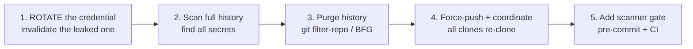

# Bad Shortcuts Anti-Patterns — Senior Level

> **Category:** [Development Anti-Patterns](../README.md) → **Bad Shortcuts** — *convenience taken now, paid back many times later.*
> **Covers (collectively):** Copy-Paste Programming · Magic Numbers / Strings · Hard Coding · Cargo Cult Programming · Pokémon Exception Handling · Stringly-Typed Programming

---

## Table of Contents

1. [Introduction](#introduction)
2. [Prerequisites](#prerequisites)
3. [How Did the Codebase Get Here? — Root-Cause Forces](#how-did-the-codebase-get-here--root-cause-forces)
4. [Eliminating Duplication at Scale — and the Cost of the Wrong Shared Dependency](#eliminating-duplication-at-scale--and-the-cost-of-the-wrong-shared-dependency)
5. [Configuration & Secrets Strategy Across Many Services](#configuration--secrets-strategy-across-many-services)
6. [Designing a Codebase-Wide Error-Handling Strategy](#designing-a-codebase-wide-error-handling-strategy)
7. [Rolling Out Type-Driven Design into a Stringly-Typed Legacy](#rolling-out-type-driven-design-into-a-stringly-typed-legacy)
8. [Running Safe Campaigns: De-Magic-Numbering and Secret-Purge](#running-safe-campaigns-de-magic-numbering-and-secret-purge)
9. [When a Shortcut Is the Right Call](#when-a-shortcut-is-the-right-call)
10. [Prevention: Lint Gates, Scanners, CODEOWNERS, Conventions](#prevention-lint-gates-scanners-codeowners-conventions)
11. [Common Mistakes](#common-mistakes)
12. [Test Yourself](#test-yourself)
13. [Cheat Sheet](#cheat-sheet)
14. [Summary](#summary)
15. [Further Reading](#further-reading)
16. [Related Topics](#related-topics)

---

## Introduction

> Focus: **How did the codebase get here?** and **How do I fix it safely at scale?**

At the junior level you learned to *recognize* the six shortcuts; at the middle level you learned to *resist* them under pressure and to avoid each fix's over-applied trap. This file is about the codebase you inherit: the tax rate `0.0825` is hardcoded in 40 files, a production database password sits in git history from 2021, every status is a `String`, and the standard way to handle errors is `catch (Exception e) { log.error("err"); }` because that's what the first three services did and everyone copied them.

Two questions define senior-level work here:

1. **How did it get this way?** Bad shortcuts at scale are not individual sloppiness — they are the *deterministic output* of organizational forces: a deadline ratchet that never schedules the cleanup, onboarding that teaches "copy the nearest service," the absence of a config strategy, and the absence of an error-handling convention. If you fix the symptom without the force, the symptom regrows. The 41st hardcoded tax rate appears the week after you finish removing the first 40.

2. **How do I fix it without breaking prod?** Most of these fixes are *cross-cutting* — a shared library that 30 services import, a secret that's live in production, an enum introduced into a column that ten services read and write. The wrong move causes an outage or a leak. The senior toolkit is the same disciplined machinery you use for structural change — parallel-change, expand/migrate/contract, feature flags, telemetry, reversible commits — applied to duplication, configuration, errors, and types.

> **The senior mindset shift:** the junior asks "is this a shortcut?"; the senior asks "what force produces this shortcut across the org, what does it cost us per change, and what is the smallest reversible step — plus the gate that stops it recurring — that removes it?" You are not cleaning one file; you are changing a *system's defaults*.

---

## Prerequisites

- **Required:** Fluency with [`junior.md`](junior.md) and [`middle.md`](middle.md) — you can identify all six anti-patterns, apply the basic fix, and name each fix's over-applied trap (over-DRY, constants God-file, over-configuration, exception-wrapping that drops the cause, try/catch everywhere, enum-ifying open sets).
- **Required:** You have shipped to production, owned an incident, rotated a credential, and maintained a service you did not write.
- **Helpful:** Working knowledge of feature flags, a CI pipeline you can extend, and a secrets manager (Vault, AWS/GCP Secrets Manager, SOPS).
- **Helpful:** Familiarity with the cross-cutting refactoring techniques from [Bad Structure → senior](../01-bad-structure/senior.md) — parallel-change, branch-by-abstraction, characterization tests — because de-duplication and type rollouts use exactly these.
- **Helpful:** [SOLID](../../../../../Architecture/README.md), [Refactoring techniques](../../../refactoring/02-refactoring-techniques/README.md), and a basic grasp of distributed systems (these fixes cross service boundaries).

---

## How Did the Codebase Get Here? — Root-Cause Forces

Every cluster of shortcuts has a biography. Before you launch a cleanup, understand the force that produced it, because **the same force will recreate the shortcut faster than you can delete it.**

### The deadline ratchet

Each deadline justifies one local shortcut: copy the service instead of extracting the shared piece, inline the literal instead of naming it, swallow the error to stop the page from crashing tonight. Individually rational, each is a click of a ratchet that only turns one way — toward more debt — because *the cleanup is never itself a deadline*. The hardcoded values, the duplicated logic, and the swallowed exceptions are the ratchet's sediment. The senior counter is not "try harder under pressure"; it's to **make the right move cheap** (so it's not slower under pressure) and to **schedule cleanup as funded work** (so the ratchet has a reverse gear).

### Copy-paste-driven onboarding

The single largest multiplier of shortcuts. When the answer to *"how do I make a new service / endpoint / handler?"* is "copy the last one and change the names," every shortcut in the template propagates to every new unit — including the swallowed exception, the hardcoded region, the magic timeout. Copy-paste onboarding is how *one* person's shortcut becomes *the organization's convention*. The fix is to make the canonical path the easy path: a scaffolding generator, a service template, a shared base that bakes in the *right* defaults so copying spreads good patterns instead of bad ones.

### Missing config strategy

When there is no agreed answer to *"where does a per-environment value live, and where does a secret live?"*, every value lands wherever it was first typed — in source. Hard Coding is the negative space left by an absent configuration strategy. Without a strategy you also get *drift*: prod, staging, and dev configs diverge silently, and "works on staging" stops predicting "works in prod."

### No error-handling convention

When the codebase has no agreed error taxonomy, no agreed result-vs-exception model, and no agreed error boundary, every developer invents their own — and under pressure the cheapest invention wins: catch everything, log a string, continue. Pokémon handling is the negative space left by an absent error-handling *contract*. The first service sets the de-facto standard by accident, and copy-paste onboarding spreads it.

### Broken windows

> *"One broken window, left unrepaired, instills a sense of abandonment."* — Hunt & Thomas, *The Pragmatic Programmer*

Shortcuts are contagious because they lower the local standard. One `catch (Exception e) {}` in a file says "silent failure is acceptable here," and the next edit adds another. One magic number says "literals are fine here." The corollary is the senior's lever: repairing the window — and adding a gate that *keeps* it repaired — raises the standard and slows the spread.

```mermaid
graph TD
    DR[Deadline ratchet<br/>cleanup never scheduled] --> CP[Copy-Paste]
    DR --> MN[Magic Numbers/Strings]
    DR --> PE[Pokémon Exceptions]
    CPO[Copy-paste-driven<br/>onboarding] --> CP
    CPO --> PE
    MCS[Missing config<br/>strategy] --> HC[Hard Coding]
    NEC[No error-handling<br/>convention] --> PE
    HC --> MN
    ST[Stringly-typed<br/>defaults] --> MN
    CC[Cargo cult<br/>copied snippets] --> CP
    CC --> PE
    BW[Broken windows] -. "lowers local standard" .-> PE
    BW -. .-> MN
    BW -. .-> CP
```

The practical takeaway: **a senior cleanup plan names the force, not just the smell.** "Remove the hardcoded tax rate" is a wish. "Introduce a config module, move the rate behind it, add a secret-scanner and a magic-number lint gate to CI, and update the service template so new services read config from day one" is a plan that *stays fixed*.

---

## Eliminating Duplication at Scale — and the Cost of the Wrong Shared Dependency

At the junior level, de-duplication is Extract Function. At scale the hard question is not *how* to remove duplication but *where the shared knowledge should live* — and that decision has a cost you cannot undo cheaply. The wrong shared dependency is worse than the duplication it replaced.

### The three homes for shared knowledge

| Home | Use when | Cost |
|---|---|---|
| **In-process function / module** | Duplication is *within one service/deployable* | Cheapest; no versioning, no release coordination |
| **Shared internal library / package** | The knowledge is genuinely the same across services *and* changes together | Versioning, release process, **every consumer must upgrade**; a bad version can break many services at once |
| **Accept the duplication** | The code looks alike but the services *own their rule independently* (coincidental, or deliberately decoupled across a boundary) | Each service changes on its own schedule; the price is keeping copies in sync *only when they truly must be* |

The middle-level "is this *knowledge* or *text*?" test still applies — but at the service boundary a new force appears: **a shared library is a coupling.** Every service that imports it is now joined to its release cadence, its bugs, and its API decisions. Sandi Metz's warning scales up brutally: *the wrong abstraction shared across 30 services is 30 services you must coordinate to fix.*

### The cost of the wrong shared dependency

```mermaid
graph TD
    SL[Shared library v1] --> S1[Service A]
    SL --> S2[Service B]
    SL --> S3[Service C ... x30]
    BUG[Bug or breaking change in shared lib] -. "must upgrade all" .-> S1
    BUG -. .-> S2
    BUG -. .-> S3
```

When a shared library encodes a *true* shared invariant (a money type, a canonical event schema, an auth-token verifier), the coupling is the *point* — you *want* all services to agree, and a single fix should propagate. When it encodes a *coincidental* similarity (two services' validation rules that merely match today), the coupling is a trap: the day Service A's rule must change, you either fork the library (defeating the purpose) or force a change on Service B that didn't want it.

> **The senior heuristic:** share a library only across what must change *together*. Prefer **duplication across a service boundary** over a wrong shared dependency, because duplication is locally fixable and a bad shared dependency requires multi-team coordination to undo. "A little copying is far cheaper than the wrong abstraction" — and at the boundary, *much* cheaper.

### De-duplicating safely with parallel-change

When you *do* consolidate genuine duplication that crosses a versioned boundary, treat it like any cross-cutting change: **expand → migrate → contract**.

```go
// Money math duplicated (slightly, buggily) in 6 services. The rounding rule
// is a TRUE shared invariant — all services must agree. Consolidate via a
// shared package, but migrate one caller at a time.

// EXPAND: publish the shared package alongside the existing copies. Nobody
// is forced to switch yet.
package money // shared internal lib, semver'd

func Round(cents int64, rule Rule) int64 { /* the one correct implementation */ }

// MIGRATE: each service swaps its local copy for money.Round on its own
// schedule, behind its own tests, ideally with a shadow comparison:
//   want := localRound(x); got := money.Round(x, BankersRounding)
//   if want != got { metrics.Inc("money.round.divergence") }  // verify before trusting

// CONTRACT: when a service's divergence counter is zero, delete its local copy.
```

This is identical to the [branch-by-abstraction / parallel-change](../01-bad-structure/senior.md) machinery used for structural change — because crossing a versioned boundary *is* a structural change.

---

## Configuration & Secrets Strategy Across Many Services

Hard Coding at scale is solved by an *organization-wide configuration strategy*, not by sprinkling `os.Getenv`. The senior deliverable is a strategy that answers, uniformly, *where each kind of value lives*, *how it's injected*, *how it's validated*, *how secrets are rotated*, and *how drift is prevented*.

### The strategy, layered (12-factor as a baseline)

The [Twelve-Factor App](https://12factor.net) factor III ("config in the environment") is the floor, not the ceiling. A mature strategy layers values by what varies:

| Layer | Holds | Source of truth | Changes |
|---|---|---|---|
| **Code constants** | Truly fixed values (`SECONDS_PER_DAY`) | Source | Only via code release |
| **Config-as-code** (checked in) | Non-secret per-env defaults, feature flags | Versioned config files / IaC | PR + review; audited |
| **Runtime env / config service** | Per-deploy endpoints, pool sizes, modes | Deploy pipeline / Consul / SSM | Per deploy, no rebuild |
| **Secrets manager** | Credentials, keys, tokens | Vault / Secrets Manager / KMS | Rotated on a schedule; *never* in git |

The principle: **non-secret config should be config-as-code** (versioned, reviewed, diffable, auditable) — not hand-edited in a console where it drifts; **secrets must be dynamic and rotatable**, ideally short-lived and fetched at runtime.

### Validate config at startup — fail fast

A senior pattern that prevents an entire class of production incidents: **validate the full config on boot and refuse to start if it's invalid.** A missing or malformed value should crash the process at startup with a clear message, not surface as a `nil` three hours into a request.

```python
# Python — config validated and frozen at startup. Missing/invalid -> the
# process won't start, with a precise error. No env reads scattered in code.
from pydantic import BaseSettings, PostgresDsn, validator

class Settings(BaseSettings):
    database_url: PostgresDsn          # required; malformed DSN fails to load
    request_timeout_s: float = 5.0     # per-env, has a safe default
    max_pool_size: int = 20
    region: str

    @validator("request_timeout_s")
    def _positive(cls, v):
        if v <= 0:
            raise ValueError("request_timeout_s must be > 0")
        return v

settings = Settings()   # raises at import/boot if env is incomplete or invalid
```

### Secret rotation as a first-class flow

Hardcoded credentials are not just untidy — they make rotation *impossible without a deploy*, which is why nobody rotates them. The strategy must make rotation a config change, not a code change. The mature shape is **dynamic secrets** (the app fetches short-lived credentials at runtime and refreshes them) so a leak's blast radius is minutes, not "forever."

```java
// Java — credentials fetched from a secrets manager at runtime and refreshed,
// not baked into source or even into a static env var. Rotation is automatic.
public final class DbCredentials {
    private final SecretsClient vault;
    private volatile Credentials current;

    DbCredentials(SecretsClient vault) {
        this.vault = vault;
        this.current = vault.fetch("db/app");          // short-lived lease
        scheduler.scheduleAtFixedRate(this::refresh,    // rotate before expiry
            Duration.ofMinutes(50), Duration.ofMinutes(50));
    }
    private void refresh() { this.current = vault.fetch("db/app"); }
    public Credentials get() { return current; }
}
```

### Preventing drift

Drift — config that differs between environments in ways nobody intended — is the silent killer of "but it worked in staging." Defenses: **config-as-code** so every value is in version control and diffable; a **single schema** (the `Settings` type above) shared by all environments so the *shape* can't drift even if values do; and **CI checks** that diff env configs and flag undeclared keys. See [Secrets Management](../../../../../Architecture/system-design/README.md).

> **The trap (still over-configuration):** a strategy is not "make everything an env var." Knobs nobody turns multiply the test matrix and let operators misconfigure the system into invalid states — the [Soft Coding](../03-over-engineering/senior.md) anti-pattern at org scale. Configure what genuinely varies per environment; keep truly-fixed values as code constants.

---

## Designing a Codebase-Wide Error-Handling Strategy

The junior fix is "catch what you can handle"; the middle fix is "classify errors, catch narrow, chain the cause." The senior job is to design the **convention the whole codebase follows** — because Pokémon handling regrows wherever there's no agreed contract, and copy-paste onboarding spreads whatever the first service did.

### 1. An error taxonomy

Define a small, shared vocabulary of error *categories*, each with a defined handling policy. This is the contract every service codes against.

| Category | Example | Policy |
|---|---|---|
| **Validation / client error** | bad input, 4xx | Return a structured error to the caller; do *not* retry; do *not* alert |
| **Transient / retryable** | timeout, 503, deadlock | Retry with backoff at a defined boundary; alert only if budget exhausted |
| **Domain failure** | payment declined, insufficient stock | A *result*, not an exception — it's an expected business outcome |
| **Bug / programmer error** | nil deref, invariant broken | Fail fast, crash loudly, alert; never "handle" |
| **Dependency outage** | downstream hard-down | Circuit-break / degrade gracefully; alert |

### 2. Result vs exceptions — pick a model per layer, deliberately

The senior decision is *where* errors are values and *where* they are exceptions:

- **Domain failures are results, not exceptions.** "Payment declined" and "out of stock" are normal outcomes; modeling them as exceptions forces every caller into try/catch and invites Pokémon swallowing. Return a `Result`/`Either`/sum type.
- **Bugs and truly-exceptional conditions are exceptions** (or `panic`) — they should unwind to a boundary and crash/alert.

```go
// Go — domain outcomes are values; only the unexpected is an error.
type ChargeResult struct {
    Outcome Outcome // Approved | Declined | InsufficientFunds  (an enum, not a string)
    TxnID   string
}

// Declined is a RESULT (expected). A gateway being unreachable is an ERROR.
func (s *Charger) Charge(o Order) (ChargeResult, error) {
    resp, err := s.gateway.Post(ctx, o)
    if err != nil {
        return ChargeResult{}, fmt.Errorf("charge %s: %w", o.ID, err) // wrap, keep cause
    }
    return ChargeResult{Outcome: classify(resp), TxnID: resp.ID}, nil
}
```

```java
// Java — sealed result type makes the caller handle every domain outcome;
// the compiler refuses to let one be silently dropped.
sealed interface ChargeResult permits Approved, Declined, InsufficientFunds {}
record Approved(String txnId) implements ChargeResult {}
record Declined(String reason) implements ChargeResult {}
record InsufficientFunds() implements ChargeResult {}
```

### 3. Error boundaries

Decide the *few* places where errors are caught, logged, and translated — typically the request handler, the message-consumer loop, and the job runner. Everywhere else, errors **propagate** (wrapped with context). One boundary owns the policy: structured log + metric + user-facing translation. This is the antidote to try/catch-everywhere: the happy path stays clean, and there's exactly one place that decides the response.

```python
# Python — ONE error boundary (a web middleware). Application code raises
# typed errors and never catches broadly; the boundary maps them uniformly.
@app.middleware("http")
async def error_boundary(request, call_next):
    try:
        return await call_next(request)
    except ValidationError as e:
        return json_error(400, e.fields)                       # client error -> 4xx
    except DomainError as e:
        return json_error(409, e.code)                         # expected -> mapped
    except Exception as e:                                      # bug/unknown -> 5xx
        log.exception("unhandled", request_id=request.state.rid, route=request.url.path)
        metrics.inc("errors.unhandled", route=request.url.path)
        return json_error(500, "internal")                     # loud + traced, never silent
```

### 4. Observability: structured logging is part of the contract

A swallowed exception is the *absence* of observability; the strategy's job is to make the right thing observable by default. Mandate **structured logs** (key-value, machine-queryable) with a correlation ID propagated across services, and **emit a metric per error category** so you can alert on rates, not on individual lines. "Log the error with context" becomes concrete: `log.error(err, request_id=..., user=..., op=...)`, never `log.error("error")`.

### 5. Fail-fast vs degrade — a per-context decision

The taxonomy drives it: bugs and missing config **fail fast** (crash at boundary/startup); dependency outages **degrade** (circuit-break, serve stale/cached, queue for later); a batch job over 10k records **log-and-skips** a bad record (fail-safe) while a payment **fails fast**. The choice is a design decision recorded in the taxonomy, not an each-developer default.

> **The deliverable** is a one-page error-handling convention (taxonomy + result-vs-exception rule + boundary list + logging/metrics standard) *plus the lint rule that enforces it* (bare-except / empty-catch fails CI) *plus the service template that bakes in the boundary*. Without the gate and the template, the next copy-pasted service reinvents Pokémon. See [Clean Code → Error Handling](../../../clean-code/06-error-handling/README.md) and the [error-handling-patterns](../../../clean-code/06-error-handling/README.md) skill.

---

## Rolling Out Type-Driven Design into a Stringly-Typed Legacy

Introducing enums and value types into a greenfield service is easy. The senior challenge is introducing them **incrementally into a live, stringly-typed system** — a `status` column that ten services read and write, an API field consumers depend on, a database with eight years of historical strings — *without a flag day and without breaking a single consumer.*

### Why you can't just change the type

`String status` flows through a serialized API, a persisted column, a message schema, and ten codebases. Swapping it to an enum everywhere at once is a coordinated multi-team big-bang — the exact thing that fails. Instead, introduce the *type* at the boundaries of one service first and let it spread by parallel-change.

### The incremental rollout

```mermaid
stateDiagram-v2
    [*] --> Wrap: parse string -> enum at the edges
    Wrap --> Internalize: internal code uses the enum only
    Internalize --> Migrate: callers/services adopt the enum
    Migrate --> Tighten: reject unknown strings; backfill data
    Tighten --> [*]: string is an impl detail at the wire only
```



1. **Wrap at the edges (anti-corruption layer).** Keep the wire/DB representation a string, but parse it into an enum the instant it enters your service and serialize back at the exit. Internally, *nothing* is stringly-typed. Crucially, **parse leniently first** — map unknown strings to an `Unknown` variant and *count* it (telemetry), rather than rejecting, so you discover the real value set before you enforce it.

```python
from enum import Enum

class Status(Enum):
    PENDING = "pending"
    ACTIVE  = "active"
    CLOSED  = "closed"
    UNKNOWN = "__unknown__"   # safety valve during migration

    @classmethod
    def parse(cls, raw: str) -> "Status":
        try:
            return cls(raw)
        except ValueError:
            metrics.inc("status.unknown", value=raw)   # what's REALLY in prod?
            log.warning("unknown status string", raw=raw)
            return cls.UNKNOWN                          # don't crash mid-migration
```

2. **Internalize.** Refactor the service's internals to use `Status` exclusively. The string now lives only at the serialization boundary. This is a within-service change — no consumers affected.

3. **Migrate consumers / sibling services** one at a time (parallel-change), each adopting the enum at *its* boundary on its own schedule. Both the string and the typed form remain valid on the wire throughout.

4. **Tighten once telemetry is clean.** When `status.unknown` has read zero for a full business cycle, you *know* the real value set. Backfill any legacy/dirty data, then flip `parse` from lenient (`UNKNOWN`) to strict (reject unknown), and add a DB constraint / schema enum. Only now is the illegal state truly unrepresentable end-to-end.

> The discipline mirrors the [strangler / parallel-change](../01-bad-structure/senior.md) approach: introduce the new form alongside the old, verify on real production data via telemetry, migrate incrementally, and only *contract* (tighten/reject) when the evidence says it's safe. Skipping the lenient-parse-with-telemetry step is how a type rollout becomes a production incident the first time a forgotten legacy value (`"Active "` with a trailing space) hits a strict parser.

---

## Running Safe Campaigns: De-Magic-Numbering and Secret-Purge

Two cleanups deserve special senior treatment because the naïve approach causes outages (de-magic-numbering) or leaves you still-breached while feeling safe (secret purge).

### The de-magic-numbering campaign

The naïve "find-and-replace `0.0825` with `TAX_RATE`" is dangerous: not every `0.0825` means the tax rate (some are coincidental), and merging genuinely-distinct values that happen to match today recreates coincidental-duplication coupling. Run it as a campaign:

1. **Inventory, don't replace.** Grep the literal across the codebase; for each occurrence, determine *what it means here*. Two `0.0825`s may be tax-rate and an unrelated threshold.
2. **Name by meaning, grouped by owner.** Introduce `SalesTaxRate` in the *billing* module, not a global `Constants` God-file (the middle-level trap, now at scale). Distinct meanings get distinct names even if values match.
3. **Decide constant vs config per value.** A rate that differs by region/environment is *config*, not a constant — moving it to a constant just renames the smell while keeping it un-deployable-without-rebuild.
4. **One meaning per commit, behavior-preserving.** Small reversible commits; characterization tests (or at least existing tests green) prove the value didn't change. If a value *should* change, that's a separate, clearly-labeled commit — never mixed in.
5. **Add the lint gate** (`MagicNumber` rule) so new literals fail CI — otherwise the deadline ratchet refills what you emptied.

### The secret-purge campaign — rotation first, history second

The dangerous misconception (covered at the middle level, critical at senior): **deleting a committed secret in a new commit does nothing.** The secret lives in git history forever and in every clone, fork, CI cache, and backup. The order of operations is non-negotiable:



1. **Rotate first.** Invalidate the exposed credential and issue a new one. This is the *only* step that actually stops the breach; do it before anything else. History rewriting is cleanup, not remediation.
2. **Scan the full history** (`trufflehog`, `gitleaks --log-opts="--all"`) — there are usually more secrets than the one you found.
3. **Rewrite history** with `git filter-repo` (or BFG) to excise the secrets from every commit.
4. **Force-push and coordinate** — every collaborator must re-clone (rewritten history diverges); CI caches and forks must be purged. This is disruptive, which is why **rotation, not purge, is the real fix** — purge reduces residual exposure but rotation is what closes the hole.
5. **Install the gate**: a secret scanner in pre-commit *and* CI so the next secret never reaches `main`.

```bash
# Step 2-3, sketched. NEVER run filter-repo before rotating the live credential.
trufflehog git file://. --since-commit HEAD~5000          # find all secrets in history
git filter-repo --replace-text secrets-to-redact.txt     # excise from every commit
# then: force-push, notify team to re-clone, invalidate CI caches/forks
```

> **The rule:** treat any committed secret as *compromised forever*. Rotate immediately; purge to reduce residue; gate to prevent recurrence. A secret scanner in pre-commit is the single highest-ROI gate you can add — the cost it prevents (a leaked production credential) is catastrophic and irreversible.

---

## When a Shortcut Is the Right Call

The senior skill juniors lack entirely: **knowing when a shortcut is the correct engineering decision.** The anti-pattern is not "taking a shortcut" — it's taking it *unconsciously, in code that will be read and changed again, without a tracked path back.* A shortcut is legitimate when the deferred cost will genuinely never be paid, or when it's explicitly tracked.

Legitimate shortcuts:

- **A true throwaway script.** A one-off data migration or a CI helper that runs once and is deleted — hardcode the path, inline the literal, skip the abstraction. Cleaning it up is throwing good effort after code that won't exist next week. *The test:* it has no future readers and no future changes.
- **A spike / prototype.** Code written to *learn* (is this API viable? does this approach perform?) is meant to be thrown away. The shortcut is the point — you're optimizing for speed of learning. *The discipline:* it must be visibly quarantined (a `spike/` branch, never merged to `main`) so it can't silently become production.
- **A deadline shortcut with a tracked follow-up.** Shipping the swallowed-error version to make the launch, *with* a filed ticket, a `// TODO(PROJ-451): catch narrowly + alert` linking it, and a place on the next sprint. The debt is explicit, owned, and scheduled — the opposite of the invisible deferral that defines the anti-pattern.
- **Accepting duplication across a boundary** (from the earlier section) — deliberately *not* DRYing, because a wrong shared dependency would cost more.

What makes these legitimate and the anti-pattern not: **the deferred cost is either zero (no future change) or made explicit and scheduled (tracked debt).** The anti-pattern is the *silent, unbounded* deferral — the shortcut that ships with no ticket, in code on the critical path, where "later" never comes.

> **The frame:** debt is a tool, like financial leverage. Taken deliberately, tracked, and paid down, it accelerates delivery. Taken unconsciously and never serviced, it compounds until it bankrupts the codebase's changeability. The senior takes debt *on purpose, with a payoff plan* — and says so in the PR.

---

## Prevention: Lint Gates, Scanners, CODEOWNERS, Conventions

Cleanups remove today's shortcuts; *prevention* stops them regrowing. Since the root causes are organizational (deadline ratchet, copy-paste onboarding, missing strategies, broken windows), the durable fixes are automated and organizational — they outlast the engineer who cares.

### Automated gates in CI (the load-bearing defense)

Encode each shortcut as a **build-failing check**, so a violation fails CI instead of relying on a reviewer noticing.

| Shortcut | Gate in CI / pre-commit |
|---|---|
| **Hardcoded secrets** | `gitleaks` / `trufflehog` in **pre-commit *and* CI** — the non-negotiable one |
| **Copy-Paste** | Duplication detector with a ratcheting threshold: `jscpd`, PMD CPD, SonarQube |
| **Magic Numbers** | Linter rule: Checkstyle `MagicNumber`, `pylint R2004`, ESLint `no-magic-numbers` |
| **Pokémon Exceptions** | `errcheck`/`staticcheck` (Go), `pylint W0702` bare-except, SonarQube "empty catch" |
| **Hardcoded config** | Custom lint / arch test forbidding `os.Getenv`/`System.getenv` outside the config module |
| **Stringly-typed** | Hard to lint generically; arch test on specific known-bad signatures + review |

Make these **ratcheting** gates: new code must not *add* violations even while legacy ones are grandfathered. The threshold only tightens — quality is the thing that ratchets up, reversing the deadline ratchet.

```yaml
# .github/workflows/ci.yml (sketch) — gates that fail the build.
- run: gitleaks detect --redact --exit-code 1          # no secrets, ever
- run: golangci-lint run --new-from-rev=origin/main    # no NEW lint debt (ratchet)
- run: jscpd --threshold 0 --gitignore src/            # no new duplication
```

### CODEOWNERS — close the ownership gap

Every directory needs an owner so the shared library, the config module, and the error-handling convention are *shaped*, not just *added to*. `CODEOWNERS` auto-requests the right team and gives someone the standing to say "that literal should be config" or "don't fork the shared money lib."

```text
# .github/CODEOWNERS
/pkg/money/        @org/platform-team     # the shared lib — guarded against forks
/config/           @org/platform-team     # config-as-code, one reviewer of record
/internal/errors/  @org/platform-team     # the error taxonomy lives here
* @org/eng-leads                          # nothing unowned
```

### Conventions and the service template (close the copy-paste-onboarding gap)

The highest-leverage prevention against copy-paste onboarding is to **make the canonical path the easy path**: a scaffolding generator / service template that bakes in the *right* defaults — reads config from the config module, wires the error boundary, uses the shared types — so when people inevitably copy, they copy *good* patterns. Pair it with short, written conventions (a one-page error-handling standard, a config-placement rule, a "shared-lib needs a real shared invariant" rule) and an **ADR** recording *why* each convention exists, so the next engineer reads the rationale instead of re-litigating it.

> **The senior's real product is not the cleanup — it's the system that keeps the shortcut from regrowing:** a secret scanner in CI, a ratcheting magic-number gate, an owned config module, an enforced error convention, and a service template that spreads good defaults. Code rots back to its defaults; change the defaults, and the shortcuts stop coming back.

---

## Common Mistakes

Mistakes seniors make fixing bad shortcuts at scale:

1. **DRYing across a service boundary into a wrong shared dependency.** Consolidating coincidental similarity into a shared library couples teams who didn't want to be coupled; the day one needs a different rule, you fork or force a change. *Share only what must change together; prefer duplication over the wrong shared dependency.*
2. **"Fixing" a leaked secret by deleting it in a new commit.** The secret is still in history and every clone. *Rotate first (the only real fix), then purge history, then add a scanner gate.*
3. **Mixing a value change into a de-magic-numbering commit.** When the deploy breaks, you can't tell whether naming the literal or changing it did it. *Naming is behavior-preserving; any value change is a separate, labeled commit.*
4. **A strict enum rollout with no lenient-parse + telemetry step.** The first forgotten legacy string (`"Active "`) hits the strict parser and takes down a service. *Parse leniently to `Unknown` with a counter first; tighten only when telemetry is clean.*
5. **Treating "config in the environment" as the whole strategy.** Making everything an env var produces drift, an untestable matrix, and operator-induced invalid states ([Soft Coding](../03-over-engineering/senior.md)). *Layer values; config-as-code for non-secrets; dynamic, rotatable secrets; validate at startup.*
6. **Designing an error taxonomy but not enforcing it.** A convention nobody's CI checks decays the moment a copy-pasted service ignores it. *Ship the lint gate and the service template with the convention, or it won't hold.*
7. **Modeling expected domain outcomes as exceptions.** "Payment declined" as an exception forces try/catch on every caller and invites Pokémon swallowing. *Domain failures are results; only bugs and truly-exceptional conditions are exceptions.*
8. **Removing the shortcut without naming the force.** You delete the 40 hardcoded rates; the 41st appears next sprint because onboarding still says "copy the last service." *Add the gate, fix the template, schedule the cleanup — fix the force or it regrows.*

---

## Test Yourself

1. You find the same money-rounding logic (slightly divergent, one copy buggy) in six services. When do you consolidate it into a shared library, when do you leave the duplication, and how do you migrate safely if you consolidate?
2. A production database password was committed to git eight months ago and "removed" in the next commit. Is the system safe? List the exact sequence of remediation steps in order, and say which one actually stops the breach.
3. You must replace a stringly-typed `status` (read/written by ten services and persisted with eight years of history) with an enum, without a flag day. Outline the incremental rollout and name the one step whose omission most likely causes an outage.
4. Distinguish a *domain failure* from a *bug* in an error taxonomy, and explain why each should be modeled differently (result vs exception) and handled differently (degrade vs fail-fast).
5. Give two situations where taking a bad-shortcut-shaped decision is actually the *correct* senior call, and state precisely what makes them legitimate rather than the anti-pattern.
6. Your team removes 40 hardcoded tax rates this sprint. What two mechanisms do you put in place so the 41st doesn't appear next sprint, and which root-cause force does each address?
7. Why is "prefer a little duplication over the wrong abstraction" *more* true across a service boundary than within a single service?

<details>
<summary>Answers</summary>

1. Consolidate **only if the rounding rule is a true shared invariant** — all six services must agree and should change together (likely yes for money math). Then it belongs in a semver'd shared library. **Leave the duplication** if the similarity is coincidental or the services deliberately own their rule independently, because a wrong shared dependency couples teams and is costly to undo. **Migrate safely** via parallel-change: *expand* (publish the shared lib alongside existing copies), *migrate* (each service swaps in the shared call on its own schedule, ideally with a shadow comparison logging any divergence), *contract* (delete each local copy once its divergence counter is zero).
2. **No, it is not safe** — the secret is in git history forever and in every clone, fork, CI cache, and backup; the later "removal" commit did nothing. Order: **(1) Rotate** the credential (invalidate the leaked one, issue a new one) — *this is the only step that actually stops the breach*; (2) scan the full history for other secrets; (3) rewrite history with `git filter-repo`/BFG to excise them; (4) force-push and coordinate re-clones / purge CI caches and forks; (5) add a secret scanner to pre-commit and CI. Rotation is remediation; history purge is residue-reduction.
3. **Wrap** at the edges with an anti-corruption layer — parse the string to an enum on entry, serialize back on exit — but **parse leniently** to an `Unknown` variant with a telemetry counter rather than rejecting. **Internalize** (service internals use the enum only). **Migrate** consumers/sibling services one at a time (parallel-change), string and enum both valid throughout. **Tighten** only after the `unknown` counter reads zero for a full business cycle: backfill dirty data, switch to strict parsing, add a DB constraint. The most outage-prone omission is **skipping the lenient-parse-with-telemetry step** — a strict parser meets a forgotten legacy value and crashes.
4. A **domain failure** (payment declined, out of stock) is an *expected business outcome*; a **bug** (nil deref, broken invariant) is a programmer error. Model domain failures as **results** (`Result`/sealed type) so the caller must handle every outcome and none is silently swallowed; model bugs as **exceptions/panics** that unwind to a boundary. Handle domain failures by **returning/degrading** (it's normal); handle bugs by **failing fast and alerting** (you want to find and fix them, never "handle" them).
5. Any two: a **true throwaway script** (runs once, deleted — no future readers/changes, so the deferred cost is genuinely zero); a **spike/prototype** (written to learn, visibly quarantined off `main`, never merged); a **deadline shortcut with a tracked follow-up** (filed ticket + linking `TODO` + a slot on the next sprint). What makes them legitimate: the deferred cost is either **zero** (no future change) or **explicit and scheduled** (tracked debt) — not the *silent, unbounded* deferral on the critical path that defines the anti-pattern.
6. Any two, e.g.: **a `MagicNumber` lint gate in CI** (ratcheting — new literals fail the build) — addresses the *deadline ratchet* by making quality the thing that only tightens; **fix the service template / scaffolding** so new services read config from the config module from day one — addresses *copy-paste-driven onboarding*; **schedule cleanup as funded roadmap work** — gives the deadline ratchet a reverse gear; **a config module + CODEOWNERS on it** — addresses the *missing config strategy* and *ownership gap*.
7. Within a service, a wrong abstraction is locally fixable — one team, one deploy, one revert. Across a service boundary it becomes a **shared, versioned coupling**: undoing it requires every consumer to upgrade, coordinated across teams and release cadences, and a bad version can break many services at once. So the cost of the wrong abstraction scales with the number of coupled services, while the cost of duplication stays local — making "prefer duplication" much stronger at the boundary.

</details>

---

## Cheat Sheet

| Shortcut at scale | Root-cause force | Senior fix | Safety mechanism |
|---|---|---|---|
| **Copy-Paste** | Copy-paste onboarding + deadline ratchet | Share only true invariants; in-proc vs lib vs *accept duplication* | Parallel-change migration + shadow-compare; prefer duplication over wrong shared dep |
| **Magic Numbers/Strings** | Deadline ratchet + broken windows | De-magic-numbering campaign: name by meaning, grouped by owner; constant *or* config | One-meaning-per-commit, behavior-preserving; `MagicNumber` lint gate |
| **Hard Coding** | Missing config strategy | Layered config strategy: code / config-as-code / runtime / secrets manager | Validate at startup (fail fast); dynamic rotatable secrets; drift checks |
| **Cargo Cult** | Copied snippets/patterns | Justify every element; canonical template spreads *good* defaults | "What ticket needs this now?" review gate |
| **Pokémon Exceptions** | No error-handling convention | Taxonomy + result-vs-exception + error boundaries + structured logging | Bare-except/empty-catch lint gate + boundary baked into template |
| **Stringly-Typed** | Stringly-typed defaults | Incremental type rollout: anti-corruption layer, lenient-parse + telemetry, tighten | Telemetry before strict parsing; parallel-change across services; backfill before constraint |

**Three golden rules:**
- *Name the force, not just the smell — add the gate and fix the template, or the shortcut regrows.*
- *Rotate before you purge; a committed secret is compromised forever — rotation is the only real fix.*
- *Take debt on purpose, tracked and scheduled — the anti-pattern is the silent, unbounded deferral, not the shortcut itself.*

---

## Summary

- **How it got here:** bad shortcuts at scale are the deterministic output of organizational forces — the **deadline ratchet** (cleanup never scheduled), **copy-paste-driven onboarding** (one shortcut becomes the convention), a **missing config strategy** (Hard Coding fills the void), **no error-handling convention** (Pokémon fills the void), and **broken windows**. Fix the symptom without the force and it regrows.
- **De-duplication at scale** is a *where-does-it-live* decision: in-process function, shared versioned library, or *deliberately accepted duplication*. Share only what must change together; **prefer duplication across a boundary over the wrong shared dependency**, and migrate genuine consolidation via parallel-change with shadow comparison.
- **Configuration** is a layered strategy — code constants / config-as-code / runtime config / secrets manager — **validated at startup** (fail fast), with **dynamic, rotatable secrets** and **drift checks**. "Everything is an env var" is over-configuration (Soft Coding).
- **Error handling** is a designed, codebase-wide convention: an **error taxonomy**, **results for domain failures and exceptions for bugs**, a few **error boundaries**, **structured logging + per-category metrics**, and a deliberate **fail-fast-vs-degrade** policy — enforced by a lint gate and a service template.
- **Type-driven rollout** into stringly-typed legacy is incremental: anti-corruption layer at the edges, **lenient parse to `Unknown` with telemetry**, internalize, migrate consumers via parallel-change, and **tighten only when telemetry is clean** (then backfill + constrain).
- **Campaigns:** de-magic-number one meaning per behavior-preserving commit (constant *or* config); secret-purge is **rotate → scan → rewrite history → coordinate → gate** — and rotation, not purge, is what stops the breach.
- **When a shortcut is right:** throwaway scripts, quarantined spikes, and deadline shortcuts *with a tracked follow-up*. The anti-pattern is the *silent, unbounded* deferral, not deliberate, scheduled debt.
- **Prevention is organizational and automated:** secret scanners in pre-commit/CI, ratcheting lint gates, CODEOWNERS on shared/config/error modules, written conventions + ADRs, and a service template that spreads good defaults. The senior's real deliverable is the system that keeps the shortcut from un-happening.
- Next: [`professional.md`](professional.md) — the runtime, performance, and toolchain implications of these shortcuts and their fixes (exception-handling cost, config-reload, type-erasure boundaries).

---

## Further Reading

- **Working Effectively with Legacy Code** — Michael Feathers (2004) — seams and characterization tests, the safety net under every cross-cutting cleanup here.
- **Refactoring** — Martin Fowler (2nd ed., 2018) — Parallel Change, Branch by Abstraction, Replace Magic Literal, Replace Type Code with Subclasses — the mechanics of de-duplication and type rollout.
- **The Pragmatic Programmer** — Hunt & Thomas (20th anniv. ed., 2019) — DRY's correct scope, broken windows, reversibility, tracer bullets.
- **The Twelve-Factor App** — [12factor.net](https://12factor.net) — config in the environment (factor III), the floor of a config strategy.
- **Release It!** — Michael Nygard (2nd ed., 2018) — error boundaries, fail-fast, circuit breakers, graceful degradation as a strategy.
- *"The Wrong Abstraction"* — Sandi Metz (2016) — why duplication beats the wrong abstraction; the principle that scales to shared-library decisions.
- **Building Secure and Reliable Systems** — Google (2020) — secret rotation, dynamic credentials, and defense-in-depth for the config/secrets sections.
- **martinfowler.com** — "ParallelChange," "BranchByAbstraction," and "DataEnvelope" articles (canonical short references).

---

## Related Topics

- [Bad Structure → senior](../01-bad-structure/senior.md) — the sibling category; the parallel-change / strangler / characterization-test machinery reused here for de-duplication and type rollout.
- [Over-Engineering → senior](../03-over-engineering/senior.md) — the over-applied failure modes: Soft Coding (over-configuration) and Speculative Generality (the wrong shared abstraction).
- [Clean Code → Error Handling](../../../clean-code/06-error-handling/README.md) — designing error flow, the foundation of the codebase-wide error strategy.
- [Clean Code → Meaningful Names](../../../clean-code/01-meaningful-names/README.md) — naming by *meaning* in the de-magic-numbering campaign.
- [DRY Principle](../../../clean-code/README.md) — and its limits at the service boundary (the wrong shared dependency).
- [Refactoring → Refactoring Techniques](../../../refactoring/02-refactoring-techniques/README.md) — Parallel Change, Branch by Abstraction, Replace Type Code.
- [Secrets Management / System Design](../../../../../Architecture/system-design/README.md) — config-as-code, secret rotation, dynamic credentials, drift prevention.
- [Architecture → SOLID & System Design](../../../../../Architecture/README.md) — boundaries and the Conway's-law angle behind copy-paste onboarding.
