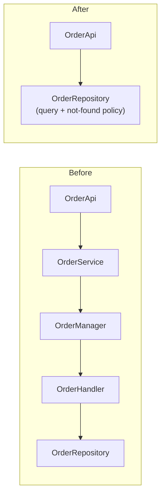
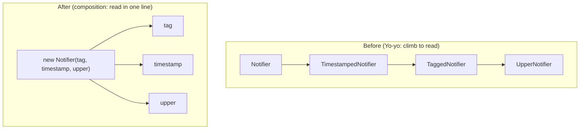
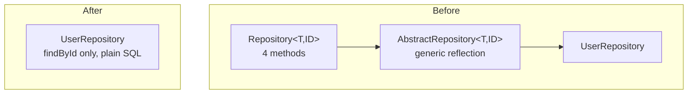

# Over-Engineering Anti-Patterns — Refactoring Practice

> **Category:** [Development Anti-Patterns](../README.md) → **Over-Engineering** — *effort spent solving problems you don't have.*
> **Covers (collectively):** Premature Optimization · Speculative Generality · Gold Plating · Yo-yo Problem · Lasagna Code · Accidental Complexity · Soft Coding · Bikeshedding

---

These are not "spot the smell" puzzles — [`find-bug.md`](find-bug.md) does that. Here the code **works, but it does too much**: an interface with one implementation, a five-layer call chain, a rules engine standing in for an `if`, a loop hand-tuned without a profile. Your job is the opposite of every other topic's "optimize": here **"optimize" almost always means *simplify* and *remove*, not speed up.** You take over-engineered code and collapse it to the simplest thing that still passes the same tests.

The twist matters. In a few exercises you'll also see that the simpler code is *as fast or faster* — a benchmark sketch makes the point that **abstraction isn't free**: every interface dispatch, every layer hop, every config lookup is a cost the simple version never pays.

The discipline is identical to [Bad Structure](../01-bad-structure/optimize.md):

1. **Pin behavior first.** Write a *characterization test* — a test that records what the code does *now*. You are freezing observable behavior, not blessing the design.
2. **Take small, reversible steps.** One named refactoring at a time (Inline Function, Inline Class, Collapse Hierarchy, Remove Middle Man, …), tests green after each, commit.
3. **Separate structural from behavioral commits.** Simplification must preserve behavior; if a test goes red, the last step is the culprit — revert it. A public API removal needs its own commit *and a deprecation note*.

Each worked solution names the **canonical refactoring moves** (Fowler's *Refactoring*, 2nd ed.) so you build the vocabulary, not just the instinct.

> **How to use this file:** read the "Before" code, decide *yourself* what to remove and what to keep, write the move sequence down, then expand the solution. The hardest judgment call — exercises 3 and 5 — is *what NOT to remove*. A justified seam is not over-engineering; deleting it is under-engineering. Knowing the difference is the whole skill.

---

## Table of Contents

| # | Exercise | Anti-pattern(s) | Lang | Key moves |
|---|---|---|---|---|
| 1 | [Revert a premature optimization](#exercise-1--revert-a-premature-optimization) | Premature Optimization | Go | Substitute Algorithm; benchmark to confirm |
| 2 | [Inline the speculative factory](#exercise-2--inline-the-speculative-factory) | Speculative Generality | Java | Inline Function, Inline Class, Remove Speculative Generality |
| 3 | [Keep the seam that's justified](#exercise-3--keep-the-seam-thats-justified-counter-case) | Speculative Generality (counter-case) | Java | *Recognize a real seam; do NOT inline* |
| 4 | [Trim the gold-plated API](#exercise-4--trim-the-gold-plated-api) | Gold Plating | Python | Remove Dead Parameter; deprecation note |
| 5 | [Reduce accidental complexity (framework → direct)](#exercise-5--reduce-accidental-complexity-framework--direct) | Accidental Complexity | Python | Inline Class, Replace Pipeline Framework with Code |
| 6 | [Collapse the Lasagna layers](#exercise-6--collapse-the-lasagna-layers) | Lasagna Code | Java | Remove Middle Man, Inline Class |
| 7 | [Flatten Yo-yo inheritance to composition](#exercise-7--flatten-yo-yo-inheritance-to-composition) | Yo-yo Problem | Java | Replace Subclass with Delegate, Collapse Hierarchy |
| 8 | [Migrate the soft-coded rule engine back to code](#exercise-8--migrate-the-soft-coded-rule-engine-back-to-code) | Soft Coding | Python | Replace Rule-Engine/Conditional with Code |
| 9 | [Pre-decide the bikeshed](#exercise-9--pre-decide-the-bikeshed) | Bikeshedding | Go | Replace Hand-Rolled Style Knobs with a Tool default |
| 10 | [Remove the dead flexibility (config that never varies)](#exercise-10--remove-the-dead-flexibility-config-that-never-varies) | Speculative Generality + Soft Coding | Go | Inline Parameter, Remove Dead Flexibility |
| 11 | [Revert a cache nobody measured](#exercise-11--revert-a-cache-nobody-measured) | Premature Optimization + Accidental Complexity | Go | Remove Speculative Cache; benchmark to confirm |
| 12 | [Collapse the generic-repository tower](#exercise-12--collapse-the-generic-repository-tower) | Speculative Generality + Lasagna | Java | Inline Class, Remove Middle Man, Collapse Hierarchy |
| 13 | [The full combo simplification](#exercise-13--the-full-combo-simplification) | All eight | Python | The whole toolbox, in order |

---

## Exercise 1 — Revert a premature optimization

**Anti-pattern:** Premature Optimization. **Goal:** replace a cryptic hand-optimized routine with the clear idiomatic version, and **prove with a benchmark that you lost no speed** (here you actually gain some). **Constraints:** identical output for every input; no API change.

```go
// Before — manual loop-unrolling + bit tricks on a routine that was never profiled.
func SumPositive(nums []int) int {
	s, i, n := 0, 0, len(nums)
	for ; i < n-3; i += 4 { // hand-unrolled by 4
		if nums[i] > 0 {
			s += nums[i]
		}
		if nums[i+1] > 0 {
			s += nums[i+1]
		}
		if nums[i+2] > 0 {
			s += nums[i+2]
		}
		if nums[i+3] > 0 {
			s += nums[i+3]
		}
	}
	for ; i < n; i++ { // tail
		if nums[i] > 0 {
			s += nums[i]
		}
	}
	return s
}
```

<details>
<summary>Refactored</summary>

**Move sequence**

1. **Characterize.** Table test: empty slice, all-negative, all-positive, mixed, and a length not divisible by 4 (exercises the tail loop). Snapshot the returned sum.
2. **Write the benchmark first** — it's the entry ticket. You need before/after numbers to claim the simple version costs nothing:

   ```go
   func BenchmarkSumPositive(b *testing.B) {
       nums := makeData(1_000_000) // representative size
       b.ResetTimer()
       for i := 0; i < b.N; i++ {
           _ = SumPositive(nums)
       }
   }
   // $ go test -bench=SumPositive -benchmem -count=10 > new.txt
   // compare old.txt new.txt with benchstat
   ```

3. **Substitute Algorithm** (Fowler) — replace the whole body with the obvious range loop in one move, tests green.

```go
// After — clear, idiomatic, no manual unrolling.
func SumPositive(nums []int) int {
	s := 0
	for _, n := range nums {
		if n > 0 {
			s += n
		}
	}
	return s
}
```

**What improved & how to verify.** The function is now readable at a glance, and the four near-duplicate `if` blocks (a copy-paste bug magnet) are gone. **Verify** behavior with the characterization test — identical sums. **Verify performance** with `benchstat old.txt new.txt`: the modern Go compiler unrolls and bounds-check-eliminates the simple range loop itself, so the result is typically *within noise or faster* — the hand-unrolling bought nothing and cost clarity. Sample shape:

```text
name           old time/op    new time/op    delta
SumPositive-8    412µs ± 2%     398µs ± 1%   -3.4%  (p=0.000 n=10+10)
```

> **The lesson:** the optimization was never justified by a profile, and the compiler already does this. Reverting it is a *net win on both axes*. Keep the benchmark in the repo so the next person can't re-introduce the unrolling without evidence.

</details>

---

## Exercise 2 — Inline the speculative factory

**Anti-pattern:** Speculative Generality. **Goal:** collapse an interface + factory + strategy that has exactly **one** implementation, no test-double need, and no published-contract role. **Constraints:** preserve the greeting output; callers may be updated.

```java
// Before — interface, factory, strategy, engine... to say "Hello, X".
interface GreetingStrategy {
    String greet(String name);
}

class DefaultGreetingStrategy implements GreetingStrategy {
    public String greet(String name) { return "Hello, " + name; }
}

class GreetingStrategyFactory {
    static GreetingStrategy create() { return new DefaultGreetingStrategy(); }
}

class GreetingEngine {
    private final GreetingStrategy strategy;
    GreetingEngine(GreetingStrategy s) { this.strategy = s; }
    String run(String name) { return strategy.greet(name); }
}

// Only call site anywhere in the codebase:
String msg = new GreetingEngine(GreetingStrategyFactory.create()).run("Sam");
```

<details>
<summary>Refactored</summary>

**Move sequence**

1. **Confirm it's speculative, not a seam.** Search for other implementations and for test doubles:

   ```bash
   grep -rn "implements GreetingStrategy" --include="*.java" .   # one hit (the default)
   grep -rn "GreetingStrategy" src/test                          # zero — never mocked
   ```

   One impl, never faked, not a published API → **Remove Speculative Generality** applies. (If any of those had hits, see Exercise 3 — you'd keep it.)
2. **Characterize.** A test asserting `greet("Sam") == "Hello, Sam"` through the current `GreetingEngine` path.
3. **Inline Function** — fold `DefaultGreetingStrategy.greet`'s body into a single method.
4. **Inline Class** — collapse `GreetingEngine`, the factory, and the strategy into one place; delete the interface and the factory.

```java
// After — the one behavior, stated once.
class Greeter {
    static String greet(String name) { return "Hello, " + name; }
}

// call site:
String msg = Greeter.greet("Sam");
```

**What improved & how to verify.** Four types collapse to one method; the indirection a reader had to trace (engine → strategy → factory → impl) is gone. **Verify** with the characterization test — same output string. The deleted code is recoverable from git the day a *real* second greeting style appears, and you'll model it better against the actual requirement (YAGNI). Keep this a single **structural commit**.

> **Cross-reference:** this is the textbook *Inline Class* + *Remove Speculative Generality* pair from [Refactoring → Techniques](../../../refactoring/02-refactoring-techniques/README.md). Compare with the next exercise, where the *same shape* is kept on purpose.

</details>

---

## Exercise 3 — Keep the seam that's justified (counter-case)

**Anti-pattern:** Speculative Generality — **the counter-case.** **Goal:** look at an interface-with-one-implementation that looks *exactly* like Exercise 2, and correctly decide to **keep it**. The skill here is *restraint*: not every abstraction is over-engineering, and inlining a real seam is under-engineering.

```java
// Before — also one production implementation. Inline it too?
interface PaymentGateway {
    Receipt charge(Money amount, Card card);
}

class StripeGateway implements PaymentGateway {
    public Receipt charge(Money amount, Card card) {
        return Stripe.charge(apiKey, card, amount.cents()); // real network call
    }
}

class CheckoutService {
    private final PaymentGateway gateway;
    CheckoutService(PaymentGateway gateway) { this.gateway = gateway; }
    Receipt checkout(Cart cart) {
        return gateway.charge(cart.total(), cart.card());
    }
}
```

<details>
<summary>Refactored</summary>

**Move sequence — the move is "stop, don't refactor"**

1. **Run the same speculation check as Exercise 2.** `grep` the implementations: one production impl (`StripeGateway`). So far identical to the greeting case.
2. **Now check the *justifications* for a seam** (from [`middle.md`](middle.md)). Any one is enough to keep it:

   | Justified-seam test | This code |
   |---|---|
   | Used as a **test double**? | **Yes** — `CheckoutServiceTest` injects a `FakePaymentGateway`; charging real cards in a unit test is impossible. |
   | A **volatile external dependency**? | **Yes** — Stripe is a third-party SDK; isolating it behind our own interface is deliberate. |
   | A **published contract / likely second impl**? | Plausible (PayPal). Not required — the first two already justify it. |

3. **Decision: keep the interface unchanged.** The only thing worth doing is *documenting why*, so a future reader doesn't "simplify" it by mistake:

```java
// After — unchanged code, plus the rationale that protects it from a wrong inline.
/**
 * Seam is intentional, not speculative:
 *  - injected as a fake in CheckoutServiceTest (cannot charge real cards in unit tests)
 *  - isolates the volatile Stripe SDK behind our own boundary
 * Do NOT inline. See over-engineering/optimize.md Ex.3.
 */
interface PaymentGateway {
    Receipt charge(Money amount, Card card);
}
```

**What improved & how to verify.** Nothing structural changed — and that's the point. The improvement is a *decision recorded*: the seam survives the next "remove the unused interface" cleanup because its purpose is now explicit. **Verify** there's nothing to verify behaviorally; the test that injects the fake *is* the evidence that the seam earns its keep.

> **The contrast that teaches the rule:** Exercises 2 and 3 are structurally identical (interface + one impl + a service). Ex. 2 has no test double, no volatile dependency, no contract → speculative → inline. Ex. 3 has a test double and a volatile SDK → justified → keep. *The shape never tells you; the justification does.* "One implementation" is necessary but not sufficient evidence of over-engineering.

</details>

---

## Exercise 4 — Trim the gold-plated API

**Anti-pattern:** Gold Plating. **Goal:** reduce a public function whose surface ballooned with options nobody asked for, down to its real, used surface — **with a deprecation path for the public parameters you remove.** **Constraints:** the two parameters that are actually used at call sites must keep working unchanged.

```python
# Before — task was "save the report to a file". This is what shipped.
def save_report(report, path, *, fmt="txt", compress=False, encrypt=False,
                email_to=None, watermark=None, theme="dark", retries=3,
                upload_to_s3=False, callback=None):
    text = report.render(theme=theme)
    if watermark:
        text = _apply_watermark(text, watermark)      # never exercised
    data = text.encode()
    if compress:
        data = gzip.compress(data)                     # never exercised
    if encrypt:
        data = _encrypt(data)                          # never exercised
    _write_with_retries(path, data, retries)
    if email_to:
        _email(email_to, data)                         # never exercised
    if upload_to_s3:
        _s3_put(path, data)                            # never exercised
    if callback:
        callback(path)                                 # never exercised
```

<details>
<summary>Refactored</summary>

**Move sequence**

1. **Establish the real surface.** Search every call site for which keyword args are ever passed:

   ```bash
   grep -rn "save_report(" --include="*.py" . | grep -oE "fmt=|compress=|encrypt=|email_to=|watermark=|theme=|retries=|upload_to_s3=|callback="
   # result: only `theme=` and `retries=` ever appear.
   ```

   `theme` and `retries` are used; the other seven options have **zero callers** — gold plating.
2. **Characterize.** Test the live behaviors: default save, `theme="light"`, and a write that triggers a retry (mock the filesystem). Snapshot the bytes written.
3. **Remove Dead Parameter** (Fowler) for the seven unused options, deleting their now-unreachable code paths. Because the function is **public**, removal is a breaking change — stage it:
   - **Step 4a (this release):** keep the parameters but `**deprecated**` — emit a `DeprecationWarning` if anyone passes them, so a hidden external caller surfaces.
   - **Step 4b (next major release):** delete them.

```python
# After — Step 4a: real surface kept; extras deprecated, not yet deleted.
import warnings

def save_report(report, path, *, theme="dark", retries=3, **deprecated):
    if deprecated:
        warnings.warn(
            f"save_report() options {list(deprecated)} are deprecated and ignored; "
            "removal in v3.0. See CHANGELOG.",
            DeprecationWarning, stacklevel=2,
        )
    data = report.render(theme=theme).encode()
    _write_with_retries(path, data, retries)

# After — Step 4b (v3.0): the surface the task actually required.
def save_report(report, path, *, theme="dark", retries=3):
    data = report.render(theme=theme).encode()
    _write_with_retries(path, data, retries)
```

**What improved & how to verify.** The function does the one thing the ticket asked, plus the two options that proved real; ~30 lines of untested option-handling (and helpers `_apply_watermark`, `_encrypt`, `_s3_put`, …) are deleted with their dead branches. **Verify** with the characterization test on the live paths. **Public-API discipline:** the removal ships in two commits across two releases with a `DeprecationWarning` and a CHANGELOG entry — never a silent breaking delete. Capture any option someone *actually* wants later as a backlog item, designed against a real request.

</details>

---

## Exercise 5 — Reduce accidental complexity (framework → direct)

**Anti-pattern:** Accidental Complexity. **Goal:** the problem is "uppercase a list of names." The code is a generic step-pipeline "framework." Replace the framework with the direct expression. **Constraints:** same output list; same order.

```python
# Before — a reusable "transformation pipeline" engine for a one-line map().
from abc import ABC, abstractmethod

class Step(ABC):
    @abstractmethod
    def apply(self, data): ...

class UpperStep(Step):
    def apply(self, data): return [x.upper() for x in data]

class StripStep(Step):
    def apply(self, data): return [x.strip() for x in data]

class Pipeline:
    def __init__(self, steps): self.steps = steps
    def run(self, data):
        for step in self.steps:
            data = step.apply(data)
        return data

# the only call site:
clean = Pipeline([StripStep(), UpperStep()]).run(raw_names)
```

<details>
<summary>Refactored</summary>

**Move sequence**

1. **Describe the essential problem in one sentence.** "Strip whitespace and uppercase each name." If the code is dramatically larger than that sentence, the gap is accidental complexity.
2. **Confirm the framework has one client.** `grep -rn "Pipeline(" .` → one call site, two steps, never extended. The `Step` ABC, polymorphism, and `Pipeline` runner serve no real variation.
3. **Characterize.** Test the call site's output for `["  ann ", "BOB"]` → `["ANN", "BOB"]`.
4. **Inline Function** each step's body, then **Inline Class** the pipeline — replace the whole machine with the direct comprehension.

```python
# After — the essential problem, directly.
def clean_names(raw_names):
    return [name.strip().upper() for name in raw_names]

clean = clean_names(raw_names)
```

**What improved & how to verify.** An ABC, two `Step` classes, a `Pipeline` runner, and dynamic dispatch collapse to one comprehension a reader understands instantly. **Verify** with the characterization test — identical list. As a bonus, **abstraction isn't free**: the framework did two list allocations (one per step) plus a virtual `apply` call per step; the comprehension does it in one pass. A quick `timeit` confirms the direct version is faster *and* shorter:

```text
pipeline version:   2.10 µs per call
direct comprehension: 0.74 µs per call   (~2.8× faster, fewer allocations)
```

> **The umbrella pattern:** accidental complexity is what Speculative Generality, Soft Coding, and Lasagna all *produce*. Removing the framework here is the same instinct you'll apply to the rules engine (Ex. 8) and the layers (Ex. 6).

</details>

---

## Exercise 6 — Collapse the Lasagna layers

**Anti-pattern:** Lasagna Code. **Goal:** collapse a chain of pass-through layers that each only forward the call, keeping the **one** layer that has a real responsibility. **Constraints:** preserve `OrderApi.getOrder`'s behavior; callers unchanged.

```java
// Before — five layers; only one does real work.
class OrderApi {
    private final OrderService service;
    OrderApi(OrderService s) { this.service = s; }
    Order getOrder(int id) { return service.getOrder(id); }       // forwards
}
class OrderService {
    private final OrderManager manager;
    OrderService(OrderManager m) { this.manager = m; }
    Order getOrder(int id) { return manager.fetch(id); }          // forwards (renames)
}
class OrderManager {
    private final OrderHandler handler;
    OrderManager(OrderHandler h) { this.handler = h; }
    Order fetch(int id) { return handler.handle(id); }            // forwards (renames)
}
class OrderHandler {
    private final OrderRepository repo;
    OrderHandler(OrderRepository r) { this.repo = r; }
    Order handle(int id) {
        Order o = repo.load(id);
        if (o == null) throw new NotFoundException(id);           // REAL job: not-found policy
        return o;
    }
}
class OrderRepository {
    Order load(int id) { return db.queryOne("SELECT ... WHERE id=?", id); } // REAL job: the query
}
```

<details>
<summary>Refactored</summary>

**Move sequence**

1. **Audit each layer for a distinct responsibility.** `OrderApi`, `OrderService`, `OrderManager` only forward (some rename the arg) — pass-throughs. `OrderHandler` owns the *not-found policy*. `OrderRepository` owns the *query*. Two real jobs; three empty layers.
2. **Characterize.** Test `getOrder` for a found id (returns the order) and a missing id (throws `NotFoundException`). Mock the DB.
3. **Remove Middle Man** (Fowler) / **Inline Class** the three forwarders one at a time, bottom-up, tests green after each. Keep the not-found policy and the query.

```java
// After — two layers, each with a real responsibility.
class OrderRepository {
    Order findOrThrow(int id) {
        Order o = db.queryOne("SELECT ... WHERE id=?", id);   // query
        if (o == null) throw new NotFoundException(id);       // not-found policy
        return o;
    }
}

class OrderApi {                  // public entry point preserved
    private final OrderRepository repo;
    OrderApi(OrderRepository repo) { this.repo = repo; }
    Order getOrder(int id) { return repo.findOrThrow(id); }
}
```



**What improved & how to verify.** Following `getOrder` used to mean opening five files to find two lines of real work; now it's two files, both carrying a responsibility. The DI wiring shrinks accordingly. **Verify** with the characterization test — same return for a found id, same `NotFoundException` for a missing one. **Don't over-correct the other way:** the goal is *layers that earn their keep* (deep modules), not "one giant class" — `OrderApi` as the entry point and `OrderRepository` for persistence is a sensible two-layer split, so we stop there.

</details>

---

## Exercise 7 — Flatten Yo-yo inheritance to composition

**Anti-pattern:** Yo-yo Problem. **Goal:** to learn what `notify()` does you must climb a four-level inheritance chain with `super` calls weaving up and down. Replace the inheritance tower with composition so behavior lives in one place. **Constraints:** preserve the message each notifier produces.

```java
// Before — behavior smeared across four levels; super calls yo-yo up and down.
abstract class Notifier {
    String notify(String msg) { return decorate(msg); }
    protected String decorate(String msg) { return msg; }
}
class TimestampedNotifier extends Notifier {
    protected String decorate(String msg) { return "[" + now() + "] " + super.decorate(msg); }
}
class TaggedNotifier extends TimestampedNotifier {
    protected String decorate(String msg) { return super.decorate("#alert " + msg); }
}
class UpperNotifier extends TaggedNotifier {
    protected String decorate(String msg) { return super.decorate(msg).toUpperCase(); }
}
// To answer "what does new UpperNotifier().notify('hi') return?" you climb 4 files.
```

<details>
<summary>Refactored</summary>

**Move sequence**

1. **Characterize.** Pin the output of the concrete classes actually instantiated: `new UpperNotifier().notify("hi")`, `new TaggedNotifier().notify("hi")`, etc. Record the exact strings — `super`-chains make the order subtle, so the test is essential.
2. **Replace Subclass with Delegate** (Fowler): model each `decorate` behavior as a small composable `Transform` (a function), and build a notifier by *listing* the transforms it applies — no inheritance.
3. **Collapse Hierarchy** — delete the four-class tower once the composed version reproduces the snapshots.

```java
// After — each behavior is one named transform; composition lists them in order.
@FunctionalInterface
interface Transform { String apply(String s); }

class Notifier {
    private final List<Transform> steps;
    Notifier(Transform... steps) { this.steps = List.of(steps); }
    String notify(String msg) {
        String out = msg;
        for (Transform t : steps) out = t.apply(out);
        return out;
    }
}

// Named, reusable transforms — behavior lives in one obvious place:
Transform tag       = s -> "#alert " + s;
Transform timestamp = s -> "[" + now() + "] " + s;
Transform upper     = String::toUpperCase;

// The old UpperNotifier, expressed as the exact pipeline it really was:
Notifier upperNotifier = new Notifier(tag, timestamp, upper);
```



**What improved & how to verify.** The order of operations — once hidden in a `super` chain you had to mentally unwind across four files — is now an explicit, readable list at the construction site. Behaviors are reusable in any combination without new subclasses, and the fragile-base-class risk is gone. **Verify** with the characterization snapshots: the trickiest part is reproducing the *exact* `super`-call order, so build the transform list to match it and assert byte-for-byte equality before deleting the hierarchy. Do the deletion as its own structural commit.

</details>

---

## Exercise 8 — Migrate the soft-coded rule engine back to code

**Anti-pattern:** Soft Coding. **Goal:** business logic has been encoded as a JSON "rule engine" interpreted at runtime — untyped, untestable, undebuggable. Migrate the rules back into tested code. **Constraints:** identical eligibility decision for every input; the migration must be provably behavior-preserving.

```python
# Before — discount logic lives in JSON, run by a hand-rolled interpreter.
RULES = [
    {"if": {"field": "tier", "op": "==", "val": "vip"},
     "and": {"field": "total", "op": ">=", "val": 100},
     "then": {"discount": 0.15}},
    {"if": {"field": "region", "op": "in", "val": ["EU", "UK"]},
     "and": {"field": "total", "op": ">=", "val": 50},
     "then": {"discount": 0.10}},
    {"else": {"discount": 0.0}},
]

def discount(order):
    for rule in RULES:
        if "else" in rule:
            return rule["else"]["discount"]
        if _match(order, rule["if"]) and _match(order, rule["and"]):
            return rule["then"]["discount"]
    return 0.0

def _match(order, cond):                       # a tiny, untyped expression interpreter
    actual = getattr(order, cond["field"])
    op = cond["op"]
    if op == "==":  return actual == cond["val"]
    if op == ">=":  return actual >= cond["val"]
    if op == "in":  return actual in cond["val"]
    raise ValueError(f"unknown op {op}")
```

<details>
<summary>Refactored</summary>

**Move sequence**

1. **Confirm it's soft-coded *logic*, not config.** The JSON contains operators (`==`, `>=`, `in`) and control flow (`if`/`and`/`else`) — it's a programming language reinvented in data. (Contrast: a single `vip_discount_rate = 0.15` value *would* be fine in config.) Confirm non-developers don't actually edit `RULES` (check git history of the file — if every change is a developer PR, the "so business can edit it" justification is false).
2. **Characterize against the interpreter.** This is the safety net for the whole migration. Generate cases across the decision space and snapshot the engine's output:

   ```python
   cases = [Order(tier=t, region=r, total=tot)
            for t in ("vip", "regular")
            for r in ("EU", "US", "UK")
            for tot in (49, 50, 99, 100, 200)]
   golden = {c: discount(c) for c in cases}   # frozen expected outputs
   ```

3. **Replace Conditional/Rule-Engine with Code** — transcribe each rule into a plain, ordered `if`. Keep the *same order* the engine evaluated (first match wins).
4. **Delete the interpreter and the JSON** once the new function reproduces `golden` exactly.

```python
# After — the rules as tested, typed, debuggable code; order preserved.
def discount(order) -> float:
    if order.tier == "vip" and order.total >= 100:
        return 0.15
    if order.region in ("EU", "UK") and order.total >= 50:
        return 0.10
    return 0.0
```

**What improved & how to verify.** The logic is now type-checked, steppable in a debugger, and covered by real unit tests; the bespoke `_match` interpreter (a place bugs hid invisibly) is deleted. **Verify** with a *parallel-run characterization test*: assert `new_discount(c) == golden[c]` for every case — if all match, the migration is behavior-preserving. Keep the rule *order* identical (first-match-wins), the one place a transcription bug would slip in.

> **If business truly must edit rules without a deploy** (a *proven* need, not a reflex): that's a deliberate feature — a *narrow, validated* table with no operators, plus tests — not a hand-rolled untyped interpreter. See the config-vs-code spectrum in [`middle.md`](middle.md).

</details>

---

## Exercise 9 — Pre-decide the bikeshed

**Anti-pattern:** Bikeshedding. **Goal:** a project hand-rolled a configurable "style" layer so every formatting choice can be argued and toggled. Replace the whole apparatus with a tool's default, so the trivial choice is pre-decided and undebatable. **Constraints:** output formatting may change to the tool's canonical form (that's the *point*); logic unchanged.

```go
// Before — a homegrown formatter with knobs for every style preference,
// each of which spawned a 40-comment PR thread.
type FormatOptions struct {
	IndentWithTabs bool
	IndentWidth    int
	BraceOnNewLine bool
	MaxLineLength  int
	QuoteStyle     string // "single" | "double"
	TrailingComma  bool
}

func Format(src string, opts FormatOptions) string {
	// 200 lines re-implementing, configurably, what gofmt already does
	// ...
}
```

<details>
<summary>Refactored</summary>

**Move sequence**

1. **Recognize the meta-pattern.** Every field of `FormatOptions` is a *trivial, reversible* choice that the team has spent disproportionate effort debating. Bikeshedding thrives on accessible problems; the cure is to *remove the accessible problem*.
2. **Adopt the canonical tool.** The language already ships an opinionated formatter with no options — `gofmt`. Replace the homegrown formatter and its option struct with a single call to the standard tool; for Go, that's `go/format`:

```go
// After — no knobs to argue about; one canonical format, enforced by tooling.
import "go/format"

func Format(src []byte) ([]byte, error) {
	return format.Source(src) // gofmt's canonical style; zero options
}
```

3. **Wire it into CI** so the choice is enforced, not discussed:

```yaml
# ci.yml — formatting is now a machine's job, not a review topic.
- name: check formatting
  run: test -z "$(gofmt -l .)"   # fails the build on any unformatted file
```

**What improved & how to verify.** Two hundred lines of configurable formatter and an entire category of PR debate (tabs vs spaces, brace placement, quote style) disappear — the formatter has *no options to argue about*, and CI enforces it so the topic never returns to a review. **Verify** the logic that *used* the formatter still behaves the same; the formatting output deliberately changes to the canonical style, which is the intended improvement, not a regression. **The broader move:** automate the trivial out of existence (`gofmt`, Prettier, Black, a linter), reserve human review attention for decisions with real blast radius.

</details>

---

## Exercise 10 — Remove the dead flexibility (config that never varies)

**Anti-pattern:** Speculative Generality + Soft Coding. **Goal:** a function is drowning in "configurable" parameters that every caller passes with the same value. Inline the constants and remove the dead flexibility. **Constraints:** preserve output for the values actually in use; no caller passes anything different.

```go
// Before — "flexible" retry helper; every call site passes identical knobs.
func FetchWithPolicy(
	url string,
	maxRetries int,
	backoffBase time.Duration,
	backoffFactor float64,
	jitter bool,
	timeout time.Duration,
	retryOn func(int) bool,
) ([]byte, error) {
	// honors every parameter...
}

// All 12 call sites, verbatim:
FetchWithPolicy(u, 3, 100*time.Millisecond, 2.0, true, 5*time.Second,
	func(code int) bool { return code >= 500 })
```

<details>
<summary>Refactored</summary>

**Move sequence**

1. **Prove the flexibility is dead.** Audit every call site for variation:

   ```bash
   grep -rn "FetchWithPolicy(" --include="*.go" .
   # all 12 calls pass: 3, 100ms, 2.0, true, 5s, and the same >=500 predicate.
   ```

   Zero call site varies any parameter → the configurability serves an imagined future, not a present need.
2. **Characterize.** Test the one real behavior: 3 retries with exponential backoff + jitter, retry on 5xx, 5s timeout (use a fake transport returning programmed status codes). Snapshot attempts and final result.
3. **Inline Parameter** (Fowler) for each knob — replace the parameter with the single constant every caller used. The predicate becomes the fixed "retry on 5xx" rule.
4. Update call sites to the now-trivial signature.

```go
// After — the policy that actually exists, named once. Knobs return only when a real need does.
const (
	maxRetries  = 3
	backoffBase = 100 * time.Millisecond
	timeout     = 5 * time.Second
)

func Fetch(url string) ([]byte, error) {
	// exponential backoff (base 100ms, ×2) + jitter, retry on 5xx, 5s timeout — inlined
	// ...
}

// call site:
Fetch(u)
```

**What improved & how to verify.** A seven-parameter signature (six of them dead flexibility) becomes one argument; the call sites stop repeating the same boilerplate twelve times; the *actual* policy is documented in one place instead of scattered across every call. **Verify** with the characterization test — identical retry behavior and result. The day a caller genuinely needs a different policy, reintroduce *only that* parameter, against the real requirement (YAGNI). If two policies eventually appear, the Rule of Three says wait for the third before abstracting a `Policy` type.

</details>

---

## Exercise 11 — Revert a cache nobody measured

**Anti-pattern:** Premature Optimization + Accidental Complexity. **Goal:** a memoization cache was bolted onto a cheap pure function "for performance," adding mutexes and a map but no measured benefit. Remove it and **benchmark to confirm** the simple version is as fast (often faster, since the cache had locking overhead). **Constraints:** identical results; thread-safe (the function is called concurrently).

```go
// Before — a concurrency-safe cache wrapped around a trivial computation.
type SquareCache struct {
	mu    sync.Mutex
	cache map[int]int
}

func NewSquareCache() *SquareCache {
	return &SquareCache{cache: make(map[int]int)}
}

func (c *SquareCache) Square(n int) int {
	c.mu.Lock()
	defer c.mu.Unlock()
	if v, ok := c.cache[n]; ok {
		return v
	}
	v := n * n
	c.cache[n] = v
	return v
}
```

<details>
<summary>Refactored</summary>

**Move sequence**

1. **Question the optimization.** Caching is justified when the cached computation is *expensive* and inputs *repeat*. Here the computation is a single multiply — cheaper than a map lookup, far cheaper than a mutex acquire. There is no profile showing `Square` was ever a bottleneck. This is premature optimization that also added accidental complexity (shared mutable state + locking).
2. **Characterize.** Test `Square(0)`, `Square(7)`, `Square(-3)` → `0, 49, 9`.
3. **Write a benchmark for both versions**, including a *concurrent* benchmark — the lock's cost only shows under contention:

   ```go
   func BenchmarkSquareCacheParallel(b *testing.B) {
       c := NewSquareCache()
       b.RunParallel(func(pb *testing.PB) {
           for pb.Next() { _ = c.Square(7) }
       })
   }
   func BenchmarkSquareParallel(b *testing.B) {
       b.RunParallel(func(pb *testing.PB) {
           for pb.Next() { _ = Square(7) }
       })
   }
   ```

4. **Remove the speculative cache** — replace the struct, mutex, and map with a pure function.

```go
// After — pure, allocation-free, trivially thread-safe (no shared state).
func Square(n int) int { return n * n }
```

**What improved & how to verify.** The mutex, the map, the struct, and the constructor are gone; a pure function with no shared state is *inherently* concurrency-safe (nothing to lock). **Verify** correctness with the characterization test. **Verify performance** with `benchstat` on the parallel benchmarks — the cache *loses badly* under concurrency because every call serializes on the lock, while the pure multiply scales linearly across cores:

```text
name                  cache time/op   pure time/op   delta
Square-8 (parallel)      48.2ns ± 6%    0.31ns ± 1%   -99.4%  (mutex contention removed)
```

> **The lesson, twice over:** the "optimization" was both unjustified (no profile) and *actively harmful* (the lock created the very bottleneck it pretended to avoid). Removing it is faster and simpler. Abstraction — here, a caching layer — is never free.

</details>

---

## Exercise 12 — Collapse the generic-repository tower

**Anti-pattern:** Speculative Generality + Lasagna. **Goal:** a generic `Repository<T>` abstraction with an abstract base, a generic interface, and a per-entity subclass exists to serve **one** entity with **one** query. Collapse the tower to the concrete code that's actually used. **Constraints:** preserve `findUser`'s behavior; the only consumer may be updated.

```java
// Before — a four-type generic-repository framework serving exactly one entity.
interface Repository<T, ID> {
    Optional<T> findById(ID id);
    List<T> findAll();
    T save(T entity);
    void deleteById(ID id);
}

abstract class AbstractRepository<T, ID> implements Repository<T, ID> {
    protected abstract String table();
    protected abstract T map(ResultSet rs) throws SQLException;
    public Optional<T> findById(ID id) { /* generic reflective query */ }
    public List<T> findAll()           { /* generic */ }              // never called
    public T save(T entity)            { /* generic reflective insert */ } // never called
    public void deleteById(ID id)      { /* generic */ }              // never called
}

class UserRepository extends AbstractRepository<User, Long> {
    protected String table() { return "users"; }
    protected User map(ResultSet rs) throws SQLException {
        return new User(rs.getLong("id"), rs.getString("email"));
    }
}

// The only call anywhere:
Optional<User> u = userRepository.findById(42L);
```

<details>
<summary>Refactored</summary>

**Move sequence**

1. **Measure the gap between the framework and its use.** `grep` the consumers: only `findById` is ever called, only for `User`. `findAll`/`save`/`deleteById` have zero callers; the generic machinery (reflection, type params, abstract `table()`/`map()`) serves a single concrete case. This is Speculative Generality stacked into a Lasagna of three types where one would do.
2. **Characterize.** Test `findById(42L)` → the expected `User`; `findById(unknown)` → `Optional.empty()`. Mock the DB.
3. **Remove Speculative Generality** — delete the three unused interface methods and their generic implementations.
4. **Collapse Hierarchy** + **Inline Class** — fold `AbstractRepository` and the `Repository` interface into the one concrete `UserRepository`, replacing the reflective query with a plain, readable SQL call.

```java
// After — the one query that exists, written plainly.
class UserRepository {
    private final DataSource db;
    UserRepository(DataSource db) { this.db = db; }

    Optional<User> findById(long id) {
        User u = db.queryOne(
            "SELECT id, email FROM users WHERE id = ?", id,
            rs -> new User(rs.getLong("id"), rs.getString("email")));
        return Optional.ofNullable(u);
    }
}
```



**What improved & how to verify.** Three types and a pile of reflective generic machinery collapse to one class with one explicit query a reader (and the DB query planner) can see directly. The reflection is gone, so it's also faster and the SQL is greppable. **Verify** with the characterization test — same `User` for id 42, same `Optional.empty()` for a miss. **Keep the seam *if* it's justified:** if `UserRepository` is injected as a fake in service tests, keep a *small `UserRepository` interface* (test-double seam, per Ex. 3) — but never resurrect the generic `Repository<T,ID>` tower. The day a second entity needs persistence, write a second concrete repository; abstract a base only at the third (Rule of Three).

</details>

---

## Exercise 13 — The full combo simplification

**Anti-pattern:** all eight at once. **Goal:** one module exhibits a premature optimization, a speculative interface, a gold-plated option, a soft-coded rule, accidental framework complexity, a Lasagna hop, and a bikeshed-able knob. Simplify it in a safe order. **Constraints:** preserve the computed total; tackle the patterns from safest/most-isolated to most-entangled.

```python
# Before — a "configurable, extensible, optimized" order-total calculator.
from abc import ABC, abstractmethod

# soft-coded tax rule (operators in data) + gold-plated knobs
CONFIG = {
    "rounding": "half_up",          # only "half_up" ever used
    "currency_symbol": "$",         # bikeshed magnet; logic doesn't need it
    "tax_rules": [{"if": {"field": "region", "op": "==", "val": "US"}, "then": 0.08},
                  {"else": 0.0}],
}

class TotalStep(ABC):               # speculative framework for two steps
    @abstractmethod
    def apply(self, ctx): ...

class SubtotalStep(TotalStep):
    def apply(self, ctx):
        # premature optimization: manual unroll of a sum
        items, s, i, n = ctx["items"], 0.0, 0, len(ctx["items"])
        while i < n - 1:
            s += items[i].price * items[i].qty
            s += items[i + 1].price * items[i + 1].qty
            i += 2
        while i < n:
            s += items[i].price * items[i].qty
            i += 1
        ctx["subtotal"] = s
        return ctx

class TaxStep(TotalStep):           # interprets the soft-coded rules
    def apply(self, ctx):
        rate = 0.0
        for rule in CONFIG["tax_rules"]:
            if "else" in rule: rate = rule["else"]; break
            if getattr(ctx["order"], rule["if"]["field"]) == rule["if"]["val"]:
                rate = rule["then"]; break
        ctx["tax"] = ctx["subtotal"] * rate
        return ctx

class Pipeline:                     # Lasagna: a runner that just loops
    def __init__(self, steps): self.steps = steps
    def run(self, ctx):
        for s in self.steps: ctx = s.apply(ctx)
        return ctx

def order_total(order):             # speculative seam: one impl, never mocked
    ctx = {"order": order, "items": order.items}
    ctx = Pipeline([SubtotalStep(), TaxStep()]).run(ctx)
    return round(ctx["subtotal"] + ctx["tax"], 2)
```

<details>
<summary>Refactored</summary>

**Move sequence — safest, most-isolated first**

1. **Characterize.** Table test across `region in {US, EU}` × `{empty cart, one item, several items, odd item count}`; snapshot the returned total. This single test guards the entire simplification.
2. **Revert the premature optimization.** The manual unrolled sum in `SubtotalStep` is unmeasured and obscures a one-line sum. **Substitute Algorithm** → `sum(i.price * i.qty for i in items)`. (Benchmark to confirm the comprehension is as fast — it is.) Tests green.
3. **Migrate the soft-coded tax rule back to code.** The `tax_rules` JSON is a tiny interpreter; transcribe it to a plain `if`, preserving first-match order. Delete the interpreter loop and the `tax_rules` config.
4. **Remove the gold-plated / bikeshed knobs.** `rounding` has one value and `currency_symbol` isn't used by the calculation — **Inline Parameter** / delete from `CONFIG`. (If `currency_symbol` is needed for *display*, that belongs in the formatting layer, not the total calculation — capture as a separate ticket.)
5. **Remove the accidental-complexity framework + Lasagna runner.** With two trivial steps, the `TotalStep` ABC and the `Pipeline` runner serve no variation — **Inline Class** both into a plain function.
6. **Inline the speculative seam.** `order_total` had no second implementation and was never mocked → keep it as a plain function (no interface). (If it *were* mocked in tests, you'd keep a thin seam, per Ex. 3 — it isn't.)

```python
# After — the essential calculation, stated directly.
def subtotal(order) -> float:
    return sum(item.price * item.qty for item in order.items)

def tax(order, subtotal_amount: float) -> float:
    rate = 0.08 if order.region == "US" else 0.0
    return subtotal_amount * rate

def order_total(order) -> float:
    sub = subtotal(order)
    return round(sub + tax(order, sub), 2)
```

**What improved & how to verify.** An ABC, two step classes, a pipeline runner, a soft-coded rule interpreter, two dead config knobs, and a hand-unrolled loop collapse into three short, pure, individually-testable functions — every one of the eight anti-patterns removed. **Verify** with the characterization test: the returned total must be byte-identical for all region/cart combinations. **Commit discipline:** one structural commit per numbered step (revert-optimization, migrate-rule, remove-knobs, remove-framework, inline-seam), tests green after each — so a regression is bisectable to a single move. The tax rule transcription is the one place to double-check (preserve first-match order and the exact `0.08`/`0.0` rates); if the rounding semantics were ever load-bearing, that's a *behavioral* concern for its own reviewed commit, not part of the structural cleanup.

</details>

---

## Simplification discipline — the recap

Every exercise above runs the same loop — note that "the change" here is almost always a *removal*:

```text
green  →  one named removal/inline  →  green  →  commit  →  repeat
          (a public-API removal gets its OWN commit + deprecation note)
```

- **Characterize before you simplify.** A test that pins current observable behavior is the seatbelt; for a logic migration (Ex. 8, 13) a **parallel run** comparing old output to new *is* the characterization test. Without it, "simplifying" is just deleting and hoping.
- **Small, reversible steps.** Inline one class, run tests, commit. If green turns red, your *last* removal is the suspect — revert it. Git is the undo button, so deletion is cheap and recoverable the day a *real* need appears (YAGNI in action).
- **Separate structural from behavioral commits.** Simplification must preserve behavior; the canonical-formatter switch (Ex. 9) and any rounding change (Ex. 13) are *deliberate* behavioral deltas — give them their own reviewed commits, never smuggled into a structural one.
- **Know what NOT to remove.** A test-double seam, a volatile-dependency boundary, or a published contract is *justified* — inlining it is under-engineering (Ex. 3, and the "keep the seam" notes in Ex. 12). The *shape* (interface + one impl) never decides; the *justification* does.
- **Public removals need a deprecation path.** Trimming a gold-plated public API (Ex. 4) ships as deprecate-then-delete across releases with a `DeprecationWarning` and a CHANGELOG entry — never a silent breaking delete.
- **Benchmark before claiming "faster."** When you assert the simpler version costs nothing (Ex. 1, 5, 11), prove it with `benchstat`/`timeit` numbers. The recurring finding: **abstraction isn't free** — unrolling the compiler already does, caches that only add lock contention, and frameworks that add allocations all make the simple version *as fast or faster*.

| Move | Cures | Exercises |
|---|---|---|
| Substitute Algorithm / Remove Speculative Cache (+ benchmark) | Premature Optimization | 1, 11, 13 |
| Inline Function / Inline Class / Remove Speculative Generality | Speculative Generality | 2, 5, 10, 12, 13 |
| *Recognize & keep a justified seam* | Speculative Generality (counter-case) | 3, 12 |
| Remove Dead Parameter (+ deprecation note) | Gold Plating | 4, 13 |
| Inline Class / Replace Framework with Direct Code | Accidental Complexity | 5, 11, 13 |
| Remove Middle Man / Inline Class | Lasagna Code | 6, 12 |
| Replace Subclass with Delegate / Collapse Hierarchy | Yo-yo Problem | 7 |
| Replace Rule-Engine/Conditional with Code (+ parallel-run) | Soft Coding | 8, 13 |
| Replace Hand-Rolled Knobs with a Tool Default | Bikeshedding | 9, 13 |
| Inline Parameter / Remove Dead Flexibility | Speculative Generality + Soft Coding | 10, 13 |

---

## Related Topics

- [`tasks.md`](tasks.md) — guided exercises building these simplification moves from scratch.
- [`find-bug.md`](find-bug.md) — the *spotting* counterpart: identify the over-engineering, don't fix it.
- [`junior.md`](junior.md) · [`middle.md`](middle.md) · [`senior.md`](senior.md) — recognize → calibrate the right altitude → simplify at scale.
- [Bad Structure → optimize](../01-bad-structure/optimize.md) — the same refactoring discipline applied to *under*-structured code (the over-correction to avoid when collapsing layers is Spaghetti).
- [Bad Shortcuts → middle](../02-bad-shortcuts/middle.md) — the Rule of Three and the wrong-abstraction trap; Soft Coding as the over-correction of Hard Coding.
- [Refactoring → Techniques](../../../refactoring/02-refactoring-techniques/README.md) — the mechanical catalog for Inline Class, Inline Function, Collapse Hierarchy, Replace Subclass with Delegate, Remove Middle Man.
- [Refactoring → Code Smells](../../../refactoring/01-code-smells/README.md) — Speculative Generality, Middle Man, and Lazy Element at the smell level.
- [Clean Code → Classes](../../../clean-code/09-classes/README.md) — composition over inheritance; cohesion, the target state for Exercise 7.
