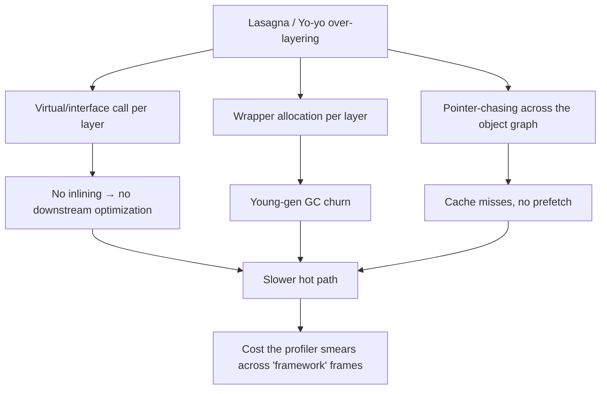

# Over-Engineering Anti-Patterns — Professional Level

> **Category:** [Development Anti-Patterns](../README.md) → **Over-Engineering** — *effort spent solving problems you don't have.*
> **Covers (collectively):** Premature Optimization · Speculative Generality · Gold Plating · Yo-yo Problem · Lasagna Code · Accidental Complexity · Soft Coding · Bikeshedding

---

## Table of Contents

1. [Introduction](#introduction)
2. [Prerequisites](#prerequisites)
3. [Measure First: The Tooling Map](#measure-first-the-tooling-map)
4. [The Performance Irony: Abstraction Layers Cost Cycles](#the-performance-irony-abstraction-layers-cost-cycles)
5. [Lasagna & Yo-yo at Runtime — Dispatch, Allocation, Pointer-Chasing](#lasagna--yo-yo-at-runtime--dispatch-allocation-pointer-chasing)
6. [Premature Optimization vs. the Compiler That Already Did It](#premature-optimization-vs-the-compiler-that-already-did-it)
7. [When Hand-Tuning Actively *Defeats* the Optimizer](#when-hand-tuning-actively-defeats-the-optimizer)
8. [Soft Coding — The Runtime Cost of Interpreting Rules](#soft-coding--the-runtime-cost-of-interpreting-rules)
9. [Accidental Complexity & the Garbage Collector](#accidental-complexity--the-garbage-collector)
10. [Gold Plating & Speculative Generality — Binary, Build, and Warmup Cost](#gold-plating--speculative-generality--binary-build-and-warmup-cost)
11. [A Combined Worked Example: Proving an Abstraction Costs](#a-combined-worked-example-proving-an-abstraction-costs)
12. [Bikeshedding About Performance](#bikeshedding-about-performance)
13. [Common Mistakes](#common-mistakes)
14. [Test Yourself](#test-yourself)
15. [Cheat Sheet](#cheat-sheet)
16. [Summary](#summary)
17. [Further Reading](#further-reading)
18. [Related Topics](#related-topics)

---

## Introduction

> Focus: **What does over-engineering cost the machine** — dispatch, allocation, GC, cache, binary size, warmup — and **how do you prove it**, in both directions: that the abstraction costs something, *and* that removing it actually helps?

`junior.md` taught you to recognize the eight shapes. `middle.md` taught you to calibrate against real needs. [`senior.md`](senior.md) scaled that judgment to architecture. This file goes down to the **runtime and the toolchain**, and it carries a sharper, almost paradoxical thesis:

> **The "clean," heavily-abstracted version is frequently *slower* than the direct version** — and the people who wrote it never measured, because over-engineering feels like rigor. Each speculative layer adds an indirection the CPU must chase, a virtual call the JIT can't inline, an allocation the GC must later collect. The diffuse cost is invisible in any single profile line, so it survives every review that only asks "is this clean?"

But there is a symmetric trap, and it is the one specialists fall into: **assuming that because an abstraction *can* cost something, removing it *will* help.** It often won't — the JIT may have devirtualized it, escape analysis may have stack-allocated it, the layer may be off the hot path entirely. The whole discipline of this level is captured in one sentence:

> **Measure. Don't assume the abstraction is free, and don't assume removing it helps. The optimizer is smarter than you think, and the profiler is the only authority.**

Two corollaries run through everything below:

1. **Premature optimization is, at this level, mostly redundant** — the compiler/JIT already inlines, unrolls, folds constants, and vectorizes. Hand-tuning usually duplicates work the toolchain does for free, and sometimes *prevents* it from happening.
2. **The cost of over-engineering is real but must be located by instruments**, not intuition. Every claim below comes with the tool that would prove or falsify it on *your* code; every number is labeled illustrative.

---

## Prerequisites

- **Required:** Fluent with [`senior.md`](senior.md) — you can lead a team away from a gold-plated platform under delivery pressure.
- **Required:** A working mental model of a managed runtime: heap vs. stack, tracing/generational GC, JIT inlining and devirtualization, escape analysis, monomorphic vs. megamorphic call sites. (The sibling [Bad Structure → professional.md](../01-bad-structure/professional.md) builds this vocabulary — read it first if "megamorphic" isn't yet reflexive.)
- **Required:** You can read a flame graph and a `benchstat`/JMH comparison and separate signal from noise.
- **Helpful:** You have read disassembly (`go tool objdump`, `javap -c`, `dis.dis`) at least once and weren't frightened.
- **Helpful:** profiling-techniques, big-o-analysis, memory-leak-detection for the measurement vocabulary.

---

## Measure First: The Tooling Map

Over-engineering's runtime cost hides in dispatch, allocation, and indirection — none of which you may assume without an instrument. Keep this table close; it is the spine of the whole file.

| Question | Go | Java / JVM | Python |
|---|---|---|---|
| **Did the call inline?** | `go build -gcflags='-m -m'` | `-XX:+PrintInlining`, `-XX:+UnlockDiagnosticVMOptions` | (no inlining — CPython interprets) |
| **What got JIT-compiled / devirtualized?** | (AOT — read objdump) | `-XX:+PrintCompilation`, JITWatch | n/a |
| **Did it escape to the heap?** | `-gcflags='-m'` (`escapes to heap`) | JFR alloc events; escape analysis is implicit | `tracemalloc`, every object is heap |
| **What does the machine code look like?** | `go tool objdump -s Func ./bin` | `javap -c`, `-XX:+PrintAssembly` (hsdis) | `dis.dis(fn)` (bytecode) |
| **Microbenchmark A/B** | `testing.B` + `benchstat` | JMH | `timeit`, `pyperf` |
| **Allocation / GC** | `-memprofile`, `GODEBUG=gctrace=1` | JFR, `-Xlog:gc*`, async-profiler `-e alloc` | `tracemalloc`, `gc` module, `memray` |
| **Object layout / size** | `unsafe.Sizeof`, field order | `jol` | `sys.getsizeof`, `pympler`, `__slots__` |
| **CPU profile / flame graph** | `pprof` | async-profiler, JFR | `cProfile`, `py-spy`, `scalene` |
| **Reflection cost** | `pprof` on `reflect.*` frames | JFR; `-verbose:class` | `cProfile` on `getattr`/`__getattr__` |

```bash
# Go: did this "clean" wrapper get inlined, or is it a real call + maybe an escape?
go build -gcflags='-m -m' ./pkg/... 2>&1 | grep -E 'inlin|escapes|cannot inline'

# Go: dump the actual machine code for one function — see the call vs. inlined body
go tool objdump -s 'pkg.Process' ./bin/app | head -40

# Java: was the strategy.apply() call devirtualized and inlined, or megamorphic?
java -XX:+UnlockDiagnosticVMOptions -XX:+PrintInlining -XX:+PrintCompilation \
     -jar app.jar 2>&1 | grep -iE 'apply|megamorphic|too large|hot method too big'

# Python: what does an "innocent" attribute-chain access actually execute?
python -c "import dis; dis.dis(lambda o: o.engine.strategy.policy.value)"
```

> **Discipline:** if you cannot name the tool that would *falsify* your claim — "this layer is free" or "removing it will speed us up" — you are guessing, and at this level guessing is the anti-pattern.

---

## The Performance Irony: Abstraction Layers Cost Cycles

The central professional insight: **speculative abstraction is not performance-neutral.** Strategy objects, interface-everywhere designs, plugin registries, and deep delegation chains each impose one or more of the following, *per operation*:

| Mechanism | Concrete cost |
|---|---|
| **Virtual / interface dispatch** | An indirect call the CPU can't always predict; the JIT can't inline through a megamorphic site, killing all downstream optimization |
| **Boxing / wrapper allocation** | Each layer may allocate a wrapper, closure, or boxed primitive → GC pressure |
| **Pointer-chasing** | `a.b.c.d` is four dependent memory loads; each can miss cache (~100+ cycles on an L2/L3/RAM miss) |
| **Deep call stacks** | More frames to set up/tear down; pushes the hot loop body out of the I-cache |
| **Lost specialization** | The compiler can't constant-fold or specialize across an interface boundary it can't see through |

The irony is that the abstraction was added *for clarity or "flexibility,"* and it makes the code both harder to read **and** slower. Direct code — a plain function, a concrete type, a flat loop — is what the optimizer rewards.

```go
// "Clean," speculatively-general: a pipeline of Stage interfaces.
type Stage interface{ Apply(x float64) float64 }
type Scale struct{ k float64 }
func (s Scale) Apply(x float64) float64 { return x * s.k }
type Bias struct{ b float64 }
func (s Bias) Apply(x float64) float64 { return x + s.b }

func RunPipeline(stages []Stage, xs []float64) {
	for i, x := range xs {
		for _, st := range stages { x = st.Apply(x) } // interface call per stage per element
		xs[i] = x
	}
}

// Direct: the actual transform, inlinable and vectorizable.
func RunDirect(k, b float64, xs []float64) {
	for i, x := range xs { xs[i] = x*k + b } // no dispatch, no indirection
}
```

`RunPipeline` performs an **interface call per stage per element**. Go's compiler cannot inline `st.Apply` because `st`'s concrete type isn't known at the call site, so the inner body is an indirect call with a non-inlinable function boundary — and the whole loop is therefore un-vectorizable. `RunDirect` compiles to a tight, possibly SIMD'd loop.

```bash
$ go test -bench=Pipeline -benchmem
BenchmarkPipeline-8     2,000,000      612 ns/op     0 B/op   # illustrative
BenchmarkDirect-8      30,000,000       41 ns/op     0 B/op   # ~15x — illustrative
$ go build -gcflags='-m' ./...
./pipe.go:9:  cannot inline RunPipeline: function too complex
./pipe.go:10: st.Apply(x) ... (devirtualization failed: not a static call)
```

> **The point is not "never use interfaces."** Interfaces earn their keep at *boundaries* (test seams, plugin points, real polymorphism). The anti-pattern is routing a **hot inner loop** through speculative dispatch that exists only because someone imagined a future stage. **Measure the loop. If it's hot and the dispatch is speculative, the abstraction is costing you — prove it with `benchstat` and `-m`, then flatten it behind a clean public API.**

---

## Lasagna & Yo-yo at Runtime — Dispatch, Allocation, Pointer-Chasing

[`junior.md`](junior.md) framed Lasagna (too many horizontal pass-through layers) and Yo-yo (too much inheritance depth) as *reading* costs. At runtime they are also *execution* costs.

### 1. Pass-through layers = call overhead + lost inlining

Each Lasagna hop is a function call. In an AOT/JIT world the optimizer will often inline a trivial forwarder — *unless* the chain crosses a virtual/interface boundary or a function the inliner deems too large. A `Controller → Service → Manager → Handler → Repository` chain where each hop is an interface call is five non-inlinable indirect calls per request, plus five stack frames, plus five chances to evict the hot path from the I-cache.

```java
// Yo-yo: behavior smeared across an inheritance chain, each level a virtual call.
abstract class Base       { int step(int x){ return refine(x); } abstract int refine(int x); }
class Mid extends Base     { int refine(int x){ return super.hashCode()+core(x);} int core(int x){return x;} }
class Leaf extends Mid     { int core(int x){ return x*2; } }
// leaf.step(x) → virtual step → virtual refine → virtual core: three dispatches,
// behavior in three files, and a megamorphic risk if many leaves share the site.
```

### 2. Allocation per layer

Lasagna frequently allocates a fresh object *at each boundary* — a DTO here, a wrapper there, a "context" object passed down. Five layers, five allocations per request, all short-lived → young-generation GC churn that a flat design avoids entirely.

```java
// Each layer re-wraps the payload "for separation" — 4 allocations per call.
Response handle(Req r){ return svc.handle(new SvcReq(r)); }          // alloc 1
Response handle(SvcReq r){ return mgr.handle(new MgrReq(r)); }       // alloc 2
Response handle(MgrReq r){ return repo.handle(new RepoReq(r)); }     // alloc 3
// ... and a ResponseDTO wrapping on the way back                    // alloc 4
```

You confirm this with an **allocation profile** (Go `-memprofile` / `pprof -alloc_objects`; JFR allocation events; async-profiler `-e alloc`). If the flame graph shows allocation dominated by per-layer wrapper types, the layers are taxing the GC, not just the reader.

### 3. Pointer-chasing destroys cache locality

A Yo-yo object graph (`order.customer.account.tier.discountPolicy.rate`) is a chain of dependent loads. The CPU cannot prefetch what it cannot predict, so each hop risks a cache miss. A flat struct holding the few fields the hot path needs is one cache line; the deep graph is five potential RAM round-trips.



> **Diagnose it:** allocation profile for the per-layer wrappers; `-m`/`PrintInlining` to confirm the hops didn't inline; `perf stat -e cache-misses` (or a pointer-chase microbench) for the locality cost. The fix is the [`middle.md`](middle.md) one — collapse layers that add no responsibility — now justified by allocation and dispatch numbers, not just readability.

---

## Premature Optimization vs. the Compiler That Already Did It

The deepest professional correction to junior-era instincts: **most hand micro-optimization is wasted because the toolchain already performs it.** Before you uglify a line for speed, ask whether the compiler/JIT does it for free. It almost always does the following:

| Optimization | Go (gc compiler) | JVM (C2 JIT) | CPython |
|---|---|---|---|
| **Inlining small functions** | Yes (budget-based) | Yes (hot methods) | No |
| **Loop unrolling** | Limited | Yes | No |
| **Constant folding / propagation** | Yes | Yes | Some (peephole) |
| **Dead-code elimination** | Yes | Yes | Limited |
| **Escape analysis → stack alloc** | Yes | Yes | No |
| **Devirtualization (mono/bimorphic)** | Yes (static + PGO) | Yes (inline caches) | No |
| **Auto-vectorization (SIMD)** | Some | Yes (C2 superword) | No (use NumPy) |
| **Bounds-check elimination** | Yes (when provable) | Yes | n/a |

The corollary: **hand-unrolling a loop, manually caching a field, or replacing `x*2` with `x<<1` in Go or Java is, at best, a no-op and, at worst, *prevents* the optimizer from doing something better.** Prove what the toolchain already did before "helping" it:

```bash
# Go: confirm the gc compiler inlined your "helper" so you don't hand-inline it
$ go build -gcflags='-m' ./...
./math.go:12:6: can inline scale          # already inlined — leave it a clean function
./math.go:18:9: inlining call to scale

# Java: confirm C2 inlined and devirtualized the hot method
$ java -XX:+UnlockDiagnosticVMOptions -XX:+PrintInlining -jar app.jar 2>&1 | grep apply
  @ 12  com.acme.Scale::apply (8 bytes)   inline (hot)   # JIT did it; your hand-inline is noise
```

```python
# Python: there is no JIT in CPython, so the cost model is different — but the
# lesson holds: prove the cost before "optimizing." dis shows the real work.
import dis
dis.dis(lambda xs: [x * 2 for x in xs])   # the listcomp is already the fast idiom
# A hand-rolled while-loop with manual indexing is SLOWER here (more bytecodes,
# explicit LOAD_FAST/STORE_FAST per step) — measure with timeit before believing.
```

> **Knuth's line, at this level:** *"Premature optimization is the root of all evil"* doesn't just mean "profile first." It means the optimizer is a sophisticated adversary you're competing with — and you usually lose. Write clear code, let the compiler optimize it, and only hand-tune the <3% the profiler flags **after** confirming the toolchain didn't already handle it.

---

## When Hand-Tuning Actively *Defeats* the Optimizer

This is the sharpest irony and the one specialists most need: **premature optimization doesn't just fail to help — it can make the code slower by blocking a better automatic optimization.** Four classic own-goals:

### 1. Manual unrolling defeats auto-vectorization

A clean counted loop over a slice is exactly the shape the JVM's superword optimizer (and Go's emerging SIMD) recognizes and vectorizes. Hand-unrolling it into `i, i+1, i+2, i+3` blocks with manual index arithmetic often produces a pattern the auto-vectorizer *no longer recognizes*, so you ship scalar code where the compiler would have generated SIMD.

```java
// Hand-unrolled "optimization" — defeats C2's superword auto-vectorization.
for (int i = 0; i < n - 3; i += 4) {
    s += a[i]; s += a[i+1]; s += a[i+2]; s += a[i+3];   // scalar, un-vectorized
}
// Clean counted loop — C2 vectorizes this into SIMD adds on a supported CPU.
for (int i = 0; i < n; i++) s += a[i];                  // faster, and readable
```

Confirm with `-XX:+PrintAssembly` (look for `vaddpd`/SIMD ops in the clean version, scalar `add` in the unrolled one) or a JMH A/B. *Illustrative:* clean loop ~0.9 ns/elem, hand-unrolled ~2.1 ns/elem on AVX2 — the "optimization" was 2x slower.

### 2. Manual caching defeats escape analysis

Caching a value in a long-lived field to "avoid recomputation" can force an object to **escape** to the heap that the compiler would otherwise have stack-allocated (or eliminated entirely via scalar replacement). You traded a free stack allocation for a GC-managed heap allocation plus a field write — net negative.

```go
// "Optimization": stash a *Buffer in a struct field to reuse it.
// Result: the Buffer now escapes to the heap (the field outlives the call).
type W struct{ buf *bytes.Buffer }
func (w *W) write(s string){ if w.buf==nil { w.buf=&bytes.Buffer{} }; w.buf.WriteString(s) }

// Direct: a local that the compiler proves doesn't escape → stack-allocated, zero GC.
func write(s string) string { var b bytes.Buffer; b.WriteString(s); return b.String() }
```

```bash
$ go build -gcflags='-m' ./...
./w.go:4:  &bytes.Buffer{} escapes to heap          # the "cached" version
./direct.go:9: var b bytes.Buffer does not escape   # the direct version — free
```

### 3. Manual common-subexpression "factoring" the compiler already does

Hoisting `len(s)` into a variable, pre-computing `a*b` once — the compiler does CSE and loop-invariant code motion. Your manual version just adds a named temporary that clutters the code and gains nothing the optimizer didn't already give you.

### 4. "Clever" bit-twiddling that blocks higher-level rewrites

Replacing arithmetic with bit tricks (`& (n-1)` for modulo, XOR swaps) can prevent the compiler from recognizing the higher-level pattern and applying a strength reduction or vectorization it knows. The idiomatic form is often what the optimizer is tuned to recognize.

> **The meta-rule:** the optimizer makes assumptions about *idiomatic* code shapes. Hand-optimization frequently breaks those assumptions, so you simultaneously lose readability **and** the automatic optimization. **Always A/B the "optimized" version against the clean one with `benchstat`/JMH — and read the assembly to see what each compiled to.** More than half the time the clean version wins outright.

---

## Soft Coding — The Runtime Cost of Interpreting Rules

Soft Coding pushes business logic out of compiled code and into config/data interpreted at runtime — a hand-rolled rules engine, a JSON `if/then` tree, a database-driven decision table. [`middle.md`](middle.md) covered *why* this loses tests, types, and readability. The professional cost is **performance**: interpreted rules forfeit every optimization compiled code gets.

```python
# Soft-coded rule engine: rules live in data, interpreted per evaluation.
RULES = [
    {"field": "age",     "op": ">=", "val": 18,           "then": ("adult", True)},
    {"field": "country", "op": "in", "val": {"US","CA"},  "then": ("domestic", True)},
]
OPS = {">=": lambda a,b: a>=b, "in": lambda a,b: a in b}   # dict lookup per op

def evaluate(record, rules):
    out = {}
    for r in rules:                       # interpret loop: no specialization
        val = getattr(record, r["field"]) # reflection-style dynamic attribute lookup
        if OPS[r["op"]](val, r["val"]):    # dict lookup + indirect call per rule
            out[r["then"][0]] = r["then"][1]
    return out
```

Every evaluation pays for: a **rule-list interpretation loop**, **dynamic attribute lookup** (`getattr`), a **dict lookup to resolve the operator**, and an **indirect call** through a lambda — none of which the runtime can specialize, because the "program" is data it has never seen as code. The compiled equivalent is a handful of branches the CPU predicts and the optimizer folds:

```python
def evaluate(record):                      # the rules, as code
    out = {}
    if record.age >= 18: out["adult"] = True
    if record.country in {"US", "CA"}: out["domestic"] = True
    return out
```

```bash
$ python -m timeit -s 'from soft import evaluate, RULES, rec' 'evaluate(rec, RULES)'
100000 loops, best of 5: 3.1 usec per loop      # interpreted — illustrative
$ python -m timeit -s 'from hard import evaluate, rec'        'evaluate(rec)'
1000000 loops, best of 5: 0.28 usec per loop    # compiled-shape — ~11x — illustrative
```

The same applies on the JVM and in Go, amplified: a JSON rule tree interpreted per request is **invisible to the JIT** (it's data, not bytecode), drags in **reflection** to read fields by name (reflective field access is an order of magnitude slower than a direct field read and blocks inlining), and **loses type-driven optimization** because everything is `Object`/`interface{}`/`Any`.

> **The line:** if rules genuinely must be editable by non-developers at runtime, that's a deliberate, validated feature — and you pay the interpretation cost *knowingly*, ideally compiling the rules once into a specialized form (codegen, a compiled predicate, or at minimum a pre-resolved closure tree) rather than re-interpreting raw config on every request. **Reflexive soft-coding pays this tax for flexibility nobody uses.** Measure it: a CPU profile will show the rule-interpretation frames; if they're hot, you've found a self-inflicted bottleneck.

---

## Accidental Complexity & the Garbage Collector

Accidental Complexity is the umbrella; at runtime its most expensive symptom is **allocation the problem never required.** Every speculative layer, generic container, and framework indirection tends to allocate, and allocation is the dominant driver of GC pause frequency in tracing collectors.

### 1. Generic/flexible designs allocate more than concrete ones

A "flexible" `Map<String, Object>` context bag allocates a HashMap, boxes every primitive value, and hands the GC a graph to trace — where a concrete struct with typed fields is one flat allocation (or none, if it stays on the stack).

```go
// Accidental: a "flexible" map-of-anything passed through the system.
ctx := map[string]any{"id": 42, "amount": 19.99, "active": true}
// → map header + buckets allocated; 42/19.99/true boxed into interface values (heap).

// Essential: a concrete struct — one allocation, no boxing, often stack-allocated.
type Ctx struct{ ID int; Amount float64; Active bool }
ctx := Ctx{42, 19.99, true}
```

In Go, `any`/`interface{}` boxing of a non-pointer value allocates; in Java, `Map<String,Object>` autoboxes every `int`/`double`/`boolean`. Confirm with an allocation profile — boxed-value and map-internal allocations are a classic accidental-complexity fingerprint.

### 2. Reflection and framework overhead

Frameworks that wire things together via reflection (dependency-injection containers, ORMs, generic serializers) pay reflection cost on the hot path unless they cache/codegen. A reflective field set is slow, blocks inlining, and defeats escape analysis. The accidental-complexity question is whether the framework's flexibility is *used* — a DI container for an app with one wiring is pure overhead.

### 3. More objects per layer = more GC work

GC cost scales with **live set size** (mark phase) and **allocation rate** (collection frequency). Over-engineered designs inflate both: deep object graphs enlarge the live set the collector must trace; per-layer wrappers raise the allocation rate. A flat design with fewer, larger, longer-lived objects (or stack-allocated locals) gives the GC less to do.

```bash
# Go: see GC frequency and pause times — high frequency points at allocation rate
$ GODEBUG=gctrace=1 ./app 2>&1 | head
gc 1 @0.5s 3%: 0.1+2.1+0.05 ms clock, ...   # allocation-driven cycles — illustrative
# Java: GC log shows young-gen collection cadence; frequent minor GCs = high alloc rate
$ java -Xlog:gc*:file=gc.log -jar app.jar
```

> **Diagnose it:** allocation profile (what types, what rate), GC trace (pause frequency × duration), `-m` for escape analysis. The cure is the [`middle.md`](middle.md) instinct — prefer boring, concrete, flat designs — now with the GC as the witness. **But measure the *removal* too: if the allocation is off the hot path or the objects are long-lived (old-gen), simplifying may not move the GC needle at all.**

---

## Gold Plating & Speculative Generality — Binary, Build, and Warmup Cost

Dead flexibility isn't only a maintenance tax; it's a **toolchain and startup tax** that the user pays on every cold start.

### 1. Binary and dependency bloat

Speculative abstractions and gold-plated features pull in code and dependencies that ship in the binary whether or not they're used. A plugin framework, an "extensible" rules DSL, a generic export-to-everything module — each enlarges the binary, lengthens the link, and inflates the container image and deploy time.

```bash
# Go: measure what the gold-plating costs in binary size and build time
$ go build -o /tmp/app ./cmd/app && ls -l /tmp/app && go build -o /dev/null ./... 
# remove the speculative "plugin" package, rebuild, diff size + incremental build time
```

A subtle point: speculative generality often **defeats dead-code elimination**. An exported "extension point," a plugin registered by reflection, or an interface with one impl reachable through dynamic dispatch can't be tree-shaken — the toolchain must keep it because it can't prove it's unreachable. (See [Bad Structure → professional.md](../01-bad-structure/professional.md) for the DCE mechanics.) So the speculative flexibility is *un-removable* by the optimizer; only a human can delete it.

### 2. Startup, JIT warmup, and cold start

- **JVM:** more classes (especially the abstract hierarchies of speculative generality) means more to load, verify, and link at startup, and a larger method universe for the JIT to profile and compile — **longer time-to-steady-state.** A gold-plated framework's class graph directly lengthens warmup.
- **Serverless:** cold-start latency scales with package size and init work. Every speculative dependency is cold-start tax on every cold invocation.
- **Python:** import time is execution time; a speculative module imported "just in case" runs its top-level code and transitive imports on every process start.

```python
# Speculative generality with a startup cost: a heavy plugin registry that
# imports every backend at module load "so they're all available."
import backend_aws, backend_gcp, backend_azure   # all imported; one is used
# Each import runs top-level code + transitive deps on every cold start.
```

> **Diagnose it:** binary/image-size diff before and after deleting the speculative code; `python -X importtime` for import cost; JVM `-Xlog:class+load` + time-to-first-request for warmup. The payoff of YAGNI here is *measurable* — smaller binaries, faster builds, shorter cold starts — and that measurement is how you justify deletion to a team that built the flexibility "to be safe."

---

## A Combined Worked Example: Proving an Abstraction Costs

A real shape: a `PriceEngine` built with speculative generality — a `RuleSet` interpreted from config (Soft Coding), each rule a `Strategy` object (Speculative Generality), composed through a `Pipeline` of `Stage` interfaces (Lasagna), reached via an object graph (`order.context.policy.ruleSet`, Yo-yo), all to compute a price that is, essentially, three arithmetic operations.

**Before — every over-engineering sin, every runtime cost:**

```java
// Soft-coded rules interpreted per call; Strategy per rule; Stage pipeline; deep graph.
public Money price(Order o) {
    RuleSet rs = o.getContext().getPolicy().getRuleSet();   // pointer-chase (Yo-yo)
    Money m = o.base();
    for (Rule r : rs.compiledRules()) {                     // interpret loop (Soft Coding)
        for (Stage s : r.stages()) {                        // Lasagna pipeline
            m = s.apply(m);                                 // megamorphic interface call
        }
    }
    return m;
}
```

Runtime profile of *before* (each measured **separately**):
- **Allocation profile (JFR):** a `Money` wrapper allocated per stage per rule → high young-gen churn.
- **`PrintInlining`:** `s.apply` is *megamorphic* (many Stage impls through one site) → never inlined, full virtual dispatch.
- **CPU profile:** the rule-interpretation loop and `getattr`-style policy resolution dominate; the actual arithmetic is <5% of the time.
- **`-Xlog:gc`:** minor GC every few hundred ms under load, driven by the per-stage allocations.

**After — the essential problem, directly:**

```java
// The rules WERE three operations. They never changed via config in production
// (confirmed by audit log). Inlined to code; volume discount stays a tested method.
public Money price(Order o) {
    long cents = o.baseCents();
    cents = applyTax(cents, o.region());        // monomorphic, inlined
    cents = applyVolumeDiscount(cents, o.qty()); // monomorphic, inlined
    return Money.ofCents(cents);                 // one allocation, end of method
}
```

> **Illustrative combined impact:** removing the interpretation loop, the per-stage `Money` allocations, and the megamorphic dispatch took p99 from ~6 ms to ~0.4 ms and dropped allocation rate ~90%, so young-gen GC frequency fell with it. **Each lever was measured on its own** — the alloc profile proved the wrappers, `PrintInlining` proved the dispatch, the CPU profile proved the interpretation loop — so we knew *which* simplification paid off. **We also confirmed the removal helped:** the JIT was *not* devirtualizing the megamorphic site, so flattening it was a real win and not a no-op. *Reproduce every number on your own workload before believing it.*

The discipline cuts both ways: had the profile shown the `apply` site was actually **bimorphic** (two impls, inlined by the JIT) and the `Money` objects **stack-allocated** by escape analysis, the "obvious" simplification might have bought nothing — and the time was better spent elsewhere. **You only know by measuring before *and* after.**

---

## Bikeshedding About Performance

A specialist-specific form of the eighth anti-pattern: **bikeshedding over performance trivia.** The accessible, opinion-friendly micro-question crowds out the hard, important one.

- A PR thread argues for an hour about `i++` vs `++i` or `x*2` vs `x<<1` (the compiler emits identical code — confirm with `objdump`/`javap`) while the **N+1 query** that dominates the actual latency gets zero comments.
- A team debates the "fastest" JSON library for an endpoint that spends 98% of its time in the database.
- Someone hand-optimizes a function the profiler shows at 0.1% of runtime because it's *satisfying*, while the megamorphic dispatch in the hot loop goes untouched.

> **The cure is the same discipline as the rest of this file, applied to *attention*:** let the profiler set the agenda. The decision worth a meeting is "where does the time actually go?" — answered by a flame graph, not by opinion. Micro-syntax that compiles identically is the performance bikeshed; the Amdahl's-Law reality is that optimizing a 0.1% path can't matter no matter how clever it is. Spend scrutiny in proportion to *measured* cost.

---

## Common Mistakes

Professional-level mistakes — sophisticated, and therefore expensive:

1. **Assuming the abstraction is free.** "It's just an interface, the JIT inlines it" — *only if the site is mono/bimorphic.* Check `PrintInlining`/`-m` before asserting a layer costs nothing.
2. **Assuming removing the abstraction helps.** The symmetric error. Escape analysis may have stack-allocated it; the JIT may have devirtualized it; it may be off the hot path. **Measure the removal**, don't ship a "simplification" that changed nothing but the diff.
3. **Hand-optimizing what the compiler already does.** Manual unrolling, manual CSE, `x<<1` for `x*2` — at best a no-op, at worst it defeats auto-vectorization or escape analysis. Read the assembly first.
4. **Manual caching that forces an escape.** Stashing a local in a field to "reuse" it can turn a free stack allocation into a heap allocation plus GC work. Check `-m`.
5. **Soft-coding a hot path.** A rules engine interpreted per request is invisible to the JIT and drags in reflection. If rules are hot, compile them once; don't re-interpret config every call.
6. **Treating a `Map<String,Object>` / `interface{}` context bag as "flexible."** It boxes primitives and allocates internals on every use — accidental complexity the GC pays for. Prefer concrete typed structs.
7. **Micro-optimizing cold code (and bikeshedding it).** Amdahl's Law: a 0.1% path can't matter. Profile to set the agenda; argue about the hot path, not `i++` vs `++i`.
8. **Attributing a blended win to a blended change.** Simplifying five over-engineered things at once and reporting one latency number teaches nothing about *which* removal mattered — and the next regression is a mystery. Measure each lever.
9. **Forgetting that speculative generality is un-tree-shakeable.** An exported extension point or reflection-registered plugin can't be DCE'd; only a human deletes it. The flexibility you'll never use ships forever.

---

## Test Yourself

1. A "clean" pipeline routes a hot inner loop through `Stage.Apply` interface calls. Explain *two* distinct runtime costs this incurs versus a flat loop, and name the tool that confirms each.
2. Your colleague hand-unrolled a summation loop "for speed" and it got *slower* on the production CPU. What most likely happened, and how would you prove it?
3. Why can "caching" a value in a struct field be a pessimization in Go, and which flag reveals it?
4. A teammate wants discount rules in an interpreted JSON tree evaluated per request. Beyond the maintainability arguments, what is the *performance* case against it, and where would it show up in a CPU profile?
5. You're about to simplify a megamorphic-looking dispatch site. What must you check *before* assuming the simplification will speed things up, and what must you check *after*?
6. Why does a `Map<String,Object>` "flexible context" cost the garbage collector more than a concrete struct, and how do you confirm it?
7. Why is speculative generality (an exported plugin interface with one impl) a *binary-size and cold-start* problem even if it's never called, and how would you measure it?
8. A PR debates `x*2` vs `x<<1` for an hour. What's the one command that ends the debate, and what anti-pattern is the debate itself?

<details>
<summary>Answers</summary>

1. **(a) Non-inlinable indirect dispatch:** `Stage.Apply` is a virtual/interface call the compiler can't inline (and may be megamorphic), so no downstream optimization — confirm with `go build -gcflags=-m` ("devirtualization failed") or `-XX:+PrintInlining`. **(b) Lost vectorization / per-element call overhead:** the loop can't be SIMD'd because the body crosses a call boundary; confirm with a `benchstat`/JMH A/B and by reading `objdump`/`PrintAssembly` for SIMD ops in the flat version and their absence in the pipeline.
2. The clean counted loop was being **auto-vectorized** (JVM C2 superword / Go SIMD); the manual `i, i+1, i+2, i+3` unroll produced a pattern the auto-vectorizer no longer recognizes, so it emitted scalar code where the compiler would have emitted SIMD. Prove it with `-XX:+PrintAssembly` (SIMD ops like `vaddpd` in the clean version, scalar `add` in the unrolled) and a JMH A/B.
3. Storing a local in a long-lived field makes it **escape to the heap** — the compiler can no longer prove it doesn't outlive the call, so it can't stack-allocate or scalar-replace it. You traded a free stack allocation for a heap allocation plus a field write plus GC work. Reveal with `go build -gcflags='-m'` ("escapes to heap").
4. Interpreted rules are **data, not code**, so the JIT never compiles or specializes them; evaluation pays an interpretation loop, dynamic/reflective field lookup (slow, blocks inlining), operator-resolution indirection, and loses type-driven optimization. In a CPU profile it shows as hot frames in the rule-engine/`evaluate` loop and in reflection (`getattr`/`Field.get`), while the actual arithmetic is negligible. The fix is to compile rules once (codegen / closure tree) rather than re-interpret config per request.
5. **Before:** check whether the site is actually megamorphic or whether the JIT already devirtualized/inlined it (`-XX:+PrintInlining`, `-m`) and whether it's even on the hot path (CPU profile). If the JIT already optimized it, simplifying buys nothing. **After:** re-measure (`benchstat`/JMH, alloc profile, GC log) to confirm the removal actually moved the number — never ship a "simplification" you didn't verify helped.
6. A `Map<String,Object>` allocates the map header and backing array, **boxes** every primitive value into heap objects, and gives the GC a graph to trace — raising both allocation rate (collection frequency) and live-set size (mark cost). A concrete struct is one flat allocation (or stack-allocated if it doesn't escape), no boxing. Confirm with an allocation profile (JFR alloc events / `pprof -alloc_objects`) showing boxed-value and map-internal allocations, plus a GC log showing the resulting minor-GC cadence.
7. An **exported / reflection-registered** symbol can't be proven unreachable by dead-code elimination or tree-shaking, so the toolchain keeps it in the binary; it inflates binary/image size, link time, and — on the JVM — the class universe the JIT must load/verify/profile, lengthening warmup; on serverless it's cold-start package tax. Measure with a binary/image-size diff after deletion, `python -X importtime`, or JVM `-Xlog:class+load` + time-to-first-request.
8. `go tool objdump` / `javap -c` (or `-XX:+PrintAssembly`) — they show `x*2` and `x<<1` compile to identical machine code, so the debate is moot. The debate is **Bikeshedding** (here, about performance trivia): an accessible, opinion-friendly micro-question consuming attention that the actual hot path — set by the profiler — deserves.

</details>

---

## Cheat Sheet

| Anti-pattern | Runtime / toolchain cost | Measure with | Fix (after measuring) |
|---|---|---|---|
| **Premature Optimization** | Usually a no-op vs. the compiler; can *defeat* auto-vectorization / escape analysis | `objdump`/`PrintAssembly`, `-m`, `benchstat`/JMH | Write clear code; let the optimizer work; hand-tune only the profiled <3% |
| **Speculative Generality** | Non-inlinable dispatch on hot paths; binary bloat; un-tree-shakeable; warmup tax | `-m`/`PrintInlining`, binary-size diff, `importtime`/class-load | Concrete code now; reserve seams for real boundaries |
| **Gold Plating** | Dead deps inflate binary, build, image, cold start | binary/image diff, `importtime`, cold-start metric | Ship the ticket; delete unused flexibility |
| **Yo-yo Problem** | Virtual call per level; pointer-chasing → cache misses | `PrintInlining`, `perf cache-misses`, alloc profile | Composition; flat object graph on the hot path |
| **Lasagna Code** | Call + frame + wrapper allocation per layer; lost inlining | alloc profile, `-m`/`PrintInlining`, `perf` | Collapse pass-through layers (justify by alloc/dispatch) |
| **Accidental Complexity** | Extra allocations, boxing, reflection → GC churn | alloc profile, GC log, `-m`, reflection frames | Boring concrete flat designs; fewer objects |
| **Soft Coding** | Interpretation loop + reflection per call; invisible to JIT | CPU profile (engine/reflection frames), `timeit` | Logic in code; if truly dynamic, compile rules once |
| **Bikeshedding** | Attention spent on trivia that compiles identically | `objdump`/`javap`, flame graph (Amdahl) | Let the profiler set the agenda; argue about the hot path |

**Three golden rules:**
- *Don't assume the abstraction is free — and don't assume removing it helps. Measure both, separately.*
- *The compiler already inlines, unrolls, folds, and vectorizes; hand-tuning idiomatic code is usually a no-op and sometimes a pessimization. Read the assembly before you "help."*
- *Soft-coded rules, boxed flexibility, and per-layer wrappers are GC and dispatch taxes the profiler will show you — let it set what's worth optimizing.*

---

## Summary

- Over-engineering is a **runtime and toolchain tax**, and the cruel irony is that the "clean," over-abstracted version is frequently *slower* than the direct one — but the cost is diffuse (dispatch, allocation, pointer-chasing, warmup), so it survives reviews that only ask "is it clean?"
- **Abstraction layers cost cycles:** speculative interfaces/strategies on a hot loop mean non-inlinable dispatch (megamorphic at worst), per-layer allocation, pointer-chasing cache misses, and lost vectorization. Prove it with `-m`/`PrintInlining`, alloc profiles, and `benchstat`/JMH.
- **Premature optimization is mostly redundant** — the compiler/JIT inlines, unrolls, folds constants, vectorizes, devirtualizes, and runs escape analysis. Worse, hand-tuning can *defeat* those: manual unrolling kills auto-vectorization; manual caching forces heap escapes. Read the assembly before "helping."
- **Soft Coding** forfeits all of it: interpreted rules are data the JIT can't compile, dragging in reflection and dynamic lookup — a self-inflicted bottleneck visible as engine/reflection frames in a CPU profile.
- **Accidental complexity** shows up as GC pressure: boxing, `Map<String,Object>` context bags, per-layer wrappers, framework reflection inflate allocation rate and live-set size. **Gold plating / speculative generality** show up as binary bloat, un-tree-shakeable dead flexibility, and longer cold starts / JIT warmup.
- **The whole discipline:** *measure both directions.* Don't assume the abstraction is free; don't assume removing it helps. Capture a baseline, change one lever, re-measure each separately. The optimizer is smarter than you think and the profiler is the only authority.
- This completes the level ladder for Over-Engineering: [`junior.md`](junior.md) (recognize) → [`middle.md`](middle.md) (calibrate) → [`senior.md`](senior.md) (lead at scale) → **professional.md** (runtime & toolchain). Next, drill with the practice files.

---

## Further Reading

- **Refactoring** — Martin Fowler (2nd ed., 2018) — Inline Class, Collapse Hierarchy, Remove Speculative Generality; here justified by runtime cost.
- **Optimizing Java** — Evans, Gough, Newland (2018) — C2 JIT, inlining, escape analysis, devirtualization, JMH, JFR; the canonical "what the JIT already did" reference.
- **Systems Performance** — Brendan Gregg (2nd ed., 2020) — CPU caches, branch prediction, flame graphs, `perf`, profiling methodology.
- **The Garbage Collection Handbook** — Jones, Hosking, Moss (2nd ed., 2023) — why allocation rate and live-set size drive pause frequency.
- **What Every Programmer Should Know About Memory** — Ulrich Drepper (2007) — cache lines, pointer-chasing, locality.
- **High Performance Python** — Gorelick & Ozsvald (2nd ed., 2020) — `cProfile`, `dis`, `timeit`, the cost of attribute lookups and the interpreter loop.
- **A Philosophy of Software Design** — John Ousterhout (2018) — deep vs. shallow modules; the complexity case that this file quantifies in cycles.
- *"Structured Programming with go to Statements"* — Donald Knuth (1974) — the original "premature optimization" context, sharper than the soundbite.

---

## Related Topics

- [Bad Structure → professional.md](../01-bad-structure/professional.md) — megamorphic dispatch, cache locality, false sharing, DCE mechanics; the sibling deep-systems file this one builds on.
- [Bad Shortcuts → professional.md](../02-bad-shortcuts/professional.md) — Hard Coding vs. Soft Coding at the runtime level; the third sibling category.
- [Clean Code → Classes](../../../clean-code/09-classes/README.md) — composition over inheritance, whose runtime payoff (flat graphs, fewer dispatches) this file quantifies.
- [Design Patterns → Strategy / State](../../../design-patterns/README.md) — polymorphic dispatch, with the megamorphic / non-inlinable caveat covered here.
- profiling-techniques · big-o-analysis · memory-leak-detection — the measurement toolkit referenced throughout.
- [Refactoring → Code Smells](../../../refactoring/01-code-smells/README.md) — Speculative Generality and Middle Man (Lasagna) at the smell level.
