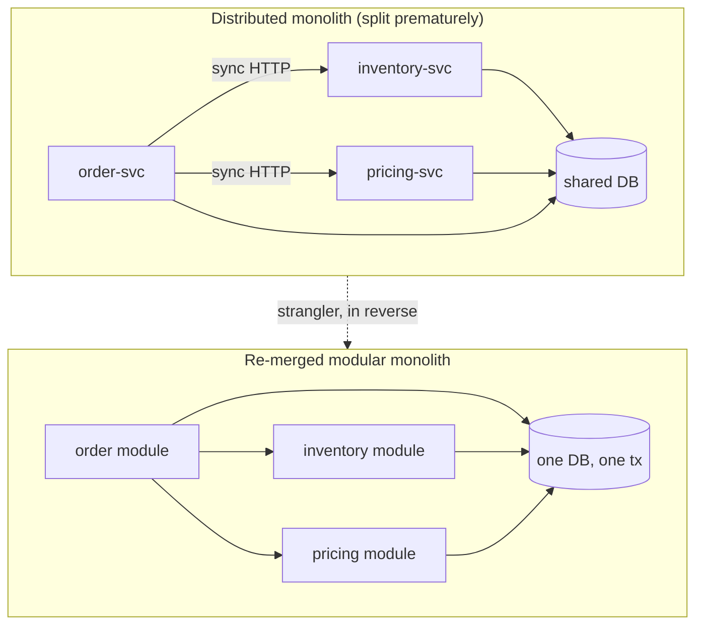
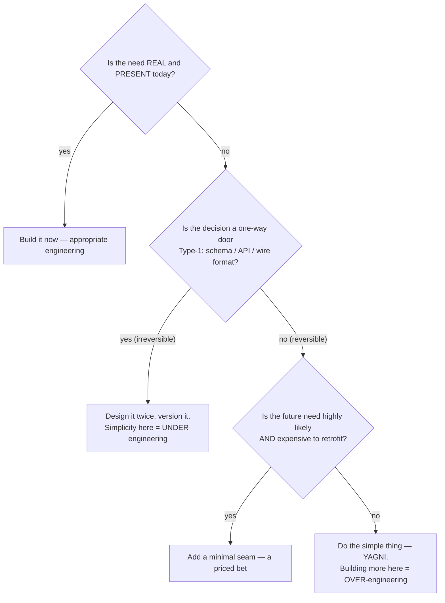

# Over-Engineering Anti-Patterns — Senior Level

> **Category:** [Development Anti-Patterns](../README.md) → **Over-Engineering** — *effort spent solving problems you don't have.*
> **Covers (collectively):** Premature Optimization · Speculative Generality · Gold Plating · Yo-yo Problem · Lasagna Code · Accidental Complexity · Soft Coding · Bikeshedding

---

## Table of Contents

1. [Introduction](#introduction)
2. [Prerequisites](#prerequisites)
3. [How Did the Codebase Get Here? — Organizational Forces](#how-did-the-codebase-get-here--organizational-forces)
4. [Over-Engineering at Architecture Scale](#over-engineering-at-architecture-scale)
5. [The Reversibility Lens: Where Up-Front Investment Is Warranted](#the-reversibility-lens-where-up-front-investment-is-warranted)
6. [Safely Removing Over-Engineering at Scale](#safely-removing-over-engineering-at-scale)
7. [De-Microservicing: Collapsing a Distributed Monolith](#de-microservicing-collapsing-a-distributed-monolith)
8. [Deleting Speculative Abstractions and Soft-Coded Engines](#deleting-speculative-abstractions-and-soft-coded-engines)
9. [Performance Optimization Done Right at Scale](#performance-optimization-done-right-at-scale)
10. [Leading a Team Away from Over-Engineering](#leading-a-team-away-from-over-engineering)
11. [Over- vs Under-Engineering and the Cost Asymmetry](#over--vs-under-engineering-and-the-cost-asymmetry)
12. [Common Mistakes](#common-mistakes)
13. [Test Yourself](#test-yourself)
14. [Cheat Sheet](#cheat-sheet)
15. [Summary](#summary)
16. [Further Reading](#further-reading)
17. [Related Topics](#related-topics)

---

## Introduction

> Focus: **How did the codebase get here?** and **How do I remove the excess safely at scale?**

At the junior level you learned to *recognize* the eight over-engineering shapes; at the middle level you learned to *calibrate* — to tell a seam that pays for itself from a bet on an imagined future. This file is about the situation you inherit as a senior: the over-engineering is no longer a clever class, it is **architecture**. Forty microservices serve a problem a single service would handle. A "rules engine" has quietly become a second, untyped, untested programming language that the business owns and nobody can debug. A gold-plated internal "platform" has three teams maintaining abstractions for use cases that never arrived. The plugin framework has exactly one plugin — and you can't delete it because two teams now `import` it.

Two questions define senior-level work here:

1. **How did it get this way?** Over-engineering at scale is almost never one engineer's vanity. It is the *deterministic output* of organizational forces — resume-driven development, "we're a big company now" cargo culting, architects detached from the code they design, and the absence of a YAGNI culture. If you collapse the layers without addressing the force, the layers regrow under a new name.

2. **How do I remove it without an outage?** Deleting an abstraction that 140 files import, or re-merging two services that share a database, is *exactly as dangerous* as dismantling a [God Object](../01-bad-structure/senior.md) — and uses the same discipline: seams, characterization tests, the Strangler Fig, branch-by-abstraction, parallel-change. Removing complexity is itself a change that can break production.

> **The senior mindset shift:** the junior asks "is this too complicated?"; the senior asks "**what did this complexity cost us to build, what does it cost to carry, what would it cost to remove, and which of those is a one-way door?**" You are no longer simplifying a function — you are paying down architectural debt on a system that cannot stop, and changing the forces that issued the debt.

---

## Prerequisites

- **Required:** Fluency with [`junior.md`](junior.md) and [`middle.md`](middle.md) — YAGNI/KISS, the Rule of Three, justified seams vs speculation, essential vs accidental complexity, reversibility.
- **Required:** You have designed or owned a system across at least one major evolution, and lived with the consequences of an architectural decision you made.
- **Strongly recommended:** The sibling [Bad Structure → senior](../01-bad-structure/senior.md) — it covers the *shared* safe-change toolkit (seams, Strangler Fig, branch-by-abstraction, parallel-change, fitness functions) in mechanical detail. This file assumes it and focuses on the *over*-engineering direction: removing layers rather than adding boundaries.
- **Helpful:** Exposure to distributed systems trade-offs, feature-flag rollout, and reading flame graphs / production profiles.

---

## How Did the Codebase Get Here? — Organizational Forces

Every needless plugin system and premature microservice has a biography. Before you collapse anything, understand the force that produced it, because **the same force will rebuild it if it persists.** Under-engineering ([Bad Structure](../01-bad-structure/senior.md)) usually comes from *too little* care; over-engineering comes from misdirected *abundance* of it — and from incentives that reward complexity.

### Resume-driven development

The single most underrated cause. Engineers are rewarded — in promotion packets, conference talks, and market value — for "led the migration to microservices / Kafka / Kubernetes / a custom DSL," never for "kept it a boring monolith that shipped on time." The technology gets chosen because it is good for the *résumé*, not for the *problem*. The tell: the justification is phrased in terms of the technology's virtues ("Kafka gives us replayability") rather than a present requirement ("we need to replay events because *X*").

### "We're a big company now" cargo culting

A team reads that Netflix/Uber/Google runs N hundred microservices and concludes that *real* engineering looks like that — importing the *solution* without importing the *problem* (thousands of engineers, planet-scale traffic, hundreds of independent deploy cadences) that made it necessary. This is [Cargo Cult Programming](../02-bad-shortcuts/senior.md) at architecture scale: copying the form of a giant's architecture without its forces. Your 12-engineer team does not have Google's coordination problem, so Google's coordination solution is pure cost.

### Architects detached from the code

When the people who choose the architecture do not *write in it* or *get paged for it*, the feedback loop that punishes complexity is severed. An ivory-tower diagram with twelve boxes and a service mesh looks impressive in a slide; the team that has to implement, test, and operate it absorbs the accidental complexity invisibly. Architecture decisions made without skin in the game systematically over-build.

### No YAGNI culture / premature DRY across boundaries

Without an explicit norm that says *defer flexibility until a real need appears*, the default engineering instinct — "make it general, make it configurable, make it reusable" — runs unchecked. A specific and pernicious form is **premature DRY across service boundaries**: two services share a little logic, so someone extracts a shared library or a third "common" service. Now an independent change to one service requires coordinating a release of the shared dependency — you have *coupled* the very services microservices were supposed to decouple. (At service scale, **a little duplication is almost always cheaper than a shared dependency** — the inverse of the within-process Rule of Three.)

### The asymmetry of incentives

Adding complexity is *visible, attributable, and rewarded* (a new service, a framework, a clever abstraction has an author). Removing it is *invisible, risky, and thankless* (deleting 4,000 lines rarely gets a promotion, and if it breaks prod it gets a postmortem). So the ratchet turns one way. The senior's job is partly to **re-balance that incentive** — to make simplification a celebrated, funded activity.

```mermaid
graph TD
    RDD[Resume-driven development] --> PM[Premature microservices]
    RDD --> FW[Framework-itis]
    CC["'Big company now'<br/>cargo culting"] --> PM
    CC --> PLAT[Gold-plated internal platform]
    AD[Architects detached<br/>from the code] --> PM
    AD --> SPEC[Speculative abstraction layers]
    NOY[No YAGNI culture] --> SPEC
    NOY --> SC[Soft-coded rule engines]
    NOY --> PDRY[Premature DRY<br/>across boundaries]
    PDRY --> DM[Distributed monolith]
    PM --> DM
    INC["Incentive asymmetry:<br/>adding is rewarded,<br/>removing is thankless"] -. "ratchets one way" .-> PM
    INC -. .-> SPEC
    INC -. .-> PLAT
```

> The practical takeaway, identical in spirit to the structure side: **a senior simplification plan names the force, not just the smell.** "Re-monolith the orders services" is a wish. "Establish a YAGNI review norm, re-merge the three orders services that share a database into one deploy unit, delete the shared 'common-rules' library by inlining it, and add an ADR recording *when* we'd split again" is a plan that stays simple.

---

## Over-Engineering at Architecture Scale

The eight anti-patterns scale up. Recognizing their architectural forms is the first senior skill.

| Code-scale form (junior/middle) | Architecture-scale form (senior) |
|---|---|
| **Premature Optimization** — hand-tuned loop | Premature *sharding*, caching tiers, read-replicas, or a custom binary protocol before any load data justifies them |
| **Speculative Generality** — interface with one impl | A **plugin/extension framework** with one plugin; a "provider" abstraction over one provider; an event bus nobody publishes to twice |
| **Gold Plating** — unrequested feature options | A **gold-plated internal platform**: a homegrown framework/SDK/"paved road" built far beyond what its (often single) consumer needs |
| **Yo-yo Problem** — deep inheritance | Deep **service call chains** — A calls B calls C calls D to answer one request; tracing one user action across eight hops |
| **Lasagna Code** — thin pass-through layers | **Needless tiers/services** that only forward: an API gateway → BFF → orchestrator → service → another service, each re-serializing the same payload |
| **Accidental Complexity** — framework for a `map()` | A **distributed system** (queues, sagas, eventual consistency, service mesh) imposed on a problem an in-process function call solved |
| **Soft Coding** — logic in JSON | A **rule engine / workflow engine / config-driven DSL** that became a second language — business logic in a database table, untyped and untested |
| **Bikeshedding** — naming debate | Months-long **"which message broker / which language / which cloud"** debates; an architecture-review board that re-litigates trivia while real risks go unexamined |

The unifying architectural smell: **the operational and cognitive complexity of the *solution* dwarfs the complexity of the *problem*.** A team of eight running forty services, three message brokers, and a custom rules engine to serve a workload a well-structured monolith would handle on two boxes has built accidental complexity at the largest possible scale — and now pays for it in every deploy, every incident, and every onboarding.

```python
# Premature microservices, made concrete. The "order" flow that a single
# transaction handled is now a distributed saga across four services — gaining
# network latency, partial-failure modes, eventual consistency, and a
# compensation problem the monolith never had.

# BEFORE (a function call, one DB transaction, trivially correct):
def place_order(cart):
    with db.transaction():
        order = orders.create(cart)
        inventory.reserve(order)      # same DB, same tx — atomic
        payments.charge(order)        # rolls back together on failure
        notifications.enqueue(order)
    return order

# AFTER over-engineering (four services, a saga, and the need for
# compensating transactions because there is no shared transaction anymore):
#   order-svc  --HTTP-->  inventory-svc   (may succeed)
#   order-svc  --HTTP-->  payment-svc     (may fail AFTER inventory reserved)
#   order-svc  --MQ--->   notification-svc
# Now you must hand-write: idempotency keys, a saga orchestrator, compensating
# "release inventory" calls, retry/timeout policy, and a way to debug a flow
# that no longer appears in any single log. None of this complexity is
# ESSENTIAL — it was imported wholesale by the decision to split.
```

The question that exposes it: *"What forced these into separate services?"* Legitimate forces exist — independent scaling profiles, independent deploy cadences across many teams, hard fault-isolation or compliance boundaries, genuinely different runtimes. "It felt more modern," "microservices are best practice," and "we wanted clean separation" are not forces; in-process modules give you clean separation without the distributed-systems tax.

---

## The Reversibility Lens: Where Up-Front Investment Is Warranted

The middle-level master variable was **reversibility**. At senior scale it becomes the primary decision framework, and it cuts *both* ways — it tells you where to stay simple *and* where simplicity would be reckless under-engineering.

Jeff Bezos's framing: decisions are **Type 1** (one-way doors — hard or impossible to reverse) or **Type 2** (two-way doors — cheap to walk back). The fatal error is applying the wrong process to each: agonizing up-front over Type-2 decisions (slow, over-engineered) *or* casually defaulting on Type-1 decisions (fast, catastrophically under-engineered).

| | **Type 1 — one-way door** (invest up front) | **Type 2 — two-way door** (stay simple, decide fast) |
|---|---|---|
| **What** | Public API shape, wire/serialization format, event schema in an immutable log, database schema with downstream consumers, security/permission model, choice of primary datastore at scale | Internal module boundary, a class's shape, an internal endpoint, in-memory algorithm, most refactorings, library choice behind an interface |
| **Why irreversible** | External consumers / persisted data depend on it; you can't unship a format others encoded against, or un-design a schema in a billion stored rows | No external dependence; you own all call sites; changing it is a refactor, not a migration |
| **Senior move** | **Design it twice, review it, version it.** Up-front rigor here is *not* over-engineering — it's correctly pricing irreversibility | **Do the simple thing now.** Over-investing here *is* over-engineering — you can change it cheaply when you learn more |

```go
// TYPE 1 — a published wire format / event schema. Worth designing twice,
// reviewing carefully, and versioning explicitly: every consumer that ever
// deserializes this is now coupled to your choices, including consumers you
// can't see and events already persisted in an append-only log.
type OrderPlacedV1 struct {
    SchemaVersion int       `json:"schema_version"`        // plan for evolution UP FRONT
    OrderID       string    `json:"order_id"`              // never reuse/repurpose a field
    AmountMinor   int64     `json:"amount_minor"`          // integer minor units, not float money
    Currency      string    `json:"currency"`              // ISO 4217 — explicit, not implied
    OccurredAt    time.Time `json:"occurred_at"`
    // Additive-only evolution: new OPTIONAL fields are a Type-2 change;
    // removing/renaming/retyping a field is a Type-1 break for every consumer.
}

// TYPE 2 — the internal calculator behind it. Keep it dead simple; you own
// every caller, so you can rewrite it in an afternoon when requirements change.
func totalMinor(items []Item) int64 {
    var sum int64
    for _, it := range items {
        sum += it.PriceMinor * int64(it.Qty)
    }
    return sum
}
```

> **The reframe of YAGNI for seniors:** YAGNI is the correct default for **Type-2** decisions — defer them, because reversal is cheap. It is *dangerous advice* for **Type-1** decisions — "we'll fix the schema later" is how you end up versioning around a mistake forever. Identify the door type first, *then* choose how much to invest. The skill isn't "always simple"; it's "**simple where reversible, rigorous where not.**"

---

## Safely Removing Over-Engineering at Scale

Removing complexity is a production change. You collapse a layer, delete an abstraction, or re-merge a service with the *same* disciplined toolkit used to dismantle a God Object — because the blast radius is identical. (The mechanics of seams, characterization tests, Strangler Fig, branch-by-abstraction, and parallel-change are detailed in [Bad Structure → senior](../01-bad-structure/senior.md); here we apply them in the *removal* direction.)

### Collapsing a needless layer (Lasagna at scale)

You have `Controller → Orchestrator → Manager → Service → Repository`, and the Orchestrator and Manager only forward. Don't delete them in one commit across 140 call sites — **inline via parallel-change**:

```java
// EXPAND: Controller can already call Service directly; expose that path
// without removing the old one. Both routes work.
class Controller {
    Order get(long id) {
        return useDirect()                      // flag-gated, defaults to old path
            ? service.get(id)                   // new: skip the empty middlemen
            : orchestrator.get(id);             // old: Orchestrator -> Manager -> Service
    }
}

// MIGRATE: flip the flag per-route, watch metrics; the pass-through layers
// still exist but carry no traffic.

// CONTRACT: once nothing routes through them, delete Orchestrator and Manager.
// If either had ONE real responsibility hidden among the forwarding (a cache,
// an auth check), that responsibility moves to where it belongs FIRST — then
// the husk is deleted. Never delete a layer before relocating its real work.
```

> **The cardinal rule, mirrored from God Object surgery:** never let a *simplification* branch live for months either. Inline on trunk, behind a flag, in reversible steps. A "great unification" branch diverges and dies exactly like a "clean rewrite" branch.

### The load-bearing trap, inverted

When dismantling a [God Object](../01-bad-structure/senior.md), the danger is that "dead" code is secretly load-bearing. When *removing over-engineering*, the danger is the mirror image: an abstraction that *looks* like pure ceremony is secretly the **only thing isolating a volatile dependency or providing a test seam**. Before deleting a "useless" interface, confirm it isn't the injection point that makes the module testable, or the boundary that quarantines a vendor SDK. Delete the *speculative* abstractions; keep the *justified* seams from [`middle.md`](middle.md).

---

## De-Microservicing: Collapsing a Distributed Monolith

The highest-stakes over-engineering removal. You have services that were split prematurely and now form a **distributed monolith** — they deploy together, share a database, and a change to one forces a change to the others. You get all the costs of microservices (network, partial failure, operational sprawl) and none of the benefits (independent deploy, independent scaling, fault isolation). Re-merging is *de-risking*, but the merge itself is risky.

**First, diagnose that re-merge is the right call.** Re-monolith when, across the candidate services, you observe: they always deploy in lockstep; they share a database/transactional boundary; calls between them are synchronous and on the request path (so a "split" buys no resilience); there is no independent scaling need; and one team owns all of them. If even one service genuinely needs independent scaling or has a hard fault-isolation requirement, leave *that* seam and collapse the rest.



**The safe sequence (Strangler Fig, run in reverse — growing the monolith around the services):**

1. **Co-locate behind a stable interface.** Each service already has a client interface; keep it. Build an in-process implementation of that *same interface* inside the merged binary. Callers don't know whether they're crossing the network or a function boundary — that's branch-by-abstraction.
2. **Move one service in.** Pull `pricing-svc`'s logic into a `pricing` module of the monolith, behind the existing `PriceClient` interface. Run it **in parallel** (shadow): the monolith calls both the remote service and the in-process module, compares results, logs divergence — without serving the in-process result yet.
3. **Cut over behind a flag**, 1% → 100%, with the remote service as instant fallback. The network hop vanishes; the saga/compensation logic that existed *only* because of the split can now be replaced by a real database transaction — a major reduction in essential-looking-but-accidental complexity.
4. **Decommission** the remote service only when its traffic is zero across a full business cycle. Then **delete the saga orchestrator, the compensating transactions, the inter-service retry policy, and the idempotency plumbing** — none of which the in-process version needs.
5. **Lock in the boundary as a module, not a service.** A modular monolith keeps the *logical* separation (package boundaries, an [ArchUnit](../01-bad-structure/senior.md) fitness function forbidding cross-module internal imports) while paying none of the distributed tax. You can always re-extract a *specific* module to a service later — *if a real force appears* — and now you'll do it against evidence.

> **The senior judgment:** microservices are an organizational/scaling tool, not a code-quality tool. Their benefit is **independent deployability across many teams**; their cost is **distributed-systems complexity, paid by everyone, forever.** If you're not getting the benefit, you're only paying the cost. A *modular monolith* gives you most of the separation with none of the tax, and keeps the option to split open. (See [microservice communication](../../../../../Architecture/system-design/README.md) for when the split *is* warranted.)

---

## Deleting Speculative Abstractions and Soft-Coded Engines

### Speculative plugin/abstraction layers

A `PluginRegistry`, `StrategyFactory`, or `ProviderManager` with exactly one registered thing is a [Boat Anchor](../01-bad-structure/senior.md) that *invites* dependence. Each day it survives, the odds rise that someone wires a second caller into it — converting a cheap deletion into an expensive migration. Remove it by **inlining the single implementation**:

```python
# BEFORE — a "pluggable" notification framework with one plugin, built for
# providers that never materialized. Three indirections to send one email.
class NotifierPlugin(Protocol):
    def send(self, msg: Message) -> None: ...

class PluginRegistry:
    def __init__(self): self._plugins: dict[str, NotifierPlugin] = {}
    def register(self, key: str, p: NotifierPlugin): self._plugins[key] = p
    def get(self, key: str) -> NotifierPlugin: return self._plugins[key]

registry = PluginRegistry()
registry.register("email", EmailNotifier())     # the ONLY registration, ever
# ... callers: registry.get("email").send(msg)

# AFTER — the speculative machinery deleted; the one real thing, called directly.
def notify(msg: Message) -> None:
    email_notifier.send(msg)
# If a second channel (SMS) ever becomes a REAL requirement, you reintroduce a
# small interface THEN — against two concrete cases — and design it correctly.
```

Do this as parallel-change if there are many call sites: expose `notify()` alongside the registry, migrate callers, then delete the registry. The point is not "abstraction is bad" — it's "an abstraction with one real implementation and no test/contract justification is *carried cost with no carried benefit*."

### Soft-coded rule engines: bringing logic back into code

A rule/workflow engine that became a second language is the most dangerous over-engineering to remove, because the logic *runs in production* and is often *owned by non-engineers who edit it live*. You cannot just delete it. Strangle it back into code:

```java
// The "engine" interprets rows like this from a DB table — untyped, untested,
// undebuggable, and now containing 4,000 rules nobody fully understands:
//   IF age >= 18 AND country IN (US,CA) AND tier == 'gold' THEN discount = 0.15

// STEP 1 — Pin behavior. Replay a large sample of real production inputs
// through the engine, capture outputs: this is your characterization/golden
// master. It defines "what the system does today," bugs and all.

// STEP 2 — Implement the rules as TESTED CODE behind the same entry point.
Money discountFor(Customer c, Order o) {                  // typed, debuggable, tested
    if (c.ageAtLeast(18) && c.inRegion(US, CA) && c.tier() == GOLD) {
        return o.subtotal().percent(15);
    }
    return Money.ZERO;
}

// STEP 3 — Run BOTH in parallel (shadow). For every live request, evaluate the
// engine (served) and the new code (discarded), and log every divergence.
// Divergences are either: (a) bugs you must replicate to stay safe, or
// (b) bugs you intentionally fix — in a SEPARATE, labeled commit.

// STEP 4 — Cut over behind a flag once divergence is zero across a full cycle.
// STEP 5 — Delete the engine, the rule table, and the editing UI. The rules
// now live in version control, with tests, types, blame, and a debugger.
```

> **The discipline for soft-coding removal:** treat the engine's current behavior as a legacy contract you must preserve through the migration, exactly as you'd treat a God Object's behavior. The win is enormous — logic regains type-checking, tests, a debugger, code review, and git history — but the *path* must be a parallel run, not a flag day. And address the force: if the original justification was "the business team needs to edit rules," verify whether they actually did (telemetry on the editing UI usually shows they rarely did) before re-building any self-serve mechanism — and if they genuinely need it, build a *narrow, validated, tested* feature, per [`middle.md`](middle.md).

---

## Performance Optimization Done Right at Scale

Premature optimization is over-engineering; *correct* optimization is essential engineering. At senior scale the difference is **a closed loop driven by data and tied to SLOs**, not intuition.

The workflow:

1. **Start from an SLO, not a feeling.** "P99 latency must be < 200 ms; we are at 450 ms" is a real requirement that justifies work. "This feels slow" is not. If there is no SLO being violated and no cost ceiling being breached, the "optimization" is speculative.
2. **Measure in production-like conditions.** A microbenchmark of a function tells you nothing about a system whose bottleneck is a database round-trip, an N+1 query, serialization, lock contention, or GC pauses. Use production profiles (continuous profiling, flame graphs, distributed traces) to find where time *actually* goes.
3. **Optimize the proven bottleneck, biggest first.** Amdahl's law: speeding up code that's 2% of latency caps your gain at 2%. The profile, not the code's aesthetics, chooses the target. At scale the win is almost always **algorithmic or architectural** (kill the N+1, add the right index, cache the hot read, batch the calls) — *not* micro-tuning a loop.
4. **Prove it with a benchmark/A-B, against the SLO.** Numbers before and after, on representative data. A change that wins 3% but triples reading cost or adds a cache-invalidation bug is a net loss.
5. **Keep the clear version unless the data says otherwise.** Optimized code is a liability you only take on when measurement forces you to — and you comment *why*, citing the profile.

```go
// Profile-guided, SLO-justified optimization. The win was NOT the inner
// arithmetic — pprof showed 80% of request time in N+1 DB round-trips. The
// fix is a batched query (algorithmic), and the benchmark proves it against
// the latency budget. The hand-tuned loop juniors reach for would have moved
// the needle 0%.

// BEFORE — N+1: one query per order. P99 = 450ms (SLO violated).
func enrich(orders []Order) []Order {
    for i := range orders {
        orders[i].Customer = db.GetCustomer(orders[i].CustomerID) // N round-trips
    }
    return orders
}

// AFTER — one batched query. P99 = 70ms. Benchmark + trace prove it.
func enrich(orders []Order) []Order {
    ids := uniqueCustomerIDs(orders)
    customers := db.GetCustomers(ids)            // 1 round-trip, indexed IN-list
    for i := range orders {
        orders[i].Customer = customers[orders[i].CustomerID]
    }
    return orders
}

// $ go test -bench=BenchmarkEnrich -benchmem   → compare with benchstat
// The entry ticket for ANY optimization remains: a profile showing the hotspot,
// and a benchmark proving the change helped.
```

> **Senior nuance:** "don't optimize prematurely" never means "ignore complexity classes." Choosing an O(n log n) algorithm or the right index *at design time*, based on the known data shape, is correct engineering — that's a Type-1-ish choice you make once. Premature optimization is *micro-tuning correct, clear code without a profile or an SLO*. Know which one you're doing, and let the data — never the urge — decide.

---

## Leading a Team Away from Over-Engineering

Removing today's over-engineering is a refactor; *preventing* its return is leadership. Because the root causes are organizational and incentive-driven, the durable fixes are cultural and automated — they must outlast the engineer who cares.

### Make simplicity an explicit, defended value

YAGNI dies quietly when "more flexible" is treated as self-evidently better in every review. A senior makes the opposite the default by asking, on every speculative addition, the same question the [Boat Anchor](../01-bad-structure/senior.md) gate asks: **"What ticket needs this *now*?"** No ticket → defer. Said consistently by a senior, this re-trains the team's instinct from "build for the imagined future" to "build for the present, design for change."

### "Design it twice" before building

> *"Designing software is hard, and the first idea is unlikely to be the best. ... Try to pick an approach that is dramatically different from the first; even if it's worse, you'll learn something."* — John Ousterhout, *A Philosophy of Software Design*

For anything on the Type-1 side, require a *second design* (and ideally a one-page design doc / RFC) before code. The second design is where over-engineering most often dies — comparing two approaches surfaces that the elaborate one buys nothing the simple one lacks. The mere ritual of proposing two options breaks the "first idea = the plan" momentum that ships unjustified complexity.

### Architecture Decision Records — including the *simplicity* decisions

ADRs usually record what you *built*. The high-leverage senior move is to record what you **deliberately did NOT build, and the conditions under which you would.** "We chose a modular monolith over microservices; we will split out a module only when it needs independent scaling or a separate team owns it." This both prevents re-litigation (anti-bikeshedding) and arms the next engineer against cargo-culting the split back in.

### Kill bikeshedding with automation and conventions

At architecture scale, bikeshedding is months lost to "which broker / which language / which cloud." The senior defenses:

- **Defaults and golden paths.** A documented "we use Postgres / Go / this deploy pipeline unless you have a written reason" pre-decides the 90% of choices that don't matter, reserving debate for the genuine forks.
- **Time-box and assign a decider.** Trivial-but-contested decisions get a deadline and a single owner (a "disagree and commit" close), not an open-ended thread.
- **Automate the truly trivial out of existence.** Formatters, linters, and import-rules ([fitness functions](../01-bad-structure/senior.md)) end style debates permanently — there's nothing left to argue.
- **Match scrutiny to blast radius.** A throwaway internal tool does not deserve the review intensity of a public API or a wire format. Spend the team's finite attention proportional to *irreversibility*, not to how *accessible* the topic is to opinion.

### Make removal as rewardable as addition

Counter the incentive asymmetry explicitly: celebrate deletions in demos ("we removed a service and a rule engine, cut P99 latency in half, and retired three on-call alerts"), put **simplification on the roadmap** as funded work, and quantify the carrying cost of over-engineering ("the rules engine causes ~2 incidents/quarter and every rule change takes 3 days") so the cleanup competes with features on equal footing. A team that gets credit for *subtraction* stops over-building.

---

## Over- vs Under-Engineering and the Cost Asymmetry

The deepest senior judgment is reading which failure mode you're in — because the two are mirror images and the *correct* amount of engineering is a moving target, not a constant.



**The cost asymmetry — and why it's not symmetric.** It is tempting to treat over- and under-engineering as equal-and-opposite sins. They are not, and the asymmetry runs *both* directions depending on the door type:

- **For Type-2 (reversible) decisions, over-engineering is the costlier mistake.** Under-engineering a reversible thing is a cheap fix later — you change the internal module when the second case appears, against real information. Over-engineering it imposes a *permanent carrying cost* (more code, more layers, more operational surface) for a benefit that usually never arrives, and the wrong abstraction is *harder to remove than no abstraction was to add*. Here, when uncertain, **err simple.**
- **For Type-1 (irreversible) decisions, under-engineering is the costlier mistake.** A botched schema, a leaked wire format, a permission model that conflated two concepts — these you live with or migrate at enormous cost, sometimes forever. Here, when uncertain, **err rigorous.**

So the senior heuristic is not "always simple" and not "always thorough" — it is: **classify the door first, then bias toward simplicity on two-way doors and toward rigor on one-way doors.** The engineer who applies YAGNI uniformly under-engineers their schemas; the engineer who designs-it-twice uniformly over-engineers their internals. Mastery is knowing which room you're standing in.

> **The honest self-check seniors must run:** *Am I building this because the problem demands it today, or because the future I'm imagining flatters me / my résumé / my sense of craftsmanship?* Over-engineering is the failure mode of *competent, well-intentioned* engineers — which is exactly why it needs a deliberate, named discipline to resist. The most senior move in the room is often the unglamorous one: *delete the framework, merge the services, inline the engine, and ship the boring thing that fits the problem.*

---

## Common Mistakes

Mistakes seniors make around over-engineering at scale:

1. **Splitting into microservices for code cleanliness.** Microservices buy *independent deployability*, not modularity — you get modularity from package boundaries for free, in-process. Splitting to "keep things clean" imports the entire distributed-systems tax for a benefit a module gives you anyway. *Reach for a modular monolith first.*
2. **Premature DRY across service boundaries.** Extracting a shared library/service the moment two services share a little logic *re-couples* what you split. *A little duplication across services is cheaper than a shared dependency that forces coordinated releases.*
3. **Applying YAGNI to Type-1 decisions.** "We'll fix the schema/wire format/API later" — but you can't, cheaply, once consumers and persisted data depend on it. *Design irreversible things twice; reserve YAGNI for reversible ones.*
4. **Deleting an abstraction that was a real seam.** Not every interface with one implementation is speculative — some are the test seam or the volatile-dependency boundary. *Confirm it isn't load-bearing for testability/isolation before removing it.*
5. **Removing over-engineering on a long-lived branch.** A "great simplification/unification" branch diverges and dies exactly like a clean-rewrite branch. *Inline, collapse, and re-merge on trunk, behind flags, in reversible steps, with shadow runs.*
6. **Deleting a soft-coded engine via a flag day.** The logic runs in production and is often live-edited by the business. *Pin behavior with a golden-master/parallel run, migrate to tested code behind the same entry point, cut over by flag, then delete.*
7. **Treating "don't optimize prematurely" as "never think about performance."** Design-time algorithm/index/schema choices for known data shapes are correct engineering. *Premature = micro-tuning correct code with no profile and no SLO; data-driven = required.*
8. **Refactoring the smell, not the force.** You collapse the layers, but resume-driven development, detached architects, and the no-YAGNI culture rebuild them. *Name the force; install a YAGNI review norm, ADRs that record what you deliberately didn't build, and rewards for removal.*
9. **Forgetting that simplification is also a production change.** "It's just cleanup" — and then the inlined layer dropped a hidden cache and P99 doubled. *Removing complexity carries the same risk as adding it; use the same safety net.*

---

## Test Yourself

1. You inherit forty microservices owned by a team of nine; they deploy in lockstep and share a database. Name the organizational forces likely behind this, and outline the safe sequence to collapse them into a modular monolith without an outage.
2. Explain the Type-1 / Type-2 (one-way / two-way door) lens. Give one example each of where up-front investment *is* warranted and where YAGNI should win, and state the cost asymmetry for each.
3. A "rules engine" holds 4,000 business rules in a DB table, live-edited by the operations team, untyped and untested. Why is deleting it dangerous, and what is the step-by-step safe migration back to code?
4. A teammate proposes extracting a shared `common-pricing` library used by two services "to stay DRY." What is the over-engineering risk specific to *service boundaries*, and what would you recommend instead?
5. Distinguish premature optimization from correct, data-driven optimization at scale. What two artifacts are the "entry ticket" for any optimization, and why is the bottleneck rarely the code juniors reach to tune?
6. You've successfully re-merged three premature services. What organizational mechanisms do you install so the team doesn't cargo-cult the split back in six months, and which root-cause force does each address?
7. Why is over-engineering an especially *senior* and *competent-engineer* failure mode, and what self-check counters it?

<details>
<summary>Answers</summary>

1. **Forces:** resume-driven development, "big company now" cargo culting, architects detached from the operational pain, and no YAGNI culture; the lockstep deploy + shared DB are the signature of a *distributed monolith* (cost of microservices, none of the benefit). **Sequence:** keep each service's client interface; build an in-process implementation behind the *same* interface (branch-by-abstraction); run the in-process version in **parallel/shadow** comparing outputs and logging divergence; cut over behind a flag 1%→100% with the remote service as instant fallback; decommission the remote service after zero traffic for a full business cycle; then delete the saga/compensation/idempotency plumbing the split required; lock in a *module* boundary with a fitness function. All on trunk, reversible, never a long-lived branch.
2. **Type-1 = one-way door** (irreversible: public API, wire/event/serialization format, schema with downstream consumers, security model) — invest up front, design it twice, version it; **under-engineering here is the costlier mistake** (you migrate at enormous cost or live with it forever). **Type-2 = two-way door** (reversible: internal module shape, in-memory algorithm, internal endpoint, library behind an interface) — do the simple thing now; **over-engineering here is the costlier mistake** (permanent carrying cost for a benefit that rarely arrives, and the wrong abstraction is harder to remove than no abstraction was to add). The senior rule: classify the door first, then bias simple on two-way doors and rigorous on one-way doors.
3. **Dangerous because** the logic *runs in production* and is often live-edited by non-engineers — a flag-day delete risks changing real behavior with no safety net. **Safe migration:** (a) replay real production inputs through the engine and capture outputs as a golden master/characterization set; (b) implement the rules as tested, typed code behind the *same* entry point; (c) run both in parallel (shadow), serving the engine, logging every divergence; (d) reconcile divergences (replicate intended behavior; fix genuine bugs in separate labeled commits); (e) cut over behind a flag once divergence is zero across a full cycle; (f) delete the engine, table, and editing UI — logic now has types, tests, blame, and a debugger. Also check telemetry on whether the business actually edited rules before rebuilding any self-serve mechanism.
4. **Risk:** premature DRY *across a service boundary* re-couples the services — a change to the shared library now forces a coordinated release of both, destroying the independent deployability the split was for. **Recommend:** tolerate the small duplication (a little duplication across services is cheaper than a shared dependency); if the shared logic is genuinely substantial and stable, it might indicate the two services should be *one* module. Don't extract a third "common" service/library reflexively.
5. **Premature** = micro-tuning correct, clear code with *no profile* and *no SLO being violated*; **correct** = an SLO violation or cost ceiling justifies it, a production profile/trace locates the real bottleneck, and a benchmark/A-B proves the change helped on representative data. The two entry-ticket artifacts: **a profile showing the hotspot** and **a benchmark proving the fix**. The bottleneck is rarely the inner loop because at scale time goes to I/O — N+1 queries, missing indexes, serialization, lock contention, network round-trips, GC — so the win is algorithmic/architectural, not loop-tuning (Amdahl's law: optimizing 2% of latency caps the gain at 2%).
6. Any of: a **YAGNI review norm** ("what ticket needs this now?") — addresses *no-YAGNI culture*; an **ADR recording what you deliberately did NOT build and when you'd revisit** ("modular monolith; split a module only on independent-scaling or separate-team-ownership") — addresses *cargo culting / detached architecture* by pre-empting re-litigation; a **fitness function** enforcing module boundaries in CI — keeps the logical separation without a service; **rewarding removal** (celebrate deletions, fund simplification, quantify carrying cost) — addresses the *incentive asymmetry*; **"design it twice"/RFC for Type-1 changes** — addresses *detached architects* by forcing skin-in-the-game review.
7. Because over-engineering wears the *costume of craftsmanship* — more abstraction, more services, more flexibility read as "thorough" and "forward-thinking," and they're rewarded (promotions, talks, résumés) while removal is thankless. It's the failure mode of competent, well-intentioned engineers, so it needs a *deliberate, named discipline* to resist rather than relying on instinct (the instinct says "generalize"). The self-check: *Am I building this because the problem demands it today, or because the imagined future flatters me / my résumé / my sense of craft?* — and the willingness to ship the boring thing that fits the problem.

</details>

---

## Cheat Sheet

| Over-engineering at scale | Root-cause force | Senior removal move | Safety mechanism |
|---|---|---|---|
| **Premature microservices / distributed monolith** | Resume-driven dev + cargo culting + detached architects | Re-merge to a modular monolith; collapse needless services via reverse Strangler Fig | Parallel/shadow run + flag cutover + module fitness function |
| **Speculative plugin/abstraction layer** | No YAGNI culture | Inline the single implementation via parallel-change | Confirm it's not a real seam first; trunk-only, small PRs |
| **Gold-plated internal platform** | "Big company now" + boredom | Cut unrequested capability to actual consumer needs | Caller telemetry + deprecation window for any public surface |
| **Needless tiers (Lasagna at scale)** | Cargo-culted "layered architecture" | Inline pass-through layers; relocate any hidden real job first | Flag-gated route swap; never delete before relocating real work |
| **Soft-coded rule/workflow engine** | "Business must edit it" (often untrue) | Strangle logic back into tested, typed code | Golden-master replay + shadow run + flag cutover, then delete engine |
| **Premature sharding/caching/custom protocol** | "Will need to scale" with no data | Remove; do the simple thing until an SLO/profile forces it | SLO + production profile + benchmark as the entry ticket |
| **Premature DRY across services** | No YAGNI culture | Inline the shared lib; tolerate small duplication | Per-service ownership; avoid coordinated releases |
| **Architecture bikeshedding** | Incentive asymmetry + accessible debates | Golden paths/defaults; time-box + assign a decider; automate trivia | ADRs that record the decision (incl. what you didn't build) |

**Three golden rules:**
- *Classify the door first — simple on two-way (reversible) decisions, rigorous on one-way (irreversible) ones. YAGNI is for Type-2; "design it twice" is for Type-1.*
- *Removing complexity is a production change — re-merge services, inline abstractions, and delete engines on trunk, in reversible steps, behind flags and shadow runs.*
- *Name the force, not just the smell — resume-driven dev, cargo culting, detached architects, no-YAGNI culture, and the reward asymmetry rebuild the complexity if left unaddressed.*

---

## Summary

- **How it got here:** over-engineering at scale is the deterministic output of organizational forces — **resume-driven development**, **"big company now" cargo culting**, **architects detached from the code**, **no YAGNI culture** (including **premature DRY across service boundaries**), and an **incentive asymmetry** that rewards adding complexity and punishes removing it. A simplification that ignores the force gets rebuilt under a new name.
- **At architecture scale** the eight patterns become: premature microservices/sharding, plugin frameworks with one plugin, gold-plated internal platforms, deep service call chains, needless tiers, distributed systems imposed on in-process problems, rule/workflow engines that became a second language, and months-long broker/language/cloud bikeshedding. The smell: the *solution's* operational and cognitive complexity dwarfs the *problem's*.
- **The reversibility lens (Bezos Type-1 / Type-2)** is the senior decision framework: invest up front on one-way doors (schemas, public APIs, wire/event formats, security models); stay simple on two-way doors (internal modules, algorithms, anything you own all call sites for). **YAGNI is correct for Type-2 and dangerous for Type-1.**
- **Removing over-engineering is a production change**, done with the *same* toolkit as dismantling a God Object: seams, characterization/golden-master tests, the Strangler Fig (run in reverse to re-monolith), branch-by-abstraction, parallel/shadow runs, and flag cutovers — always on trunk, in reversible steps, never on a long-lived "great simplification" branch.
- **De-microservicing** a distributed monolith: co-locate behind the existing interface, move one service in, shadow-compare, flag-cut over with the remote as fallback, decommission, then delete the saga/compensation plumbing the split required — and lock in a *module* boundary with a fitness function.
- **Speculative abstractions** → inline the single implementation (after confirming it isn't a real test/isolation seam). **Soft-coded engines** → golden-master the live behavior, reimplement as tested code behind the same entry point, shadow-run, cut over, delete.
- **Optimization done right** is a closed loop: SLO → production profile → fix the proven (usually algorithmic/architectural) bottleneck → benchmark/A-B → keep the clear version unless the data forbids it. Premature = micro-tuning with no profile and no SLO; data-driven = required.
- **Leading the team:** make simplicity a defended review value ("what ticket needs this now?"), require "design it twice"/RFCs for Type-1 work, write ADRs that record *what you deliberately didn't build*, kill bikeshedding with golden paths and automation, and **reward removal** to counter the incentive asymmetry.
- **The cost asymmetry:** over-engineering is the costlier mistake on reversible decisions (permanent carrying cost; the wrong abstraction outlives its excuse); under-engineering is the costlier mistake on irreversible ones. Classify the door, then bias accordingly. Over-engineering is the failure mode of *competent* engineers — which is why the most senior move is often to delete the framework, merge the services, and ship the boring thing that fits the problem.
- This completes the over-engineering track at the level of building and running real systems; for the runtime/performance/toolchain angle of these shapes, see [`professional.md`](professional.md).

---

## Further Reading

- **A Philosophy of Software Design** — John Ousterhout (2018) — "design it twice," deep vs shallow modules, complexity is incremental; the senior's primary text on resisting accidental complexity.
- **Building Microservices** & **Monolith to Microservices** — Sam Newman (2021 / 2019) — when a split is *actually* warranted, and the Strangler Fig / parallel-run patterns (which also run in reverse to re-monolith).
- **Working Effectively with Legacy Code** — Michael Feathers (2004) — seams and characterization tests, the safety net for removing complexity from running systems.
- **Refactoring** — Martin Fowler (2nd ed., 2018) — Branch by Abstraction, Parallel Change, Inline Class, Remove Speculative Generality.
- *"The Wrong Abstraction"* — Sandi Metz (2016) — duplication is cheaper than the wrong abstraction (and far cheaper across service boundaries).
- **The Pragmatic Programmer** — Hunt & Thomas (20th anniv. ed., 2019) — YAGNI, good-enough software, reversibility.
- *Amazon shareholder letters* — Jeff Bezos (2015–2016) — the Type-1 / Type-2 one-way/two-way door framing for decision reversibility.
- **No Silver Bullet** — Fred Brooks (1986) — essential vs accidental complexity, the conceptual root of all eight patterns.

---

## Related Topics

- [Bad Structure → senior](../01-bad-structure/senior.md) — the shared safe-change toolkit (seams, Strangler Fig, branch-by-abstraction, parallel-change, fitness functions) and the *opposite* failure: too little structure. Over-applying its fixes produces this file's patterns.
- [Bad Shortcuts → senior](../02-bad-shortcuts/senior.md) — Cargo Cult at architecture scale; Soft Coding as the over-correction of Hard Coding; making illegal states unrepresentable.
- [Clean Code → Classes](../../../clean-code/09-classes/README.md) — composition over inheritance (the Yo-yo cure), cohesion, deep modules.
- [Refactoring → Techniques](../../../refactoring/02-refactoring-techniques/README.md) — Collapse Hierarchy, Inline Class, Remove Speculative Generality, Branch by Abstraction, Parallel Change.
- [Design Patterns](../../../design-patterns/README.md) — patterns are tools, not goals; applying them speculatively at scale is exactly this anti-pattern family.
- [Architecture → System Design](../../../../../Architecture/system-design/README.md) — when microservices, sharding, caching, and rule engines *are* warranted; API/schema versioning for Type-1 decisions.
