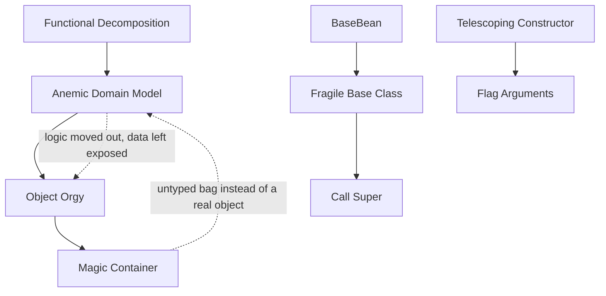

# OO Misuse Anti-Patterns — Junior Level

> **Category:** [Design Anti-Patterns](../README.md) → **OO Misuse** — *object-orientation applied as procedure-with-classes.*
> **Covers (collectively):** Anemic Domain Model · BaseBean · Constant Interface · Poltergeist · Object Orgy · Functional Decomposition · Call Super · Magic Container · Flag Arguments · Telescoping Constructor · Fragile Base Class

---

## Table of Contents

1. [Introduction](#introduction)
2. [Prerequisites](#prerequisites)
3. [Glossary](#glossary)
4. [The Eleven at a Glance](#the-eleven-at-a-glance)
5. [Anemic Domain Model](#anemic-domain-model)
6. [Flag Arguments](#flag-arguments)
7. [Telescoping Constructor](#telescoping-constructor)
8. [Fragile Base Class](#fragile-base-class)
9. [Magic Container](#magic-container)
10. [The Rarer Six](#the-rarer-six)
11. [How They Reinforce Each Other](#how-they-reinforce-each-other)
12. [A Quick Spotting Checklist](#a-quick-spotting-checklist)
13. [Common Mistakes](#common-mistakes)
14. [Test Yourself](#test-yourself)
15. [Cheat Sheet](#cheat-sheet)
16. [Summary](#summary)
17. [Further Reading](#further-reading)
18. [Related Topics](#related-topics)

---

## Introduction

> Focus: **What does it look like?** and **Why is it bad?** — recognition over repair.

The previous chapter was about code that grows into the wrong *shape*. This chapter is about code that uses the wrong *tools for objects*. You have classes, fields, constructors, and inheritance — and you're holding them backwards.

The unifying mistake is this: **the language gives you objects, but you keep writing procedures.** You make data structures with no behavior and put the behavior somewhere else. You bolt eleven optional parameters onto a constructor instead of designing a way to build the thing. You reach for inheritance when you mean "reuse a helper." You smuggle everything through a `Map<String, Object>` so the compiler can't see what you're doing.

The eleven anti-patterns in this file are the named shapes that result:

- **Anemic Domain Model** — objects are bags of getters/setters; the logic lives elsewhere.
- **Flag Arguments** — a boolean parameter that secretly makes one method into two.
- **Telescoping Constructor** — a ladder of constructor overloads that grows out of control.
- **Fragile Base Class** — a change to a parent class silently breaks its children.
- **Magic Container** — `Map<String, Object>` passed everywhere, bypassing the type system.
- Plus six rarer ones: **BaseBean, Constant Interface, Poltergeist, Object Orgy, Functional Decomposition, Call Super.**

At the junior level your goal is to **recognize each one on sight** and explain **why** it costs you later. You don't need to re-architect a domain model yet — that's `senior.md`. You need to stop *introducing* these shapes in the code you write this week.

> **The mindset shift:** an object is *data + the behavior that belongs to that data*, bundled so the outside world can't break its rules. Every anti-pattern below splits that bundle apart in some way — separating data from its behavior, or letting outsiders reach in, or hiding what an object really needs. When you feel that split, you've found one.

---

## Prerequisites

- **Required:** You can write classes with fields, methods, and constructors in at least one OO language (examples here use Go, Java, and Python).
- **Required:** You know what *encapsulation* means — keeping an object's data private and exposing controlled behavior instead.
- **Required:** You understand basic *inheritance* (`extends` / subclassing) and the difference between it and *composition* (one object holding another).
- **Helpful:** You've used a constructor with several parameters and gotten the argument order wrong at least once. That pain is the Telescoping Constructor talking.
- **Helpful:** Familiarity with [SOLID](../../../clean-code/09-classes/README.md), especially the Single Responsibility Principle.

---

## Glossary

| Term | Definition |
|------|-----------|
| **Anti-pattern** | A recurring "solution" that looks reasonable but reliably produces fragile, hard-to-change code. |
| **Encapsulation** | Bundling data with the behavior that operates on it, and hiding the data so outsiders can't violate its rules. |
| **Domain object** | An object that models a real business concept (`Order`, `Account`, `Money`) and should own the rules about that concept. |
| **Behavior** | The methods that *do something* with an object's data — the verbs, not just `get`/`set`. |
| **Tell, don't ask** | Tell an object to do a job (`account.withdraw(x)`) rather than asking for its data and acting on it from outside. |
| **Composition** | Building behavior by having one object hold and delegate to another, instead of inheriting from it. |
| **Invariant** | A rule that must always be true for an object (e.g. "balance is never negative"). Encapsulation exists to protect invariants. |
| **Stringly-typed** | Using strings (map keys, flags) where a real type should be — so mistakes show up at runtime, not compile time. |

---

## The Eleven at a Glance

| Anti-pattern | One-line symptom | The smell you feel |
|---|---|---|
| **Anemic Domain Model** | Objects are pure getters/setters; logic is in "service" classes | "The `Order` class doesn't *do* anything." |
| **Flag Arguments** | A boolean param flips behavior: `save(true)` | "What does `true` even mean here?" |
| **Telescoping Constructor** | Overload ladder: `new P(a)`, `new P(a,b)`, `new P(a,b,c)` … | "Which of the 7 args is the timeout?" |
| **Fragile Base Class** | Editing a parent class breaks subclasses you forgot existed | "I changed `Base` and three subclasses broke." |
| **Magic Container** | `Map<String, Object>` / `dict[str, Any]` passed everywhere | "What keys are even in this map?" |
| **BaseBean** | Inherit from a `Base` class just to borrow helper methods | "We `extends Utils` for one method." |
| **Constant Interface** | An interface holds only constants; classes implement it to import names | "Why does `Invoice implements Constants`?" |
| **Poltergeist** | A throwaway object that just calls another and vanishes | "This class only exists to call one method." |
| **Object Orgy** | Public fields everywhere; encapsulation is fiction | "Anyone can set any field on anything." |
| **Functional Decomposition** | A class that's really a folder of unrelated functions | "It has no state, just static methods." |
| **Call Super** | Subclasses *must* call `super.method()` or things break | "I forgot `super()` and it silently broke." |

These are **design** anti-patterns — you usually need to read two or more places (a class *and* its callers, or a parent *and* its children) to confirm one. The five deep ones get full sections; the rarer six are table-summarized with a focused example each.

---

## Anemic Domain Model

### What it looks like

An **Anemic Domain Model** is a domain object that's all data and no behavior. It has fields and a getter/setter for each, but no methods that enforce its rules or do its work. The actual logic lives in a separate "service" or "manager" class that reaches in, reads the fields, computes, and writes them back.

```java
// Java — the anemic Account: a data bag with zero behavior
public class Account {
    private long balanceCents;
    public long getBalanceCents()          { return balanceCents; }
    public void setBalanceCents(long c)    { balanceCents = c; }   // anyone can set anything
}

// All the real logic lives OUTSIDE the object it belongs to:
public class AccountService {
    public void withdraw(Account a, long amount) {
        if (amount > a.getBalanceCents())
            throw new IllegalArgumentException("insufficient funds");
        a.setBalanceCents(a.getBalanceCents() - amount);   // ask, compute, set
    }
}
```

The `Account` is a struct in disguise. It cannot protect its own balance.

### Why it's bad

- **The object can't defend its own rules.** Anyone can call `setBalanceCents(-999)` and the "insufficient funds" check is bypassed — the invariant lives in the *service*, not the object, so it's only enforced when someone remembers to route through the service.
- **Logic gets duplicated.** A second `ReportService` that also touches balances re-implements (slightly differently) the same rules, because there's no single owner.
- **It defeats the point of objects.** OO exists to bundle data with the behavior that guards it. Anemic models split them apart, so you've paid for classes but written procedures — see [Tell, Don't Ask](../../../clean-code/05-objects-and-data-structures/README.md).

### The junior-level fix

Move the behavior **onto the object that owns the data**, and make the fields private so the rule can't be skipped.

```java
public class Account {
    private long balanceCents;                          // private: nobody sets it directly

    public void withdraw(long amount) {
        if (amount <= 0)               throw new IllegalArgumentException("amount must be positive");
        if (amount > balanceCents)     throw new IllegalArgumentException("insufficient funds");
        balanceCents -= amount;                          // the rule lives WITH the data
    }
    public long balanceCents() { return balanceCents; }  // read-only view
}

// The service shrinks to coordination — it no longer owns the rules:
account.withdraw(amount);
```

> **Smell test:** if a class has only `getX`/`setX` methods and no verbs, and a `…Service` class right next to it does all the thinking, you have an Anemic Domain Model. Ask: *"Where does the rule that 'balance can't go negative' live?"* If the answer isn't "inside `Account`," that's the smell.

---

## Flag Arguments

### What it looks like

A **Flag Argument** is a boolean (or boolean-ish) parameter that flips a method between two different behaviors. The single method is really two methods wearing a trench coat, and the call site reads like a riddle.

```python
# Python — what does True mean? You cannot tell from the call site.
def render(report, summary):
    if summary:
        return render_summary(report)     # one whole behavior
    else:
        return render_full(report)        # a completely different behavior

render(report, True)    # ??? a reader has to open render() to know what True does
render(report, False)
```

The tell is that the body starts with `if flag:` and the two branches barely share code. Worse offenders stack flags: `process(data, True, False, True)` — now the call site is a binary code.

### Why it's bad

- **Unreadable call sites.** `render(report, True)` carries no meaning. You have to jump to the definition to learn what `True` does — every single time.
- **The method does two jobs.** It violates the Single Responsibility Principle at the function level; the `if flag` is a fork between two unrelated paths sharing a name.
- **Flags multiply.** One boolean invites a second, and `f(a, True, False, True, False)` is impossible to read or call correctly — and trivial to pass in the wrong order.

### The junior-level fix

Split the one method into two **named** methods — the boolean becomes the method name. If the flag picks from more than two options, use an enum, not a string or bool.

```python
def render_summary(report): ...    # the name IS the meaning
def render_full(report):    ...

render_summary(report)             # reads exactly like what it does
render_full(report)
```

```python
from enum import Enum
class Mode(Enum):                  # for >2 variants, an enum beats stacked bools
    SUMMARY = "summary"
    FULL    = "full"
    AUDIT   = "audit"

def render(report, mode: Mode): ...   # render(report, Mode.AUDIT) — self-documenting
```

> **Smell test:** if the first line of a method is `if someFlag:` and the two branches don't share their guts, that flag wants to be two method names. And if you can't read a call without opening the definition, the argument is lying about what it does.

---

## Telescoping Constructor

### What it looks like

A **Telescoping Constructor** is a chain of constructor overloads, each adding one more parameter, "so callers can pick how much to specify." The list of parameters telescopes outward until nobody can remember the order.

```java
// Java — the classic telescope. Each overload forwards to the next, adding one arg.
public class Pizza {
    public Pizza(Size size) { this(size, Crust.THIN); }
    public Pizza(Size size, Crust crust) { this(size, crust, false); }
    public Pizza(Size size, Crust crust, boolean extraCheese) { this(size, crust, extraCheese, false); }
    public Pizza(Size size, Crust crust, boolean extraCheese, boolean stuffedCrust) {
        // ... and so on, for olives, peppers, gluten-free ...
    }
}

// The call site is a guessing game:
new Pizza(Size.LARGE, Crust.THICK, true, false);   // which boolean is the stuffed crust?
```

Note how it also breeds [Flag Arguments](#flag-arguments) — those trailing booleans are exactly that smell, stacked.

### Why it's bad

- **Unreadable, error-prone calls.** `new Pizza(Size.LARGE, Crust.THICK, true, false)` — the two booleans are easy to swap, and the compiler is happy either way because both are `boolean`. A silent bug.
- **Combinatorial explosion.** Every new optional field doubles the plausible overloads, and you end up forced to pass values you don't care about just to reach the one you do.
- **No partial construction.** You can't say "large pizza, gluten-free, everything else default" without an overload that happens to match exactly that shape.

### The junior-level fix

Use a **Builder** (or your language's named/keyword arguments) so each value is labeled at the call site and order stops mattering.

```java
// Builder pattern — each field is named, order-independent, only set what you want.
Pizza p = new Pizza.Builder(Size.LARGE)
        .crust(Crust.THICK)
        .stuffedCrust(true)
        .glutenFree(true)
        .build();                       // reads like a sentence; impossible to misorder
```

```python
# Python — keyword arguments with defaults give you the same readability for free.
class Pizza:
    def __init__(self, size, crust="thin", extra_cheese=False, stuffed_crust=False):
        ...

Pizza(size="large", stuffed_crust=True)   # name only what you care about
```

> **Smell test:** more than ~3 constructor parameters, *or* a chain of `this(...)` overloads each adding one argument, means a Telescoping Constructor. Reach for the [Builder pattern](../../../design-patterns/01-creational/03-builder/junior.md) (Java/Go) or named arguments (Python). If two adjacent parameters share a type, you have a swap bug waiting to happen.

---

## Fragile Base Class

### What it looks like

A **Fragile Base Class** is a parent class where a seemingly safe change silently breaks subclasses that depend on its internal behavior. Inheritance creates a hidden contract — "subclasses rely on *how* the parent does things" — and that contract is undocumented and unenforced.

```java
// Java — the base looks innocent.
public class Collection {
    private final List<String> items = new ArrayList<>();

    public void add(String s)               { items.add(s); }
    public void addAll(List<String> all)     { for (String s : all) add(s); }  // calls add()
}

// A subclass that just wants to count additions:
public class CountingCollection extends Collection {
    public int count = 0;
    @Override public void add(String s)            { count++; super.add(s); }
    @Override public void addAll(List<String> all) { count += all.size(); super.addAll(all); }
}
```

Today `count` is correct. Now a maintainer "optimizes" the base: `addAll` stops calling `add` and writes to `items` directly. Nothing in the base looks broken — but `CountingCollection` now **double-counts** (its `addAll` adds `all.size()`, and previously its `add` override also fired). The subclass broke without anyone touching it.

### Why it's bad

- **Invisible coupling.** The subclass depends on an internal implementation detail of the parent — that `addAll` happens to call `add`. That detail isn't part of any documented contract, so the base author has no way to know they're about to break someone.
- **Breakage is silent and remote.** The base compiles, the base's own tests pass, and the failure surfaces in a subclass in another file (sometimes another team's code).
- **It scales badly.** With deep hierarchies, one base change can ripple through dozens of subclasses, each relying on slightly different internal behavior.

### The junior-level fix

At your level the rule is simple and powerful: **prefer composition over inheritance**, and don't subclass to reuse a parent's guts.

```java
// Composition: hold the collection, don't inherit it. The coupling is now an explicit,
// narrow interface (add / addAll), not the parent's private behavior.
public class CountingCollection {
    private final Collection inner = new Collection();
    private int count = 0;

    public void add(String s)            { count++; inner.add(s); }
    public void addAll(List<String> all) { count += all.size(); inner.addAll(all); }
    public int count() { return count; }
}
```

Now a change to `Collection`'s internals can't silently corrupt `count`: you only depend on its *public* methods, the same as any other caller. When you *do* need inheritance, mark classes `final` by default and only open the specific hook methods you intend subclasses to override.

> **Smell test:** if you're about to write `extends` to reuse code (not to model a real "is-a" relationship), pause — you probably want a field, not a parent. And if changing a base class makes you nervous about "what might be overriding this," you're already in fragile-base-class territory.

---

## Magic Container

### What it looks like

A **Magic Container** is a generic, untyped bag — `Map<String, Object>`, `dict[str, Any]`, an Android `Bundle`, a JSON blob — passed around as if it were a real type. The keys are strings, the values are `Object`/`Any`, and the actual shape of the data lives only in the developer's memory.

```go
// Go — the magic map. What's in it? Nobody knows without grepping every caller.
func CreateUser(data map[string]interface{}) error {
    name := data["name"].(string)        // panics if missing, or if it's not a string
    age  := data["age"].(int)            // is the key "age"? "Age"? "user_age"? who knows
    email, ok := data["email"].(string)  // and is email required or optional?
    if !ok { /* ... */ }
    // ...
}

CreateUser(map[string]interface{}{"name": "Ada", "age": 36})   // forgot "email" — compiles fine, fails at runtime
```

The compiler sees a `map` and approves everything. A typo in `"emial"` or a missing key is a *runtime* crash, not a build error.

### Why it's bad

- **The type system is switched off.** A typo'd key, a missing field, or a wrong value type compiles cleanly and explodes at runtime — exactly the class of bug types are supposed to prevent.
- **The shape is invisible.** To learn what `data` must contain, you have to read every place that reads from or writes to it. There's no single declaration to look at, no autocomplete, no documentation.
- **It spreads.** Once one function takes a magic map, callers pass it straight through to the next, and the untyped blob tunnels through your whole codebase.

### The junior-level fix

Define a **real type with named fields**. Let the compiler enforce what's required and catch typos.

```go
// A struct says exactly what a user is. The compiler now guards every call.
type NewUser struct {
    Name  string
    Age   int
    Email string
}

func CreateUser(u NewUser) error {
    // u.Name, u.Age, u.Email — autocompleted, typo-proof, documented by the type itself
    // ...
}

CreateUser(NewUser{Name: "Ada", Age: 36})   // missing Email is now visible and intentional, not a hidden crash
```

> **Smell test:** if you see `Map<String, Object>`, `dict[str, Any]`, `map[string]interface{}`, or a function whose real parameters are hidden behind string keys, you have a Magic Container. Ask: *"Could the compiler catch a typo in one of these keys?"* If no, replace the bag with a named type.

---

## The Rarer Six

These show up less often (some are specific to one language's idioms), but you should still recognize them. One focused example each.

### BaseBean

Inheriting from a "Base" utility class purely to borrow its helper methods — using inheritance as a delivery mechanism for free functions.

```java
// Anti-pattern: extends Utils just to call format() — and now Invoice IS-A Utils, which is nonsense.
class Invoice extends Utils { String show() { return format(total); } }

// Fix: call a utility directly (or inject it). No bogus "is-a" relationship.
class Invoice { String show() { return Formatter.format(total); } }
```

**Why it's bad:** it claims a false "is-a" relationship, drags the whole base into every subclass, and sets up [Fragile Base Class](#fragile-base-class) breakage. **Fix:** composition/delegation or plain free functions.

### Constant Interface

A Java idiom: an interface that contains only constants, which classes `implement` just to import the names unqualified. The shape appears in other languages too (a "constants holder" mixed into behavior).

```java
// Anti-pattern: implementing an interface for its constants — leaks them into your public API.
interface Limits { int MAX = 100; }
class Pool implements Limits { /* uses MAX */ }   // Pool now publicly "is-a" Limits — meaningless

// Fix: a plain holder + static import (or an enum).
final class Limits { static final int MAX = 100; }
```

**Why it's bad:** `implements` is for behavior contracts, not name-importing; it pollutes the type's public interface with constants that aren't really part of its API. **Fix:** a `final` constants class with `import static`, or an `enum`.

### Poltergeist

A short-lived object that exists only to call a method on another object, then disappears — it carries no state and adds no value, just a hop.

```python
# Anti-pattern: a "manager" that exists only to forward one call.
class OrderStarter:
    def start(self, order):
        return OrderProcessor().process(order)   # it does nothing but delegate

# Fix: inline it — call the real worker directly.
OrderProcessor().process(order)
```

**Why it's bad:** it's a needless indirection — extra class, extra construction, extra file to read — that obscures the one call that matters. **Fix:** inline the call site and delete the ghost.

### Object Orgy

Objects expose their internals so freely (public fields, no access control) that encapsulation is fiction — any object can reach into any other and mutate it.

```python
# Anti-pattern: everything public; any code anywhere can corrupt the balance.
class Account:
    def __init__(self):
        self.balance = 0        # public, mutable, unguarded

acc.balance = -5000             # nothing stops this from anywhere in the codebase

# Fix: make state private and expose guarded behavior (see Anemic Domain Model fix).
```

**Why it's bad:** with no boundaries, invariants can't be protected and a change anywhere can break state anywhere — it's the encapsulation failure behind [Anemic Domain Model](#anemic-domain-model). **Fix:** private fields + accessor/behavior methods; favor [immutability](../../../clean-code/14-immutability/).

### Functional Decomposition

An "OO" design that's really a pile of free functions stuffed into a class because the language wanted a class — the class has no state, only static methods.

```java
// Anti-pattern: a class that's just a namespace for unrelated procedures, no state, no object.
class StringStuff {
    static String reverse(String s) { ... }
    static int    wordCount(String s) { ... }
    static boolean isPalindrome(String s) { ... }
}
```

**Why it's bad:** it imitates OO without using it — no encapsulated state, no polymorphism, just procedures in a costume. **Fix:** either embrace functions honestly (free functions in Go/Python; a clearly-named static utility in Java is *fine* if cohesive), or, if there's real state and rules, model an actual object around it.

### Call Super

A base class requires every subclass to call `super.method()` (first or last) or invariants silently break — the contract lives in a comment, not the compiler.

```java
// Anti-pattern: forget super.onInit() and setup silently never happens.
class View {
    void onInit() { /* essential setup */ }
}
class MyView extends View {
    @Override void onInit() { /* I forgot super.onInit() → broken, no error */ }
}

// Fix: Template Method — base owns control flow, subclass fills a separate hook.
abstract class View {
    final void init() { setup(); onInit(); }   // base guarantees the order
    void onInit() {}                           // subclass overrides only this hook
    private void setup() { /* essential setup, always runs */ }
}
```

**Why it's bad:** "remember to call super" is an unenforceable rule, and forgetting it fails silently. **Fix:** the [Template Method pattern](../../../design-patterns/03-behavioral/README.md) — the base controls the sequence and calls a separate overridable hook, so the subclass *can't* skip the essential part.

---

## How They Reinforce Each Other

OO-misuse anti-patterns cluster, because they share one root cause: **treating objects as data + procedures instead of data + behavior.** Pull on one and the others come with it.



- A **Functional Decomposition** mindset ("just put the logic in functions") produces an **Anemic Domain Model**: the objects keep only data.
- Anemic objects need public access so the outside logic can read/write them → **Object Orgy** (exposed fields).
- When even the object feels like overhead, people skip it entirely and pass a **Magic Container** instead — an untyped bag that's the ultimate anemic "object."
- On the inheritance side, **BaseBean** (subclass-to-reuse) sets up **Fragile Base Class** breakage, and **Call Super** is a special case of the same fragile inheritance contract.
- **Telescoping Constructor** breeds **Flag Arguments** — those trailing booleans are flag arguments stacked in the parameter list.

The practical lesson is the same as for bad structure: these are symptoms of one habit. Fix the habit — *put behavior on the object that owns the data, and prefer composition* — and several of them dissolve together.

---

## A Quick Spotting Checklist

Run this over any class you touch this week:

- [ ] Does a domain class have *only* getters/setters and no real verbs? → **Anemic Domain Model**
- [ ] Is there a boolean parameter that picks between two behaviors? → **Flag Arguments**
- [ ] More than ~3 constructor params, or a chain of `this(...)` overloads? → **Telescoping Constructor**
- [ ] Does changing a parent class make you nervous about unknown subclasses? → **Fragile Base Class**
- [ ] Is data passed as `Map<String, Object>` / `dict[str, Any]` instead of a type? → **Magic Container**
- [ ] Does a class `extends` another just to borrow a helper method? → **BaseBean**
- [ ] An interface that holds only constants and is `implement`ed for them? → **Constant Interface**
- [ ] A class whose only job is to call one method on another and vanish? → **Poltergeist**
- [ ] Public mutable fields everywhere, no access control? → **Object Orgy**
- [ ] A "class" that's just static functions with no state? → **Functional Decomposition**
- [ ] A base method that *requires* `super.x()` or it silently breaks? → **Call Super**

If you check any box, you've found a recognizable shape — and usually a small, local fix.

---

## Common Mistakes

Mistakes juniors make *about* these anti-patterns (not just the patterns themselves):

1. **Confusing "anemic" with "simple."** A small data-transfer object (DTO) crossing a boundary is fine to be data-only. The anti-pattern is a *domain* object — one with real rules — whose rules were exiled to a service. Context decides.
2. **Treating inheritance as the default reuse tool.** "I want their method, so I'll `extends` them" is how BaseBean and Fragile Base Class start. Default to composition; reach for inheritance only for a genuine, stable "is-a."
3. **Adding a boolean instead of a method.** When a function needs to behave two ways, the lazy move is a flag. The clean move is two named functions. Adding the flag is faster today and unreadable forever.
4. **Adding "just one more" constructor parameter.** Each one feels harmless; the telescope is built one harmless step at a time. Notice the third parameter and switch to a builder or named args *before* it's seven.
5. **Reaching for a map to "stay flexible."** A `Map<String, Object>` feels flexible because it accepts anything — which is exactly why it catches nothing. Flexibility you can't type-check is just deferred bugs.
6. **Thinking "it has classes, so it's OO."** Classes full of static methods, or objects with no behavior, are procedures in OO clothing (Functional Decomposition + Anemic Model). Using objects means *bundling behavior with data*, not just spelling `class`.

---

## Test Yourself

1. Name the five "deep" OO-misuse anti-patterns in this file and give the one-line symptom of each.
2. A teammate's `Order` class has 12 fields, a getter and setter for each, and no other methods. All the pricing and validation lives in `OrderService`. Which anti-pattern is this, and what's the first step to fix it?
3. You see this call: `exportData(records, true, false)`. What's wrong with it, and how would you make the call site readable?
4. Why is `new Connection(host, port, true, 30, false, "utf8")` dangerous even if it compiles? Name the anti-pattern and the fix.
5. A base class `Widget` has `void redraw()`, and every subclass must call `super.redraw()` at the start of its own `redraw()` or rendering breaks. What anti-pattern is this, and what pattern removes the "must remember" requirement?
6. Why does passing a `Map<String, Object>` between functions "switch off" the compiler, and what do you replace it with?

<details>
<summary>Answers</summary>

1. **Anemic Domain Model** (data-only domain objects, logic elsewhere), **Flag Arguments** (a boolean that flips behavior), **Telescoping Constructor** (a ladder of overloads each adding one param), **Fragile Base Class** (a base change silently breaks subclasses), **Magic Container** (`Map<String, Object>`/`dict[str, Any]` passed everywhere).
2. **Anemic Domain Model.** First step: move the behavior onto `Order` — give it methods like `applyDiscount()` and `validate()`, make the fields private, and shrink `OrderService` to coordination. Ask "where does each business rule live?" and pull it into the object that owns the data.
3. The booleans are **Flag Arguments** — `true`/`false` carry no meaning at the call site and are easy to swap. Fix: split into named methods (`exportFiltered(records)` / `exportAll(records)`) or pass an enum, so the call documents itself.
4. It's a **Telescoping Constructor** (and the booleans are stacked Flag Arguments). It's dangerous because the two booleans and the number are easy to misorder, and the compiler accepts any ordering of same-typed args — a silent bug. Fix: a **Builder** or named/keyword arguments so each value is labeled.
5. **Call Super.** The **Template Method** pattern removes the requirement: make the base method `final` and have it call the essential code itself plus a separate overridable hook, so the subclass can't skip the mandatory part.
6. Because the key type is `String` and the value type is `Object`/`Any`, the compiler can't check that a key exists, isn't misspelled, or holds the right type — every check moves to runtime. Replace it with a **real struct/class with named fields** so the compiler enforces the shape.

</details>

---

## Cheat Sheet

| Anti-pattern | Spot it by | Fix it with |
|---|---|---|
| **Anemic Domain Model** | Domain class is all get/set, logic in a `…Service` | Move behavior onto the object; private fields ([Tell, Don't Ask](../../../clean-code/05-objects-and-data-structures/README.md)) |
| **Flag Arguments** | Boolean param flips behavior; `if flag` first line | Two named methods, or an enum |
| **Telescoping Constructor** | >3 params or `this(...)` overload chain | [Builder](../../../design-patterns/01-creational/03-builder/junior.md) / named arguments |
| **Fragile Base Class** | Base change breaks unknown subclasses | Composition over inheritance; `final` by default |
| **Magic Container** | `Map<String, Object>` / `dict[str, Any]` passed around | A real type with named fields |
| **BaseBean** | `extends Utils` to borrow a helper | Composition / free functions |
| **Constant Interface** | Interface of only constants, `implement`ed | `final` constants class + static import, or enum |
| **Poltergeist** | Class exists only to call one method | Inline the call; delete the ghost |
| **Object Orgy** | Public mutable fields everywhere | Private fields + guarded methods |
| **Functional Decomposition** | Class of static methods, no state | Free functions, or a real stateful object |
| **Call Super** | Subclass must call `super.x()` or it breaks | [Template Method](../../../design-patterns/03-behavioral/README.md) with a hook |

> **One rule to remember:** *An object is data plus the behavior that protects it. Every anti-pattern here splits those two apart — your job is to put them back together.*

---

## Summary

- **OO-misuse anti-patterns** are objects used as if they were procedures: data without behavior, inheritance used for borrowing, constructors and maps used to dodge real types.
- The five you'll meet most: **Anemic Domain Model** (behavior exiled from the object), **Flag Arguments** (a boolean that's secretly two methods), **Telescoping Constructor** (an overload ladder), **Fragile Base Class** (inheritance that breaks silently), and **Magic Container** (an untyped bag that switches the compiler off).
- The rarer six — **BaseBean, Constant Interface, Poltergeist, Object Orgy, Functional Decomposition, Call Super** — all trace back to the same root and the same cures: *put behavior on the object that owns the data*, and *prefer composition over inheritance*.
- At the junior level your job is to **recognize each shape** and **avoid creating it** — not to re-architect a domain. Start with the class in the file you're editing today.
- Next: [`middle.md`](middle.md) — *when these emerge in real projects, the forces that pull you toward them, and what to design instead before they take root.*

---

## Further Reading

- **Patterns of Enterprise Application Architecture** — Martin Fowler (2002) — coined *Anemic Domain Model*; the canonical description.
- **Domain-Driven Design** — Eric Evans (2003) — the rich-domain-model antidote to anemia.
- **Effective Java** — Joshua Bloch (3rd ed., 2018) — Item on the Builder pattern (the Telescoping Constructor cure) and the Constant Interface anti-pattern by name.
- **Clean Code** — Robert C. Martin (2008) — Functions (flag arguments), Objects vs. Data Structures, and Classes (SRP).
- **AntiPatterns: Refactoring Software, Architectures, and Projects in Crisis** — Brown et al. (1998) — the original catalog including Poltergeist and BaseBean.

---

## Related Topics

- [Clean Code → Objects and Data Structures](../../../clean-code/05-objects-and-data-structures/README.md) — Tell, Don't Ask; the cure for Anemic Models and Object Orgy.
- [Clean Code → Functions](../../../clean-code/02-functions/README.md) — why flag arguments and long parameter lists are smells.
- [Clean Code → Classes](../../../clean-code/09-classes/README.md) — SRP and the Interface Segregation Principle.
- [Clean Code → Immutability](../../../clean-code/14-immutability/) — the deeper fix for Object Orgy.
- [Design Patterns → Builder](../../../design-patterns/01-creational/03-builder/junior.md) — the positive counterpart to the Telescoping Constructor.
- [Design Patterns → Behavioral](../../../design-patterns/03-behavioral/README.md) — Template Method, the cure for Call Super.
- [Design Anti-Patterns → Coupling & State](../02-coupling-and-state/junior.md) — the sibling category: modules that know or share too much.
- [Refactoring → Code Smells](../../../refactoring/01-code-smells/README.md) — the smell-level view (Data Class, Long Parameter List, Refused Bequest).
