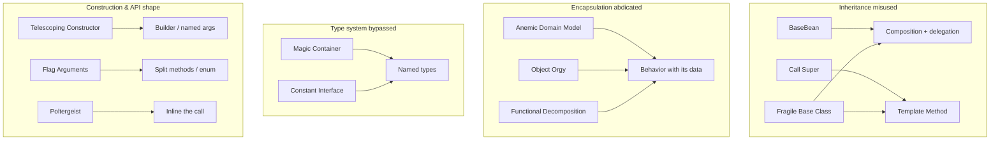

# OO Misuse Anti-Patterns — Middle Level

> **Category:** [Design Anti-Patterns](../README.md) → **OO Misuse** — *object-orientation applied as procedure-with-classes.*
> **Covers (collectively):** Anemic Domain Model · BaseBean · Constant Interface · Poltergeist · Object Orgy · Functional Decomposition · Call Super · Magic Container · Flag Arguments · Telescoping Constructor · Fragile Base Class

---

## Table of Contents

1. [Introduction](#introduction)
2. [Prerequisites](#prerequisites)
3. [The Real Question: When Does This Creep In?](#the-real-question-when-does-this-creep-in)
4. [Anemic Domain Model — Where Behavior Belongs](#anemic-domain-model--where-behavior-belongs)
5. [Flag Arguments — One Method Pretending to Be Two](#flag-arguments--one-method-pretending-to-be-two)
6. [Telescoping Constructor — Building Without Over-Building](#telescoping-constructor--building-without-over-building)
7. [Fragile Base Class — Inheritance That Breaks at a Distance](#fragile-base-class--inheritance-that-breaks-at-a-distance)
8. [Magic Container — When the Type System Goes Dark](#magic-container--when-the-type-system-goes-dark)
9. [The Remaining Six — A Field Guide](#the-remaining-six--a-field-guide)
10. [Catching OO Misuse in Review](#catching-oo-misuse-in-review)
11. [Tooling That Helps](#tooling-that-helps)
12. [Common Mistakes](#common-mistakes)
13. [Test Yourself](#test-yourself)
14. [Cheat Sheet](#cheat-sheet)
15. [Summary](#summary)
16. [Further Reading](#further-reading)
17. [Related Topics](#related-topics)

---

## Introduction

> Focus: **When does this creep in?** and **What do I do instead?**

At the junior level you learned to *recognize* these eleven shapes — a class that's all getters and setters, an interface holding only constants, a constructor with eight overloads. The middle-level question is harder and more useful: **why do reasonable engineers keep producing them?**

The answer is almost always a *force*, not ignorance. Anemic models emerge because a layered architecture template put "logic" in the service layer and "data" in the entity layer — so behavior had nowhere else to go. Flag arguments emerge because adding a `bool` is a one-line diff and splitting a method is five. Telescoping constructors emerge because each new field is "just one more parameter." Each anti-pattern is the path of least resistance under some pressure.

The middle skill is two-fold: **name the force** so you see the pattern forming, and **know the countermove** — *including the trap inside the countermove*. Because every fix here has a way to overshoot. Move logic into the domain object and you can create a God Object. Reach for a Builder and you can over-build a three-field struct. Replace inheritance with composition and you can scatter behavior into Poltergeists. The senior difference is not knowing the cure — it's knowing the dose.

---

## Prerequisites

- **Required:** Comfortable with [`junior.md`](junior.md) — you can identify all eleven anti-patterns from a snippet.
- **Required:** You've maintained an OO codebase long enough to have *inherited* someone's class hierarchy.
- **Helpful:** Working knowledge of [SOLID](../../../clean-code/09-classes/README.md), especially SRP, the Open–Closed Principle, and the Interface Segregation Principle.
- **Helpful:** Familiarity with [composition over inheritance](../../../design-patterns/02-structural/README.md) and the [Builder](../../../design-patterns/01-creational/03-builder/junior.md) and [Template Method](../../../design-patterns/03-behavioral/09-template-method/README.md) patterns — the positive counterparts most of these invert.
- **Helpful:** You participate in code review, as author or reviewer.

---

## The Real Question: When Does This Creep In?

Each anti-pattern has a predictable trigger. If you can name the moment, you can intervene before it sets:

| Trigger | What happens | Anti-pattern |
|---|---|---|
| **"Entities hold data, services hold logic"** template | Behavior drains out of the objects that own the data | Anemic Domain Model |
| **"It's mostly the same, just add a flag"** | A `bool` parameter forks the method body in two | Flag Arguments |
| **"Just one more optional field"** | A new constructor overload per field combination | Telescoping Constructor |
| **"Reuse this method via inheritance"** | A base class accumulates protected helpers subclasses depend on | Fragile Base Class / BaseBean |
| **"I need to pass a few loose values"** | `Map<String, Object>` / `dict[str, Any]` carries undocumented keys | Magic Container |
| **"The subclass must initialize too"** | Base method requires `super.x()` to be called by hand | Call Super |
| **"This object just forwards a call"** | A wrapper with no state appears, acts, vanishes | Poltergeist |
| **"Make the field public, it's simpler"** | Encapsulation becomes optional, then fictional | Object Orgy |
| **"It's a class because the language needs one"** | Free functions wrapped in a class with no state | Functional Decomposition |
| **"Group the constants somewhere"** | An interface defines only `static final` values | Constant Interface |

The common thread: **the cheap local move is more expensive globally.** A flag is one line now and a combinatorial maze in a year. The middle engineer pays the small shaping cost up front.

---

## Anemic Domain Model — Where Behavior Belongs

### When it creeps in

The classic trigger is a **layered architecture taught as a rule**: "Controllers call Services, Services hold business logic, Entities are just persistence-mapped data." Follow it literally and your `Order` becomes a struct of public fields, while `OrderService` holds every rule about what an order *is allowed to do*. The object that owns the data has no say over its own invariants.

The tell: the entity has no method more interesting than a getter, and somewhere a service does `order.setStatus(SHIPPED)` directly — bypassing any check that the order was actually paid for.

```java
// Anemic: the rules live OUTSIDE the data they govern.
class Order {
    private List<Item> items = new ArrayList<>();
    private Status status;
    public List<Item> getItems()        { return items; }   // exposes internals
    public void setStatus(Status s)      { this.status = s; } // no guard
    public Status getStatus()            { return status; }
}

class OrderService {
    void ship(Order o) {
        if (o.getStatus() != Status.PAID)              // the invariant lives here…
            throw new IllegalStateException("unpaid");
        o.setStatus(Status.SHIPPED);                   // …and nothing stops a second caller
    }                                                  //    from skipping the check.
}
```

Any code holding an `Order` can call `setStatus(SHIPPED)` and bypass the rule. The invariant isn't protected; it's merely *usually* checked.

### What to do instead

**Move the behavior to the object that owns the state**, and stop exposing setters that let callers break invariants. This is the *Tell, Don't Ask* principle ([Clean Code → Objects](../../../clean-code/05-objects-and-data-structures/README.md)).

```java
// Rich: the object protects its own invariants.
class Order {
    private final List<Item> items;
    private Status status;

    public void ship() {                          // behavior lives with the data
        if (status != Status.PAID)
            throw new IllegalStateException("cannot ship unpaid order");
        status = Status.SHIPPED;
    }
    public List<Item> items() {                   // defensive copy, no leak
        return List.copyOf(items);
    }
}
```

Now `setStatus` is gone; the *only* way to reach `SHIPPED` is through `ship()`, which enforces the rule. There is no back door.

### The trap in the fix

> **Pulling everything into the entity creates a God Object.** Not all logic belongs *on* the domain object. Behavior that needs other aggregates, external services, or cross-entity policy belongs in a **domain service** — a real object with a name, not a dumping ground. The litmus test: *does this rule depend only on this object's own state?* If yes, it's a method. If it coordinates several objects or calls infrastructure (email, payment gateway), it's a service. "Rich domain model" means **behavior near data**, not **all behavior in one class.** Overshoot and you've traded Anemic for [God Object](../../01-development/01-bad-structure/middle.md).

---

## Flag Arguments — One Method Pretending to Be Two

### When it creeps in

A method does almost what you need for a new case. Splitting it means a new name, a new signature, duplicated setup. Adding `boolean async` is one line. So the `bool` wins — and now the method body is two methods stitched together by an `if`.

```python
def render(report, as_pdf):          # caller writes render(r, True) — True meaning what?
    data = collect(report)
    if as_pdf:
        return to_pdf(data)
    return to_html(data)
```

The damage is at the **call site**: `render(report, True)` is unreadable without opening the function. And each new flag multiplies the paths — `send(msg, urgent, retry, dry_run)` hides up to eight behaviors in one body, most untested combinations.

### What to do instead

**If the behavior differs, the method should differ.** Split by behavior:

```python
def render_pdf(report):  return to_pdf(collect(report))
def render_html(report): return to_html(collect(report))
```

The call site now reads itself: `render_pdf(report)`. Shared setup (`collect`) stays factored out as a private helper, so you split behavior without duplicating logic.

When the flag selects among **more than two related strategies**, don't make N methods — pass an explicit type:

```python
class Format(Enum): PDF = auto(); HTML = auto(); CSV = auto()

def render(report, fmt: Format):     # fmt is named and self-documenting at the call site
    return RENDERERS[fmt](collect(report))
```

### The trap in the fix

> **Don't replace a flag with a flag in disguise.** Passing a single-field "options object" whose one field is the same boolean (`render(report, Options(as_pdf=True))`) buys nothing. And splitting a flag that toggles a *truly cosmetic* difference (e.g. `trim_whitespace`) into two near-identical methods is over-correction — that flag is a genuine *parameter*, not a behavior fork. The test: **does the flag change which code path runs (split it) or merely tune a value within one path (keep it)?** An enum is right only when there are three-plus genuine variants; for two, prefer two named methods.

---

## Telescoping Constructor — Building Without Over-Building

### When it creeps in

An object gains optional attributes one feature at a time. Each addition takes the cheap path: another constructor overload that delegates to the previous one.

```java
// The telescope: every combination needs its own overload.
class Pizza {
    Pizza(Size s)                                  { this(s, Crust.THIN); }
    Pizza(Size s, Crust c)                         { this(s, c, false); }
    Pizza(Size s, Crust c, boolean cheese)         { this(s, c, cheese, List.of()); }
    Pizza(Size s, Crust c, boolean cheese, List<Topping> t) { /* real work */ }
}
// Caller: new Pizza(LARGE, THICK, true, toppings) — what's the boolean? what's missing?
```

Callers can't tell what `true` means, can't skip the cheese flag to set toppings, and any new field forces a new overload across the whole chain.

### What to do instead

The **Builder pattern** ([Design Patterns → Builder](../../../design-patterns/01-creational/03-builder/junior.md)) lets callers name only what they set, in any order:

```java
Pizza p = Pizza.builder()
    .size(LARGE)
    .crust(THICK)
    .extraCheese()              // reads as intent, not a positional boolean
    .topping(MUSHROOM)
    .build();                   // build() can validate invariants in one place
```

In languages with **named/default arguments**, you often don't need a Builder at all:

```python
@dataclass
class Pizza:
    size: Size
    crust: Crust = Crust.THIN
    extra_cheese: bool = False
    toppings: list = field(default_factory=list)

Pizza(size=LARGE, crust=THICK, extra_cheese=True)   # named args do the job
```

Go has no overloading or named args; the idiomatic countermove is a **struct literal** or, for validated/optional construction, **functional options**:

```go
type Pizza struct { Size Size; Crust Crust; ExtraCheese bool; Toppings []Topping }

p := Pizza{Size: Large, Crust: Thick, ExtraCheese: true}   // struct literal: clear, zero-value defaults
```

### The trap in the fix

> **A Builder for a three-field value object is over-building.** Builders add a class, mutable interim state, and a `build()` indirection. They earn their keep when there are **many optional fields, real validation at `build()`, or immutability with optional values** — not for `new Point(x, y)`. The decision rule: *if named arguments or a struct literal in your language reads clearly, use those.* Reach for a Builder only when the parameter list is genuinely large/optional **and** the language lacks named args (notably Java). Reflexively wrapping every constructor in a Builder is its own anti-pattern — ceremony without payoff.

---

## Fragile Base Class — Inheritance That Breaks at a Distance

### When it creeps in

A base class is meant to be extended. Over time, subclasses come to depend on the base's *internal* behavior — which protected method calls which, in what order, with what side effects. None of this is in the contract; it's just how the base happens to work today. Then someone refactors the base for a perfectly good reason, and subclasses break **without their code changing**. The inheritance contract was implicit, so the compiler couldn't protect it.

The textbook example: a base collection where one method calls another internally, and a subclass overrides both — so a base refactor double-counts.

```java
class CountingSet<E> extends HashSet<E> {
    private int added = 0;
    @Override public boolean add(E e)            { added++; return super.add(e); }
    @Override public boolean addAll(Collection<E> c) {
        added += c.size();                       // assumes addAll does NOT call add internally…
        return super.addAll(c);
    }
}
// If HashSet.addAll() is implemented by calling add() per element, `added` is counted TWICE.
// The subclass broke because of an UNDOCUMENTED internal call in the base.
```

Nothing in `HashSet`'s public contract says whether `addAll` calls `add`. The subclass guessed, and the guess is fragile.

### What to do instead

**Favor composition over inheritance.** Wrap the base instead of extending it — you depend only on its *public* contract, which won't shift under you.

```java
class CountingSet<E> {
    private final Set<E> delegate = new HashSet<>();   // composition: HAS-A, not IS-A
    private int added = 0;

    public boolean add(E e)                 { added++; return delegate.add(e); }
    public boolean addAll(Collection<E> c)  {
        int before = delegate.size();
        boolean changed = delegate.addAll(c);
        added += delegate.size() - before;             // counts only real insertions
        return changed;
    }
}
```

When inheritance is genuinely the right tool, **make the contract explicit and enforced**:

- **Design for inheritance or forbid it.** Mark classes `final` by default (Java/Kotlin); open them deliberately. In Go there is no inheritance — embedding plus interfaces sidesteps the whole problem.
- **Use Template Method** ([Behavioral patterns](../../../design-patterns/03-behavioral/09-template-method/README.md)): the base owns the control flow in a `final` method; subclasses fill in `abstract` hook methods. The base can't be broken by a subclass, and a subclass can't break by guessing the base's internal calls.

```java
abstract class ReportJob {
    public final void run() {            // final: subclasses CANNOT alter the control flow
        var data = fetch();              // hook
        var out  = format(data);         // hook
        publish(out);                    // shared, fixed
    }
    protected abstract Data fetch();
    protected abstract String format(Data d);
    private void publish(String s) { /* fixed */ }
}
```

### The trap in the fix

> **Composition can scatter behavior and breed Poltergeists.** Replacing a clean two-level hierarchy with five delegating wrappers that each forward a single call is over-correction — you've turned one fragile relationship into a tangle of pass-through objects (see Poltergeist below). And forwarding *every* method of a large interface by hand is tedious and error-prone (languages like Kotlin's `by` delegation or Go embedding help). Composition is the default, but use it where it buys real decoupling, not as a reflex. Likewise, marking everything `final` can frustrate legitimate extension — be deliberate about which classes are extension points and **document their contract** (which methods are hooks, what they may assume).

---

## Magic Container — When the Type System Goes Dark

### When it creeps in

You need to pass "a few loose values" between layers — request parameters, a config blob, an event payload. Defining a type feels heavy, so you reach for `Map<String, Object>`, `dict[str, Any]`, or Android's `Bundle`. Now the keys are strings (typo-prone, undocumented) and the values are `Object`/`Any` (cast at every read). The compiler is blind; every access is a runtime gamble.

```python
def create_user(data: dict):                 # what keys? what types? nobody knows
    name = data["name"]                       # KeyError if caller wrote "username"
    age  = data.get("age", 0)                 # silently 0 if missing — bug, not error
    send_welcome(data["emial"])               # typo compiles, fails in production
```

The Magic Container *bypasses the entire point of a type system*: it moves "what fields exist and what types they have" out of the code and into your memory.

### What to do instead

**Define a real type with named fields.** Let the compiler tell you what's missing or misspelled.

```python
@dataclass
class CreateUserRequest:
    name: str
    email: str
    age: int = 0

def create_user(req: CreateUserRequest):
    send_welcome(req.email)        # typo "emial" is now a compile/lint-time error
```

In Go, a struct does the same — and `encoding/json` maps a wire payload onto it with declared types:

```go
type CreateUserRequest struct {
    Name  string `json:"name"`
    Email string `json:"email"`
    Age   int    `json:"age"`
}
```

The named type is also **self-documenting** (the fields *are* the docs), **refactorable** (rename a field and the tooling updates every use), and **validatable in one place** (a constructor or a `validate()`).

### The trap in the fix

> **A truly dynamic payload sometimes *is* a map — don't fake a type for it.** If the data is genuinely open-ended (arbitrary user-defined metadata, a plugin's free-form config), forcing it into a rigid struct just relocates the problem. The honest move there is a typed map with a documented *value* schema (`map[string]string`, or a tagged union / sum type for known variants). The anti-pattern is using a magic container for data that has a **known, fixed shape**. Conversely, don't explode one cohesive payload into fifteen positional parameters to avoid a "container" — that's a [Long Parameter List](../../../clean-code/02-functions/README.md), the cure being the *same* named type. The target is a named type with declared fields; the failure modes are stringly-typed maps on one side and parameter sprawl on the other.

---

## The Remaining Six — A Field Guide

These six share the same shape of fix as the deep five; here is the trigger, the countermove, and the trap for each.

| Anti-pattern | When it creeps in | What to do instead | The trap in the fix |
|---|---|---|---|
| **BaseBean** | A class extends a "utility base" (`BaseUtils`, `AbstractHelper`) just to reach helper methods — inheritance used for *code access*, not *is-a* | Make helpers free functions or inject a collaborator; **composition/delegation** over a utility base | Don't swing to a `Utils` God Object that everything depends on — group helpers by cohesion, not into one dumping module |
| **Constant Interface** | Constants need a home; an `interface` of `static final` values is the lazy bin (Java idiom; the shape recurs elsewhere) | `enum` for related closed sets; `static import` of a `final class Constants`; module-level constants in Python/Go | Don't over-fragment into dozens of one-constant enums; group constants that *vary together* |
| **Poltergeist** | A short-lived object exists only to call a method on another and then vanishes — no state, no identity | **Inline** it; call the real object directly, or fold the logic into the collaborator | Don't inline a class that's actually a meaningful *seam* (a strategy, a test boundary) — verify it has no state *and* no future variation |
| **Object Orgy** | "Make the field public, it's simpler"; objects reach into each other's internals freely | Tighten visibility; expose **behavior** not fields; defensive copies; [immutability](../../../clean-code/14-immutability/README.md) | Don't wrap every field in trivial get/set — that's Anemic again; expose *operations*, keep data private |
| **Functional Decomposition** | An OO language forces a class, so free functions get wrapped in a stateless class named after a verb (`OrderProcessor` with one static `process`) | In Python/Go, **use free functions**; in Java, a stateless class of statics is fine — name it honestly (`OrderProcessing`), don't pretend it's an object | Don't manufacture fake state/objects just to "be OO" — if it's a function, let it be a function |
| **Call Super** | A base method *requires* every override to call `super.x()` first/last; forgetting it silently corrupts state | **Template Method**: base owns a `final` control method, subclass fills a separate `abstract` hook — no manual `super` call to forget | Don't replace one mandatory `super` call with three lifecycle hooks nobody understands; keep the hook surface minimal and documented |

> Notice the recurring spine: **BaseBean, Call Super, and Fragile Base Class are all inheritance misused for the wrong reason** (reuse, sequencing, or undocumented internals). The shared cure is *composition + Template Method + explicit contracts.* **Anemic, Object Orgy, and Functional Decomposition** are all *encapsulation abdicated* — data without behavior, or behavior without data. The cure is putting behavior and the state it governs in the same place — without overshooting into a God Object.



---

## Catching OO Misuse in Review

Review is the cheapest place to stop these, because the diff is still small. Practical reviewer questions:

- **"Does this entity have any method that isn't a getter or setter?"** No → Anemic Domain Model forming.
- **"What does this `true` mean at the call site?"** Can't tell without opening the method → Flag Argument.
- **"Is this a new constructor overload?"** Yes, and there are already three → Telescoping Constructor; suggest a Builder or named args.
- **"Does this subclass assume anything about how the base is implemented internally?"** Yes → Fragile Base Class; prefer composition.
- **"What keys does this map carry, and are they documented?"** "You just have to know" → Magic Container; define a type.
- **"Why does this class extend `BaseFoo`?"** "To use its helpers" → BaseBean; inject or use free functions.
- **"Does this new class hold any state?"** No, it just forwards one call → Poltergeist; inline it.

As an *author*, pre-empt these: keep PRs scoped, name your types, and prefer two clear methods over one flagged one.

---

## Tooling That Helps

Tools won't *judge* design, but they point your attention:

| Signal | Tooling | Flags |
|---|---|---|
| Public mutable fields | linters (Checkstyle, `golangci-lint`, `ruff`) | Object Orgy, Anemic models |
| Boolean parameters | linters with `flag-argument`/`boolean-param` rules; SonarQube | Flag Arguments |
| Many constructor overloads | IDE structure view; SonarQube "too many overloads" | Telescoping Constructor |
| `Map<String, Object>` / `dict[str, Any]` / `interface{}` signatures | type checkers (`mypy --disallow-any-explicit`, `go vet`) | Magic Container |
| Deep/`@Override`-heavy hierarchies | architecture linters; IDE hierarchy view | Fragile Base Class, Call Super |
| Classes that only contain `static` members | SonarQube "utility class" rule | Functional Decomposition, BaseBean |

```bash
# Python: forbid implicit/explicit Any so Magic Containers surface as type errors
mypy --disallow-any-explicit --disallow-any-generics path/to/pkg
```

> **Caution:** these are smoke detectors, not gates. A boolean parameter on a genuinely cosmetic toggle is fine; a single `interface{}` at a real serialization boundary may be unavoidable. Use tools to *find* candidates, then judge with your eyes.

---

## Common Mistakes

1. **Curing Anemic by stuffing the entity.** Moving *all* logic — including cross-aggregate and infrastructure calls — onto the domain object creates a [God Object](../../01-development/01-bad-structure/middle.md). Keep coordination in domain services.
2. **Builder for everything.** Wrapping a two- or three-field value object in a Builder adds ceremony with no payoff. Use named args / struct literals unless fields are many, optional, or need validation.
3. **Splitting cosmetic flags into twin methods.** If a `bool` tunes a value within one path rather than forking behavior, it's a legitimate parameter — leave it.
4. **Over-composing into Poltergeists.** Replacing inheritance with a chain of single-call forwarding wrappers trades one anti-pattern for another. Compose where it decouples, not reflexively.
5. **Replacing a Magic Container with a parameter sprawl.** Fifteen positional arguments is a [Long Parameter List](../../../clean-code/02-functions/README.md), not an improvement. The fix for both is one named type.
6. **Making `Utils` the new dumping ground.** Curing BaseBean by piling every helper into one static `Utils` class just relocates the coupling. Group helpers by cohesion.
7. **Trivial getters/setters as "encapsulation."** A field hidden behind `getX`/`setX` that do nothing is still exposed — and re-creates an Anemic model. Expose *operations*, not fields.

---

## Test Yourself

1. Your `Account` entity is all getters/setters and `AccountService.withdraw()` checks the balance before mutating it. What's the anti-pattern, what's the fix, and what's the risk if you overdo the fix?
2. A method is `notify(user, urgent, email, sms)`. Why is this fragile, and how would you redesign the API for (a) two variants and (b) several variants?
3. When is a Builder the right answer for object construction, and when is it over-engineering?
4. A `CounterSet extends HashSet` breaks after a JDK upgrade even though your code didn't change. Name the anti-pattern and the composition-based fix. What does the fix risk if applied to a whole hierarchy?
5. You see `process(data: dict)` passed across three layers. What's wrong, what's the fix, and when is a map *actually* the right type?
6. BaseBean, Call Super, and Fragile Base Class share a root cause. What is it, and what single family of fixes addresses all three?

<details>
<summary>Answers</summary>

1. **Anemic Domain Model.** Move the balance check into `Account.withdraw()` so the invariant can't be bypassed, and remove the setter that allows arbitrary balance changes. **Overdo risk:** pulling cross-aggregate or infrastructure logic onto the entity creates a **God Object**; logic that coordinates multiple objects or calls external services belongs in a domain service.
2. Each boolean forks the body and is unreadable at the call site (`notify(u, true, false, true)` — which is which?); combinations multiply untested paths. **(a) Two variants:** split into `notifyUrgent` / `notify`, or distinct channel methods. **(b) Several variants:** pass an explicit `Channel`/`Priority` enum (or a small typed options object with *named* fields), not a row of booleans.
3. A Builder earns its keep when there are **many optional fields, real validation at `build()`, or immutable objects with optional values** *and* the language lacks named arguments (Java). It's over-engineering for a small fixed field set, or in languages with named/default args (Python) or struct literals (Go), where those read clearly already.
4. **Fragile Base Class.** The subclass depended on an *undocumented internal call* (`addAll` calling `add`) that the JDK changed. **Fix:** composition — hold a `HashSet` as a field and delegate, depending only on its public contract. **Risk if over-applied:** turning a whole hierarchy into chains of single-call forwarding wrappers breeds **Poltergeists** and tedious boilerplate; use composition where it actually decouples and keep deliberate, documented extension points.
5. **Magic Container** — stringly-typed keys, `Any` values, compiler blind, typos fail at runtime. **Fix:** a named type (`dataclass`/struct) with declared fields. **A map is right** only when the data is genuinely open-ended (arbitrary metadata, free-form plugin config) — and then document the *value* schema; it's wrong for data with a known fixed shape.
6. Root cause: **inheritance used for the wrong reason** — code reuse (BaseBean), enforced sequencing (Call Super), or reliance on undocumented base internals (Fragile Base Class). **Fix family:** composition/delegation plus **Template Method** (base owns a `final` control method, subclasses fill separate `abstract` hooks) and explicit, documented inheritance contracts (`final` by default).

</details>

---

## Cheat Sheet

| Anti-pattern | Creeps in when… | Countermove | Trap in the countermove |
|---|---|---|---|
| **Anemic Domain Model** | "Entities = data, services = logic" template | Behavior with its data; *Tell, Don't Ask* | Don't pull *all* logic in → God Object; keep coordination in domain services |
| **Flag Arguments** | "Just add a `bool`" | Split into named methods; enum for 3+ variants | Don't split cosmetic flags; don't disguise a flag as a 1-field options object |
| **Telescoping Constructor** | "One more optional field" | Builder, or named args / struct literal | Don't Builder a 3-field value object; use named args where the language allows |
| **Fragile Base Class** | "Reuse via inheritance"; subclass assumes base internals | Composition; Template Method; `final` by default | Don't over-compose into Poltergeists; keep documented extension points |
| **Magic Container** | "Pass a few loose values" via `Map`/`dict[Any]` | Named type with declared fields | Don't fake a struct for truly dynamic data; don't explode into a param list |
| **BaseBean** | Extend a util base for helpers | Free functions / inject; composition | Don't create a `Utils` God Object |
| **Constant Interface** | "Put the constants somewhere" | `enum` / `static import` / module constants | Don't over-fragment into one-constant enums |
| **Poltergeist** | A stateless object only forwards a call | Inline it | Don't inline a real strategy/test seam |
| **Object Orgy** | "Make the field public" | Tighten visibility; expose behavior; immutability | Don't add trivial get/set → Anemic again |
| **Functional Decomposition** | "Language needs a class" | Free functions (Py/Go); honest static class (Java) | Don't fake state to "look OO" |
| **Call Super** | Base needs `super.x()` called by hand | Template Method (`final` flow + `abstract` hook) | Don't replace one `super` with many opaque hooks |

**Two golden rules:**
- *Put behavior next to the state it governs — but no further (entity for self-invariants, service for coordination).*
- *Every cure here can overshoot; know the dose, not just the medicine.*

---

## Summary

- OO misuse is rarely ignorance — it's the **path of least resistance under a force** (a layered template, a one-line `bool`, "one more field"). Name the force and you see the pattern forming.
- **Anemic Domain Model:** move behavior to the object that owns the state; keep cross-object coordination in services so you don't create a God Object.
- **Flag Arguments:** split by behavior into named methods, or pass an enum for 3+ variants — but leave genuinely cosmetic parameters alone.
- **Telescoping Constructor:** Builder or named arguments / struct literals — and *don't* Builder a small value object.
- **Fragile Base Class:** prefer composition; when inheritance is right, make the contract explicit with Template Method and `final`-by-default — without over-composing into Poltergeists.
- **Magic Container:** define a named type so the compiler guards your fields — unless the data is genuinely dynamic.
- The remaining six cluster around three roots: **inheritance for the wrong reason**, **encapsulation abdicated**, and **the type system bypassed** — and share the same families of cure.
- Every countermove has a trap. The middle skill is **knowing the dose.**
- Next: [`senior.md`](senior.md) — detecting these in review at scale, migrating large hierarchies, and the architectural forces that breed anemic models.

---

## Further Reading

- **Patterns of Enterprise Application Architecture** — Martin Fowler (2002) — coined *Anemic Domain Model*; Domain Model vs Transaction Script.
- **Domain-Driven Design** — Eric Evans (2003) — rich domain models, aggregates, domain services as the antidote.
- **Effective Java** — Joshua Bloch (3rd ed., 2018) — Builder (Item 2), favor composition over inheritance (Item 18), design for inheritance or prohibit it (Item 19), avoid Constant Interfaces (Item 22).
- **Clean Code** — Robert C. Martin (2008) — function arguments and flag arguments, *Tell Don't Ask*, SRP/ISP.
- **Refactoring** — Martin Fowler (2nd ed., 2018) — Replace Constructor with Builder, Replace Parameter with Explicit Methods, Introduce Parameter Object, Replace Inheritance with Delegation.

---

## Related Topics

- [Clean Code → Classes](../../../clean-code/09-classes/README.md) — cohesion, SRP, and the Interface Segregation Principle.
- [Clean Code → Objects and Data Structures](../../../clean-code/05-objects-and-data-structures/README.md) — *Tell, Don't Ask*; the anemic-vs-rich distinction.
- [Design Patterns → Builder](../../../design-patterns/01-creational/03-builder/junior.md) and [Template Method](../../../design-patterns/03-behavioral/09-template-method/README.md) — the positive counterparts to Telescoping Constructor and Call Super / Fragile Base Class.
- [Design Patterns](../../../design-patterns/README.md) — the full catalog these anti-patterns invert.
- [Refactoring → Refactoring Techniques](../../../refactoring/02-refactoring-techniques/README.md) — the mechanical moves referenced here.
- [Bad Structure](../../01-development/01-bad-structure/middle.md) — the God Object you can accidentally create while curing Anemic models.
- [Coupling & State](../02-coupling-and-state/middle.md) and [Abstraction Failures](../03-abstraction-failures/middle.md) — the sibling design categories.
