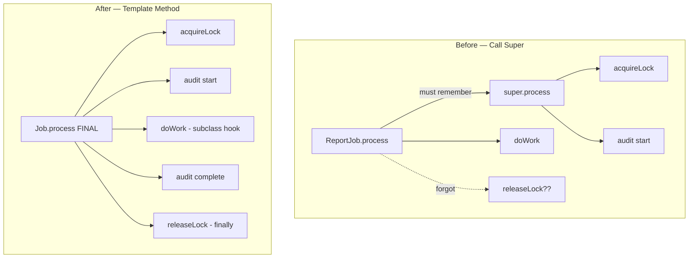

# OO Misuse Anti-Patterns — Refactoring Practice

> **Category:** [Design Anti-Patterns](../README.md) → **OO Misuse** — *object-orientation applied as procedure-with-classes; the wrong allocation of behavior, state, and inheritance.*
> **Covers (collectively):** Anemic Domain Model · BaseBean · Constant Interface · Poltergeist · Object Orgy · Functional Decomposition · Call Super · Magic Container · Flag Arguments · Telescoping Constructor · Fragile Base Class

---

These are not "spot the smell" puzzles — [`find-bug.md`](find-bug.md) does that. Here the code is **structurally bad but already working**, and your job is to **transform it into clean OO without changing behavior**. The skill on display is the *process*, not the destination:

1. **Pin behavior first.** Write a *characterization test* — a test that records what the code does *now*, bugs included. With OO you usually pin behavior at the **public seam** (the class's public methods, the function's return + side effects), because the refactor will move logic *behind* that seam.
2. **Take small, reversible steps.** One named refactoring at a time (Move Method, Replace Constructor with Builder, Replace Inheritance with Delegation, …), tests green after each, commit.
3. **Separate structural from behavioral commits.** A refactor must preserve behavior; if a test goes red, the last step is the culprit — revert it.

Each worked solution names the **canonical refactoring moves** (from Fowler's *Refactoring* and Feathers' *Working Effectively with Legacy Code*) so you build the vocabulary, not just the instinct.

> **How to use this file:** read the "Before" code, write down the move sequence *yourself* before expanding the solution, then compare. The gap between your plan and the worked plan is where the learning is.

---

## Table of Contents

| # | Exercise | Anti-pattern(s) | Lang | Key moves |
|---|---|---|---|---|
| 1 | [Replace the flag argument](#exercise-1--replace-the-flag-argument) | Flag Arguments | Java | Remove Flag Argument, Split Function |
| 2 | [Tame the telescoping constructor](#exercise-2--tame-the-telescoping-constructor) | Telescoping Constructor | Java | Replace Constructor with Builder |
| 3 | [Give the Magic Container a type](#exercise-3--give-the-magic-container-a-type) | Magic Container | Go | Replace Map with Struct / Typed Record |
| 4 | [Enrich the Anemic Domain Model](#exercise-4--enrich-the-anemic-domain-model) | Anemic Domain Model | Python | Move Method, Tell-Don't-Ask, Encapsulate Field |
| 5 | [Inline the Poltergeist](#exercise-5--inline-the-poltergeist) | Poltergeist | Go | Remove Middle Man, Inline Class |
| 6 | [Tighten the Object Orgy](#exercise-6--tighten-the-object-orgy) | Object Orgy | Java | Encapsulate Field, Hide Delegate, Encapsulate Collection |
| 7 | [Retire the Constant Interface](#exercise-7--retire-the-constant-interface) | Constant Interface | Java | Replace Inheritance with Enum / Static Import |
| 8 | [Turn the BaseBean into a collaborator](#exercise-8--turn-the-basebean-into-a-collaborator) | BaseBean | Java | Replace Inheritance with Delegation |
| 9 | [Fix Call Super with Template Method](#exercise-9--fix-call-super-with-template-method) | Call Super + Fragile Base Class | Java | Form Template Method, Extract Hook |
| 10 | [Break the Fragile Base Class](#exercise-10--break-the-fragile-base-class) | Fragile Base Class | Python | Replace Inheritance with Delegation, Composition |
| 11 | [Rebuild the Functional Decomposition](#exercise-11--rebuild-the-functional-decomposition) | Functional Decomposition | Python | Inline Class / Convert to Free Functions, or Introduce Object |
| 12 | [Replace conditional with polymorphism](#exercise-12--replace-conditional-with-polymorphism) | Flag Arguments + Anemic Model | Go | Replace Conditional with Polymorphism |
| 13 | [The full OO-misuse combo](#exercise-13--the-full-oo-misuse-combo) | Six at once | Java | The whole toolbox, in order |

---

## Exercise 1 — Replace the flag argument

**Anti-pattern:** Flag Arguments. **Goal:** remove the boolean that flips behavior so each behavior has its own named entry point. **Constraints:** preserve both current behaviors; callers may be updated.

```java
// Before — one boolean selects between two genuinely different behaviors.
public Money convert(Money amount, Currency to, boolean useLiveRate) {
    Rate rate = useLiveRate
        ? rateService.fetchLive(amount.currency(), to)   // network call, may be stale-tolerant
        : rateService.cachedDaily(amount.currency(), to); // in-memory, fixed for the day
    return new Money(amount.value().multiply(rate.value()), to);
}

// every call site has to remember what `true` means:
convert(price, EUR, true);
convert(price, EUR, false);
```

<details>
<summary>Refactored</summary>

**Move sequence**

1. **Characterize.** Two tests: one asserts `convert(..., true)` calls `fetchLive` and returns its product; one asserts `convert(..., false)` calls `cachedDaily`. Use a mock/spy on `rateService` — the *interaction* is the contract here.
2. **Find the call sites.** `grep -rn "convert(" src/` — note that every caller passes a *literal* `true`/`false`. A literal flag is the tell-tale sign the caller already knows which of two methods it wants; the boolean only hides that.
3. **Remove Flag Argument** (Fowler): introduce two intention-revealing methods, `convertLive` and `convertDaily`, each containing only its branch. **Extract Function** the shared multiplication so the formula has one home.
4. Update each call site to the explicit method, then delete the old `convert`.

```java
// After — the method name carries the intent; no boolean to misread.
public Money convertLive(Money amount, Currency to) {
    return apply(amount, to, rateService.fetchLive(amount.currency(), to));
}

public Money convertDaily(Money amount, Currency to) {
    return apply(amount, to, rateService.cachedDaily(amount.currency(), to));
}

private Money apply(Money amount, Currency to, Rate rate) {
    return new Money(amount.value().multiply(rate.value()), to);
}

// call sites are now self-documenting:
convertLive(price, EUR);
convertDaily(price, EUR);
```

**What improved & how to verify.** The reader no longer decodes `true`/`false` at every call site; the two behaviors can no longer be confused, and the shared formula is deduplicated. **Verify** with the characterization tests: route the original `true`/`false` cases through the new methods and assert the same `rateService` interactions and the same returned `Money`. This is a structural-only change — the multiplication is byte-for-byte the old one.

> When the flag isn't binary-behavioral but *configuration* (e.g., a `Priority` that scales a number), prefer passing an **enum/strategy** rather than splitting — see Exercise 12.

</details>

---

## Exercise 2 — Tame the telescoping constructor

**Anti-pattern:** Telescoping Constructor. **Goal:** replace the overload chain with a Builder so construction is readable and optional fields are explicit. **Constraints:** the resulting object must be identical for equivalent inputs; keep the type immutable.

```java
// Before — five overloads, each delegating to the next; the 7-arg one is unreadable.
public final class Pizza {
    private final Size size;
    private final Crust crust;
    private final boolean cheese, pepperoni, mushroom;
    private final int slices;

    public Pizza(Size size) { this(size, Crust.THIN); }
    public Pizza(Size size, Crust crust) { this(size, crust, true); }
    public Pizza(Size size, Crust crust, boolean cheese) { this(size, crust, cheese, false); }
    public Pizza(Size size, Crust crust, boolean cheese, boolean pepperoni) {
        this(size, crust, cheese, pepperoni, false);
    }
    public Pizza(Size size, Crust crust, boolean cheese, boolean pepperoni, boolean mushroom) {
        this.size = size; this.crust = crust; this.cheese = cheese;
        this.pepperoni = pepperoni; this.mushroom = mushroom;
        this.slices = size == Size.LARGE ? 8 : 6;
    }
}

// call site — what is the third 'true'? what is 'false, true'?
new Pizza(Size.LARGE, Crust.STUFFED, true, false, true);
```

<details>
<summary>Refactored</summary>

**Move sequence**

1. **Characterize.** Construct a few representative pizzas via the existing overloads and snapshot every field (including the derived `slices`). This pins the defaults each overload encodes.
2. **Replace Constructor with Builder** (Fowler). Make the all-args constructor `private`, then add a static nested `Builder` that holds the same fields *with the overload defaults baked in as field initializers* — that's how you preserve behavior exactly.
3. Add one fluent setter per optional field, returning `this`, and a `build()` that calls the private constructor.
4. Migrate call sites to the builder; delete the public telescoping overloads last.

```java
// After — required arg in the builder ctor; optionals are named and defaulted.
public final class Pizza {
    private final Size size;
    private final Crust crust;
    private final boolean cheese, pepperoni, mushroom;
    private final int slices;

    private Pizza(Builder b) {
        this.size = b.size; this.crust = b.crust; this.cheese = b.cheese;
        this.pepperoni = b.pepperoni; this.mushroom = b.mushroom;
        this.slices = size == Size.LARGE ? 8 : 6;   // same derivation as before
    }

    public static Builder of(Size size) { return new Builder(size); }

    public static final class Builder {
        private final Size size;                 // required
        private Crust crust = Crust.THIN;        // defaults match the old overloads
        private boolean cheese = true;
        private boolean pepperoni = false;
        private boolean mushroom = false;

        private Builder(Size size) { this.size = size; }
        public Builder crust(Crust c)      { this.crust = c; return this; }
        public Builder cheese(boolean v)   { this.cheese = v; return this; }
        public Builder pepperoni(boolean v){ this.pepperoni = v; return this; }
        public Builder mushroom(boolean v) { this.mushroom = v; return this; }
        public Pizza build()               { return new Pizza(this); }
    }
}

// call site — every value is labelled; order no longer matters.
Pizza p = Pizza.of(Size.LARGE).crust(Crust.STUFFED).pepperoni(true).mushroom(true).build();
```

**What improved & how to verify.** The unreadable positional `true, false, true` becomes self-describing; adding a topping is one builder method, not a sixth overload (the chain grew O(n) per optional field). Immutability is preserved — `Pizza` still has only `final` fields and no setters. **Verify**: the field snapshot is identical for each previously-overloaded construction, *including* the derived `slices`. Keep the old constructors until all call sites are migrated, then delete them in a separate cleanup commit.

> Builder is the right cure when there are many optionals; if the params are *required and conceptually one thing*, prefer **Introduce Parameter Object** instead (don't reach for Builder reflexively — that's a Golden Hammer).

</details>

---

## Exercise 3 — Give the Magic Container a type

**Anti-pattern:** Magic Container. **Goal:** replace a stringly-typed `map[string]any` passed across the codebase with a real type whose fields the compiler checks. **Constraints:** same computed result; the conversion must surface, not hide, any missing-key assumptions.

```go
// Before — a bag of any-typed values; keys are undocumented and unchecked.
func BuildInvoice(data map[string]any) (string, error) {
	customer := data["customer"].(string)          // panics if absent or wrong type
	amount := data["amount"].(float64)
	currency := data["currency"].(string)
	taxable, _ := data["taxable"].(bool)            // silently false if missing

	tax := 0.0
	if taxable {
		tax = amount * 0.2
	}
	total := amount + tax
	return fmt.Sprintf("%s owes %.2f %s", customer, total, currency), nil
}

// call site — nothing stops you misspelling "ammount" or omitting "currency".
BuildInvoice(map[string]any{"customer": "Acme", "amount": 100.0, "currency": "USD", "taxable": true})
```

<details>
<summary>Refactored</summary>

**Move sequence**

1. **Characterize.** Tests covering taxable/non-taxable and a known total; if any production caller relies on a *missing* key defaulting (e.g. absent `taxable` → no tax), pin that too — it's part of the current behavior.
2. **Introduce the typed record.** Define an `Invoice` struct with the four fields. This is **Replace Magic Container with Class** (the Go shape of Fowler's *Replace Record with Data Class* applied to a map).
3. **Change signature** to take `Invoice`. Let the compiler find every call site — that's the whole point: the type system now enumerates the work for you.
4. At each call site, build the struct literal. Misspelled or missing fields become *compile errors* instead of runtime panics or silent zero-values.

```go
// After — fields are named, typed, and checked at compile time.
type Invoice struct {
	Customer string
	Amount   float64
	Currency string
	Taxable  bool
}

func BuildInvoice(inv Invoice) string {
	tax := 0.0
	if inv.Taxable {
		tax = inv.Amount * 0.2
	}
	total := inv.Amount + tax
	return fmt.Sprintf("%s owes %.2f %s", inv.Customer, total, inv.Currency)
}

// call site — the compiler rejects a misspelled or missing field.
BuildInvoice(Invoice{Customer: "Acme", Amount: 100.0, Currency: "USD", Taxable: true})
```

**What improved & how to verify.** Three classes of latent bug vanish: type-assertion panics, silent zero-value defaults, and key typos — all are now caught at compile time, and the struct *documents* the required shape. The function also drops its `error` return, because the "wrong type"/"missing key" failure mode no longer exists. **Verify**: the characterization tests pass with struct literals; confirm the `taxable` default behavior (absent key → `false` → `Taxable: false`) still matches. Removing the now-impossible `error` is a behavioral tightening — note it in the PR so callers updating `_, err :=` expect the change.

</details>

---

## Exercise 4 — Enrich the Anemic Domain Model

**Anti-pattern:** Anemic Domain Model. **Goal:** move behavior from a procedural "service" into the data object it operates on, applying *Tell, Don't Ask*. **Constraints:** preserve the externally observable results; the service's public method may delegate but must keep working.

```python
# Before — Account is a bag of getters/setters; all logic lives in the service.
class Account:
    def __init__(self, balance, frozen=False):
        self._balance = balance
        self._frozen = frozen
    def get_balance(self): return self._balance
    def set_balance(self, v): self._balance = v
    def is_frozen(self): return self._frozen

class AccountService:
    def withdraw(self, account, amount):
        if account.is_frozen():
            raise ValueError("account frozen")
        if amount <= 0:
            raise ValueError("amount must be positive")
        if amount > account.get_balance():            # ASK
            raise ValueError("insufficient funds")
        account.set_balance(account.get_balance() - amount)  # then mutate from outside
        return account.get_balance()
```

<details>
<summary>Refactored</summary>

**Move sequence**

1. **Characterize.** Tests through `AccountService.withdraw`: frozen, non-positive amount, overdraw, and a successful withdrawal returning the new balance. This is the seam you must keep stable.
2. **Move Method.** Move the rules and the mutation *into* `Account.withdraw`. The logic already operates almost entirely on `Account`'s own fields — a classic Feature Envy signal that it belongs there.
3. **Tell, Don't Ask / Encapsulate Field.** The service stops *asking* for the balance and *deciding*; it *tells* the account to withdraw. Once nothing external reads/writes the balance directly, delete `get_balance`/`set_balance` (keep a read-only `balance` property if a caller genuinely needs to display it).
4. The service becomes a thin coordinator (or disappears entirely if it had only this one method).

```python
# After — the object owns its invariants; the service just delegates.
class Account:
    def __init__(self, balance, frozen=False):
        self._balance = balance
        self._frozen = frozen

    @property
    def balance(self):            # read-only view for display; no setter
        return self._balance

    def withdraw(self, amount):
        if self._frozen:
            raise ValueError("account frozen")
        if amount <= 0:
            raise ValueError("amount must be positive")
        if amount > self._balance:
            raise ValueError("insufficient funds")
        self._balance -= amount
        return self._balance

class AccountService:
    def withdraw(self, account, amount):
        return account.withdraw(amount)   # thin coordinator; may add logging/tx later
```

**What improved & how to verify.** The balance can no longer be set to an arbitrary value from outside (`set_balance` is gone), so the "never overdraw, never touch a frozen account" invariant is enforced *by the only code that can mutate the field*. Behavior is now where the data is — the model is rich, not anemic. **Verify**: the service-level characterization tests pass unchanged; add new unit tests directly on `Account.withdraw`, which the anemic design made awkward. If a caller used `set_balance` for something legitimate (e.g. deposits), give `Account` a `deposit` method too rather than re-exposing the setter.

> The cure for Anemic Domain Model is *not* "delete all services." Keep services for orchestration, transactions, and cross-aggregate workflows — push only the *entity's own rules* into the entity. See [Clean Code → Objects and Data Structures](../../../clean-code/05-objects-and-data-structures/README.md).

</details>

---

## Exercise 5 — Inline the Poltergeist

**Anti-pattern:** Poltergeist. **Goal:** remove a short-lived object that exists only to forward a call, contributing no state of its own. **Constraints:** preserve the final stored result; no behavior change.

```go
// Before — ReportStarter holds nothing; it appears, forwards one call, vanishes.
type ReportStarter struct {
	generator *ReportGenerator
}

func NewReportStarter(g *ReportGenerator) *ReportStarter {
	return &ReportStarter{generator: g}
}

func (s *ReportStarter) Start(month string) Report {
	return s.generator.Generate(month)   // pure pass-through, no added logic
}

// caller — three lines to do one thing.
func RunMonthly(g *ReportGenerator, month string) Report {
	starter := NewReportStarter(g)
	return starter.Start(month)
}
```

<details>
<summary>Refactored</summary>

**Move sequence**

1. **Characterize.** A test on `RunMonthly` asserting the returned `Report` equals `g.Generate(month)`. (Confirm first there's *no* hidden state or side effect in `ReportStarter` — a poltergeist by definition has none.)
2. **Remove Middle Man** (Fowler). At each call site, replace the indirection `starter.Start(month)` with the delegated call `g.Generate(month)`.
3. **Inline Class.** With no remaining callers, delete `ReportStarter`, its constructor, and its method. `grep -rn "ReportStarter"` to prove zero references before deletion.

```go
// After — the intermediary is gone; the caller talks to the real worker.
func RunMonthly(g *ReportGenerator, month string) Report {
	return g.Generate(month)
}
// ReportStarter, NewReportStarter, Start: deleted (no state, no callers).
```

**What improved & how to verify.** One indirection layer and an allocation per call disappear; readers no longer chase a class that does nothing. **Verify**: the `RunMonthly` characterization test is unchanged, and `grep` confirms `ReportStarter` is fully removed and the package still compiles. Keep this as a structural-only commit; git is the undo button if a real responsibility for `ReportStarter` later emerges (at which point it earns its existence by holding state or logic).

> **Poltergeist vs legitimate facade:** a facade/coordinator that *adds* something — sequencing, error translation, a transaction boundary — is not a poltergeist. Only inline objects that purely forward. If in doubt, ask "what state or decision does this object own?" — none ⇒ inline it.

</details>

---

## Exercise 6 — Tighten the Object Orgy

**Anti-pattern:** Object Orgy. **Goal:** restore encapsulation to a class whose internals are public and freely mutated from outside. **Constraints:** preserve the computed totals; callers that *read* may keep working via accessors.

```java
// Before — public fields and an exposed mutable list; encapsulation is fiction.
public class ShoppingCart {
    public List<LineItem> items = new ArrayList<>();   // anyone can clear/replace it
    public double discountRate = 0.0;                  // anyone can set it to anything

    public double total() {
        double sum = 0;
        for (LineItem i : items) sum += i.price * i.qty;
        return sum * (1 - discountRate);
    }
}

// callers reach straight into internals:
cart.items.add(new LineItem("sku1", 9.99, 2));
cart.discountRate = 0.5;          // 50% off — no rule stops it
cart.items = null;                // and now total() NPEs
```

<details>
<summary>Refactored</summary>

**Move sequence**

1. **Characterize.** Tests for `total()` with items and with a discount; pin a representative number. If callers mutate `items`/`discountRate`, pin those externally-visible effects via the *intended* operations (add item, apply discount).
2. **Encapsulate Field** (Fowler): make `items` and `discountRate` `private`. The compiler now lists every illegitimate access — work through them.
3. **Encapsulate Collection.** Replace direct list access with intention methods: `addItem(...)`, and an *unmodifiable* `items()` view for readers. Callers can no longer reassign or null the list.
4. **Move validation into setters/methods.** `applyDiscount(rate)` rejects out-of-range rates — the invariant now lives with the data, not in every caller's good intentions.

```java
// After — internals are private; mutation goes through guarded methods.
public class ShoppingCart {
    private final List<LineItem> items = new ArrayList<>();
    private double discountRate = 0.0;

    public void addItem(LineItem item) {
        items.add(Objects.requireNonNull(item));
    }

    public List<LineItem> items() {
        return Collections.unmodifiableList(items);   // read-only view
    }

    public void applyDiscount(double rate) {
        if (rate < 0 || rate > 1) throw new IllegalArgumentException("rate out of range");
        this.discountRate = rate;
    }

    public double total() {
        double sum = 0;
        for (LineItem i : items) sum += i.price * i.qty;
        return sum * (1 - discountRate);
    }
}

// callers now go through the guarded API:
cart.addItem(new LineItem("sku1", 9.99, 2));
cart.applyDiscount(0.5);
// cart.items = null;  // no longer compiles
```

**What improved & how to verify.** The list can no longer be replaced or nulled, and the discount can no longer be set out of range — the class's invariants hold regardless of caller discipline. **Verify**: `total()` returns the same number for the characterized carts; rewrite the few illegitimate accesses to the new methods and confirm the same end state. The `applyDiscount` range check is a *behavioral tightening* (it now rejects what was previously silently accepted) — if any existing caller passed an out-of-range rate on purpose, that's a bug the refactor exposes; handle it in a separate commit.

</details>

---

## Exercise 7 — Retire the Constant Interface

**Anti-pattern:** Constant Interface. **Goal:** stop using `implements` to import constant names; give the constants a proper home. **Constraints:** the constant *values* and their use sites stay identical; only how they're accessed changes.

```java
// Before — an interface of only constants; classes "implement" it to grab the names.
public interface HttpConstants {
    int OK = 200;
    int NOT_FOUND = 404;
    int SERVER_ERROR = 500;
    String DEFAULT_CHARSET = "UTF-8";
}

// classes inherit constants they don't really "implement":
public class ApiHandler implements HttpConstants {
    public Response handle(Request r) {
        if (r.path().equals("/missing")) return new Response(NOT_FOUND);   // unqualified
        return new Response(OK);
    }
}
```

<details>
<summary>Refactored</summary>

**Move sequence**

1. **Characterize.** A test that drives `handle` and asserts the numeric status of the returned `Response` for known paths. Values, not access mechanism, are the contract.
2. **Pick the right home for each constant.** A closed set of related codes is an **enum**; loose unrelated constants belong in a non-instantiable `final class` with `static final` fields. Here `OK/NOT_FOUND/SERVER_ERROR` form a set → enum; `DEFAULT_CHARSET` is config → constants holder (or `java.nio.charset.StandardCharsets`).
3. **Replace Inheritance with Type/Static Import.** Remove `implements HttpConstants`; qualify the references (`HttpStatus.NOT_FOUND.code()`), or `import static` if you want the bare names without inheriting them.
4. Delete the constant interface once nothing implements it.

```java
// After — a real enum carries the codes; no class "implements" a bag of constants.
public enum HttpStatus {
    OK(200), NOT_FOUND(404), SERVER_ERROR(500);
    private final int code;
    HttpStatus(int code) { this.code = code; }
    public int code() { return code; }
}

public final class HttpDefaults {           // unrelated config constant, separate home
    private HttpDefaults() {}
    public static final String CHARSET = "UTF-8";
}

public class ApiHandler {                    // no longer "implements" anything for constants
    public Response handle(Request r) {
        if (r.path().equals("/missing")) return new Response(HttpStatus.NOT_FOUND.code());
        return new Response(HttpStatus.OK.code());
    }
}
```

**What improved & how to verify.** `ApiHandler`'s type no longer falsely advertises an `is-a HttpConstants` relationship (which leaked into its public API and could be inherited further). The status codes gain a type, exhaustiveness in `switch`, and a namespace; unrelated config is separated. **Verify**: the characterized status numbers are identical (`HttpStatus.OK.code() == 200`). This is a pure access-mechanism change — values are preserved by construction.

</details>

---

## Exercise 8 — Turn the BaseBean into a collaborator

**Anti-pattern:** BaseBean. **Goal:** stop inheriting from a "utility base" just to reach helper methods; obtain those helpers by composition instead. **Constraints:** preserve each subclass's observable output; the base's helpers must remain available where used.

```java
// Before — subclasses extend a kitchen-sink base ONLY to call its helpers.
public class BaseService {                  // not a real "is-a" parent; a utility bag
    protected String fmt(double v) { return String.format("$%.2f", v); }
    protected void audit(String msg) { AuditLog.write(msg); }
    protected String now() { return Instant.now().toString(); }
}

public class InvoiceService extends BaseService {   // "is-a BaseService"? no — just wants fmt/audit
    public String render(Invoice inv) {
        audit("render " + inv.id());
        return "Invoice " + inv.id() + ": " + fmt(inv.amount());
    }
}
```

<details>
<summary>Refactored</summary>

**Move sequence**

1. **Characterize.** Test `InvoiceService.render` output and that `AuditLog.write` is called with the expected message (spy). The inheritance is incidental, so the seam is the public method.
2. **Replace Inheritance with Delegation** (Fowler). Identify what `InvoiceService` actually uses from the base: `fmt` and `audit` (not `now`). Those are two separable capabilities → two collaborators (`MoneyFormatter`, `Auditor`) rather than one god-base.
3. **Inject the collaborators** via the constructor; replace `audit(...)`/`fmt(...)` calls with `auditor.write(...)`/`formatter.format(...)`.
4. Drop `extends BaseService`. Once no class extends it, delete `BaseService` (or split its genuinely-shared bits into the small collaborators).

```java
// After — capabilities are composed, not inherited; each is independently testable/mockable.
public final class MoneyFormatter {
    public String format(double v) { return String.format("$%.2f", v); }
}

public final class Auditor {
    public void write(String msg) { AuditLog.write(msg); }
}

public class InvoiceService {                       // no base class
    private final MoneyFormatter money;
    private final Auditor auditor;

    public InvoiceService(MoneyFormatter money, Auditor auditor) {
        this.money = money; this.auditor = auditor;
    }

    public String render(Invoice inv) {
        auditor.write("render " + inv.id());
        return "Invoice " + inv.id() + ": " + money.format(inv.amount());
    }
}
```

**What improved & how to verify.** `InvoiceService` no longer claims a bogus `is-a` relationship and no longer drags in unused base methods (`now`). Each capability is now a small, mockable collaborator — auditing can be stubbed in tests without subclass gymnastics, and a change to `fmt` can't ripple into every "child" (that risk is Exercise 10's Fragile Base Class). **Verify**: `render` output and the audit interaction are unchanged. If many services shared the base, migrate them one at a time, each its own commit, before deleting `BaseService`.

> Stateless helpers don't even need to be injected objects — free `static` utility methods (or, in Go/Python, free functions) are often the simplest cure. Choose injection when you want to *substitute* the helper in tests; choose a free function when you don't. See [Refactoring → Dealing with Generalization](../../../refactoring/02-refactoring-techniques/06-dealing-with-generalization/README.md).

</details>

---

## Exercise 9 — Fix Call Super with Template Method

**Anti-pattern:** Call Super (+ latent Fragile Base Class). **Goal:** remove the requirement that every subclass remember to call `super.method()`; make the base control the flow and the subclass supply only a hook. **Constraints:** preserve the order of operations (setup → work → teardown) and the produced result.

```java
// Before — subclasses MUST call super.process() first, or auditing/locking silently breaks.
public abstract class Job {
    public void process() {
        acquireLock();          // every subclass must remember to run this first...
        audit("job start");     // ...and this. Forgetting = corrupted state, no compiler help.
    }
    protected abstract void doWork();
}

public class ReportJob extends Job {
    @Override
    public void process() {
        super.process();        // fragile: easy to forget, easy to call in the wrong place
        doWork();
        // oops — nothing releases the lock or audits completion; the contract is unwritten
    }
    protected void doWork() { /* build report */ }
}
```

<details>
<summary>Refactored</summary>

**Move sequence**

1. **Characterize.** Test that running a job produces, in order: lock acquired → start audited → work done → completion audited → lock released. Spy on lock/audit to assert the *sequence*, which is the real contract being silently relied upon.
2. **Form Template Method** (Fowler). Make the public method `final` in the base so subclasses *cannot* override it — that's what kills the Call Super requirement. The base now owns the whole control flow.
3. **Extract Hook.** The only thing a subclass varies is the work step → a single `protected abstract doWork()`. The fixed steps (lock, audit, release) live entirely in the base, wrapped so they always run (try/finally for the release).
4. Convert subclasses to implement *only* `doWork`; delete their `process` overrides and the `super.process()` calls.

```java
// After — base owns the flow; subclass fills exactly one hook; super-calls are impossible to forget.
public abstract class Job {
    public final void process() {        // final: no subclass can break the flow
        acquireLock();
        try {
            audit("job start");
            doWork();                    // the single variation point
            audit("job complete");
        } finally {
            releaseLock();               // always runs, even on exception
        }
    }
    protected abstract void doWork();
}

public class ReportJob extends Job {
    @Override protected void doWork() { /* build report */ }   // that's all a subclass writes
}
```

**What improved & how to verify.** The "remember to call super" landmine is gone — the base guarantees setup/teardown order, and `final` makes deviation a compile error. The lock is now released even if `doWork` throws (a robustness gain). The subclass surface shrinks to one method. **Verify**: the sequence characterization test passes; note the lock-release-on-exception is a *behavioral improvement* — if the old code leaked locks on failure, document this as an intentional, separately-reviewed fix rather than folding it silently into the structural change.



</details>

---

## Exercise 10 — Break the Fragile Base Class

**Anti-pattern:** Fragile Base Class. **Goal:** remove the implementation-inheritance coupling where a base method internally calls another base method that a subclass overrode, so a base change silently breaks subclasses. **Constraints:** preserve each class's observable counts/results; eliminate the hidden self-call dependency.

```python
# Before — the classic self-call trap. addAll calls add; subclass overrode add → double-count.
class CountingSet:
    def __init__(self):
        self._items = []
        self.added = 0

    def add(self, x):
        self._items.append(x)
        self.added += 1

    def add_all(self, xs):
        for x in xs:
            self.add(x)            # base calls its own add — an undocumented internal contract

class LoggingSet(CountingSet):
    def add(self, x):
        print(f"adding {x}")
        super().add(x)             # fine for add()...

    def add_all(self, xs):
        print(f"adding {len(xs)} items")
        super().add_all(xs)        # ...but this re-enters self.add via the base loop:
                                   # every item is logged TWICE. Change base's add_all and it shifts again.
```

<details>
<summary>Refactored</summary>

**Move sequence**

1. **Characterize.** Pin current behavior *including the double-log bug* (e.g. `add_all(["a","b"])` prints the batch line plus two per-item lines). Refactoring freezes behavior first; the bug fix is a separate, later decision.
2. **Replace Inheritance with Delegation** (Fowler). `LoggingSet` *has-a* `CountingSet` instead of *is-a*. It implements the public interface and forwards, adding logging at exactly the points it chooses — the base's internal `add_all → add` self-call is now invisible to it.
3. **Forward explicitly.** `add` logs then delegates; `add_all` logs then delegates the *whole batch* to the inner set's `add_all` once — no accidental re-entry, because delegation doesn't dispatch back to `LoggingSet.add`.
4. Expose only the methods you intend to support; the brittle "what does the base call internally?" question disappears.

```python
# After — composition; LoggingSet controls exactly when it logs, immune to base internals.
class CountingSet:
    def __init__(self):
        self._items = []
        self.added = 0
    def add(self, x):
        self._items.append(x)
        self.added += 1
    def add_all(self, xs):
        for x in xs:
            self.add(x)
    @property
    def count(self):
        return self.added

class LoggingSet:                      # has-a, not is-a
    def __init__(self, inner=None):
        self._inner = inner or CountingSet()

    def add(self, x):
        print(f"adding {x}")
        self._inner.add(x)

    def add_all(self, xs):
        print(f"adding {len(xs)} items")
        self._inner.add_all(xs)        # one delegation; no re-entry into LoggingSet.add

    @property
    def count(self):
        return self._inner.count
```

**What improved & how to verify.** `LoggingSet` no longer depends on the *undocumented* fact that `CountingSet.add_all` happens to call `add`. If the base later inlines its loop (stops calling `add`), the delegating subclass is unaffected — the fragility is gone. As a bonus, the double-log behavior is now controllable: with delegation, `add_all` logs once at the batch level and not per item. **Verify**: decide explicitly whether the old double-logging was intended. If you must preserve it exactly, characterize and reproduce it; if it was a bug, fix it in a *separate commit after* the structural delegation move and update the test then — never blend the two.

> **Rule of thumb:** use inheritance for *true subtype polymorphism with a published, enforced contract* (ideally a sealed Template Method, Exercise 9). For *reuse*, prefer composition/delegation — "favor composition over inheritance." See [Refactoring → Dealing with Generalization](../../../refactoring/02-refactoring-techniques/06-dealing-with-generalization/README.md).

</details>

---

## Exercise 11 — Rebuild the Functional Decomposition

**Anti-pattern:** Functional Decomposition. **Goal:** fix a "class" that is really a bag of static functions sharing no state — either make it honest free functions or give it the state that justifies an object. **Constraints:** preserve results; choose the simpler honest form for the actual usage.

```python
# Before — a class with only @staticmethods and no instances; OO theater over free functions.
class TextUtils:
    @staticmethod
    def normalize(s):
        return s.strip().lower()

    @staticmethod
    def word_count(s):
        return len(TextUtils.normalize(s).split())

    @staticmethod
    def truncate(s, n):
        s = TextUtils.normalize(s)
        return s if len(s) <= n else s[:n] + "..."

# callers — TextUtils is never instantiated; it's a namespace pretending to be a class.
TextUtils.word_count("  Hello World  ")
```

<details>
<summary>Refactored</summary>

**Move sequence — decide the honest shape first**

1. **Characterize.** Tests for `normalize`, `word_count`, `truncate` across whitespace/case/length edges. Snapshot returns.
2. **Diagnose.** The class has *no instance state and is never instantiated* — that's pure Functional Decomposition. The honest Python form is **module-level free functions** (Convert Static Methods to Functions). The class adds nothing but a `TextUtils.` prefix and the self-referential `TextUtils.normalize(...)` calls.
3. **Inline Class → free functions.** Drop the class wrapper; the methods become module functions; the internal `TextUtils.normalize` calls become plain `normalize`.
4. **(Alternative path — when there *is* hidden state.)** If these functions had been sharing configuration (a locale, a max length, a stop-word set) passed around as repeated arguments, the right move would be the opposite: **Introduce Object** — bundle that state into a real `TextNormalizer(locale, max_len)` with instance methods. Pick based on whether state genuinely exists.

```python
# After (Python idiom) — honest module functions; no fake class.
def normalize(s):
    return s.strip().lower()

def word_count(s):
    return len(normalize(s).split())

def truncate(s, n):
    s = normalize(s)
    return s if len(s) <= n else s[:n] + "..."

# caller:
word_count("  Hello World  ")
```

**What improved & how to verify.** The code stops pretending to be object-oriented when it is procedural; callers import functions directly, and the noise of `@staticmethod` + `ClassName.` self-references is gone. Crucially, the refactor *names the fork in the road*: free functions when there's no state, **Introduce Object** when there is — the anti-pattern is choosing the class shell without state. **Verify**: the snapshot tests pass against the module functions. In Go this is the default form already (free functions in a package); in Java, where free functions don't exist, the honest analog is a `final` class with a private constructor holding `static` utilities — *or* a real injected object if state appears.

</details>

---

## Exercise 12 — Replace conditional with polymorphism

**Anti-pattern:** Flag Arguments driving a type-switch over an Anemic Model. **Goal:** eliminate a behavior-selecting enum/flag plus the conditional ladder it feeds, by letting each variant own its behavior. **Constraints:** same fees produced; adding a new account type must not require editing the calculator.

```go
// Before — a "kind" flag + a switch; Account is anemic, the policy lives elsewhere.
type Account struct {
	Kind    string // "basic" | "premium" | "student"
	Balance float64
}

func MonthlyFee(a Account, waiveIfHighBalance bool) float64 {
	var fee float64
	switch a.Kind {                       // ladder grows with every new kind
	case "basic":
		fee = 5.0
	case "premium":
		fee = 0.0
	case "student":
		fee = 2.0
	default:
		fee = 5.0
	}
	if waiveIfHighBalance && a.Balance > 10000 {   // flag flips a second behavior
		fee = 0.0
	}
	return fee
}
```

<details>
<summary>Refactored</summary>

**Move sequence**

1. **Characterize.** A table test across each `Kind` × `waiveIfHighBalance` (true/false) × balance above/below 10000. Snapshot every fee.
2. **Replace Conditional with Polymorphism** (Fowler). Define an `Account` interface with `MonthlyFee()`; make `Basic`, `Premium`, `Student` concrete types that each return their own base fee. The `switch` on `Kind` collapses into dynamic dispatch.
3. **Replace Flag Argument with explicit policy.** `waiveIfHighBalance` is a *strategy*, not a behavior toggle hidden in a bool — model it as a small `WaiverPolicy` (or a decorator). The high-balance waiver wraps any account's base fee, so it composes with all three types.
4. Move the data onto the variant types (cure the anemic model): balance lives with the account that owns the fee rule.

```go
// After — each type owns its fee; the waiver is a composable policy, not a flag.
type Account interface {
	MonthlyFee() float64
	Balance() float64
}

type Basic struct{ balance float64 }
func (b Basic) MonthlyFee() float64 { return 5.0 }
func (b Basic) Balance() float64    { return b.balance }

type Premium struct{ balance float64 }
func (p Premium) MonthlyFee() float64 { return 0.0 }
func (p Premium) Balance() float64    { return p.balance }

type Student struct{ balance float64 }
func (s Student) MonthlyFee() float64 { return 2.0 }
func (s Student) Balance() float64    { return s.balance }

// the former boolean flag becomes an explicit, reusable policy:
func FeeWithHighBalanceWaiver(a Account) float64 {
	if a.Balance() > 10000 {
		return 0.0
	}
	return a.MonthlyFee()
}
```

**What improved & how to verify.** Adding a `Senior` account is a new type implementing `MonthlyFee` — *no edit* to existing code (Open/Closed). The fee rule lives with its data (no longer anemic), and the waiver is a named, reusable function instead of a boolean that callers must remember to pass. **Verify**: the fee snapshot matches for every `Kind`/flag/balance combination — route old `("basic", true)` calls through `FeeWithHighBalanceWaiver(Basic{...})` and assert the same number. The default-`5.0` fallback for unknown kinds becomes *unrepresentable* (a non-`Account` won't compile) — a behavioral tightening worth noting.

</details>

---

## Exercise 13 — The full OO-misuse combo

**Anti-pattern:** six at once — Telescoping Constructor, Flag Argument, Magic Container, Anemic Domain Model, Poltergeist, and Object Orgy. **Goal:** refactor one notification feature exhibiting all of them, in a safe order. **Constraints:** preserve the sent-message content and channel; tackle the patterns from most-isolated to most-entangled.

```java
// Before — a bit of everything in one feature.
public class Notification {
    public String channel;                 // Object Orgy: public mutable fields
    public String body;
    public boolean urgent;

    public Notification(String channel) { this(channel, "", false); }     // Telescoping...
    public Notification(String channel, String body) { this(channel, body, false); }
    public Notification(String channel, String body, boolean urgent) {     // ...constructor chain
        this.channel = channel; this.body = body; this.urgent = urgent;
    }
}

public class NotificationSender {
    // Poltergeist: exists only to forward to the gateway.
    private final Gateway gateway;
    public NotificationSender(Gateway g) { this.gateway = g; }
    public void fire(Notification n) { gateway.dispatch(n.channel, n.body); }
}

public class NotificationService {
    private final Gateway gateway;
    public NotificationService(Gateway g) { this.gateway = g; }

    // Flag Argument (preview) + Magic Container (Map) + Anemic Model (logic lives here, not on Notification)
    public void send(Map<String,Object> data, boolean preview) {
        String channel = (String) data.get("channel");
        String body = (String) data.get("body");
        boolean urgent = data.get("urgent") != null && (boolean) data.get("urgent");
        String finalBody = (urgent ? "[URGENT] " : "") + body;            // ASK + build outside
        if (preview) {
            System.out.println("preview " + channel + ": " + finalBody);
            return;
        }
        new NotificationSender(gateway).fire(new Notification(channel, finalBody, urgent));
    }
}
```

<details>
<summary>Refactored</summary>

**Move sequence — order matters: most-isolated and lowest-risk first**

1. **Characterize.** Table test through `send`: urgent/non-urgent × preview/real, asserting the preview string and (for real sends) that `gateway.dispatch` got the right channel and `[URGENT] `-prefixed body. This single seam guards all six refactors.
2. **Inline the Poltergeist** (`NotificationSender`). It only forwards to `gateway`. **Remove Middle Man**: call `gateway.dispatch` directly; delete `NotificationSender`. (Isolated, risk-free.)
3. **Replace the Magic Container.** Introduce a typed `Notification` as the input; change `send`'s parameter from `Map<String,Object>` to the type. The compiler finds callers; missing-key/cast bugs become compile errors. (Exercise 3.)
4. **Tighten the Object Orgy + enrich the Anemic Model.** Make `Notification`'s fields `private final`; **Move Method** the `[URGENT] ` body-building onto `Notification.renderedBody()` (Tell-Don't-Ask). The service stops *asking* for fields and *building* the string. (Exercises 4 & 6.)
5. **Replace the Telescoping Constructor with a Builder** (or, since fields are now few and mostly required, a single constructor + builder for the optional `urgent`). (Exercise 2.)
6. **Remove the Flag Argument.** `preview` selects between two behaviors → split into `send` and `preview` methods. (Exercise 1.)

```java
// After — rich, typed, encapsulated; one responsibility each.
public final class Notification {
    private final String channel;
    private final String body;
    private final boolean urgent;

    private Notification(Builder b) {
        this.channel = b.channel; this.body = b.body; this.urgent = b.urgent;
    }
    public static Builder to(String channel) { return new Builder(channel); }

    public String channel() { return channel; }
    public String renderedBody() {                  // behavior lives WITH its data
        return (urgent ? "[URGENT] " : "") + body;
    }

    public static final class Builder {
        private final String channel;
        private String body = "";
        private boolean urgent = false;
        private Builder(String channel) { this.channel = channel; }
        public Builder body(String b)   { this.body = b; return this; }
        public Builder urgent(boolean u){ this.urgent = u; return this; }
        public Notification build()     { return new Notification(this); }
    }
}

public class NotificationService {
    private final Gateway gateway;
    public NotificationService(Gateway g) { this.gateway = g; }

    public void send(Notification n) {                          // no flag, no map, no poltergeist
        gateway.dispatch(n.channel(), n.renderedBody());
    }

    public void preview(Notification n) {                       // the flag's other behavior, named
        System.out.println("preview " + n.channel() + ": " + n.renderedBody());
    }
}

// call site — typed, labelled, intention-revealing:
Notification n = Notification.to("sms").body("hi").urgent(true).build();
service.send(n);     // or service.preview(n);
```

**What improved & how to verify.** Six anti-patterns are gone: no forwarding-only class, no `Map<String,Object>` cast soup, no public mutable fields, the urgent-prefix rule lives on `Notification` (rich model), construction is a labelled Builder, and preview/send are separate named methods. Every illegal construction (missing channel, mistyped key, wrong arg order) is now a compile error. **Verify**: the original urgent/preview characterization cases route through the new API and produce the identical preview string and the identical `gateway.dispatch` interaction. **Commit discipline**: six commits in the order above — *(a)* inline poltergeist, *(b)* typed input, *(c)* encapsulate + move method, *(d)* builder, *(e)* split flag — tests green after each. Never bundle them: small commits keep `git bisect` trivial if a regression appears.

</details>

---

## Refactoring discipline — the recap

The exercises above all run the same loop. Internalize it and the specific moves become mechanical:

```text
green  →  one named refactoring  →  green  →  commit  →  repeat
          (behavioral change, if any, gets its OWN commit)
```

- **Characterize at the public seam.** With OO, behavior moves *behind* the interface — so pin behavior through public methods (return values *and* collaborator interactions, via spies/mocks). That test stays green while logic migrates from a service into an entity, from a subclass into a delegate, from a `Map` into a struct.
- **Small, reversible steps.** Encapsulate one field, run tests, commit. Move one method, run tests, commit. If green turns red, your *last* step is the suspect — revert it.
- **Separate structural from behavioral commits.** Tightening a setter's validation (Exercise 6), releasing a lock on exception (Exercise 9), fixing a double-log (Exercise 10), or removing a now-impossible `error`/`default` (Exercises 3, 12) are *behavioral* deltas — each gets its own reviewed commit *after* the structure is clean.
- **Name the move.** "Remove Flag Argument," "Replace Constructor with Builder," "Replace Magic Container with Class," "Move Method / Tell-Don't-Ask," "Remove Middle Man," "Encapsulate Field / Collection," "Replace Inheritance with Delegation," "Form Template Method," "Replace Conditional with Polymorphism." Naming the move means it's a known-safe, often IDE-automatable transformation — not an improvisation.
- **Favor composition over inheritance.** Most OO-misuse cures (BaseBean, Call Super, Fragile Base Class) converge on the same direction: turn implementation-inheritance into delegation, and reserve inheritance for sealed Template Methods with an enforced contract.
- **Don't over-correct.** Don't replace every inheritance with a delegation maze, every constructor with a Builder, or every service with an entity method. Push the *entity's own rules* into the entity, keep services for orchestration, and reach for Builder only when optionals are many. Over-correcting trades OO misuse for the over-engineering smells (Speculative Generality, Lazy/Middle-Man classes) catalogued in [Refactoring → Code Smells](../../../refactoring/01-code-smells/README.md).

| Move | Cures | Exercises |
|---|---|---|
| Remove Flag Argument / Split Function | Flag Arguments | 1, 12, 13 |
| Replace Constructor with Builder | Telescoping Constructor | 2, 13 |
| Replace Magic Container with Class / Typed Record | Magic Container | 3, 13 |
| Move Method + Tell-Don't-Ask + Encapsulate Field | Anemic Domain Model | 4, 12, 13 |
| Remove Middle Man / Inline Class | Poltergeist | 5, 13 |
| Encapsulate Field / Collection / Hide Delegate | Object Orgy | 6, 13 |
| Replace Inheritance with Enum / Static Import | Constant Interface | 7 |
| Replace Inheritance with Delegation | BaseBean, Fragile Base Class | 8, 10, 13 |
| Form Template Method + Extract Hook | Call Super | 9 |
| Inline Class → Free Functions / Introduce Object | Functional Decomposition | 11 |
| Replace Conditional with Polymorphism | type-flag dispatch | 12 |

---

## Related Topics

- [`tasks.md`](tasks.md) — guided exercises building these moves from scratch.
- [`find-bug.md`](find-bug.md) — the *spotting* counterpart: identify the OO-misuse anti-pattern, don't fix it.
- [`junior.md`](junior.md) · [`middle.md`](middle.md) · [`senior.md`](senior.md) · [`professional.md`](professional.md) — recognize → countermove → refactor-at-scale.
- [Refactoring → Refactoring Techniques](../../../refactoring/02-refactoring-techniques/README.md) — the mechanical catalog for every move named above.
- [Refactoring → Dealing with Generalization](../../../refactoring/02-refactoring-techniques/06-dealing-with-generalization/README.md) — Replace Inheritance with Delegation, Form Template Method, the inheritance-vs-composition decisions behind Exercises 8–10.
- [Clean Code → Objects and Data Structures](../../../clean-code/05-objects-and-data-structures/README.md) — Tell-Don't-Ask and the data-vs-object distinction, the target state for Exercise 4.
- [Clean Code → Classes](../../../clean-code/09-classes/README.md) — SRP and cohesion behind the encapsulation and delegation cures.
- [Design Patterns → Creational → Builder](../../../design-patterns/01-creational/03-builder/junior.md) — the positive counterpart to Telescoping Constructor.
- [Design Patterns → Behavioral → Template Method](../../../design-patterns/03-behavioral/09-template-method/junior.md) — the positive counterpart to Call Super.
