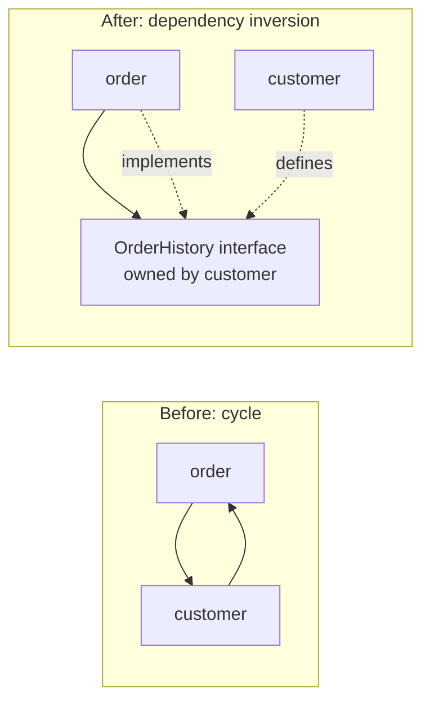
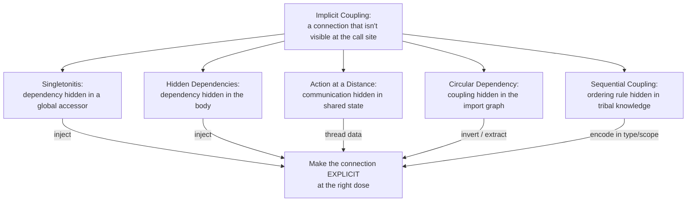

# Coupling & State Anti-Patterns — Middle Level

> **Category:** [Design Anti-Patterns](../README.md) → **Coupling & State** — *modules that know or share too much.*
> **Covers (collectively):** Singletonitis · Circular Dependency · Action at a Distance · Hidden Dependencies · Sequential Coupling

---

## Table of Contents

1. [Introduction](#introduction)
2. [Prerequisites](#prerequisites)
3. [The Real Question: When Does This Creep In?](#the-real-question-when-does-this-creep-in)
4. [Singletonitis — From Global to Injected](#singletonitis--from-global-to-injected)
5. [Circular Dependency — Breaking the Cycle Without Merging](#circular-dependency--breaking-the-cycle-without-merging)
6. [Action at a Distance — Making State Explicit](#action-at-a-distance--making-state-explicit)
7. [Hidden Dependencies — Honest Signatures](#hidden-dependencies--honest-signatures)
8. [Sequential Coupling — Encoding Order in the Type](#sequential-coupling--encoding-order-in-the-type)
9. [The Common Force: Implicit Coupling](#the-common-force-implicit-coupling)
10. [Catching Coupling Problems in Review](#catching-coupling-problems-in-review)
11. [Tooling: Letting Machines Find the Coupling](#tooling-letting-machines-find-the-coupling)
12. [Common Mistakes](#common-mistakes)
13. [Test Yourself](#test-yourself)
14. [Cheat Sheet](#cheat-sheet)
15. [Summary](#summary)
16. [Further Reading](#further-reading)
17. [Related Topics](#related-topics)

---

## Introduction

> Focus: **When does this creep in?** and **What do I do instead — without over-correcting?**

At the junior level you learned to *recognize* these five shapes: the global singleton, the import cycle, the spooky state mutation, the lying signature, the call sequence that must be exactly right. The middle-level skill is sharper and more practical: knowing **the force that produces each one** (it always feels reasonable at the time), the **specific countermove**, and — most important — **the trap waiting inside the fix**.

Because every one of these anti-patterns has a textbook cure that, applied without judgment, produces a *new* anti-pattern:

- "Use Dependency Injection" → an over-engineered container nobody understands, or a constructor with eleven parameters.
- "Break the cycle" → two modules merged into one God Object, or an interface introduced for no reason but the cycle.
- "Make state explicit" → a parameter explosion that threads the same eight values through twenty functions.
- "Pass dependencies in" → the same explosion, now in constructors.
- "Encode call order in a type" → a hand-rolled state machine for a two-step process.

This file is about walking that line: applying the real cure at the right dose.

---

## Prerequisites

- **Required:** Comfortable with [`junior.md`](junior.md) — you can identify all five anti-patterns from a snippet.
- **Required:** You've debugged at least one bug whose cause was "something else changed this state" — the lived experience of Action at a Distance.
- **Helpful:** Working knowledge of [Dependency Injection](dependency-injection) as a *principle* (pass collaborators in), independent of any framework.
- **Helpful:** You know how your language resolves imports/packages (Go packages, Java packages, Python modules) — circular dependency is a property of that graph.
- **Helpful:** Familiarity with the sibling category [OO Misuse](../01-oo-misuse/middle.md) — Flag Arguments and Magic Container often travel with these.

---

## The Real Question: When Does This Creep In?

None of these are designed on purpose. Each has a specific trigger — a moment where the cheap move wins:

| Trigger | What happens | Which anti-pattern |
|---|---|---|
| **"I need the logger/config/DB here too"** | Reach for a global accessor instead of threading a dependency | Singletonitis |
| **"These two modules are obviously related"** | A imports B for one helper; later B needs one thing from A | Circular Dependency |
| **"It's easier to just set the flag and let the other code read it"** | Communicate through shared mutable state instead of arguments | Action at a Distance |
| **"It already works, I'll just call `os.Getenv` right here"** | A function reads a global/env/clock/file without saying so | Hidden Dependencies |
| **"You have to call `init()` first — everyone knows that"** | Correct usage lives in tribal knowledge, not the type | Sequential Coupling |

The common thread: **implicit coupling is cheaper to write and far more expensive to live with.** The connection is invisible at the call site, so it survives review, then surfaces months later as a flaky test, a spooky bug, or a refactor that can't proceed. The middle engineer pays the small explicitness cost up front.

---

## Singletonitis — From Global to Injected

### The force behind it

Some things genuinely feel global: there's *one* logger, *one* config, *one* database pool. The singleton makes them reachable from anywhere with zero plumbing — `Logger.getInstance()`, `db.session`, `Config.current`. The cost is invisible until you write the first test and discover you can't substitute a fake, can't run two cases in parallel, and can't tell from a class's signature what it actually touches.

```java
// Singletonitis: the dependency is hidden inside the method body.
class OrderService {
    void place(Order o) {
        Database.getInstance().save(o);          // global reach-in
        Logger.getInstance().info("placed " + o);// another one
        if (Config.getInstance().get("fraud.enabled")) { ... }
    }
}
// Untestable without a real DB; can't swap config per test; reads like it needs nothing.
```

### The countermove: inject the collaborators

Pass dependencies through the constructor. Now the signature tells the truth, tests inject fakes, and there's exactly one place the wiring lives.

```java
class OrderService {
    private final Database db;
    private final Logger log;
    private final Config config;

    OrderService(Database db, Logger log, Config config) {  // honest
        this.db = db; this.log = log; this.config = config;
    }
    void place(Order o) {
        db.save(o);
        log.info("placed " + o);
        if (config.bool("fraud.enabled")) { ... }
    }
}
```

### The trap in the fix

**Trap 1 — the over-engineered container.** "Use DI" does *not* mean "add a reflection-based IoC framework with XML/annotation magic." For most code, **manual constructor wiring in `main()` (the composition root)** is clearer, faster, and fully testable. Reach for a container only when wiring genuinely sprawls, and even then prefer one that's explicit.

```go
// Go: the entire "DI framework" is main(). No container needed.
func main() {
    db := db.New(cfg.DSN)
    log := logging.New(cfg.Level)
    svc := order.NewService(db, log, cfg)   // wired once, explicitly
    server.Run(svc)
}
```

**Trap 2 — over-injection.** If a constructor grows to eight parameters, you didn't cure Singletonitis — you relocated a God Object. A bloated constructor is a *smell that the class has too many responsibilities*, not a sign you need a container. Split the class (see [God Object](../../01-development/01-bad-structure/middle.md)) before you blame the wiring.

**When a true singleton is fine.** A genuinely process-wide, stateless resource (a metrics registry, a connection pool) *can* be a singleton — but still **inject it through an interface** so tests can substitute it. The anti-pattern is *Singletonitis* (singletons for everything), not the occasional, deliberate singleton.

---

## Circular Dependency — Breaking the Cycle Without Merging

### The force behind it

`order` imports `customer` to look up the buyer. Later, `customer` needs "last order date," so it imports `order`. Each step is local and reasonable. Now the two compile as a unit, can't be understood in isolation, can't be tested separately, and in Go won't even build.



### The countermove: there are three, pick by *why* the cycle exists

**1. Dependency inversion via an interface.** If `customer` only needs a *behavior* from `order`, let `customer` declare an interface for that behavior and have `order` implement it. The arrow now points one way.

```go
// package customer — owns the abstraction it needs.
package customer

type OrderHistory interface {
    LastOrderDate(customerID string) (time.Time, error)
}

type Service struct{ history OrderHistory }   // depends on the interface, not on package order

func NewService(h OrderHistory) *Service { return &Service{history: h} }
```

```go
// package order — implements it; imports customer is now one-directional and fine.
package order

func (s *Store) LastOrderDate(id string) (time.Time, error) { ... }
```

**2. Extract a shared third module.** If both modules depend on the *same data type* (e.g. both need `Money` or `CustomerID`), the cycle means a shared concept is living in the wrong place. Pull it into a third, dependency-free module both import.

```python
# domain/types.py  — no imports of order or customer
@dataclass(frozen=True)
class CustomerId:
    value: str

# order.py    →  from domain.types import CustomerId
# customer.py →  from domain.types import CustomerId   (cycle gone)
```

**3. Move the misplaced function.** Sometimes the cycle is one method on the wrong side. If `customer.lastOrderDate()` really belongs to `order`, move it. No interface, no new module — just put the code where its data lives.

### The trap in the fix

**Trap 1 — merging the two modules.** The laziest "fix" is to delete the boundary: put `order` and `customer` in one package so there's no edge to be circular. This trades a cycle for a [God Object / God Package](../../01-development/01-bad-structure/middle.md). You lost the boundary you actually wanted.

**Trap 2 — an interface for the sake of the interface.** Introducing an interface to break a cycle is right *when there's a genuine behavioral seam*. But if the two modules are truly one concept artificially split, the honest fix is option 3 (move the code) — not a ceremonial interface that re-creates the coupling with extra indirection. Ask: *is this interface a real abstraction, or just a hole I poked to dodge the import?*

> **Heuristic:** behavioral need → invert with an interface; shared data type → extract a third module; misplaced code → just move it. Reach for "merge" only when the two were never really separate to begin with.

---

## Action at a Distance — Making State Explicit

### The force behind it

It's *easier* to set a field and let other code read it than to thread a value through three function calls. So `parse()` stashes a result in a global, `validate()` reads and mutates it, `persist()` reads it again. Each function "works." Then someone reorders them, or a second request mutates the same global, and you get a bug with no visible cause — the spooky action.

```python
# Action at a Distance: functions communicate through module-level state.
_current = {}                       # shared mutable state

def parse(raw):     _current["data"] = json.loads(raw)
def validate():     _current["ok"] = "id" in _current["data"]   # reads what parse set
def persist():      db.save(_current["data"])                   # depends on both, invisibly
```

### The countermove: thread data through, return results out

Make the dependency a value that flows: each step takes input and returns output. The order becomes visible *in the code*, and concurrent calls can't collide because there's no shared mutable state.

```python
def parse(raw):                 return json.loads(raw)
def validate(data):             return data if "id" in data else _reject(data)
def persist(data):              db.save(data)

def handle(raw):                              # order is now explicit and obvious
    return persist(validate(parse(raw)))
```

For state that legitimately spans calls, **wrap it in an object** so mutation goes through methods that enforce invariants, instead of a free-for-all global.

### The trap in the fix

**Parameter explosion.** The naive way to "make state explicit" is to add every shared value to every signature — and suddenly eight functions each take the same eight parameters, threaded through by hand. That's its own anti-pattern (the cure became as opaque as the disease).

The fix: **bundle cohesive state into a context/request object** and pass *that*. One parameter, named fields, type-checked.

```go
// Instead of threading (userID, traceID, deadline, tenant, ...) through everything:
type RequestCtx struct {
    UserID   string
    TraceID  string
    Deadline time.Time
    Tenant   string
}
func handle(ctx RequestCtx, raw []byte) error { ... }   // one explicit, cohesive parameter
```

> **Calibration:** explicit ≠ flat. The goal is *one cohesive, named, immutable-where-possible value* flowing through the call chain — not a global, and not a parameter list a mile long. Prefer [immutability](../../../clean-code/14-immutability/) so a passed-in value can't be mutated behind your back.

---

## Hidden Dependencies — Honest Signatures

### The force behind it

Hidden Dependencies are Singletonitis's quieter cousin: a function reaches out to a global, an environment variable, the system clock, the filesystem, or "now" — and **its signature says nothing about it.** It's the path of least resistance: `os.Getenv("API_KEY")` right where you need it is one line; plumbing it in is several.

```python
# The signature is a lie: "give me a user_id, I'll give you a charge."
# Truth: it also needs STRIPE_KEY, the wall clock, and a global db handle.
def charge(user_id, amount):
    key = os.environ["STRIPE_KEY"]          # hidden: env
    now = datetime.now()                    # hidden: clock (untestable)
    db.execute("INSERT ...", now)           # hidden: global db
    return stripe.charge(key, amount)
```

This is what makes a test say "works on my machine": the hidden inputs differ between environments, and you can't control `now()` to test the "charge expired" branch.

### The countermove: name what you need

Promote every hidden input to an explicit parameter or injected collaborator. The signature becomes a complete, honest contract.

```python
def charge(user_id, amount, *, api_key, clock, db):
    now = clock.now()                       # injectable → tests pin a fixed time
    db.execute("INSERT ...", now)
    return stripe.charge(api_key, amount)
```

The two highest-value targets to make explicit:
- **The clock.** `time.now()` is a hidden dependency that makes time-based logic untestable. Inject a `Clock` interface; production passes the real one, tests pass a fixed instant. (Same pattern as the `Clock` seam in [Bad Structure](../../01-development/01-bad-structure/middle.md).)
- **Config / secrets.** Read env once at the [composition root](secrets-management) and pass values down — don't sprinkle `getenv` through the codebase.

### The trap in the fix

Same as Singletonitis: **don't over-inject.** If making dependencies honest balloons a signature to ten parameters, the function is doing too much — decompose it. And don't swing to passing a giant "god config" object so every function *technically* receives everything; that's just a Magic Container ([OO Misuse](../01-oo-misuse/middle.md)) wearing a parameter's clothes. Pass *only what each function uses*.

> **Litmus test:** can you fully exercise this function in a unit test without touching the network, the disk, the clock, or an env var? If not, it has a hidden dependency — find it and lift it into the signature.

---

## Sequential Coupling — Encoding Order in the Type

### The force behind it

An object has a required protocol: `open()` → `read()` → `close()`; `connect()` before `send()`; `builder.setX()` before `build()`. Nothing in the *type* enforces it — the rule lives in a doc comment or a teammate's head. Call them out of order and you get a null pointer, a corrupt write, or silent garbage. New team members rediscover the rule by breaking it.

```java
// Sequential Coupling: nothing stops you from misusing this.
Report r = new Report();
r.addRow(data);        // oops — addHeader() was required first; silently wrong output
r.addHeader("Q3");
String out = r.build(); // or call build() twice? who knows
```

### The countermove: make illegal order *unrepresentable*

Use the type system so the bad sequence won't compile — or, for resource lifecycles, use the language's scoping construct so cleanup can't be forgotten.

**Type-state via the builder / staged API.** Each stage returns the type that exposes only the *next* legal operation.

```java
// You literally cannot call addRow before addHeader: the types forbid it.
ReportBuilder.start()          // returns NeedsHeader
    .header("Q3")              // returns NeedsRows
    .row(data)                 // returns NeedsRows
    .build();                  // returns Report
```

**Resource lifecycle → scoping construct.** When the order is "acquire then always release," let the language enforce release. This is the real cure for the `open/close` family — pairing is structural, not remembered.

```python
# Python: the `with` block guarantees __exit__/close runs, in order, even on exception.
with open("data.csv") as f:        # open → use → close, enforced by scope
    process(f)
```

```go
// Go: defer pins the cleanup to the acquisition, right next to it.
f, err := os.Open("data.csv")
if err != nil { return err }
defer f.Close()                    // can't forget; runs in LIFO order on return
process(f)
```

**Runtime state machine (when compile-time typing is impractical).** Track the current state in a field and reject illegal transitions loudly, so misuse fails fast and visibly instead of silently corrupting.

```python
class Connection:
    def __init__(self): self._state = "closed"
    def open(self):
        if self._state != "closed": raise RuntimeError("already open")
        self._state = "open"
    def send(self, msg):
        if self._state != "open": raise RuntimeError("send before open")  # fail loud, not silent
        ...
```

### The trap in the fix

**Over-formalizing.** A full type-state builder or a hand-rolled state machine is *overkill for a two-step protocol.* If the only rule is "call `close()` when done," the answer is `defer`/`with`/try-with-resources — not a class hierarchy of marker types. Match the machinery to the protocol's real complexity:

| Protocol shape | Right-sized cure |
|---|---|
| Acquire → release (one pair) | `defer` / `with` / try-with-resources |
| A few fixed steps, must be in order | Staged builder (type-state) |
| Genuine multi-state lifecycle with branches | State machine (runtime checks or [State pattern](../../../design-patterns/03-behavioral/README.md)) |

> The point is *removing the chance to call things in the wrong order*, by the cheapest means that actually removes it — not maximizing ceremony.

---

## The Common Force: Implicit Coupling

Step back and these five are one disease with five faces: **a connection exists but isn't visible at the point of use.**



The universal cure is *make the connection explicit*: a parameter, a return value, a one-directional import, a type that won't let you misuse it. The universal **anti-cure** is making it explicit *clumsily*: a container nobody understands, a merge that destroys the boundary, a parameter list a mile long, a state machine for a two-step task. Middle-level skill is the *dose*.

---

## Catching Coupling Problems in Review

Coupling is cheap to fix in review and expensive later. Reviewer questions that surface it:

- **"What does this function actually need?"** If the body reaches for globals/env/clock that the signature doesn't mention → Hidden Dependencies.
- **"Can I unit-test this without the network, disk, clock, or a real DB?"** No → Singletonitis or Hidden Dependencies.
- **"Does this new import create a cycle?"** Check the package graph; one new edge can close a loop.
- **"What happens if I call these methods in a different order?"** "It breaks / silently misbehaves" → Sequential Coupling; ask to encode the order in the type or use a scope.
- **"Where is this field set, and who else reads it?"** Many writers + many readers of mutable shared state → Action at a Distance.

And watch the *over-corrections* just as carefully:
- A constructor/signature that grew past ~4–5 parameters → over-injection or parameter explosion; the class/function likely does too much.
- A new interface with exactly one implementation introduced "to break a cycle" → confirm it's a real seam, not ceremony.

---

## Tooling: Letting Machines Find the Coupling

Some of this is mechanically detectable — let tools do the scanning so review can focus on judgment.

| Problem | Tooling | What it flags |
|---|---|---|
| **Circular dependency** | `go build` (errors outright); `import-linter` (Python); ArchUnit / `jdeps` (Java); `madge --circular` (JS/TS) | Cycles in the package/module graph |
| **Hidden global/env reads** | grep for `getenv`/`getInstance`/`datetime.now`/`time.Now` outside the composition root | Reach-ins that should be injected |
| **Untestable code** | Low unit-test coverage on a class that needs heavy setup | Often a symptom of hidden deps |
| **Sequential misuse** | Type-state encoding (compiler), or runtime asserts that fail fast | Out-of-order calls |
| **Over-injection** | Lint rules / review on constructor arity | Constructors with too many params |

```bash
# Python: declare allowed dependencies and fail the build on a cycle.
# (import-linter, configured with a "no cycles" contract)
lint-imports

# Java: assert architectural rules, including acyclic packages.
# ArchUnit test:  noClasses().should().dependOnCyclicPackages()
```

```bash
# Go: a cycle is a hard compile error — the build is your linter.
go build ./...   # "import cycle not allowed"
```

> Tools find the *structural* anti-patterns (cycles, reach-ins) reliably. They can't judge over-correction — only a human notices that the cycle was "fixed" by merging two modules into one.

---

## Common Mistakes

1. **Equating "Dependency Injection" with "a DI container."** DI is the *principle* of passing collaborators in. Manual wiring in `main()` is DI and is usually the right amount. Adopting a reflection-heavy container to inject two things is the cure becoming the disease.
2. **Curing Singletonitis by over-injecting.** Swapping `getInstance()` calls for an eleven-parameter constructor doesn't fix coupling — it reveals a God Object. Split the class.
3. **Breaking a cycle by merging the two modules.** You traded a cycle for a God Package and threw away the boundary you wanted. Invert with an interface or extract a shared type instead.
4. **Introducing a ceremonial interface.** An interface with one impl, created only to dodge an import, re-adds the coupling with extra indirection. Move the misplaced code instead, if there's no real seam.
5. **"Making state explicit" by threading 8 params through 20 functions.** Bundle cohesive state into a context/request object; one named parameter beats a parameter avalanche.
6. **Leaving the clock hidden.** `now()` buried in a method makes every time-dependent branch untestable. Inject a clock — it's the single highest-ROI dependency to make explicit.
7. **Building a state machine for a two-step protocol.** For acquire/release, use `defer`/`with`/try-with-resources. Reserve real state machines for genuinely multi-state lifecycles.

---

## Test Yourself

1. Your service calls `Logger.getInstance()`, `Config.getInstance()`, and `Db.getInstance()` inside its methods. Name the anti-pattern, the standard cure, and the *two* traps you must avoid while applying it.
2. `package billing` imports `package account`, and you now need `account` to call one function in `billing`. List three distinct ways to remove the resulting cycle and the signal that tells you which to pick.
3. A function `sendEmail(to, subject)` works in production but is impossible to unit-test deterministically. Without seeing the body, name two hidden dependencies it most likely has and how you'd lift them.
4. You decide to "make state explicit" and end up adding `(userId, traceId, tenant, deadline)` to fifteen function signatures. What did you do wrong, and what's the fix?
5. A `FileWriter` requires `open()` then `write()` then `close()`, enforced only by a comment. Give the right-sized cure for (a) just guaranteeing `close()` runs, and (b) forbidding `write()` before `open()` at compile time.
6. When is a singleton actually acceptable, and how do you keep it testable anyway?

<details>
<summary>Answers</summary>

1. **Singletonitis.** Cure: inject the logger/config/db through the constructor (Dependency Injection). Trap 1 — don't reach for a heavyweight IoC *container*; manual wiring in `main()`/the composition root is enough. Trap 2 — don't over-inject; if the constructor balloons, the class has too many responsibilities (a God Object), so split it rather than blaming the wiring.
2. (a) **Dependency inversion** — `account` declares an interface for the behavior it needs and `billing` implements it (pick this when `account` needs a *behavior*); (b) **extract a shared third module** for a type both need (pick this when both depend on the same *data type*); (c) **move the misplaced function** to the side where its data lives (pick this when it's just one method on the wrong side). Avoid merging the two packages — that destroys the boundary.
3. Likely hidden deps: the **SMTP client / API key** (read from a global or env) and the **clock** (timestamps), possibly a global connection. Lift them into the signature / inject them (`smtp`, `apiKey`, `clock`), so a test can pass fakes and a fixed time and assert on output without sending mail.
4. **Parameter explosion** — you cured Action at a Distance with an equally opaque signature flood. Fix: bundle the cohesive values into a single `RequestCtx`/context object and pass that one named parameter; prefer it immutable.
5. (a) Use the language scope: `with` (Python) / `defer f.Close()` (Go) / try-with-resources (Java) so `close()` can't be forgotten. (b) Use a **staged builder / type-state API** where `open()` returns a type whose only method is `write()`, so calling `write()` first won't compile. A full state machine is overkill for this.
6. When the resource is genuinely process-wide and you've decided so deliberately (e.g. a metrics registry, a connection pool) — not "for everything." Keep it testable by accessing it **through an injected interface** so tests can substitute a fake, rather than calling `getInstance()` directly in business code.

</details>

---

## Cheat Sheet

| Anti-pattern | Creeps in when… | Countermove | Trap in the fix |
|---|---|---|---|
| **Singletonitis** | "I need the logger/config/db here too" | Inject collaborators (DI principle) | No heavyweight container; don't over-inject (→ God Object) |
| **Circular Dependency** | Two related modules each grab one thing from the other | Invert with interface / extract third module / move code | Don't merge them (→ God Package) or add a ceremonial interface |
| **Action at a Distance** | "Easier to set a field and let others read it" | Thread data in/out; bundle cohesive state | Don't explode every signature; use a context object |
| **Hidden Dependencies** | "I'll just call `getenv`/`now()` right here" | Promote hidden inputs to explicit params; inject the clock | Don't over-inject or pass a god-config object |
| **Sequential Coupling** | "Call `init()` first — everyone knows that" | Encode order in the type; `defer`/`with` for lifecycles | Don't build a state machine for a two-step protocol |

**Two golden rules:**
- *Make the connection explicit — at the call site, in the signature, in the type.*
- *Apply the cure at the right dose: explicit, not clumsy; a container, a merge, a parameter flood, and a needless state machine are the cure overshooting.*

---

## Summary

- All five anti-patterns are one disease — **implicit coupling**: a connection that exists but isn't visible where it's used. Each creeps in because the implicit version is one line cheaper to write.
- **Singletonitis** → inject collaborators; but DI means *passing things in*, not adopting a heavyweight container, and a bloated constructor means split the class, not add magic.
- **Circular Dependency** → invert with an interface (behavioral need), extract a shared third module (shared data type), or just move the misplaced code; never "fix" it by merging the two modules.
- **Action at a Distance** → thread data through as values; avoid the parameter explosion by bundling cohesive state into a context object, ideally immutable.
- **Hidden Dependencies** → promote every hidden input (especially the **clock** and **config/secrets**) into the signature so the contract is honest and the code is unit-testable; don't over-inject in the process.
- **Sequential Coupling** → make illegal order unrepresentable via a staged/type-state API, or use `defer`/`with`/try-with-resources for resource lifecycles; reserve full state machines for genuinely multi-state lifecycles.
- The recurring middle-level skill is **dose**: the textbook cure, applied without judgment, becomes the next anti-pattern.
- Next: [`senior.md`](senior.md) — detecting and migrating these at scale, the architectural forces (layering, module boundaries, lifecycle ownership) that breed them, and testability/observability impact.

---

## Further Reading

- **Dependency Injection: Principles, Practices, and Patterns** — Seemann & van Deursen (2019) — composition root, why containers are optional, the difference between DI and a DI container.
- **Working Effectively with Legacy Code** — Michael Feathers (2004) — breaking dependencies, seams, sensing/separation, getting hidden-dependency code under test.
- **Clean Code** — Robert C. Martin (2008) — function arguments, SRP, and the cost of hidden state.
- **The Pragmatic Programmer** — Hunt & Thomas (20th anniv. ed., 2019) — orthogonality, decoupling, "tell, don't ask," and avoiding global state.
- **Effective Java** — Joshua Bloch (3rd ed., 2018) — Items on dependency injection over hardwired resources, builders, and minimizing mutability.

---

## Related Topics

- [`junior.md`](junior.md) — recognizing all five anti-patterns from a snippet.
- [OO Misuse](../01-oo-misuse/middle.md) — sibling category; Flag Arguments and Magic Container often co-occur with hidden state.
- [Abstraction Failures](../03-abstraction-failures/middle.md) — sibling category; over-injection and ceremonial interfaces brush against Premature Abstraction.
- [Bad Structure](../../01-development/01-bad-structure/middle.md) — God Object is what over-injection reveals; the `Clock` seam appears there too.
- [Clean Code → Immutability](../../../clean-code/14-immutability/) — immutable values are the antidote to Action at a Distance.
- [Design Patterns → Behavioral (State)](../../../design-patterns/03-behavioral/README.md) — the positive counterpart for genuine multi-state lifecycles.
