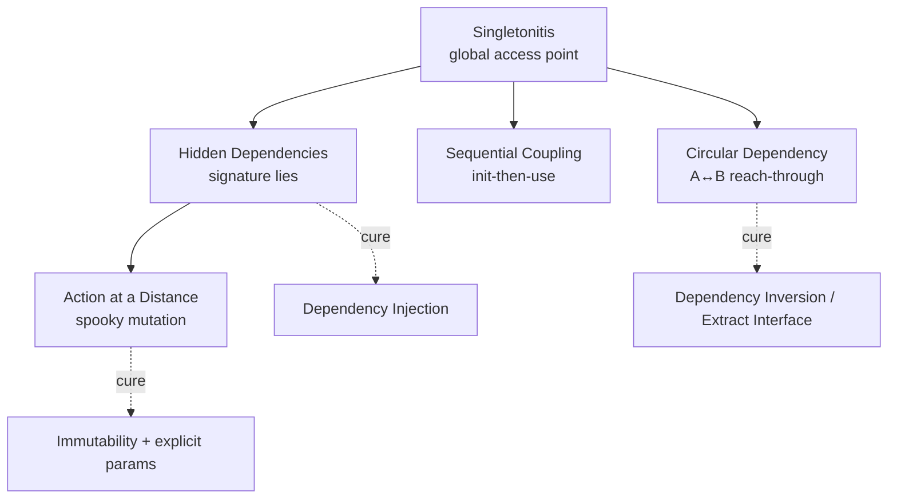
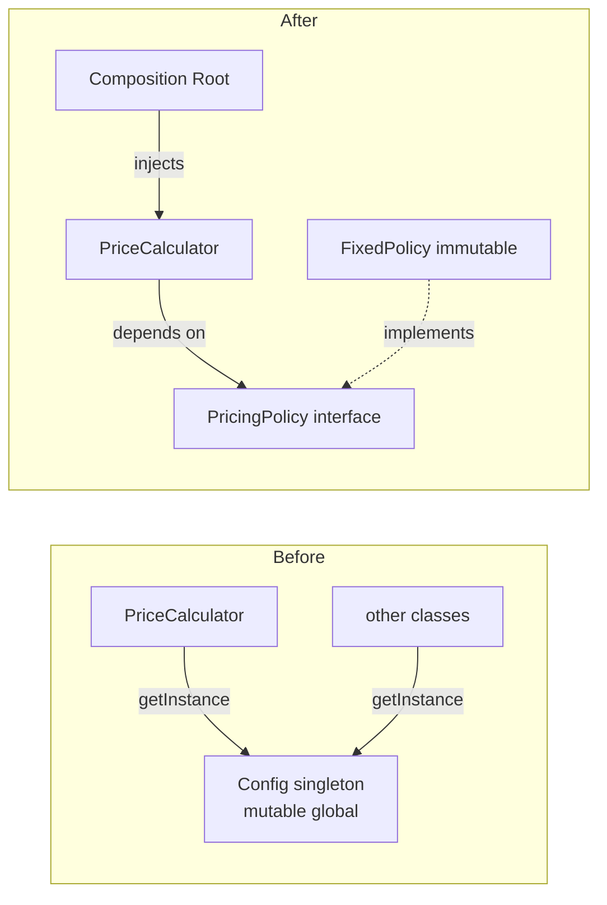
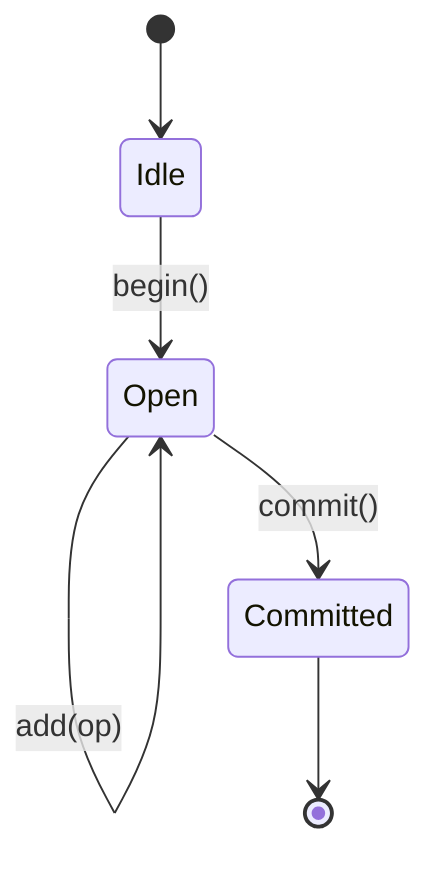
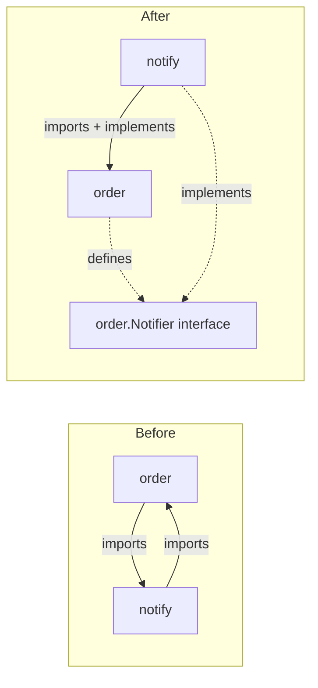
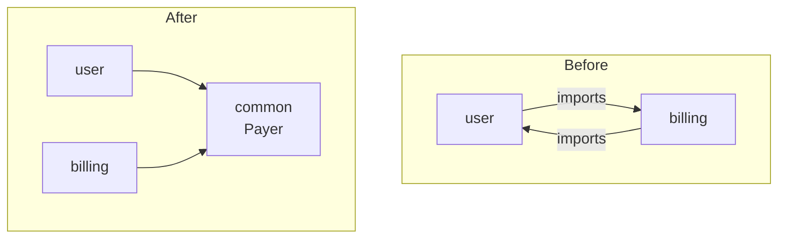
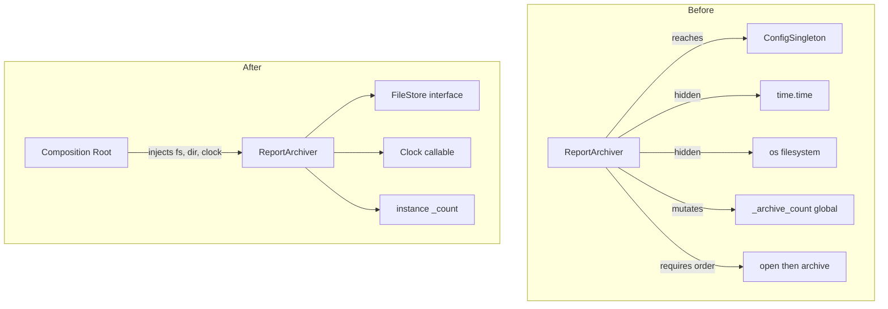

# Coupling & State Anti-Patterns — Refactoring Practice

> **Category:** [Design Anti-Patterns](../README.md) → **Coupling & State** — *modules that know or share too much.*
> **Covers (collectively):** Singletonitis · Circular Dependency · Action at a Distance · Hidden Dependencies · Sequential Coupling

---

These are not "spot the smell" puzzles — [`find-bug.md`](find-bug.md) does that. Here the code is **coupled but already working**, and your job is to **decouple it without changing behavior**. The skill on display is the *process*, not just the destination:

1. **Pin behavior first.** Write a *characterization test* that records what the code does *now*. With coupling anti-patterns this test is often the hard part — global state, hidden clocks, and shared singletons are exactly what makes code untestable, so your first refactoring move is frequently *"make it testable at all."*
2. **Take small, reversible steps.** One named refactoring at a time (Extract Interface, Introduce Parameter, Inject Dependency), tests green after each, commit.
3. **Separate structural from behavioral commits.** A decoupling refactor must preserve behavior; if a test goes red, the last step is the culprit — revert it.

Each worked solution names the **canonical refactoring moves** (Fowler's *Refactoring*, Feathers' *Working Effectively with Legacy Code*) and the **principle** it serves (Dependency Inversion, Dependency Injection, encapsulation, immutability) so you build the vocabulary, not just the instinct.

> **How to use this file:** read the "Before" code, write down the move sequence *yourself* before expanding the solution, then compare. The gap between your plan and the worked plan is where the learning is.

---

## Table of Contents

| # | Exercise | Anti-pattern(s) | Lang | Key moves |
|---|---|---|---|---|
| 1 | [Inject the logger singleton](#exercise-1--inject-the-logger-singleton) | Singletonitis | Go | Introduce Parameter, Dependency Injection |
| 2 | [Make the clock explicit](#exercise-2--make-the-clock-explicit) | Hidden Dependencies | Python | Introduce Parameter, Inject Clock |
| 3 | [Read the environment once, at the edge](#exercise-3--read-the-environment-once-at-the-edge) | Hidden Dependencies | Java | Parameterize Constructor, Config Object |
| 4 | [Replace the config singleton with DI](#exercise-4--replace-the-config-singleton-with-di) | Singletonitis | Java | Dependency Inversion, Constructor Injection |
| 5 | [Encapsulate the global counter](#exercise-5--encapsulate-the-global-counter) | Action at a Distance | Python | Encapsulate Variable, Return-Value Threading |
| 6 | [Freeze the shared mutable config](#exercise-6--freeze-the-shared-mutable-config) | Action at a Distance | Go | Replace Mutable with Immutable, Copy-on-Read |
| 7 | [Inject the filesystem](#exercise-7--inject-the-filesystem) | Hidden Dependencies | Go | Extract Interface, Inject Collaborator |
| 8 | [Encapsulate temporal coupling with a Builder](#exercise-8--encapsulate-temporal-coupling-with-a-builder) | Sequential Coupling | Java | Replace Constructor with Builder |
| 9 | [RAII / `defer` the open-use-close dance](#exercise-9--raii--defer-the-open-use-close-dance) | Sequential Coupling | Go | Replace Temporal Coupling with Scoped Resource |
| 10 | [Encode the protocol as a state machine](#exercise-10--encode-the-protocol-as-a-state-machine) | Sequential Coupling | Python | Replace Order-Dependence with Type States |
| 11 | [Break the circular dependency (Extract Interface)](#exercise-11--break-the-circular-dependency-extract-interface) | Circular Dependency | Go | Dependency Inversion, Extract Interface |
| 12 | [Break the cycle by introducing a third module](#exercise-12--break-the-cycle-by-introducing-a-third-module) | Circular Dependency | Java | Extract Mediator, Move Shared Type |
| 13 | [The full combo decoupling](#exercise-13--the-full-combo-decoupling) | All five | Python | The whole toolbox, in order |

---

## Why these five are one topic

Coupling & State anti-patterns are a *causal chain*, not five unrelated mistakes. A global Singleton (**Singletonitis**) becomes a **Hidden Dependency** the moment a function reaches for it without declaring it; that hidden, mutable global then enables **Action at a Distance** when one call site silently changes another's behavior; and a stateful global that must be *initialized then used* introduces **Sequential Coupling**. **Circular Dependency** is the structural cousin — two modules that each reach into the other instead of depending on an abstraction.



The cures cluster too: **make dependencies explicit and inject them** dissolves Singletonitis, Hidden Dependencies, and most Action at a Distance at once; **invert the dependency** breaks cycles; **make illegal states unrepresentable** (immutability, builders, type-states) kills the temporal varieties.

---

## Exercise 1 — Inject the logger singleton

**Anti-pattern:** Singletonitis. **Goal:** stop reaching for a global logger; receive it as a dependency. **Constraints:** preserve the function's output and the log lines it emits; callers may be updated.

```go
// Before — Logger is a package-global singleton; ChargeOrder reaches for it.
package billing

var Logger = log.New(os.Stdout, "", log.LstdFlags) // global access point

func ChargeOrder(o Order) (Receipt, error) {
	Logger.Printf("charging order %s for %d cents", o.ID, o.Cents)
	id, err := gateway.Charge(o.Card, o.Cents)
	if err != nil {
		Logger.Printf("charge failed for %s: %v", o.ID, err)
		return Receipt{}, err
	}
	return Receipt{OrderID: o.ID, ChargeID: id}, nil
}
```

<details>
<summary>Refactored</summary>

**Move sequence**

1. **Characterize.** This is the catch: you *can't* easily assert on a global `Logger` from a test. So the very first observation is that the singleton blocks testing — that's the symptom, and removing it is the cure. Write a test that injects a fake logger (a `bytes.Buffer`) and asserts both the returned `Receipt` and the captured log lines.
2. **Extract Interface.** Define the narrowest contract the function actually uses — `Printf`. A one-method `Logger` interface (`Printf(format string, args ...any)`) is enough; depend on the role, not on `*log.Logger`.
3. **Introduce Parameter** (Fowler) → **Dependency Injection.** Add `logger Logger` as the first parameter (or a field on a `Service` struct — preferred for many methods). The package-global stays temporarily as the *default* a caller can pass, so the change is incremental.
4. **Update call sites** to pass the logger; delete the package-global once nothing references it.

```go
// After — the dependency is explicit and injectable.
package billing

// Logger is the narrow role billing needs — not the whole *log.Logger.
type Logger interface {
	Printf(format string, args ...any)
}

type Service struct {
	log     Logger
	gateway Gateway
}

func NewService(log Logger, gateway Gateway) *Service {
	return &Service{log: log, gateway: gateway}
}

func (s *Service) ChargeOrder(o Order) (Receipt, error) {
	s.log.Printf("charging order %s for %d cents", o.ID, o.Cents)
	id, err := s.gateway.Charge(o.Card, o.Cents)
	if err != nil {
		s.log.Printf("charge failed for %s: %v", o.ID, err)
		return Receipt{}, err
	}
	return Receipt{OrderID: o.ID, ChargeID: id}, nil
}
```

**What improved & how to verify.** The signature no longer lies: every collaborator `ChargeOrder` uses is visible in `NewService`. The function is now testable in isolation with a fake logger and gateway — no global state, no `os.Stdout` capture. **Verify** with the characterization test: same `Receipt`, same error, same two log-line formats. `*log.Logger` already satisfies the new `Logger` interface, so production wiring (`NewService(log.Default(), realGateway)`) emits byte-identical lines. Keep the global-deletion in its own structural commit once `grep -rn "billing.Logger"` is clean.

> **When is a singleton acceptable?** A genuinely process-wide, stateless, immutable resource (a metrics registry, a connection pool) *can* be a singleton — but pass it in, don't reach for it. The anti-pattern is the *hidden global access*, not the single instance.

</details>

---

## Exercise 2 — Make the clock explicit

**Anti-pattern:** Hidden Dependencies. **Goal:** remove the hidden dependency on the system clock so the logic is deterministic and testable. **Constraints:** identical results for a given "now"; preserve the public behavior.

```python
# Before — token expiry reads the wall clock directly; untestable without sleeping.
import time

def is_token_valid(token):
    # hidden dependency: time.time() — the signature claims it only needs `token`
    return token.issued_at + token.ttl_seconds > time.time()

def issue_token(user, ttl_seconds=3600):
    return Token(user=user, issued_at=time.time(), ttl_seconds=ttl_seconds)
```

<details>
<summary>Refactored</summary>

**Move sequence**

1. **Characterize.** You cannot test expiry without controlling time. Today the only options are `time.sleep` (slow, flaky) or monkeypatching `time.time` (a test smell that confirms the hidden dependency). Note both as evidence.
2. **Introduce Parameter** (Fowler): add `now` as a parameter. Default it to `time.time()` so existing callers don't break — this keeps the move *behavior-preserving* and incremental.
3. **Inject a clock**, not a timestamp, where a class owns several time-dependent methods — a `Clock` callable (`Callable[[], float]`) injected once is cleaner than threading `now` through every signature.
4. Push the *one* real `time.time()` call to the edge (the caller / composition root). The core logic becomes a pure function of its inputs.

```python
# After — time is an explicit input; the core is pure and deterministic.
from dataclasses import dataclass
from typing import Callable

Clock = Callable[[], float]

def is_token_valid(token, now: float) -> bool:
    return token.issued_at + token.ttl_seconds > now

@dataclass
class TokenService:
    clock: Clock = __import__("time").time  # injected; defaults to wall clock at the edge

    def issue(self, user, ttl_seconds: int = 3600):
        return Token(user=user, issued_at=self.clock(), ttl_seconds=ttl_seconds)

    def valid(self, token) -> bool:
        return is_token_valid(token, self.clock())
```

```python
# Test — no sleeping, no monkeypatching globals:
svc = TokenService(clock=lambda: 1000.0)
tok = svc.issue("alice", ttl_seconds=60)        # issued_at = 1000.0
assert is_token_valid(tok, now=1059.0) is True   # 1 second before expiry
assert is_token_valid(tok, now=1061.0) is False  # 1 second after
```

**What improved & how to verify.** The dependency on the clock is now declared, not smuggled in. Expiry is a pure function — testable at any instant without sleeping or patching. **Verify**: for a fixed `now`, `is_token_valid` returns exactly what `time.time()` would have produced at that instant; production wiring (`TokenService()`) still reads the real clock at the edge, so observable behavior is unchanged. The same move applies to hidden dependencies on randomness (`random`), UUID generation, and "today's date."

</details>

---

## Exercise 3 — Read the environment once, at the edge

**Anti-pattern:** Hidden Dependencies. **Goal:** stop scattered `System.getenv` reads through the call tree; inject configuration. **Constraints:** same behavior for a given environment; the public method signature `send(msg)` stays.

```java
// Before — buried env reads; the class secretly depends on the process environment.
public class EmailSender {
    public void send(Message msg) {
        String host = System.getenv("SMTP_HOST");      // hidden
        int port    = Integer.parseInt(System.getenv("SMTP_PORT")); // hidden + can throw
        boolean tls = Boolean.parseBoolean(System.getenv("SMTP_TLS")); // hidden
        try (var client = new SmtpClient(host, port, tls)) {
            client.deliver(msg);
        }
    }
}
```

<details>
<summary>Refactored</summary>

**Move sequence**

1. **Characterize.** Testing this means mutating the *process environment* — JUnit can't do that cleanly, which is exactly the smell. Snapshot current behavior by setting env vars in a wrapper, then plan to remove that crutch.
2. **Introduce Parameter Object.** The three env values form one concept — `SmtpConfig` (an immutable record). Group them.
3. **Parameterize Constructor** (constructor injection): `EmailSender` receives a fully-resolved `SmtpConfig` instead of reading the environment. The class no longer knows env vars *exist*.
4. **Move the env reads to the composition root** — one `SmtpConfig.fromEnv()` factory at application startup. Parse-and-validate once, fail fast there, not deep inside `send`.

```java
// After — config is parsed once at the edge and injected as an immutable object.
public record SmtpConfig(String host, int port, boolean tls) {
    public static SmtpConfig fromEnv() {            // the ONLY env reader, at the edge
        return new SmtpConfig(
            require("SMTP_HOST"),
            Integer.parseInt(require("SMTP_PORT")),
            Boolean.parseBoolean(System.getenv("SMTP_TLS")));
    }
    private static String require(String key) {
        String v = System.getenv(key);
        if (v == null) throw new IllegalStateException("missing env: " + key);
        return v;
    }
}

public class EmailSender {
    private final SmtpConfig config;
    public EmailSender(SmtpConfig config) { this.config = config; } // injected

    public void send(Message msg) {
        try (var client = new SmtpClient(config.host(), config.port(), config.tls())) {
            client.deliver(msg);
        }
    }
}

// Composition root (main / DI container):
EmailSender sender = new EmailSender(SmtpConfig.fromEnv());
```

**What improved & how to verify.** `EmailSender` is now testable with `new EmailSender(new SmtpConfig("localhost", 1025, false))` — no environment manipulation, no flaky parse-on-every-call. Misconfiguration fails *once at startup* with a clear message, not on the first email at 3 a.m. **Verify**: for the same environment, `fromEnv()` produces the same `SmtpConfig` the old code derived, and `send` delivers identically (assert with a `SmtpClient` mock). Pushing I/O to the edge while keeping the core pure is the *Functional Core, Imperative Shell* shape.

</details>

---

## Exercise 4 — Replace the config singleton with DI

**Anti-pattern:** Singletonitis. **Goal:** eliminate a global `Config.getInstance()` reached from deep in the domain. **Constraints:** preserve `discountedPrice` results; the singleton must still work during the transition (incremental migration).

```java
// Before — every class reaches into the same mutable global.
public class Config {
    private static final Config INSTANCE = new Config();
    public static Config getInstance() { return INSTANCE; }
    private double discountRate = 0.10;
    public double getDiscountRate() { return discountRate; }
    public void setDiscountRate(double r) { this.discountRate = r; } // mutable global!
}

public class PriceCalculator {
    public double discountedPrice(double base) {
        double rate = Config.getInstance().getDiscountRate(); // hidden global access
        return base * (1 - rate);
    }
}
```

<details>
<summary>Refactored</summary>

**Move sequence**

1. **Characterize.** Snapshot `discountedPrice` for a few `(base, rate)` pairs. Note the test hazard: because `Config` is a *mutable* global, one test's `setDiscountRate` leaks into the next — tests are order-dependent. That fragility is the anti-pattern biting you.
2. **Extract Interface** (Dependency Inversion): define `PricingPolicy { double discountRate(); }`. `PriceCalculator` will depend on this abstraction, not the concrete `Config`.
3. **Constructor Injection.** `PriceCalculator` receives a `PricingPolicy`. Replace the `Config.getInstance()` reach with the injected field.
4. **Make the implementation immutable.** Replace the mutable singleton with an immutable `FixedPolicy(rate)` value. Construct it once at the composition root and inject it. Different rates ⇒ different *instances*, not a mutated global.
5. **Strangle the singleton.** Keep `getInstance()` as an adapter (`() -> INSTANCE.getDiscountRate()`) only until all call sites are migrated, then delete it.

```java
// After — depend on an abstraction; the concrete policy is immutable and injected.
public interface PricingPolicy {
    double discountRate();
}

public record FixedPolicy(double discountRate) implements PricingPolicy {} // immutable

public class PriceCalculator {
    private final PricingPolicy policy;
    public PriceCalculator(PricingPolicy policy) { this.policy = policy; } // injected

    public double discountedPrice(double base) {
        return base * (1 - policy.discountRate());
    }
}

// Composition root:
var calculator = new PriceCalculator(new FixedPolicy(0.10));
```



**What improved & how to verify.** `PriceCalculator` now depends on a role it can't mutate; tests construct it with any policy and run in isolation (no cross-test leakage). Swapping in a `TieredPolicy` later requires no edit to the calculator — Open/Closed via Dependency Inversion. **Verify**: `discountedPrice` matches the snapshot for every `(base, rate)`; production wiring injects the same `0.10` the singleton held. Note the **behavioral tightening**: configuration is now immutable, so the runtime `setDiscountRate` mutation is gone — confirm no production path relied on changing the rate mid-process; if one did, that becomes an explicit "rebuild the calculator with a new policy" call, documented separately.

</details>

---

## Exercise 5 — Encapsulate the global counter

**Anti-pattern:** Action at a Distance. **Goal:** stop one function silently changing another's result via a module global. **Constraints:** same generated IDs for the same call sequence; functions become independently reasoned-about.

```python
# Before — a module global mutated from multiple places; "spooky action at a distance".
_next_id = 0

def next_id():
    global _next_id
    _next_id += 1          # mutates shared state
    return _next_id

def reset_ids():
    global _next_id
    _next_id = 0           # a *distant* call that changes next_id()'s behavior

def make_user(name):
    return {"id": next_id(), "name": name}  # result depends on hidden global history
```

<details>
<summary>Refactored</summary>

**Move sequence**

1. **Characterize.** Snapshot a call sequence: `make_user("a"); make_user("b")` → ids 1, 2. Then note the spooky part — a *distant* `reset_ids()` (perhaps in another module's test setup) silently changes what `make_user` returns next. The bug surface is invisible at the call site.
2. **Encapsulate Variable** (Fowler): wrap the global in an object that *owns* the counter — `IdGenerator`. No code outside it can touch `_next_id`.
3. **Inject the generator** where IDs are produced (`make_user(name, ids)`), so the dependency is explicit and the "reset" is a method on a specific instance — its blast radius is now one object, not the whole module.
4. The global disappears; "action at a distance" becomes "method call on the object you hold."

```python
# After — state is encapsulated and injected; mutation is local and visible.
from dataclasses import dataclass, field

@dataclass
class IdGenerator:
    _next: int = 0
    def next(self) -> int:
        self._next += 1
        return self._next
    def reset(self) -> None:
        self._next = 0

def make_user(name: str, ids: IdGenerator) -> dict:
    return {"id": ids.next(), "name": name}   # dependency is explicit in the signature
```

```python
# Test — fully isolated; no shared module state to leak between tests:
ids = IdGenerator()
assert make_user("a", ids)["id"] == 1
assert make_user("b", ids)["id"] == 2
ids.reset()
assert make_user("c", ids)["id"] == 1   # reset's effect is local to *this* generator
```

**What improved & how to verify.** Two unrelated parts of the program can no longer collide through a shared global; each test (and each subsystem) gets its own generator. Mutation is still present but *encapsulated and local* — you can see exactly who can change the counter (anyone holding that instance). **Verify**: the same call sequence yields the same ids. The key behavioral nuance — previously *all* callers shared one counter; now they share one only if you pass them the same instance. If global uniqueness across the whole process was the contract, inject a single shared `IdGenerator` from the composition root (one instance, explicitly passed) rather than re-creating the global.

</details>

---

## Exercise 6 — Freeze the shared mutable config

**Anti-pattern:** Action at a Distance. **Goal:** prevent one goroutine/handler from mutating a struct another is reading. **Constraints:** readers see the same values; eliminate the data race and the spooky mutation.

```go
// Before — a shared *Settings is handed out and mutated in place.
type Settings struct {
	MaxRetries int
	Timeout    time.Duration
	Endpoints  []string
}

var shared = &Settings{MaxRetries: 3, Timeout: 5 * time.Second, Endpoints: []string{"a", "b"}}

func GetSettings() *Settings { return shared } // hands out the shared pointer

// somewhere far away, in another request handler:
func tuneForBatch() {
	s := GetSettings()
	s.MaxRetries = 10          // mutates everyone's settings — action at a distance
	s.Endpoints = append(s.Endpoints, "c")
}
```

<details>
<summary>Refactored</summary>

**Move sequence**

1. **Characterize.** A test that reads `MaxRetries`, calls `tuneForBatch()`, then reads again — proving the distant mutation leaks. (Under `-race`, this also flags a data race when handlers run concurrently.)
2. **Replace Mutable Shared State with an Immutable Value.** Hand out a *copy by value*, not a pointer. `Settings` becomes a value type; `Endpoints` (a slice = shared backing array) is defensively copied so callers can't mutate through it.
3. **Replace in-place mutation with a "derive a new value" method.** `tuneForBatch` no longer edits the global; it produces a *modified copy* it uses locally (a `With…` builder-style transform).
4. The "set the global" capability is removed entirely; configuration is read-only after construction.

```go
// After — immutable value; callers get copies; changes produce new values.
type Settings struct {
	MaxRetries int
	Timeout    time.Duration
	endpoints  []string // unexported: nobody can mutate the backing array directly
}

func (s Settings) Endpoints() []string {
	out := make([]string, len(s.endpoints)) // defensive copy on read
	copy(out, s.endpoints)
	return out
}

// WithMaxRetries returns a NEW Settings; the receiver is value-copied, so the
// original is untouched. This is the immutable "wither" pattern.
func (s Settings) WithMaxRetries(n int) Settings {
	s.MaxRetries = n
	return s
}

var defaults = Settings{MaxRetries: 3, Timeout: 5 * time.Second, endpoints: []string{"a", "b"}}

func GetSettings() Settings { return defaults } // returns a value copy, not a pointer

// far-away code now derives a local value instead of mutating the global:
func tuneForBatch() Settings {
	return GetSettings().WithMaxRetries(10)
}
```

**What improved & how to verify.** No call site can reach across the program and mutate another's configuration; the data race is gone because the value is copied, not shared. Mutation is replaced by *derivation* — `WithMaxRetries` makes the change explicit and local. **Verify**: read-modify-read shows the global `MaxRetries` is still 3 after `tuneForBatch`; `go test -race` is clean; the batch path uses 10 locally. **Caveat the slice copy**: `Endpoints()` now returns a copy, so a caller appending to the result no longer affects the source — a deliberate, reviewed behavioral fix for the original aliasing bug. See [immutability patterns](../../../clean-code/14-immutability/README.md).

</details>

---

## Exercise 7 — Inject the filesystem

**Anti-pattern:** Hidden Dependencies. **Goal:** decouple business logic from direct `os` filesystem calls so it's testable without touching disk. **Constraints:** identical behavior against a real filesystem; the public API stays.

```go
// Before — ReportArchiver hard-codes os.* calls; tests must write real temp files.
func ArchiveReport(name string, data []byte) (string, error) {
	dir := "/var/reports"
	if _, err := os.Stat(dir); os.IsNotExist(err) { // hidden FS dependency
		if err := os.MkdirAll(dir, 0o755); err != nil {
			return "", err
		}
	}
	path := filepath.Join(dir, name+".dat")
	if err := os.WriteFile(path, data, 0o644); err != nil {
		return "", err
	}
	return path, nil
}
```

<details>
<summary>Refactored</summary>

**Move sequence**

1. **Characterize.** Today a test needs a real writable `/var/reports` (or root) — the hidden FS dependency makes the test environment-coupled and slow. That's the symptom.
2. **Extract Interface** for the narrow set of operations used: `Stat`, `MkdirAll`, `WriteFile`. Depend on a small `FileStore` role, not the whole `os` package.
3. **Inject the collaborator.** `Archiver` holds a `FileStore`; production wires the real `os`-backed implementation, tests wire an in-memory fake (or `fstest`/`afero`).
4. Move the directory choice (`/var/reports`) to a constructor field so tests can point it anywhere.

```go
// After — the filesystem is an injected, narrow interface.
type FileStore interface {
	Stat(name string) (os.FileInfo, error)
	MkdirAll(path string, perm os.FileMode) error
	WriteFile(name string, data []byte, perm os.FileMode) error
}

type Archiver struct {
	fs  FileStore
	dir string
}

func NewArchiver(fs FileStore, dir string) *Archiver { return &Archiver{fs: fs, dir: dir} }

func (a *Archiver) Archive(name string, data []byte) (string, error) {
	if _, err := a.fs.Stat(a.dir); os.IsNotExist(err) {
		if err := a.fs.MkdirAll(a.dir, 0o755); err != nil {
			return "", err
		}
	}
	path := filepath.Join(a.dir, name+".dat")
	if err := a.fs.WriteFile(path, data, 0o644); err != nil {
		return "", err
	}
	return path, nil
}

// Production: an os-backed adapter satisfies FileStore.
type osFS struct{}
func (osFS) Stat(n string) (os.FileInfo, error)            { return os.Stat(n) }
func (osFS) MkdirAll(p string, m os.FileMode) error        { return os.MkdirAll(p, m) }
func (osFS) WriteFile(n string, d []byte, m os.FileMode) error { return os.WriteFile(n, d, m) }

// real := NewArchiver(osFS{}, "/var/reports")
```

**What improved & how to verify.** The logic — "ensure dir exists, then write" — is now testable in microseconds against an in-memory `FileStore` fake, with no disk, no root, no cleanup. The dependency is declared in `NewArchiver`. **Verify**: against the `osFS` adapter, `Archive` performs the same `Stat`/`MkdirAll`/`WriteFile` sequence with the same args (assert on the fake); an end-to-end test with a real temp dir confirms the adapter is faithful. Keep the interface *narrow* — three methods, not all of `os` — so implementing fakes stays trivial.

</details>

---

## Exercise 8 — Encapsulate temporal coupling with a Builder

**Anti-pattern:** Sequential Coupling. **Goal:** remove the "call these setters in the right order before `build`" hazard. **Constraints:** the same `HttpRequest` is produced; invalid partial states become unrepresentable.

```java
// Before — must setUrl, then setMethod, then (optionally) addHeader, then send().
// Calling send() early, or setUrl() after addHeader(), silently misbehaves.
public class RequestRunner {
    private String url;
    private String method;
    private final Map<String,String> headers = new HashMap<>();

    public void setUrl(String u)               { this.url = u; }          // step 1
    public void setMethod(String m)            { this.method = m; }       // step 2
    public void addHeader(String k, String v)  { headers.put(k, v); }     // step 3..n
    public Response send() {                                              // final step
        // if url/method are null because the caller skipped a step → NPE / bad request
        return Http.execute(url, method, headers);
    }
}
```

<details>
<summary>Refactored</summary>

**Move sequence**

1. **Characterize.** Snapshot a correct call order's `Response`. Then demonstrate the temporal coupling: `send()` before `setUrl()` throws/misbehaves — the object has *invalid intermediate states* that the type system permits.
2. **Replace Constructor (and setter sequence) with a Builder** (Fowler / GoF). The builder collects optional fields fluently; the *required* fields (`url`, `method`) are constructor arguments of the builder, so they can't be forgotten.
3. **Validate at `build()`**, the single completion point — illegal combinations fail there, not lazily on `send()`.
4. The product (`HttpRequest`) is **immutable**; there is no half-built mutable object to misuse, so the ordering hazard is gone by construction.

```java
// After — required fields up front, fluent optionals, one validating completion point.
public final class HttpRequest {
    private final String url, method;
    private final Map<String,String> headers;

    private HttpRequest(Builder b) {
        this.url = b.url; this.method = b.method;
        this.headers = Map.copyOf(b.headers); // immutable
    }

    public Response send() { return Http.execute(url, method, headers); }

    public static Builder to(String url, String method) { return new Builder(url, method); }

    public static final class Builder {
        private final String url, method;          // required → constructor args
        private final Map<String,String> headers = new HashMap<>();

        private Builder(String url, String method) {
            this.url = Objects.requireNonNull(url);
            this.method = Objects.requireNonNull(method);
        }
        public Builder header(String k, String v) { headers.put(k, v); return this; }
        public HttpRequest build() { return new HttpRequest(this); }
    }
}

// call site — order-independent for optionals, required fields impossible to omit:
Response r = HttpRequest.to("https://api/x", "POST")
        .header("Authorization", "Bearer …")
        .build()
        .send();
```

**What improved & how to verify.** There is no longer a sequence to get wrong: required fields are supplied at the only entry point, optionals are commutative, and the immutable product has no invalid intermediate state. `send()` can't be reached on an under-configured object. **Verify**: the produced request and `Response` match the correctly-ordered "before" run; the previously-broken "send early" path no longer *compiles*, which is the intended tightening — note it in the PR. See [Builder pattern](../../../design-patterns/01-creational/03-builder/junior.md).

</details>

---

## Exercise 9 — RAII / `defer` the open-use-close dance

**Anti-pattern:** Sequential Coupling. **Goal:** make "open → use → close" impossible to get wrong (forgotten close, use-after-close). **Constraints:** the resource is still opened, used, and closed exactly once; the work performed is unchanged.

```go
// Before — caller must remember Open, then Close, in order, on every path.
type Conn struct {
	open bool
	// ...
}

func (c *Conn) Open() error  { c.open = true; return dial() }
func (c *Conn) Query(q string) (Rows, error) {
	if !c.open {                       // runtime guard for a compile-time mistake
		return nil, errors.New("query before open")
	}
	return run(q)
}
func (c *Conn) Close() error { c.open = false; return hangup() }

// every caller must do this dance correctly, including on early returns:
func report() (Rows, error) {
	c := &Conn{}
	if err := c.Open(); err != nil { return nil, err }
	rows, err := c.Query("SELECT 1")
	c.Close()  // easy to forget on an early return above
	return rows, err
}
```

<details>
<summary>Refactored</summary>

**Move sequence**

1. **Characterize.** Test the happy path, plus the failure modes the temporal coupling allows: `Query` before `Open` (errors), and a forgotten `Close` (resource leak — provable with a leak counter in the fake `hangup`).
2. **Replace Temporal Coupling with a Scoped Resource (RAII / `defer`).** Provide a single entry point — `WithConn(fn)` — that opens, runs the caller's closure, and *guarantees* `Close` via `defer`, even on panic or early return. The caller can no longer call the steps in the wrong order because it never holds the un-opened/closed object.
3. **Hide the lifecycle methods.** Make `Open`/`Close` unexported so the *only* way to get a usable `Conn` is inside the scoped callback — illegal sequences become unrepresentable.

```go
// After — the lifecycle is encapsulated; close is guaranteed by defer.
type Conn struct{ /* ... */ }

// WithConn opens a connection, runs fn with it, and always closes it.
func WithConn(fn func(*Conn) error) error {
	c := &Conn{}
	if err := c.open(); err != nil { // unexported: callers can't misuse it
		return err
	}
	defer c.close() // guaranteed on every exit path — the RAII guarantee
	return fn(c)
}

func (c *Conn) open() error               { return dial() }
func (c *Conn) Query(q string) (Rows, error) { return run(q) } // no "open?" guard needed
func (c *Conn) close() error              { return hangup() }

// caller — cannot forget Close, cannot Query before Open:
func report() (Rows, error) {
	var rows Rows
	err := WithConn(func(c *Conn) error {
		var qerr error
		rows, qerr = c.Query("SELECT 1")
		return qerr
	})
	return rows, err
}
```

**What improved & how to verify.** The open/use/close *sequence* is owned by `WithConn`, not by every caller; `defer` closes the connection on the happy path, on error returns, and on panic. `Query` no longer needs a defensive "is it open?" check because there's no way to hold a closed `Conn`. **Verify**: the happy-path result is unchanged; the leak counter shows exactly one open and one close per `WithConn`, including when `fn` returns an error early. This is the Go form of RAII; the Python equivalent is a `with`-statement context manager, the Java equivalent `try-with-resources`.

</details>

---

## Exercise 10 — Encode the protocol as a state machine

**Anti-pattern:** Sequential Coupling. **Goal:** replace "call `begin` → `add` → `commit` in order" boolean-guarded soup with states that make order-violations impossible. **Constraints:** the same operations succeed/fail; same committed result.

```python
# Before — a transaction whose methods must be called in a secret order.
class Transaction:
    def __init__(self):
        self._started = False
        self._committed = False
        self._ops = []

    def begin(self):
        if self._started: raise RuntimeError("already started")
        self._started = True

    def add(self, op):
        if not self._started: raise RuntimeError("add before begin")  # temporal coupling
        if self._committed: raise RuntimeError("add after commit")
        self._ops.append(op)

    def commit(self):
        if not self._started: raise RuntimeError("commit before begin")
        if self._committed: raise RuntimeError("already committed")
        self._committed = True
        return apply_all(self._ops)
```

<details>
<summary>Refactored</summary>

**Move sequence**

1. **Characterize.** Pin every legal path (`begin → add* → commit`) and every illegal one (`add` before `begin`, `commit` twice, `add` after `commit`) with the exact exceptions raised. This locks the protocol.
2. **Replace Order-Dependence with Type States.** Instead of one mutable object that *might* be in any of `2 × 2` boolean combinations (several nonsensical), model each legal phase as its *own type*: `Idle → Open → Committed`. Each type exposes *only* the operations legal in that phase.
3. **Make transitions return the next state type.** `Idle.begin()` returns an `OpenTransaction`; only `OpenTransaction` has `add`/`commit`. You literally cannot type `add` before `begin` — the method doesn't exist on `Idle`.

```python
# After — type-states; illegal call orders don't type-check / don't exist.
from dataclasses import dataclass, field

@dataclass
class IdleTransaction:
    def begin(self) -> "OpenTransaction":
        return OpenTransaction()

@dataclass
class OpenTransaction:
    _ops: list = field(default_factory=list)
    def add(self, op) -> "OpenTransaction":
        self._ops.append(op)
        return self                      # still Open; chainable
    def commit(self) -> "CommittedTransaction":
        result = apply_all(self._ops)
        return CommittedTransaction(result)

@dataclass(frozen=True)
class CommittedTransaction:
    result: object                       # terminal: no add/commit methods exist
```

```python
# Usage — the only legal sequence is the only expressible one:
tx = IdleTransaction().begin()   # -> OpenTransaction
tx.add(op1).add(op2)             # add only exists while Open
committed = tx.commit()          # -> CommittedTransaction (terminal)
result = committed.result
# committed.add(op3)  # AttributeError: CommittedTransaction has no 'add' — by design
```



**What improved & how to verify.** The protocol that lived in scattered boolean guards is now the *shape of the types*: `add` and `commit` simply don't exist before `begin` or after `commit`. The guard checks vanish because the illegal states are unreachable. **Verify**: legal sequences produce the same committed `result`; illegal sequences now fail as `AttributeError` (or, with type hints + a checker, at lint time) instead of `RuntimeError`. If callers depended on the exact `RuntimeError` messages, that's a reviewed behavioral change — document it; otherwise the stronger "method doesn't exist" guarantee is a clear win. (The mutable-flag form of this same exercise — `Order` with `Paid`/`Shipped` booleans — appears in [`01-bad-structure/optimize.md`](../../01-development/01-bad-structure/optimize.md), Exercise 11.)

</details>

---

## Exercise 11 — Break the circular dependency (Extract Interface)

**Anti-pattern:** Circular Dependency. **Goal:** break a two-package import cycle by inverting one direction. **Constraints:** the same notification is sent on the same event; no behavior change.

```go
// Before — package `order` imports `notify`, and `notify` imports `order`. Cycle → won't compile in Go.

// package order
package order
import "app/notify"
type Order struct { ID string; Email string }
func (o *Order) Complete() {
	// ... do work ...
	notify.Send(o)            // order → notify
}

// package notify
package notify
import "app/order"           // notify → order  ❌ import cycle
func Send(o *order.Order) {
	mailer.Email(o.Email, "Order "+o.ID+" complete")
}
```

<details>
<summary>Refactored</summary>

**Move sequence**

1. **Characterize.** A test asserting that completing an order triggers an email with the right address and body. (In Go the cycle won't even compile, so the "before" is illustrative of the *shape*; in Python/Java it compiles but couples the packages bidirectionally.)
2. **Decide the desired direction.** Domain (`order`) should not depend on infrastructure (`notify`); dependencies should point *inward*. So `notify` may depend on `order`, but not vice versa.
3. **Extract Interface** (Dependency Inversion). `order` defines the *role* it needs — a `Notifier` interface — in its own package. It depends on that abstraction, which it owns. `order` no longer imports `notify`.
4. **`notify` implements the interface** (it already imports `order`, which is now allowed since the reverse edge is gone). Wire the concrete notifier in at the composition root.

```go
// After — order owns the abstraction; notify implements it. The cycle is gone.

// package order — depends on an interface it defines; imports NOTHING from notify.
package order
type Notifier interface {
	NotifyComplete(o *Order)
}
type Order struct {
	ID, Email string
	notifier  Notifier // injected
}
func (o *Order) Complete() {
	// ... do work ...
	o.notifier.NotifyComplete(o)   // depends on abstraction, not on notify package
}

// package notify — implements order.Notifier; one-way import order → none, notify → order.
package notify
import "app/order"
type Mailer struct{ /* ... */ }
func (m *Mailer) NotifyComplete(o *order.Order) {
	mailer.Email(o.Email, "Order "+o.ID+" complete")
}

// composition root (package main) wires concrete into the abstraction:
// o := &order.Order{ID: "X1", Email: "a@b.c", notifier: &notify.Mailer{}}
```



**What improved & how to verify.** The import cycle is replaced by a single inward-pointing edge: `order` depends only on an interface it owns; `notify` depends on `order`. The domain is now compilable and testable in isolation (inject a fake `Notifier`). **Verify**: completing an order still invokes the notifier with the same address and body — assert with a spy `Notifier` in `order`'s tests, and an integration test through `notify.Mailer`. This is *Dependency Inversion Principle* applied concretely: high-level policy (`order`) defines the abstraction; low-level detail (`notify`) conforms to it.

</details>

---

## Exercise 12 — Break the cycle by introducing a third module

**Anti-pattern:** Circular Dependency. **Goal:** break a cycle caused by a *shared type* that both modules reference, by relocating it. **Constraints:** same behavior; both modules keep working.

```java
// Before — `user` and `billing` each import the other because each references the other's class.

// package user
package com.app.user;
import com.app.billing.Invoice;            // user → billing
public class User {
    public Invoice latestInvoice() { /* ... */ }
}

// package billing
package com.app.billing;
import com.app.user.User;                  // billing → user  → cycle
public class Invoice {
    private final User payer;              // billing needs User…
    public Invoice(User payer) { this.payer = payer; }
    public String payerEmail() { return payer.email(); }
}
```

<details>
<summary>Refactored</summary>

**Move sequence**

1. **Characterize.** Tests covering `User.latestInvoice()` and `Invoice.payerEmail()`. The cycle compiles in Java but couples the packages so neither builds/tests without the other.
2. **Find the real coupling.** `Invoice` doesn't need the *whole* `User` — it only needs the payer's email (and perhaps an id). It depends on a *capability*, not the class.
3. **Two canonical options:**
   - **(a) Extract Interface** — define `Payer { String email(); }` in a neutral place; `User implements Payer`; `Invoice` references `Payer`. (Same DIP move as Exercise 11.)
   - **(b) Introduce a third module / Move Shared Type** — relocate the shared abstraction into a lower `common` (or `domain`) package that *both* depend on, so the edges point downward and the cycle is broken.
4. Here we apply **(b)**: move the `Payer` abstraction into `com.app.common`. `user` and `billing` both depend on `common`; neither depends on the other.

```java
// After — a third, lower module holds the shared abstraction; edges point downward.

// package common — depended on by both, depends on neither.
package com.app.common;
public interface Payer {
    String email();
    String id();
}

// package user — depends only on common now.
package com.app.user;
import com.app.common.Payer;
public class User implements Payer {
    public String email() { /* ... */ }
    public String id()    { /* ... */ }
    // latestInvoice() moves to a service that depends on both, OR returns an id the
    // billing module resolves — removing user → billing entirely.
}

// package billing — depends only on common.
package com.app.billing;
import com.app.common.Payer;
public class Invoice {
    private final Payer payer;
    public Invoice(Payer payer) { this.payer = payer; }
    public String payerEmail() { return payer.email(); }
}
```



**What improved & how to verify.** The bidirectional edge becomes two edges into a shared, lower-level module — an acyclic graph. Each module now builds and tests independently against `common`. **Verify**: `Invoice.payerEmail()` still returns `user.email()` (inject a `Payer` fake in billing's tests); `User` behavior is unchanged. **Choosing (a) vs (b):** Extract Interface in place is lighter when only *one* direction is spurious (Exercise 11); a dedicated `common` module is better when *several* types are shared, but beware the over-correction — a `common` package that becomes a junk drawer of unrelated types is its own anti-pattern (a distributed God Object). Move *only* the genuinely shared abstraction.

</details>

---

## Exercise 13 — The full combo decoupling

**Anti-pattern:** all five at once. **Goal:** refactor one service that reaches for a singleton, hides a clock and a filesystem dependency, mutates a global, and demands a fixed call order. **Constraints:** preserve the archived-report content and the timestamp logic; decouple in a safe order.

```python
# Before — a bit of everything.
import time, os

_archive_count = 0                       # global mutated from afar (Action at a Distance)

class ConfigSingleton:                    # Singletonitis
    _inst = None
    @classmethod
    def get(cls):
        if cls._inst is None:
            cls._inst = cls()
        cls._inst.dir = "/var/reports"
        return cls._inst

class ReportArchiver:
    def __init__(self):
        self._opened = False             # Sequential Coupling: open before archive

    def open(self):
        self._opened = True

    def archive(self, name, data):
        global _archive_count
        if not self._opened:             # temporal-coupling guard
            raise RuntimeError("open first")
        cfg = ConfigSingleton.get()      # hidden global
        path = os.path.join(cfg.dir, f"{name}-{int(time.time())}.dat")  # hidden clock + FS
        with open(path, "wb") as f:      # hidden FS
            f.write(data)
        _archive_count += 1              # spooky distant mutation
        return path
```

<details>
<summary>Refactored</summary>

**Move sequence — order matters: make it testable first, then peel one coupling at a time**

1. **Characterize.** This is barely testable — it needs `/var/reports`, the real clock, and stateful `open()`. Pin behavior with a wrapper that controls the env and patches `time`/`open`; the awkwardness of writing this test *is* the diagnosis. Snapshot the returned `path` for a fixed name, time, and dir.
2. **Make the clock explicit** (Exercise 2 move). Inject a `clock` callable; default to `time.time`. Smallest, most-isolated change first.
3. **Inject the filesystem** (Exercise 7 move). Replace the bare `open`/`os.path.join` with an injected `FileStore` (write + join). Now the core is pure of I/O.
4. **Replace the singleton with injected config** (Exercise 4 move). `dir` becomes a constructor field; delete `ConfigSingleton`.
5. **Encapsulate the global counter** (Exercise 5 move). The `_archive_count` global becomes an instance field (or an injected counter), so the mutation is local and visible.
6. **Encapsulate the temporal coupling** (Exercise 9 move). Remove `open()`/`_opened`; the object is ready to use the moment it's constructed (its dependencies are all injected), so there is no init-then-use sequence to violate.

```python
# After — every dependency explicit and injected; no global, no hidden order.
from dataclasses import dataclass, field
from typing import Callable, Protocol
import time

class FileStore(Protocol):
    def join(self, *parts: str) -> str: ...
    def write(self, path: str, data: bytes) -> None: ...

Clock = Callable[[], float]

@dataclass
class ReportArchiver:
    fs: FileStore
    directory: str
    clock: Clock = time.time          # injected; defaults to wall clock at the edge
    _count: int = field(default=0)    # encapsulated, instance-local

    def archive(self, name: str, data: bytes) -> str:   # no open() needed; ready on construct
        path = self.fs.join(self.directory, f"{name}-{int(self.clock())}.dat")
        self.fs.write(path, data)
        self._count += 1               # local, visible mutation
        return path

    @property
    def count(self) -> int:
        return self._count
```

```python
# Test — fully isolated: fake FS, fixed clock, no global, no open() dance.
class FakeFS:
    def __init__(self): self.written = {}
    def join(self, *p): return "/".join(p)
    def write(self, path, data): self.written[path] = data

fs = FakeFS()
arc = ReportArchiver(fs=fs, directory="/var/reports", clock=lambda: 1000.0)
assert arc.archive("q1", b"...") == "/var/reports/q1-1000.dat"
assert arc.count == 1
assert fs.written["/var/reports/q1-1000.dat"] == b"..."
```



**What improved & how to verify.** All five couplings are gone in one disciplined sequence: no singleton reach, no hidden clock or filesystem, no distant global mutation, no init-then-use ordering. The archiver is now a pure-logic object you can test in microseconds with fakes. **Verify**: against an `os`-backed `FileStore` and the real clock, the produced `path` and the written bytes match the snapshot; the count increments locally. **Commit discipline**: six small commits, one per step (clock, fs, config, counter, temporal coupling), tests green after each — never a single big-bang rewrite. If a later step regresses, the small commits make `git bisect` trivial. Push all I/O (clock, filesystem, config resolution) to the composition root: *Functional Core, Imperative Shell*.

</details>

---

## Refactoring discipline — the recap

The exercises above all run the same loop. Internalize it and the specific moves become mechanical:

```text
make it testable  →  one named decoupling move  →  green  →  commit  →  repeat
                     (behavioral change, if any, gets its OWN commit)
```

- **The first move is usually "make it testable."** Coupling & state anti-patterns are *defined* by what they make untestable — globals, hidden clocks, shared singletons. If your characterization test needs to mutate the environment, patch `time`, or write real files, that pain *is* the diagnosis. Removing it is the refactoring.
- **Make dependencies explicit, then inject them.** Introduce Parameter / Constructor Injection turns a hidden dependency into a declared one. A signature that names every collaborator can't lie. This single discipline dissolves Singletonitis, Hidden Dependencies, and most Action at a Distance.
- **Invert the dependency to break cycles.** Extract Interface so the high-level module owns the abstraction and the low-level module conforms (Exercise 11), or move the shared type into a lower module both depend on (Exercise 12). Dependencies should point one way — inward, toward policy.
- **Prefer immutability and "derive a new value" over mutation.** Action at a Distance needs shared *mutable* state; remove the mutability (value copies, `With…` withers, frozen records) and the spooky-action surface disappears (Exercise 6).
- **Make illegal sequences unrepresentable.** Sequential Coupling falls to a Builder (required fields up front), a scoped resource (RAII / `with` / `defer` guarantees cleanup), or type-states (the method doesn't exist until you're in the right state) — not to another runtime guard.
- **Push I/O to the edge.** Resolve config, read the clock, touch the filesystem once at the composition root; keep the core a pure function of its inputs. *Functional Core, Imperative Shell.*
- **Name the move.** "Introduce Parameter," "Extract Interface," "Constructor Injection," "Encapsulate Variable," "Replace Constructor with Builder," "Replace Temporal Coupling with Scoped Resource," "Move Shared Type." Naming the move means it's a known-safe, often IDE-automatable transformation — not an improvisation.

| Move | Cures | Exercises |
|---|---|---|
| Introduce Parameter / Inject Clock | Hidden Dependencies (clock) | 2, 13 |
| Extract Interface + Inject Collaborator | Hidden Dependencies (logger, FS) | 1, 7, 13 |
| Parameterize Constructor / Config Object | Hidden Dependencies (env) | 3, 13 |
| Dependency Inversion + Constructor Injection | Singletonitis | 1, 4, 13 |
| Encapsulate Variable / thread state explicitly | Action at a Distance (global counter) | 5, 13 |
| Replace Mutable with Immutable / Copy-on-Read | Action at a Distance (shared config) | 6, 13 |
| Replace Constructor with Builder | Sequential Coupling | 8 |
| Replace Temporal Coupling with Scoped Resource (RAII) | Sequential Coupling | 9, 13 |
| Replace Order-Dependence with Type States / State Machine | Sequential Coupling | 10 |
| Extract Interface (invert direction) | Circular Dependency | 11 |
| Move Shared Type to a Third Module | Circular Dependency | 12 |

---

## Related Topics

- [`tasks.md`](tasks.md) — guided exercises building these decoupling moves from scratch.
- [`find-bug.md`](find-bug.md) — the *spotting* counterpart: identify the coupling anti-pattern, don't fix it.
- [`junior.md`](junior.md) · [`middle.md`](middle.md) · [`senior.md`](senior.md) · [`professional.md`](professional.md) — recognize → countermove → migrate at scale → testability/observability.
- [Refactoring → Refactoring Techniques](../../../refactoring/02-refactoring-techniques/README.md) — the mechanical catalog for every move named above.
- [Refactoring → Code Smells](../../../refactoring/01-code-smells/README.md) — Global Data, Feature Envy, Insider Trading (cyclic coupling) at the smell level.
- [Design Patterns → Creational → Builder](../../../design-patterns/01-creational/03-builder/junior.md) — the positive counterpart for Exercise 8.
- [Design Patterns → Creational → Singleton](../../../design-patterns/01-creational/05-singleton/middle.md) — when a single instance is legitimate, and how to inject rather than reach for it.
- [Design Patterns → Behavioral](../../../design-patterns/03-behavioral/README.md) — State pattern, the runtime cousin of the type-states in Exercise 10.
- [Clean Code → Immutability](../../../clean-code/14-immutability/README.md) — the antidote to Action at a Distance.
- [Clean Code → Classes](../../../clean-code/09-classes/README.md) — SRP and dependency injection, the target state for Exercises 1, 4, and 13.
- [Backend → Dependency Injection](../../../../../Backend/backend/README.md) — DI containers and composition roots at application scale.
- [`01-bad-structure/optimize.md`](../../01-development/01-bad-structure/optimize.md) — the structural-anti-patterns companion (Exercise 11 there is the mutable-flag form of Exercise 10 here).
