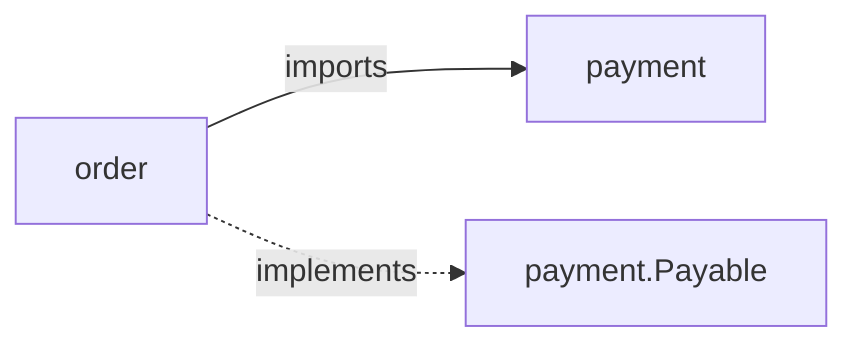
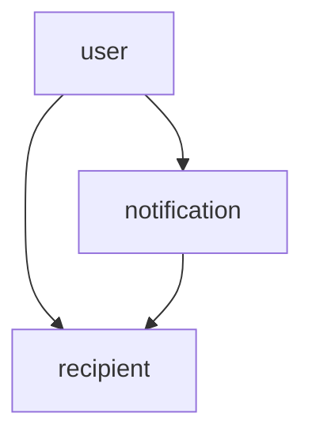

# Coupling & State Anti-Patterns — Exercises

> **Category:** [Design Anti-Patterns](../README.md) → **Coupling & State** — *hands-on practice severing the wires that make modules know and share too much.*
> **Covers (collectively):** Singletonitis · Circular Dependency · Action at a Distance · Hidden Dependencies · Sequential Coupling

---

These are **fix-it** exercises, not recognition quizzes. Each one gives you a problem statement, starting code (in Go, Java, or Python — the language varies on purpose), acceptance criteria, and a collapsible solution. The goal is to *make the change*: inject a global singleton, break an import cycle, surface a hidden dependency, make spooky shared state explicit and immutable, and encode a call-order rule so the compiler refuses the misuse.

The unifying idea: **a dependency the type system cannot see is a dependency you cannot test, reason about, or change safely.** Every cure here pulls a hidden coupling out into the open — a constructor parameter, an interface, a return value, a type — where it can be named, replaced, and verified.

> **How to use this file.** Read the problem, try it in your editor *before* opening the solution, then compare. The "why it's better" note under each solution matters more than the diff. Refer back to [`junior.md`](junior.md) for the shapes and [`middle.md`](middle.md) for the countermoves.

---

## Table of Contents

| # | Exercise | Anti-pattern(s) | Lang | Difficulty |
|---|---|---|---|---|
| 1 | [Inject the config singleton](#exercise-1--inject-the-config-singleton) | Singletonitis | Python | ★ easy |
| 2 | [Surface the hidden clock](#exercise-2--surface-the-hidden-clock) | Hidden Dependencies | Go | ★ easy |
| 3 | [Make the spooky total explicit](#exercise-3--make-the-spooky-total-explicit) | Action at a Distance | Python | ★ easy |
| 4 | [Break the import cycle with an interface](#exercise-4--break-the-import-cycle-with-an-interface) | Circular Dependency | Go | ★★ medium |
| 5 | [Make the file dependency explicit](#exercise-5--make-the-file-dependency-explicit) | Hidden Dependencies | Java | ★★ medium |
| 6 | [Kill Singletonitis in a service graph](#exercise-6--kill-singletonitis-in-a-service-graph) | Singletonitis + Hidden Deps | Go | ★★ medium |
| 7 | [Freeze the shared mutable config](#exercise-7--freeze-the-shared-mutable-config) | Action at a Distance + immutability | Python | ★★ medium |
| 8 | [Break the cycle with a third module](#exercise-8--break-the-cycle-with-a-third-module) | Circular Dependency | Python | ★★ medium |
| 9 | [Encode call order in the type (file handle)](#exercise-9--encode-call-order-in-the-type-file-handle) | Sequential Coupling | Go | ★★★ hard |
| 10 | [Make misuse not compile (typed builder)](#exercise-10--make-misuse-not-compile-typed-builder) | Sequential Coupling | Java | ★★★ hard |
| 11 | [Trace the action at a distance](#exercise-11--trace-the-action-at-a-distance) | Action at a Distance + Hidden Deps | Python | ★★★ hard |
| 12 | [Mini-project: detangle the `BillingEngine`](#exercise-12--mini-project-detangle-the-billingengine) | All five | Python | ★★★★ project |
| 13 | [Judgment: when a process-wide singleton is correct](#exercise-13--judgment-when-a-process-wide-singleton-is-correct) | Singletonitis (judgment) | Go | ★★ medium |
| 14 | [Write a coupling review checklist](#exercise-14--write-a-coupling-review-checklist) | meta | — | ★★ medium |

---

## Exercise 1 — Inject the config singleton

**Anti-pattern:** Singletonitis · **Language:** Python · **Difficulty:** ★ easy

`PriceCalculator` reaches for a global `Config` singleton in the middle of its logic. The tax rate is now impossible to vary in a test without mutating global state and hoping no other test runs in parallel.

```python
class Config:
    _instance = None

    @classmethod
    def instance(cls):
        if cls._instance is None:
            cls._instance = cls()
        return cls._instance

    def __init__(self):
        self.tax_rate = 0.08
        self.currency = "USD"


class PriceCalculator:
    def total(self, subtotal: float) -> float:
        # reaches into the global — the dependency is invisible in the signature
        rate = Config.instance().tax_rate
        return subtotal * (1 + rate)
```

**Acceptance criteria**
- `PriceCalculator` no longer references `Config.instance()`.
- The tax rate it uses is supplied from outside (constructor injection).
- A test can construct a calculator with `tax_rate=0.20` without touching any global.

**Hint:** the calculator needs one number, not the whole config object. Inject the smallest thing it actually uses.

<details>
<summary>Solution</summary>

```python
class PriceCalculator:
    def __init__(self, tax_rate: float):
        self._tax_rate = tax_rate

    def total(self, subtotal: float) -> float:
        return subtotal * (1 + self._tax_rate)


# Composition root — the ONE place that reads global config and wires it in:
calc = PriceCalculator(tax_rate=Config.instance().tax_rate)

# A test needs no global at all:
def test_total_applies_tax():
    assert PriceCalculator(tax_rate=0.20).total(100) == 120
```

**Why it's better.** The dependency is now in the signature: a reader of `PriceCalculator` sees it needs a `tax_rate`, full stop. Singletonitis hid that fact and chained the class to one global value for the whole process — two tests could not use two different rates, and concurrent tests fought over `Config._instance`. Note we injected the *value* (`tax_rate`), not the `Config` object: the calculator depends on the one thing it uses, not on the entire configuration surface. The singleton still exists at the edge, but it is read exactly once, in the composition root, and pushed inward — the standard cure from [Dependency Injection](../../../design-patterns/01-creational/README.md).

</details>

---

## Exercise 2 — Surface the hidden clock

**Anti-pattern:** Hidden Dependencies · **Language:** Go · **Difficulty:** ★ easy

`Token.Expired` looks pure, but it secretly depends on the wall clock. Its tests are flaky — they pass at 10:00 and fail at 10:05 — and you can never assert the boundary case.

```go
type Token struct {
	IssuedAt  time.Time
	TTLMinute int
}

// The signature promises a function of the token alone. It lies:
// it also depends on time.Now(), an invisible input.
func (t Token) Expired() bool {
	return time.Now().After(t.IssuedAt.Add(time.Duration(t.TTLMinute) * time.Minute))
}
```

**Acceptance criteria**
- "Now" becomes an explicit input, not a hidden read of `time.Now()`.
- A test can check "expired exactly one second after the deadline" deterministically.
- Production callers are not forced to construct a clock object on every call.

**Hint:** the simplest cure is to pass `now time.Time` as a parameter. The signature then tells the whole truth.

<details>
<summary>Solution</summary>

```go
// now is now an explicit input. The signature no longer lies.
func (t Token) ExpiredAt(now time.Time) bool {
	return now.After(t.IssuedAt.Add(time.Duration(t.TTLMinute) * time.Minute))
}

// Production callers pass the real clock at the call site:
expired := tok.ExpiredAt(time.Now())
```

A test pins the clock and checks the exact boundary:

```go
func TestExpiry(t *testing.T) {
	tok := Token{IssuedAt: time.Unix(0, 0), TTLMinute: 5}
	deadline := time.Unix(0, 0).Add(5 * time.Minute)

	if tok.ExpiredAt(deadline) {
		t.Error("token should not be expired exactly at the deadline")
	}
	if !tok.ExpiredAt(deadline.Add(time.Second)) {
		t.Error("token should be expired one second past the deadline")
	}
}
```

**Why it's better.** `time.Now()` was a hidden dependency: nothing in the signature said the result depended on what time it is, so the function was non-deterministic and its tests were time-of-day-dependent. Passing `now` makes the dependency explicit and the function genuinely pure — same inputs, same output, always. If many methods need a clock, promote it to an injected `Clock interface{ Now() time.Time }` (see Exercise 6); for a single method, a parameter is the lightest honest fix. The rule: **a function's signature should list everything it depends on.**

</details>

---

## Exercise 3 — Make the spooky total explicit

**Anti-pattern:** Action at a Distance · **Language:** Python · **Difficulty:** ★ easy

`add_item` mutates a module-level `_cart`, and `checkout` reads it. Calling `add_item` from one part of the program silently changes what `checkout` returns in another — action at a distance. Two requests sharing this module corrupt each other's carts.

```python
_cart = []          # module-global, mutated from afar
_total = 0.0        # kept "in sync" by hand — until it isn't

def add_item(price: float):
    _cart.append(price)
    global _total
    _total += price          # someone, somewhere, forgot to update this once

def checkout() -> float:
    return _total            # reads state set by a distant, invisible caller
```

**Acceptance criteria**
- No module-level mutable cart or total.
- The cart's contents are an explicit value passed between functions.
- Two carts can exist at once without interfering.

**Hint:** the cart is *state*. Give it an owner (an object or an explicit value) instead of letting it float at module scope.

<details>
<summary>Solution</summary>

```python
from dataclasses import dataclass, field

@dataclass
class Cart:
    items: list[float] = field(default_factory=list)

    def add_item(self, price: float) -> "Cart":
        # return a new cart rather than mutating in place
        return Cart(items=[*self.items, price])

    def total(self) -> float:
        # derived on read — no hand-maintained _total to drift out of sync
        return sum(self.items)


# Each caller owns its own cart; no distant action:
cart = Cart().add_item(9.99).add_item(4.50)
print(cart.total())   # 14.49
```

**Why it's better.** The cart was *spooky action at a distance*: any code anywhere could `add_item` and silently change `checkout`'s answer, and two concurrent users shared one global list. Now state has an owner — a `Cart` value — and is passed explicitly, so two carts are independent by construction. Making it **immutable** (`add_item` returns a new `Cart`) eliminates a whole bug class: there is no shared mutable object for a distant caller to corrupt, and the duplicated `_total` that could drift out of sync is gone because the total is *derived on read*. The cure for action at a distance is always the same: make the state explicit, give it an owner, and prefer [immutability](../../../clean-code/14-immutability/) so there is nothing to mutate from afar.

</details>

---

## Exercise 4 — Break the import cycle with an interface

**Anti-pattern:** Circular Dependency · **Language:** Go · **Difficulty:** ★★ medium

Package `order` imports `payment` to charge a card; package `payment` imports `order` to look up the order total. Go refuses to compile a cycle outright, and even in languages that tolerate it the design is wrong: neither package can be understood, tested, or built alone.

```go
// package order
package order

import "app/payment"

type Order struct {
	ID    string
	Total int
}

func (o *Order) Pay() error {
	return payment.Charge(o)   // order -> payment
}

// package payment
package payment

import "app/order"             // payment -> order : CYCLE

func Charge(o *order.Order) error {
	amount := o.Total          // payment only needs the amount...
	// ... call the gateway with `amount` ...
	return nil
}
```

**Acceptance criteria**
- The import cycle is gone; each package compiles independently.
- `payment` no longer imports `order`.
- The dependency is inverted via an interface owned by the *consumer* (`payment`).

**Hint:** `payment` does not need the `order` *type* — it needs the *amount*. Have `payment` declare a tiny interface for what it requires, and let `order` satisfy it.

<details>
<summary>Solution</summary>

```go
// package payment — depends on an abstraction it OWNS, not on package order.
package payment

// Payable is the narrow contract payment actually needs.
type Payable interface {
	Amount() int
}

func Charge(p Payable) error {
	amount := p.Amount()
	// ... call the gateway with `amount` ...
	return nil
}

// package order — now satisfies payment.Payable; depends one direction only.
package order

import "app/payment"

type Order struct {
	ID    string
	Total int
}

func (o *Order) Amount() int { return o.Total }   // implements payment.Payable

func (o *Order) Pay() error {
	return payment.Charge(o)   // order -> payment, and nothing comes back
}
```

The dependency graph is now acyclic:



**Why it's better.** The cycle existed because `payment` reached back for the concrete `order.Order` type when all it wanted was an integer. By having the *consumer* (`payment`) define a narrow `Payable` interface and the *provider* (`order`) implement it, the arrow points one way only — this is the Dependency Inversion Principle in package form. Now `payment` compiles and tests in total isolation (pass any `Payable` stub returning a fixed amount), and `order` depends on `payment` without `payment` knowing `order` exists. The interface lives with its consumer because that is who knows what is needed — a key Go idiom. See [Circular Dependency cures in `senior.md`](senior.md) and [SOLID → DIP](../../../clean-code/09-classes/README.md).

</details>

---

## Exercise 5 — Make the file dependency explicit

**Anti-pattern:** Hidden Dependencies · **Language:** Java · **Difficulty:** ★★ medium

`AuditLog` reads an environment variable and opens a file deep inside a method. Its constructor signature claims it needs nothing; in reality it needs a writable filesystem, an env var, and a specific OS path. Tests must set environment variables and clean up files on disk.

```java
public class AuditLog {

    // Looks like it has no dependencies. It has three: an env var,
    // a filesystem, and a hard-coded path layout.
    public void record(String event) {
        String dir = System.getenv("AUDIT_DIR");          // hidden env dependency
        if (dir == null) dir = "/var/log/app";            // hidden default + FS assumption
        Path path = Paths.get(dir, "audit.log");
        try (var w = Files.newBufferedWriter(path, StandardOpenOption.CREATE,
                                             StandardOpenOption.APPEND)) {
            w.write(Instant.now() + " " + event + "\n");  // also a hidden clock
        } catch (IOException e) {
            throw new UncheckedIOException(e);
        }
    }
}
```

**Acceptance criteria**
- The sink (where audit lines go) is injected, not discovered from the environment.
- The clock is injected so timestamps are deterministic in tests.
- A unit test can capture the written lines in memory — no env var, no temp files.

**Hint:** `record` really wants two collaborators: somewhere to *write a line* and a way to *get the current time*. Inject both; let the composition root decide they are a file and the system clock.

<details>
<summary>Solution</summary>

```java
// Two small, honest dependencies.
public interface LineSink {
    void writeLine(String line);
}

public final class AuditLog {
    private final LineSink sink;
    private final Clock clock;   // java.time.Clock — injectable

    public AuditLog(LineSink sink, Clock clock) {
        this.sink = sink;
        this.clock = clock;
    }

    public void record(String event) {
        sink.writeLine(Instant.now(clock) + " " + event);
    }
}
```

The filesystem concern moves to its own adapter, chosen at the edge:

```java
// Production wiring (composition root):
LineSink fileSink = line -> {
    Path dir = Paths.get(Optional.ofNullable(System.getenv("AUDIT_DIR"))
                                 .orElse("/var/log/app"));
    try (var w = Files.newBufferedWriter(dir.resolve("audit.log"),
             StandardOpenOption.CREATE, StandardOpenOption.APPEND)) {
        w.write(line + "\n");
    } catch (IOException e) { throw new UncheckedIOException(e); }
};
AuditLog log = new AuditLog(fileSink, Clock.systemUTC());
```

The test needs no disk and no env var:

```java
@Test
void recordsTimestampedEvent() {
    var lines = new ArrayList<String>();
    var fixedClock = Clock.fixed(Instant.parse("2026-06-09T00:00:00Z"), ZoneOffset.UTC);

    new AuditLog(lines::add, fixedClock).record("login");

    assertEquals(List.of("2026-06-09T00:00:00Z login"), lines);
}
```

**Why it's better.** Three dependencies that were invisible — the `AUDIT_DIR` env var, the `/var/log/app` filesystem assumption, and `Instant.now()` — are now explicit constructor parameters (`LineSink`, `Clock`). The class's signature tells the truth about what it requires. The env-var-and-path logic survives, but it is pushed to the composition root where environment reads belong, behind the `LineSink` seam. The test became a three-liner with an in-memory list and a frozen clock — no `@TempDir`, no `System.setenv` hacks, no flaky timestamp. Hidden dependencies are not removed by deleting them; they are *relocated* to the boundary and injected inward.

</details>

---

## Exercise 6 — Kill Singletonitis in a service graph

**Anti-pattern:** Singletonitis + Hidden Dependencies · **Language:** Go · **Difficulty:** ★★ medium

Everything is a global singleton: the DB, the logger, the metrics client, the clock. `ProcessOrder` reaches for all four. The result is untestable — you cannot run it without a live database — and its dependencies are completely invisible.

```go
var DB *sql.DB             // global
var Log *zap.Logger        // global
var Metrics *statsd.Client // global

func ProcessOrder(id string) error {
	Log.Info("processing", zap.String("id", id))   // hidden global
	row := DB.QueryRow("SELECT total FROM orders WHERE id=$1", id) // hidden global
	var total int
	if err := row.Scan(&total); err != nil {
		return err
	}
	Metrics.Incr("orders.processed", 1)             // hidden global
	createdAt := time.Now()                         // hidden clock
	_ = createdAt
	return nil
}
```

**Acceptance criteria**
- `ProcessOrder` becomes a method on a struct that *holds* its dependencies.
- The dependencies are interfaces, so tests can pass fakes.
- No global variables remain in the business logic; wiring happens once at startup.

**Hint:** bundle the collaborators into an `OrderProcessor` struct built by a constructor. Define the *narrowest* interface for each — `ProcessOrder` does not need all of `*sql.DB`, only "fetch a total."

<details>
<summary>Solution</summary>

```go
// Narrow interfaces — each names only what the logic actually uses.
type OrderStore interface {
	Total(id string) (int, error)
}
type Logger interface {
	Info(msg string, kv ...any)
}
type Metrics interface {
	Incr(name string)
}
type Clock interface {
	Now() time.Time
}

type OrderProcessor struct {
	store   OrderStore
	log     Logger
	metrics Metrics
	clock   Clock
}

func NewOrderProcessor(s OrderStore, l Logger, m Metrics, c Clock) *OrderProcessor {
	return &OrderProcessor{store: s, log: l, metrics: m, clock: c}
}

func (p *OrderProcessor) ProcessOrder(id string) error {
	p.log.Info("processing", "id", id)
	total, err := p.store.Total(id)
	if err != nil {
		return fmt.Errorf("process order %s: %w", id, err)
	}
	_ = total
	p.metrics.Incr("orders.processed")
	_ = p.clock.Now()
	return nil
}
```

Wiring happens exactly once, at startup:

```go
func main() {
	db := openDB()
	proc := NewOrderProcessor(
		&sqlOrderStore{db},   // adapts *sql.DB to OrderStore
		zapLogger{logger},
		statsdMetrics{client},
		systemClock{},
	)
	// ... hand `proc` to the HTTP handlers ...
}
```

A test runs in microseconds with no infrastructure:

```go
type stubStore struct{ total int }
func (s stubStore) Total(string) (int, error) { return s.total, nil }

func TestProcessOrder(t *testing.T) {
	p := NewOrderProcessor(stubStore{total: 42}, nopLog{}, nopMetrics{}, fixedClock{})
	if err := p.ProcessOrder("o1"); err != nil {
		t.Fatal(err)
	}
}
```

**Why it's better.** Four global singletons — each a hidden dependency *and* a Singletonitis symptom — became four injected interfaces held by an `OrderProcessor`. The business logic now declares its needs in the struct, depends on narrow abstractions (`OrderStore`, not `*sql.DB`), and can be tested with stubs and zero infrastructure. The globals do not vanish; they are *constructed once* in `main` and pushed inward — there is exactly one composition root instead of singletons scattered through the code. This is the standard escape from Singletonitis: not "ban all single instances," but "create the single instance at the edge and inject the interface." See [Dependency Injection](../../../design-patterns/01-creational/README.md) and Exercise 13 for when a process-wide single instance is genuinely fine.

</details>

---

## Exercise 7 — Freeze the shared mutable config

**Anti-pattern:** Action at a Distance + missing immutability · **Language:** Python · **Difficulty:** ★★ medium

A single mutable `Settings` object is shared across the whole app. One module flips `settings.debug = True` for a request, forgets to flip it back, and now a *different* module logs secrets in production. The mutation acts at a distance.

```python
class Settings:
    def __init__(self):
        self.debug = False
        self.retries = 3
        self.region = "us-east-1"

SETTINGS = Settings()    # one shared, mutable instance for everyone

def handle_debug_request(req):
    SETTINGS.debug = True            # mutates the shared object...
    process(req)
    # ... and "restores" it — except an exception in process() skips this line:
    SETTINGS.debug = False

def log_event(event):
    if SETTINGS.debug:               # a distant reader, surprised by True
        print("SECRET", event)
```

**Acceptance criteria**
- The shared config object is immutable; nobody can mutate it from afar.
- A per-request override (`debug=True`) does not affect any other code path.
- The "forgot to restore" / exception-skips-restore bug becomes impossible.

**Hint:** make `Settings` frozen, then express an override as a *new* value (`with_debug()`), passed explicitly to the code that needs it — not as a mutation of the global.

<details>
<summary>Solution</summary>

```python
from dataclasses import dataclass, replace

@dataclass(frozen=True)        # immutable: assigning a field raises FrozenInstanceError
class Settings:
    debug: bool = False
    retries: int = 3
    region: str = "us-east-1"

    def with_debug(self, on: bool = True) -> "Settings":
        return replace(self, debug=on)   # returns a NEW Settings; original untouched


SETTINGS = Settings()          # a shared, read-only baseline

def handle_debug_request(req):
    # a local override that lives only for this call — no global mutation
    request_settings = SETTINGS.with_debug(True)
    process(req, request_settings)

def log_event(event, settings: Settings):
    if settings.debug:
        print("SECRET", event)
```

**Why it's better.** The bug was action at a distance through a shared mutable object: one code path's temporary mutation leaked into every other path, and an exception between "set" and "restore" left the global permanently wrong. Freezing `Settings` makes that mutation *impossible* — `SETTINGS.debug = True` now raises. The override is expressed as a new immutable value derived with `replace`, scoped to exactly the call that wants it and passed explicitly. There is no try/finally to forget and no restore step for an exception to skip, because nothing was changed in the first place. Immutability turns "spooky shared state" into "ordinary values flowing through parameters" — the deepest cure for action at a distance. See [Immutability](../../../clean-code/14-immutability/).

</details>

---

## Exercise 8 — Break the cycle with a third module

**Anti-pattern:** Circular Dependency · **Language:** Python · **Difficulty:** ★★ medium

`user.py` imports `notification.py` (to email a new user) and `notification.py` imports `user.py` (to format a greeting from a `User`). Python "tolerates" this with import-order landmines: import the wrong module first and you get `ImportError: cannot import name 'User'` or a half-initialized module. The interface fix (Exercise 4) is one option; here the cleaner answer is to extract the *shared type* both depend on into a third module.

```python
# user.py
from notification import send_welcome   # user -> notification

class User:
    def __init__(self, name, email):
        self.name = name
        self.email = email

    def register(self):
        send_welcome(self)               # passes self to notification

# notification.py
from user import User                    # notification -> user : CYCLE

def send_welcome(u: User):               # only needs name + email
    body = f"Welcome {u.name}!"
    _smtp_send(u.email, body)
```

**Acceptance criteria**
- The import cycle is gone; both modules import in any order.
- The shared data type lives in a module that depends on neither `user` nor `notification`.
- `send_welcome` depends only on the data it uses.

**Hint:** the cycle exists because both modules want the `User` *type*. Hoist the plain data into a third, leaf module (`models.py` or a small dataclass) that nothing else depends on, and let both modules import *down* into it.

<details>
<summary>Solution</summary>

```python
# recipient.py  — a leaf module; imports nothing from the cycle.
from dataclasses import dataclass

@dataclass(frozen=True)
class Recipient:
    name: str
    email: str


# notification.py — depends only on the leaf type, not on user.
from recipient import Recipient

def send_welcome(r: Recipient) -> None:
    _smtp_send(r.email, f"Welcome {r.name}!")


# user.py — depends on notification and on the leaf type; nobody imports user back.
from recipient import Recipient
from notification import send_welcome

class User:
    def __init__(self, name: str, email: str):
        self.name = name
        self.email = email

    def register(self) -> None:
        send_welcome(Recipient(self.name, self.email))
```

The graph is now a tree — both arrows point *down* into the leaf:



**Why it's better.** The cycle came from `notification` needing the `User` type, so the two modules could not exist without each other. Extracting the shared shape into a leaf module (`recipient.py`) that depends on nothing turns the cyclic graph into an acyclic one — both modules now import *downward*, and import order stops mattering. `send_welcome` got narrower too: it takes a `Recipient` (just the two fields it uses) instead of a full `User`, so it no longer knows about registration logic at all. Choose this over the consumer-interface fix (Exercise 4) when the coupling is really *shared data* rather than shared *behavior*. Both are valid; both make the dependency arrow point one way. See [Modules & Packages](../../../clean-code/19-modules-and-packages/README.md).

</details>

---

## Exercise 9 — Encode call order in the type (file handle)

**Anti-pattern:** Sequential Coupling · **Language:** Go · **Difficulty:** ★★★ hard

This `Connection` only works if you call `Open()`, then `Send()` any number of times, then `Close()` — in that order. Nothing enforces it. Calling `Send()` before `Open()`, or after `Close()`, fails at runtime (or worse, silently). Redesign so the *type system* makes the legal sequence the only expressible one.

```go
type Connection struct {
	open   bool
	closed bool
	conn   net.Conn
}

func (c *Connection) Open(addr string) error {
	conn, err := net.Dial("tcp", addr)
	if err != nil {
		return err
	}
	c.conn, c.open = conn, true
	return nil
}

func (c *Connection) Send(b []byte) error {
	if !c.open || c.closed {      // a runtime guard for a rule the compiler could enforce
		return errors.New("send on a connection that is not open")
	}
	_, err := c.conn.Write(b)
	return err
}

func (c *Connection) Close() error {
	c.closed = true
	return c.conn.Close()
}
```

**Acceptance criteria**
- You cannot call `Send` on something that has not been opened — it should not compile.
- `Open` is the only way to obtain a sendable connection.
- `Close` consumes the connection so post-close `Send` is impossible to write.
- The `open`/`closed` boolean guards disappear.

**Hint:** make `Open` a *constructor function* that returns a distinct `*OpenConn` type which is the only thing that has a `Send` method. `Close` is the terminal operation. The "you must open first" rule becomes "you can only get an `*OpenConn` from `Open`."

<details>
<summary>Solution</summary>

```go
// Open is the only constructor; you cannot make an *OpenConn any other way.
type OpenConn struct {
	conn net.Conn
}

// Open returns a sendable connection, or an error. No bool flags.
func Open(addr string) (*OpenConn, error) {
	conn, err := net.Dial("tcp", addr)
	if err != nil {
		return nil, err
	}
	return &OpenConn{conn: conn}, nil
}

// Send exists ONLY on *OpenConn — so "send before open" cannot be written.
func (c *OpenConn) Send(b []byte) error {
	_, err := c.conn.Write(b)
	return err
}

// Close is terminal. Idiomatic Go pairs Open with a deferred Close.
func (c *OpenConn) Close() error {
	return c.conn.Close()
}
```

Usage — the legal sequence is the natural one, and misuse will not compile:

```go
conn, err := Open("localhost:9000")
if err != nil {
	return err
}
defer conn.Close()        // RAII-style: Close is guaranteed, in order

if err := conn.Send([]byte("ping")); err != nil {
	return err
}

// conn.Send(...) before Open() is impossible: there is no zero-value
// connection with a Send method to call it on.
```

**Why it's better.** The original encoded the protocol "open → send* → close" only in two booleans and a runtime guard — a developer reading the struct could not see the rule, and a caller learned it by getting an error in production. The redesign moves the rule into the type system: `Send` lives on `*OpenConn`, and the *only* way to obtain an `*OpenConn` is `Open`, so "send before open" is not a runtime error — it is a compile error (you have nothing to call `Send` on). The `open`/`closed` flags vanish because the state they tracked is now represented by *which type you hold*. Pairing `Open` with `defer Close()` gives RAII-style ordering for free. This is the type-state pattern: **make illegal sequences unrepresentable** rather than guarding against them. See [Sequential Coupling cures in `senior.md`](senior.md).

</details>

---

## Exercise 10 — Make misuse not compile (typed builder)

**Anti-pattern:** Sequential Coupling · **Language:** Java · **Difficulty:** ★★★ hard

An `HttpRequest` builder lets you call `build()` before setting the required `url`, producing a broken request that blows up at send time. The order rule ("set url before build") lives only in a runtime check. Use a **staged (step) builder** so the compiler refuses `build()` until `url` is set.

```java
public class HttpRequest {
    private String url;
    private String method = "GET";
    private String body;

    public HttpRequest url(String u)    { this.url = u; return this; }
    public HttpRequest method(String m) { this.method = m; return this; }
    public HttpRequest body(String b)   { this.body = b; return this; }

    public HttpRequest build() {
        if (url == null)                       // a rule the compiler could enforce
            throw new IllegalStateException("url is required");
        return this;
    }
}

// The bug compiles fine and fails only at runtime:
//   new HttpRequest().method("POST").build();   // boom: url is null
```

**Acceptance criteria**
- `build()` is not reachable until `url` has been set — calling it early is a *compile* error.
- Optional settings (`method`, `body`) remain freely chainable.
- The runtime `if (url == null)` guard is gone.

**Hint:** split the fluent chain into interfaces (stages). The entry point returns a "needs url" stage whose only method is `url(...)`; `url(...)` returns a "can build" stage that also exposes the optional setters and `build()`.

<details>
<summary>Solution</summary>

```java
public final class HttpRequest {
    public final String url, method, body;
    private HttpRequest(String url, String method, String body) {
        this.url = url; this.method = method; this.body = body;
    }

    // Stage 1: the only thing you can do is supply the required url.
    public interface UrlStage {
        BuildStage url(String url);
    }

    // Stage 2: optional setters + build(). Reachable only after url() is called.
    public interface BuildStage {
        BuildStage method(String method);
        BuildStage body(String body);
        HttpRequest build();
    }

    public static UrlStage builder() {
        return url -> new BuildStage() {           // url() returns the build stage
            private String method = "GET";
            private String body;
            public BuildStage method(String m) { this.method = m; return this; }
            public BuildStage body(String b)   { this.body = b;   return this; }
            public HttpRequest build() {
                return new HttpRequest(url, method, body);   // url is guaranteed non-null
            }
        };
    }
}
```

The compiler now enforces the order:

```java
// Legal — url first, then anything, then build:
HttpRequest ok = HttpRequest.builder().url("/api").method("POST").body("{}").build();

// Will NOT compile — UrlStage has no build() method:
//   HttpRequest bad = HttpRequest.builder().method("POST").build();
//                                            ^ method() doesn't exist on UrlStage
//                                              build() doesn't exist on UrlStage
```

**Why it's better.** The flat builder let you skip the required `url` and only complained at runtime via `IllegalStateException` — the sequential rule "url before build" was invisible to the compiler. Splitting the chain into a `UrlStage` (which exposes *only* `url(...)`) and a `BuildStage` (optional setters + `build()`) makes the rule structural: `builder()` hands you a stage that *cannot* build, and `build()` only appears after `url(...)` has handed you the next stage. The mandatory step is now impossible to skip — the compiler rejects it — so the `if (url == null)` guard is dead and deleted. Optional fields stay ergonomically chainable. This is the staged-builder form of "make illegal states unrepresentable," the type-level counterpart to the [Builder pattern](../../../design-patterns/01-creational/03-builder/junior.md).

</details>

---

## Exercise 11 — Trace the action at a distance

**Anti-pattern:** Action at a Distance + Hidden Dependencies · **Language:** Python · **Difficulty:** ★★★ hard

A bug report: "discounts are sometimes applied twice." The code below is the suspect. Two functions communicate through a module-global, and a third reads it much later. Your task is twofold: (1) explain *how* the double-discount happens, then (2) eliminate the action at a distance so the bug is structurally impossible.

```python
_applied_discounts = set()      # module-global, mutated from several places

def apply_discount(order_id, code, price):
    if code not in _applied_discounts:
        _applied_discounts.add(code)        # global mutation, far from the read
        return price * 0.9
    return price

def retry_pricing(order_id, code, price):
    # a retry path that ALSO prices — but doesn't know about _applied_discounts
    return apply_discount(order_id, code, price)

def finalize(order_id):
    # reads the global set built up by unrelated calls, possibly across requests
    return {"discounts_used": list(_applied_discounts)}
```

**Acceptance criteria**
- Explain the mechanism of the double-discount bug (and why it is cross-request).
- Remove the module-global; discount state is owned by the order being priced.
- The "applied?" check and the price live together, so a retry cannot double-apply.

**Hint:** `_applied_discounts` is global, so it is shared across *all* orders and *all* requests — `code` keys collide between orders. The state belongs to a single order's pricing, not to the module.

<details>
<summary>Solution</summary>

**How the bug happens.** `_applied_discounts` is keyed by `code`, not by `order_id`, and it is a module-global that lives for the whole process. So:

1. **Cross-order collision:** Order A applies code `SAVE10`; the code is now in the global set. Order B uses `SAVE10` and is *silently skipped* (`code in _applied_discounts` is already true) — B never gets its discount.
2. **The double-apply:** worse, the set is *never cleared*, and `retry_pricing` calls `apply_discount` again. If two requests interleave — one adds `SAVE10`, a concurrent retry checks before the add commits — both can pass the `not in` check and both apply the 0.9 multiplier. The mutation (`add`) and the read (`finalize`) are far apart and span requests: textbook action at a distance.

**The fix — give the state an owner:**

```python
from dataclasses import dataclass, field

@dataclass
class OrderPricing:
    order_id: str
    applied: set[str] = field(default_factory=set)   # scoped to THIS order

    def apply_discount(self, code: str, price: float) -> float:
        if code in self.applied:        # check and mutation live together, per-order
            return price
        self.applied.add(code)
        return price * 0.9

    def summary(self) -> dict:
        return {"order_id": self.order_id, "discounts_used": sorted(self.applied)}


# Each order gets its own pricing context; a retry reuses the SAME object,
# so the "already applied" check is correct and local:
pricing = OrderPricing(order_id="A")
price = pricing.apply_discount("SAVE10", 100.0)   # 90.0
price = pricing.apply_discount("SAVE10", 90.0)    # 90.0 — correctly NOT re-discounted
```

**Why it's better.** The double-discount and the cross-order skip both stemmed from one root cause: discount state was a process-global shared by every order and every request, mutated in one place and read in another with no owner in between. Scoping the state to an `OrderPricing` object keyed by `order_id` makes each order's discounts private — Order B can no longer be silently skipped because A used the same code, and there is no shared set for concurrent requests to race on. The "applied?" check now sits right next to the mutation and the price, inside one object, so a retry that reuses that object is idempotent by construction. The cure for action at a distance is always to **give the wandering state an explicit owner and a narrow scope**, then let it flow through parameters rather than haunt a global. See [Action at a Distance in `senior.md`](senior.md).

</details>

---

## Exercise 12 — Mini-project: detangle the `BillingEngine`

**Anti-pattern:** all five, in one small realistic module · **Language:** Python · **Difficulty:** ★★★★ project

This module manages to combine **every** coupling-and-state anti-pattern at once: a Singletonitis global config, a hidden filesystem/clock dependency, action at a distance through a shared mutable ledger, a sequential-coupling rule enforced only at runtime, and (with its partner module) a circular import. Refactor it into clean, injectable, testable units. Work in steps; do not try to fix it all in one edit.

```python
# config.py  (and billing.py imports it; config.py imports billing.py for a type — CYCLE)
class Config:
    _i = None
    @classmethod
    def get(cls):
        if cls._i is None: cls._i = cls()
        return cls._i
    def __init__(self):
        self.tax_rate = 0.08
        self.ledger_path = "/var/billing/ledger.csv"

# billing.py
from config import Config

_ledger = []          # shared mutable state, action at a distance

class BillingEngine:
    def __init__(self):
        self.started = False        # sequential-coupling flag

    def start_run(self):
        self.started = True

    def charge(self, customer_id, amount):
        if not self.started:                     # runtime guard, not a compile guard
            raise RuntimeError("call start_run() first")
        rate = Config.get().tax_rate             # Singletonitis: hidden global
        total = amount * (1 + rate)
        _ledger.append((customer_id, total))     # mutates module-global from afar
        # hidden FS + clock dependency, discovered mid-method:
        import csv, time
        with open(Config.get().ledger_path, "a") as f:
            csv.writer(f).writerow([customer_id, total, time.time()])
        return total

    def finish_run(self):
        return {"charged": len(_ledger), "total": sum(t for _, t in _ledger)}
```

**Acceptance criteria**
- **Singletonitis:** `Config.get()` is read once at the edge; `BillingEngine` receives a `tax_rate` (or config value), not the singleton.
- **Hidden Dependencies:** the ledger sink (file) and the clock are injected interfaces, not opened mid-method.
- **Action at a Distance:** the module-global `_ledger` is replaced by state owned by a run.
- **Sequential Coupling:** the `started` boolean guard is replaced by a type/structure that makes "charge before start" impossible to express.
- **Circular Dependency:** the `config ↔ billing` cycle is broken.
- Each unit is testable in isolation — no file, no clock, no global.

**Hint:** model a billing run as an object you can only obtain by *starting* one (kills the sequential coupling, like Exercise 9). Inject a `LedgerSink` and a `Clock` (kills hidden deps). Pass the `tax_rate` value in (kills Singletonitis). Break the cycle by not importing `billing` from `config` (extract any shared type, per Exercise 8).

<details>
<summary>Solution</summary>

```python
from dataclasses import dataclass, field
from typing import Protocol

# --- Collaborators as narrow, injectable interfaces (kills Hidden Dependencies) ---
class LedgerSink(Protocol):
    def write(self, customer_id: str, total: float, at: float) -> None: ...

class Clock(Protocol):
    def now(self) -> float: ...


# --- A billing run owns its state; the ONLY way to get one is start_run().
#     This makes "charge before start" unrepresentable (kills Sequential Coupling
#     and the module-global Action at a Distance). ---
@dataclass
class BillingRun:
    tax_rate: float
    sink: LedgerSink
    clock: Clock
    charges: list[tuple[str, float]] = field(default_factory=list)   # owned, not global

    def charge(self, customer_id: str, amount: float) -> float:
        total = amount * (1 + self.tax_rate)
        self.charges.append((customer_id, total))
        self.sink.write(customer_id, total, self.clock.now())
        return total

    def summary(self) -> dict:
        return {"charged": len(self.charges),
                "total": round(sum(t for _, t in self.charges), 2)}


class BillingEngine:
    """A factory for runs. tax_rate is a plain value (kills Singletonitis)."""
    def __init__(self, tax_rate: float, sink: LedgerSink, clock: Clock):
        self._tax_rate, self._sink, self._clock = tax_rate, sink, clock

    def start_run(self) -> BillingRun:                # the only door to a BillingRun
        return BillingRun(self._tax_rate, self._sink, self._clock)
```

Adapters and wiring live at the edge — `config` no longer imports `billing`, so the cycle is gone:

```python
# adapters.py — filesystem + clock concerns isolated here.
import csv, time

class FileLedgerSink:
    def __init__(self, path: str):
        self._path = path
    def write(self, customer_id, total, at):
        with open(self._path, "a") as f:
            csv.writer(f).writerow([customer_id, total, at])

class SystemClock:
    def now(self) -> float:
        return time.time()

# main.py — composition root: read the singleton ONCE, inject everything inward.
from config import Config
cfg = Config.get()
engine = BillingEngine(cfg.tax_rate, FileLedgerSink(cfg.ledger_path), SystemClock())
```

Tests need no file, no clock, no global, and cannot misuse the sequence:

```python
class FakeSink:
    def __init__(self): self.rows = []
    def write(self, c, t, at): self.rows.append((c, t, at))

class FixedClock:
    def now(self): return 1_000.0

def test_charge_applies_tax_and_records():
    engine = BillingEngine(tax_rate=0.10, sink=FakeSink(), clock=FixedClock())
    run = engine.start_run()                 # you literally cannot charge() without this
    assert run.charge("c1", 100.0) == 110.0
    assert run.summary() == {"charged": 1, "total": 110.0}
```

**What happened to each anti-pattern:**

- **Singletonitis →** `BillingEngine` takes a `tax_rate` value; `Config.get()` is read exactly once in `main.py` and pushed inward. No business code touches the singleton.
- **Hidden Dependencies →** the mid-method `open(...)` and `time.time()` became injected `LedgerSink` and `Clock` interfaces; the filesystem code moved to `adapters.py`.
- **Action at a Distance →** the module-global `_ledger` is now `BillingRun.charges`, owned by a single run, so concurrent runs are independent and nothing mutates a global from afar.
- **Sequential Coupling →** the `started` boolean and its runtime guard are gone: `charge` lives on `BillingRun`, and the *only* way to obtain a `BillingRun` is `engine.start_run()`. "Charge before start" is now impossible to write (same trick as Exercise 9).
- **Circular Dependency →** `config.py` no longer imports `billing.py` (it imported it only for a type hint); the dependency arrow points one way, `billing → config` is replaced by injecting a plain value, and the cycle is broken.

**Why it's better.** Every dependency the original hid — the config singleton, the filesystem, the clock, the run state, the call-order rule — is now explicit: a constructor parameter, an injected interface, an owned field, or a type you can only reach by starting a run. The result is testable in microseconds with fakes and a frozen clock, safe under concurrency (no shared global), and impossible to misuse in sequence. Crucially, the refactor is a *sequence of small moves* — inject the value, inject the sink, inject the clock, own the ledger, make the run a type, break the cycle — each keeping behavior green, never a big-bang rewrite. That discipline is the throughline of [`middle.md`](middle.md).

</details>

---

## Exercise 13 — Judgment: when a process-wide singleton is correct

**Anti-pattern:** Singletonitis (judgment call) · **Language:** Go · **Difficulty:** ★★ medium

Not every single instance is Singletonitis. A senior engineer's skill is knowing when to *keep* one. Below is a structured logger that is genuinely process-wide. A junior wants to "fix the singleton" by threading a `*Logger` parameter through all 200 functions in the codebase. Decide what is actually right.

```go
package logx

var global *slog.Logger = slog.New(slog.NewJSONHandler(os.Stdout, nil))

// Used everywhere, by name, with no injection:
func Info(msg string, args ...any)  { global.Info(msg, args...) }
func Error(msg string, args ...any) { global.Error(msg, args...) }
```

**The question.** Is this Singletonitis? Should you (a) inject a `*Logger` everywhere, (b) leave it exactly as is, or (c) something in between? Justify the call, and show the change (if any). Consider: what breaks in tests? what is the cost of injecting it into 200 call sites? what genuinely *needs* per-instance variation?

**Acceptance criteria**
- A clear verdict with reasoning, not a reflexive "all globals are bad."
- Identify what (if anything) about the current design actually causes pain.
- If you keep the global, show how tests still get control.

<details>
<summary>Solution</summary>

**Verdict: keep it as a process-wide instance, but inject the *interface* where behavior must vary under test — option (c), leaning heavily toward (b).**

**Why it is *not* Singletonitis.** Singletonitis is the *reflex* of making everything a global, hidden, untestable singleton — config, DB, session, "managers." A logger is different on three counts:

1. **It is genuinely process-wide.** There is one stdout, one log stream per process. A per-request logger is occasionally useful (request-scoped fields), but the *sink* is legitimately singular. This is the category of resource singletons are *for*.
2. **It is a cross-cutting concern.** Threading a `*Logger` through 200 functions — including pure computational ones that log once on an error path — adds a parameter to every signature for a concern orthogonal to what those functions *do*. That is a large, ongoing readability tax for little gain. (This is exactly why most languages keep logging ambient.)
3. **Logging is an observation, not a behavior under test.** You rarely assert "this function logged exactly X." You assert what it *returns* or *changes*. So the usual reason to inject — to verify or control behavior in tests — mostly does not apply.

**What *would* be a real problem (and the fix):** the only legitimate pain is a test that genuinely needs to *assert* a log line (e.g. "an auth failure is logged at WARN") or *silence* output. Solve that without injecting into 200 sites by making the global *swappable behind an interface*:

```go
package logx

type Logger interface {
	Info(msg string, args ...any)
	Error(msg string, args ...any)
}

var global Logger = slog.New(slog.NewJSONHandler(os.Stdout, nil))

// SetForTest swaps the logger and returns a restore func. Test-only seam.
func SetForTest(l Logger) (restore func()) {
	prev := global
	global = l
	return func() { global = prev }
}

func Info(msg string, args ...any)  { global.Info(msg, args...) }
func Error(msg string, args ...any) { global.Error(msg, args...) }
```

```go
func TestLogsAuthFailure(t *testing.T) {
	spy := &captureLogger{}
	restore := logx.SetForTest(spy)
	defer restore()

	authenticate("bad", "creds")

	if !spy.contains("auth failed") {
		t.Error("expected an auth-failure log line")
	}
}
```

**Why this is the right call.** The blanket rule "inject everything" is itself a smell — it would impose 200 signature changes to defend against a problem (untestable logging) that a single test seam solves. We *kept* the process-wide instance because the resource really is process-wide and the concern is cross-cutting, but we made it an *interface* with a test-only swap, so the rare test that must observe logging still can. That is the mature reading of Singletonitis: the disease is hidden, unswappable, everywhere-globals — not the existence of one instance. Reserve true singletons for genuinely process-wide resources (logger, metrics sink, connection pool), keep them behind an interface for testability, and inject *business* collaborators (DB, mailer, clock) the normal way. See Exercise 6 for the contrast.

</details>

---

## Exercise 14 — Write a coupling review checklist

**Anti-pattern:** meta (prevention) · **Difficulty:** ★★ medium

Coupling-and-state anti-patterns are cheapest to stop in review, before the wires multiply. Write a concise, *actionable* reviewer checklist — phrased as questions a reviewer asks of a diff — that catches all five before they merge. Aim for questions with a clear "if yes, push back" trigger, not vague advice like "is this coupled?"

**Acceptance criteria**
- One or more concrete, answerable questions per anti-pattern.
- Each question has a clear failure trigger and a suggested action.
- Short enough that a reviewer would actually run it on every PR.

<details>
<summary>Solution</summary>

**Coupling-&-State PR review checklist**

| # | Question | If the answer is… | Then |
|---|---|---|---|
| 1 | Does this code call `X.instance()` / read a global / `getenv` *inside* its logic? | "Yes" | Push back: inject it via the constructor; read globals only in the composition root. **Singletonitis / Hidden Deps**. |
| 2 | Does the function's signature list *everything* it depends on (clock, FS, network, randomness)? | "No — it reaches for `time.Now()`/files/env" | Push back: make the dependency a parameter or injected interface. **Hidden Deps**. |
| 3 | Do these two packages/modules import *each other* (directly or transitively)? | "Yes" | Push back: invert with a consumer-owned interface, or extract the shared type to a leaf module. **Circular Dependency**. |
| 4 | Does this mutate a shared/global/module-level variable that something else reads later? | "Yes" | Push back: give the state an owner, pass it explicitly, prefer immutability. **Action at a Distance**. |
| 5 | Do these methods only work if called in a fixed order, guarded by a runtime check or a `started`/`open` boolean? | "Yes" | Push back: encode the order in the type (type-state, staged builder, RAII/`defer`/`with`) so misuse won't compile. **Sequential Coupling**. |
| 6 | Could a test exercise this unit *without* a real DB / SMTP / clock / filesystem? | "No" | Ask why — usually a hidden dependency or a non-injected singleton (rows 1–2). |
| 7 | Is a new singleton being added? | "Yes" | Ask: is the resource *genuinely* process-wide (logger, pool)? If not, inject instead. If yes, is it behind a swappable interface for tests? **Singletonitis judgment** (Exercise 13). |

**Author's pre-flight (same list, mirrored):** before requesting review, ask whether each new dependency is visible in a signature, whether any global is mutated across call boundaries, and whether the call-order rules are enforced by types rather than comments.

**Why this is better than "review for coupling."** Each row has a *trigger* and an *action*, so the checklist is mechanical enough to apply under time pressure and specific enough that two reviewers reach the same verdict. Row 6 ("can you test it without infrastructure?") is the single most powerful question — it surfaces most hidden dependencies and Singletonitis automatically, because untestable code is almost always over-coupled code. Row 7 keeps the team from over-correcting into "ban every singleton," preserving the judgment from Exercise 13.

</details>

---

## Summary

- These exercises move you from *recognizing* over-coupling to *severing* it: inject globals that masquerade as singletons, surface hidden clocks/files/env reads into the signature, give wandering shared state an owner and freeze it, break import cycles by inverting with an interface or extracting a leaf type, and encode call-order rules in types so misuse will not compile.
- **A dependency the type system cannot see is one you cannot test, reason about, or change.** Every cure pulls a hidden coupling into the open — a constructor parameter, an interface, a return value, or a distinct type.
- **Push reads of the environment to the edge.** Singletons, env vars, and clocks are read *once* in a composition root and injected inward; business logic stays pure and testable. The standard escape from Singletonitis is "create the instance at the edge, inject the interface" — not "ban all single instances" (Exercise 13).
- **Make illegal sequences unrepresentable.** Sequential coupling guarded by `started`/`open` booleans is fragile; type-state (Exercise 9) and staged builders (Exercise 10) turn a runtime error into a compile error.
- **Prefer immutability for shared state.** Action at a distance dies when there is no shared mutable object to corrupt from afar (Exercises 3, 7, 11).
- The five anti-patterns travel together — Singletonitis breeds Hidden Dependencies, which breed Action at a Distance — so a real module (Exercise 12) usually shows several at once. Inject the one in front of you today and the gravity that pulls in the others weakens.

---

## Related Topics

- [`junior.md`](junior.md) — the five shapes and how to recognize them on sight.
- [`middle.md`](middle.md) — the forces that create these shapes and the countermoves used here.
- [`senior.md`](senior.md) — detecting and migrating these couplings at scale.
- [`professional.md`](professional.md) — testability, performance, and observability implications.
- [`find-bug.md`](find-bug.md) — spot-the-anti-pattern snippets (critical reading practice).
- [`optimize.md`](optimize.md) — more over-coupled designs to redesign.
- [`interview.md`](interview.md) — Q&A across all levels for job prep.
- [Design Patterns → Creational](../../../design-patterns/01-creational/README.md) — Dependency Injection, Builder, Factory: the positive counterparts.
- [Refactoring → Refactoring Techniques](../../../refactoring/02-refactoring-techniques/README.md) — Introduce Parameter Object, Replace Global with Injection, Extract Interface.
- [Clean Code → Immutability](../../../clean-code/14-immutability/) — the deepest cure for Action at a Distance.
- [Clean Code → Modules & Packages](../../../clean-code/19-modules-and-packages/README.md) — keeping the dependency graph acyclic.
- [Clean Code → Classes (SOLID/DIP)](../../../clean-code/09-classes/README.md) — depend on abstractions, not concretions.
