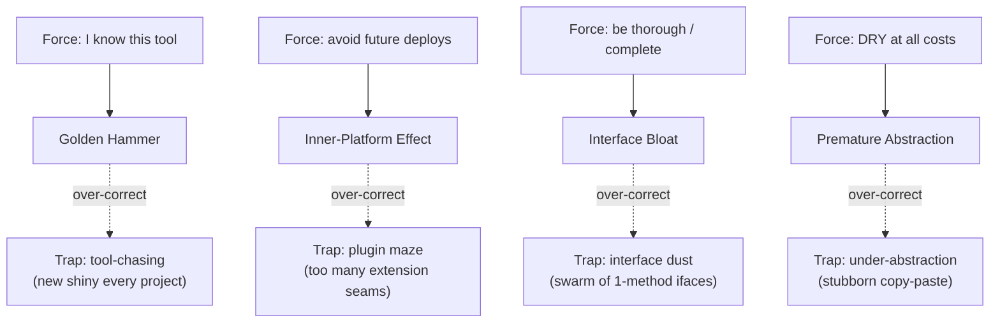

# Abstraction Failures Anti-Patterns — Middle Level

> **Category:** [Design Anti-Patterns](../README.md) → **Abstraction Failures** — *the chosen abstraction fights the problem instead of fitting it.*
> **Covers (collectively):** Golden Hammer · Inner-Platform Effect · Interface Bloat · Premature Abstraction

---

## Table of Contents

1. [Introduction](#introduction)
2. [Prerequisites](#prerequisites)
3. [The Real Question: When Does This Creep In?](#the-real-question-when-does-this-creep-in)
4. [Golden Hammer — Widening the Toolkit Without Chasing Novelty](#golden-hammer--widening-the-toolkit-without-chasing-novelty)
5. [Inner-Platform Effect — Use the Platform, Build Minimal Extensibility](#inner-platform-effect--use-the-platform-build-minimal-extensibility)
6. [Interface Bloat — Segregation Without Fragmentation](#interface-bloat--segregation-without-fragmentation)
7. [Premature Abstraction — The Rule of Three (and Not Under-Abstracting)](#premature-abstraction--the-rule-of-three-and-not-under-abstracting)
8. [Catching Abstraction Failures in Review](#catching-abstraction-failures-in-review)
9. [Tooling That Helps](#tooling-that-helps)
10. [Common Mistakes](#common-mistakes)
11. [Test Yourself](#test-yourself)
12. [Cheat Sheet](#cheat-sheet)
13. [Summary](#summary)
14. [Further Reading](#further-reading)
15. [Related Topics](#related-topics)

---

## Introduction

> Focus: **When does this creep in?** and **What do I do instead?**

At the junior level you learned to *recognize* the four abstraction failures. The deeper truth is that every one of them is the result of a **judgement made too early or with too narrow a view** — not of laziness or carelessness. The engineer who reaches for the same framework on every project is *confident*. The one who builds a configurable rule engine is *thorough*. The one who writes a fat interface is *being complete*. The one who extracts a base class on the first feature is *being DRY*. Each is a virtue overshooting its target.

The middle-level skill is calibration: knowing **how much abstraction the problem has actually earned**, and recognizing the force pushing you past that line before you cross it. This file pairs each anti-pattern with the *force* behind it, the *countermove*, and — most important — **the trap on the other side**, because the cure for each of these failures has its own failure mode. Over-correct and you trade Golden Hammer for shallow tool-chasing, Inner-Platform for a maze of plugins, Interface Bloat for a swarm of one-method interfaces, and Premature Abstraction for stubborn copy-paste.

---

## Prerequisites

- **Required:** Comfortable reading [`junior.md`](junior.md) — you can identify all four anti-patterns by sight.
- **Required:** You have shipped code that you (or a teammate) later had to *change*, and felt where the abstraction helped or hurt.
- **Helpful:** Familiarity with the [SOLID principles](../../../../../Architecture/README.md), especially the Interface Segregation and Dependency Inversion ideas.
- **Helpful:** Working knowledge of [Refactoring techniques](../../../refactoring/02-refactoring-techniques/README.md) — Extract Interface, Inline, Extract Superclass and their *reverse* moves.
- **Helpful:** You have read or skimmed the sibling category [Over-Engineering](../../01-development/03-over-engineering/middle.md), where **Speculative Generality** and **Soft Coding** are close cousins of these patterns.

---

## The Real Question: When Does This Creep In?

Abstraction failures have recognizable triggers. Name the moment and you can intervene while the change is still one method, one interface, one config key:

| Trigger | What you feel | What you do | Which anti-pattern |
|---|---|---|---|
| **"I know this tool cold"** | Confidence, momentum | Force the problem into your favorite tool | Golden Hammer |
| **"Stakeholders might want to change the rules"** | A wish to never deploy again | Build a config/DSL/rule engine | Inner-Platform Effect |
| **"The interface should be complete"** | A desire to be thorough | Add every method an implementer *might* need | Interface Bloat |
| **"Don't repeat yourself — extract it now"** | Pride in DRY | Create a base class/strategy on the first or second case | Premature Abstraction |
| **"Just one more option"** | Avoiding a code change | Add a flag/parameter to the config schema | Inner-Platform Effect |
| **"They're almost the same"** | Pattern-matching | Abstract two superficially-similar things | Premature Abstraction |

The common thread: **abstraction is a bet on the future, paid for in the present.** Each pattern over-bets. The middle engineer learns to size the bet to the evidence on hand — and to recognize that *not* betting (staying concrete, using the platform, keeping the interface small) is usually the cheaper, more reversible move.



Read the diagram as a balance beam: every cure has a far edge you can fall off. The rest of this file is about staying in the middle.

---

## Golden Hammer — Widening the Toolkit Without Chasing Novelty

### The force behind it

> *"I suppose it is tempting, if the only tool you have is a hammer, to treat everything as if it were a nail."* — Abraham Maslow

Golden Hammer is **competence curdling into reflex**. You reach for Kafka because you shipped Kafka, for inheritance because OOP class taught inheritance, for a graph database because the last project used one. The tool isn't wrong in general — it's wrong *here*, applied without asking what *here* needs.

The deeper force is **risk aversion disguised as expertise**: a familiar tool feels safe, a new evaluation feels expensive. So the cost of a poor fit gets paid silently, forever, instead of the one-time cost of learning the right tool.

### The countermove: widen the toolkit, let the problem choose

```python
# Golden Hammer: every lookup becomes a SQL round-trip because "we have Postgres"
def is_rate_limited(user_id: str) -> bool:
    row = db.execute(
        "SELECT count, window_start FROM rate_limits WHERE user_id = %s", (user_id,)
    ).fetchone()
    # ... read-modify-write a counter in a relational table, per request
```

```python
# Fit the tool to the access pattern: a counter with TTL is what Redis is *for*.
def is_rate_limited(user_id: str) -> bool:
    key = f"rl:{user_id}"
    count = redis.incr(key)
    if count == 1:
        redis.expire(key, 60)        # atomic counter + expiry, no row contention
    return count > 100
```

The fix wasn't "use Redis for everything" — it was **matching the data structure to the access pattern**. The countermove has three moves:

1. **Name the problem's shape before naming the tool.** Is this a *counter with expiry*, a *queue*, a *graph traversal*, a *full-text search*? The shape, not your résumé, picks the tool.
2. **Keep a deliberately diverse mental catalog.** Read about tools you *won't* use this quarter so they're available when the shape changes. A reviewer who can say "this is actually a state machine, not a pile of booleans" prevents a hammer-swing.
3. **Cost the misfit explicitly.** "Postgres works but costs a row-lock per request at our QPS" turns an invisible tax into a line item a team can weigh.

### THE TRAP: tool-chasing

Over-correcting Golden Hammer produces **Résumé-Driven Development** — adopting a new framework, language, or datastore *because it's novel*, not because the problem demands it. That is just Golden Hammer with the polarity reversed: novelty becomes the reflex instead of familiarity.

> **The discipline is the same in both directions:** the *problem* selects the tool, not your comfort and not your curiosity. Widen the toolkit so you *have* the right tool; reach for it only when the problem's shape calls for it. A boring, well-understood tool that fits beats an exciting one that almost fits.

---

## Inner-Platform Effect — Use the Platform, Build Minimal Extensibility

### The force behind it

The Inner-Platform Effect is **the dream of never deploying again**. "If we make it configurable, the business can change the rules without engineering." So a config file grows conditionals, then expressions, then a mini-language — until you have reinvented, badly, the programming language you were already using, plus an interpreter, plus a debugger you don't have.

The classic tell is a database table or YAML file that stores *behavior* rather than *data*: a `rules` table with `if_column`, `operator`, `value`, `then_action`. You have built a worse copy of the host platform's `if`.

```java
// Inner-Platform Effect: a hand-rolled rule "engine" interpreting stringly-typed rules
class RuleEngine {
    List<Map<String, String>> rules;   // [{field, op, value, action}, ...]
    String evaluate(Order order) {
        for (Map<String, String> r : rules) {
            Object fieldVal = reflectivelyGet(order, r.get("field"));   // reflection!
            if (compare(fieldVal, r.get("op"), r.get("value"))) {       // string-typed ops
                return r.get("action");                                  // string-typed dispatch
            }
        }
        return "default";
    }
    // compare() now reimplements ==, <, >, contains... an interpreter is being born.
}
```

Every feature request ("add a `between` operator", "allow AND of two conditions") forces you to extend the interpreter — slower, buggier, and less debuggable than the `if` statement it replaced.

### The countermove: use the host platform; expose plugins, not a DSL

```java
// Use the platform. Rules are *code* — typed, testable, debuggable, version-controlled.
interface DiscountRule { Optional<Discount> apply(Order order); }

class BulkDiscount implements DiscountRule {
    public Optional<Discount> apply(Order o) {
        return o.itemCount() >= 10 ? Optional.of(Discount.percent(15)) : Optional.empty();
    }
}

class DiscountEngine {
    private final List<DiscountRule> rules;   // injected; each rule is a real class
    DiscountEngine(List<DiscountRule> rules) { this.rules = rules; }
    List<Discount> applicableTo(Order o) {
        return rules.stream().map(r -> r.apply(o)).flatMap(Optional::stream).toList();
    }
}
```

The decision rule:

1. **Default to code.** Conditions, dispatch, and arithmetic are what your language already does well, with a type checker and a debugger. Putting them in a table loses all three.
2. **If non-engineers genuinely need to change behavior, expose a narrow plugin seam**, not a general-purpose interpreter. A registry of named, typed strategies (above) is configuration of *which* behaviors run — not invention of *new* behavior in strings.
3. **Configuration is for data, not control flow.** Thresholds, feature toggles, endpoints, copy text → config. Branching, loops, expressions → code. The moment your config grows an operator, you are building an inner platform.

### THE TRAP: the plugin maze

Over-correcting — making *everything* a pluggable seam — produces its own failure: a system where you cannot read a single straight-line path because every step is an indirection through a registry, and "where does X actually happen?" takes an hour to answer. This is **Speculative Generality** (see [Over-Engineering](../../01-development/03-over-engineering/middle.md)) wearing a plugin badge.

> **The balance:** build extensibility for the variation you *have evidence for* (two real discount rules → an interface; one → just a method). Use the platform for everything else. Minimal extensibility means *one well-placed seam*, not a seam at every joint. Note how closely this overlaps **Soft Coding** — pushing logic into configuration to avoid recompiling — which the Over-Engineering category treats as a first-class anti-pattern.

---

## Interface Bloat — Segregation Without Fragmentation

### The force behind it

Interface Bloat is **the urge to be complete**. You design `Repository` and, wanting it to be "fully featured," give it `findAll`, `findById`, `save`, `delete`, `count`, `exists`, `findPaged`, `bulkInsert`, `stream`, `lock`… Then the read-only reporting implementation is forced to declare `save` and `delete` it can never honor, throwing `UnsupportedOperationException`. The interface lies: it promises behaviors its implementers cannot deliver.

```go
// Interface Bloat: no realistic implementer supports all of this
type Storage interface {
    Read(key string) ([]byte, error)
    Write(key string, val []byte) error
    Delete(key string) error
    List(prefix string) ([]string, error)
    Watch(key string) (<-chan Event, error)   // only the etcd impl can do this
    Transaction(fn func(Tx) error) error       // only the SQL impl can do this
    Backup(w io.Writer) error                   // only the file impl can do this
}
```

The S3 implementation can't `Watch`. The in-memory test double doesn't want `Backup`. Everyone implements stubs that panic — the type system has been turned into a liar.

### The countermove: Interface Segregation into *role* interfaces

The Interface Segregation Principle says **no client should be forced to depend on methods it does not use.** Split the fat interface along *how it is actually consumed*:

```go
// Role interfaces: each named after what a *client* needs
type Reader interface { Read(key string) ([]byte, error) }
type Writer interface { Write(key string, val []byte) error }
type Watcher interface { Watch(key string) (<-chan Event, error) }

// Clients depend on the narrow role they use:
func renderReport(r Reader) { /* only reads */ }

// An implementation may satisfy several roles; composition stays available:
type ReadWriter interface { Reader; Writer }   // compose when a client truly needs both
```

```python
# Python via Protocols — structural, role-based, no inheritance ceremony
from typing import Protocol

class Reader(Protocol):
    def read(self, key: str) -> bytes: ...

class Writer(Protocol):
    def write(self, key: str, val: bytes) -> None: ...

def render_report(store: Reader) -> str:        # depends only on the read role
    ...
```

The moves:

1. **Name interfaces after the client's need, not the implementer's capability.** `Reader`, `Authorizer`, `Closer` — verbs a caller wants. Not `UserManagerInterface` listing everything a user manager *can* do.
2. **Look for `UnsupportedOperationException` / `panic("not implemented")` / `raise NotImplementedError`** — each is a confession that an implementer was forced to promise something it can't do. That method belongs in a separate role.
3. **Compose roles when a real client needs the combination** (`ReadWriter`) — composition is cheap and keeps the small pieces reusable.

### THE TRAP: interface dust (fragmentation)

Apply ISP too zealously and you shatter every interface into single-method fragments — `Reader`, `Closer`, `Flusher`, `Resetter`, `Validator`, `Namer` — so a class declares `implements Reader, Closer, Flusher, Resetter, Validator, Namer` and the reader can't see the *concept* for the fragments. This is the dual failure: the design is now correct per-method but incoherent as a whole.

> **The balance: segregate by client role, not by individual method.** Go's `io.ReadWriteCloser` is the model — small interfaces (`Reader`, `Writer`, `Closer`) *because real clients use exactly those slices*, composed when a client wants more. If two methods are *always used together by every client*, they belong in one interface; splitting them is fragmentation, not segregation. Let the actual usage sites — not a mechanical "one method per interface" rule — draw the lines.

---

## Premature Abstraction — The Rule of Three (and Not Under-Abstracting)

### The force behind it

Premature Abstraction is **DRY fired too early**. You see two methods that look similar, or you *anticipate* a second payment provider, and you extract a base class / strategy / factory *now* — guessing the shape of variation before any real second case exists. The guess is almost always wrong, because you abstracted over **incidental** similarity (the code looks alike today) instead of **essential** similarity (the cases will truly vary along this axis).

```python
# Premature: one real exporter, but already a base class guessing the variation axis
class Exporter(ABC):
    @abstractmethod
    def header(self) -> str: ...
    @abstractmethod
    def row(self, item) -> str: ...
    @abstractmethod
    def footer(self) -> str: ...
    def export(self, items):                  # template method built for imagined formats
        return self.header() + "".join(self.row(i) for i in items) + self.footer()

class CsvExporter(Exporter):                  # the ONLY implementation that exists
    def header(self): return "name,price\n"
    def row(self, i): return f"{i.name},{i.price}\n"
    def footer(self): return ""               # CSV has no footer — the shape doesn't fit
```

The abstraction invented a `header/row/footer` axis. When the real second format (PDF) arrives, it needs pagination and styling — the guessed axis doesn't fit, so now you fight the abstraction *and* add the feature.

### The countermove: the Rule of Three

> **Write it concretely the first time. Tolerate the duplication the second time. Extract the abstraction on the third — when three real cases reveal the true axis of variation.**

```python
# First case: just write it. Concrete, obvious, easy to change.
def export_csv(items) -> str:
    return "name,price\n" + "".join(f"{i.name},{i.price}\n" for i in items)

# Second case appears: duplicate, but now NOTE what actually differs.
def export_tsv(items) -> str:
    return "name\tprice\n" + "".join(f"{i.name}\t{i.price}\n" for i in items)

# Third case (JSON, with a totally different shape) reveals the real axis is
# "serialize a list of records" — NOT "header/row/footer". Now extract correctly:
def export(items, serializer) -> str:          # serializer is the true variation point
    return serializer(items)
```

Why three?

1. **One case** gives you *no* information about what varies — any abstraction is a pure guess.
2. **Two cases** can mislead: they may differ along an *incidental* axis. Two is the danger zone where DRY pressure is strongest and the data is weakest.
3. **Three cases** are usually enough to distinguish the essential axis of variation from the accidental one. The abstraction now *describes* reality instead of *predicting* it.

The Rule of Three also tells you *what* to abstract: the thing that is **the same** across all three is the abstraction; the thing that **differs** is the parameter/strategy/hook.

### THE TRAP: under-abstraction

The Rule of Three is a guard against *premature* abstraction — it is **not** a license to never abstract. The opposite failure is real and costly: the same bug-prone logic copy-pasted into the fourth, fifth, sixth place, each copy drifting until a fix in one isn't applied to the others. That is **DRY's actual target**, and refusing to abstract a genuinely-repeated, genuinely-uniform concept is its own anti-pattern.

> **The balance:**
> - **Three concrete instances along the same axis** → extract. Waiting for a fourth is now *under*-abstraction.
> - **Two instances** → duplicate deliberately and *watch the axis* — note in a comment or your head what differs, so the third instance tells you the shape.
> - **One instance** → write it concretely; an abstraction here is a guess.
>
> The Rule of Three governs *timing*, not *whether*. The goal is to abstract **once you can see the real shape** — neither before (Premature Abstraction) nor long after (copy-paste rot).

---

## Catching Abstraction Failures in Review

Review is the cheapest place to catch these, because the abstraction is still one PR — not load-bearing for ten modules. Practical reviewer questions:

- **"Why this tool/pattern here?"** If the answer is "it's what we always use" with no fit argument → Golden Hammer. Ask what the problem's *shape* is.
- **"Is this config storing data or behavior?"** Operators, conditions, or expressions in YAML/DB → Inner-Platform Effect. Ask whether code would be clearer.
- **"Which client uses *all* these interface methods?"** "None" → Interface Bloat. Ask which methods cluster by caller.
- **"How many real, concrete cases exist for this base class?"** Fewer than three → Premature Abstraction. Ask whether duplication for now is cheaper.
- **"Where does X actually happen?"** If tracing one behavior requires hopping through five registries/plugins → the plugin-maze trap. Ask whether the seam earns its keep.
- **"Is this the *fourth* copy of the same block?"** Yes, and it's drifting → under-abstraction; now is the time to extract.

As an *author*, pre-empt these: prefer the concrete, platform-native, narrow version, and let the reviewer push you *up* the abstraction ladder only with evidence. It is far easier to add abstraction later than to remove it once code depends on it.

---

## Tooling That Helps

Tooling can't make the judgement call, but it can point your attention:

| Signal | Tooling | Suggests |
|---|---|---|
| `UnsupportedOperationException` / `NotImplementedError` / `panic("not implemented")` | grep, linters | Interface Bloat — an implementer forced to lie |
| Interfaces with many methods, few callers per method | IDE "find usages", `go vet`, ArchUnit (Java) | Interface Bloat |
| Abstract class with a single concrete subclass | IDE inspections, IntelliJ "single implementor" | Premature Abstraction / Boat Anchor |
| Reflection driving control flow from strings | static analysis, code search | Inner-Platform Effect |
| Duplicated blocks across files | `jscpd`, PMD CPD, `dupl` (Go), `pylint --disable=all -e R0801` | Under-abstraction (real DRY candidate) |
| Same dependency added on every new service | dependency graph review | Golden Hammer / résumé-driven |

```bash
# Go: find duplicated code blocks (under-abstraction candidates)
go run github.com/mibk/dupl@latest -threshold 50 ./...

# Search across a codebase for the Interface-Bloat confession
grep -rn "UnsupportedOperationException\|NotImplementedError\|not implemented" src/
```

> **Caution:** every signal here is a *candidate*, not a verdict. A single-implementor interface can be a justified test seam; a "duplicated" block may be coincidental and should *not* be merged. Tools find the spots; you decide.

---

## Common Mistakes

1. **Treating the cure as a new reflex.** Swapping "always use my favorite tool" for "always use the trendy tool" is still Golden Hammer. The fix is *let the problem choose*, not *choose differently*.
2. **Abstracting on two cases because "the third is obviously coming."** Anticipation is a guess. Wait for the third *actual* case; the imagined one rarely matches the real one.
3. **Splitting one fat interface into one-method-per-interface dust.** Segregate by *client role*, not by counting methods. Methods every client uses together stay together.
4. **Pushing control flow into config to "avoid deploys."** You don't avoid the work — you relocate it into a stringly-typed interpreter with no type checker and no debugger. That's Inner-Platform / Soft Coding.
5. **Citing the Rule of Three to justify never abstracting.** The fourth drifting copy of a real, uniform concept is under-abstraction — the very thing DRY exists to prevent.
6. **Confusing a justified seam with a Boat Anchor.** An interface with one implementation is fine *if it serves a test double or a published contract today*; it's premature only if it exists for an imagined future.
7. **Removing abstraction is harder than adding it.** Once ten modules depend on your guessed base class, walking it back is a migration. Bias toward concrete first precisely because the concrete-to-abstract move is the cheap direction.

---

## Test Yourself

1. Your team reaches for Kafka on a feature that needs an in-process work queue of a few hundred items. Name the anti-pattern and the question that should have been asked first.
2. A product manager asks for a "rules table" so non-engineers can change which orders get free shipping. What's the risk, and what's the narrower alternative that still gives them flexibility?
3. You see a `Repository` interface where the read-only reporting implementation throws `UnsupportedOperationException` on `save()` and `delete()`. What principle is violated, and how do you split it *without* creating interface dust?
4. You have written the same export function for CSV and TSV. A colleague says "extract a base `Exporter` class now." Why might you wait, and what would you watch for?
5. Distinguish the Golden Hammer trap from its over-correction. What single discipline resolves *both*?
6. When is refusing to abstract repeated code itself an anti-pattern, and what's the threshold that tips it?

<details>
<summary>Answers</summary>

1. **Golden Hammer.** Kafka is reached for out of familiarity, not fit. The first question is *what shape is this problem?* — it's a small in-process queue, served by a channel/`BlockingQueue`/in-memory list, with no broker, partitions, or operational overhead. Match the tool to the access pattern, not to the résumé.
2. **Inner-Platform Effect (and Soft Coding).** A rules table storing conditions/operators/actions reinvents `if` as a stringly-typed interpreter — slow, untyped, undebuggable, and it grows an operator with every request. The narrower alternative: a registry of named, typed strategy classes (`FreeShippingRule` implementations) where config selects *which* rule runs, not *invents* new logic. Behavior stays in code; data/toggles stay in config.
3. **Interface Segregation Principle.** The fat interface forces implementers to promise methods they can't honor. Split into **role interfaces named after client needs** — `Reader`/`Writer`/`Deleter` — and compose (`ReadWriter`) where a real client uses the combination. Avoid dust by segregating along *how clients actually consume it*, not by mechanically making one interface per method; methods every caller uses together stay together.
4. **Rule of Three.** Two cases can be similar along an *incidental* axis; abstracting now risks guessing the wrong variation point (e.g., a `header/row/footer` template that won't fit the third format). Duplicate deliberately and **watch what actually differs** between CSV and TSV; the third format usually reveals the true axis (e.g., "serialize records with a delimiter/serializer"), and *then* you extract correctly.
5. The trap is **tool-chasing / résumé-driven development** — reflexively grabbing the *novel* tool — which is Golden Hammer with reversed polarity. The single discipline that resolves both: **the problem's shape selects the tool**, not your comfort and not your curiosity. Widen the toolkit so the right tool is available; reach for it only when the shape calls for it.
6. **Under-abstraction** becomes an anti-pattern when a genuinely-uniform, genuinely-repeated concept has been copy-pasted and the copies start to **drift** (a fix in one isn't applied to the others). The threshold is the **third concrete instance along the same axis** — at three, the real shape is visible and extracting is correct; refusing past that point is the copy-paste rot DRY exists to prevent.

</details>

---

## Cheat Sheet

| Anti-pattern | Creeps in when… | Countermove | The trap on the far side |
|---|---|---|---|
| **Golden Hammer** | "I know this tool cold" | Name the problem's *shape*; let it pick the tool; cost the misfit | Tool-chasing / résumé-driven dev — *problem picks the tool, both ways* |
| **Inner-Platform Effect** | "Make it configurable so we never deploy" | Use the host platform; config for data, code for control flow; narrow plugin seam if needed | Plugin maze — extensibility at every joint hides the real path |
| **Interface Bloat** | "The interface should be complete" | ISP: role interfaces named after client needs; compose when a client needs the combo | Interface dust — one-method fragments; segregate by *role*, not by method |
| **Premature Abstraction** | "DRY — extract it now" | Rule of Three: concrete (1), duplicate + watch (2), extract (3) | Under-abstraction — copy-paste rot; three same-axis copies → extract |

**Three golden rules:**
- *The problem's shape chooses the tool, the platform, the abstraction — not your comfort, curiosity, or completeness instinct.*
- *Every cure has a far edge; aim for the middle, not the opposite extreme.*
- *Concrete-to-abstract is the cheap direction; bias toward the concrete and let evidence push you up.*

---

## Summary

- All four abstraction failures are **a virtue overshooting**: expertise (Golden Hammer), thoroughness (Interface Bloat), foresight (Inner-Platform), and DRY (Premature Abstraction). The middle skill is **calibrating to the evidence the problem has actually provided**.
- **Golden Hammer**: let the problem's *shape* — counter, queue, graph, search — pick the tool; widen your toolkit so the right tool is available; cost the misfit out loud. Trap: tool-chasing — the same reflex with novelty instead of familiarity.
- **Inner-Platform Effect**: use the host platform; config holds *data*, code holds *control flow*; if non-engineers need flexibility, expose a narrow typed plugin seam, not a DSL. Trap: a plugin maze where nothing is traceable. Overlaps **Soft Coding / Speculative Generality** in [Over-Engineering](../../01-development/03-over-engineering/middle.md).
- **Interface Bloat**: apply ISP — split into **role interfaces named after client needs**, compose when a real client needs the combination, and treat `UnsupportedOperationException` as a confession. Trap: interface dust from segregating per-method instead of per-role.
- **Premature Abstraction**: follow the **Rule of Three** — concrete first, duplicate-and-watch second, extract third when the true axis of variation is visible. Trap: under-abstraction — copy-paste rot when you stop *before* genuinely-repeated logic is unified.
- **Review and tooling** surface candidates (lone-implementor interfaces, `not implemented` stubs, config-driven control flow, drifting duplicates); judgement decides.
- Next: [`senior.md`](senior.md) — migrating an entrenched inner platform or fat interface at scale, and the architectural forces that breed these failures.

---

## Further Reading

- **AntiPatterns** — Brown, Malveau, McCormick, Mowbray (1998) — the Golden Hammer, and the catalog this category draws from.
- **Clean Code** — Robert C. Martin (2008) — Interface Segregation Principle and the cost of fat interfaces.
- **Refactoring** — Martin Fowler (2nd ed., 2018) — Extract Interface, Extract Superclass, *Inline*, and Replace Conditional with Polymorphism — plus the reverse moves for walking back a premature abstraction.
- **The Pragmatic Programmer** — Hunt & Thomas (20th anniv. ed., 2019) — DRY (its *real* target), orthogonality, and "tracer bullets" over speculative generality.
- **Patterns of Enterprise Application Architecture** — Martin Fowler (2002) — when a plugin/strategy seam is genuinely warranted versus invented.

---

## Related Topics

- [Clean Code → Classes](../../../clean-code/09-classes/README.md) — Interface Segregation and cohesion in depth.
- [Refactoring → Refactoring Techniques](../../../refactoring/02-refactoring-techniques/README.md) — Extract Interface/Superclass and their reverse moves, the mechanics behind the Rule of Three.
- [Design Patterns → Strategy / Factory](../../../design-patterns/README.md) — the positive counterparts a plugin seam should use instead of a hand-rolled interpreter.
- [Over-Engineering](../../01-development/03-over-engineering/middle.md) — sibling category; **Speculative Generality** and **Soft Coding** are the close cousins of Premature Abstraction and Inner-Platform Effect.
- [Coupling & State](../02-coupling-and-state/README.md) and [OO Misuse](../01-oo-misuse/README.md) — the other two Design anti-pattern categories.
