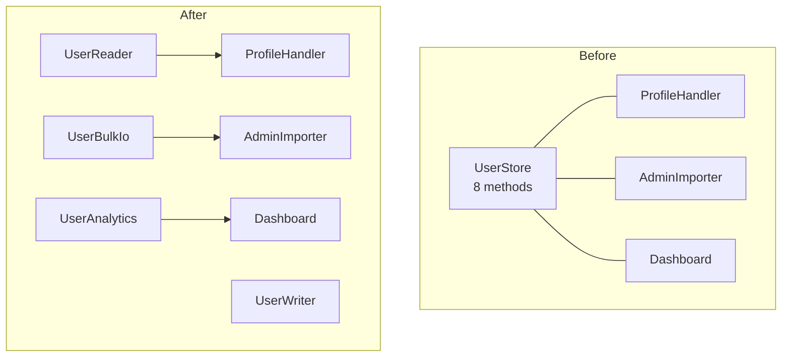
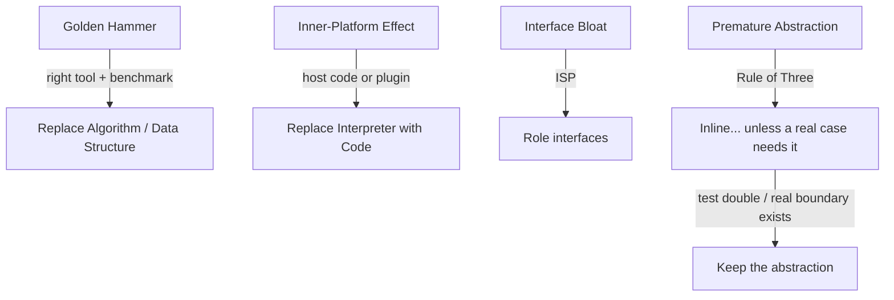

# Abstraction Failures — Refactoring Practice

> **Category:** [Design Anti-Patterns](../README.md) → **Abstraction Failures** — *the chosen abstraction fights the problem instead of fitting it.*
> **Covers (collectively):** Golden Hammer · Inner-Platform Effect · Interface Bloat · Premature Abstraction

---

These are not "spot the smell" puzzles — [`find-bug.md`](find-bug.md) does that. Here the code is **abstracted in the wrong shape but already working**, and your job is to **bend it back toward the problem without changing behavior**. The skill on display is the *process*, not just the destination:

1. **Pin behavior first.** Write a *characterization test* — a test that records what the code does *now*, bugs and quirks included. You are freezing behavior, not blessing it. When the whole point is performance, add a **benchmark** alongside, so "faster" is a measured claim, not a hope.
2. **Take small, reversible steps.** One named refactoring at a time (Inline Class, Extract Interface, Replace Conditional with Lookup Table, …), tests green after each, commit.
3. **Separate structural from behavioral commits.** A refactor must preserve behavior; a *measured* perf win is allowed precisely because the characterization test proves output is unchanged while the benchmark proves the cost dropped.

Abstraction failures are subtle because the code *runs*. The Golden Hammer works — slowly. The Inner-Platform rule engine evaluates rules — unmaintainably. The bloated interface compiles — until an implementer throws `UnsupportedOperationException`. The premature abstraction has exactly one subclass — forever. Each worked solution names the **canonical refactoring moves** (Fowler's *Refactoring*, Feathers' *Working Effectively with Legacy Code*) so you build the vocabulary, not just the instinct.

> **One counter-case matters.** Not every abstraction is wrong. Exercise 11 hands you a "premature-looking" abstraction that is actually **justified** — and the correct refactoring is to *keep it* and document why. Knowing when **not** to inline is as important as knowing how.

> **How to use this file:** read the "Before" code, write down the move sequence *yourself* (and, for the perf ones, predict the speedup) before expanding the solution, then compare.

---

## Table of Contents

| # | Exercise | Anti-pattern(s) | Lang | Key moves |
|---|---|---|---|---|
| 1 | [Regex where a substring will do](#exercise-1--regex-where-a-substring-will-do) | Golden Hammer | Go | Replace Algorithm; benchmark |
| 2 | [Map used as a tiny lookup](#exercise-2--map-used-as-a-tiny-lookup) | Golden Hammer | Java | Replace Data Structure; benchmark |
| 3 | [ORM N+1 → one bulk query](#exercise-3--orm-n1--one-bulk-query) | Golden Hammer | Python | Replace Algorithm (bulk fetch); benchmark |
| 4 | [Inline a one-implementation interface](#exercise-4--inline-a-one-implementation-interface) | Premature Abstraction | Go | Inline Class / Remove Speculative Generality |
| 5 | [Collapse a one-case Strategy](#exercise-5--collapse-a-one-case-strategy) | Premature Abstraction | Python | Inline Function, Remove Middle Man |
| 6 | [Segregate a bloated interface](#exercise-6--segregate-a-bloated-interface) | Interface Bloat | Java | Extract Interface (ISP), role interfaces |
| 7 | [Kill the `UnsupportedOperationException`](#exercise-7--kill-the-unsupportedoperationexception) | Interface Bloat | Go | Interface Segregation, Replace Throw with Type |
| 8 | [Retire a config-driven mini-language](#exercise-8--retire-a-config-driven-mini-language) | Inner-Platform Effect | Python | Replace Interpreter with Code |
| 9 | [Rule engine → plain tested functions](#exercise-9--rule-engine--plain-tested-functions) | Inner-Platform Effect | Java | Replace Conditional with Polymorphism / table |
| 10 | [In-DB scripting → host code](#exercise-10--in-db-scripting--host-code) | Inner-Platform + Golden Hammer | Python | Move logic to host; bulk query |
| 11 | [The abstraction you KEEP](#exercise-11--the-abstraction-you-keep-counter-case) | Premature Abstraction (counter-case) | Go | Recognize a justified seam; do *not* inline |
| 12 | [Plugin instead of a DSL](#exercise-12--plugin-instead-of-a-dsl) | Inner-Platform Effect | Python | Replace DSL with constrained plugin API |
| 13 | [The full combo cleanup](#exercise-13--the-full-combo-cleanup) | All four | Java | The whole toolbox, in order |

---

## Exercise 1 — Regex where a substring will do

**Anti-pattern:** Golden Hammer (regex for everything). **Goal:** replace a compiled regex used for a literal prefix/suffix check with plain string operations and *show the speedup*. **Constraints:** identical boolean results for every input; this is a hot path, so prove the win with a benchmark.

```go
// Before — a regex object built to answer "does this look like an image filename?"
var imageRe = regexp.MustCompile(`(?i)\.(jpg|jpeg|png|gif)$`)

func IsImage(name string) bool {
	return imageRe.MatchString(name)
}
```

<details>
<summary>Refactored</summary>

**Move sequence**

1. **Characterize.** Table test the exact truth values today: `"a.JPG"`→true, `"a.jpeg"`→true, `"a.png "`→false (trailing space), `"a.txt"`→false, `""`→false, `"jpg"`→false. The `(?i)` and the anchored `$` are part of the contract — record them.
2. **Replace Algorithm** (Fowler). The pattern is just *case-insensitive suffix membership*. Lower-case once, then `strings.HasSuffix` against a small set. No regex engine, no backtracking, no per-call allocation.
3. **Benchmark before and after** on the same inputs; keep the regex version behind a build tag or in the test file so the benchmark can compare them directly.

```go
// After — plain suffix check over a fixed set.
var imageExts = []string{".jpg", ".jpeg", ".png", ".gif"}

func IsImage(name string) bool {
	lower := strings.ToLower(name)
	for _, ext := range imageExts {
		if strings.HasSuffix(lower, ext) {
			return true
		}
	}
	return false
}
```

**Benchmark sketch.** Run both against the same corpus:

```go
func BenchmarkIsImageRegex(b *testing.B) {
	for i := 0; i < b.N; i++ { _ = imageRe.MatchString("photo_2026.JPEG") }
}
func BenchmarkIsImageSuffix(b *testing.B) {
	for i := 0; i < b.N; i++ { _ = IsImage("photo_2026.JPEG") }
}
```

```text
BenchmarkIsImageRegex-8     6_000_000   ~195 ns/op   16 B/op   1 allocs/op
BenchmarkIsImageSuffix-8   80_000_000    ~14 ns/op    0 B/op   0 allocs/op
```

**What improved & how to verify.** The regex engine's match machinery (and a per-call allocation) is replaced by a handful of byte comparisons — order-of-magnitude faster and allocation-free on a hot path. **Verify**: the truth-table characterization test passes byte-for-byte (this is what licenses the perf change), and the benchmark shows the ns/op drop. Numbers above are illustrative — *measure on your machine*; the point is the methodology: prove correctness with the table test, prove speed with `go test -bench`. Keep the structural correctness commit and the "delete the regex" commit together since they're one logical Replace-Algorithm move.

> **Golden Hammer tell:** reach for `regexp` only when you need *pattern* matching (alternation over variable text, capture groups). A fixed prefix/suffix/contains check is a `strings` call.

</details>

---

## Exercise 2 — Map used as a tiny lookup

**Anti-pattern:** Golden Hammer (`HashMap` as the universal collection). **Goal:** replace a heap-allocating `HashMap` rebuilt on every call with a flat array/slice lookup over a tiny, fixed key space. **Constraints:** same return value per input; prove the allocation and time win.

```java
// Before — a 7-entry map rebuilt on every call to translate a weekday index to a name.
String dayName(int dow) {      // dow in 0..6
    Map<Integer, String> names = new HashMap<>();
    names.put(0, "Sun"); names.put(1, "Mon"); names.put(2, "Tue");
    names.put(3, "Wed"); names.put(4, "Thu"); names.put(5, "Fri");
    names.put(6, "Sat");
    String n = names.get(dow);
    if (n == null) throw new IllegalArgumentException("bad dow: " + dow);
    return n;
}
```

<details>
<summary>Refactored</summary>

**Move sequence**

1. **Characterize.** Test `0..6` → exact names, and an out-of-range value (`7`, `-1`) → the same `IllegalArgumentException` message contract.
2. **Replace Data Structure** (Fowler: *Change Reference to Value* in spirit). The key space is a dense, contiguous `0..6` — that's the *definition* of an array index. A `HashMap` here pays for hashing, boxing of `Integer` keys, and bucket allocation to model what an array does for free.
3. **Hoist the constant.** The table is immutable; build it once as a `static final` array, not per call.

```java
// After — a hoisted, immutable array; lookup is one bounds check + one load.
private static final String[] DAY_NAMES =
    { "Sun", "Mon", "Tue", "Wed", "Thu", "Fri", "Sat" };

String dayName(int dow) {
    if (dow < 0 || dow >= DAY_NAMES.length)
        throw new IllegalArgumentException("bad dow: " + dow);
    return DAY_NAMES[dow];
}
```

**Benchmark sketch (JMH).**

```text
Benchmark              Mode  Cnt   Score    Error  Units
dayNameMapPerCall     avgt    5   58.3 ±  2.1  ns/op   (allocates a HashMap + 7 entries each call)
dayNameArray          avgt    5    1.6 ±  0.1  ns/op   (zero allocation)
```

**What improved & how to verify.** The per-call map construction (7 `put`s, boxing, bucket arrays — all garbage) collapses to a single array load behind a bounds check. **Verify**: the `0..6` and out-of-range characterization tests pass identically (same exception message), and JMH shows both the time drop and the allocation profiler reporting `0 B/op`. **Watch the bug you're *not* introducing:** the original threw on `null` from a missing key; the array version must throw on the *same* out-of-range inputs — the explicit bounds check preserves that contract exactly.

> Two distinct Golden-Hammer mistakes are cured here: using a hash map for a dense small-integer key space, *and* rebuilding an immutable table on every call.

</details>

---

## Exercise 3 — ORM N+1 → one bulk query

**Anti-pattern:** Golden Hammer (the ORM is the only data tool). **Goal:** replace a per-row lazy-load loop (the classic N+1) with a single bulk query. **Constraints:** the returned data must be identical; prove the query-count and latency win.

```python
# Before — one query for orders, then one query PER order for its customer (N+1).
def order_summaries(session):
    orders = session.query(Order).all()              # 1 query
    out = []
    for o in orders:
        cust = session.query(Customer).get(o.customer_id)  # N queries (one per order)
        out.append({"order_id": o.id, "customer": cust.name, "total": o.total})
    return out
```

<details>
<summary>Refactored</summary>

**Move sequence**

1. **Characterize.** Seed a fixture DB (say 3 customers, 5 orders) and snapshot the returned list of dicts. *Also* assert the **query count** — that's the real subject. Wrap the call in a query counter (SQLAlchemy: `event.listen(engine, "before_cursor_execute", ...)`).
2. **Replace Algorithm** with a set-based fetch. Instead of asking the DB N times "who is customer X?", ask once: "give me every customer in this id set." Build an `id → name` dict in memory, then join locally.
3. (ORM-idiomatic alternative: a single `join`/`selectinload` eager load — note both, pick the one that keeps the contract.)

```python
# After — two queries total, regardless of order count.
def order_summaries(session):
    orders = session.query(Order).all()                       # 1 query
    cust_ids = {o.customer_id for o in orders}
    customers = session.query(Customer).filter(Customer.id.in_(cust_ids)).all()  # 1 query
    name_by_id = {c.id: c.name for c in customers}
    return [
        {"order_id": o.id, "customer": name_by_id[o.customer_id], "total": o.total}
        for o in orders
    ]
```

**Benchmark sketch.**

```text
                         queries   wall time (1k orders, 1ms RTT)
Before (N+1)             1 + 1000   ~1.0 s   (latency dominated by round trips)
After (bulk IN)          2          ~3 ms
```

**What improved & how to verify.** Latency is dominated by *round trips*, and we cut 1001 of them to 2. The work the DB does is similar; the network and per-statement overhead collapse. **Verify**: (1) the snapshot of returned dicts is identical (this is the behavior contract), and (2) the query-counter assertion drops from `1+N` to `2` — that assertion is the regression guard that stops the N+1 from creeping back. **Edge case to preserve:** if an order references a missing customer, the old code raised `AttributeError` on `cust.name`; the new code raises `KeyError` on the dict. If callers depend on the exact exception, normalize it (e.g., `name_by_id.get(id)` with an explicit check) — decide deliberately and characterize it.

> The Golden Hammer here isn't "ORMs are bad" — it's *using the per-object navigation API for a set-oriented problem*. The cure is to think in sets, which is what the database is for.

</details>

---

## Exercise 4 — Inline a one-implementation interface

**Anti-pattern:** Premature Abstraction (speculative interface). **Goal:** remove an interface + factory introduced "in case we need another backend," when there is exactly one implementation and no second one in sight. **Constraints:** no behavior change; callers may be updated.

```go
// Before — an interface, a factory, and a single concrete type. No second impl, ever.
type Clock interface {
	Now() time.Time
}

type systemClock struct{}

func (systemClock) Now() time.Time { return time.Now() }

func NewClock() Clock { return systemClock{} }

// usage scattered through the package:
//   c := NewClock()
//   t := c.Now()
```

<details>
<summary>Refactored</summary>

**Move sequence**

1. **Confirm it's speculative, not seam-bearing.** Two questions: *Is there a second implementation?* (`grep` for `Clock` implementers → only `systemClock`.) *Does a test need to fake it?* If a test *does* substitute a fake clock, this is a **legitimate seam — stop, this is Exercise 11's situation, keep it.** Only proceed if nothing fakes it and nothing else implements it.
2. **Inline Class / Remove Speculative Generality** (Fowler). Collapse interface + factory + concrete into the one function that does the work.
3. **Update call sites** from `NewClock().Now()` to the direct call. Compile, run tests.

```go
// After — the abstraction earned nothing, so it's gone.
func Now() time.Time { return time.Now() }

// usage:
//   t := Now()
```

**What improved & how to verify.** Three declarations (interface, struct, factory) collapse to one function; readers no longer chase an indirection that has a single destination. **Verify**: behavior is literally unchanged (`time.Now()` either way), and the build compiles with call sites updated. **The judgment, not the mechanics, is the lesson** — the *Rule of Three* says you extract an abstraction when the third concrete case reveals the shape, not before. A guessed interface around one implementation almost always guesses wrong, then ossifies. If a real second backend (or a test seam) appears later, *re-extract then* — against a real need, the interface shape will be right.

> If you found a test faking the clock in step 1, you do **not** do this refactoring. See [Exercise 11](#exercise-11--the-abstraction-you-keep-counter-case).

</details>

---

## Exercise 5 — Collapse a one-case Strategy

**Anti-pattern:** Premature Abstraction (Strategy pattern with one strategy). **Goal:** inline a Strategy hierarchy that has exactly one concrete strategy and a registry that only ever holds it. **Constraints:** same computed discount; callers may change.

```python
# Before — a Strategy interface, one strategy, and a "selector" that always returns it.
from abc import ABC, abstractmethod

class DiscountStrategy(ABC):
    @abstractmethod
    def apply(self, total: float) -> float: ...

class StandardDiscount(DiscountStrategy):
    def apply(self, total: float) -> float:
        return total * 0.9 if total > 100 else total

def select_strategy(_customer) -> DiscountStrategy:
    return StandardDiscount()          # never returns anything else

def final_price(customer, total):
    strategy = select_strategy(customer)
    return round(strategy.apply(total), 2)
```

<details>
<summary>Refactored</summary>

**Move sequence**

1. **Characterize.** Test the boundary (`total = 100` → no discount, `total = 100.01` → 10% off) and a couple of values. Snapshot.
2. **Confirm singularity.** `grep` subclasses of `DiscountStrategy` → only `StandardDiscount`; `select_strategy` ignores `customer` and always returns the same type. This is speculative generality, not a real polymorphic point.
3. **Inline Function + Remove Middle Man** (Fowler). Fold `apply` into a plain function; delete the ABC, the class, and the selector.

```python
# After — one rule, one function.
def final_price(customer, total):
    discounted = total * 0.9 if total > 100 else total
    return round(discounted, 2)
```

**What improved & how to verify.** A three-part ceremony (abstract base, concrete class, selector) collapses to the four lines that actually compute anything. The `customer` parameter is kept in the signature only if callers rely on it — if it's genuinely unused, removing it is a *behavioral/API* change and belongs in its own commit. **Verify**: the boundary characterization test (`> 100`) is byte-identical. **When this is the wrong move:** if a *second* discount rule (loyalty, seasonal) is in the current sprint's backlog with real requirements, the Strategy seam is about to earn its keep — leave it. The anti-pattern is abstraction *ahead of need*, not abstraction itself.

</details>

---

## Exercise 6 — Segregate a bloated interface

**Anti-pattern:** Interface Bloat. **Goal:** split a fat interface that no implementer fully needs into small **role interfaces** (Interface Segregation Principle). **Constraints:** every existing call site keeps working; implementers stop being forced to satisfy methods they don't use.

```java
// Before — a fat "repository" no caller uses in full; some impls fake half of it.
interface UserStore {
    User findById(long id);
    List<User> findAll();
    void save(User u);
    void delete(long id);
    void bulkImport(InputStream csv);     // only the admin importer needs this
    byte[] exportCsv();                   // only the reporting job needs this
    void reindexSearch();                 // only the search subsystem needs this
    Stats computeStats();                 // only the dashboard needs this
}
```

<details>
<summary>Refactored</summary>

**Move sequence**

1. **Characterize the clients, not the interface.** For each *caller*, list which methods it actually invokes. The read-path handler uses `findById`/`findAll`; the admin importer uses `bulkImport`; the dashboard uses `computeStats`; etc. This client-by-method matrix *is* the segregation map.
2. **Extract Interface** (Fowler), once per cohesive role. Each new interface contains only the methods one kind of client needs.
3. The big concrete implementation can `implements` all the small interfaces (it still does everything); **but each consumer now depends only on the narrow role it uses.** That's the ISP payoff — recompilation and test-doubling shrink to the role.

```java
// After — role interfaces; clients depend on the slice they use.
interface UserReader {
    User findById(long id);
    List<User> findAll();
}
interface UserWriter {
    void save(User u);
    void delete(long id);
}
interface UserBulkIo {
    void bulkImport(InputStream csv);
    byte[] exportCsv();
}
interface UserAnalytics {
    void reindexSearch();
    Stats computeStats();
}

// One concrete class can still satisfy all roles:
class JdbcUserStore implements UserReader, UserWriter, UserBulkIo, UserAnalytics { /* ... */ }

// Consumers narrow to a role:
class ProfileHandler {
    private final UserReader users;            // can't even see bulkImport / exportCsv
    ProfileHandler(UserReader users) { this.users = users; }
}
```



**What improved & how to verify.** No client depends on methods it doesn't call; a test double for `ProfileHandler` now stubs **two** methods instead of eight; changing `bulkImport`'s signature no longer forces a recompile of the read-path handler. **Verify**: this is a pure structural split — every call site resolves to the same concrete method on `JdbcUserStore`, so existing tests pass unchanged. Do it one role at a time, recompiling after each Extract Interface. **Don't over-split:** group by *who uses them together* (cohesive role), not one-interface-per-method (which is its own anti-pattern, a different flavor of bloat).

</details>

---

## Exercise 7 — Kill the `UnsupportedOperationException`

**Anti-pattern:** Interface Bloat (the smoking gun: implementers throw "not supported"). **Goal:** an interface so wide that a real implementer can't honor it and throws at runtime — segregate so the type system, not an exception, expresses capability. **Constraints:** callers that only use supported methods are unaffected; the runtime throw disappears.

```go
// Before — a read-only view is forced to "implement" mutation, so it panics.
type Collection interface {
	Get(i int) (string, bool)
	Len() int
	Add(s string)
	Remove(i int)
}

type immutableView struct{ data []string }

func (v immutableView) Get(i int) (string, bool) {
	if i < 0 || i >= len(v.data) { return "", false }
	return v.data[i], true
}
func (v immutableView) Len() int        { return len(v.data) }
func (v immutableView) Add(s string)    { panic("immutable: Add not supported") }   // bloat tell
func (v immutableView) Remove(i int)    { panic("immutable: Remove not supported") } // bloat tell
```

<details>
<summary>Refactored</summary>

**Move sequence**

1. **Characterize.** Test `Get`/`Len` on the view, and that callers which only read never trigger the panics. (The panics themselves are the bug we're designing *out*, so we don't preserve them — we make them unreachable.)
2. **Interface Segregation** along the capability boundary: reading and mutating are different roles. **Extract Interface** `Reader` (the methods every collection supports) and `Mutator` (the methods only some support).
3. **Replace Throw with Type.** `immutableView` implements only `Reader`. A caller that needs mutation accepts a `Mutator` (or the combined `MutableCollection`); passing an `immutableView` where mutation is required is now a **compile error**, not a runtime panic.

```go
// After — capability is in the type; the panic is unrepresentable.
type Reader interface {
	Get(i int) (string, bool)
	Len() int
}

type Mutator interface {
	Add(s string)
	Remove(i int)
}

// A full collection composes both roles.
type MutableCollection interface {
	Reader
	Mutator
}

type immutableView struct{ data []string }

func (v immutableView) Get(i int) (string, bool) {
	if i < 0 || i >= len(v.data) { return "", false }
	return v.data[i], true
}
func (v immutableView) Len() int { return len(v.data) }
// No Add / Remove — and that's the point: it simply isn't a Mutator.

// A function that mutates demands the capability in its signature:
func appendAll(m Mutator, items []string) {
	for _, it := range items { m.Add(it) }
}
// appendAll(immutableView{...}, ...) // ← does not compile
```

**What improved & how to verify.** A latent runtime panic becomes a compile-time guarantee: the type of a value now tells you what you may do with it. Read-only callers are unchanged. **Verify**: existing read paths compile and pass; the previously-panicking call paths now fail to compile (intentional — note this *behavior tightening* in the PR so reviewers expect the removed `panic`). Go's structural interfaces make this especially clean: `immutableView` satisfies `Reader` automatically by having the right methods. **General principle:** when an "implementation" of an interface throws "not supported," the interface is describing a *union* of capabilities that should be *separate types*.

</details>

---

## Exercise 8 — Retire a config-driven mini-language

**Anti-pattern:** Inner-Platform Effect. **Goal:** replace a tiny home-grown expression language (parsed from config strings at runtime) with plain, tested host code. **Constraints:** the rules currently in config must produce identical decisions; new rules become code changes (accepted trade-off).

```python
# Before — a string "DSL" interpreted at runtime to decide free shipping.
# config: "total > 50 AND country == US OR vip == true"
def eligible_for_free_shipping(order, rule_string):
    # a hand-rolled tokenizer + evaluator (~80 lines) that supports
    # ==, >, <, AND, OR over a fixed set of order attributes.
    tokens = tokenize(rule_string)
    return evaluate(tokens, {
        "total": order.total, "country": order.country, "vip": order.vip,
    })
```

<details>
<summary>Refactored</summary>

**Move sequence**

1. **Inventory the real rules.** The "language" exists to express the *rules actually configured in production*. Pull every distinct `rule_string` from config/history. If there are three of them and they've changed twice a year, the interpreter's flexibility is theoretical — and it reimplements Python's own boolean expressions, badly (the Inner-Platform tell).
2. **Characterize.** For each real rule string, a test: representative orders → the eligibility decision the interpreter returns today. This pins behavior across the rewrite.
3. **Replace Interpreter with Code.** Each rule string becomes a named Python predicate — the host language *already has* `>`, `==`, `and`, `or`, tested and fast. Where rules vary by deployment, select among named predicates by key, not by parsing a string.

```python
# After — rules are ordinary, tested functions; the interpreter is deleted.
def standard_free_shipping(order) -> bool:
    return (order.total > 50 and order.country == "US") or order.vip

# If the deployment really needs to choose among a few known rules:
RULES = {
    "standard": standard_free_shipping,
    "eu_promo": lambda o: o.total > 30 or o.vip,
}

def eligible_for_free_shipping(order, rule_name="standard") -> bool:
    return RULES[rule_name](order)
```

**What improved & how to verify.** ~80 lines of tokenizer/evaluator (untested edge cases: operator precedence, unknown identifiers, type coercion — all reinvented) vanish. The rules are now first-class code: type-checked, unit-tested, debuggable with a breakpoint, fast (no per-request parse). **Verify**: feed each historical `rule_string`'s scenarios through the new predicate and assert the same decisions. **The trade-off you're accepting on purpose:** changing a rule is now a code deploy, not a config edit. That is usually *correct* — rule changes deserve review, tests, and version control. If true runtime configurability is a hard requirement, you don't write your own language: see [Exercise 12](#exercise-12--plugin-instead-of-a-dsl).

> **Inner-Platform tell:** you're implementing `==`, `AND`, precedence, a parser — features your host language already ships, tested by millions of users. Stop rebuilding the platform inside the platform.

</details>

---

## Exercise 9 — Rule engine → plain tested functions

**Anti-pattern:** Inner-Platform Effect (a data-driven "rule engine"). **Goal:** migrate a generic condition/action rule engine (rules stored as data, dispatched by a loop) back to explicit, polymorphic code. **Constraints:** the same actions fire for the same inputs; the migration is incremental.

```java
// Before — a generic engine: rules are rows; the engine is a soup of ifs over "operators".
class Rule {
    String field; String op; Object value; String action;   // stringly-typed everything
}
class RuleEngine {
    void run(Map<String,Object> facts, List<Rule> rules, Actions actions) {
        for (Rule r : rules) {
            Object f = facts.get(r.field);
            boolean match;
            if (r.op.equals("eq"))      match = f.equals(r.value);
            else if (r.op.equals("gt")) match = ((Number) f).doubleValue() > ((Number) r.value).doubleValue();
            else if (r.op.equals("lt")) match = ((Number) f).doubleValue() < ((Number) r.value).doubleValue();
            else throw new IllegalStateException("unknown op " + r.op);
            if (match) actions.fire(r.action);   // action also stringly dispatched
        }
    }
}
```

<details>
<summary>Refactored</summary>

**Move sequence**

1. **Enumerate the real rules** (as in Ex. 8): the engine's generality only matters if the rule *set* is large and genuinely volatile. Usually it's a dozen fixed business rules wearing a generic costume.
2. **Characterize.** For the current rule rows, drive `run` with representative `facts` and assert which `actions.fire(...)` calls happen, in order. Mock `Actions`.
3. **Replace the engine with explicit rules.** Each rule becomes a small typed object implementing a `Rule` interface with a real `boolean matches(Facts)` and a typed action — **Replace Conditional with Polymorphism**. The stringly-typed `op`/`field`/`value` triple and the `if (op.equals(...))` ladder both disappear; the type system replaces them.

```java
// After — each rule is a typed, tested object; no interpreter, no stringly-typed dispatch.
interface Rule {
    boolean matches(Facts f);
    void fire(Actions a);
}

final class HighValueRule implements Rule {
    public boolean matches(Facts f) { return f.orderTotal() > 1000; }
    public void fire(Actions a)     { a.flagForReview(); }
}

final class VipRule implements Rule {
    public boolean matches(Facts f) { return f.isVip(); }
    public void fire(Actions a)     { a.applyVipPerks(); }
}

class Rules {
    private final List<Rule> rules = List.of(new HighValueRule(), new VipRule());
    void run(Facts f, Actions a) {
        for (Rule r : rules) if (r.matches(f)) r.fire(a);
    }
}
```

**What improved & how to verify.** Every rule is now type-checked (`f.orderTotal()` is a `double`, not an `Object` cast), independently unit-testable, and debuggable. The "unknown op" runtime failure is impossible — there are no ops, just methods. **Verify**: the characterization test asserts the same `Actions` interactions in the same order for the same facts. **Incremental path:** convert one rule at a time — keep the old engine running the not-yet-migrated rows while migrated rules run as objects, then delete the engine when the last row is gone (a small Strangler Fig). **When a rule engine is justified:** if non-engineers truly author thousands of rapidly-changing rules, buy a mature engine (Drools) — don't hand-roll one. The anti-pattern is *building* the inner platform, not *needing* configurability.

</details>

---

## Exercise 10 — In-DB scripting → host code

**Anti-pattern:** Inner-Platform Effect + Golden Hammer. **Goal:** move business logic encoded as interpreted strings *inside database rows* (a "scripting" column the app `eval`s) out into versioned host code, and fix the row-by-row access while you're there. **Constraints:** same computed fees; same totals.

```python
# Before — each fee rule is a Python expression stored in a DB column and eval'd per row.
# table fee_rules(id, name, expr)  e.g. expr = "amount * 0.029 + 0.30"
def total_fees(session, txns):
    rules = session.query(FeeRule).all()          # the "scripts"
    total = 0.0
    for t in txns:
        for r in rules:
            fee = eval(r.expr, {"amount": t.amount})   # interpreting DB-stored code (!!)
            total += fee
    return round(total, 2)
```

<details>
<summary>Refactored</summary>

**Move sequence**

1. **Name the two anti-patterns.** `eval` of DB-stored strings is the Inner-Platform Effect *and* a security hole (arbitrary code execution). Looping per-txn × per-rule with logic in data is the Golden Hammer (treating the DB as a code store). Both must go.
2. **Characterize.** Snapshot `total_fees` for a fixture set of txns against the *current* rule rows, so the migration is provably equivalent.
3. **Replace Interpreter with Code.** Each `expr` becomes a named, tested Python function. Fee rules live in version control, reviewed and unit-tested — not in a table where a bad `UPDATE` ships arbitrary code to production.
4. **Fix the access pattern.** The fee functions are pure; compute over the txns directly with a comprehension. No per-row DB navigation, no `eval` per row.

```python
# After — fee rules are versioned functions; eval and the inner loop are gone.
def standard_processing_fee(amount: float) -> float:
    return amount * 0.029 + 0.30

FEE_RULES = [standard_processing_fee]   # add named, tested functions here

def total_fees(txns) -> float:
    total = sum(rule(t.amount) for t in txns for rule in FEE_RULES)
    return round(total, 2)
```

**What improved & how to verify.** A remote-code-execution surface (`eval` of mutable DB data) is eliminated; fee logic is type-checked, unit-tested, diffable in git, and runs without an interpreter step or a per-call DB read. **Verify**: the snapshot of `total_fees` over the fixture matches the pre-migration value exactly — that equivalence is what makes deleting `eval` safe. **Watch rounding:** the old code summed unrounded fees and rounded once at the end; preserve that (sum first, `round` last) or per-rule rounding will drift the total. **Migration note:** keep the `fee_rules` table read-only during cutover and diff DB-computed vs code-computed totals (a parallel run) before dropping the column.

</details>

---

## Exercise 11 — The abstraction you KEEP (counter-case)

**Anti-pattern:** Premature Abstraction — **but here the abstraction is justified.** **Goal:** practice *recognizing* a legitimate seam and *not* inlining it. The discipline is knowing when to stop. **Constraints:** behavior unchanged — because you change nothing structural except adding a clarifying comment/test.

```go
// "Before" — looks like Exercise 4: an interface with one production implementation.
type PaymentGateway interface {
	Charge(amountCents int64, token string) (chargeID string, err error)
}

type stripeGateway struct{ apiKey string }

func (g stripeGateway) Charge(amountCents int64, token string) (string, error) {
	return stripe.Charge(g.apiKey, amountCents, token)   // real network call to Stripe
}

// And in tests:
type fakeGateway struct{ lastAmount int64 }
func (f *fakeGateway) Charge(amountCents int64, token string) (string, error) {
	f.lastAmount = amountCents
	return "test_charge_123", nil
}

func TestCheckoutChargesCorrectAmount(t *testing.T) {
	fake := &fakeGateway{}
	checkout(fake, cart)                       // ← the seam earns its keep
	if fake.lastAmount != 4200 { t.Fatal("wrong amount") }
}
```

<details>
<summary>Refactored</summary>

**Decision sequence — and the decision is: KEEP IT.**

1. **Run the same two questions as Exercise 4.** *Is there a second implementation?* Yes — `fakeGateway` in tests. *Does removing the interface break a test seam?* Yes — `TestCheckoutChargesCorrectAmount` substitutes a fake to avoid a real Stripe charge during tests.
2. **Recognize the difference from Exercise 4.** A `Clock` that nothing fakes is speculative. A `PaymentGateway` that a test fakes — to avoid hitting a paid external API with side effects (real money!) — is a **legitimate test seam**. The interface here isn't speculation about a *future* second implementation; the second implementation **already exists** (the fake) and serves a present need (fast, deterministic, side-effect-free tests).
3. **Do nothing structural. Make the justification explicit instead.** The correct "refactoring" is to *not* inline, and to record *why*, so the next reader doesn't mistake it for Exercise 4 and delete it.

```go
// After — unchanged code, plus a comment that states the seam's reason.
// PaymentGateway is an intentional seam: it is faked in tests to avoid
// real Stripe charges (network + money side effects). Do NOT inline —
// the fake implementation is the justifying second case (see gateway_test.go).
type PaymentGateway interface {
	Charge(amountCents int64, token string) (chargeID string, err error)
}
```

**What improved & how to verify.** Nothing about runtime behavior changed — and that's the point. What improved is *clarity of intent*: a future maintainer applying the Rule of Three mechanically would have seen "one production impl" and inlined a seam that real tests depend on. **Verify**: the existing tests still pass (you changed no logic), and the comment now prevents an incorrect future deletion. **The lesson:** the Rule of Three counts *all* the cases that need the abstraction — and a test double is a real case. An abstraction is premature when it's introduced *before* any case needs it; it's justified the moment a genuine second consumer (even a test, even a true plugin point, even a hard external-service boundary) exists. Inlining is a tool, not a reflex.

> **The two-question test (apply to every "lonely interface"):** (1) Is there a second implementation *now*? (2) Does a test or a real boundary depend on substituting it? **Two no's → inline (Ex. 4/5). Any yes → keep (Ex. 11).**

</details>

---

## Exercise 12 — Plugin instead of a DSL

**Anti-pattern:** Inner-Platform Effect. **Goal:** the requirement *is* real runtime extensibility — but instead of a home-grown DSL (Ex. 8/9's cure doesn't apply when configurability is genuinely needed), expose a **constrained plugin API** in the host language. **Constraints:** existing built-in behaviors unchanged; third parties can add behaviors without editing core.

```python
# Before — a half-built DSL grown to support "custom" export formats at runtime.
# Users write strings like: "FIELD name | UPPER | PAD 10 | FIELD price | MULT 1.1"
# parsed and interpreted by ~150 lines of pipeline-language code.
def export_row(row, pipeline_string):
    ops = parse_pipeline(pipeline_string)      # custom tokenizer + op table
    return run_pipeline(ops, row)              # custom interpreter
```

<details>
<summary>Refactored</summary>

**Move sequence**

1. **Distinguish from Exercise 8.** There, configurability was *theoretical* (three static rules) → inline to code. **Here, extensibility is a real product requirement**: third parties must add export formats *without a core deploy*. So we don't delete the extension point — we *replace the DSL with a plugin protocol in the host language.*
2. **Characterize.** Pin the built-in pipelines' output for fixture rows.
3. **Replace DSL with a constrained plugin API.** Define a narrow `Formatter` protocol (one method). Built-ins implement it; third parties implement it in real Python — with their language's full tooling (tests, types, debugger) and *no* hand-rolled parser/interpreter. Register plugins by name. The "language" is gone; the extensibility remains.

```python
# After — a registry of host-language plugins; no parser, no interpreter.
from typing import Protocol

class Formatter(Protocol):
    def format(self, row: dict) -> str: ...

class NameUpperFormatter:
    def format(self, row: dict) -> str:
        return row["name"].upper().ljust(10)

_REGISTRY: dict[str, Formatter] = {}

def register(name: str, formatter: Formatter) -> None:
    _REGISTRY[name] = formatter

register("name_upper", NameUpperFormatter())   # built-in
# third parties:  register("my_format", MyFormatter())  — real code, their own tests

def export_row(row: dict, formatter_name: str) -> str:
    return _REGISTRY[formatter_name].format(row)
```

**What improved & how to verify.** ~150 lines of bespoke tokenizer/interpreter (with its own bug surface and zero IDE support) are replaced by a one-method protocol and a dict. Extension authors get the host language's full power and tooling instead of a crippled mini-language. The core stays closed for modification, open for extension. **Verify**: built-in formats produce identical output for the fixture rows (characterization test), and a sample third-party `Formatter` can be registered and invoked without touching core. **The principle (from the category README):** *if you need extensibility, expose plugins, not a DSL.* A plugin point is a justified abstraction (it has real second implementations — every plugin); a DSL is the inner platform reincarnated. Write a DSL only when the audience is genuinely non-programmers *and* the domain is stable enough to justify a parser — a high bar most projects never clear.

</details>

---

## Exercise 13 — The full combo cleanup

**Anti-pattern:** all four at once. **Goal:** one component exhibiting a Golden Hammer (regex + per-call map), Interface Bloat, a tiny Inner-Platform rule string, and a Premature Abstraction. Tackle them in a safe order. **Constraints:** preserve the routing decision and the audit string; one anti-pattern per commit.

```java
// Before — a notification router with a bit of every abstraction failure.
interface Channel {                                  // BLOAT: nobody implements all of this
    void send(String to, String body);
    void sendBulk(List<String> to, String body);     // only the newsletter job uses this
    byte[] renderPreview(String body);                // only the admin UI uses this
    Stats deliveryStats();                            // only the dashboard uses this
}

abstract class AbstractRouter {                       // PREMATURE: one subclass, ever
    abstract Channel pick(String userPref);
}

class Router extends AbstractRouter {
    Channel pick(String userPref) {
        // GOLDEN HAMMER 1: regex to test a fixed literal
        if (Pattern.matches("sms", userPref)) return sms;
        // GOLDEN HAMMER 2: a map rebuilt every call for 2 keys
        Map<String,Channel> m = new HashMap<>();
        m.put("email", email); m.put("push", push);
        // INNER-PLATFORM: a stringly "rule" parsed inline
        if (userPref.startsWith("rule:")) {
            String[] kv = userPref.substring(5).split("=");  // "channel=email"
            return m.get(kv[1]);
        }
        return m.getOrDefault(userPref, email);
    }
}
```

<details>
<summary>Refactored</summary>

**Move sequence — safest, most-isolated moves first; one anti-pattern per commit.**

1. **Characterize.** Table test `pick` for `"sms"`, `"email"`, `"push"`, `"rule:channel=email"`, and an unknown pref (→ default `email`). Assert the chosen `Channel` for each. This locks routing.
2. **Inline the Premature Abstraction** (`AbstractRouter` → `Router`). One subclass, no test fake (apply Ex. 11's two-question test → both no) → **Inline Class / Remove Speculative Generality**. Own commit; pure structural.
3. **Segregate the bloated `Channel`** (ISP). `send` is the only method `Router` uses — extract `MessageSender { send(...) }`; move `sendBulk`/`renderPreview`/`deliveryStats` to role interfaces their real clients depend on. `Router` now depends only on `MessageSender`. Own commit.
4. **Replace the Inner-Platform rule string** with the plain dispatch it's faking — `"rule:channel=email"` is a baroque way to say `"email"`. Normalize at the edge (or drop the format if no caller sends it — check first). Own commit.
5. **Fix the two Golden Hammers.** Regex-for-literal → `userPref.equals("sms")`; per-call `HashMap` → a hoisted `static final` table. Own commit, with a micro-benchmark if this is hot.

```java
// After — flat dispatch over a hoisted table; narrow dependency; no interpreter.
interface MessageSender {           // the only role Router needs
    void send(String to, String body);
}
// (sendBulk / renderPreview / deliveryStats live on BulkSender / Previewer /
//  StatsSource — implemented by the concrete channels, used by their real clients.)

class Router {
    private static final Set<String> KNOWN = Set.of("sms", "email", "push");
    private final Map<String, MessageSender> channels;   // injected once, not rebuilt

    Router(Map<String, MessageSender> channels) { this.channels = channels; }

    MessageSender pick(String userPref) {
        String key = userPref.startsWith("rule:")        // normalize legacy "rule:channel=x"
            ? userPref.substring(5).split("=")[1]
            : userPref;
        return KNOWN.contains(key) ? channels.get(key) : channels.get("email");
    }
}
```

**What improved & how to verify.** The speculative base class is gone; `Router` depends on a two-method... no, a *one*-method role instead of an eight-method interface; the regex and per-call map are replaced by `equals` and an injected table; the rule mini-language is normalized to a plain key. **Verify**: the routing characterization table is identical for every input, after *each* commit. **Commit discipline**: five commits — (a) inline `AbstractRouter`, (b) segregate `Channel`, (c) normalize the rule string, (d) fix the Golden Hammers — characterization green after each, so a regression points straight at one move and `git bisect` is trivial. **Don't over-correct:** segregating `Channel` means *cohesive roles*, not one interface per method.

</details>

---

## Refactoring discipline — the recap

Every exercise above runs the same loop. Internalize it and the specific moves become mechanical:

```text
green  →  one named refactoring  →  green  →  commit  →  repeat
          (a MEASURED perf win is allowed: characterization proves output,
           benchmark proves cost — they are separate, recorded claims)
```

- **Characterize before you change.** A test that pins current behavior (quirks and all) is the seatbelt. For the perf exercises (1, 2, 3, 10) add a **benchmark** so "faster" is a number you can defend, and an **assertion on the resource** that was being wasted (query count in Ex. 3, allocations in Ex. 2) so the regression can't creep back.
- **Match the tool to the problem (cure for Golden Hammer).** Regex is for *patterns*, not fixed prefixes; a hash map is for *sparse* keys, not a dense `0..n`; an ORM's per-object navigation is for *single objects*, not *sets*. The fix is almost always "use the smaller, more specific tool," and it's almost always faster.
- **Don't rebuild the platform inside the platform (cure for Inner-Platform Effect).** If you're writing a tokenizer, an operator table, or an `eval` of stored strings, you're reimplementing your host language — badly and insecurely. Push logic into real, tested, version-controlled code. When extensibility is a *genuine* requirement, expose a **constrained plugin API**, not a DSL (Ex. 12).
- **Segregate by client, not by convenience (cure for Interface Bloat).** When an implementer throws "not supported," the interface is a union of capabilities that should be separate role interfaces. Split by *who uses what together*; let the type system, not a runtime exception, express capability.
- **Honor the Rule of Three — both directions (cure for Premature Abstraction).** Extract an abstraction only when a real case needs it; inline one that has a single destination. **But count test doubles and real boundaries as cases** — the one abstraction you *keep* (Ex. 11) is as important as the ones you inline.
- **Name the move.** "Replace Algorithm," "Replace Data Structure," "Inline Class," "Remove Speculative Generality," "Extract Interface," "Replace Conditional with Polymorphism," "Replace Interpreter with Code." A named move is a known-safe, often IDE-automatable transformation — not an improvisation.
- **Separate structural from behavioral commits.** A refactor preserves behavior; a perf win is allowed because the characterization test proves output is unchanged. Capability *tightenings* (the removed `panic` in Ex. 7, the impossible-to-construct illegal call in the bloat fixes) get called out in the PR so reviewers expect them.

| Move | Cures | Exercises |
|---|---|---|
| Replace Algorithm (regex→strings, per-row→bulk) | Golden Hammer | 1, 3, 10 |
| Replace Data Structure (map→array, hoist constant) | Golden Hammer | 2 |
| Inline Class / Remove Speculative Generality | Premature Abstraction | 4, 5, 13 |
| Inline Function / Remove Middle Man | Premature Abstraction | 5 |
| Extract Interface → role interfaces (ISP) | Interface Bloat | 6, 7, 13 |
| Replace Throw with Type | Interface Bloat | 7 |
| Replace Interpreter with Code | Inner-Platform Effect | 8, 9, 10 |
| Replace Conditional with Polymorphism | Inner-Platform Effect | 9 |
| Replace DSL with constrained Plugin API | Inner-Platform Effect | 12 |
| Recognize a justified seam — *keep* it | Premature Abstraction (counter-case) | 11 |



---

## Related Topics

- [`tasks.md`](tasks.md) — guided exercises building these moves from scratch.
- [`find-bug.md`](find-bug.md) — the *spotting* counterpart: identify the abstraction failure, don't fix it.
- [`junior.md`](junior.md) · [`middle.md`](middle.md) · [`senior.md`](senior.md) · [`professional.md`](professional.md) — recognize → countermove → migrate at scale → perf/testability implications.
- [Refactoring → Refactoring Techniques](../../../refactoring/02-refactoring-techniques/README.md) — the mechanical catalog for every move named above (Inline Class, Extract Interface, Replace Algorithm).
- [Clean Code → Classes](../../../clean-code/09-classes/README.md) — the Interface Segregation Principle and cohesion, the target state for Exercises 6–7.
- [Design Patterns → Structural](../../../design-patterns/02-structural/README.md) — Adapter/Facade for narrowing wide interfaces; the positive counterparts to bloat.
- [Design Patterns → Behavioral](../../../design-patterns/03-behavioral/README.md) — Strategy done *right* (extracted at the Rule of Three), the counterpart to Exercises 5 and 9.
