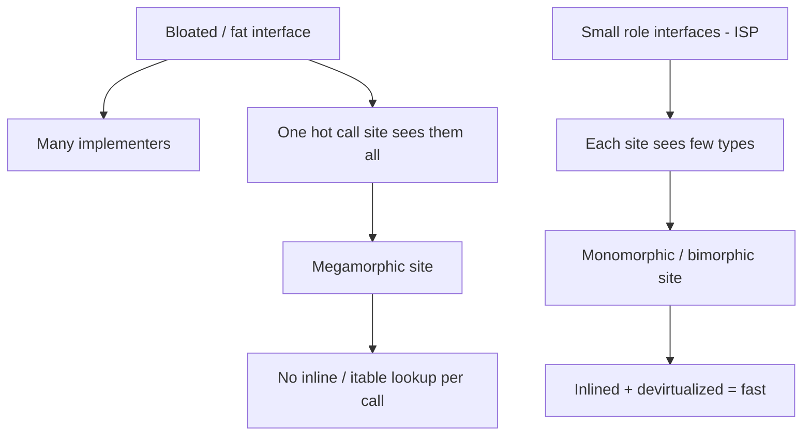

# Abstraction Failures Anti-Patterns — Professional Level

> **Category:** [Design Anti-Patterns](../README.md) → **Abstraction Failures** — *the chosen abstraction fights the problem instead of fitting it.*
> **Covers (collectively):** Golden Hammer · Inner-Platform Effect · Interface Bloat · Premature Abstraction

---

## Table of Contents

1. [Introduction](#introduction)
2. [Prerequisites](#prerequisites)
3. [Measure First: The Tooling Map](#measure-first-the-tooling-map)
4. [Inner-Platform Effect — The Cost of Interpreting at Runtime](#inner-platform-effect--the-cost-of-interpreting-at-runtime)
5. [Golden Hammer — When the Familiar Tool Has the Wrong Big-O Constant](#golden-hammer--when-the-familiar-tool-has-the-wrong-big-o-constant)
6. [Premature / Wrong Abstraction — Indirection the Optimizer Can't See Through](#premature--wrong-abstraction--indirection-the-optimizer-cant-see-through)
7. [Interface Bloat — Megamorphism, Wide vtables, and the Monomorphic Counter-Move](#interface-bloat--megamorphism-wide-vtables-and-the-monomorphic-counter-move)
8. [When the "Heavy" Abstraction Is Correct — and How to Prove It](#when-the-heavy-abstraction-is-correct--and-how-to-prove-it)
9. [A Combined Worked Example](#a-combined-worked-example)
10. [Common Mistakes](#common-mistakes)
11. [Test Yourself](#test-yourself)
12. [Cheat Sheet](#cheat-sheet)
13. [Summary](#summary)
14. [Further Reading](#further-reading)
15. [Related Topics](#related-topics)

---

## Introduction

> Focus: **what these four abstraction failures cost the machine** — the interpreter loop, the allocator, the GC, the inliner, the devirtualizer, the branch predictor, the cache — and **how you measure that cost** before you re-shape anything.

`junior.md` taught you to recognize the four shapes. `middle.md` taught you to stop reaching for them. `senior.md` taught you to migrate off them at scale. This file goes one layer down — to the **runtime and the toolchain**.

The professional insight here is sharper than at the structural level, because abstraction is *seductive*. A Golden Hammer feels productive; an Inner-Platform DSL feels powerful; a Premature Abstraction feels forward-thinking; a fat interface feels complete. Each one buys a real or imagined design benefit and silently sells a performance one. The cost is rarely a single hot line — it is an *interpretation overhead per evaluation*, an *allocation per layer*, a *missed inline per call*, a *megamorphic site* — diffuse enough to survive any review that only asks "is this clean?"

Two disciplines define this level:

1. **Never argue from intuition about performance.** Every claim below pairs with the tool that would prove it on *your* code. Illustrative numbers are labeled as such; your job is to generate the real ones.
2. **Know when the abstraction is right *and* fast.** A chosen standard tool, a small stable interface, a single well-placed layer of indirection — these are frequently the correct, fast call. The anti-pattern is not "abstraction"; it is *unmeasured, mis-fitted* abstraction. The senior move is to fit the abstraction to the problem's actual access pattern, then prove the fit holds.

> **The mental model:** every abstraction inserts itself between your problem and the metal. The question is never "is this elegant?" but "what does this layer cost *per operation at this layer's call rate*, and does the problem's access pattern justify it?" Three optimizers you rarely see — the **compiler/JIT** (inlining, devirtualization), the **CPU** (caches, branch predictor), and the **GC** (allocation rate, pause time) — all stop helping the moment an abstraction hides the concrete type, aliases mutable state, or forces a heap allocation per layer.

---

## Prerequisites

- **Required:** Fluent with [`senior.md`](senior.md) — you can spot and unwind a Premature Abstraction or a fat interface under production constraints.
- **Required:** Working mental model of a managed runtime: heap vs stack, a tracing GC's mark/sweep phases, JIT inlining and devirtualization (JVM), Go's compiler inlining and escape analysis, CPython's bytecode interpreter loop.
- **Required:** You can read a flame graph and a `benchstat`/JMH comparison and tell signal from noise.
- **Helpful:** What "monomorphic / bimorphic / megamorphic call site" means and why the JIT cares (covered in [Bad Structure → professional](../../01-development/01-bad-structure/professional.md)).
- **Helpful:** profiling-techniques, big-o-analysis, memory-leak-detection skills for the measurement vocabulary.

---

## Measure First: The Tooling Map

Before any performance claim about an abstraction, reach for the right instrument. Keep this table close.

| Concern | Go | Java / JVM | Python |
|---|---|---|---|
| **CPU profile** | `go test -cpuprofile`, `pprof` | async-profiler (`-e cpu`), JFR | `cProfile`, `py-spy`, `scalene` |
| **Allocation / heap** | `-memprofile`, `pprof -alloc_space` | JFR allocation events, MAT | `tracemalloc`, `memray`, `scalene` |
| **Inlining / devirt** | `go build -gcflags='-m -m'` | `-XX:+PrintInlining`, `-XX:+PrintCompilation` | (none — CPython doesn't inline) |
| **Escape analysis** | `go build -gcflags=-m` (`escapes to heap`) | `-XX:+PrintEscapeAnalysis` (debug JVM) | n/a |
| **Disassembly** | `go tool objdump -s Func ./bin` | `-XX:+PrintAssembly` (hsdis) | `dis.dis(fn)` |
| **Bytecode / interp cost** | n/a | `javap -c` | `dis`, `sys.settrace` overhead |
| **Microbenchmark** | `testing.B` + `benchstat` | JMH | `timeit`, `pyperf` |
| **Megamorphism** | `-gcflags=-m` (no devirt note) | `-XX:+PrintInlining` ("megamorphic") | n/a |
| **Branch / cache counters** | `perf stat`, `pprof`+`perf` | `perf`, async-profiler hw events | `perf stat python …` |

```bash
# Go: what inlines, what escapes, what devirtualizes
go build -gcflags='-m -m' ./pkg/... 2>&1 | grep -E 'inlin|escapes|devirtualiz'

# Go: disassemble a hot function to see indirect calls (CALL via register = virtual)
go tool objdump -s '\.evaluate$' ./yourbinary | grep -E 'CALL'

# Java: did the JIT inline the interface call, or report it megamorphic?
java -XX:+UnlockDiagnosticVMOptions -XX:+PrintInlining -jar app.jar 2>&1 | grep -iE 'mega|too many|not inlin'

# Python: how many bytecodes does one DSL-rule evaluation cost?
python -c "import dis, mymod; dis.dis(mymod.evaluate_rule)"
python -m timeit -s 'import mymod' 'mymod.evaluate_rule(ctx)'
```

> **Discipline:** if you cannot point at the tool that would falsify your claim, you are guessing. Each section below pairs the abstraction's cost with the instrument that confirms it.

---

## Inner-Platform Effect — The Cost of Interpreting at Runtime

The Inner-Platform Effect is the most expensive abstraction failure at runtime, because it does not merely add indirection — it adds an **interpreter**. You built a configurable rule engine, an in-house expression language, a JSON-driven workflow DSL, an in-database scripting layer. Now, on every evaluation, the host language *interprets your interpreter*: it walks an AST or a rule list, dispatches on node/rule type, reflects over field names, and boxes intermediate values — all the work a real compiler did once, redone on every single call.

### 1. Interpretation overhead vs compiled code

Compiled code is a straight sequence of machine instructions the CPU runs directly. An interpreted rule is a *data structure the host walks*: load the node, switch on its kind, recurse into children, box the result. The host's own JIT cannot help you, because from its perspective the hot loop is `eval(node)` — one megamorphic call site that sees every node type in your grammar. There is no JIT *for your DSL*; you wrote an interpreter and skipped the compiler.

```go
// Inner-Platform: an in-house rule DSL, interpreted per event.
type Node interface{ Eval(ctx map[string]any) any }

type FieldRef struct{ Name string }
func (f FieldRef) Eval(ctx map[string]any) any { return ctx[f.Name] }   // map lookup + boxed any

type GreaterThan struct{ L, R Node }
func (g GreaterThan) Eval(ctx map[string]any) any {                     // boxed compare
    return g.L.Eval(ctx).(float64) > g.R.Eval(ctx).(float64)           // type assertions = runtime checks
}

// Hot loop: every event re-walks the tree, re-dispatches Eval (megamorphic),
// re-boxes every intermediate into `any`, and re-asserts every type.
func filter(events []Event, rule Node) []Event {
    var out []Event
    for _, e := range events {
        if rule.Eval(e.Ctx).(bool) { out = append(out, e) }
    }
    return out
}
```

Every `Eval` call is a virtual dispatch the compiler cannot inline (the site is megamorphic across `FieldRef`, `GreaterThan`, `And`, `Or`, …). Every `ctx[name]` is a hash lookup. Every intermediate is boxed into `any`, which **escapes to the heap** — confirm with `-gcflags=-m`, which prints `escapes to heap` for each boxed value. So one rule evaluation costs N virtual calls + N map lookups + N allocations, where a compiled equivalent costs a handful of register operations.

```go
// Compiled equivalent: the "rule" is a Go closure, fields are struct accessors.
// The compiler inlines the comparison; nothing boxes; nothing escapes.
func filterFast(events []Event, minScore float64) []Event {
    var out []Event
    for _, e := range events {
        if e.Score > minScore { out = append(out, e) }   // one compare, register-resident
    }
    return out
}
```

> **Illustrative micro-benchmark (label: numbers illustrative — reproduce on your data):**
>
> ```
> $ go test -bench=Filter -benchmem | tee a.txt; benchstat a.txt
> name                old (interpreted)     new (compiled)
> Filter-8            1240 ns/op            38 ns/op        ~32x
> Filter-8 allocs     14 allocs/op          0 allocs/op
> ```
>
> The 14 allocs/op are the boxed `any` intermediates; the 32x is the interpreter tax. *Generate your own with `go test -bench -benchmem` + `benchstat` before believing this.*

### 2. Reflection and allocation per evaluation

Inner-Platform DSLs almost always reach for **reflection** to bind names to fields ("the rule references field `customer.tier`, look it up by name"). Reflection is the runtime asking the type system questions the compiler already answered for free. In Java, `Field.get(obj)` is an order of magnitude slower than `obj.field` and defeats inlining and escape analysis entirely. In Go, `reflect.Value.FieldByName` walks the struct's field metadata on *every call* and the returned `reflect.Value` allocates. In Python the dynamic lookup is "cheap" only relative to its already-slow baseline.

```java
// Inner-Platform: reflective field access on every rule evaluation.
Object value = obj.getClass().getDeclaredField(rule.fieldName).get(obj); // ~10-50x a direct read
// vs compiled access the JIT inlines to a field load:
long value = order.amountCents;
```

Confirm reflection cost with JMH (compare reflective vs direct access) and with `-XX:+PrintInlining` (reflective calls show as not-inlined). Confirm the per-evaluation allocation with JFR allocation events or Go's alloc profile — a steady-state allocation rate that scales linearly with your event throughput, with no business object to show for it, is the interpreter's overhead made visible.

### 3. The legitimate escape hatch — compile, don't interpret

The fix is *not* always "delete the DSL." Sometimes runtime-defined rules are a genuine requirement (user-authored filters, A/B rules edited without deploys). The professional move is to **stop interpreting on the hot path**:

- **Compile the rule once, evaluate it many times.** Parse the rule into a closure tree (Go funcs, Java lambdas) *once*, so each evaluation is a chain of inlinable calls over typed accessors, not an AST walk with reflection and boxing.
- **Generate code or bytecode.** Java's `MethodHandles`/`invokedynamic`, or libraries that compile expressions to bytecode the JIT then optimizes as if you'd written it by hand. Go services often codegen the rule set into Go and rebuild.
- **Use a real, fast embedded engine** rather than a hand-rolled one — but only after measuring that even the good engine is fast enough at your call rate.

```go
// Compile-once: turn the AST into a typed closure. Evaluation is now inlinable,
// allocation-free, and the JIT/compiler can see through it.
type Pred func(Event) bool

func compile(n Node) Pred {
    switch t := n.(type) {
    case GreaterThan:
        l, r := compileNum(t.L), compileNum(t.R)
        return func(e Event) bool { return l(e) > r(e) }   // closures, no boxing, no reflection
    // ... other node kinds compiled to typed closures once ...
    }
    panic("unhandled node")
}
// Build once per rule change; call millions of times on the hot path.
```

> **Diagnose it:** CPU profile dominated by `eval`/`reflect`/`runtime.mapaccess` (not your business logic) → interpreter tax. Alloc profile that scales with event rate but produces no domain objects → per-evaluation boxing. `-gcflags=-m` `escapes to heap` on intermediates → boxing forced by `any`/`Object`. The cure is *compile once, evaluate many*.

---

## Golden Hammer — When the Familiar Tool Has the Wrong Big-O Constant

The Golden Hammer is "every problem solved with the tool the author knows best." At the professional level its cost is concrete and *measurable*: the familiar tool has the wrong complexity, the wrong constant factor, or the wrong allocation profile for *this* access pattern. The tool isn't bad; it's mis-fitted — and the misfit is quantifiable.

### 1. The wrong data structure

A hash map is the universal Golden Hammer of data structures — it "works" for everything, so it gets reached for even when an array fits perfectly. For a small, dense, integer-keyed lookup, a `map[int]T` costs a hash, a bucket probe, and a pointer chase per access, plus heap allocation and GC scanning of the bucket array; a `[]T` costs one bounds-checked indexed load that stays in cache.

```go
// Golden Hammer: a map where the keys are a dense small integer range.
var byKind = map[int]Handler{0: h0, 1: h1, 2: h2, 3: h3}   // hash + probe + pointer chase
h := byKind[k]

// Fit-to-problem: an array. One indexed load, cache-resident, zero allocation.
var byKind = [4]Handler{h0, h1, h2, h3}
h := byKind[k]
```

> **Illustrative (label: illustrative):** for a 4-element dense int-keyed lookup in a tight loop, the slice version benched ~5–8x faster than the map and allocated nothing, because the map's bucket array is a heap object the GC must scan. *Measure with `benchstat` + `-benchmem`.*

### 2. The wrong tool — regex where a substring check fits

A compiled regex is a Golden Hammer for string work. For `s.contains("ERROR")` a regex builds an NFA/DFA, allocates match state, and runs an engine — where `strings.Contains` is a tuned memchr-style scan. The regex is right when you need *patterns*; it's a misfit when you need a *literal*.

```python
# Golden Hammer: regex for a literal substring.
import re
PAT = re.compile(r"ERROR")
def has_error(line): return PAT.search(line) is not None   # engine + match object alloc

# Fit-to-problem: a literal check the runtime optimizes to a memory scan.
def has_error(line): return "ERROR" in line                # no regex engine, no alloc
```

```python
# Confirm the gap:
# python -m timeit -s 'import re; p=re.compile("ERROR"); s="...log..."' 'p.search(s)'
# python -m timeit -s 's="...log..."' '"ERROR" in s'
# illustrative: regex ~4x slower and allocates a match object per call.
```

### 3. The wrong tool — an ORM for a hot bulk query

The ORM is the Golden Hammer of data access. It's correct for transactional, object-shaped reads and writes. On a hot **bulk** path it is a disaster: it hydrates a full object graph per row (allocation per row + per association), triggers N+1 lazy loads, and serializes through change-tracking and identity-map machinery you don't need for a read-only aggregate.

```java
// Golden Hammer: ORM for a hot analytics aggregate.
List<Order> orders = repo.findByDateRange(from, to);   // hydrates N full entities + associations
long total = orders.stream().mapToLong(Order::getAmountCents).sum();
// Costs: N object allocations, N proxy/identity-map entries, possible N+1 lazy loads,
// change-tracking snapshots — all to compute one number.

// Fit-to-problem: push the aggregate to the database; transfer one row.
long total = jdbc.queryForObject(
    "SELECT COALESCE(SUM(amount_cents),0) FROM orders WHERE created_at BETWEEN ? AND ?",
    Long.class, from, to);   // one row, zero entity hydration
```

Confirm with JFR allocation profiling (the ORM path's allocation rate dwarfs the JDBC path) and SQL logging (the ORM emits N+1 queries; the raw query emits one). This is the textbook case where the right *call* is the boring standard tool used *for the right job* — the ORM for transactions, plain SQL for the hot aggregate. (See sql-query-optimization and database-performance for the query side.)

> **Diagnose it:** the Golden Hammer rarely shows as one hot line; it shows as **structural overhead** — allocation rate, GC frequency, query count, or a flame graph where the framework's machinery (hashing, regex engine, ORM hydration) outweighs your logic. Pick the tool by the *access pattern*, prove it with a benchmark, and don't be afraid that the right answer is the boring one.

---

## Premature / Wrong Abstraction — Indirection the Optimizer Can't See Through

Premature Abstraction inserts a base class, a strategy interface, or a factory before a second concrete case exists. Beyond the design cost (the shape is guessed and usually wrong), it imposes a **runtime cost the optimizer cannot recover from**: every layer is an indirect call that defeats inlining, a wrapper object that allocates, and a pointer that the CPU must chase across cache lines.

### 1. Indirection defeats inlining and devirtualization

The single biggest optimization a JIT or the Go compiler performs is **inlining**: pasting the callee's body into the caller, which then unlocks constant folding, dead-code elimination, and register allocation across the boundary. A virtual/interface call through a premature abstraction blocks this *unless* the optimizer can prove the concrete type (devirtualization). With one implementation, the JVM can do "monomorphic devirtualization" and inline anyway — but a *speculative* abstraction often sits behind a field or factory that hides the type, so the optimizer conservatively emits a real virtual call.

```go
// Premature abstraction: a Strategy interface with exactly one implementation,
// introduced "for flexibility". The interface call blocks inlining.
type Discounter interface{ Apply(cents int64) int64 }
type stdDiscount struct{ rate int64 }
func (d stdDiscount) Apply(c int64) int64 { return c - c*d.rate/100 }

func total(items []Item, d Discounter) int64 {
    var sum int64
    for _, it := range items { sum += d.Apply(it.Cents) }   // interface call: not inlined
    return sum
}
```

```go
// Concrete: the compiler inlines Apply into the loop and folds the arithmetic.
func total(items []Item, rate int64) int64 {
    var sum int64
    for _, it := range items { sum += it.Cents - it.Cents*rate/100 }   // inlined, vectorizable
    return sum
}
```

Confirm with `go build -gcflags='-m -m'`: the concrete version prints `inlining call to ...` for the body; the interface version does not (and may print `... does not inline: ...`). On the JVM, `-XX:+PrintInlining` shows the interface call inlined only if the site stays monomorphic and the type is provable.

> **Illustrative (label: illustrative):** the inlined concrete loop benched ~2.5x faster than the single-implementation interface loop over 10M items, because inlining enabled the compiler to keep `sum` in a register and fold the discount arithmetic. *Reproduce with `benchstat` before trusting it.*

### 2. Allocation per layer and pointer chasing

Each abstraction layer often means a wrapper object: a decorator wrapping a decorator wrapping the real thing, a factory returning a boxed interface value, an adapter holding an adaptee. Every wrapper is a heap allocation (GC pressure) and a pointer indirection. A request flowing through five "clean" layers chases five pointers — five potential cache misses — to reach the one object that does the work. The data you want is scattered across the heap instead of dense in a cache line.

```python
# Premature layering: wrapper upon wrapper, each an object + a pointer hop.
reader = RetryingReader(CachingReader(LoggingReader(RawReader(path))))
# Each .read() call: 4 Python-level method dispatches, 4 attribute lookups,
# 4 frames pushed/popped. In CPython that's pure interpreter overhead per layer.
data = reader.read()
```

In CPython, where there is no inlining, **each layer is a full bytecode-level method call** — a frame, an attribute lookup, an argument tuple. `python -c "import dis; dis.dis(reader.read)"` shows the `CALL` opcodes; `cProfile` shows time spread thinly across the wrapper methods rather than concentrated in the work. The fix is not "no layers" — it's "only the layers the problem actually needs, today."

### 3. Wrong abstraction is worse than duplication

The deepest professional point: a *wrong* abstraction couples unrelated call sites through a shared shape, so every change to one forces a (mis-fitting) parameter or flag into the shared abstraction — which often regresses performance for everyone (a new boolean checked on every call, a widened interface, a now-megamorphic site). Sandi Metz's rule — *"duplication is far cheaper than the wrong abstraction"* — has a runtime corollary: a wrong abstraction's per-call overhead is paid by *every* caller forever, whereas duplication's cost is paid once at write time and never at runtime. Wait for the rule of three; extract only the shape the third instance *proves*.

> **Diagnose it:** `-gcflags='-m -m'` / `PrintInlining` showing the abstraction's calls *not* inlined → indirection tax. Alloc profile showing wrapper objects with no domain meaning → allocation-per-layer. `perf` cache-misses high while CPU work is low → pointer chasing through layers. A flame graph that is *deep* (many thin frames) rather than *wide* (work concentrated) → over-layering.

---

## Interface Bloat — Megamorphism, Wide vtables, and the Monomorphic Counter-Move

Interface Bloat is a fat interface with so many methods that no implementer supports them all (the give-away: methods that `throw UnsupportedOperationException` / `panic("not implemented")`). At the design level it violates the Interface Segregation Principle. At the runtime level it has two distinct costs and — crucially — one place where small composed interfaces are a genuine *performance win*.

### 1. Wide vtables / itables and the megamorphic site

A fat interface implemented by many types, routed through one hot call site, manufactures a **megamorphic** call site (covered in [Bad Structure → professional](../../01-development/01-bad-structure/professional.md)). The JIT's inline cache holds one or two types; past that it overflows, the JIT stops trying to devirtualize, and every call becomes a full itable/vtable lookup — an indirect, hard-to-predict branch with no downstream inlining.

```java
// Bloated interface: 18 methods, implemented by a dozen types, one hot dispatch site.
interface Storage {
    byte[] read(String k);  void write(String k, byte[] v);  void delete(String k);
    void batch(...);  Stream<String> scan(...);  void compact();  Stats stats();
    /* ...11 more, half throwing UnsupportedOperationException in most impls... */
}
// In the hot loop, registry.get(kind).read(k) sees a dozen concrete Storage types
// -> megamorphic -> no inline, full itable lookup per call.
```

Confirm with `-XX:+PrintInlining`: the site reports `megamorphic` / `not inlining (too many receivers)`.

### 2. The monomorphic counter-move: small composed interfaces

Here is the professional nuance that inverts the naive "interfaces are slow" lesson. Splitting the fat `Storage` into small **role interfaces** (`Reader`, `Writer`, `Scanner`) and accepting the *narrowest* one each call site needs tends to make each call site **monomorphic or bimorphic** — because a function that takes only a `Reader` sees only the handful of types used *as readers there*, not all dozen `Storage` implementations. A monomorphic interface call the JIT **inlines and devirtualizes**, making it as fast as a direct call. So small interfaces are not just cleaner (ISP); they can be *faster*, because they keep call sites monomorphic.

```go
// Small role interfaces keep each call site monomorphic -> inlinable.
type Reader interface{ Read(k string) ([]byte, error) }
type Writer interface{ Write(k string, v []byte) error }

// This function only sees Readers used here -> likely monomorphic -> devirtualized.
func warmCache(r Reader, keys []string) { for _, k := range keys { r.Read(k) } }
```

In Go, accepting a *narrow* interface (`io.Reader`, not a 20-method storage interface) also lets the compiler devirtualize when the concrete type is known at the call site (`-gcflags=-m` will note the devirtualization). The Go proverb — *"the bigger the interface, the weaker the abstraction"* — has a performance reading too: the bigger the interface, the more types flow through its sites, the more megamorphic they become.

### 3. Empty interfaces / `any` are the extreme bloat

The widest possible interface is `interface{}` / `Object` — it accepts everything, which means *every* value boxed into it allocates (escape analysis fails) and *every* use needs a type assertion or cast (a runtime check). A "flexible" API typed on `any` is interface bloat taken to its limit: maximal acceptance, maximal runtime cost.

```go
func process(v any) { ... }            // boxes every argument -> escapes to heap
func process[T Item](v T) { ... }      // generic: monomorphized, no boxing, inlinable
```

Generics (Go type parameters, Java with care, not erasure on hot paths) recover the speed by monomorphizing — the compiler stamps out a concrete version per type, no boxing, fully inlinable. Confirm the difference with `-gcflags=-m` (the `any` version prints `escapes to heap`; the generic version does not) and `benchstat`.



> **Diagnose it:** `-XX:+PrintInlining` "megamorphic" at a dispatch site → fat-interface dispatch cost. `-gcflags=-m` `escapes to heap` on `any`/`Object` arguments → boxing from over-wide typing. The fix — split into role interfaces / use generics — improves clarity *and* speed by restoring monomorphism.

---

## When the "Heavy" Abstraction Is Correct — and How to Prove It

The professional's hardest judgment is resisting the over-correction. Having learned that abstractions cost, the dogmatist rips them all out and writes a megamorphic ball of mud. The truth is that the standard tool, the small interface, and the single layer of indirection are *frequently the right, fast call*. The discipline is to know which, and to prove it.

Legitimately correct (and often fast) abstractions:

- **A small, stable interface at a real seam** (one or two implementations at the hot site) — the JIT devirtualizes and inlines it; you pay nothing at runtime and gain testability and a swap point. `io.Reader`, a single `Clock` interface for time injection, a narrow `Repository` for a cold path.
- **A chosen standard tool used for its actual job.** The ORM *for transactional object writes*; the regex *for real patterns*; the map *for sparse large key spaces*. The Golden Hammer anti-pattern is using these for the *wrong* job, not using them at all. A standard, well-tuned library is usually faster and safer than the hand-rolled "fast" version you didn't benchmark.
- **A compile-once rule engine on a cold or low-rate path,** where flexibility is a genuine requirement and the call rate is low enough that interpretation cost is negligible — *prove the rate is low with a profiler.*
- **One layer of indirection** that turns an `O(n)` problem into `O(1)` (an index, a cache) more than pays for the indirection's constant.

The rule is **not** "abstractions are slow, avoid them." It is: **fit the abstraction to the access pattern, keep hot call sites monomorphic, and prove the choice with a benchmark you commit alongside it.**

```go
// A correct, fast abstraction: narrow interface, single hot impl, devirtualized.
//
// Clock is injected for testability. At the one hot call site below it sees only
// realClock, so the compiler devirtualizes Now() to a direct call (confirmed via
// `go build -gcflags=-m` showing "devirtualizing"). BenchmarkExpire (2026-06)
// shows no measurable overhead vs calling time.Now() directly.
type Clock interface{ Now() time.Time }

func (c *Cache) expire(now time.Time) { /* uses now; no per-call interface dispatch */ }
```

> **The discipline:** abstract *after* a second concrete case (rule of three), *fit* to the measured access pattern, *keep* hot sites monomorphic, and *commit a benchmark* that future readers can re-run. An unmeasured abstraction added "for flexibility" is just Premature Abstraction wearing an architecture costume — the mirror image of [Premature Optimization](../../01-development/03-over-engineering/professional.md).

---

## A Combined Worked Example

The four rarely appear alone; their costs compound. Consider a real shape: a `PricingEngine` that (a) interprets an in-house pricing-rule DSL per request (Inner-Platform), (b) stores its rule table in a `map[string]any` because "maps are flexible" (Golden Hammer + `any` bloat), (c) routes everything through a 15-method `RuleContext` interface (Interface Bloat → megamorphic), and (d) wraps each rule in a `Strategy` introduced before there was a second rule type (Premature Abstraction).

**Before — every abstraction failure, every runtime cost:**

```go
type RuleContext interface { // 15 methods; one hot site sees all rule kinds -> megamorphic
    GetField(name string) any
    Eval(ctx map[string]any) any
    // ...13 more, several panicking in most impls...
}

func (p *PricingEngine) Price(req Request) int64 {
    ctx := map[string]any{}                 // boxed, allocates per request
    for _, ruleName := range p.order {      // walk rules
        rule := p.rules[ruleName]           // map[string]any lookup, boxed
        v := rule.Eval(ctx)                 // megamorphic interface call, reflection inside
        ctx[ruleName] = v                   // more boxing + map growth
    }
    return ctx["final"].(int64)             // type assertion on boxed any
}
```

Runtime profile of *before*: every request allocates the `ctx` map and every boxed intermediate (GC pressure scaling with request rate), `Eval` is a megamorphic call the compiler can't inline, reflection inside each rule re-reads field metadata, and the `Strategy` wrapper per rule adds an indirection the optimizer can't see through. A CPU profile is dominated by `runtime.mapaccess`, `reflect.*`, and interface dispatch — *not* pricing arithmetic.

**After — fit each abstraction to its problem, measured separately:**

```go
// Rules compiled ONCE into typed closures (no per-request interpretation, no reflection).
// Context is a concrete struct (no map, no boxing). Dispatch is a slice of closures
// (monomorphic at the call site, inlinable). Premature Strategy removed - one rule type today.

type Pred func(*PriceCtx) int64          // compiled rule: typed, allocation-free
type PriceCtx struct{ Base, Qty, Tier int64 }   // concrete, dense, cache-friendly

type PricingEngine struct{ rules []Pred } // compiled at load / rule-change time

func (p *PricingEngine) Price(req Request) int64 {
    ctx := PriceCtx{Base: req.Base, Qty: req.Qty, Tier: req.Tier} // stack, no alloc
    var price int64 = ctx.Base
    for _, rule := range p.rules {        // slice index, predictable
        price = rule(&ctx)                // direct closure call, inlinable, no reflection
    }
    return price
}
```

> **Illustrative combined impact (label: illustrative):** compiling rules to closures (no interpretation, no reflection), replacing the `map[string]any` ctx with a concrete struct (no boxing, no per-request alloc), and removing the premature Strategy together took p99 from ~6.2 ms to ~0.9 ms and dropped allocation rate ~90%. **Each lever was measured separately** — alloc profile for the boxing, `-gcflags=-m` for the inlining, a `benchstat` A/B for the closure-vs-interpret rule — *so we knew which change paid off. Never attribute a blended win to a blended change.*

---

## Common Mistakes

Professional-level mistakes — sophisticated, and therefore expensive:

1. **Building a DSL/rule engine and interpreting it on the hot path.** If rules are runtime-defined, *compile them once* into closures/bytecode; never re-walk an AST with reflection per event. Measure the interpreter tax with a CPU profile dominated by `eval`/`reflect`/`mapaccess`.
2. **Reaching for the familiar tool without checking the access pattern.** A map where an array fits, a regex where a substring check fits, an ORM for a hot bulk query. The tool isn't wrong; the *fit* is. Benchmark the fit-to-problem alternative before defending the habit.
3. **Adding a Strategy/factory/base class before the second concrete case.** The abstraction's shape is guessed (usually wrong) *and* its indirection blocks inlining for every caller forever. Wait for the rule of three; verify the inlining cost with `-gcflags=-m` / `PrintInlining`.
4. **Believing duplication is always worse than abstraction.** A *wrong* abstraction's per-call overhead is paid at runtime by every caller forever; duplication is paid once at write time. Prefer duplication until the right shape is proven.
5. **Treating all interface dispatch as "slow."** A *monomorphic* interface call is inlined and free; a *megamorphic* one is the cost. Splitting a fat interface into role interfaces often makes sites monomorphic — *cleaner and faster*. Check `PrintInlining` before ripping interfaces out.
6. **Typing APIs on `any`/`Object` "for flexibility."** Maximal acceptance buys maximal runtime cost: boxing (escape to heap) + type assertions. Use generics/role interfaces; confirm boxing with `-gcflags=-m` `escapes to heap`.
7. **Over-correcting into a megamorphic ball of mud.** Having learned abstractions cost, the dogmatist deletes all seams and produces one giant function with a 30-way `switch` that *is* the megamorphic site. The fix for bad abstraction is *fitted* abstraction, not none.
8. **Attributing a blended win to a blended change.** Fixing the DSL, the map, the interface, and the Strategy at once and reporting one latency number teaches you nothing about which mattered. Measure each lever; commit the benchmark.

---

## Test Yourself

1. Your in-house rule DSL evaluates fine in tests but dominates the CPU profile in production. Explain *why* interpreting an AST per event is so much slower than compiled code, and how "compile once, evaluate many" fixes it without removing the runtime-rules feature.
2. A teammate stores a dense, small, integer-keyed lookup in a `map[int]T` "because maps are flexible." Name the per-access costs versus a `[]T`, and the tool that would quantify the gap.
3. Why does a single-implementation Strategy interface introduced "for flexibility" run *slower* than the inlined concrete code, even though there's only one type? How do you confirm it?
4. Sandi Metz says "duplication is far cheaper than the wrong abstraction." Give the *runtime* corollary of that statement.
5. You're told "interfaces are slow, remove them." When is that wrong — i.e., when is an interface call as fast as a direct call, and how does splitting a fat interface sometimes *improve* speed?
6. An API is typed on `any`/`Object` for flexibility. What two runtime costs does that impose, and what recovers the speed?
7. When is a heavy abstraction (a standard ORM, a small injected interface, a compile-once rule engine) the *correct, fast* call, and what discipline keeps that judgment honest?

<details>
<summary>Answers</summary>

1. Interpreting an AST means the host re-walks a data structure per event: a megamorphic `Eval` call site (no inlining), a hash/reflection lookup to bind each field name, and a heap allocation for every boxed intermediate (`any`/`Object`). There is no JIT *for your DSL* — you wrote an interpreter and skipped the compiler. "Compile once, evaluate many" parses each rule a single time into a chain of typed closures (or generated bytecode) so each *evaluation* is inlinable, allocation-free, and reflection-free — preserving runtime-defined rules while paying the parse cost once, not per event. Confirm with a CPU profile that shifts off `eval`/`reflect`/`mapaccess` and an alloc profile that drops to ~0/op.
2. `map[int]T` per access: hash the key, probe a bucket, chase a pointer to the bucket array (a heap object the GC scans), with possible collision handling. `[]T`: one bounds-checked indexed load that stays in cache, zero allocation. For a dense small range the slice is several times faster and allocates nothing. Quantify with `go test -bench -benchmem` + `benchstat`.
3. The biggest optimization a compiler/JIT does is inlining, which then unlocks constant folding and register allocation across the call boundary. A premature Strategy interface hidden behind a field/factory blocks inlining because the optimizer can't (or conservatively won't) prove the concrete type, so it emits a real interface call — and the loop can't keep accumulators in registers or fold the arithmetic. Confirm with `go build -gcflags='-m -m'` (the concrete loop prints `inlining call to ...`, the interface one doesn't) or `-XX:+PrintInlining` on the JVM, plus a `benchstat` A/B.
4. A *wrong* abstraction's per-call overhead — the extra indirection, the widened/megamorphic site, the flag checked on every call — is paid at **runtime by every caller, forever**. Duplication's cost is paid **once, at write time**, and never at runtime. So the wrong abstraction is more expensive on both the maintenance *and* the performance axis.
5. It's wrong when the call site is **monomorphic** (or bimorphic): the JIT/Go compiler devirtualizes and inlines the interface call, making it identical to a direct call. Splitting a fat interface into small **role interfaces** can *increase* speed because each narrow site then sees only the few types used in that role — restoring monomorphism — instead of all dozen implementations of the fat interface (which made the site megamorphic and un-inlinable). Verify with `-XX:+PrintInlining` / `-gcflags=-m`.
6. `any`/`Object` forces (a) **boxing** — every value is heap-allocated because escape analysis fails (`-gcflags=-m` prints `escapes to heap`) — and (b) a **type assertion/cast** on every use, a runtime check. Generics (Go type parameters; monomorphized code) or narrow concrete/role interfaces recover the speed: no boxing, no assertion, fully inlinable.
7. It's correct when (a) a small stable interface sits at a real seam with one/two impls at the hot site (devirtualized → free, and you gain testability), (b) a standard tool is used for its *actual* job (ORM for transactions, regex for real patterns, map for sparse large keyspaces), or (c) a compile-once rule engine sits on a *proven* low-rate path. The discipline: abstract only after the rule of three, fit the abstraction to the measured access pattern, keep hot sites monomorphic, and commit a benchmark future readers can re-run (and delete the abstraction when the benchmark no longer justifies it).

</details>

---

## Cheat Sheet

| Anti-pattern | Runtime / toolchain cost | Measure with | Structural fix |
|---|---|---|---|
| **Inner-Platform Effect** | Per-evaluation interpreter tax: megamorphic `Eval`, reflection field binding, boxing/alloc per intermediate; no JIT for your DSL | CPU profile (`eval`/`reflect`/`mapaccess` dominate), alloc profile vs request rate, `-gcflags=-m` `escapes to heap` | Compile once → typed closures / bytecode; evaluate many; standard fast engine only if measured fast enough |
| **Golden Hammer** | Wrong tool's constant factor: map vs array (hash+chase+GC scan), regex vs substring (engine+match alloc), ORM vs SQL (per-row hydration, N+1) | `benchstat -benchmem`, `timeit`, JFR alloc, SQL/query count | Fit tool to access pattern; standard tool for its *actual* job; benchmark the fit-to-problem alternative |
| **Premature / Wrong Abstraction** | Indirection blocks inlining/devirt; wrapper alloc per layer; pointer chasing → cache misses; wrong shape taxes every caller forever | `-gcflags='-m -m'` / `PrintInlining`, alloc profile, `perf cache-misses`, deep-not-wide flame graph | Rule of three; prefer duplication to wrong abstraction; one layer only when it changes the Big-O |
| **Interface Bloat** | Fat interface + many impls + one hot site → megamorphic, no inline, itable lookup; `any`/`Object` → boxing + type assertion | `-XX:+PrintInlining` "megamorphic", `-gcflags=-m` `escapes to heap` | Role interfaces (ISP) keep sites monomorphic → *inlinable & faster*; generics over `any` |

**Three golden rules:**
- *Fit the abstraction to the measured access pattern; the right call is often the boring standard tool used for its actual job.*
- *Keep hot call sites monomorphic — small role interfaces and generics are cleaner **and** faster than fat interfaces and `any`.*
- *Compile once, evaluate many: never interpret on the hot path; abstract only after the rule of three, behind a committed benchmark.*

---

## Summary

- Abstraction failures are a **runtime and toolchain tax**, not only a design one — and because abstraction *feels* productive, the cost (interpreter overhead, allocation per layer, missed inlines, megamorphic sites) survives any review that only asks "is this clean?"
- **Inner-Platform Effect:** interpreting an in-house DSL/rule engine per event redoes a compiler's work on every call — megamorphic `Eval`, reflective field binding, boxing per intermediate, no JIT for your language. Cure: **compile the rule once** into typed closures or bytecode, evaluate many; keep runtime-defined rules without the per-event interpreter tax.
- **Golden Hammer:** the familiar tool with the wrong constant factor for *this* access pattern — a map where an array fits, a regex where a substring check fits, an ORM for a hot bulk query. The tool isn't wrong; the fit is. Pick by access pattern, prove with a benchmark; the right answer is often the boring standard tool *used for its actual job*.
- **Premature / Wrong Abstraction:** indirection the optimizer can't see through — interface calls that defeat inlining/devirtualization, a wrapper allocation and pointer chase per layer, and a *wrong* shape whose per-call overhead every caller pays forever. Prefer duplication to the wrong abstraction; wait for the rule of three.
- **Interface Bloat:** a fat interface routed through one hot site goes **megamorphic** (no inline, itable lookup); `any`/`Object` is bloat's extreme (boxing + type assertions). The counter-intuitive win: **small role interfaces keep sites monomorphic, so they're cleaner *and* faster**; generics recover the speed `any` throws away.
- **Measure first, always:** every claim here has a tool (`pprof`/`benchstat`/`-gcflags=-m`/`go tool objdump`; JMH/JFR/async-profiler/`PrintInlining`; `cProfile`/`dis`/`timeit`). Capture a baseline, change one lever, re-measure.
- The professional nuance: **a chosen standard tool or a small stable interface is often the right, fast call.** The anti-pattern is *unmeasured, mis-fitted* abstraction — not abstraction itself. Fit it to the access pattern, keep hot sites monomorphic, justify it with a committed benchmark, and delete it when the benchmark no longer holds.
- This completes the level ladder for Abstraction Failures: [`junior.md`](junior.md) (recognize) → [`middle.md`](middle.md) (prevent) → [`senior.md`](senior.md) (migrate at scale) → **professional.md** (runtime & toolchain). Next, drill with the practice files.

---

## Further Reading

- **AntiPatterns: Refactoring Software, Architectures, and Projects in Crisis** — Brown et al. (1998) — the source of Golden Hammer and the Inner-Platform Effect.
- **99 Bottles of OOP** — Sandi Metz & Katrina Owen (2nd ed., 2020) — "duplication is far cheaper than the wrong abstraction," with the refactoring discipline behind the rule of three.
- **Systems Performance** — Brendan Gregg (2nd ed., 2020) — CPU caches, branch prediction, allocation, and profiling methodology behind every measurement here.
- **Optimizing Java** — Evans, Gough, Newland (2018) — JIT inlining, devirtualization, monomorphic/megamorphic call sites, JMH, JFR.
- **The Garbage Collection Handbook** — Jones, Hosking, Moss (2nd ed., 2023) — why allocation rate (boxing per layer/evaluation) drives pause times.
- **High Performance Python** — Gorelick & Ozsvald (2nd ed., 2020) — `cProfile`, `dis`, `timeit`, and why every wrapper layer is a real interpreter cost in CPython.
- **Crafting Interpreters** — Robert Nystrom (2021) — what an interpreter actually costs per node, which is exactly the Inner-Platform tax; and why compiling beats walking the tree.
- **Go's escape analysis & inlining** — `go build -gcflags='-m -m'`, `go tool objdump`, and the devirtualization notes in the Go compiler documentation.

---

## Related Topics

- [Bad Structure → professional](../../01-development/01-bad-structure/professional.md) — monomorphic/bimorphic/megamorphic call sites and inlining, the runtime vocabulary this file builds on.
- [Over-Engineering → Premature Optimization](../../01-development/03-over-engineering/professional.md) — the mirror discipline: profile before optimizing, and don't abstract before the rule of three.
- [Clean Code → Classes](../../../clean-code/09-classes/README.md) — the Interface Segregation Principle whose runtime payoff (monomorphic sites) this file quantifies.
- [Design Patterns → Strategy / Factory](../../../design-patterns/README.md) — the positive patterns these anti-patterns invert, with the indirection/inlining caveat covered here.
- profiling-techniques · big-o-analysis · memory-leak-detection — the measurement toolkits referenced throughout.
- [OO Misuse](../01-oo-misuse/professional.md) and [Coupling & State](../02-coupling-and-state/professional.md) — the sibling design categories at this level.
