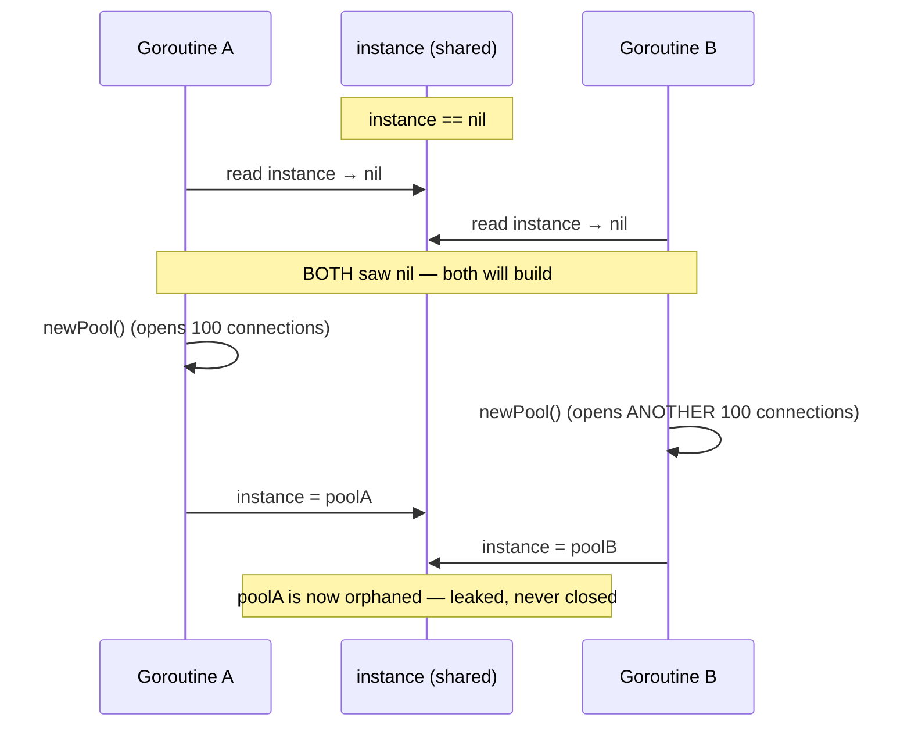
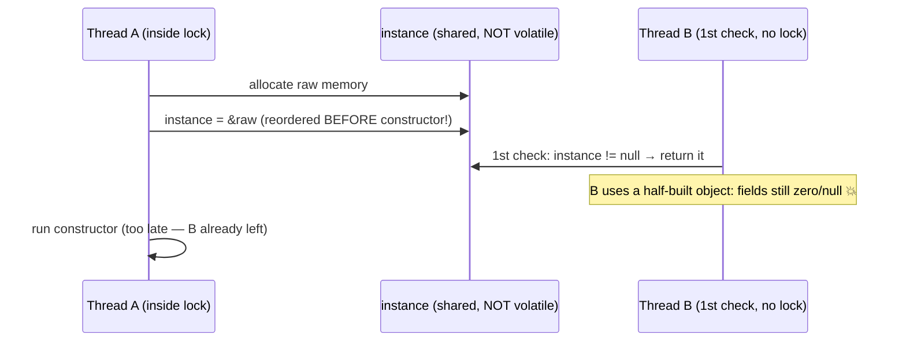
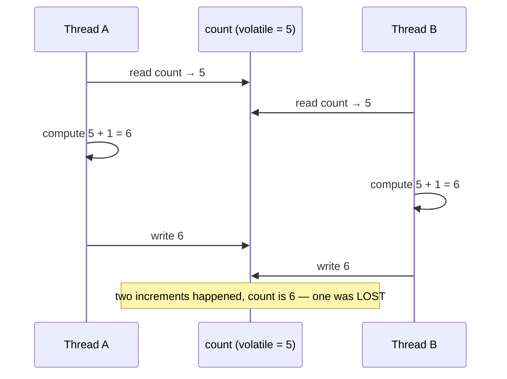
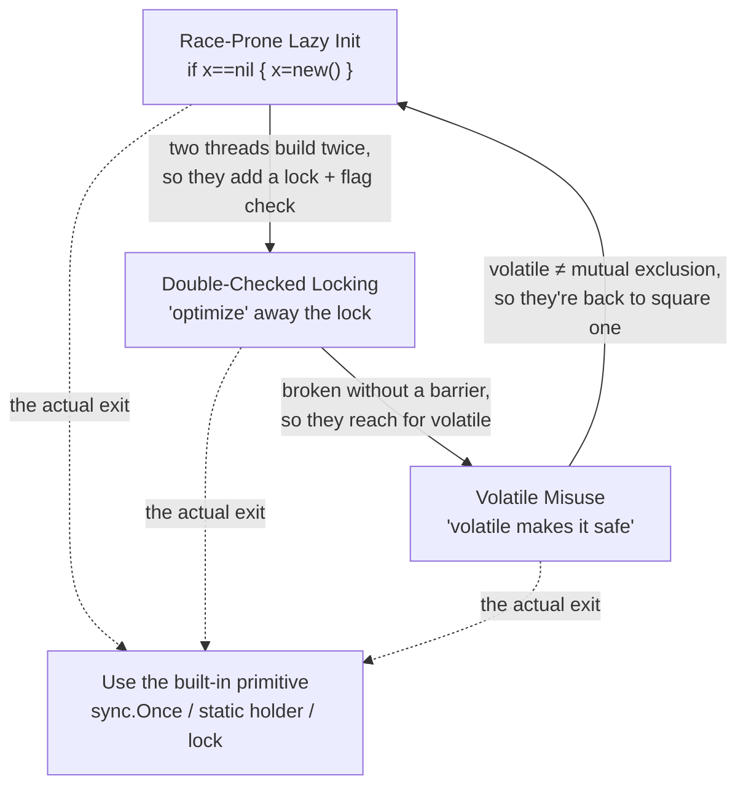

# Synchronization Misuse Anti-Patterns — Junior Level

> **Category:** [Concurrency Anti-Patterns](../README.md) → **Synchronization Misuse** — *locks and memory primitives applied wrongly, so the coordination you think happened never did.*
> **Covers (collectively):** Double-Checked Locking · Volatile Misuse / Wrong Memory Ordering · Race-Prone Lazy Init

---

## Table of Contents

1. [Introduction](#introduction)
2. [Prerequisites](#prerequisites)
3. [Glossary](#glossary)
4. [The Three at a Glance](#the-three-at-a-glance)
5. [Race-Prone Lazy Init](#race-prone-lazy-init)
6. [Double-Checked Locking](#double-checked-locking)
7. [Volatile Misuse / Wrong Memory Ordering](#volatile-misuse--wrong-memory-ordering)
8. [How They Reinforce Each Other](#how-they-reinforce-each-other)
9. [A Quick Spotting Checklist](#a-quick-spotting-checklist)
10. [Common Mistakes](#common-mistakes)
11. [Test Yourself](#test-yourself)
12. [Cheat Sheet](#cheat-sheet)
13. [Summary](#summary)
14. [Further Reading](#further-reading)
15. [Related Topics](#related-topics)

---

## Introduction

> Focus: **What does it look like?** and **Why is it bad?** — plus the safe basic fix you can reach for today.

These three anti-patterns share one root cause: **two threads touch the same data, and you assumed an ordering that the language never promised you.** Your single-threaded intuition says "I check if it's `nil`, and if it is, I create it." That reasoning is airtight when one thread runs it. The moment two threads run it at the same instant, the steps interleave in ways you never wrote down — and the program does something you never intended.

The dangerous part is the symptom: **it almost always works.** The race needs two threads to hit the exact same window of a few nanoseconds, which happens rarely on your laptop and constantly under production load. So the bug ships, passes every test, demos perfectly, and then corrupts data once per ten thousand requests at 3 a.m. You cannot reproduce it on demand, which is exactly why it is so expensive.

The three shapes in this file are:

- **Race-Prone Lazy Init** — `if instance == nil { instance = new() }`, run by two threads, builds the object twice (or loses one).
- **Double-Checked Locking** — the "clever optimization" that skips the lock with a flag check; correct *only* with a proper memory barrier, and a subtle disaster without one.
- **Volatile Misuse / Wrong Memory Ordering** — using `volatile` or an atomic as if it gave you a lock (mutual exclusion), when it only gives you visibility of a single value.

At the junior level your goal is to **recognize each shape**, understand **why** it breaks, and reach for the **boring, correct primitive** your language already ships: Go's `sync.Once`, Java's static-holder idiom (or `volatile` done right), Python's `threading.Lock`. You do not need to invent lock-free algorithms. You need to stop hand-rolling the ones that are already solved.

> **The mindset shift:** in a single thread, the code you wrote is the code that runs, in order. In a concurrent program, *the compiler and the CPU are allowed to reorder your statements* as long as a single thread couldn't tell the difference. Another thread **can** tell the difference. Synchronization is how you forbid the reordering you can't tolerate.

---

## Prerequisites

- **Required:** You can write functions and conditionals, and you understand what a variable holds at a point in time (examples here use Go, Java, and Python).
- **Required:** You know roughly what a *thread* (Java/Python) or *goroutine* (Go) is — an independent path of execution that can run at the same time as another.
- **Helpful:** You have seen a lock or mutex before, even if only `synchronized` in Java or `with lock:` in Python. We explain them, but it helps to have met one.
- **Helpful:** You've hit at least one bug that "only happens sometimes." That intermittency is the entire personality of this chapter.

> **A note on Python and the GIL.** CPython has a **Global Interpreter Lock (GIL)** that lets only one thread execute Python bytecode at a time. This makes *some* races impossible (a single bytecode op won't be torn in half) but **not all of them** — `if instance is None: instance = X()` is two separate bytecode steps, and a thread switch can land between them. The GIL is a reason to write a lock, not a reason to skip one. We flag this where it matters.

---

## Glossary

| Term | Definition |
|------|-----------|
| **Race condition** | A bug where the result depends on the *timing* / interleaving of two or more threads. Same code, same input, different outcome depending on who got there first. |
| **Data race** | A specific, narrower thing: two threads access the same memory location at the same time, at least one writes, and there is no synchronization ordering them. In Go and Java, a data race makes the program's behavior **undefined** — not just "wrong," but unpredictable. |
| **Memory barrier** (fence) | A point the compiler and CPU are forbidden to reorder reads/writes across. Locks and `volatile`/atomic operations insert these for you; that's the real work they do. |
| **Happens-before** | The formal rule that says "write A is guaranteed visible to read B." If there is no happens-before edge between two operations, neither thread is promised to see the other's effects. Unlocking a mutex *happens-before* the next lock of it; that edge is what makes locks work. |
| **Atomic** | An operation that completes all-or-nothing and is indivisible to other threads — no other thread can observe it half-done. A single atomic op is safe; a *sequence* of atomic ops is not automatically a unit. |
| **Mutual exclusion** | The guarantee that at most one thread is inside a protected region at a time. A `Mutex`/`synchronized` block gives this; `volatile`/atomic on a single value does **not**. |

---

## The Three at a Glance

| Anti-pattern | One-line symptom | The smell you feel |
|---|---|---|
| **Race-Prone Lazy Init** | `if instance == nil { instance = new() }` run by two threads | "We sometimes get two connection pools." |
| **Double-Checked Locking** | Lock skipped via an unsynchronized flag check to "save the lock cost" | "It's an optimization — checking twice is faster." |
| **Volatile Misuse** | `volatile`/atomic used as if it were a lock | "It's marked `volatile`, so it's thread-safe, right?" |

All three are the same mistake wearing different clothes: **trusting an ordering or atomicity the language never gave you.** Read each section for the shape, a concrete interleaving, and the junior-level fix.

> We cover them in *dependency order*: Race-Prone Lazy Init is the naive starting point; Double-Checked Locking is the broken "fix" for it; Volatile Misuse is the broken "fix" for *that*. Each one is a wrong turn taken to repair the previous.

---

## Race-Prone Lazy Init

### What it looks like

**Lazy initialization** means "don't build the expensive thing until someone first asks for it." The textbook one-thread version is innocent:

```go
// Go — lazy init that is correct only for ONE goroutine
var instance *DBPool

func GetPool() *DBPool {
    if instance == nil {        // (1) check
        instance = newPool()    // (2) build + assign
    }
    return instance
}
```

Now run `GetPool()` from two goroutines at the same time. The steps interleave:



Both goroutines read `nil` before either wrote, so **both build a pool**. One assignment wins; the other pool is silently leaked — 100 open connections nobody will ever close. If the object were a counter or a cache, you'd instead get a *lost update* or two callers holding *different* "singletons" that were supposed to be one.

The same shape in the other languages:

```java
// Java — same race
private static Config instance;
public static Config get() {
    if (instance == null) {      // two threads can both see null
        instance = load();       // → two Config objects, one lost
    }
    return instance;
}
```

```python
# Python — the GIL does NOT save you here
_instance = None
def get_instance():
    global _instance
    if _instance is None:        # thread can switch right here...
        _instance = build()      # ...so two threads both build()
    return _instance
```

> **Python caveat:** the GIL guarantees the *assignment* `_instance = build()` won't be torn, but `if _instance is None` and the assignment are **separate** bytecode steps. The interpreter can switch threads between them. So this race is real in CPython too.

### Why it's bad

- **Duplicate side effects.** If `newPool()` opens sockets, spawns threads, or registers callbacks, you get *two* of everything — leaked resources you can't see in normal testing.
- **Split-brain singletons.** Two callers can walk away holding *different* objects that were meant to be the one shared instance. Caches diverge, counters disagree.
- **It passes every test.** The window is nanoseconds wide; single-threaded tests and light load never hit it. It fails only under the real concurrency of production.

### The junior-level fix

Reach for the primitive your language built for exactly this. **Don't hand-roll it.**

```go
// Go — sync.Once runs the function exactly once, ever, safely.
var (
    once     sync.Once
    instance *DBPool
)

func GetPool() *DBPool {
    once.Do(func() { instance = newPool() })  // guaranteed: built once, visible to all
    return instance
}
```

```java
// Java — the static-holder idiom. The JVM guarantees a class is
// initialized exactly once, lazily, on first use. No lock you write.
public final class Config {
    private Config() {}
    private static final class Holder {
        static final Config INSTANCE = load();   // runs once, the first time Holder is touched
    }
    public static Config get() { return Holder.INSTANCE; }
}
```

```python
# Python — guard the check-and-set with a lock so the two steps become one unit.
import threading
_instance = None
_lock = threading.Lock()

def get_instance():
    global _instance
    with _lock:                      # only one thread inside at a time
        if _instance is None:
            _instance = build()
    return _instance
```

> **Smell test:** any time you see `if X == nil { X = ... }` (or `is None`, or `== null`) reachable from more than one thread, ask: *"What if two threads run this at the same instant?"* If the answer is "they'd both do it," you have a Race-Prone Lazy Init. Replace it with `sync.Once` / a static holder / a lock.

---

## Double-Checked Locking

### What it looks like

Double-Checked Locking (**DCL**) is the "clever optimization" born from the previous fix. Someone notices that taking a lock on *every* call to `GetPool()` is slightly slower than not taking one, and reasons: *"Once it's built, the lock is pure overhead. Let me check the flag first, take the lock only if needed, then check again inside the lock."* Hence "double-checked."

```java
// Java — DCL written WRONGLY (the classic broken version)
public class Singleton {
    private static Singleton instance;          // NOT volatile — this is the bug

    public static Singleton get() {
        if (instance == null) {                 // 1st check — no lock, "fast path"
            synchronized (Singleton.class) {
                if (instance == null) {          // 2nd check — under lock
                    instance = new Singleton();  // (!) see below
                }
            }
        }
        return instance;
    }
}
```

The logic *looks* bulletproof: only one thread can be inside the `synchronized` block, and it re-checks `null`, so it builds at most once. **But it is broken**, and the reason is the most famous gotcha in concurrency.

`instance = new Singleton()` is not one step. The CPU/JVM does roughly:

1. **allocate** memory for the object,
2. **assign** the address to `instance`,
3. **run the constructor** to fill the fields.

The language is allowed to reorder steps 2 and 3 (a single thread can't tell the difference). So a **second** thread, running the *first* check (no lock, no barrier), can see `instance != null` — because step 2 already happened — and return the object **before its constructor finished**. It gets a half-constructed object with zero/`null` fields.



Without a memory barrier, **there is no happens-before edge** between A's write of the fields and B's read of them. B is not promised to see the constructor's work.

### Why it's bad

- **It returns a half-constructed object.** The worst kind of bug: not a crash you can trace, but an object whose fields are silently wrong, used far away from where it was built.
- **It's invisible in review.** The code reads as "obviously correct" — two `null` checks and a lock. The flaw is in the *memory model*, not in any line you can point at.
- **It "works" on your machine.** Many CPUs (notably x86) have a stronger memory model that hides the reorder; the same code corrupts on ARM (phones, Apple Silicon, AWS Graviton). You ship from an x86 laptop and break in production.
- **It's a premature optimization.** The lock it's trying to avoid is, on modern JVMs, nearly free in the uncontended case. The "savings" are imaginary; the risk is real.

### The junior-level fix

**Prefer not to write DCL at all.** Use the same primitives as the previous section — `sync.Once`, the static holder, a plain lock. They are correct, simpler, and the right default.

If you *must* write DCL (e.g., a non-static instance field where the holder idiom doesn't apply), the **only** correct version marks the field `volatile`, which inserts the memory barrier that creates the happens-before edge:

```java
// Java — DCL done CORRECTLY: the field MUST be volatile (Java 5+ memory model)
public class Singleton {
    private static volatile Singleton instance;   // volatile is mandatory

    public static Singleton get() {
        Singleton local = instance;               // read volatile once (minor speed trick)
        if (local == null) {
            synchronized (Singleton.class) {
                local = instance;
                if (local == null) {
                    instance = local = new Singleton();  // volatile write = barrier
                }
            }
        }
        return local;
    }
}
```

In Go, you don't write DCL — `sync.Once` *is* the correct, barrier-inserting version, and it's a one-liner:

```go
// Go — there is no "broken DCL" to fix; sync.Once already does it right.
var once sync.Once
var instance *Singleton
func Get() *Singleton {
    once.Do(func() { instance = newSingleton() })
    return instance
}
```

> **Smell test:** if you see two `null`/`nil` checks around a lock with a shared field that is **not** `volatile`/atomic, it's broken DCL. The cure is almost never "add `volatile` and ship" — it's "delete this and use `sync.Once` / a static holder."

---

## Volatile Misuse / Wrong Memory Ordering

### What it looks like

After learning that `volatile` fixed DCL, a junior over-generalizes: *"`volatile` makes things thread-safe."* So they reach for `volatile` (or an atomic) to protect operations that need **mutual exclusion**, not just **visibility**. These are two different guarantees, and `volatile` gives you only one.

- **Visibility** = "when I read this variable, I see the latest value another thread wrote." `volatile` gives you this.
- **Mutual exclusion / atomicity of a *sequence*** = "no other thread runs in the middle of my multi-step operation." `volatile` does **not** give you this. Only a lock (or a single atomic read-modify-write op) does.

The classic misuse is a counter:

```java
// Java — volatile used as if it gave mutual exclusion. IT DOES NOT.
private volatile int count = 0;

public void increment() {
    count++;     // looks atomic — it is NOT. It is read, add 1, write back.
}
```

`count++` is three operations: **read** `count`, **add** 1, **write** it back. `volatile` guarantees each *read* and each *write* sees fresh values — but two threads can still both read `5`, both compute `6`, and both write `6`. One increment is lost. `volatile` made the reads visible but did nothing to make the *read-modify-write* a single indivisible unit.



The same trap in Go is reading and writing an atomic *separately* and assuming the pair is atomic:

```go
// Go — each call is atomic, but the SEQUENCE is not.
var count int64
// Thread-unsafe "increment":
v := atomic.LoadInt64(&count)   // atomic read
atomic.StoreInt64(&count, v+1)  // atomic write — but another goroutine
                                // could have changed count in between
```

```python
# Python — the GIL makes a single bytecode atomic, but count += 1 is several.
count = 0
def increment():
    global count
    count += 1   # LOAD, ADD, STORE — a thread switch between them loses an update
```

### Why it's bad

- **Lost updates, silently.** Counters undercount, balances drift, "items processed" reports a number lower than reality. No crash, no log — just wrong data.
- **It looks protected.** The `volatile` (or `atomic`, or "the GIL handles it") keyword broadcasts *"I thought about threads here,"* which makes reviewers trust code that is still racy.
- **The wrong tool for the job.** `volatile` is for one thread *publishing* a value and others *seeing* it (a status flag, a `done` signal). It was never meant to make a compound operation indivisible.

### The junior-level fix

Match the guarantee you need to the tool that provides it.

**If you need a compound operation to be indivisible → use a lock** (mutual exclusion):

```java
// Java — a lock makes read-modify-write one unit
private int count = 0;
public synchronized void increment() { count++; }   // only one thread at a time
```

```go
// Go — guard the compound operation with a mutex
var mu sync.Mutex
var count int
func increment() { mu.Lock(); count++; mu.Unlock() }
```

```python
# Python — lock it, GIL or not
import threading
count, lock = 0, threading.Lock()
def increment():
    global count
    with lock:
        count += 1
```

**If a single atomic read-modify-write op exists, prefer it** — it's a lock-free way to do the *one* indivisible step:

```java
// Java — AtomicInteger does the whole read-modify-write atomically
private final AtomicInteger count = new AtomicInteger();
public void increment() { count.incrementAndGet(); }
```

```go
// Go — atomic.AddInt64 is one indivisible increment
var count int64
func increment() { atomic.AddInt64(&count, 1) }
```

**Use `volatile` only for what it's for** — publishing a single value other threads must *see* (no compound logic):

```java
// Java — legitimate volatile: a one-way "stop" flag, written by one thread, read by others
private volatile boolean shutdown = false;
public void requestShutdown() { shutdown = true; }   // a simple write
public void run() { while (!shutdown) { doWork(); } } // a simple read — visibility is all we need
```

> **Smell test:** ask *"is this one indivisible step, or several steps that must not be interrupted?"* If it's `x = true` or `return flag` — `volatile` is fine. If it's `count++`, `if (x) x = …`, or "load then store," you need a lock or a single atomic RMW op. `volatile` is not a lock.

---

## How They Reinforce Each Other

These three are not independent — they form a chain of wrong turns, each one a broken attempt to repair the last:



The story almost always runs:

1. You write **Race-Prone Lazy Init** because single-threaded logic feels obvious.
2. You discover duplicates, so you add a lock — and to "save" the lock cost, you write **Double-Checked Locking**, which is subtly broken without a barrier.
3. You learn `volatile` fixes DCL and over-apply it everywhere, producing **Volatile Misuse** on compound operations.
4. The lost updates from misuse look like a fresh race, and the cycle restarts.

**The exit from the loop is the same in every case:** stop hand-rolling synchronization. Use `sync.Once`, the static-holder idiom, or a plain `Mutex`/`Lock`. They are correct, they insert the right barriers, and they are shorter than the broken versions.

---

## A Quick Spotting Checklist

Run this over any code reachable from more than one thread/goroutine:

- [ ] Is there an `if X == nil { X = new() }` (or `is None`, `== null`) with no lock around it? → **Race-Prone Lazy Init**
- [ ] Are there two `null`/`nil` checks around a lock, with the shared field **not** `volatile`/atomic? → broken **Double-Checked Locking**
- [ ] Is `volatile`/atomic used on something a thread does in *multiple steps* (`count++`, "load then store", "check then set")? → **Volatile Misuse**
- [ ] Does a comment or variable name (`volatile`, `atomic`, "thread-safe") *claim* safety that the operation doesn't actually have? → look closer
- [ ] Did someone hand-roll a "run this once" instead of using `sync.Once` / a static holder? → replace it

If you check any box, you've found a race that *probably hasn't fired yet* — which is the best time to fix it, because no data has been corrupted yet.

---

## Common Mistakes

Mistakes juniors make *about* these anti-patterns (beyond the patterns themselves):

1. **"It passed the tests, so it's thread-safe."** Single-threaded tests can never hit a race. Passing tests prove correctness for *one* thread; they say nothing about two. (Run Go's `-race` detector; see `middle.md`.)
2. **"It works on my machine."** Your laptop's CPU (likely x86) has a stronger memory model that hides reordering bugs. The same code can corrupt on ARM phones, Apple Silicon, and ARM cloud servers. "Works here" is not "works."
3. **Treating `volatile` as a lock.** The single most common version of this whole chapter. `volatile` = visibility of one value; a lock = mutual exclusion over a region. They are not interchangeable.
4. **"Python has the GIL, so I don't need locks."** The GIL makes a *single bytecode op* atomic, not your *multi-step logic*. `if x is None: x = build()` and `count += 1` are several ops with thread-switch points between them. Lock anyway.
5. **Hand-rolling DCL to "save" a lock.** Uncontended locks are nearly free on modern runtimes. You're trading a real correctness risk for an imaginary speedup. Use `sync.Once` / the holder idiom.
6. **Marking the field `volatile` and calling DCL "fixed" — then doing compound logic on it.** `volatile` fixes the *publication* in DCL; it still does not make `count++` atomic. Different problem, same keyword.

---

## Test Yourself

1. Name the three Synchronization Misuse anti-patterns and give the one-line symptom of each.
2. Two threads call this Go function at the same time. What can go wrong, and what's the one-line fix?
   ```go
   var conn *Conn
   func GetConn() *Conn {
       if conn == nil { conn = dial() }
       return conn
   }
   ```
3. A teammate says: *"I made `count` `volatile`, so `count++` is now thread-safe."* Are they right? Explain in one sentence.
4. Why does the classic (non-`volatile`) Double-Checked Locking return a *half-constructed* object? What does adding `volatile` actually do to prevent it?
5. *"CPython has the GIL, so this lazy-init is safe."* True or false, and why?
   ```python
   _cache = None
   def get():
       global _cache
       if _cache is None:
           _cache = expensive()
       return _cache
   ```

<details>
<summary>Answers</summary>

1. **Race-Prone Lazy Init** (`if x==nil { x=new() }` run by two threads builds twice / loses one), **Double-Checked Locking** (skipping the lock via an unsynchronized flag check; broken without a memory barrier), **Volatile Misuse** (using `volatile`/atomic as if it gave mutual exclusion when it only gives single-value visibility).
2. Both goroutines can read `conn == nil` before either assigns, so **both call `dial()`** — you open two connections and leak one (and callers may hold different `*Conn`s). One-line fix: use `sync.Once` —
   ```go
   var once sync.Once
   func GetConn() *Conn { once.Do(func(){ conn = dial() }); return conn }
   ```
3. **No.** `volatile` makes each read and write of `count` *visible* to other threads, but `count++` is read-modify-write — three steps — so two threads can both read the same value and both write back the same incremented value, **losing one update**. Use a lock or `atomic.AddInt64` / `AtomicInteger.incrementAndGet()`.
4. `instance = new Singleton()` is allocate → assign-reference → run-constructor, and without a barrier the JVM may **assign the reference before the constructor runs**. A second thread doing the unsynchronized first check can then see a non-`null` `instance` and return it with uninitialized fields. Marking the field `volatile` inserts a memory barrier that establishes a **happens-before** edge: the constructor's writes are guaranteed visible before any thread can observe `instance != null`.
5. **False.** The GIL guarantees a *single* bytecode op won't be interrupted, but `if _cache is None` and `_cache = expensive()` are **separate** bytecodes; a thread switch between them lets two threads both see `None` and both run `expensive()`. Guard the check-and-set with a `threading.Lock`.

</details>

---

## Cheat Sheet

| Anti-pattern | Spot it by | Fix it with |
|---|---|---|
| **Race-Prone Lazy Init** | `if x==nil { x=new() }` reachable from 2+ threads | `sync.Once` (Go) · static-holder idiom (Java) · `threading.Lock` (Python) |
| **Double-Checked Locking** | Two `null`/`nil` checks around a lock, field **not** `volatile`/atomic | Don't write it — use `sync.Once` / static holder; if forced, the field **must** be `volatile` |
| **Volatile Misuse** | `volatile`/atomic on a multi-step op (`count++`, load-then-store) | Lock for mutual exclusion · single atomic RMW (`AddInt64`, `incrementAndGet`) for one step · `volatile` only for publishing one value |

> **One rule to remember:** *`volatile`/atomic gives **visibility** of a single value; a lock gives **mutual exclusion** over a region. Reach for the boring built-in (`sync.Once`, static holder, `Mutex`/`Lock`) before you hand-roll either.*

---

## Summary

- **Synchronization Misuse** anti-patterns all stem from one mistake: **assuming an ordering or atomicity the language never promised** across threads. The symptom is intermittent — works in tests and on your laptop, corrupts data under production load.
- **Race-Prone Lazy Init** lets two threads both run `if x==nil { x=new() }`, building the object twice and leaking one. Fix: `sync.Once`, the static-holder idiom, or a lock.
- **Double-Checked Locking** skips the lock via an unsynchronized flag check; without a memory barrier it can hand out a **half-constructed object**. Fix: don't hand-roll it — and if you must, the shared field **must** be `volatile`.
- **Volatile Misuse** treats `volatile`/atomic as a lock. It gives *visibility* of one value, never *mutual exclusion* over a sequence, so `count++` still loses updates. Fix: a lock for compound operations, a single atomic RMW op for one step, `volatile` only for publishing a simple flag.
- **Python's GIL** makes a single bytecode atomic but not your multi-step logic — lock anyway.
- At the junior level your job is to **recognize the shapes** and **reach for the built-in primitive** instead of inventing synchronization. The boring tool is almost always correct and shorter than the broken clever one.
- Next: [`middle.md`](middle.md) — *how to detect these with race detectors and memory models, and the safer patterns once they appear in real systems.*

---

## Further Reading

- **Java Concurrency in Practice** — Brian Goetz et al. (2006) — §16 covers the Java Memory Model, `volatile`, and the canonical broken-vs-correct Double-Checked Locking story.
- **The Go Memory Model** — [go.dev/ref/mem](https://go.dev/ref/mem) — what Go actually promises about happens-before; required reading before using `sync` or `atomic`.
- **The "Double-Checked Locking is Broken" Declaration** — Bacon, Bloch, Lea, et al. — the original write-up of why DCL fails without a memory barrier.
- **Effective Java** — Joshua Bloch (3rd ed. 2018) — Item 83 (lazy initialization, the holder idiom) and Item 78 (synchronize access to shared mutable data).
- **Go `sync` package docs** — [pkg.go.dev/sync](https://pkg.go.dev/sync) — `sync.Once`, `sync.Mutex`, and the `sync/atomic` package.

---

## Related Topics

- [Shared State → Shared Mutable State](../03-shared-state/junior.md) — the sibling category; the root cause every pattern here is trying (and failing) to coordinate.
- [Coordination → Lock Ordering & Deadlock](../02-coordination/junior.md) — the sibling category: what goes wrong once you *do* take locks.
- [Concurrency Anti-Patterns (overview)](../README.md) — all nine anti-patterns and how they relate.
- [Clean Code → Concurrency](../../../clean-code/11-concurrency/README.md) — the positive principles behind safe concurrent code.
- [Design Patterns → Singleton](../../../design-patterns/01-creational/05-singleton/junior.md) — where lazy init and DCL most often show up, and how to build a singleton without the races.
