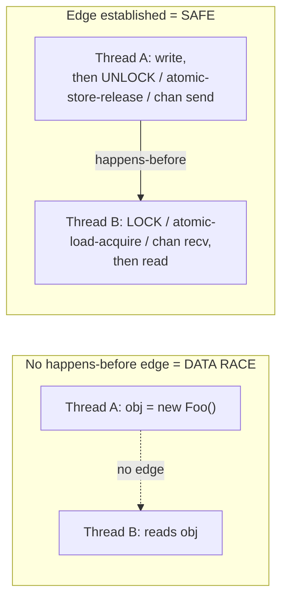

# Synchronization Misuse Anti-Patterns — Middle Level

> **Category:** [Concurrency Anti-Patterns](../README.md) → **Synchronization Misuse** — *locks and memory primitives applied in a way that compiles, runs, passes tests, and is still wrong.*
> **Covers (collectively):** Double-Checked Locking · Volatile Misuse / Wrong Memory Ordering · Race-Prone Lazy Init

---

## Table of Contents

1. [Introduction](#introduction)
2. [Prerequisites](#prerequisites)
3. [The Real Question: When Does This Creep In?](#the-real-question-when-does-this-creep-in)
4. [The One Idea You Must Hold: Happens-Before](#the-one-idea-you-must-hold-happens-before)
5. [Race-Prone Lazy Init — The Source of the Family](#race-prone-lazy-init--the-source-of-the-family)
6. [Double-Checked Locking — The Performance Temptation](#double-checked-locking--the-performance-temptation)
7. [Volatile Misuse / Wrong Memory Ordering — The Trap](#volatile-misuse--wrong-memory-ordering--the-trap)
8. [Choosing the Right Primitive](#choosing-the-right-primitive)
9. [Detecting It: Race Detectors and Concurrency Stress Tools](#detecting-it-race-detectors-and-concurrency-stress-tools)
10. [Common Mistakes](#common-mistakes)
11. [Test Yourself](#test-yourself)
12. [Cheat Sheet](#cheat-sheet)
13. [Summary](#summary)
14. [Further Reading](#further-reading)
15. [Related Topics](#related-topics)

---

## Introduction

> Focus: **When does this creep in?** and **What do I do instead?**

At the junior level you learned what these bugs *look* like: an object that's occasionally half-built, a flag that's "set" in one thread but never seen in another, two threads both running the initializer. The middle-level skill is understanding the **force** that produces all three — *the desire to coordinate threads without paying for a lock* — and knowing the correct primitive that gives you the coordination for the right price.

All three anti-patterns in this category are the same mistake seen from three angles:

- **Race-Prone Lazy Init** is the naive version: no coordination at all.
- **Double-Checked Locking** is the *clever* version: coordination that someone optimized until it broke.
- **Volatile Misuse** is the *misunderstanding*: reaching for a visibility primitive and expecting it to provide mutual exclusion.

The thread tying them together is the **memory model** — the contract that says when a write by one thread is guaranteed to be visible to a read by another. Get that contract wrong and your code works on your laptop, passes CI ten thousand times, and corrupts data once a week in production on a different CPU. This file is about reasoning in terms of *happens-before* instead of in terms of "it worked when I ran it."

---

## Prerequisites

- **Required:** You can read [`junior.md`](junior.md) — you recognize a data race and a half-constructed object.
- **Required:** You've written code with more than one thread or goroutine and shared at least one variable between them.
- **Helpful:** Basic familiarity with a mutex (`sync.Mutex`, `synchronized`, `threading.Lock`) and at least one atomic type.
- **Helpful:** You've run a test suite that passed locally and failed in CI for "no reason."
- **Helpful:** The positive-pattern background in [Clean Code → Concurrency](../../../clean-code/11-concurrency/README.md).

---

## The Real Question: When Does This Creep In?

Synchronization misuse has predictable triggers. Name the moment and you can intervene before the race ships:

| Trigger | What the engineer does | Which anti-pattern |
|---|---|---|
| **"Initializing this is expensive, do it on first use"** | `if x == nil { x = build() }` with no lock | Race-Prone Lazy Init |
| **"Taking the lock every call is slow"** | Adds an unsynchronized pre-check before the lock | Double-Checked Locking |
| **"A profiler showed lock contention"** | Replaces a mutex with a bare flag | DCL / Volatile Misuse |
| **"It's just a `bool`, a word write is atomic"** | Shares a non-atomic flag across threads | Volatile Misuse |
| **"Make it `volatile`/atomic and the race goes away"** | Marks one field volatile but the operation is compound | Volatile Misuse |
| **"Two atomics are each safe, so the pair is safe"** | Chains `atomic` ops expecting mutual exclusion | Wrong Memory Ordering |

The common thread: **the cheap-looking move (skip the lock) trades a guarantee you can't see for a speedup you usually don't need.** The correctness you give up is invisible until the hardware reorders something on a busy day.

---

## The One Idea You Must Hold: Happens-Before

Every language with threads defines a **happens-before** relation. If action *A* happens-before action *B*, then everything *A* wrote is visible to *B*. If there's **no** happens-before edge between a write and a read of the same non-atomic location, and at least one is a write, you have a **data race** — and the result is *undefined*, not merely "stale."



The edges you can rely on are not "I wrote it first in wall-clock time." They are created only by **synchronization actions**:

- Unlocking a mutex *happens-before* the next lock of the same mutex.
- A channel send *happens-before* the corresponding receive (Go).
- An atomic store-release *happens-before* an atomic load-acquire that reads it.
- `sync.Once.Do` returning *happens-before* any later `Do` call returning (Go).
- A `volatile` write *happens-before* a subsequent `volatile` read of the same field (Java).

> **The mental model:** the compiler and CPU are allowed to reorder, cache, and tear your memory operations freely — *unless* a happens-before edge forbids it. Your job is not to "hope it's visible"; it's to **draw the edge**. Every anti-pattern below is a missing or misplaced edge.

---

## Race-Prone Lazy Init — The Source of the Family

### How it creeps in

Lazy initialization is a legitimate optimization: don't build the expensive thing until someone needs it. The bug is doing it without coordination.

```go
// Go — RACE: two goroutines can both see conn == nil
var conn *DB

func GetDB() *DB {
    if conn == nil {        // read
        conn = connect()    // write — no happens-before edge to other readers
    }
    return conn
}
```

Two failure modes hide here. First, the **lost-update** race: two goroutines both observe `nil`, both call `connect()`, you get two connections and one silently leaks. Second, the subtler **visibility/publication** race: even if only one goroutine writes `conn`, another may observe a *non-nil pointer to a not-yet-initialized object*, because the write to `conn` and the writes inside `connect()` can be seen out of order by another core.

### What to do instead

**Go — `sync.Once` is the canonical answer.** It gives you exactly-once execution *and* the happens-before edge for free.

```go
var (
    conn     *DB
    connOnce sync.Once
)

func GetDB() *DB {
    connOnce.Do(func() { conn = connect() })  // runs once; Do() return is the edge
    return conn
}
```

For a value that may need to be reset or that you want stored atomically, Go 1.21+ offers `sync.OnceValue`:

```go
var getDB = sync.OnceValue(func() *DB { return connect() })  // call getDB()
```

**Java — prefer the initialization that the language already makes safe.** A `static final` field initialized in a static initializer is published safely by the JVM with zero locking on the read path (the *Initialization-on-Demand Holder* idiom):

```java
public final class Db {
    private Db() { }
    private static final class Holder {            // loaded lazily, on first use
        static final Db INSTANCE = new Db();       // JVM guarantees safe publication
    }
    public static Db get() { return Holder.INSTANCE; }  // no lock, no volatile, correct
}
```

**Python — the GIL makes the bytecode atomic, but not your compound check.** `if x is None: x = build()` is still two bytecodes with a possible thread switch between them, so two threads can both build. Use a lock, or initialize at import time.

```python
import threading

_lock = threading.Lock()
_conn = None

def get_db():
    global _conn
    if _conn is None:                 # cheap unlocked check (fine under GIL)
        with _lock:
            if _conn is None:         # re-check under the lock
                _conn = connect()
    return _conn
```

> **Key point:** lazy init is not the problem — *unsynchronized* lazy init is. Reach for the idiom your language already proved correct (`sync.Once`, holder class) before hand-rolling anything.

---

## Double-Checked Locking — The Performance Temptation

### How it creeps in

Someone profiles the safe-but-locking version, sees the mutex on every call, and "optimizes" it: check the flag *without* the lock first, and only lock if it looks uninitialized. The intent is "lock only on the rare first call."

```java
// Java — BROKEN double-checked locking (the classic 1990s bug)
class Service {
    private static Service instance;             // NOT volatile

    static Service get() {
        if (instance == null) {                  // (1) unlocked read
            synchronized (Service.class) {
                if (instance == null) {          // (2) locked re-check
                    instance = new Service();    // (3) NOT safely published
                }
            }
        }
        return instance;
    }
}
```

### Why it's broken

`instance = new Service()` is not one step. It is roughly: *allocate memory → run the constructor → publish the reference into `instance`*. The compiler/CPU may reorder steps so the reference is published **before** the constructor finishes. A second thread executing the unlocked read at **(1)** can see a non-null `instance` that points at a half-built object — and use it. There is no happens-before edge between the writing thread's constructor and the reading thread's unlocked read, so this is a data race with undefined results.

### What to do instead

**Java — if you must DCL, the field has to be `volatile`.** Since Java 5, a `volatile` write establishes the happens-before edge that publishes the fully-constructed object.

```java
class Service {
    private static volatile Service instance;    // volatile makes DCL correct

    static Service get() {
        Service result = instance;               // read volatile once into a local
        if (result == null) {
            synchronized (Service.class) {
                result = instance;
                if (result == null) {
                    instance = result = new Service();  // volatile write = safe publish
                }
            }
        }
        return result;
    }
}
```

**But prefer not to write DCL at all.** The Holder idiom above is simpler, lock-free on the read path, and impossible to get subtly wrong. DCL is a pattern you should be able to *read and audit*, not one you should reach for by default.

**Go — there is no broken DCL to write, because the idiom is `sync.Once`.** If you ever see hand-rolled DCL in Go using a bare `bool` flag, it's a bug; replace it.

```go
// Anti-pattern in Go: hand-rolled DCL with a non-atomic flag — RACE.
var done bool
var val *T
func get() *T {
    if !done {            // racing read of a plain bool
        mu.Lock()
        if !done { val = build(); done = true }
        mu.Unlock()
    }
    return val            // may read val without the edge -> half-built
}
// Fix: delete all of it, use sync.Once (see Race-Prone Lazy Init above).
```

If you genuinely need the lock-free fast path in Go (rare; measure first), `atomic.Pointer[T]` gives you a correct publish/read pair:

```go
var p atomic.Pointer[T]
func get() *T {
    if v := p.Load(); v != nil { return v }      // acquire load
    mu.Lock(); defer mu.Unlock()
    if v := p.Load(); v != nil { return v }
    v := build()
    p.Store(v)                                   // release store = safe publish
    return v
}
```

> **The lesson:** DCL is the textbook case of an optimization that looks free and isn't. The single uncontended mutex you were avoiding costs ~20ns; the bug you introduced costs an on-call incident. Default to the idiom; reach for atomics only with a profiler in hand.

---

## Volatile Misuse / Wrong Memory Ordering — The Trap

`volatile` (Java) and atomics (everywhere) solve **visibility and ordering of a single location**. They do **not** provide **mutual exclusion**. This distinction is the most expensive misunderstanding in concurrent code.

### Trap 1 — "Make it volatile" doesn't fix a compound action

```java
// Java — volatile does NOT make ++ safe
private volatile int count;
void hit() { count++; }   // read, add, write — three steps, still racy
```

`count++` is a *read-modify-write*. `volatile` guarantees each thread reads the latest value and publishes its write — but two threads can both read `5`, both compute `6`, both store `6`. You lost an increment. `volatile` is for **visibility**, not **atomicity of a compound operation**.

**Fix — use an atomic that performs the whole RMW as one indivisible step:**

```java
private final AtomicInteger count = new AtomicInteger();
void hit() { count.incrementAndGet(); }   // atomic read-modify-write
```

```go
// Go equivalent
var count atomic.Int64
func hit() { count.Add(1) }
```

### Trap 2 — Atomics don't *compose* into mutual exclusion

This is the deeper trap. Each individual atomic operation is safe. A *sequence* of them is not, because another thread can interleave between any two.

```go
// Go — each atomic op is fine; the pair is a race condition (a "check-then-act")
var balance atomic.Int64

func withdraw(amt int64) bool {
    if balance.Load() >= amt {       // atomic load: correct in isolation
        balance.Add(-amt)            // atomic add: correct in isolation
        return true                  // BUG: between Load and Add, another thread
    }                                //      withdrew too — balance goes negative
    return false
}
```

The invariant "never go below zero" spans **two** operations. No amount of per-operation atomicity protects an invariant that needs the operations to be *indivisible together*. You need either a lock around the whole check-then-act, or a single atomic primitive that does it in one step.

**Fix A — a lock makes the compound action atomic:**

```go
var (
    mu      sync.Mutex
    balance int64
)
func withdraw(amt int64) bool {
    mu.Lock(); defer mu.Unlock()
    if balance >= amt { balance -= amt; return true }
    return false
}
```

**Fix B — express the whole transition as one CAS loop** (use only when the state is a single word and you've measured a reason to avoid the lock):

```go
func withdraw(amt int64) bool {
    for {
        cur := balance.Load()
        if cur < amt { return false }
        if balance.CompareAndSwap(cur, cur-amt) { return true } // retry on conflict
    }
}
```

`CompareAndSwap` (`compareAndSet` in Java's `AtomicInteger`/`AtomicReference`) is the primitive that turns a check-then-act into an atomic step: it writes *only if* the value still matches what you read, otherwise you loop. This is how lock-free code composes — explicitly, with retries — not by hoping two atomics line up.

### Trap 3 — Wrong memory ordering

When you do reach for raw atomics, the **ordering** matters. A relaxed (unordered) atomic guarantees the single location is atomic but makes **no promise about surrounding reads/writes**. The classic publish bug:

```text
Thread A:                         Thread B:
  data = 42;          // plain      if (ready.load()) {     // relaxed
  ready.store(true);  // relaxed       use(data);  // may see data == 0 (stale!)
                                     }
```

With *relaxed* ordering there's no happens-before edge between `data = 42` and B's read of `data`, so B can see `ready == true` but `data == 0`. You need **release** on the store and **acquire** on the load to publish `data` safely. In Go, the `sync/atomic` types give you acquire/release semantics by default — but the *flag and the data are still two separate things*; only the flag is atomic. The correct pattern is to publish the data *through* the atomic (store a pointer to the fully-built struct), not alongside it.

> **The one-sentence rule:** atomics and `volatile` give you a *safe single variable*; they never give you a *safe multi-step invariant*. The moment your correctness depends on two operations being indivisible, you need a lock or a single composite atomic — not "more volatile."

---

## Choosing the Right Primitive

Decide by asking *what is being protected* and *how many words it spans*:

| Situation | Right primitive | Why |
|---|---|---|
| Run an initializer exactly once | `sync.Once` (Go), Holder idiom (Java) | Built-in exactly-once + happens-before edge |
| One thread writes a flag, others read it | `atomic.Bool` (Go), `volatile boolean` (Java) | Visibility of a single word; no compound action |
| Increment / accumulate a counter | `atomic.Int64.Add` / `AtomicInteger` | Atomic read-modify-write in one step |
| Publish a pointer to a built object | `atomic.Pointer[T]` (Go), `AtomicReference` / `volatile` (Java) | Release store publishes the whole object |
| Conditionally update one word (check-then-act) | `CompareAndSwap` / `compareAndSet` loop | Makes the check-then-act indivisible |
| Invariant spanning **2+ fields** | **Mutex** (`sync.Mutex`, `synchronized`, `Lock`) | Only a lock makes a multi-word region atomic |
| Producer→consumer handoff (Go) | **Channel** | Send happens-before receive; transfers ownership |

The decision tree in one line: **single word, single op → atomic; single word, conditional update → CAS; more than one word that must stay consistent together → lock or channel.** When in doubt, use a mutex; an uncontended mutex is cheap and always correct.

---

## Detecting It: Race Detectors and Concurrency Stress Tools

You cannot find these bugs by reading more carefully or running the test again. You need tools that *instrument the memory model*.

**Go — the race detector is non-negotiable.** It instruments every memory access and reports any read/write pair lacking a happens-before edge.

```bash
go test -race ./...          # run the whole suite under the detector
go run -race ./cmd/server    # or run a binary; reports races as they happen
```

It produces zero false positives: a report is a real race on that execution. The catch is it only catches races on code paths that *actually execute concurrently during the run* — so feed it concurrent tests, not single-threaded ones. Run `-race` in CI, not just locally. (It adds ~5–10× CPU and ~5–10× memory, so it's a test/staging tool, not a production build flag.)

A test that reliably surfaces the lazy-init race:

```go
func TestGetDB_Concurrent(t *testing.T) {
    var wg sync.WaitGroup
    for i := 0; i < 100; i++ {
        wg.Add(1)
        go func() { defer wg.Done(); _ = GetDB() }()  // -race flags any missing edge
    }
    wg.Wait()
}
```

**Java — `jcstress` for memory-model bugs, TSan/Helgrind for native.** Ordinary JUnit tests will not reliably reproduce a reordering. The OpenJDK [`jcstress`](https://github.com/openjdk/jcstress) harness runs a tiny snippet across many threads, billions of times, on real hardware, and tabulates which interleavings actually occur — it will *show you* a torn read from a broken DCL. For JNI/native code, run under ThreadSanitizer (`-fsanitize=thread`) or Valgrind Helgrind. Static analysis (SpotBugs' multithreading detectors) flags classic shapes like non-`volatile` DCL.

**Python — `threading` + load.** The GIL hides most low-level visibility bugs, so your races are almost always *logical* check-then-act compounds. Reproduce by spawning many threads hammering the same path; under free-threaded (no-GIL) builds (3.13+), treat Python like any other language and lock your compound actions.

> **Practice rule:** any package with shared state must have at least one concurrent test, and CI must run it under the race detector. "It passed `go test`" without `-race` is not evidence of correctness for concurrent code.

---

## Common Mistakes

1. **Assuming `volatile`/atomic gives mutual exclusion.** It gives visibility and per-operation atomicity of *one* location — never atomicity of a multi-step sequence.
2. **Hand-rolling double-checked locking when `sync.Once` / a Holder class exists.** The idiom is simpler and provably correct; bespoke DCL is a famous source of subtle bugs.
3. **DCL in Java without `volatile` on the field.** Pre-Java-5 it was unfixable; today it's fixable but still a "can you justify not using the Holder idiom?" smell.
4. **Composing two safe atomics and calling it safe.** Check-then-act across two atomics has a window between them; use `CompareAndSwap` or a lock.
5. **`count++` on a `volatile`/atomic-typed variable and expecting no lost updates.** Use `incrementAndGet` / `Add` — the RMW must be one operation.
6. **Trusting "it works on my machine."** Memory reordering is hardware- and JIT-dependent; x86 hides many bugs that ARM exposes. Your laptop is not the deployment target.
7. **Running tests without `-race` (Go) or without `jcstress` (Java).** A green single-threaded run says nothing about concurrent correctness.
8. **Publishing data *next to* an atomic flag instead of *through* it.** Store a pointer to the fully-built object atomically; don't set `data` then a separate `ready` flag and hope the order holds.

---

## Test Yourself

1. You profile a hot path and see a mutex taken on every call to fetch a lazily-built config. A colleague suggests an unlocked `if cfg == nil` pre-check before the lock. In Go, what do you do instead, and why is the pre-check dangerous?
2. In Java, why does `private static Service instance;` (no `volatile`) break double-checked locking even though there's a `synchronized` block?
3. `private volatile int hits; void record() { hits++; }` — is this correct under concurrency? If not, fix it.
4. Two threads call `withdraw` using `balance.Load()` then `balance.Add(-amt)`, both atomic. Explain how the balance still goes negative, and give two correct fixes.
5. What happens-before edges do each of these create: a mutex unlock, a Go channel send, a `sync.Once.Do` return, a Java `volatile` write?
6. Your concurrent test passes 10,000 times locally. What single change to how you *run* it would actually exercise the memory model, and what's its limitation?

<details>
<summary>Answers</summary>

1. Use `sync.Once` (or `sync.OnceValue`): `once.Do(func(){ cfg = build() })`. The unlocked `if cfg == nil` pre-check is a data race — there's no happens-before edge between the writer's initialization and another goroutine's unlocked read, so a reader may see a non-nil pointer to a not-yet-initialized object, *and* two goroutines may both build. `sync.Once` gives exactly-once execution plus the publication edge with no bespoke DCL.
2. `instance = new Service()` is allocate → construct → publish-reference, and the steps may be reordered so the reference is visible *before* the constructor finishes. A second thread doing the unlocked outer `if (instance == null)` read can see a non-null reference to a half-built object. `volatile` (Java 5+) inserts the release/acquire edge so the published reference implies a fully-constructed object. Better still: use the Initialization-on-Demand Holder idiom.
3. Not correct. `volatile` gives visibility but `hits++` is a read-modify-write; two threads can both read N and both store N+1, losing an increment. Fix: `private final AtomicInteger hits = new AtomicInteger(); ... hits.incrementAndGet();`.
4. Between thread A's `Load()` (sees enough) and its `Add(-amt)`, thread B also `Load()`s the same value, also passes the check, and also subtracts — the invariant "≥ 0" spans two operations that aren't indivisible together. Fixes: (a) take a `sync.Mutex` around the whole check-then-subtract; (b) use a `CompareAndSwap` loop that only subtracts if the value still matches what you read.
5. Mutex unlock happens-before the next lock of the same mutex. A channel send happens-before the corresponding receive completing. `sync.Once.Do` returning happens-before any later `Do` returning (so the initialized value is visible). A Java `volatile` write happens-before any subsequent `volatile` read of the same field.
6. Run it with the race detector: `go test -race`. It instruments every access and reports any racing read/write pair with zero false positives. Limitation: it only catches races on code paths that *actually run concurrently during that execution*, so you must drive real concurrency in the test; it can't prove the absence of races on unexercised interleavings.

</details>

---

## Cheat Sheet

| Anti-pattern | Creeps in when… | Countermove |
|---|---|---|
| **Race-Prone Lazy Init** | "Build it on first use" with no lock | `sync.Once` (Go) / Holder idiom (Java) / lock under GIL (Py) |
| **Double-Checked Locking** | "Locking every call is slow," add unlocked pre-check | Prefer the idiom; if you must DCL, field must be `volatile` / `atomic.Pointer` |
| **Volatile Misuse** | "Make it `volatile` and the race is gone" | `volatile`/atomic = visibility only; use atomic RMW for `++`, lock for compound |
| **Wrong Memory Ordering** | "Two atomics are each safe → the pair is safe" | `CompareAndSwap`/`compareAndSet` loop, or a lock; publish *through* the atomic |

**Three golden rules:**
- *Draw the happens-before edge on purpose — don't hope visibility happens.*
- *Atomics protect one word; an invariant over many words needs a lock or a channel.*
- *Run concurrent code under `go test -race` / `jcstress` in CI — a green serial run proves nothing.*

---

## Summary

- All three patterns are one mistake — *coordinating threads without paying for the right primitive* — seen at three stages: no coordination (Race-Prone Lazy Init), broken-clever coordination (Double-Checked Locking), and misunderstood coordination (Volatile Misuse / Wrong Ordering).
- Reason in terms of **happens-before**: a write is only guaranteed visible to a read if a synchronization action (unlock→lock, channel send→receive, atomic release→acquire, `Once.Do`) links them. No edge + a write = data race = undefined behavior.
- **Lazy init:** use `sync.Once`/`OnceValue` (Go) or the Holder idiom (Java); lock the compound check under Python's GIL.
- **DCL:** default to the idiom; if you genuinely hand-roll it, the published field *must* be `volatile`/`atomic.Pointer`. An uncontended mutex (~tens of ns) is cheaper than the incident.
- **Volatile/atomics give visibility and single-op atomicity, never mutual exclusion.** `count++` needs an atomic RMW; an invariant spanning two fields needs a lock or a single CAS.
- **Detect with tools, not re-reads:** `go test -race` in CI (Go), `jcstress` / TSan (Java/native). A passing serial test is no evidence of concurrent correctness.
- Next: [`senior.md`](senior.md) — debugging these in production, lock-free design trade-offs, and per-platform memory-ordering detail.

---

## Further Reading

- **Java Concurrency in Practice** — Brian Goetz et al. (2006) — the definitive treatment of safe publication, `volatile`, the broken DCL story, and atomics vs. locks.
- **The Go Memory Model** — [go.dev/ref/mem](https://go.dev/ref/mem) — the exact happens-before guarantees for mutexes, channels, `sync.Once`, and `sync/atomic`.
- **The JSR-133 (Java Memory Model) FAQ** — Jeremy Manson & Brian Goetz — why pre-Java-5 DCL was unfixable and what `volatile` now guarantees.
- **C++ Concurrency in Action** — Anthony Williams (2nd ed., 2019) — acquire/release/relaxed memory ordering and lock-free composition, applicable in concept across languages.
- **jcstress** — [github.com/openjdk/jcstress](https://github.com/openjdk/jcstress) — the harness for empirically demonstrating memory-model bugs.

---

## Related Topics

- [Clean Code → Concurrency](../../../clean-code/11-concurrency/README.md) — the positive patterns these anti-patterns violate.
- [Clean Code → Immutability](../../../clean-code/14-immutability/README.md) — the deeper cure: data that can't be raced because it never changes.
- [Coordination Anti-Patterns](../02-coordination/README.md) — the sibling category: deadlocks, holding locks during I/O, wrong granularity.
- [Shared State Anti-Patterns](../03-shared-state/README.md) — unprotected shared mutable state, the root cause this category keeps circling back to.
