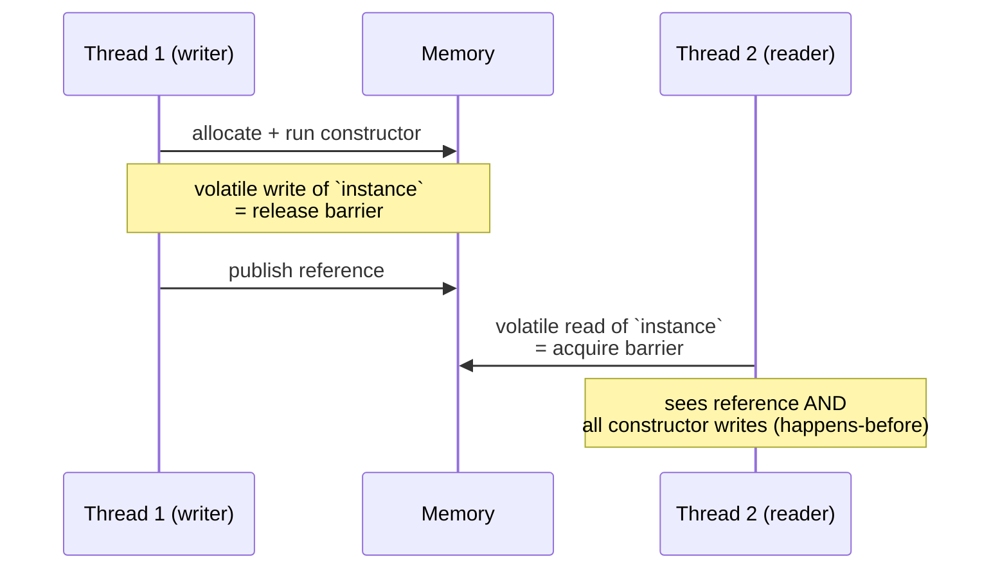

# Synchronization Misuse — Refactoring Practice

> **Category:** [Concurrency Anti-Patterns](../README.md) → **Synchronization Misuse** — *locks and memory primitives applied wrongly, so "synchronized" code still races.*
> **Covers (collectively):** Double-Checked Locking · Volatile Misuse / Wrong Memory Ordering · Race-Prone Lazy Init

---

These are not "spot the race" puzzles — [`find-bug.md`](find-bug.md) does that. Here each "Before" is **working-but-unsafe** (or unsafe only under load): it passes a single-threaded test, ships, and then corrupts state once in 10,000 production runs. Your job is to transform it into something **provably race-free** — and, where the original over-synchronized, **faster** — without changing its observable contract.

The skill on display is the *process*, not just the destination. Concurrency bugs do not yield to "read it harder." They yield to a loop:

1. **Reproduce with a tool.** A race that "can't happen" happens under `go test -race`, `java -jar jcstress`, or a stress harness that hammers the code from N threads. If you can't make it fail, you can't prove you fixed it.
2. **Fix with the smallest correct primitive.** `sync.Once` for one-time init; a lock for a *compound* action; an `atomic` only for a *genuinely independent* single operation. Reach for the weakest tool that is still correct.
3. **Verify race-free.** Re-run the detector and the stress harness. A green race detector over many iterations is your characterization test for "no data race." Where you also claimed a speedup, attach a benchmark.

> **A word on Python.** CPython's GIL serializes bytecode, so a single `x += 1` rarely *tears* — but it is **not** atomic (it's `LOAD/ADD/STORE`, interruptible between ops), and compound actions (`if k not in d: d[k] = ...`) still race. The GIL hides data races, it does not remove the *logic* races. Free-threaded builds (PEP 703, 3.13+ `--disable-gil`) remove even that cover. So the Python examples below show the logic race that survives the GIL.

> **How to use this file:** read the "Before", write down your fix *and how you'd reproduce the race* before expanding the solution, then compare. The gap between your plan and the worked plan is the learning.

---

## Table of Contents

| # | Exercise | Anti-pattern(s) | Lang | Key move |
|---|---|---|---|---|
| 1 | [Race-prone singleton → `sync.Once`](#exercise-1--race-prone-singleton--synconce) | Race-Prone Lazy Init | Go | Replace nil-check init with `sync.Once` |
| 2 | [Lazy field → initialization-on-demand holder](#exercise-2--lazy-field--initialization-on-demand-holder) | Race-Prone Lazy Init | Java | Holder idiom (class-init JLS guarantee) |
| 3 | [Hand-rolled DCL → correct `volatile` DCL](#exercise-3--hand-rolled-dcl--correct-volatile-dcl) | Double-Checked Locking + Volatile Misuse | Java | Add `volatile`, or prefer the holder |
| 4 | [Go "DCL" with a plain bool → `Once`](#exercise-4--go-dcl-with-a-plain-bool--once) | Double-Checked Locking | Go | Delete the broken DCL; use `sync.Once` |
| 5 | [`volatile` flag guarding a compound action](#exercise-5--volatile-flag-guarding-a-compound-action) | Volatile Misuse | Java | Replace check-then-act with a lock |
| 6 | [Non-atomic `volatile` counter → atomic](#exercise-6--non-atomic-volatile-counter--atomic) | Volatile Misuse | Java | `AtomicLong` / `LongAdder` |
| 7 | [Lazy cache map: lost writes → `Once`-per-key](#exercise-7--lazy-cache-map-lost-writes--once-per-key) | Race-Prone Lazy Init | Go | Per-key `Once`, or `singleflight` |
| 8 | [`atomic.Value` config: torn compound update](#exercise-8--atomicvalue-config-torn-compound-update) | Volatile Misuse / Ordering | Go | CAS loop or copy-on-write swap |
| 9 | [Python lazy init under the GIL](#exercise-9--python-lazy-init-under-the-gil) | Race-Prone Lazy Init | Python | `threading.Lock` once-guard |
| 10 | [`synchronized`-everything → scoped locking + atomics](#exercise-10--synchronized-everything--scoped-locking--atomics) | Volatile Misuse / over-locking | Java | Split lock; atomics for independent state (perf) |
| 11 | [Keep the atomic — the counter-case](#exercise-11--keep-the-atomic--the-counter-case) | (correct lock-free) | Go | Recognize when `atomic` IS the right answer |
| 12 | [The combo: broken DCL + volatile compound + lost init](#exercise-12--the-combo-broken-dcl--volatile-compound--lost-init) | All three | Go | Full toolbox, in order |

---

## Exercise 1 — Race-prone singleton → `sync.Once`

**Anti-pattern:** Race-Prone Lazy Init. **Goal:** make first-call initialization safe under concurrent callers. **Constraints:** preserve the API (`Instance() *Config`); exactly one `Config` must ever be built; preserve laziness (no init until first call).

```go
// Before — two goroutines can both see cfg == nil and both build one.
var cfg *Config

func Instance() *Config {
	if cfg == nil {
		cfg = loadConfig() // expensive: reads file + parses
	}
	return cfg
}
```

<details>
<summary>Refactored</summary>

**Move sequence**

1. **Reproduce the race.** A test that launches the constructor from many goroutines and runs under the detector:

   ```go
   func TestInstance_Race(t *testing.T) {
   	var wg sync.WaitGroup
   	got := make([]*Config, 50)
   	for i := 0; i < 50; i++ {
   		wg.Add(1)
   		go func(i int) { defer wg.Done(); got[i] = Instance() }(i)
   	}
   	wg.Wait()
   	for _, g := range got {
   		if g != got[0] {
   			t.Fatalf("got multiple instances")
   		}
   	}
   }
   ```

   Run `go test -race -count=100`. The `cfg = loadConfig()` write racing the `cfg == nil` read trips the detector; without `-race` you may also observe two distinct pointers (lost init).
2. **Replace the nil-check init with `sync.Once`.** `Once.Do` gives a happens-before guarantee: the body runs exactly once, and every caller that returns from `Do` observes its completed writes. This is the canonical Go cure for lazy init *and* "DCL done right" in one primitive.

```go
// After — sync.Once: runs once, publishes safely, stays lazy.
var (
	cfg     *Config
	cfgOnce sync.Once
)

func Instance() *Config {
	cfgOnce.Do(func() { cfg = loadConfig() })
	return cfg
}
```

**How to verify.** `go test -race -count=100` is now clean, and the multi-goroutine test always sees one identical pointer. The fast path after init is a single atomic load inside `Once.Do` (it checks a `done` flag with `atomic` before taking the mutex) — so you keep most of the "skip the lock" performance you were chasing, but *correctly*. **Don't** "optimize" by reading `cfg` outside `Do`; that reintroduces the unsynchronized read.

</details>

---

## Exercise 2 — Lazy field → initialization-on-demand holder

**Anti-pattern:** Race-Prone Lazy Init. **Goal:** lazily initialize an expensive field, thread-safely, with **no locking on the hot path**. **Constraints:** Java; preserve laziness; `getCache()` returns the same instance for all callers.

```java
// Before — classic racy lazy init; two threads build two caches.
class Registry {
    private ExpensiveCache cache; // not volatile, not guarded

    ExpensiveCache getCache() {
        if (cache == null) {
            cache = new ExpensiveCache(); // visible half-built to other threads
        }
        return cache;
    }
}
```

<details>
<summary>Refactored</summary>

**Move sequence**

1. **Reproduce with jcstress.** Two actors: one calls `getCache()`, the other calls `getCache()`; assert both observe the *same, fully constructed* reference. Under the Java Memory Model the unsynchronized publication allows a thread to see `cache != null` while `ExpensiveCache`'s fields are still default — jcstress will surface the `ACCEPTABLE_INTERESTING` / forbidden outcomes.
2. **Apply the Initialization-on-Demand Holder idiom.** A nested static class is not loaded until first referenced; the JVM guarantees class initialization is thread-safe and happens-before any use (JLS §12.4.2). You get lazy + safe + lock-free *for free* — no `volatile`, no `synchronized`.

```java
// After — holder idiom: JVM class-init gives lazy, safe, lock-free publication.
class Registry {
    private static class Holder {
        static final ExpensiveCache INSTANCE = new ExpensiveCache();
    }

    ExpensiveCache getCache() {
        return Holder.INSTANCE;
    }
}
```

**How to verify.** The jcstress test now only ever observes the one fully-constructed instance (all "saw half-built" outcomes vanish). The hot path is a single static field read with **zero synchronization** — strictly faster than any DCL. Caveat to note in review: the holder ties laziness to *first access of `getCache`*; if you needed per-`Registry`-instance laziness rather than per-class, use `sync`-equivalent (an `AtomicReference` CAS) instead — the holder is for singletons.

</details>

---

## Exercise 3 — Hand-rolled DCL → correct `volatile` DCL

**Anti-pattern:** Double-Checked Locking + Volatile Misuse. **Goal:** fix a DCL that omits `volatile` (the textbook broken version). **Constraints:** Java; keep the "check, lock, check" shape if you must keep DCL; one instance only.

```java
// Before — DCL WITHOUT volatile: broken on the JMM. The poster child.
class Service {
    private static Service instance;          // <-- missing volatile

    static Service getInstance() {
        if (instance == null) {                // 1st check (no lock)
            synchronized (Service.class) {
                if (instance == null) {        // 2nd check (locked)
                    instance = new Service();  // <-- can be seen reordered
                }
            }
        }
        return instance;
    }
}
```

<details>
<summary>Refactored</summary>

**Why it's broken (state it precisely).** `instance = new Service()` is *three* steps: allocate, run constructor, publish the reference. The JMM permits the compiler/CPU to publish the reference *before* the constructor's writes are visible. A second thread on the lock-free first check can then see a non-null `instance` whose fields are still defaults — and use a half-built object. No exception, just garbage, occasionally.

**Move sequence**

1. **Reproduce with jcstress.** Actor 1: `getInstance()` then read a field that the constructor sets to a non-default value. Actor 2: same. The forbidden outcome is "reference non-null but field still 0/null." Without `volatile`, jcstress reports it as observed on weak-memory hardware (or with aggressive JIT).
2. **The minimal fix: make the field `volatile`.** `volatile` on the reference establishes a happens-before edge: the constructor's writes are ordered before the volatile publish, and the lock-free read sees them. DCL is *only* correct in Java with a `volatile` field.
3. **The better fix: prefer the holder (Exercise 2).** DCL is fragile and easy to regress (someone drops `volatile` in a "cleanup"). Use it only when laziness must be per-instance and you can't use the holder.

```java
// After (minimal) — volatile makes the lock-free read safe.
class Service {
    private static volatile Service instance;   // volatile is mandatory

    static Service getInstance() {
        Service local = instance;                // read volatile once
        if (local == null) {
            synchronized (Service.class) {
                local = instance;
                if (local == null) {
                    local = new Service();
                    instance = local;            // volatile write publishes ctor effects
                }
            }
        }
        return local;
    }
}
```



**How to verify.** jcstress no longer observes the "half-built" outcome with the `volatile` field. The `local` copy is a small optimization (one volatile read on the hot path instead of two). **Note for reviewers:** if you can, replace the whole thing with the holder — the `volatile` DCL is correct but carries a standing regression risk; the holder cannot be silently broken.

</details>

---

## Exercise 4 — Go "DCL" with a plain bool → `Once`

**Anti-pattern:** Double-Checked Locking (ported from Java, wrong in Go). **Goal:** kill a hand-ported DCL that uses an unsynchronized `bool`. **Constraints:** Go; one init only; preserve laziness.

```go
// Before — DCL transliterated from Java; `done` is read without synchronization.
var (
	mu   sync.Mutex
	done bool
	conn *DB
)

func GetDB() *DB {
	if !done { // UNSYNCHRONIZED read — data race with the write below
		mu.Lock()
		if !done {
			conn = open()
			done = true
		}
		mu.Unlock()
	}
	return conn // also an unsynchronized read of conn
}
```

<details>
<summary>Refactored</summary>

**Why it's broken in Go.** Go has no `volatile`. The Go Memory Model gives *no* ordering guarantee for the lock-free `!done` read against the `mu`-protected `done = true` write — it's a textbook data race. There is no "add volatile" rescue; the idiom simply doesn't port. The detector will flag both the `done` and `conn` reads.

**Move sequence**

1. **Reproduce.** N goroutines call `GetDB()`; run `go test -race -count=50`. The detector reports a read/write race on `done` (and `conn`).
2. **Delete the DCL entirely; use `sync.Once`.** `Once` *is* the correct, fast double-checked lock in Go: internally it does an `atomic.Load` of a done flag (the cheap fast path) and only takes the mutex on the slow path. You cannot beat it by hand without re-implementing it (and getting the atomics right).

```go
// After — sync.Once is the correct, lock-free-fast-path DCL.
var (
	once sync.Once
	conn *DB
)

func GetDB() *DB {
	once.Do(func() { conn = open() })
	return conn
}
```

**How to verify.** `go test -race -count=50` is clean. The fast path post-init is one atomic load (inside `Do`) — equivalent in spirit to the DCL you were trying to write, but correct. If you genuinely need the value *returned* with its own error, use `OnceValues` (Go 1.21+): `getDB := sync.OnceValues(func() (*DB, error){ ... })`.

</details>

---

## Exercise 5 — `volatile` flag guarding a compound action

**Anti-pattern:** Volatile Misuse (treating `volatile` as a lock). **Goal:** fix a check-then-act that uses `volatile` for mutual exclusion. **Constraints:** Java; at most one transfer of `pending` into `processed`; preserve the result.

```java
// Before — volatile gives visibility, NOT atomicity; this races.
class Inbox {
    private volatile boolean hasWork = false;
    private Work pending;
    private final List<Work> processed = new ArrayList<>();

    void submit(Work w) { pending = w; hasWork = true; }

    void drain() {
        if (hasWork) {            // check
            processed.add(pending); // act  <-- two threads can both pass the check
            hasWork = false;
        }
    }
}
```

<details>
<summary>Refactored</summary>

**Why it's broken.** `volatile` makes a *single* read or write visible across threads; it does **not** make the read-modify-write (`if hasWork { ...; hasWork = false }`) atomic. Two `drain()` callers can both read `hasWork == true`, both `add(pending)`, double-processing. And `processed` (an `ArrayList`) is mutated without synchronization — a second, separate data race that can corrupt the list internals.

**Move sequence**

1. **Reproduce with jcstress / a stress test.** Two actors call `drain()` after one `submit()`. Assert `processed.size() <= 1`. The forbidden outcome `size == 2` (and `ArrayList` corruption / lost element) appears under contention.
2. **Replace the volatile-guarded compound action with a lock** so check-and-act is one atomic critical section. The flag's *visibility* job is now subsumed by the lock's happens-before.

```java
// After — a lock makes check-and-act one indivisible step.
class Inbox {
    private final Object lock = new Object();
    private boolean hasWork = false;     // no longer needs volatile; lock guards it
    private Work pending;
    private final List<Work> processed = new ArrayList<>();

    void submit(Work w) {
        synchronized (lock) { pending = w; hasWork = true; }
    }

    void drain() {
        synchronized (lock) {
            if (hasWork) {
                processed.add(pending);
                hasWork = false;
            }
        }
    }
}
```

**How to verify.** jcstress now only ever observes `processed.size() == 1`; the `ArrayList` is mutated only under the lock, so its internal-corruption outcomes vanish too. **Key lesson to record:** `volatile` is for a *single* flag/reference whose readers don't combine it with other state into a compound action. The moment you have *check-then-act* or *read-modify-write* across more than one variable, you need a lock (or a single CAS on a single variable — see Exercises 6, 8).

</details>

---

## Exercise 6 — Non-atomic `volatile` counter → atomic

**Anti-pattern:** Volatile Misuse (`volatile++` is not atomic). **Goal:** fix a lost-update counter. **Constraints:** Java; exact count under N concurrent incrementers; keep it lock-free if possible (this *is* an independent operation).

```java
// Before — volatile makes ++ visible but NOT atomic: lost updates.
class Metrics {
    private volatile long hits = 0;

    void record() { hits++; }   // read, +1, write — interleaves and loses
    long hits()   { return hits; }
}
```

<details>
<summary>Refactored</summary>

**Why it's broken.** `hits++` is `read → add → write`. `volatile` guarantees each read and each write is visible, but two threads can read the same value, both add 1, both write — one increment is lost. The final count drifts below `N`.

**Move sequence**

1. **Reproduce.** Spawn many threads, each calling `record()` a fixed number of times; assert the total equals `threads * perThread`. Without atomics it comes up short, reproducibly, under load (no special tool needed — the count itself is the oracle; jcstress confirms it formally).
2. **This is a genuinely independent single operation — so a lock-free atomic is the *right* tool, not over-engineering.** Use `AtomicLong.incrementAndGet()`, which compiles to a CAS loop (or a hardware fetch-add). Under heavy contention, prefer `LongAdder` (per-thread cells, summed on read) for throughput.

```java
// After — AtomicLong: atomic increment, lock-free, correct.
class Metrics {
    private final AtomicLong hits = new AtomicLong();

    void record() { hits.incrementAndGet(); }
    long hits()   { return hits.get(); }
}

// Higher-contention variant: trades read cost for write throughput.
class MetricsHot {
    private final LongAdder hits = new LongAdder();
    void record() { hits.increment(); }
    long hits()   { return hits.sum(); }   // approximate during concurrent updates
}
```

**How to verify.** The total now equals `threads * perThread` every run, and jcstress shows no lost updates. **Benchmark sketch** (JMH, 8 threads, increment-heavy): `synchronized hits++` ≈ baseline; `AtomicLong` is faster under low contention; `LongAdder` wins decisively under high contention because threads update disjoint cells and only contend at `sum()`. Pick `AtomicLong` when reads are frequent and exactness during reads matters; `LongAdder` for write-dominated counters where `sum()` is occasional.

</details>

---

## Exercise 7 — Lazy cache map: lost writes → `Once`-per-key

**Anti-pattern:** Race-Prone Lazy Init (per key). **Goal:** lazily compute and cache an expensive value per key, building each value at most once. **Constraints:** Go; preserve `Get(key)` returning the memoized value; never build the same key twice concurrently.

```go
// Before — concurrent Get on a cold key both miss, both build, one wins (work wasted + data race on the map).
type Cache struct {
	m map[string]*Val
}

func (c *Cache) Get(key string) *Val {
	if v, ok := c.m[key]; ok { // concurrent map read racing a write below
		return v
	}
	v := build(key) // expensive; multiple goroutines build the same key
	c.m[key] = v    // concurrent map write — fatal "concurrent map writes" panic
	return v
}
```

<details>
<summary>Refactored</summary>

**Why it's broken.** Two problems: (1) the `map` is read and written without synchronization — Go panics with `fatal error: concurrent map writes`, and `-race` flags the read/write race; (2) even with a lock, naive `check-miss-build-store` lets several goroutines build the *same cold key* simultaneously, wasting the expensive `build`.

**Move sequence**

1. **Reproduce.** Many goroutines call `Get("k")` for a cold key under `go test -race`; you'll hit the map-write panic and/or `build` invoked more than once (count calls with an atomic).
2. **Guard the map with a mutex, and use a per-key `*sync.Once`** so each key is built exactly once while other keys proceed in parallel. Store the `Once` under the lock; run `Do` outside the lock so a slow `build` doesn't block unrelated keys.

```go
// After — per-key Once: build each key exactly once; no map race; concurrent keys parallel.
type entry struct {
	once sync.Once
	val  *Val
}

type Cache struct {
	mu sync.Mutex
	m  map[string]*entry
}

func NewCache() *Cache { return &Cache{m: make(map[string]*entry)} }

func (c *Cache) Get(key string) *Val {
	c.mu.Lock()
	e, ok := c.m[key]
	if !ok {
		e = &entry{}
		c.m[key] = e
	}
	c.mu.Unlock()

	e.once.Do(func() { e.val = build(key) }) // build off the map lock; once per key
	return e.val
}
```

**How to verify.** `go test -race -count=50` is clean; an atomic counter inside `build` shows it runs exactly once per key under a concurrent stampede. Holding `mu` only for the tiny map lookup (not across `build`) keeps the lock uncontended — see [Holding a Lock During I/O](../02-coordination/README.md) for why building under the lock would be the next anti-pattern. **Production alternative:** `golang.org/x/sync/singleflight` collapses concurrent identical calls and also handles errors and cancellation — reach for it when `build` can fail.

</details>

---

## Exercise 8 — `atomic.Value` config: torn compound update

**Anti-pattern:** Volatile Misuse / Wrong Memory Ordering (atomics chained without thinking). **Goal:** update two related config fields together so readers never see a half-updated config. **Constraints:** Go; readers are lock-free and frequent; writers are rare; a reader must see a *consistent* (host, port) pair.

```go
// Before — two independent atomics; a reader can see new host with old port.
var host atomic.Pointer[string]
var port atomic.Int64

func Reload(h string, p int64) {
	host.Store(&h) // reader between these two lines sees (newHost, oldPort)
	port.Store(p)
}

func Endpoint() string {
	return *host.Load() + ":" + strconv.FormatInt(port.Load(), 10)
}
```

<details>
<summary>Refactored</summary>

**Why it's broken.** Each field is individually atomic, but the *pair* is not. A reader interleaving between the two `Store`s observes a mix — new host, stale port — a torn read of a compound value. Chaining atomics gives you per-field ordering, not whole-struct consistency.

**Move sequence**

1. **Reproduce.** One writer loops `Reload` between `("a", 1)` and `("b", 2)`; many readers call `Endpoint()` and assert the result is only ever `"a:1"` or `"b:2"`, never `"a:2"`/`"b:1"`. The mixed values appear quickly under `-race`-clean but logically wrong runs (this is a *logic* race, not a data race — `-race` won't flag it; the assertion is the oracle).
2. **Make the unit of atomicity the whole immutable snapshot.** Store one `*Config` via `atomic.Pointer[Config]` and swap it copy-on-write. Readers get a self-consistent snapshot in a single atomic load; writers publish a fully-built new value atomically.

```go
// After — one atomic pointer to an immutable snapshot: readers always consistent.
type Config struct {
	Host string
	Port int64
}

var current atomic.Pointer[Config]

func Reload(h string, p int64) {
	current.Store(&Config{Host: h, Port: p}) // one atomic publish of a complete value
}

func Endpoint() string {
	c := current.Load() // single atomic load → consistent (Host, Port)
	return c.Host + ":" + strconv.FormatInt(c.Port, 10)
}
```

**How to verify.** The reader assertion now only ever sees `"a:1"` or `"b:2"`. Readers stay lock-free (one atomic load) — the desired perf — and writers, being rare, pay only an allocation. **The principle:** when several values must change together, make the *atomic unit* the whole immutable bundle (copy-on-write) rather than coordinating several atomics. If writers must also *read-then-update* (e.g., bump a counter inside the config), use a `CompareAndSwap` loop on the pointer:

```go
func Bump() {
	for {
		old := current.Load()
		next := *old      // copy
		next.Port++
		if current.CompareAndSwap(old, &next) { return } // retry on lost race
	}
}
```

This is the correct lock-free read-modify-write of a compound value — a CAS loop, not chained stores.

</details>

---

## Exercise 9 — Python lazy init under the GIL

**Anti-pattern:** Race-Prone Lazy Init (survives the GIL). **Goal:** initialize a shared resource once across threads. **Constraints:** Python; one `Connection` for all callers; works on free-threaded 3.13+ too.

```python
# Before — the GIL does NOT save you: the check and the assign can be interrupted.
_conn = None

def get_conn():
    global _conn
    if _conn is None:          # thread A passes the check...
        _conn = connect()      # ...switches out before assigning; thread B also builds one
    return _conn
```

<details>
<summary>Refactored</summary>

**Why it's broken (even with the GIL).** The GIL guarantees one bytecode at a time, not one *function* at a time. A thread switch can land between the `if _conn is None` check and the `_conn = connect()` assignment — especially because `connect()` itself releases the GIL on I/O. Two threads then each build a `Connection`; one is silently discarded (and may leak a socket). On free-threaded builds the window is even wider.

**Move sequence**

1. **Reproduce.** Launch many threads calling `get_conn()` with a `connect()` that `time.sleep(0.01)`s (simulating I/O, releasing the GIL); count constructions with a plain counter. Without a guard, count > 1.
2. **Guard with a lock and double-check inside it** — the Pythonic once-idiom. (For module-global singletons, the simplest correct option is often eager init at import, which Python serializes; use the lock when laziness is required.)

```python
# After — lock + recheck: built exactly once, GIL or no GIL.
import threading

_conn = None
_lock = threading.Lock()

def get_conn():
    global _conn
    if _conn is None:               # cheap fast path after init (no lock)
        with _lock:
            if _conn is None:       # recheck under the lock
                _conn = connect()
    return _conn
```

**How to verify.** The construction counter is exactly 1 under the threaded stampede, including with `connect()` sleeping. Note this *is* a correct double-checked lock — and it is safe in Python because attribute/global *reference* assignment is a single bytecode (no torn pointer like the JMM allows). On free-threaded CPython the recheck-under-lock is what carries correctness. For pure once-only side-effecting init with no return value, `functools` users sometimes wrap it; the explicit lock above is the clearest and most portable.

</details>

---

## Exercise 10 — `synchronized`-everything → scoped locking + atomics

**Anti-pattern:** Over-synchronization (one giant lock) masking Volatile Misuse. **Goal:** keep correctness but stop one global lock from serializing two *independent* pieces of state. **Constraints:** Java; preserve all observable results; show the throughput win.

```java
// Before — one lock serializes everything, including two unrelated fields.
class Stats {
    private long requests = 0;     // independent counter
    private final Map<String,Long> byUser = new HashMap<>(); // independent map

    synchronized void onRequest(String user) {           // global lock
        requests++;
        byUser.merge(user, 1L, Long::sum);
    }
    synchronized long requests() { return requests; }    // contends with map work
    synchronized long forUser(String u) { return byUser.getOrDefault(u, 0L); }
}
```

<details>
<summary>Refactored</summary>

**Why it's suboptimal (but not wrong).** The code is *correct* — one monitor protects everything — but `requests++` (an independent counter) and the per-user map are forced to take turns, and a pure `requests()` read blocks behind map updates. Under load the single monitor is a throughput bottleneck. The fix is *scoped* synchronization: give each independent piece of state the weakest correct primitive.

**Move sequence**

1. **Characterize first.** A test asserting `requests()` equals the number of `onRequest` calls and `forUser(u)` equals per-user counts after a concurrent run — your safety net for the rewrite. Run under `-race`-equivalent stress (many threads).
2. **Profile / reason about independence.** `requests` is a standalone counter ⇒ `AtomicLong` (Exercise 6). `byUser` is a concurrent map of counters ⇒ `ConcurrentHashMap` with atomic `merge`. They share no invariant, so they need no *shared* lock.
3. **Replace the global `synchronized` with per-field concurrency primitives.** No lock spans both fields; reads of one don't block writes of the other.

```java
// After — each independent field gets its own correct, scoped primitive.
class Stats {
    private final AtomicLong requests = new AtomicLong();
    private final ConcurrentHashMap<String,Long> byUser = new ConcurrentHashMap<>();

    void onRequest(String user) {
        requests.incrementAndGet();          // independent, lock-free
        byUser.merge(user, 1L, Long::sum);   // atomic per-key, lock-striped internally
    }
    long requests()          { return requests.get(); }            // never blocks the map
    long forUser(String u)   { return byUser.getOrDefault(u, 0L); }
}
```

**How to verify.** The characterization test still passes (same totals). **Benchmark sketch** (JMH, 8 threads hitting `onRequest` with varied users + frequent `requests()` reads): the `synchronized` version's throughput is capped by the single monitor; the refactor scales close to linearly because counter and map no longer contend, and `ConcurrentHashMap` stripes its own internal locks across buckets. **Caveat:** this works *only because the two fields share no invariant*. If `requests` had to always equal `sum(byUser.values())` as a consistent snapshot, you could **not** split the lock — that cross-field invariant would require holding one lock across both updates. Splitting locks is safe exactly when the state is independent; verify that before you split.

</details>

---

## Exercise 11 — Keep the atomic — the counter-case

**Anti-pattern:** *none* — recognizing when a lock-free atomic is already the right answer (and resisting the urge to "add a mutex for safety"). **Goal:** review a single independent counter and decide. **Constraints:** Go; one monotonically increasing ID generator; correctness + max throughput.

```go
// Before — already correct and optimal. A reviewer wants to "make it safe" with a Mutex.
var counter atomic.Uint64

func NextID() uint64 {
	return counter.Add(1) // atomic fetch-add: correct and lock-free
}
```

<details>
<summary>Refactored (i.e., keep it — and justify why)</summary>

**The trap.** Not every shared variable needs a mutex. `NextID` does a *single, independent, atomic* read-modify-write: `counter.Add(1)` is one hardware fetch-add with full happens-before semantics. There is no compound action, no second variable to keep consistent, no check-then-act. Wrapping it in a `sync.Mutex` would be **slower** (a lock is heavier than a fetch-add under contention) and **no safer**.

**Move sequence — verify the atomic is sufficient, then stop.**

1. **Confirm correctness with a stress test.** Many goroutines call `NextID()` a fixed number of times; collect results; assert there are no duplicates and the max equals the total count.

   ```go
   func TestNextID_Unique(t *testing.T) {
   	const G, N = 64, 10000
   	seen := make([]uint64, 0, G*N)
   	var mu sync.Mutex // only to collect results, not under test
   	var wg sync.WaitGroup
   	for i := 0; i < G; i++ {
   		wg.Add(1)
   		go func() {
   			defer wg.Done()
   			local := make([]uint64, N)
   			for j := range local { local[j] = NextID() }
   			mu.Lock(); seen = append(seen, local...); mu.Unlock()
   		}()
   	}
   	wg.Wait()
   	set := make(map[uint64]struct{}, len(seen))
   	for _, v := range seen { set[v] = struct{}{} }
   	if len(set) != G*N { t.Fatalf("duplicate IDs: %d unique of %d", len(set), G*N) }
   }
   ```

   Run `go test -race -count=20` — clean, no duplicates.
2. **Reject the mutex rewrite.** A benchmark settles it.

```go
// Keep this — it is the optimization.
var counter atomic.Uint64
func NextID() uint64 { return counter.Add(1) }

// Reject this "safer" version — slower, no extra safety.
var (
	mu  sync.Mutex
	ctr uint64
)
func NextIDSlow() uint64 { mu.Lock(); ctr++; v := ctr; mu.Unlock(); return v }
```

**How to verify.** **Benchmark sketch** (`go test -bench . -cpu 1,4,8`): `NextID` (atomic) sustains far higher throughput than `NextIDSlow` (mutex) as CPUs increase, because the fetch-add avoids the lock's park/unpark and cache-line ownership handoff is the only cost either way. **The lesson:** the cure for synchronization misuse is the *weakest correct primitive* — sometimes that's a lock, sometimes a single atomic, sometimes `sync.Once`. Here the atomic is correct *and* fastest, so adding a lock is itself an anti-pattern (cargo-cult locking). Know when to stop.

</details>

---

## Exercise 12 — The combo: broken DCL + volatile compound + lost init

**Anti-pattern:** all three at once. **Goal:** refactor a lazily-initialized, hand-DCL'd, flag-guarded counter store into a correct, fast implementation. **Constraints:** Go; preserve the API (`Inc(key)`, `Total()`); build the store once; counts exact under load.

```go
// Before — a trifecta of synchronization misuse.
var (
	mu      sync.Mutex
	ready   bool            // race-prone init flag (unsynchronized read below)
	store   map[string]*int64
)

func ensure() {
	if !ready { // unsynchronized read — broken Go "DCL"
		mu.Lock()
		if !ready {
			store = make(map[string]*int64)
			ready = true
		}
		mu.Unlock()
	}
}

func Inc(key string) {
	ensure()
	p := store[key]              // racy map read
	if p == nil {               // volatile-style check-then-act, but worse: no sync at all
		var z int64
		store[key] = &z          // racy map write — can panic
		p = &z
	}
	*p++                         // non-atomic increment — lost updates
}

func Total() (sum int64) {
	for _, p := range store { sum += *p } // racy iteration
	return
}
```

<details>
<summary>Refactored</summary>

**Move sequence — fix the layers in order, safest first.**

1. **Characterize + reproduce.** Concurrent `Inc` across a few keys, then assert `Total()` equals the number of `Inc` calls. Run `go test -race`: you'll see (a) the broken-DCL race on `ready`, (b) `fatal error: concurrent map writes`, (c) lost updates from `*p++`. Three distinct failures, three distinct cures.
2. **Fix the lazy init (broken DCL → `sync.Once`).** Exercises 1 & 4: `Once` builds the store exactly once with correct publication.
3. **Fix the map access + per-key init.** Guard the map with a mutex; the check-then-create-key is a compound action, so it must be inside the lock (Exercise 5's lesson). Use per-key `atomic.Int64` so increments are correct *and* don't need the map lock held.
4. **Fix the increment (volatile-style ++ → atomic).** Exercise 6: `atomic.Int64.Add(1)`.
5. **Fix the read.** `Total()` must observe a consistent set of counters; take the lock to snapshot the pointers, then sum their atomics.

```go
// After — Once for init, mutex for the map's compound ops, atomics for independent counts.
type Store struct {
	once sync.Once
	mu   sync.Mutex
	m    map[string]*atomic.Int64
}

var s Store

func (s *Store) init() {
	s.once.Do(func() { s.m = make(map[string]*atomic.Int64) })
}

func (s *Store) counter(key string) *atomic.Int64 {
	s.mu.Lock()
	defer s.mu.Unlock()
	c, ok := s.m[key]
	if !ok {
		c = new(atomic.Int64)
		s.m[key] = c
	}
	return c
}

func Inc(key string) {
	s.init()
	s.counter(key).Add(1) // map op under lock; increment is lock-free + atomic
}

func Total() int64 {
	s.init()
	s.mu.Lock()
	ptrs := make([]*atomic.Int64, 0, len(s.m)) // snapshot pointers under lock
	for _, c := range s.m {
		ptrs = append(ptrs, c)
	}
	s.mu.Unlock()
	var sum int64
	for _, c := range ptrs { // sum atomics off-lock
		sum += c.Load()
	}
	return sum
}
```

**How to verify.** `go test -race -count=50` is clean: no `ready` race (it's gone — `Once`), no concurrent-map panic (map touched only under `mu`), no lost updates (`atomic.Int64.Add`). The characterization test — `Total()` equals total `Inc` calls — passes every run. Note the deliberate scoping: the map mutex covers only the *map's* compound key-creation; the *counter* increments are independent atomics outside it, so two goroutines incrementing *different* keys don't serialize. `Total()` snapshots pointers under the lock but sums off-lock — a tiny tolerated staleness (a concurrent `Inc` may or may not be counted), which is acceptable for a metric total; if an exact instantaneous snapshot were required, you'd freeze writers, which the contract here doesn't demand.

</details>

---

## Refactoring discipline (concurrency) — the recap

Every exercise ran the same loop. Internalize it and the specific cures become mechanical:

```text
reproduce with a tool  →  smallest correct primitive  →  verify race-free  →  (benchmark if perf was the goal)  →  commit
```

- **Reproduce before you fix.** A concurrency bug you can't trigger is a concurrency bug you can't prove fixed. Use `go test -race` (data races), **jcstress** (JMM outcomes), or a stress harness with the *assertion as the oracle* (logic races like Exercise 8, which `-race` won't catch). "Works on my machine" is the disease, not the cure.
- **Reach for the weakest correct primitive.**
  - One-time init ⇒ `sync.Once` (Go) / holder idiom (Java) / lock+recheck (Python). Never hand-roll a DCL when the language gives you `Once` (Ex. 1, 2, 3, 4, 9).
  - Single independent read-modify-write ⇒ one **atomic** (Ex. 6, 11). It is correct *and* fastest — adding a mutex would be cargo-cult locking.
  - **Compound** action / check-then-act / cross-field invariant ⇒ a **lock**, or a single CAS on a single combined value (Ex. 5, 8, 12).
- **`volatile`/atomic ≠ mutual exclusion.** `volatile` (Java) and a lone `atomic` (Go) give *visibility/ordering of one variable*, never atomicity of a multi-step or multi-variable action. The instant two reads combine into a decision, you need a lock or a CAS loop (Ex. 5, 6, 8).
- **Verify race-free, then verify fast.** Re-run the detector/stress harness over many iterations — a sustained green is your "no data race" characterization test. Only *then*, where you claimed a speedup (Ex. 6, 10, 11), attach a benchmark. Never trade correctness for throughput; split a lock only when the state is genuinely independent (Ex. 10's caveat).
- **Know when to stop.** Sometimes the existing atomic *is* the optimization (Ex. 11). The disciplined refactor sometimes changes nothing but the test that proves it's already right.

| Cure | Anti-pattern fixed | Exercises |
|---|---|---|
| `sync.Once` / `OnceValues` | Race-Prone Lazy Init, broken Go DCL | 1, 4, 7, 12 |
| Initialization-on-Demand Holder | Race-Prone Lazy Init (Java singleton) | 2 |
| `volatile` field on DCL (or prefer holder) | Double-Checked Locking (Java) | 3 |
| Lock around check-then-act / compound action | Volatile Misuse (compound) | 5, 12 |
| `AtomicLong` / `LongAdder` / `atomic.Int64` | Volatile Misuse (non-atomic `++`) | 6, 11, 12 |
| Per-key `sync.Once` / `singleflight` | Race-Prone Lazy Init (per key) | 7 |
| Copy-on-write atomic snapshot / CAS loop | Wrong Memory Ordering (chained atomics) | 8 |
| Lock + double-check (Python) | Race-Prone Lazy Init (GIL doesn't save you) | 9 |
| Split lock → scoped primitives + atomics | Over-synchronization | 10 |

---

## Related Topics

- [`tasks.md`](tasks.md) — guided exercises building these cures from scratch.
- [`find-bug.md`](find-bug.md) — the *spotting* counterpart: identify the race, don't fix it.
- [`junior.md`](junior.md) · [`middle.md`](middle.md) · [`senior.md`](senior.md) · [`professional.md`](professional.md) — recognize → detect → debug-in-prod → memory models.
- [Coordination Anti-Patterns](../02-coordination/README.md) — why building under a held lock (Ex. 7) is the next mistake to avoid.
- [Shared State Anti-Patterns](../03-shared-state/README.md) — the root cause these synchronization fixes are all coordinating.
- [Refactoring → Refactoring Techniques](../../../refactoring/02-refactoring-techniques/README.md) — the mechanical catalog for the structural moves used above.
- [Clean Code → Immutability](../../../clean-code/14-immutability/README.md) — the copy-on-write snapshot (Ex. 8) made systematic.
