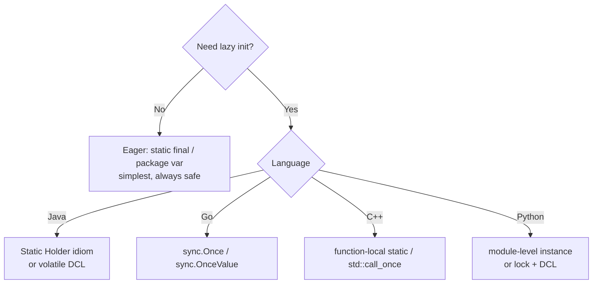

# Synchronization Misuse Anti-Patterns — Senior Level

> **Category:** [Concurrency Anti-Patterns](../README.md) → **Synchronization Misuse** — *locks and memory primitives applied wrongly, so the synchronization you think happened never did.*
> **Covers (collectively):** Double-Checked Locking · Volatile Misuse / Wrong Memory Ordering · Race-Prone Lazy Init

---

## Table of Contents

1. [Introduction](#introduction)
2. [Prerequisites](#prerequisites)
3. [How Did the Codebase Get Here? — Root-Cause Forces](#how-did-the-codebase-get-here--root-cause-forces)
4. [The Memory-Model Foundation](#the-memory-model-foundation)
5. [The History: Why DCL Was Broken Before Java 5](#the-history-why-dcl-was-broken-before-java-5)
6. [Designing Safe Lazy Initialization at Scale](#designing-safe-lazy-initialization-at-scale)
7. [Volatile Misuse and the Limits of Atomics](#volatile-misuse-and-the-limits-of-atomics)
8. [Auditing a Codebase for Synchronization Misuse](#auditing-a-codebase-for-synchronization-misuse)
9. [Eradication Strategies at Scale](#eradication-strategies-at-scale)
10. [When Each Pattern Is Actually Acceptable](#when-each-pattern-is-actually-acceptable)
11. [Prevention: Review Norms, Race Detectors, Immutability](#prevention-review-norms-race-detectors-immutability)
12. [Common Mistakes](#common-mistakes)
13. [Test Yourself](#test-yourself)
14. [Cheat Sheet](#cheat-sheet)
15. [Summary](#summary)
16. [Further Reading](#further-reading)
17. [Related Topics](#related-topics)

---

## Introduction

> Focus: **How did the codebase get here?** and **How do I fix it safely at scale?**

At the junior level you learned to *recognize* these three patterns and why the resulting bugs are intermittent; at the middle level you learned the safe replacements — `sync.Once`, the static holder idiom, a correctly-`volatile` guard. This file is about the situation a senior inherits: a hand-rolled double-checked locking idiom sits in a singleton on the hot path, it has "worked for years," and a tail-latency investigation or an ARM migration has just surfaced a once-in-ten-million corruption that no unit test reproduces.

Three questions define senior-level work on synchronization misuse:

1. **What does the underlying machine actually guarantee?** All three anti-patterns are the same mistake wearing three costumes: assuming the memory model gives you ordering and visibility that it does not. You cannot reason about the fix without the **happens-before** model. Locks, `volatile`/`atomic`, and channels are not magic — each establishes specific happens-before edges, and a missing edge is the bug.

2. **How did it get this way?** Hand-rolled synchronization is almost never written from a memory-model spec. It is copied from a 2002 blog post, ported between languages that have *different* models, or "optimized" by removing a lock someone profiled as hot. The force that produced it will reproduce it after you fix the single instance.

3. **How do I fix it without an outage *and* without re-introducing the race?** A data race has no safe semantics — you cannot "mostly" fix it. The senior job is to replace the misuse with a primitive whose correctness is *provable from the memory model*, verify it with a race detector under load, and then close the inflow so the next engineer cannot recreate it.

> **The senior mindset shift:** the junior asks "does this work?"; the senior asks "what happens-before edge makes this correct, on the *weakest* hardware we deploy to, and how do I prove its absence is impossible?" A test passing on x86 proves almost nothing about ARM.

---

## Prerequisites

- **Required:** Fluency with [`junior.md`](junior.md) and [`middle.md`](middle.md) — you can recognize all three patterns and apply `sync.Once` / the holder idiom / a `volatile` guard from memory.
- **Required:** You have shipped concurrent code, owned an incident, and debugged at least one Heisenbug that vanished under a debugger.
- **Helpful:** Working knowledge of a race detector (`go test -race`, Java's `-Xss` + jcstress, TSan) and the ability to run load in CI.
- **Helpful:** Familiarity with the [Singleton pattern](../../../design-patterns/01-creational/05-singleton/README.md) — its lifecycle is where most of this misuse lives.
- **Helpful:** [Immutability patterns](../../../clean-code/14-immutability/README.md) — the structural escape from most of this category.

---

## How Did the Codebase Get Here? — Root-Cause Forces

Every hand-rolled double-checked lock has a biography. Fix the line without the force and it grows back in the next singleton.

### The performance-myth shortcut

Someone profiled `synchronized getInstance()` (or a `Mutex`-guarded `Get()`), saw lock contention, and "optimized" it by checking the field *outside* the lock. On uncontended modern locks this optimization is almost always measuring noise — biased locking, thin locks, and futex fast-paths make an uncontended acquire nearly free — but the folklore that "locks are slow" survives from an era when it was truer. The shortcut trades a measured non-problem for an unmeasurable correctness hole.

### Copy-paste across memory models

The single most dangerous force. The "correct DCL with volatile" idiom is *Java-specific* and depends on the Java 5+ memory model. Ported verbatim to:
- **C++ pre-`std::atomic`** with a plain `bool` flag — broken.
- **Go** with a plain `bool` and no `sync.Mutex`/`atomic` — a data race the runtime explicitly defines as undefined behavior.
- **C#** without `volatile`/`Volatile.Read` — broken on weak models (historically ARM/Itanium).

The idiom's *shape* travels; its *correctness* does not, because correctness lives in a memory model that differs per language and per CPU.

### "It works on my machine" — and x86 lied to you

x86/x86-64 has a **strong** memory model (TSO — Total Store Order): it does not reorder stores past stores or loads past loads in the ways that break naive DCL. A great deal of broken synchronization runs correctly on x86 for years, then corrupts the first week it's deployed to ARM (AWS Graviton, Apple Silicon) or POWER, which reorder aggressively. The migration *exposes* the bug; it did not *create* it.

### `volatile` as a folk amulet

`volatile` in Java/C# means "establish ordering and visibility for *this variable*." In C/C++ it means "do not optimize away this memory access" — a hardware-register concept with *no thread-synchronization guarantee at all*. Engineers carry the word between languages and assume the strongest meaning. Sprinkling `volatile` to "fix a race" is cargo-culting; it fixes visibility of one variable, never mutual exclusion of a compound action.

```mermaid
graph TD
    PM[Performance myth:<br/>'locks are slow'] --> DCL[Hand-rolled DCL]
    CP[Copy-paste across<br/>memory models] --> DCL
    CP --> VM[Volatile misuse]
    X86[Tested only on x86 TSO] -. "hides the bug" .-> DCL
    X86 -. .-> RLI[Race-prone lazy init]
    FA[volatile as folk amulet] --> VM
    NO[No language-native<br/>lazy primitive used] --> RLI
    DCL --> RACE[Data race:<br/>half-constructed object visible]
    VM --> RACE
    RLI --> RACE
```

The practical takeaway: **a senior fix names the model, not just the smell.** "Add `volatile`" is folklore. "Replace with `sync.Once`, whose `Do` establishes a happens-before edge between the initializer's completion and every subsequent `Do` return, verified under `-race` at 64-way concurrency, and add a lint rule banning unsynchronized package-level lazy fields" is a fix that stays fixed.

---

## The Memory-Model Foundation

You cannot reason about any of these three anti-patterns without **happens-before**. Everything below is a corollary of it.

### Happens-before, sequential consistency, and data races

A program defines a **happens-before** partial order over its memory operations. The rule that matters:

> If a write to a variable *happens-before* a read of that variable, the read is guaranteed to see that write (and everything ordered before it). If two conflicting accesses (at least one a write) are **not** ordered by happens-before, they form a **data race** — and a data race has *no defined semantics*. The compiler and CPU may do anything.

"No defined semantics" is the crux seniors must internalize. A data race is not "sometimes returns a stale value." It is **undefined behavior**: torn reads, a published-but-uninitialized object, a loop the compiler hoisted because it proved (wrongly, under racing writes) the value never changes. You cannot bound the damage.

- **Sequential consistency (SC)** is the intuitive model: all operations appear in *some* single global order consistent with each thread's program order. *Programmers want SC.* Hardware does not provide it for free.
- **Relaxed / weak models** (what real CPUs and languages provide) allow reordering of independent memory operations for performance. Acquire-release semantics are the middle ground: a *release* store and a subsequent *acquire* load of the same variable create a happens-before edge — exactly enough to publish data safely without paying for full SC.

### What establishes a happens-before edge

| Mechanism | Edge it creates |
|---|---|
| **Java:** unlock of a monitor | happens-before the next lock of *the same* monitor |
| **Java:** write to a `volatile` field | happens-before every subsequent read of *that* field (since JSR-133 / Java 5) |
| **Java:** `final` field freeze | a correctly-published object's `final` fields are visible without synchronization |
| **Go:** `Mutex.Unlock` | happens-before the next `Lock` returning |
| **Go:** send on a channel | happens-before the corresponding receive completing |
| **Go:** `sync.Once.Do(f)` returning | the completion of `f` happens-before *every* `Do` return |
| **Go:** `atomic` store (Go 1.19+ `atomic.X` types) | acquire/release semantics; a store synchronizes-with a load that observes it |
| **C++:** `std::atomic` store/load with `memory_order` | the chosen order (`seq_cst` default, or `acquire`/`release`) |

The single discipline: **a value published to another thread must travel along one of these edges.** Plain field writes do not create edges. That is the entire bug in all three anti-patterns.

### The Go memory model in one rule

Go's model is blunt and senior-friendly: *if you have a data race, your program is undefined — full stop.* Go does not define "benign races." The cure is always a synchronizing primitive: a channel, a `sync.Mutex`, a `sync.Once`, or the `sync/atomic` types. Go 1.19 sharpened the `atomic` package into typed values (`atomic.Bool`, `atomic.Pointer[T]`) with explicit acquire-release semantics, which is what you reach for when an atomic is genuinely justified.

---

## The History: Why DCL Was Broken Before Java 5

Double-checked locking is the canonical case study, and its history is the fastest way to *feel* why memory models matter.

The idiom looks airtight:

```java
// The classic BROKEN double-checked locking (pre-Java-5 semantics).
class Singleton {
    private static Singleton instance;          // NOT volatile
    static Singleton getInstance() {
        if (instance == null) {                  // 1st check, no lock
            synchronized (Singleton.class) {
                if (instance == null) {          // 2nd check, under lock
                    instance = new Singleton();  // THE BUG LIVES HERE
                }
            }
        }
        return instance;                          // may return a half-built object
    }
}
```

The intuition: only lock when you must construct; afterwards the fast path skips the lock entirely. The flaw is in `instance = new Singleton()`, which is **not atomic**. It is three steps:

1. Allocate memory for the object.
2. Run the constructor, initializing fields.
3. Publish the reference into `instance`.

Under the **old (pre-JSR-133) Java Memory Model**, the compiler/CPU was permitted to reorder steps 2 and 3 — publish the reference *before* the constructor finished. A second thread on the fast path could then observe `instance != null`, skip the lock, and return a reference to an object **whose fields are still zero/default**. There is no lock on that fast path, so there is no happens-before edge forcing the constructor's writes to be visible. The famous conclusion of the 2000-2001 ["Double-Checked Locking is Broken" Declaration](http://www.cs.umd.edu/~pugh/java/memoryModel/DoubleCheckedLocking.html), signed by Bloch, Lea, Goetz, Pugh and others: *there was no portable way to make DCL correct in Java at the time.*

### What changed in Java 5 (JSR-133)

JSR-133 rewrote the Java Memory Model and **strengthened `volatile`**. Post-Java-5:
- A write to a `volatile` field happens-before every subsequent read of it, and crucially, **everything that happened-before the volatile write is visible to a thread that reads the volatile and sees that write.** The volatile store acts as a release; the load acts as an acquire.

That single change makes DCL correct *if and only if* the field is `volatile`:

```java
// CORRECT double-checked locking, Java 5+. The volatile is load-bearing.
class Singleton {
    private static volatile Singleton instance;   // volatile is MANDATORY
    static Singleton getInstance() {
        Singleton local = instance;                // read volatile once (perf)
        if (local == null) {
            synchronized (Singleton.class) {
                local = instance;
                if (local == null) {
                    local = new Singleton();
                    instance = local;              // volatile store: release fence
                }
            }
        }
        return local;
    }
}
```

The `volatile` store on the assignment publishes the *fully-constructed* object: any thread that reads a non-null `instance` is guaranteed (by happens-before) to see all of the constructor's writes. Remove the `volatile` and you are back in 2001. **The history is the lesson: the same source code went from broken to correct without changing a character of the algorithm — only the memory model underneath it changed.** Synchronization correctness is a property of code *and* model together, never code alone.

---

## Designing Safe Lazy Initialization at Scale

Once you understand happens-before, the senior conclusion is that you almost never hand-roll DCL. You reach for a primitive whose correctness the language guarantees. Here is the per-language menu, from most-preferred down.

### Java: the Initialization-on-Demand Holder idiom

The cleanest lazy singleton in Java uses no `volatile`, no `synchronized`, and no DCL. It leans on a guarantee the JVM already gives you for free: **class initialization is thread-safe and lazy.**

```java
// Static holder idiom — lazy, thread-safe, lock-free on the hot path,
// correct by the JLS class-initialization guarantee. No DCL, no volatile.
class Singleton {
    private Singleton() { /* expensive init */ }

    private static class Holder {                 // not loaded until first use
        static final Singleton INSTANCE = new Singleton();
    }

    static Singleton getInstance() {
        return Holder.INSTANCE;                    // triggers Holder init exactly once
    }
}
```

The JVM guarantees a class is initialized exactly once, under an internal lock, the first time it is *actively used* — and the happens-before edge from that initialization to every subsequent read is part of the spec. `Holder` is not loaded until `getInstance()` first touches it, so initialization is genuinely lazy. This is the idiom to migrate broken DCL *to*. If you don't even need laziness, a plain `static final` field (eager init at class load) is simpler and just as safe.

### Go: `sync.Once`

`sync.Once.Do` is the canonical Go answer. Its contract gives you the happens-before edge for free: the completion of the function passed to the *first* `Do` happens-before the return of *every* `Do`.

```go
// Go — sync.Once: lazy, safe, the idiomatic replacement for any hand-rolled
// lazy-init flag. The happens-before edge is part of the documented contract.
var (
    once     sync.Once
    instance *Service
)

func GetService() *Service {
    once.Do(func() {
        instance = newService() // runs exactly once; its writes are published
    })
    return instance
}
```

Note `instance` does **not** need to be atomic: the `Once` provides the edge. Go 1.21 added `sync.OnceValue` / `sync.OnceFunc`, which package this even more tightly:

```go
var GetService = sync.OnceValue(func() *Service { return newService() })
```

### C++: `std::call_once` or a function-local static

C++11 made the function-local `static` thread-safe to initialize ("magic statics"): the runtime guarantees exactly-once, race-free initialization with the right fences.

```cpp
// C++11+ — function-local static is the simplest correct lazy singleton.
Service& getService() {
    static Service instance;   // initialized exactly once, thread-safe (C++11)
    return instance;
}
```

`std::call_once` with a `std::once_flag` is the explicit form when the initializer isn't a single object construction. Hand-rolled DCL with a plain `bool` was never portable here; `std::atomic` with explicit `memory_order_acquire`/`release` is the lowest-level escape hatch and rarely worth it over `call_once`.

### Python: the GIL note

CPython's **Global Interpreter Lock** serializes bytecode execution, so the *visibility* hazards of DCL largely vanish — there is no torn read of a reference. But the **check-then-act race still exists**: between a thread evaluating `if _instance is None` and assigning, the interpreter can switch threads (the GIL is released periodically), so two threads can both construct. The fix is a lock, not `volatile`:

```python
import threading

_instance = None
_lock = threading.Lock()

def get_instance():
    global _instance
    if _instance is None:           # fast path: GIL makes the read safe
        with _lock:
            if _instance is None:    # re-check under the lock
                _instance = Service()
    return _instance
```

This DCL is *correct under CPython* because the GIL supplies the visibility edge and the lock closes the check-then-act window. On a free-threaded / no-GIL build (PEP 703, experimental in 3.13+), you must not rely on the GIL — the lock is then doing real work and is mandatory. The cleanest Python answer is usually a module-level instance (imported once, initialized at import under the import lock) or `functools.lru_cache` / `functools.cache` on a factory.



---

## Volatile Misuse and the Limits of Atomics

`volatile` (Java/C#) and `atomic` (Go/C++/Java's `Atomic*`) buy you **visibility and per-operation atomicity for a single variable**. They do *not* buy you **mutual exclusion over a compound action.** Conflating the two is the Volatile Misuse anti-pattern.

### `volatile` does not make compound actions atomic

```java
// BROKEN: volatile gives visibility, NOT atomicity of read-modify-write.
private volatile int count;
void increment() { count++; }   // count++ is read, add, write — three ops, racy
```

Two threads can both read `count == 5`, both compute `6`, both store `6` — a lost update. `volatile` guaranteed each *individual* read and write was visible; it never made the *sequence* indivisible. The fixes:

```java
private final AtomicInteger count = new AtomicInteger();   // genuinely atomic RMW
void increment() { count.incrementAndGet(); }
```

or a lock around the compound action. The senior rule: **`volatile`/atomic loads and stores are safe in isolation; the moment you have a read-then-write or a relationship between two variables, you need a lock or a single CAS that covers the whole invariant.**

### Atomics that are individually atomic but collectively racy

```go
// BROKEN: each atomic op is fine; the INVARIANT between them is not protected.
var lo, hi atomic.Int64   // invariant: lo <= hi
func widen() {
    lo.Add(-1)            // another goroutine can read (lo, hi) between these
    hi.Add(1)             // two lines, momentarily inconsistent
}
```

Anyone reading both fields can observe a state that violates `lo <= hi`. No memory ordering fixes this — the problem is that the *pair* must change atomically, which a per-variable atomic cannot express. You need a lock, or a single atomic over a struct pointer (swap a whole new `{lo, hi}` value via `atomic.Pointer`).

### When the ordering itself is the bug

The subtler Volatile Misuse is reaching for `memory_order_relaxed` (C++) or assuming a weaker order suffices, when you actually need acquire-release to publish *associated* data:

```cpp
// BROKEN: relaxed store does not publish the data written before it.
std::atomic<bool> ready{false};
int data = 0;
// producer:
data = 42;
ready.store(true, std::memory_order_relaxed);   // BUG: no release edge
// consumer:
while (!ready.load(std::memory_order_relaxed)) {}
use(data);                                       // may read data == 0
```

`relaxed` orders the atomic with respect to itself but creates **no happens-before edge** for `data`. The consumer can see `ready == true` and still read the old `data`. Use `release` on the store and `acquire` on the load (or default `seq_cst`); that is the edge that publishes `data`. This is exactly the DCL bug at the primitive level: the flag was visible, the *payload it was guarding* was not.

---

## Auditing a Codebase for Synchronization Misuse

You cannot grep your way to confidence here — but grep is where the audit *starts*. The senior approach layers static search, dynamic detection, and review.

### Static search for the smells

```bash
# Hand-rolled double-checked locking — a field-null check wrapping a lock.
rg -n -U 'if\s*\(\s*\w+\s*==\s*null\s*\)\s*\{[^}]*synchronized' --type java

# Java: lazy-init fields that are NOT volatile (candidates for broken DCL).
rg -n 'private static (?!volatile)\w+ instance' --type java

# Go: package-level lazy flags without sync.Once (check-then-set candidates).
rg -n 'if\s+\w+\s*==\s*nil\s*\{' --type go

# volatile used on a counter / compound-action target (likely misuse).
rg -n 'volatile (int|long) \w+;[\s\S]{0,200}\1\+\+' --type java
```

These find *candidates*, not bugs. Every hit is a question for review, not a verdict.

### Dynamic detection: race detectors are non-negotiable

The only tool that *proves* a data race exists is a **happens-before race detector** run on real execution:

- **Go:** `go test -race` and `go build -race`. Run the race build in CI on every concurrent package, and ideally a canary of the `-race` binary under production-like load (it's ~2-10× slower, so a subset). A clean `-race` run is the single strongest evidence you have.
- **Java:** **jcstress** (the OpenJDK Java Concurrency Stress harness) is purpose-built to expose memory-ordering bugs by running the same race millions of times across thread interleavings and asserting on the *set* of allowed/forbidden outcomes. This is how you'd actually catch a missing `volatile` in DCL. Plus **ThreadSanitizer** via the JVM in newer builds, and `-XX:+UnlockDiagnosticVMOptions` stress flags.
- **C/C++:** **ThreadSanitizer** (`-fsanitize=thread`) — a happens-before detector built into Clang/GCC.

> **The audit truth:** race detectors find races *that execute during the test*. They cannot prove absence for paths you didn't exercise. So you pair them with *coverage of the concurrent paths under contention* — feed the race build representative load, fuzz the interleavings (jcstress), and run long enough to hit the rare window. A green `-race` on a serial unit test proves almost nothing.

### Code review for shared mutable state

The reviewer's lens: **for every field touched by more than one thread, what happens-before edge makes each access safe?** If the answer is "none" or "it's `volatile` so it's fine" (when the access is a compound action), it's a finding. The reviewable unit is *shared mutable state*, and the question is always *which edge*, never *does it look thread-safe*.

---

## Eradication Strategies at Scale

You've found a broken DCL on the hot path. You can't reproduce the corruption on demand, and the path is revenue-critical. The eradication is the same discipline as any load-bearing change: small, reversible, verified — with one addition unique to concurrency.

### The concurrency-specific constraint: you can't "mostly" fix a race

A structural refactor can ship at 1% and grow. A data race fix is different: the half-fixed state is *also* undefined behavior, so you do not roll out a partial memory-ordering change to a percentage of traffic and watch error rates — the failure is invisible until it corrupts. Instead, the verification moves *left*, into a stress harness, before the change ships at all.

### The sequence

1. **Characterize the contract, not the timing.** Write tests that pin the *observable* behavior of the lazy field (same instance every call, fully-initialized, no second construction) — you can't characterize the race, but you can characterize the invariant the correct code must uphold.
2. **Replace with a language-native primitive,** not a patched hand-roll. Migrate broken DCL → static holder idiom (Java) / `sync.Once` (Go) / function-local static (C++). The native primitive's correctness is guaranteed by the spec; your hand-roll's is guaranteed by your reading of a memory model under deadline pressure. Prefer the spec.
3. **Prove it under stress.** Run jcstress (Java) or `-race` under high-concurrency load (Go) / TSan (C++) against the *new* implementation, on the *weakest* target architecture you ship to (build/run the race binary on ARM if you deploy to ARM — do not trust an x86-only green).
4. **Cut over atomically per call site.** The change at a given lazy-init site is a single replacement, not a coexistence — the old broken path and the new path can't safely run "both" for shadowing because the old path may corrupt. Use a feature flag only to gate *whether the new code path is taken*, not to run both concurrently against shared state.
5. **Close the inflow.** Add the lint/architecture rule (below) so the next `private static X instance` without `volatile`, or the next package-level lazy `nil`-check without `sync.Once`, fails CI.

> **The cardinal rule:** the fix for synchronization misuse is to *delete the hand-rolled synchronization and adopt a primitive whose correctness is a documented language guarantee.* Verification happens in a stress harness on weak hardware, not by watching dashboards after a percentage rollout — because a data race shows no dashboard signal until it has already corrupted state.

---

## When Each Pattern Is Actually Acceptable

Seniors must know the *legitimate* uses, or they'll over-correct into needless locking.

### Correct DCL — with a real memory barrier

DCL is acceptable when (a) the language's memory model gives you a way to publish safely (`volatile` in Java 5+, `Volatile.Read`/`Read` in C#, `std::atomic` with acquire-release in C++), (b) you genuinely need laziness, and (c) profiling shows the uncontended lock is a *measured* bottleneck — not assumed. In practice the static-holder idiom (Java) or `sync.Once` (Go) is cleaner and equally fast, so correct DCL is mostly justified in languages lacking a clean native lazy primitive, or in performance-critical code where you've measured the difference. *If you write DCL, the `volatile`/atomic guard is not optional decoration — it is the entire correctness argument.*

### Atomics for genuinely independent single-variable state

A `volatile`/`atomic` variable is exactly right for a **single, independent** piece of state with no invariant linking it to other state:
- A `done`/`shutdown` flag set once and polled (visibility is all you need).
- A monotonic counter via `AtomicLong.incrementAndGet` / `atomic.Int64.Add` (the atomic *is* the whole compound action).
- A configuration pointer swapped wholesale via `atomic.Pointer[Config]` / `AtomicReference` (copy-on-write: readers see either the old or new config, never a torn one).

The test for "is an atomic enough?": *is there exactly one variable, and does every update to it constitute the complete invariant by itself?* Yes → atomic. The moment a second variable must stay consistent with it, or an update is a read-then-write that isn't a single CAS, you need a lock.

### Eager init when laziness buys nothing

If the object is cheap to build, or is needed early anyway, **eager initialization** (`static final` field / package-level `var x = newX()` / module-level instance) sidesteps the entire category. No lazy init means no lazy-init race. Reach for laziness only when initialization is genuinely expensive *and* often unneeded.

---

## Prevention: Review Norms, Race Detectors, Immutability

Eradication fixes today's instance; prevention stops regrowth. As with all anti-patterns, the durable fixes are automated and structural.

### Race detectors in CI as a gate

Make `go test -race ./...` a *required* check, not an optional one. Add a jcstress module for the JVM concurrency primitives you maintain, run on a schedule (it's slow). Run TSan in the C++ pipeline. The goal: a memory-ordering regression fails the build, the same way a fitness function fails on an architecture violation. Run the race build on the *weakest* CI architecture you deploy to.

### Lint and architecture rules

```text
# Custom lint / forbidigo (Go): ban hand-rolled lazy-init flags; require sync.Once.
# Java (Error Prone / Checkstyle): flag `static <T> instance` fields that are
#   written outside a constructor/initializer and are not volatile or final.
```

### Immutability and confinement: close the category structurally

The deepest prevention is to have *no shared mutable state to synchronize*. The two structural escapes:
- **Immutability.** An immutable object, *safely published once*, needs no further synchronization for reads — every thread sees the same final state. In Java, `final` fields of a correctly-constructed object are visible without locks; this is why immutable singletons are the easiest to get right. See [Immutability patterns](../../../clean-code/14-immutability/README.md).
- **Confinement / message passing.** State owned by a single goroutine and communicated over channels (Go), or thread-confined, is never *shared*, so there is nothing to race on. "Don't communicate by sharing memory; share memory by communicating."

### Review norms

- **Every shared mutable field gets a documented synchronization policy** — a comment or `@GuardedBy("lock")` annotation stating *which* lock/edge protects it. A field touched by two threads with no stated policy is a review block.
- **No hand-rolled lazy init in review** — point to the native primitive (`sync.Once`, holder idiom, `call_once`).
- **`volatile` on anything mutated by a compound action is a finding** — ask "is this access a single read or single write?" If not, it needs a lock or a CAS.

> **The senior's real product is not the corrected DCL — it's the system that makes the next one impossible:** a `-race` gate in CI on weak hardware, a lint rule banning the hand-roll, a `@GuardedBy` norm in review, and a bias toward immutability so most state never needs synchronizing at all.

---

## Common Mistakes

Mistakes seniors make with synchronization misuse at scale:

1. **"It passes on x86, ship it."** x86's TSO hides reordering bugs that ARM/POWER expose. *Verify on the weakest architecture you deploy to; a green x86 race-test proves nothing about Graviton.*
2. **Adding `volatile` to "fix a race" on a compound action.** `volatile` gives visibility, never mutual exclusion. `count++` on a `volatile` is still a lost-update race. *Use an atomic RMW or a lock for compound actions.*
3. **Porting Java's `volatile` DCL idiom verbatim into Go/C++.** The idiom's correctness lives in Java's memory model. *Use the target language's native primitive (`sync.Once`, `std::call_once`).*
4. **Removing a lock because a profiler showed it "hot" — without measuring the alternative.** Uncontended locks are nearly free on modern runtimes; the "optimization" often trades zero real speed for a correctness hole. *Measure the actual contention before hand-rolling lock-free code.*
5. **Trusting a serial unit test to validate concurrent code.** A test that doesn't itself drive contention can't hit the race window. *Use a stress harness (jcstress) and the race detector under load.*
6. **Treating "benign data race" as a real category.** In the Java and Go memory models a data race is undefined behavior — there is no benign one. *Eliminate it; don't reason about its "harmless" outcomes.*
7. **Using `memory_order_relaxed` to publish data.** Relaxed orders the atomic with itself but creates no happens-before edge for the payload. *Use release/acquire (or seq_cst) when an atomic guards other data.*
8. **Rolling out a memory-ordering fix at 1% and watching dashboards.** A data race produces no signal until it corrupts. *Verify in a stress harness before shipping; flags gate the code path, not a shared-state shadow run.*

---

## Test Yourself

1. The *exact same* Java DCL source went from broken to correct between Java 1.4 and Java 5 without an edit. What changed, and what specifically does it now guarantee about `instance = new Singleton()`?
2. A teammate "fixes" a lost-update bug on a counter by declaring the field `volatile`. Why is this wrong, and what are the two correct fixes?
3. Why does a hand-rolled lazy-init that works for years on your x86 fleet start corrupting data the week you migrate to ARM? What did the migration do — create or expose the bug?
4. Write the Go-idiomatic replacement for a `if instance == nil { instance = newThing() }` package-level lazy init, and state the happens-before edge that makes it correct *without* an atomic on `instance`.
5. You have two `atomic.Int64` fields with the invariant `lo <= hi`, each updated with `.Add(...)`. Each operation is atomic. Why is the code still racy, and what does the fix require?
6. Give one situation where double-checked locking is an acceptable senior choice, and the single non-negotiable element it must contain.
7. Why can't you safely roll out a fix for a data race at 1% of traffic and watch error rates the way you would a structural refactor? Where does the verification have to move instead?

<details>
<summary>Answers</summary>

1. **JSR-133 (the Java 5 memory model) strengthened `volatile`.** Post-Java-5, a write to a `volatile` field is a *release*: everything that happened-before the volatile write is made visible to any thread that subsequently reads the volatile and sees that value. So if `instance` is `volatile`, the store of the reference publishes the *fully-constructed* object — a thread seeing non-null `instance` is guaranteed (by happens-before) to see all the constructor's field writes. Pre-Java-5, the constructor's writes (step 2) could be reordered after publishing the reference (step 3), so another thread could see a non-null but half-initialized object. The `volatile` is the entire fix; without it the idiom is still broken.
2. `volatile` provides *visibility* of each individual read and write but not *atomicity* of the read-modify-write sequence `count++` (read, add, store). Two threads can both read 5, both store 6 — a lost update. Fixes: (a) use an atomic RMW — `AtomicInteger.incrementAndGet()`; (b) take a lock around the increment. Either makes the whole compound action indivisible.
3. The bug was always present; **the migration exposed it, it did not create it.** x86 has a strong memory model (TSO) that does not perform the store-store / load-load reorderings that break naive lazy init, so the code runs correctly there for years. ARM (and POWER) have weak models that reorder aggressively, so the missing happens-before edge finally manifests as a torn/half-constructed read. The fix must be reasoned from the memory model and verified on the weak architecture, not from "it worked on x86."
4. Use `sync.Once`:
   ```go
   var (
       once     sync.Once
       instance *Thing
   )
   func Get() *Thing {
       once.Do(func() { instance = newThing() })
       return instance
   }
   ```
   The edge: the completion of the function passed to the first `Do` *happens-before* the return of *every* `Do` call. That edge publishes all of `newThing()`'s writes, so `instance` needs no atomic — the `Once` supplies the synchronization. (Go 1.21+: `sync.OnceValue` is even tighter.)
5. Each `.Add` is atomic in isolation, but the *invariant spans two variables*. Between the two `.Add` calls another goroutine can read `(lo, hi)` and observe a state where `lo > hi`. Per-variable atomicity cannot make a *pair* of updates atomic. The fix requires either a lock around both updates (and around any read that depends on the invariant), or collapsing the two fields into one value updated atomically — e.g. an `atomic.Pointer` to an immutable `{lo, hi}` struct swapped wholesale (copy-on-write).
6. Acceptable when: you genuinely need lazy init, you've *measured* that an uncontended lock is a real bottleneck (or you're in a language without a clean native lazy primitive), and the language's memory model offers a publish barrier. The non-negotiable element: a **`volatile`/atomic guard with acquire-release (or seq_cst) semantics** on the field — it is the whole correctness argument, not optional decoration. (Even so, prefer the static-holder idiom in Java or `sync.Once` in Go where available.)
7. A data race is *undefined behavior* with no observable signal until it actually corrupts state — there is no error-rate bump that says "the race fired but produced a wrong value." A partial/percentage rollout of a memory-ordering change still leaves the racy path live and equally undefined. Verification must move *left*, into a stress harness (jcstress / `-race` under high-concurrency load / TSan) run on the weakest architecture you ship to, *before* the change goes out. Feature flags may gate which code path executes, but you never run the old racy path and new path "both" against shared state to shadow-compare.

</details>

---

## Cheat Sheet

| Anti-pattern | Root-cause force | What the machine actually does | Senior fix | Verify with |
|---|---|---|---|---|
| **Double-Checked Locking (broken)** | Perf myth + copy-paste across models | Constructor writes reorder past the reference publish; fast path has no happens-before edge | Static holder idiom (Java) / `sync.Once` (Go) / function-local static (C++); or DCL **with** `volatile` | jcstress / `-race` under load on weak arch |
| **Volatile Misuse / Wrong Ordering** | `volatile` as folk amulet | Visibility of one variable ≠ atomicity of a compound action; `relaxed` publishes no payload | Atomic RMW or lock for compound actions; release/acquire (not relaxed) to publish data | TSan / jcstress; review "is this one read or one write?" |
| **Race-Prone Lazy Init** | No native lazy primitive used; x86 hides it | Two threads see null, both construct; one instance lost / half-built object published | `sync.Once` / holder idiom / eager `static final`; lock + DCL in CPython | `-race`; lint banning unsynchronized lazy fields |

**Three golden rules:**
- *Synchronization correctness is a property of code **and** the memory model together — name the happens-before edge, never just "it looks thread-safe."*
- *`volatile`/atomic = visibility + single-variable atomicity; a lock = mutual exclusion over a compound action. Don't substitute one for the other.*
- *Delete hand-rolled synchronization; adopt a primitive whose correctness is a documented language guarantee, and verify it with a race detector on the weakest hardware you ship to.*

---

## Summary

- **The one idea:** all three patterns are the same mistake — assuming the memory model provides ordering and visibility it does not. The cure is reasoning in **happens-before**: a value published to another thread must travel a synchronizing edge (lock unlock→lock, `volatile`/atomic release→acquire, channel send→receive, `Once.Do` completion→return). Plain field writes create no edge.
- **A data race has no defined semantics** — not "stale value" but undefined behavior. In the Java and Go models there is no "benign" race.
- **History:** the identical Java DCL went from broken to correct across Java 5 (JSR-133) *without a source edit*, because `volatile` was strengthened into a release/acquire barrier. The lesson: correctness lives in code *and* model.
- **Safe lazy init at scale:** static holder idiom (Java, lock-free + lazy), `sync.Once`/`OnceValue` (Go), function-local static / `std::call_once` (C++), module-level instance or lock+DCL under CPython's GIL. Eager init when laziness buys nothing.
- **Volatile/atomic limits:** they give visibility and *single-variable* atomicity, never mutual exclusion over a compound action or an invariant spanning two variables. `relaxed` publishes no payload — use release/acquire.
- **Auditing:** grep for candidate smells → prove with a happens-before race detector (`go test -race`, jcstress, TSan) under contention on the *weakest* architecture → review every shared mutable field for "which edge makes this safe?"
- **Eradication:** characterize the invariant (you can't characterize the race), replace the hand-roll with a native primitive, prove under stress on weak hardware *before* shipping (a race shows no dashboard signal), and close the inflow with a lint/CI gate.
- **When acceptable:** correct DCL *with* a `volatile`/atomic guard when laziness is needed and measured; atomics for genuinely independent single-variable state (a `done` flag, a counter, a swapped config pointer).
- **Prevention is structural:** `-race`/jcstress as a CI gate on weak hardware, lint rules banning hand-rolled lazy init, `@GuardedBy` documentation norms, and a bias toward **immutability** and **confinement** so most state never needs synchronizing at all.
- Next: [`professional.md`](professional.md) — hardware memory ordering, fences, lock-free data structures, and the runtime/JIT angle on these primitives.

---

## Further Reading

- **Java Concurrency in Practice** — Brian Goetz et al. (2006) — chapters on the Java Memory Model, safe publication, `volatile`, and lazy initialization. The canonical text for this category.
- **"The 'Double-Checked Locking is Broken' Declaration"** — Bloch, Lea, Goetz, Pugh et al. (2000-2001) — the historical document explaining why DCL had no portable fix pre-Java-5.
- **JSR-133: Java Memory Model and Thread Specification** — and Jeremy Manson & Brian Goetz's "Java theory and practice: Fixing the Java Memory Model" — what Java 5 changed and why.
- **The Go Memory Model** — [go.dev/ref/mem](https://go.dev/ref/mem) — the authoritative, blunt statement of Go's happens-before rules and the "a race is undefined, full stop" position.
- **C++ Concurrency in Action** — Anthony Williams (2nd ed., 2019) — `std::atomic`, `memory_order`, `call_once`, and acquire-release reasoning.
- **jcstress** — the OpenJDK Java Concurrency Stress harness — how to actually catch memory-ordering bugs across interleavings.
- **"Memory Barriers: a Hardware View for Software Hackers"** — Paul McKenney — why x86 TSO hides what ARM/POWER expose.
- **Shared Memory Consistency Models: A Tutorial** — Adve & Gharachorloo (1996) — sequential consistency vs relaxed models, foundational.

---

## Related Topics

- [Singleton pattern](../../../design-patterns/01-creational/05-singleton/README.md) — the lifecycle where most of this misuse lives; lazy-init done right is the positive counterpart.
- [Clean Code → Concurrency](../../../clean-code/11-concurrency/README.md) — the positive disciplines: limit shared mutable state, keep critical sections small, prefer immutability.
- [Clean Code → Immutability](../../../clean-code/14-immutability/README.md) — the structural escape from this entire category: immutable, safely-published state needs no further synchronization.
- [Concurrency Anti-Patterns (chapter)](../README.md) — the sibling categories: Coordination (deadlocks, lock-during-I/O, wrong granularity) and Shared State (unprotected shared mutable state — the root cause every pattern here is a failed attempt to coordinate).
- [Language Internals → Concurrency, Async & Parallelism](../../../../../Programming/language-internals/concurrency-async-parallel/README.md) — how the runtime and CPU implement the primitives this file reasons about.
