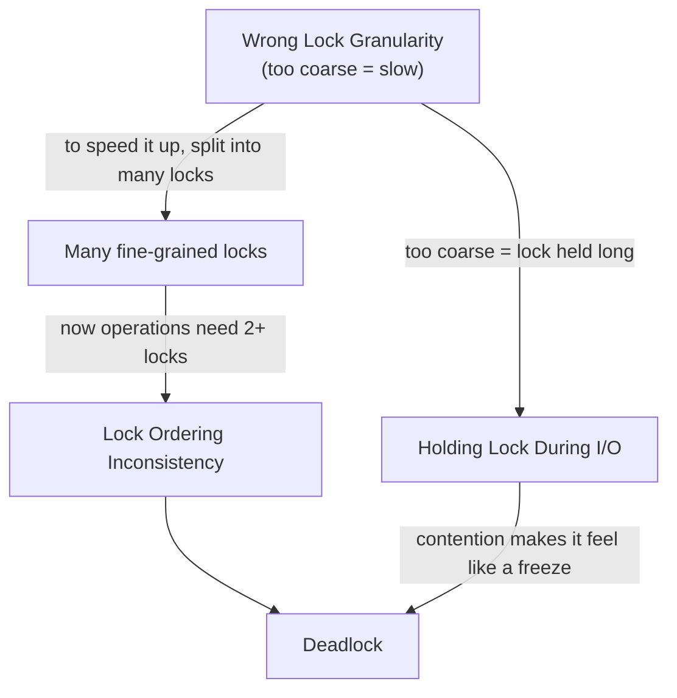

# Coordination Anti-Patterns — Junior Level

> **Category:** [Concurrency Anti-Patterns](../README.md) → **Coordination** — *two or more lock holders that fail to make progress together.*
> **Covers (collectively):** Lock Ordering Inconsistency → Deadlock · Holding a Lock During I/O / Long Operation · Wrong Lock Granularity

---

## Table of Contents

1. [Introduction](#introduction)
2. [Prerequisites](#prerequisites)
3. [Glossary](#glossary)
4. [The Three at a Glance](#the-three-at-a-glance)
5. [Lock Ordering Inconsistency → Deadlock](#lock-ordering-inconsistency--deadlock)
6. [Holding a Lock During I/O / Long Operation](#holding-a-lock-during-io--long-operation)
7. [Wrong Lock Granularity](#wrong-lock-granularity)
8. [How They Reinforce Each Other](#how-they-reinforce-each-other)
9. [A Quick Spotting Checklist](#a-quick-spotting-checklist)
10. [Common Mistakes](#common-mistakes)
11. [Test Yourself](#test-yourself)
12. [Cheat Sheet](#cheat-sheet)
13. [Summary](#summary)
14. [Further Reading](#further-reading)
15. [Related Topics](#related-topics)

---

## Introduction

> Focus: **What does it look like?** and **Why is it bad?** — plus the one basic fix you can apply today.

The previous category — [Synchronization Misuse](../01-synchronization/junior.md) — was about using *one* lock wrongly. This category is about what goes wrong when **two or more threads coordinate through locks**. A single lock, used correctly, is easy. The trouble starts the moment a thread needs *two* locks, or holds a lock *while doing something slow*, or wraps *too much (or too little)* state under one lock.

All three anti-patterns here share a theme: **the lock is correct in isolation, but the *coordination* around it is wrong.** No single line looks buggy. The bug is in the *interaction* — and that's why these are intermittent, hard to reproduce, and terrifying in production.

- **Lock Ordering Inconsistency → Deadlock** — Thread A grabs lock 1 then lock 2; Thread B grabs lock 2 then lock 1. Each holds what the other needs. Both wait forever. The program doesn't crash — it just *stops*.
- **Holding a Lock During I/O / Long Operation** — A thread takes a lock and then makes a network call or DB query *while still holding it*. Every other thread that wants the lock is now blocked for the full round-trip. Latency gets multiplied by contention.
- **Wrong Lock Granularity** — One giant lock around an entire object serializes everything and kills throughput; the opposite extreme — a separate lock per field — costs more in locking overhead than the work it protects, and reopens the door to deadlock.

At the junior level you don't need to debug a deadlock in a running production cluster (that's [`senior.md`](senior.md)). Your job is to **recognize each shape on sight**, understand **why** it stalls or slows a program, and apply the **one basic fix** for each:

- A **global lock order** that every thread obeys.
- **Copy the data, release the lock, then do the I/O.**
- **Size the lock to the smallest unit of state that must stay consistent together** — no bigger, no smaller.

> **The mindset shift:** correctness under concurrency is not "did it work when I ran it?" It's "is there *any* interleaving of threads that breaks it?" A deadlock that happens 1 time in 50,000 is still a bug — and it *will* be the production incident at 3 a.m.

---

## Prerequisites

- **Required:** You can write a function that takes a lock and releases it — `sync.Mutex` in Go, `synchronized` / `ReentrantLock` in Java, `threading.Lock` in Python.
- **Required:** You understand what a **critical section** is — the region of code where you touch shared state and must not be interrupted by another thread.
- **Helpful:** You've seen the [Synchronization Misuse](../01-synchronization/junior.md) category — it explains *why* you need a lock at all. This category assumes you already know you need one.
- **Helpful:** You've felt the pain once — a program that "hangs" for no reason, or one that's correct but mysteriously slow under load. Those two feelings are deadlock and contention, respectively.

> **A note on Python's GIL.** CPython has a Global Interpreter Lock that lets only one thread run Python bytecode at a time. It does **not** save you here: the GIL is released around I/O and at bytecode boundaries, so deadlocks between two `threading.Lock`s and lock-held-during-I/O are *just as real* in Python. The GIL only removes some data races on single operations — it does nothing for coordination. Where a Python example differs, it's flagged inline.

---

## Glossary

| Term | Definition |
|------|-----------|
| **Critical section** | The code region that accesses shared state and must run without interference. Protected by a lock. |
| **Deadlock** | Two or more threads each waiting for a lock the other holds; none can proceed. The program freezes with no error. |
| **Livelock** | Threads are *active* — retrying, backing off, yielding — but still make no progress, because each keeps reacting to the other. Like two people stepping side-to-side in a doorway. |
| **Lock contention** | When multiple threads compete for the same lock. The more they wait on each other, the less real work happens. High contention = a lock that's a bottleneck. |
| **Lock granularity** | *How much* state one lock protects. **Coarse** = one lock for a whole object/structure. **Fine** = many small locks for separate parts. |
| **Throughput** | How much useful work the system completes per unit time. The metric a too-coarse lock destroys. |
| **Lock ordering** | The fixed sequence in which locks must always be acquired, system-wide, to prevent deadlock. |

---

## The Three at a Glance

| Anti-pattern | One-line symptom | The smell you feel |
|---|---|---|
| **Lock Ordering Inconsistency → Deadlock** | Two threads grab two locks in opposite orders | "It just... hangs. No error, no CPU, nothing." |
| **Holding a Lock During I/O** | Lock held across a network/DB/file call | "Why is everything slow whenever *that one* endpoint is busy?" |
| **Wrong Lock Granularity** | One giant lock (slow) or a lock per field (overhead + deadlock risk) | "We added threads and it got *slower*." |

These are **coordination** anti-patterns: you spot them not by a single bad line but by *how threads interact around locks*. Read each section for the shape, a correct runnable-style example, why it hurts, and the junior fix.

---

## Lock Ordering Inconsistency → Deadlock

### What it looks like

Two locks, `M1` and `M2`. One code path needs both and grabs them in the order **(M1, then M2)**. Another path also needs both but grabs them **(M2, then M1)**. Most of the time one finishes before the other starts and nothing bad happens. But if they interleave just right, Thread A holds `M1` and waits for `M2`, while Thread B holds `M2` and waits for `M1`. Neither releases. Forever.

The classic real-world version is a **bank transfer**: lock the *from* account, then the *to* account.

```go
// Go — a deadlock waiting to happen
type Account struct {
    mu      sync.Mutex
    balance int
}

func Transfer(from, to *Account, amount int) {
    from.mu.Lock()         // grab the source first
    defer from.mu.Unlock()

    to.mu.Lock()           // then the destination
    defer to.mu.Unlock()

    from.balance -= amount
    to.balance += amount
}
```

This looks fine. It even passes tests. But run two transfers in opposite directions at the same time:

```go
go Transfer(&alice, &bob, 100)   // locks alice, then waits for bob
go Transfer(&bob, &alice, 50)    // locks bob,   then waits for alice
```

Goroutine 1 holds `alice` and wants `bob`. Goroutine 2 holds `bob` and wants `alice`. **Deadlock.** The Go runtime may print `fatal error: all goroutines are asleep - deadlock!` if *everything* is stuck, but in a real server other goroutines keep running, so the runtime stays silent and just *these two* hang forever, leaking the goroutines and the accounts they froze.

The same trap in Java:

```java
// Java — identical deadlock with two monitors
void transfer(Account from, Account to, int amount) {
    synchronized (from) {        // lock order depends on argument order
        synchronized (to) {
            from.balance -= amount;
            to.balance   += amount;
        }
    }
}
// transfer(alice, bob, 100) and transfer(bob, alice, 50) → deadlock
```

Here is the wait-for cycle that defines every deadlock — a thread waiting on a resource held by a thread that's (eventually) waiting back on you:


A cycle in this "waits-for" graph **is** a deadlock. No cycle, no deadlock.

### Why it's bad

- **The program freezes silently.** There's no exception, no crash, often no CPU spike. The affected requests just never return. It's one of the hardest failures to diagnose because nothing *looks* wrong.
- **It's intermittent.** It needs a specific interleaving, so it passes every test and the demo, then deadlocks under production load when two opposite operations finally collide.
- **It leaks resources.** The stuck threads/goroutines hold locks, connections, and memory that never get released. Under load, more requests pile up behind the dead locks and the whole service grinds down.

### The junior-level fix

**Define one global lock order and make every code path obey it.** If all threads always grab locks in the same order, a cycle is impossible — and no cycle means no deadlock.

For accounts, order by a stable unique key (an ID). Always lock the lower ID first, no matter which account is the source:

```go
// Go — consistent ordering by a stable ID kills the deadlock
func Transfer(from, to *Account, amount int) {
    // Lock the two accounts in a fixed global order: lower ID first.
    first, second := from, to
    if from.id > to.id {
        first, second = to, from
    }
    first.mu.Lock()
    defer first.mu.Unlock()
    second.mu.Lock()
    defer second.mu.Unlock()

    from.balance -= amount
    to.balance += amount
}
```

Now `Transfer(alice, bob)` and `Transfer(bob, alice)` both lock `alice` first (assuming `alice.id < bob.id`), so they can never form a cycle. The same fix in Java — compare IDs and `synchronized` on the lower one first.

The other valid junior fix: **don't hold two locks at once.** If you can finish under one lock, release it before taking the next. Holding only one lock at a time makes deadlock impossible by construction.

> **Smell test:** any time a function takes **two or more locks**, ask: *"Does every other function that takes these same two locks grab them in the exact same order?"* If you can't answer "yes" instantly, you have a latent deadlock.

---

## Holding a Lock During I/O / Long Operation

### What it looks like

A thread takes a lock to read or update some shared state — and then, *still holding the lock*, makes a slow call: a network request, a database query, a file read, an external API. The lock that should be held for microseconds is now held for the **entire round-trip** — tens or hundreds of milliseconds.

```go
// Go — the lock is held across a slow network call
type Cache struct {
    mu   sync.Mutex
    data map[string]string
}

func (c *Cache) Get(key string) string {
    c.mu.Lock()
    defer c.mu.Unlock()        // held until the function returns

    if v, ok := c.data[key]; ok {
        return v
    }
    v := fetchFromAPI(key)      // ← network call, 200ms, WHILE LOCKED
    c.data[key] = v
    return v
}
```

While one goroutine sits in `fetchFromAPI`, **every other goroutine** calling `Get` — even for keys already cached — is blocked on `c.mu.Lock()`. A 200 ms network call has now stalled the entire cache for 200 ms.

The Java version of the same mistake:

```java
// Java — DB query inside the synchronized block
synchronized (this) {
    User u = userMap.get(id);
    if (u == null) {
        u = database.loadUser(id);   // ← 50ms DB round-trip, still holding the monitor
        userMap.put(id, u);
    }
    return u;
}
```

> **Python note:** the GIL doesn't help — CPython *releases* the GIL during blocking I/O, but your *own* `threading.Lock` stays held across the I/O call exactly like above. Same bug, same fix.

### Why it's bad

Think of it as a multiplication. The damage is **lock-hold time × contention × number of callers**:

- **Latency is multiplied by contention.** If 10 threads each need the lock and each holds it for a 100 ms I/O call, the 10th thread waits up to ~1 second — for work that should have taken microseconds.
- **Throughput collapses.** The lock serializes what could have been parallel I/O. Your concurrent server behaves like a single-threaded one whenever that path is hot.
- **One slow dependency stalls everything.** If the database or API gets slow, the lock-hold time grows with it, and the slowness *spreads* to every caller waiting on the lock — even ones that don't need that dependency at all. A small backend hiccup becomes a full-service stall.

### The junior-level fix

**Copy the data you need, release the lock, then do the I/O.** Hold the lock only for the fast in-memory part. The pattern is *lock → copy/decide → unlock → slow work*:

```go
// Go — lock only around the map; do the network call unlocked
func (c *Cache) Get(key string) string {
    c.mu.Lock()
    v, ok := c.data[key]       // fast: just a map read
    c.mu.Unlock()              // release BEFORE the slow call
    if ok {
        return v
    }

    v = fetchFromAPI(key)      // slow call runs with NO lock held

    c.mu.Lock()
    c.data[key] = v            // re-lock briefly to store the result
    c.mu.Unlock()
    return v
}
```

Now the lock is held for two tiny map operations, never across the network. Other goroutines hitting cached keys fly straight through.

> **A subtlety to know about (not to solve yet):** two goroutines can now both miss and both call `fetchFromAPI` for the same key — a duplicated fetch. That's a *redundant-work* trade-off, not a correctness bug (the map ends consistent). Collapsing duplicate fetches (e.g. Go's `singleflight`) is a [`middle.md`](middle.md) topic. At junior level, **never hold a lock across I/O** is the rule; the duplicate-fetch refinement comes later.

> **Smell test:** scan the body of any `Lock()`/`Unlock()` (or `synchronized`) block. Is there a network call, DB query, file read, `sleep`, or call into code you don't control? If yes, the lock is held too long. Pull the slow call *out* of the locked region.

---

## Wrong Lock Granularity

### What it looks like

**Granularity** is *how much state one lock protects.* Get it wrong in either direction and you pay:

**Too coarse** — one giant lock around an entire object, so unrelated operations block each other for no reason:

```go
// Go — ONE lock for an entire stats object: everything serializes
type Stats struct {
    mu        sync.Mutex
    logins    int
    pageViews int
    errors    int
}

func (s *Stats) IncLogins()    { s.mu.Lock(); s.logins++;    s.mu.Unlock() }
func (s *Stats) IncPageViews() { s.mu.Lock(); s.pageViews++; s.mu.Unlock() }
func (s *Stats) IncErrors()    { s.mu.Lock(); s.errors++;    s.mu.Unlock() }
```

Incrementing `logins` has *nothing* to do with `pageViews`, yet a thread bumping page views blocks a thread bumping logins. With one lock, all three counters are a single bottleneck even though they're independent.

**Too fine** — so many tiny locks that the locking *itself* costs more than the work, and the extra locks reintroduce deadlock risk:

```go
// Go — a separate lock per field: overhead + ordering hazard
type Stats struct {
    loginsMu    sync.Mutex
    pageViewsMu sync.Mutex
    errorsMu    sync.Mutex
    logins, pageViews, errors int
}
// Any operation that touches two counters now must lock two mutexes
// in a consistent order — you've recreated the deadlock problem,
// and each lock/unlock costs more than the ++ it guards.
```

Locking and unlocking a mutex isn't free. When the protected work is a single `++`, the lock machinery can dominate — you spend more time coordinating than computing.

### Why it's bad

- **Too coarse → low throughput.** Independent operations are serialized. You add threads expecting speedup and get none — sometimes you get *worse* than single-threaded, because now the threads also pay to fight over the lock. This is the classic "we added concurrency and it got slower."
- **Too fine → overhead and complexity.** Each lock has a cost (acquire/release, cache effects). Hundreds of tiny locks can cost more than the work they guard. Worse, the moment one operation needs two of them, you're back to [lock ordering](#lock-ordering-inconsistency--deadlock) and deadlock risk — the first anti-pattern in this file.

### The junior-level fix

**Size the lock to the smallest *consistent* unit of state** — the smallest group of fields that must change together to stay correct. Independent state gets independent locks; state that must stay in sync shares one lock.

For independent counters, give each its own lock (they're never updated together), or — far better at junior level — use **atomic operations**, which need no lock at all for a single counter:

```go
// Go — atomics: lock-free, contention-free, correct for independent counters
import "sync/atomic"

type Stats struct {
    logins    atomic.Int64
    pageViews atomic.Int64
    errors    atomic.Int64
}

func (s *Stats) IncLogins()    { s.logins.Add(1) }
func (s *Stats) IncPageViews() { s.pageViews.Add(1) }
func (s *Stats) IncErrors()    { s.errors.Add(1) }
```

But when fields **must change together** to stay consistent, keep them under **one** lock — splitting them would be *too fine* and let another thread observe a half-updated state:

```go
// Go — balance and lastTxn MUST stay consistent → ONE lock, correctly coarse
type Account struct {
    mu      sync.Mutex
    balance int
    lastTxn string   // must always match the balance it produced
}

func (a *Account) Withdraw(amount int, txn string) {
    a.mu.Lock()
    defer a.mu.Unlock()
    a.balance -= amount   // these two updates are one logical change;
    a.lastTxn = txn       // another thread must never see one without the other
}
```

In Java, the read-heavy version of this fix is often a `ReadWriteLock` (many readers, one writer) or `ConcurrentHashMap` instead of a `synchronized` map — but the principle is the same: **match the lock to the unit of consistency.**

> **Smell test:** ask *"which fields must be true at the same instant?"* That set is one lock. Two fields that are never read or written together don't belong under the same lock — and a single field that's just a counter probably wants an atomic, not a lock.

---

## How They Reinforce Each Other

These three rarely appear alone — fixing one badly creates another:



- A **too-coarse lock** is slow, so the natural reaction is to **split it into many fine locks** — but now a single operation touches two locks, which drags in **Lock Ordering Inconsistency** and its **Deadlock**.
- A **too-coarse lock** is also the most likely place someone tucks an I/O call "while we're in here," producing **Holding a Lock During I/O**.
- **Holding a lock during I/O** under heavy contention looks, from the outside, almost identical to a **deadlock** — everything stalls — which is why the two get confused in incident reports.

The practical lesson: these are three views of the same underlying skill — **deciding what to hold, for how long, and in what order.** Get that triangle right and all three anti-patterns disappear together.

---

## A Quick Spotting Checklist

Run this over any concurrent code you touch this week:

- [ ] Does any function acquire **two or more locks**? If so, do *all* such functions acquire them in the **same order**? If not → **Deadlock risk**.
- [ ] Is there a **network call, DB query, file read, or `sleep`** inside a `Lock()`/`synchronized` block? → **Holding a Lock During I/O**.
- [ ] Is there **one big lock** around an object whose fields are mostly independent? → **Too coarse** (low throughput).
- [ ] Is there a **separate lock per field**, with operations that touch several? → **Too fine** (overhead + deadlock risk).
- [ ] Is a lock guarding a **single counter** that could be an **atomic**? → Granularity smell; use an atomic.
- [ ] When the service "hangs" with **no error and no CPU**, did you check for a **deadlock** before anything else? → It's the prime suspect.

Any checked box is a coordination defect — usually a smaller, safer fix than the freeze it prevents.

---

## Common Mistakes

Mistakes juniors make *about* coordination (beyond the patterns themselves):

1. **"It passed the tests, so there's no deadlock."** Deadlocks need a specific interleaving. Tests usually run the happy path single-threaded. Passing tests prove nothing about coordination — you need a test that *forces* the opposing interleaving (more in [`tasks.md`](tasks.md)).
2. **Assuming Python's GIL makes you safe.** The GIL serializes bytecode, not *your* locks. Lock-ordering deadlocks and lock-held-during-I/O happen in Python exactly as in Go and Java.
3. **Fixing "too coarse" by going straight to "too fine."** Splitting one lock into ten is the move that *creates* deadlock risk. First ask whether the state is independent (use atomics / separate locks) or must stay consistent (keep one lock).
4. **Holding a lock "just to be safe" across a slow call.** Safety comes from holding the lock around the *shared-state* access, not around the I/O. Copy, unlock, then do the slow work.
5. **Using `defer mu.Unlock()` and forgetting it pins the lock for the whole function.** In Go, `defer` releases at function *return* — so if a slow call sits after it, the lock is held across that call. For lock-during-I/O fixes, unlock *manually* and early, before the slow part.
6. **Confusing deadlock with a slow request.** Both make requests hang. A deadlock never recovers; a contended lock-during-I/O recovers once the I/O finishes. Knowing which you have changes the fix — check for a waits-for cycle first.

---

## Test Yourself

1. Name the three Coordination anti-patterns and give the one-line symptom of each.
2. Two threads each lock accounts A and B but in opposite orders. What is the exact sequence of events that produces a deadlock, and what single rule prevents it?
3. Why is holding a lock across a network call so much worse than the network call alone? Phrase your answer as a multiplication.
4. You have a `Stats` struct with three *independent* counters under one mutex, and your service gets *slower* as you add threads. What's the anti-pattern, and what's the simplest junior fix?
5. A teammate "fixes" a slow coarse lock by giving every field its own lock. What new problem have they likely introduced, and why?
6. Your service "hangs" — requests never return, CPU is near zero, no errors in the logs. Which anti-pattern is the prime suspect, and why does the zero-CPU clue point to it?

<details>
<summary>Answers</summary>

1. **Lock Ordering Inconsistency → Deadlock** (two threads grab two locks in opposite orders and wait forever); **Holding a Lock During I/O** (a lock is held across a slow network/DB/file call, multiplying latency by contention); **Wrong Lock Granularity** (one giant lock kills throughput, or too many tiny locks cost more than the work and reopen deadlock risk).
2. Thread 1 locks A, then Thread 2 locks B (before Thread 1 reaches B). Now Thread 1 waits for B (held by 2) and Thread 2 waits for A (held by 1) — a waits-for cycle, deadlock. The rule that prevents it: **a global lock order** — every thread acquires A and B in the same fixed order (e.g. by ascending ID), so no cycle can form.
3. **Damage = lock-hold time × contention × number of callers.** The network call alone is just its own latency; held under a lock, that latency is paid by *every* thread queued on the lock, serializing work that should have run in parallel.
4. **Wrong Lock Granularity — too coarse.** Independent counters are needlessly serialized through one lock. Simplest fix: make each counter an **atomic** (e.g. `atomic.Int64.Add(1)` in Go) — no lock, no contention, correct for single-value updates.
5. They've likely introduced **deadlock risk** (and lock overhead). Any operation that now touches two fields must acquire two locks; without a consistent global order, two such operations in opposite orders deadlock — the granularity fix recreated the first anti-pattern.
6. **Deadlock.** Threads in a deadlock are *blocked* waiting on locks, not running, so they consume no CPU — unlike an infinite loop (100% CPU) or heavy work (high CPU). Zero CPU + no progress + no error is the deadlock signature.

</details>

---

## Cheat Sheet

| Anti-pattern | Spot it by | Fix it with |
|---|---|---|
| **Lock Ordering → Deadlock** | A function takes 2+ locks; different paths order them differently | One **global lock order** (e.g. by ID); or hold only one lock at a time |
| **Holding a Lock During I/O** | Network/DB/file call *inside* a `Lock`/`synchronized` block | **Copy data → unlock → do I/O**; unlock manually before the slow call |
| **Wrong Lock Granularity (coarse)** | One lock over an object with independent fields; throughput drops as threads rise | Independent state → separate locks or **atomics** |
| **Wrong Lock Granularity (fine)** | A lock per field; operations grab several; lock cost > work | One lock per **unit of consistency** — group fields that change together |

> **One rule to remember:** *Decide what to hold, for how long, and in what order. Hold the smallest consistent state, for the shortest time, in one global order.*

---

## Summary

- **Coordination anti-patterns** are bugs in how threads interact *around* locks. Each lock is fine alone; the failure is in the interaction — which is why they're intermittent and hard to reproduce.
- **Lock Ordering Inconsistency → Deadlock:** two threads take two locks in opposite orders and freeze forever. Fix: a **global lock order** every path obeys (or hold one lock at a time).
- **Holding a Lock During I/O:** a lock held across a slow call multiplies latency by contention by callers, collapsing throughput. Fix: **copy the data, release the lock, then do the I/O.**
- **Wrong Lock Granularity:** too coarse serializes independent work (low throughput); too fine costs more than the work and reopens deadlock risk. Fix: **size the lock to the smallest unit of state that must stay consistent** — atomics for lone counters, one shared lock for fields that change together.
- They reinforce one another: a coarse lock invites both I/O-under-lock and a botched over-fine split that breeds deadlock. Master the one underlying skill — *what to hold, how long, in what order* — and all three fall away.
- Next: [`middle.md`](middle.md) — *how to detect these in real systems and the safer patterns (try-lock with timeout, lock-free structures, `singleflight`) before they reach production.*

---

## Further Reading

- **Java Concurrency in Practice** — Brian Goetz et al. (2006) — Chapter 10 "Avoiding Liveness Hazards" is the canonical treatment of lock ordering and deadlock; the lock-granularity discussion is universal.
- **The Go Memory Model** — [go.dev/ref/mem](https://go.dev/ref/mem) — required background before reasoning about `sync.Mutex` and goroutines.
- **The Go Programming Language** — Donovan & Kernighan (2015) — Chapter 9 "Concurrency with Shared Variables" covers mutexes, granularity, and the bank-transfer deadlock.
- **Operating Systems: Three Easy Pieces** — Arpaci-Dusseau (free online) — the "Concurrency" chapters explain deadlock conditions (mutual exclusion, hold-and-wait, no preemption, circular wait) plainly.

---

## Related Topics

- [Synchronization Misuse](../01-synchronization/junior.md) — the sibling category: using a single lock or memory primitive wrongly (you need this lock to *exist* before you can coordinate it).
- [Shared State](../03-shared-state/junior.md) — the sibling category: mutable state crossing threads without protection, the root the locks here are guarding.
- [Concurrency Anti-Patterns](../README.md) — the chapter overview and how all nine patterns relate.
- [Clean Code → Concurrency](../../../clean-code/11-concurrency/README.md) — the positive-patterns view: keep critical sections small, prefer immutable data, avoid shared state.
