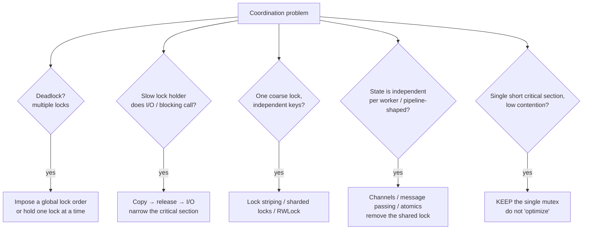

# Coordination Anti-Patterns — Refactoring Practice

> **Category:** [Concurrency Anti-Patterns](../README.md) → **Coordination** — *two or more lock holders that fail to make progress, or make progress far too slowly.*
> **Covers (collectively):** Lock Ordering Inconsistency → Deadlock · Holding a Lock During I/O · Wrong Lock Granularity

---

These exercises start from code that is **correct in a single-threaded test and wrong (or pathologically slow) under real concurrency**. The deadlock never fires on your laptop; the lock-during-I/O path is invisible until p99 latency explodes under load; the global lock looks fine until you add a second core. The skill is the *process*:

1. **Reproduce the failure before you fix it.** A deadlock you can't trigger is a deadlock you can't prove you fixed. Write a stress test (many goroutines/threads, randomized interleavings, run under `-race`) that fails reliably *first*. For contention, write a benchmark that shows the throughput floor.
2. **Apply one named cure.** Impose a global lock order; copy-then-release-then-I/O; shrink the lock to the smallest consistent unit; stripe it; or remove it entirely in favor of channels/atomics. One move, re-run the stress test.
3. **Verify with a tool, not with hope.** `go test -race`, `go test -bench`, a deadlock-detecting timeout in the stress harness, ThreadSanitizer, or a thread dump that shows the cycle is gone. Concurrency "looks fine" is never evidence.

> **How to use this file:** read the "Before", write down the interleaving that breaks it and the cure you'd apply *yourself*, then expand the solution. The gap between your interleaving and the worked one is where the learning is. Every "after" here is intended to be correct under `-race`; if you transcribe one and the detector complains, you transcribed it wrong.

A recurring decision in this file is **"which cure?"** — they are not interchangeable:



> A Python note runs through this file: under CPython's **GIL**, two pure-Python threads never run bytecode in parallel, so striping a lock buys you *nothing* for CPU-bound work — but **deadlocks and lock-during-I/O bugs are fully real** (the GIL is released around blocking I/O and `time.sleep`). Where a fix is GIL-sensitive, it is flagged.

---

## Table of Contents

| # | Exercise | Anti-pattern(s) | Lang | Cure |
|---|---|---|---|---|
| 1 | [Two accounts, two locks, one deadlock](#exercise-1--two-accounts-two-locks-one-deadlock) | Lock Ordering | Go | Global lock order by ID |
| 2 | [Move the HTTP call out of the lock](#exercise-2--move-the-http-call-out-of-the-lock) | Lock During I/O | Go | Copy → release → I/O |
| 3 | [The cache that serializes every reader](#exercise-3--the-cache-that-serializes-every-reader) | Wrong Granularity | Java | `Mutex` → `RWLock` |
| 4 | [One global map lock, sixteen idle cores](#exercise-4--one-global-map-lock-sixteen-idle-cores) | Wrong Granularity | Go | Lock striping / sharding |
| 5 | [Counter under a mutex](#exercise-5--counter-under-a-mutex) | Wrong Granularity | Go | Replace lock with atomic |
| 6 | [The transfer that logs to a DB while holding both locks](#exercise-6--the-transfer-that-logs-to-a-db-while-holding-both-locks) | Lock Ordering + I/O | Go | Order + snapshot-then-I/O |
| 7 | [Bidirectional graph edges deadlock](#exercise-7--bidirectional-graph-edges-deadlock) | Lock Ordering | Java | Ordered acquisition + tie-break |
| 8 | [The lock you can keep](#exercise-8--the-lock-you-can-keep-counter-case) | (counter-case) | Go | KEEP the single mutex |
| 9 | [Channels instead of a shared-state lock](#exercise-9--channels-instead-of-a-shared-state-lock) | Wrong Granularity | Go | Serialize via a goroutine + channel |
| 10 | [Deadlock under a Python GIL](#exercise-10--deadlock-under-a-python-gil) | Lock Ordering | Python | Ordered locks / `acquire` both |
| 11 | [Sharded LRU: granularity + I/O together](#exercise-11--sharded-lru-granularity--io-together) | Granularity + I/O | Go | Shard + load-outside-lock + singleflight |
| 12 | [The dining philosophers in production](#exercise-12--the-dining-philosophers-in-production) | Lock Ordering | Go | Resource hierarchy |
| 13 | [Read-mostly config: RWLock vs copy-on-write atomic](#exercise-13--read-mostly-config-rwlock-vs-copy-on-write-atomic) | Wrong Granularity | Go | `atomic.Pointer` snapshot |

---

## Exercise 1 — Two accounts, two locks, one deadlock

**Anti-pattern:** Lock Ordering Inconsistency. **Goal:** make concurrent transfers deadlock-free. **Constraints:** preserve behavior (no money created or destroyed); the function must remain safe to call from any number of goroutines in any direction.

```go
// Before — A→B locks (A,B); B→A locks (B,A). Reverse-direction concurrent
// transfers can each grab their first lock and wait forever on the second.
type Account struct {
	mu      sync.Mutex
	ID      int
	Balance int64
}

func Transfer(from, to *Account, amt int64) {
	from.mu.Lock()
	to.mu.Lock()
	from.Balance -= amt
	to.Balance += amt
	to.mu.Unlock()
	from.mu.Unlock()
}
```

<details>
<summary>Refactored</summary>

**Reproduce first**

The deadlock is interleaving-dependent, so force it: thousands of goroutines transferring in *both* directions between the same two accounts, with a watchdog that fails the test if they don't finish.

```go
func TestTransfer_NoDeadlock(t *testing.T) {
	a, b := &Account{ID: 1, Balance: 1_000_000}, &Account{ID: 2, Balance: 1_000_000}
	var wg sync.WaitGroup
	for i := 0; i < 1000; i++ {
		wg.Add(2)
		go func() { defer wg.Done(); Transfer(a, b, 1) }()
		go func() { defer wg.Done(); Transfer(b, a, 1) }() // reverse direction
	}
	done := make(chan struct{})
	go func() { wg.Wait(); close(done) }()
	select {
	case <-done:
	case <-time.After(2 * time.Second):
		t.Fatal("deadlock: transfers did not complete") // the Before version hangs here
	}
	if got := a.Balance + b.Balance; got != 2_000_000 {
		t.Fatalf("money not conserved: %d", got) // also catches lost updates
	}
}
```

**Move sequence**

1. **Reproduce.** Run the test against the Before code under `go test -race -run TestTransfer_NoDeadlock`. It hangs and the watchdog fires — deadlock proven.
2. **Impose a global lock order.** The cure for inconsistent ordering is a *total order* every caller respects. `Account.ID` is a stable, unique key — always lock the lower ID first, regardless of transfer direction. Now A→B and B→A both lock `(id=1, id=2)`; no cycle can form.
3. **Handle the `from == to` aliasing case** so you don't deadlock against yourself by double-locking the same mutex.

```go
// After — both directions acquire locks in the same (by-ID) order.
func Transfer(from, to *Account, amt int64) {
	if from.ID == to.ID {
		return // self-transfer is a no-op; never lock the same mutex twice
	}
	first, second := from, to
	if first.ID > second.ID {
		first, second = second, first // total order: lower ID first
	}
	first.mu.Lock()
	defer first.mu.Unlock()
	second.mu.Lock()
	defer second.mu.Unlock()

	from.Balance -= amt
	to.Balance += amt
}
```

**How to verify.** Re-run the stress test under `-race`: it now completes well under the watchdog and money is conserved. The `-race` detector confirms no torn reads of `Balance`. The argument that it *can't* deadlock is structural, not statistical: with a single global order, the wait-for graph is acyclic by construction (Coffman — circular-wait is impossible). If IDs could collide, fall back to ordering by `uintptr(unsafe.Pointer(&acc.mu))` or a per-account sequence number — any stable total order works.

> **Why not `TryLock`-and-retry?** Go added `Mutex.TryLock` in 1.18, and a back-off-retry loop *avoids* deadlock too — but it trades a deadlock for livelock risk and wasted spins under contention. A fixed order is simpler, starvation-free, and free. Prefer it.

</details>

---

## Exercise 2 — Move the HTTP call out of the lock

**Anti-pattern:** Holding a Lock During I/O. **Goal:** stop serializing every caller behind one in-flight network request. **Constraints:** the published rate (a shared map) must stay consistent; callers must still see a recently-fetched value.

```go
// Before — the network round-trip happens *inside* the critical section.
// Every concurrent caller queues behind one slow HTTP call, holding up
// readers and writers of `rates` for the full RTT.
type RateCache struct {
	mu    sync.Mutex
	rates map[string]float64
}

func (c *RateCache) Refresh(ccy string) (float64, error) {
	c.mu.Lock()
	defer c.mu.Unlock()

	v, err := httpGetRate(ccy) // 200ms network call — under the lock!
	if err != nil {
		return 0, err
	}
	c.rates[ccy] = v
	return v, nil
}
```

<details>
<summary>Refactored</summary>

**Reproduce first**

The bug here is latency, not a crash — measure it. A benchmark with `httpGetRate` stubbed to sleep 50 ms shows the lock holding multiplies: N concurrent refreshes take ≈ N×50 ms because they serialize.

```go
func BenchmarkRefresh(b *testing.B) {
	c := &RateCache{rates: map[string]float64{}}
	b.RunParallel(func(pb *testing.PB) {
		for pb.Next() {
			c.Refresh("USD")
		}
	})
}
// Before: throughput ≈ 1 / 50ms regardless of GOMAXPROCS — the lock is the bottleneck.
// After:  the 50ms calls run concurrently; only the tiny map write serializes.
```

**Move sequence**

1. **Identify the critical-section invariant.** The lock exists to protect the `rates` map from concurrent map writes (a data race in Go) — *not* to make the HTTP call atomic.
2. **Copy → release → I/O → re-acquire.** Do the slow call with **no lock held**, then take the lock only for the microsecond it takes to write the result.
3. **Accept the natural consequence:** two callers may both fetch the same currency concurrently and both write. That's correct (last write wins, both fresh). If duplicate fetches are expensive, dedupe them — see Exercise 11's `singleflight`.

```go
// After — the lock guards only the map mutation; the I/O is lock-free.
func (c *RateCache) Refresh(ccy string) (float64, error) {
	v, err := httpGetRate(ccy) // no lock held during the network call
	if err != nil {
		return 0, err
	}
	c.mu.Lock()
	c.rates[ccy] = v // critical section is now nanoseconds, not 200ms
	c.mu.Unlock()
	return v, nil
}
```

**How to verify.** `go test -race` confirms the map write is still protected (remove the `Lock`/`Unlock` and the detector immediately flags a concurrent map write — proof the lock is load-bearing). The parallel benchmark now scales with `GOMAXPROCS`: 8 concurrent refreshes finish in ≈ 50 ms, not 400 ms. Reads of `rates` elsewhere (also under `c.mu`) no longer stall for the RTT.

> **Anti-pattern within the cure:** never `defer c.mu.Unlock()` at the top and then do I/O — that's exactly the Before bug wearing a `defer`. The lock's lifetime must bracket *only* the shared-state access.
>
> **Python (GIL) note:** the GIL is *released* during blocking I/O (`requests.get`, socket reads), so a `threading.Lock` held across an HTTP call serializes all callers for the full RTT just as in Go — this anti-pattern is fully real in Python. Same cure: fetch outside the `with lock:` block, assign inside it.

</details>

---

## Exercise 3 — The cache that serializes every reader

**Anti-pattern:** Wrong Lock Granularity (a mutual-exclusion lock on read-mostly data). **Goal:** let concurrent readers proceed in parallel. **Constraints:** writes stay exclusive; readers must never see a half-updated entry.

```java
// Before — a read-mostly cache guarded by an exclusive lock.
// 99% of operations are reads, yet every read blocks every other read.
public class ConfigCache {
    private final Map<String, String> map = new HashMap<>();
    private final ReentrantLock lock = new ReentrantLock();

    public String get(String key) {
        lock.lock();
        try { return map.get(key); }   // readers exclude each other for no reason
        finally { lock.unlock(); }
    }

    public void put(String key, String val) {
        lock.lock();
        try { map.put(key, val); }
        finally { lock.unlock(); }
    }
}
```

<details>
<summary>Refactored</summary>

**Reproduce first**

Show the read-read serialization with a contended read benchmark (JMH sketch): N threads calling `get` on a tiny map. Throughput is flat in N because the exclusive lock admits one reader at a time.

```java
// JMH sketch
@Benchmark @Group("g") @GroupThreads(8)
public String readHeavy(ConfigCache c) { return c.get("k"); }
// Before: ops/s does not rise with thread count — readers are serialized.
// After (RWLock): read ops/s scales with cores until the write lock is taken.
```

**Move sequence**

1. **Classify the workload.** Reads dominate and don't mutate state ⇒ readers can safely share access; only writers need exclusivity. This is the textbook case for a *readers–writer* lock.
2. **Replace `ReentrantLock` with `ReentrantReadWriteLock`.** `get` takes the **read** lock (shared); `put` takes the **write** lock (exclusive). Multiple readers now run concurrently.
3. **Keep the smallest correct critical sections** and `try/finally` on every path so a thrown exception can't strand the lock.

```java
// After — readers share; writers exclude. Same visible behavior, parallel reads.
public class ConfigCache {
    private final Map<String, String> map = new HashMap<>();
    private final ReadWriteLock rw = new ReentrantReadWriteLock();

    public String get(String key) {
        rw.readLock().lock();
        try { return map.get(key); }   // many readers in parallel
        finally { rw.readLock().unlock(); }
    }

    public void put(String key, String val) {
        rw.writeLock().lock();
        try { map.put(key, val); }     // exclusive: blocks readers and other writers
        finally { rw.writeLock().unlock(); }
    }
}
```

**How to verify.** The grouped JMH read benchmark scales with thread count where the Before version was flat. Correctness: the read/write lock guarantees a writer never overlaps a reader, so no reader observes a half-`put` map. **Caveat to confirm:** `ReentrantReadWriteLock` is *not* reentrant from read→write (a thread holding the read lock cannot acquire the write lock — that deadlocks); audit that no code path upgrades. If reads vastly dominate and the values are immutable, a `ConcurrentHashMap` (lock-striped internally) or a copy-on-write snapshot is even better — see Exercise 13.

> **When NOT to do this:** RWLocks have higher single-thread overhead than a plain mutex and can starve writers under heavy read load. If reads and writes are roughly balanced, or the critical section is already nanoseconds, a plain mutex wins — see the counter-case in Exercise 8.

</details>

---

## Exercise 4 — One global map lock, sixteen idle cores

**Anti-pattern:** Wrong Lock Granularity (one coarse lock over independent keys). **Goal:** let operations on *different* keys proceed in parallel. **Constraints:** per-key operations stay atomic; no two goroutines corrupt the same bucket.

```go
// Before — a single mutex over the whole map. Updating key "a" blocks an
// update to key "z", even though they touch unrelated entries.
type Counters struct {
	mu sync.Mutex
	m  map[string]int64
}

func (c *Counters) Inc(key string) {
	c.mu.Lock()
	c.m[key]++ // independent keys, but globally serialized
	c.mu.Unlock()
}
```

<details>
<summary>Refactored</summary>

**Reproduce first**

A parallel benchmark hammering *distinct* keys should scale with cores but doesn't — the global lock serializes unrelated work.

```go
func BenchmarkInc(b *testing.B) {
	c := NewCounters()
	keys := []string{"a", "b", "c", "d", "e", "f", "g", "h"}
	b.RunParallel(func(pb *testing.PB) {
		i := 0
		for pb.Next() {
			c.Inc(keys[i%len(keys)]) // distinct keys, yet contended on one mutex
			i++
		}
	})
}
// Before: ns/op flat as you raise -cpu; lock contention dominates.
// After:  ns/op drops as work spreads across stripes.
```

**Move sequence**

1. **Diagnose contention.** `go test -bench . -cpu 1,2,4,8` shows no speedup; a `-mutexprofile` would point straight at `c.mu`. The lock protects *the whole map* though operations are key-independent.
2. **Lock striping.** Partition keys into N shards by `hash(key) % N`, each with its own mutex and submap. Operations on keys in different shards no longer contend. Pick N ≈ `GOMAXPROCS` or a small power of two (use the low bits of the hash).
3. **Keep per-shard sections tiny** and route every key through the same hash so a key always lands in the same shard (otherwise you'd split its count across shards).

```go
// After — lock striping: independent keys hit independent locks.
const shards = 16 // power of two → mask instead of modulo

type shard struct {
	mu sync.Mutex
	m  map[string]int64
}

type Counters struct {
	s [shards]*shard
}

func NewCounters() *Counters {
	c := &Counters{}
	for i := range c.s {
		c.s[i] = &shard{m: make(map[string]int64)}
	}
	return c
}

func (c *Counters) shardFor(key string) *shard {
	h := fnv32(key)
	return c.s[h&(shards-1)] // mask works because shards is a power of two
}

func (c *Counters) Inc(key string) {
	s := c.shardFor(key)
	s.mu.Lock()
	s.m[key]++
	s.mu.Unlock()
}

func fnv32(s string) uint32 {
	h := uint32(2166136261)
	for i := 0; i < len(s); i++ {
		h = (h ^ uint32(s[i])) * 16777619
	}
	return h
}
```

**How to verify.** Re-run `-bench -cpu 1,2,4,8 -race`: throughput now rises with core count (up to the shard count and key spread), and `-race` stays clean. A global aggregate read (`Total()`) must lock *all* shards in a fixed order (0..N-1) to get a consistent snapshot — if you add it, that ordered acquisition is itself an application of Exercise 1's rule. **Confirm** the hash spreads your real keys; a skewed hash re-creates a hot shard. (Go's `sync.Map` and `ConcurrentHashMap` in Java apply the same striping idea internally — reach for them before hand-rolling, but know what they do.)

</details>

---

## Exercise 5 — Counter under a mutex

**Anti-pattern:** Wrong Lock Granularity (a mutex around a single integer op). **Goal:** remove lock overhead for an operation a CPU instruction can do atomically. **Constraints:** the count stays exactly correct under concurrency.

```go
// Before — a full mutex to protect one increment. Correct, but heavier
// than necessary: lock/unlock cost dwarfs the add under contention.
type Metric struct {
	mu sync.Mutex
	n  int64
}

func (m *Metric) Inc()   { m.mu.Lock(); m.n++; m.mu.Unlock() }
func (m *Metric) Get() int64 { m.mu.Lock(); defer m.mu.Unlock(); return m.n }
```

<details>
<summary>Refactored</summary>

**Reproduce first**

A parallel `Inc` benchmark shows mutex contention cost; the atomic version should be markedly faster under contention with identical correctness.

```go
func BenchmarkInc(b *testing.B) {
	var m Metric
	b.RunParallel(func(pb *testing.PB) {
		for pb.Next() {
			m.Inc()
		}
	})
}
// Before (mutex):  contended lock, more ns/op.
// After  (atomic): single LOCK-prefixed instruction, fewer ns/op.
```

**Move sequence**

1. **Recognize the shape.** The entire critical section is one read-modify-write of a single integer — exactly what hardware atomics exist for. There is no multi-field invariant to protect.
2. **Replace the mutex with `atomic.Int64`** (Go 1.19+). `Add(1)` and `Load()` are lock-free and total-store-ordered, so the count is exact.

```go
// After — lock-free; the increment is a single atomic instruction.
type Metric struct {
	n atomic.Int64
}

func (m *Metric) Inc()        { m.n.Add(1) }
func (m *Metric) Get() int64  { return m.n.Load() }
```

**How to verify.** `go test -race` is clean (atomics are race-free by definition). The benchmark shows lower ns/op under contention. **The trap to confirm you avoided:** atomics compose *per operation*, not across operations. `if m.Get() < limit { m.Inc() }` is **not** atomic — there's a gap between the load and the add. If you need check-and-increment atomically, use `CompareAndSwap` in a loop, or keep the mutex. This exercise replaces the lock *only because the whole critical section was a single atomic op.*

> **When NOT to:** the moment two fields must change together (e.g., `n` and a `lastUpdated` timestamp that must agree), a single atomic can't protect the invariant — go back to the mutex. Atomics are a granularity tool for *independent* words, not a general lock replacement.
>
> **Python note:** `x += 1` is **not** atomic in Python despite the GIL (it's load/add/store bytecodes the interpreter can switch between). Use `threading.Lock` or `itertools.count` / `multiprocessing.Value` with a lock; Python has no user-facing `atomic.Add` for ints.

</details>

---

## Exercise 6 — The transfer that logs to a DB while holding both locks

**Anti-pattern:** Lock Ordering **and** Lock During I/O (combination). **Goal:** make it deadlock-free *and* stop holding locks across the audit write. **Constraints:** money conserved; the audit row must reflect the committed transfer.

```go
// Before — two bugs stacked: inconsistent lock order (Exercise 1) AND a
// database write performed while both account locks are held.
func Transfer(from, to *Account, amt int64, audit AuditLog) error {
	from.mu.Lock()
	to.mu.Lock()
	from.Balance -= amt
	to.Balance += amt
	// holding BOTH locks across a DB round-trip — serializes all transfers
	err := audit.Write(from.ID, to.ID, amt) // 5ms+ under both locks
	to.mu.Unlock()
	from.mu.Unlock()
	return err
}
```

<details>
<summary>Refactored</summary>

**Reproduce first**

Reuse Exercise 1's reverse-direction stress test (it deadlocks), and add a latency benchmark with `audit.Write` stubbed to sleep — throughput collapses because every transfer holds both locks for the DB RTT.

**Move sequence**

1. **Fix the deadlock first (Exercise 1's cure).** Order acquisition by `ID`. This is the *safety* fix and must come before any latency tuning — a fast deadlock is still a deadlock.
2. **Shrink the critical section (Exercise 2's cure).** Mutate balances under the locks, capture the few values the audit needs into locals, **release both locks**, *then* write to the DB. The mutation is the invariant the locks protect; the audit write isn't.
3. **Decide the ordering contract for the audit.** Here we audit *after* the in-memory commit succeeds; if the DB write fails, the transfer already happened in memory — so either make the audit best-effort (log-and-continue) or design a compensating reversal. We pick best-effort + error return so the caller can react, and we never lose the money invariant.

```go
// After — ordered locks, balances mutated under lock, I/O done lock-free.
func Transfer(from, to *Account, amt int64, audit AuditLog) error {
	if from.ID == to.ID {
		return nil
	}
	first, second := from, to
	if first.ID > second.ID {
		first, second = second, first
	}

	first.mu.Lock()
	second.mu.Lock()
	from.Balance -= amt
	to.Balance += amt
	// snapshot what the I/O needs, then drop the locks
	fromID, toID := from.ID, to.ID
	second.mu.Unlock()
	first.mu.Unlock()

	// I/O happens with NO locks held
	if err := audit.Write(fromID, toID, amt); err != nil {
		return fmt.Errorf("transfer committed but audit failed: %w", err)
	}
	return nil
}
```

**How to verify.** The reverse-direction stress test from Exercise 1 now completes (deadlock gone, ordered acquisition) *and* the latency benchmark scales because the audit RTT no longer runs under the locks. `-race` confirms `Balance` access is still protected. The new failure mode — audit fails after commit — is now *explicit* in the return value rather than silently extending the critical section; document the at-least-once-audit / best-effort contract in the function comment. This is the canonical "two anti-patterns travel together" cleanup: **order, then narrow.**

</details>

---

## Exercise 7 — Bidirectional graph edges deadlock

**Anti-pattern:** Lock Ordering Inconsistency. **Goal:** add edges between nodes from many threads without deadlock. **Constraints:** an edge must be recorded on *both* endpoints atomically; works for any pair, including the cycle A↔B added concurrently.

```java
// Before — addEdge(a,b) locks (a,b); a concurrent addEdge(b,a) locks (b,a).
// Classic two-lock cycle.
class Node {
    final int id;
    final Set<Node> neighbors = new HashSet<>();
    final Object lock = new Object();
    Node(int id) { this.id = id; }
}

void addEdge(Node a, Node b) {
    synchronized (a.lock) {
        synchronized (b.lock) {
            a.neighbors.add(b);
            b.neighbors.add(a);
        }
    }
}
```

<details>
<summary>Refactored</summary>

**Reproduce first**

Spawn many threads, half calling `addEdge(a,b)` and half `addEdge(b,a)`, with a `CountDownLatch` to release them simultaneously and an executor-shutdown timeout that fails the test if they hang.

```java
@Test void noDeadlock() throws Exception {
    Node a = new Node(1), b = new Node(2);
    ExecutorService ex = Executors.newFixedThreadPool(8);
    for (int i = 0; i < 1000; i++) {
        ex.submit(() -> addEdge(a, b));
        ex.submit(() -> addEdge(b, a)); // reverse order — Before deadlocks
    }
    ex.shutdown();
    assertTrue(ex.awaitTermination(2, TimeUnit.SECONDS), "deadlock");
}
```

**Move sequence**

1. **Reproduce** — the Before version fails `awaitTermination`. (A `jstack` thread dump on the hung JVM prints "Found one Java-level deadlock" and names the two locks — keep that in your toolbox for prod.)
2. **Impose a global order by `id`.** Lock the lower-`id` node's monitor first. Both `addEdge(a,b)` and `addEdge(b,a)` then acquire in the same order.
3. **Tie-break equal ids.** Self-loop (`a == b`) must not double-acquire the same monitor (Java monitors *are* reentrant so it wouldn't deadlock, but the logic is clearer handled explicitly).

```java
// After — always lock the lower id first; identical order for both directions.
void addEdge(Node a, Node b) {
    if (a.id == b.id) { a.neighbors.add(a); return; } // self-loop; reentrant-safe
    Node first  = a.id < b.id ? a : b;
    Node second = a.id < b.id ? b : a;
    synchronized (first.lock) {
        synchronized (second.lock) {
            a.neighbors.add(b);
            b.neighbors.add(a);
        }
    }
}
```

**How to verify.** The stress test passes `awaitTermination`; under load `jstack` shows no deadlock cycle. Correctness: both `neighbors` sets are mutated inside the same nested-lock region, so the edge is recorded atomically on both endpoints. **If nodes had no natural id**, use `System.identityHashCode(node)` as the ordering key — but beware: identity hash codes can (rarely) collide, so add a final tie-break lock (a single shared "gate" mutex taken only when the keys are equal) to keep the order total. A total order is the whole game; any consistent one works.

</details>

---

## Exercise 8 — The lock you can keep (counter-case)

**Anti-pattern:** *none — this is the case where the simple single lock is correct.* **Goal:** recognize when "optimizing" the lock would add risk for no benefit, and **keep** it. **Constraints:** preserve the multi-field invariant.

```go
// "Before" — a single mutex protecting two fields that must agree.
// It looks like Exercise 5 (a counter), so the reflex is "use an atomic."
// That reflex is WRONG here.
type Session struct {
	mu        sync.Mutex
	hits      int64
	lastSeen  time.Time
}

func (s *Session) Touch() {
	s.mu.Lock()
	s.hits++
	s.lastSeen = time.Now() // two fields must update together
	s.mu.Unlock()
}

func (s *Session) Snapshot() (int64, time.Time) {
	s.mu.Lock()
	defer s.mu.Unlock()
	return s.hits, s.lastSeen // must be a consistent pair
}
```

<details>
<summary>Refactored</summary>

**The analysis (and the decision to keep it)**

1. **Could we replace the mutex with atomics (Exercise 5)?** No. `hits` and `lastSeen` form a *single invariant*: a `Snapshot` must return a count and timestamp that belong to the *same* `Touch`. Two independent atomics can be read between another goroutine's two writes — `Snapshot` could return `hits=5` with the timestamp from the 4th touch. The mutex makes the pair atomic; atomics cannot (without a seqlock, which is more complex than the mutex it replaces).
2. **Could we stripe it (Exercise 4)?** No. There's one `Session` object, not a keyed collection — there's nothing to shard.
3. **Could we use an RWLock (Exercise 3)?** Almost never worth it: the critical sections are a handful of nanoseconds and `Touch` (a writer) is frequent. An RWLock's extra bookkeeping would *lose* to the plain mutex here, and could starve writers.
4. **Is it holding the lock during I/O (Exercise 2)?** No — `time.Now()` is a cheap syscall-free (vDSO) read, not blocking I/O. Nothing to move out.

**Decision: keep the single mutex unchanged.** The "refactor" is to *not* refactor — and to write down why, so the next reader doesn't "optimize" it into a bug.

```go
// After — unchanged on purpose. The single mutex is the correct, simplest,
// fastest tool for a short critical section over a multi-field invariant.
// (Comment added documenting why atomics/striping/RWLock were rejected.)
```

**How to verify.** A test that interleaves many `Touch` calls with `Snapshot` reads and asserts the invariant — every observed `(hits, lastSeen)` pair must be one that some single `Touch` actually produced — passes with the mutex and **fails** if you "optimize" to two separate atomics (great test to keep as a regression guard against future cleverness). `-race` is clean. The benchmark shows the mutex is already at the noise floor; there is no contention to remove.

> **The discipline:** every cure in this file has a precondition. Wrong-granularity fixes assume *independent* units; atomics assume a *single-word* invariant; copy-then-I/O assumes the locked state and the I/O are *separable*. When the preconditions don't hold, the simple mutex is not a smell — it's the right answer. Premature lock-splitting is its own anti-pattern.

</details>

---

## Exercise 9 — Channels instead of a shared-state lock

**Anti-pattern:** Wrong Lock Granularity (a lock used to serialize what is really a single-owner workflow). **Goal:** replace lock-guarded shared state with Go's "share memory by communicating" model. **Constraints:** every command applied exactly once, in order; no data races.

```go
// Before — a mutex serializes all access to an in-memory ledger. Correct,
// but the lock is doing the job of "one owner at a time" — which a single
// goroutine fed by a channel models more clearly and without lock contention.
type Ledger struct {
	mu      sync.Mutex
	balance int64
}

func (l *Ledger) Apply(delta int64) {
	l.mu.Lock()
	l.balance += delta
	l.mu.Unlock()
}

func (l *Ledger) Balance() int64 {
	l.mu.Lock()
	defer l.mu.Unlock()
	return l.balance
}
```

<details>
<summary>Refactored</summary>

**When this cure fits**

This is *not* always better than the mutex — for a one-line critical section, the mutex (or Exercise 5's atomic) is simpler. Reach for channels when the state has **a single logical owner** and you want commands processed **serially and in order** (e.g., an actor/state-machine, a write-ahead buffer, a rate-limited applier). Then a goroutine *owns* the state and no lock is needed at all: the channel *is* the synchronization.

**Move sequence**

1. **Confine the state to one goroutine.** Move `balance` inside a loop goroutine that's the *only* code touching it — now it isn't shared, so it needs no lock.
2. **Send commands over a channel.** `Apply` sends a delta; the owner goroutine ranges over the channel and applies them in arrival order.
3. **Model reads as request/reply.** A read sends a reply-channel; the owner serves it inside the same loop, so reads and writes are naturally serialized without a lock.

```go
// After — one owner goroutine; the channel provides ordering and safety.
type Ledger struct {
	applies chan int64
	reads   chan chan int64
}

func NewLedger() *Ledger {
	l := &Ledger{
		applies: make(chan int64),
		reads:   make(chan chan int64),
	}
	go l.loop()
	return l
}

func (l *Ledger) loop() {
	var balance int64 // owned solely by this goroutine — no lock, no race
	for {
		select {
		case d := <-l.applies:
			balance += d
		case reply := <-l.reads:
			reply <- balance
		}
	}
}

func (l *Ledger) Apply(delta int64) { l.applies <- delta }

func (l *Ledger) Balance() int64 {
	reply := make(chan int64)
	l.reads <- reply
	return <-reply
}
```

**How to verify.** `go test -race`: many goroutines calling `Apply`/`Balance` concurrently produce the correct final balance with zero race reports — because `balance` is touched by exactly one goroutine, the detector has nothing to flag. A test that fires N applies of `+1` and asserts `Balance() == N` confirms exactly-once, in-order application. **Trade-offs to confirm you accept:** channel ops cost more than an uncontended mutex, and you now have a goroutine to shut down (add a `done` channel / `context` for clean teardown in real code). Use this when ownership/ordering clarity pays for the overhead — not as a blanket replacement for every mutex.

> **The Go proverb:** *"Don't communicate by sharing memory; share memory by communicating."* The mutex version shares `balance`; the channel version hands ownership to one goroutine and passes messages. Both are correct — pick the one whose *shape* matches the problem.

</details>

---

## Exercise 10 — Deadlock under a Python GIL

**Anti-pattern:** Lock Ordering Inconsistency. **Goal:** show that the GIL does **not** save you from deadlock, and fix it. **Constraints:** both balances updated atomically; deadlock-free for concurrent reverse transfers.

```python
# Before — people assume "Python has the GIL, so no concurrency bugs."
# False: explicit locks still deadlock. acquire(a,b) vs acquire(b,a) hangs,
# because threading.Lock.acquire() RELEASES the GIL while it blocks.
import threading

class Account:
    def __init__(self, acc_id, balance):
        self.id = acc_id
        self.balance = balance
        self.lock = threading.Lock()

def transfer(frm, to, amt):
    with frm.lock:
        with to.lock:          # reverse-direction caller waits here forever
            frm.balance -= amt
            to.balance += amt
```

<details>
<summary>Refactored</summary>

**Reproduce first**

Threads transferring in both directions deadlock; a watchdog `join(timeout=...)` proves it (the threads never finish).

```python
def test_no_deadlock():
    a, b = Account(1, 1_000_000), Account(2, 1_000_000)
    threads = []
    for _ in range(500):
        threads.append(threading.Thread(target=transfer, args=(a, b, 1)))
        threads.append(threading.Thread(target=transfer, args=(b, a, 1)))  # reverse
    for t in threads: t.start()
    for t in threads:
        t.join(timeout=3)
        assert not t.is_alive(), "deadlock: thread did not finish"  # Before fails here
    assert a.balance + b.balance == 2_000_000
```

**Move sequence**

1. **Reproduce** under CPython — it hangs. This kills the "GIL means thread-safe" myth: the GIL serializes *bytecode*, but `lock.acquire()` is a blocking call that drops the GIL while waiting, so a true two-lock cycle forms.
2. **Impose a global lock order by `id`** — identical strategy to Exercise 1. Lock the lower id first in *both* directions.
3. **Guard the self-transfer** (`frm is to`) — `threading.Lock` is **not** reentrant, so acquiring the same lock twice would deadlock against yourself. (If you genuinely need reentrancy, use `threading.RLock`, but ordering is the real fix here.)

```python
# After — ordered acquisition; deadlock-free regardless of direction.
def transfer(frm, to, amt):
    if frm.id == to.id:
        return  # self-transfer no-op; never acquire the same non-reentrant Lock twice
    first, second = (frm, to) if frm.id < to.id else (to, frm)
    with first.lock:
        with second.lock:        # both directions now lock lower-id first
            frm.balance -= amt
            to.balance += amt
```

**How to verify.** The watchdog test now passes (all threads finish, money conserved). Because the ordering is total, the wait-for graph is acyclic — no circular wait, no deadlock. **Takeaway to internalize:** the GIL protects single bytecode ops, *not* multi-step critical sections and *not* explicit locks; ordering discipline is mandatory in Python exactly as in Go/Java. For pure-CPU contention the GIL means lock striping won't help (only one thread runs Python bytecode at a time), but *correctness* anti-patterns — deadlock, lock-during-I/O — are 100% live.

</details>

---

## Exercise 11 — Sharded LRU: granularity + I/O together

**Anti-pattern:** Wrong Granularity **and** Lock During I/O (combination). **Goal:** a concurrent read-through cache that (a) doesn't serialize all keys on one lock and (b) doesn't hold a lock during the backing-store load — without a thundering herd. **Constraints:** a cache miss loads exactly once per key under concurrency; different keys proceed in parallel.

```go
// Before — one global lock AND the slow loader runs inside it.
// Every miss blocks every other operation for the full load latency.
type Cache struct {
	mu   sync.Mutex
	data map[string]string
	load func(key string) (string, error) // slow: DB / network
}

func (c *Cache) Get(key string) (string, error) {
	c.mu.Lock()
	defer c.mu.Unlock() // held across the load below — double bug
	if v, ok := c.data[key]; ok {
		return v, nil
	}
	v, err := c.load(key) // slow I/O under the global lock
	if err != nil {
		return "", err
	}
	c.data[key] = v
	return v, nil
}
```

<details>
<summary>Refactored</summary>

**Reproduce first**

Benchmark concurrent `Get` of distinct keys with `load` stubbed to sleep: throughput is ≈ 1/latency because the global lock + in-lock load serialize everything. A second test asserting `load` call-count under a concurrent stampede of the *same* missing key shows the herd problem the naive fix can introduce.

**Move sequence**

1. **Shard the lock (Exercise 4).** Hash the key to one of N shards; different keys now use different mutexes.
2. **Load outside the lock (Exercise 2).** On a miss: check under the shard lock, release, load with no lock held, then re-acquire to store. This stops the I/O from serializing the shard.
3. **Prevent the thundering herd.** Steps 1–2 let many goroutines load the *same* missing key at once. Dedupe concurrent loads of one key with `golang.org/x/sync/singleflight` so the backing store sees a single request per key.

```go
// After — sharded locks, load-outside-lock, single-flight dedup.
import "golang.org/x/sync/singleflight"

const shards = 16

type cacheShard struct {
	mu   sync.RWMutex
	data map[string]string
}

type Cache struct {
	shards [shards]*cacheShard
	group  singleflight.Group
	load   func(key string) (string, error)
}

func NewCache(load func(string) (string, error)) *Cache {
	c := &Cache{load: load}
	for i := range c.shards {
		c.shards[i] = &cacheShard{data: make(map[string]string)}
	}
	return c
}

func (c *Cache) shardFor(key string) *cacheShard { return c.shards[fnv32(key)&(shards-1)] }

func (c *Cache) Get(key string) (string, error) {
	s := c.shardFor(key)

	// fast path: read lock only
	s.mu.RLock()
	if v, ok := s.data[key]; ok {
		s.mu.RUnlock()
		return v, nil
	}
	s.mu.RUnlock()

	// slow path: load WITHOUT holding the shard lock, deduped per key
	v, err, _ := c.group.Do(key, func() (interface{}, error) {
		// re-check: another goroutine may have filled it while we waited
		s.mu.RLock()
		if got, ok := s.data[key]; ok {
			s.mu.RUnlock()
			return got, nil
		}
		s.mu.RUnlock()

		loaded, err := c.load(key) // no lock held during I/O
		if err != nil {
			return "", err
		}
		s.mu.Lock()
		s.data[key] = loaded
		s.mu.Unlock()
		return loaded, nil
	})
	if err != nil {
		return "", err
	}
	return v.(string), nil
}
```

**How to verify.** Three checks: (1) the distinct-keys benchmark now scales with cores — `-bench -cpu 1,2,4,8`; (2) `-race` is clean across concurrent gets/loads; (3) the same-key stampede test shows `load` invoked **once**, proving singleflight dedup. This is the production shape of a read-through cache: **shard for parallelism, load outside the lock for latency, singleflight for the herd.** Drop any one and you reintroduce a coordination anti-pattern.

</details>

---

## Exercise 12 — The dining philosophers in production

**Anti-pattern:** Lock Ordering Inconsistency (the canonical N-lock cycle). **Goal:** make N workers that each need *two* adjacent resources deadlock-free. **Constraints:** each worker acquires both its resources; no global serialization; deadlock-free for any N.

```go
// Before — N philosophers, N forks. Each grabs left then right. If all grab
// their left simultaneously, every right is held by a neighbor: total deadlock.
func philosopher(i int, left, right *sync.Mutex) {
	for {
		left.Lock()
		right.Lock() // everyone holds left, waits on right → cycle of N
		eat()
		right.Unlock()
		left.Unlock()
	}
}
```

<details>
<summary>Refactored</summary>

**Reproduce first**

Run N philosophers around a ring of N mutexes with a deadline; the Before version wedges almost immediately for N ≥ 2 and the deadline fires.

**Move sequence**

1. **Recognize it as Exercise 1 generalized to N locks.** The cure is the same: a **resource hierarchy** (global total order). The classic Dijkstra fix: each philosopher picks up the lower-numbered fork first.
2. **Order by fork index.** Pass each fork its index; a worker locks `min(left,right)` index first, `max` second. The asymmetry breaks the cycle — at least one philosopher acquires in an order that lets a neighbor finish.
3. **Keep `Unlock` order irrelevant** (releasing doesn't create cycles), but `defer` in reverse for clarity.

```go
// After — resource hierarchy: always lock the lower-indexed fork first.
type Fork struct {
	mu sync.Mutex
	id int
}

func philosopher(left, right *Fork) {
	first, second := left, right
	if first.id > second.id {
		first, second = second, first // total order over forks
	}
	for {
		first.mu.Lock()
		second.mu.Lock()
		eat()
		second.mu.Unlock()
		first.mu.Unlock()
	}
}
```

**How to verify.** The N-philosopher stress test runs past its deadline without wedging for any N; `-race` is clean. The proof is structural: a single global order over forks makes a circular wait impossible (one of the four Coffman conditions is removed), so no deadlock can exist regardless of timing. **Alternatives worth knowing** (and why ordering usually wins): a waiter/arbitrator (one extra mutex gating pickups) serializes too much; bounding diners with a semaphore to N-1 works but adds a primitive; `TryLock` + back-off risks livelock. The resource hierarchy is the cheapest correct fix and the one to reach for first.

</details>

---

## Exercise 13 — Read-mostly config: RWLock vs copy-on-write atomic

**Anti-pattern:** Wrong Lock Granularity (locking on the read path of near-immutable, read-dominated data). **Goal:** make the hot read path *lock-free* for config that's read constantly and replaced rarely. **Constraints:** readers always see a complete, internally-consistent config; an update is atomic (no reader sees a half-applied change).

```go
// Before — every request reads config under a mutex. Reads are ~100% of
// traffic; updates happen seconds-to-minutes apart. The read lock is pure
// overhead on the hottest path in the service.
type Config struct {
	MaxConns int
	Timeout  time.Duration
	Feature  map[string]bool
}

type Holder struct {
	mu  sync.Mutex
	cfg Config
}

func (h *Holder) Get() Config { h.mu.Lock(); defer h.mu.Unlock(); return h.cfg }
func (h *Holder) Set(c Config) { h.mu.Lock(); h.cfg = c; h.mu.Unlock() }
```

<details>
<summary>Refactored</summary>

**Reproduce first**

A parallel read benchmark shows the mutex caps read throughput; an RWLock helps, but a copy-on-write `atomic.Pointer` removes locking from the read path entirely.

```go
func BenchmarkGet(b *testing.B) {
	h := NewHolder(Config{MaxConns: 100})
	b.RunParallel(func(pb *testing.PB) {
		for pb.Next() {
			_ = h.Get()
		}
	})
}
// Mutex:   reads serialize.
// RWLock:  reads share, but still touch the lock's reader-count (cache contention).
// Atomic:  reads are a single pointer load — best read scalability.
```

**Move sequence**

1. **Classify:** reads ≫ writes, and a `Config` is logically *immutable once published* — perfect for **copy-on-write**. Instead of mutating shared fields, publish a *new* `*Config` and swap the pointer atomically.
2. **Store `*Config` in an `atomic.Pointer[Config]`.** `Get` is a single atomic load (no lock). `Set` builds a fresh `Config` and `Store`s the pointer — the swap is atomic, so a reader sees either the whole old config or the whole new one, never a mix.
3. **Treat the pointed-to `Config` as read-only after publish.** Updaters must *copy then swap*, never mutate in place (including the `Feature` map — copy it).

```go
// After — lock-free reads via atomic pointer swap (copy-on-write).
type Holder struct {
	ptr atomic.Pointer[Config]
}

func NewHolder(c Config) *Holder {
	h := &Holder{}
	h.ptr.Store(&c)
	return h
}

// Get is a single atomic load — no lock on the hot path.
func (h *Holder) Get() *Config { return h.ptr.Load() }

// Set publishes a new immutable snapshot; readers see all-or-nothing.
func (h *Holder) Set(update func(old Config) Config) {
	for {
		old := h.ptr.Load()
		next := update(*old) // build a fresh value off a copy
		if h.ptr.CompareAndSwap(old, &next) {
			return // lost updates impossible: CAS retries on concurrent writers
		}
	}
}
```

**How to verify.** The read benchmark shows `Get` scaling almost perfectly with cores (a pointer load has no contention); `-race` is clean. Correctness: the atomic swap publishes a fully-built `Config`, so no reader ever observes a partially-updated one — the all-or-nothing invariant the original lock provided is preserved. **The rule you must keep:** the published `*Config` is immutable — never write through a pointer returned by `Get`, and have `Set` deep-copy the `Feature` map, or a reader holding an old pointer could see it mutated. If writes were frequent (not the case here), the CAS-retry churn would favor an `RWMutex` (Exercise 3) instead — copy-on-write wins precisely because writes are rare.

> **Granularity, fully zoomed out:** Exercise 5 dropped to an atomic for a single word; this drops to an atomic for a whole *immutable snapshot*. Both replace a lock by making the protected thing either atomic-sized or atomically-swapped. When neither holds (multi-field mutable invariant), you keep the lock — Exercise 8.

</details>

---

## Refactoring discipline (concurrency) — the recap

Coordination fixes run the same loop as any refactor, with one non-negotiable addition: **you must reproduce the failure before you trust the fix.**

```text
reproduce (stress test fails / benchmark floors)
   →  apply ONE named cure
   →  re-run under the tool (-race, -bench, watchdog, thread dump)
   →  green & faster?  commit
   →  (a separate, documented commit for any behavioral delta)
```

- **Reproduce before you fix.** A deadlock needs a reverse-direction stress test with a watchdog timeout; contention needs a parallel benchmark across `-cpu 1,2,4,8`. "It works now" after a change you couldn't make fail before is not evidence.
- **Verify with a tool, never by inspection.** `go test -race` / ThreadSanitizer for data races; a watchdog or `jstack`/`pprof` for deadlock; `-bench` and mutex/block profiles for contention. Concurrency intuition is wrong often enough that unverified is unfixed.
- **Deadlock cure = a total order.** Impose one global lock order (by id, address, or index) and the circular-wait Coffman condition is *structurally* removed — for two locks (Ex. 1, 7, 10) or N (Ex. 12). Prefer ordering over `TryLock`-retry (livelock) and over a coarse global lock (kills throughput).
- **I/O cure = narrow the critical section.** Copy the state the I/O needs, release the lock, do the I/O, re-acquire only to write back (Ex. 2, 6, 11). Never `defer Unlock()` and then block — that's the bug with a hat on.
- **Granularity cure = match the lock to the unit of independent state.** Stripe/shard for keyed collections (Ex. 4, 11), RWLock for read-mostly (Ex. 3), atomic for a single word (Ex. 5) or an immutable snapshot (Ex. 13), channels for single-owner workflows (Ex. 9).
- **Know when to keep the lock (Ex. 8).** Every cure has a precondition. Multi-field invariant + short critical section ⇒ the plain mutex is correct and fastest. Premature lock-splitting is its own anti-pattern; document *why* you kept it.

| Cure | Anti-pattern it removes | Exercises |
|---|---|---|
| Global lock order (by id / address / index) | Lock Ordering → Deadlock | 1, 6, 7, 10, 12 |
| Copy → release → I/O → re-acquire | Holding a Lock During I/O | 2, 6, 11 |
| RWLock (readers share, writers exclude) | Wrong Granularity (read-mostly) | 3, (11) |
| Lock striping / sharded locks | Wrong Granularity (keyed collection) | 4, 11 |
| Replace lock with atomic (word) | Wrong Granularity (single op) | 5 |
| Copy-on-write `atomic.Pointer` snapshot | Wrong Granularity (read-mostly, rare writes) | 13 |
| Channels / single-owner goroutine | Wrong Granularity (single-owner workflow) | 9 |
| Resource hierarchy (N locks) | Lock Ordering → Deadlock (N-way) | 12 |
| **Keep the single mutex** | (counter-case — no anti-pattern) | 8 |

---

## Related Topics

- [`tasks.md`](tasks.md) — guided exercises building these coordination cures from scratch.
- [`find-bug.md`](find-bug.md) — the *spotting* counterpart: identify the deadlock / lock-during-I/O / wrong-granularity smell, don't fix it.
- [`junior.md`](junior.md) · [`middle.md`](middle.md) · [`senior.md`](senior.md) · [`professional.md`](professional.md) — recognize → countermove → debug-in-prod → memory-model depth.
- [Concurrency Anti-Patterns](../README.md) — the chapter overview and the other two categories (Synchronization Misuse, Shared State).
- [Refactoring → Refactoring Techniques](../../../refactoring/02-refactoring-techniques/README.md) — the mechanical refactoring catalog the structural moves draw on.
