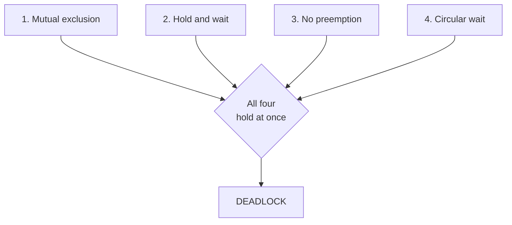
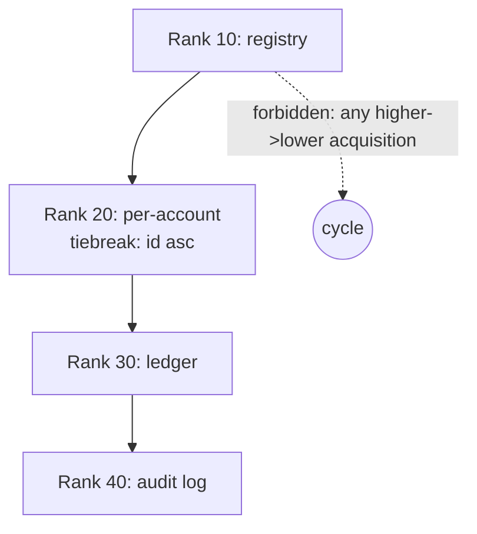
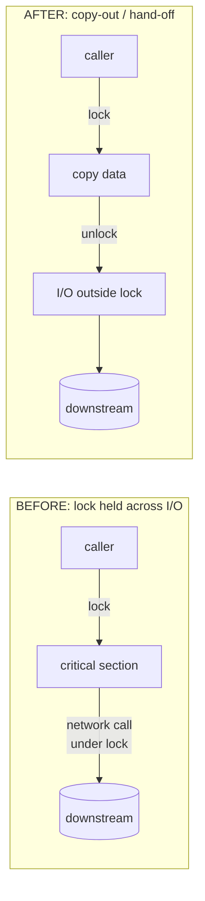
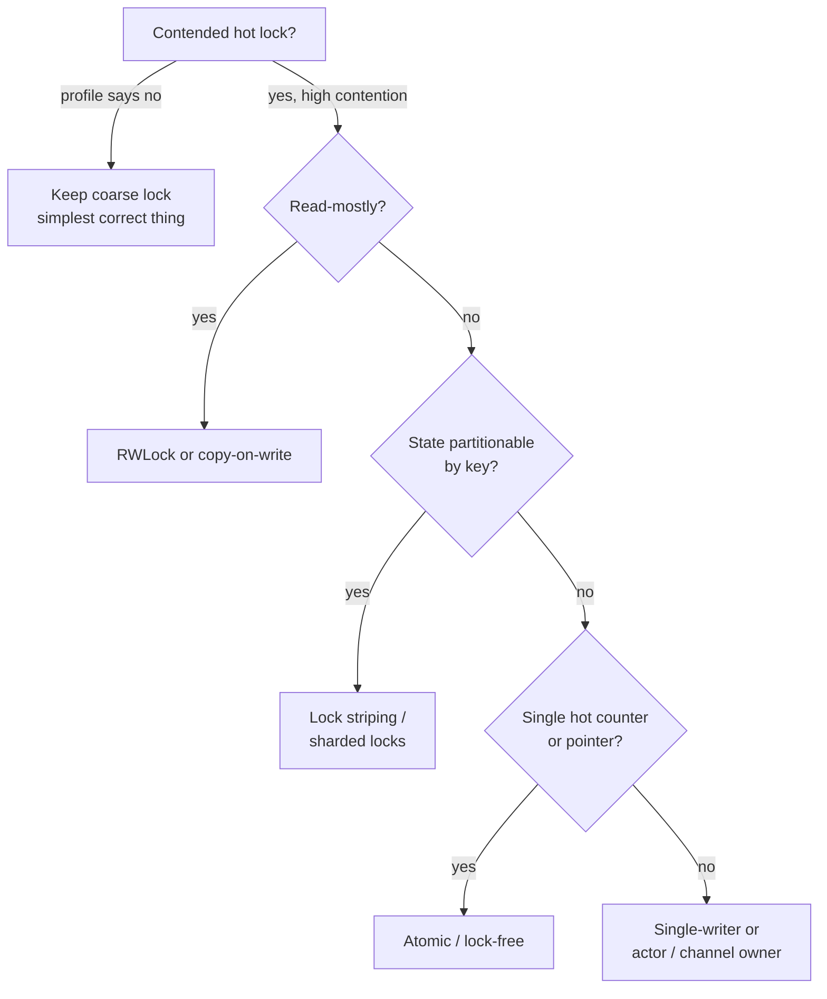

# Coordination Anti-Patterns — Senior Level

> **Category:** [Concurrency Anti-Patterns](../README.md) → **Coordination** — *two or more lock holders fail to make progress together.*
> **Covers (collectively):** Lock Ordering Inconsistency → Deadlock · Holding a Lock During I/O · Wrong Lock Granularity

---

## Table of Contents

1. [Introduction](#introduction)
2. [Prerequisites](#prerequisites)
3. [How Did the Codebase Get Here? — Root-Cause Forces](#how-did-the-codebase-get-here--root-cause-forces)
4. [The Four Coffman Conditions: The Shared Theory](#the-four-coffman-conditions-the-shared-theory)
5. [Deadlock: Prevention vs. Avoidance vs. Detection](#deadlock-prevention-vs-avoidance-vs-detection)
6. [Designing a System-Wide Lock Hierarchy](#designing-a-system-wide-lock-hierarchy)
7. [Eliminating Lock-Across-I/O at Scale](#eliminating-lock-across-io-at-scale)
8. [Choosing Lock Granularity at Scale](#choosing-lock-granularity-at-scale)
9. [Dropping Locks Entirely: Single-Writer, Actors, Channels](#dropping-locks-entirely-single-writer-actors-channels)
10. [Auditing a Live System for Coordination Bugs](#auditing-a-live-system-for-coordination-bugs)
11. [When Coarse Locking Is the Right Answer](#when-coarse-locking-is-the-right-answer)
12. [Preventing Coordination Decay Organizationally](#preventing-coordination-decay-organizationally)
13. [Common Mistakes](#common-mistakes)
14. [Test Yourself](#test-yourself)
15. [Cheat Sheet](#cheat-sheet)
16. [Summary](#summary)
17. [Further Reading](#further-reading)
18. [Related Topics](#related-topics)

---

## Introduction

> Focus: **How did the codebase get here?** and **How do I fix it safely at scale?**

At the junior level you learned to *recognize* these three shapes — the AB/BA deadlock, the lock wrapped around a network call, the one-giant-mutex throughput killer. At the middle level you learned the local cures: order your locks, copy-then-release, size the lock to the data. This file is the situation you inherit as a senior: a 400-thread service whose tail latency spikes to 30 seconds twice a day, a deadlock that fires once a week and only in production, a `synchronized` method that is now the throughput ceiling for the whole company — and "rewrite the concurrency model" is not on the table this quarter.

Three questions define senior-level work here:

1. **How did it get this way?** Coordination bugs at scale are rarely one bad commit. They are the deterministic output of *no agreed lock order*, *locks acquired by composition* (caller holds L1, callee grabs L2), and *granularity chosen by reflex* (`synchronized` on the method because it was the easy keyboard shortcut). Fix the code without fixing the convention and the next merge reintroduces the cycle.

2. **How do I fix it without an outage?** A contended lock is *load-bearing* — every request flows through it. You change it the way you change any load-bearing structure: behind a measurement, in reversible steps, with a way to roll back. Swapping a global mutex for lock striping on the revenue path at 2pm with no benchmark is how a latency problem becomes an incident.

3. **What is the right amount of coordination?** The senior insight juniors lack: **more locking is not safer, and finer locking is not faster.** Every lock is a place two threads can fail to make progress together. The deepest cure is usually to coordinate *less* — make state immutable, give it a single owner, pass copies, or move it behind a channel — so there is no shared lock to order, hold, or size in the first place.

> **The senior mindset shift:** the junior asks "did I lock the shared variable?"; the senior asks "what is the *contention cost* of this lock, what is its place in the global acquisition order, what is the longest operation that can run while it is held, and could this state stop being shared at all?" You are no longer protecting a variable — you are managing a throughput budget and a global invariant across the whole process.

---

## Prerequisites

- **Required:** Fluency with [`junior.md`](junior.md) and [`middle.md`](middle.md) — you can recognize all three anti-patterns and apply consistent lock ordering, copy-then-release, and basic granularity sizing with a test.
- **Required:** You have run a concurrent service in production, read a thread dump or goroutine dump in anger, and owned a latency incident.
- **Helpful:** Comfort with your platform's race/deadlock tooling — Go's `-race` detector and `GODEBUG`, Java's `jstack` / `ThreadMXBean.findDeadlockedThreads`, ThreadSanitizer.
- **Helpful:** Working knowledge of the sibling categories: [synchronization misuse](../01-synchronization/senior.md) (memory ordering, `volatile`, double-checked locking) and [shared state](../03-shared-state/senior.md) (the root cause every coordination bug grows from).
- **Helpful:** Familiarity with profiling under contention — lock-contention profiles (`pprof` mutex/block profiles, JFR `jdk.JavaMonitorEnter`) — covered for the runtime angle in [`professional.md`](professional.md).

---

## How Did the Codebase Get Here? — Root-Cause Forces

Every weekly deadlock and every 30-second latency spike has a biography. Before you touch a lock, understand the force that produced it, because **the same force will reintroduce the bug after your fix merges.**

### No agreed lock order

The single largest cause of deadlock. When there is no documented answer to *"if I need both the account lock and the ledger lock, which do I take first?"*, each author picks by reflex — usually whichever object they had a reference to first. `transfer(a, b)` locks `a` then `b`; `transfer(b, a)` locks `b` then `a`; the cycle is now latent, waiting for the two calls to interleave. A deadlock is the negative space left by an absent ordering convention.

### Locking by composition

Method A takes lock L1 and calls method B, which takes lock L2. Neither author saw the other's lock; the *combination* created an ordering that nobody designed. This is why deadlocks cluster at module seams and why "just add `synchronized`" is so dangerous — every synchronized method is a hidden edge in a lock graph you cannot see from any single file.

### Granularity by reflex, not measurement

`synchronized` on the whole method, or one `sync.Mutex` guarding an entire struct, is the path of least keystrokes. It is *correct* and it *ships*, so it survives — until the day throughput matters, by which point a hundred call sites depend on the coarse lock's "everything is atomic" guarantee, and splitting it is surgery, not an edit. Coarse locking is the deadline ratchet's sediment in the concurrency domain.

### The convenient lock-across-I/O

A method holds a lock to read a field, then — because the lock is *already held* and releasing/reacquiring is two more lines — does the network call inside the critical section too. It works in dev with one user. In production with 400 concurrent callers and a slow downstream, the lock serializes every caller behind one network round-trip. Latency under contention is `held_time × queue_depth`; holding across I/O makes `held_time` unbounded.

### Broken windows

One `synchronized` method signals "coarse locking is the house style," and the next field gets the same treatment. One `transfer(a,b)` that locks in argument order signals "argument order is fine," and the next author copies it. Coordination style is contagious; the corollary is the senior's lever — establish and *enforce* a convention, and the spread reverses.

```mermaid
graph TD
    NAO[No agreed lock order] --> DL[Lock-ordering deadlock]
    LBC[Locking by composition<br/>A holds L1, calls B that grabs L2] --> DL
    GBR[Granularity by reflex<br/>synchronized everything] --> WG[Wrong granularity:<br/>throughput ceiling]
    CONV[Convenient lock-across-I/O] --> HLD[Lock held during I/O:<br/>latency amplification]
    DR[Deadline ratchet] --> GBR
    DR --> CONV
    BW[Broken windows] -. "lowers local standard" .-> GBR
    BW -. .-> NAO
    SMS[Shared mutable state] --> WG
    SMS --> NAO
```

The practical takeaway: **a senior fix names the force, not just the bug.** "Fix the deadlock in `transfer`" is a patch. "Establish a global lock order (account-id ascending), make it a lint rule, sort locks at acquisition, and add a stress test that hammers `transfer(a,b)` against `transfer(b,a)`" is a fix that *stays fixed*.

---

## The Four Coffman Conditions: The Shared Theory

All three coordination anti-patterns are special cases of one underlying theory. A deadlock is possible **if and only if all four Coffman conditions hold simultaneously.** Internalizing this is what lets a senior reason about prevention systematically instead of patching cycles one at a time.

| # | Condition | What it means | Break it and you get... |
|---|---|---|---|
| 1 | **Mutual exclusion** | A resource is held in a non-shareable mode (one holder at a time). | Shareable resources (RWLock readers, immutable data, copies) → no exclusion to deadlock over. |
| 2 | **Hold and wait** | A thread holds one resource while waiting for another. | Acquire *all* locks atomically (`tryLock` all-or-nothing) or hold only one at a time. |
| 3 | **No preemption** | A resource cannot be forcibly taken; only its holder releases it. | `tryLock` with timeout — back off and release everything, then retry. |
| 4 | **Circular wait** | A cycle exists in the "thread T waits for resource held by thread U" graph. | A **global acquisition order** makes a cycle impossible — the most common production cure. |

Deadlock prevention is the discipline of *structurally guaranteeing at least one condition can never hold.* The three anti-patterns map onto these directly:

- **Lock-ordering inconsistency** is a violation that allows **circular wait** (condition 4). The dominant fix — a lock hierarchy — eliminates condition 4 by construction.
- **Holding a lock during I/O** is **hold-and-wait** (condition 2) at its most expensive: the "wait" is an unbounded network call, so even if it never deadlocks, it *livelocks throughput*.
- **Wrong granularity** chooses *how much* mutual exclusion (condition 1) you impose; too coarse over-applies exclusion (kills concurrency), too fine multiplies the lock graph's edges (more chances for conditions 2 and 4).



> **The senior frame:** you do not "fix deadlocks." You choose *which Coffman condition your system structurally forbids* and you enforce that choice everywhere. A codebase with no chosen strategy will deadlock; the only question is when.

---

## Deadlock: Prevention vs. Avoidance vs. Detection

There are exactly three families of strategy, and seniors choose deliberately among them per subsystem rather than defaulting to one.

### Prevention — make a cycle structurally impossible (the default)

Negate one Coffman condition by *construction*, so no runtime check is needed. In practice this almost always means **negate circular wait via a global lock order** (see next section) or **negate hold-and-wait by acquiring all locks at once**. Prevention is the senior default because it is *static*: the property holds for all executions, provable by inspection or a linter, with zero runtime overhead.

```go
// Prevention by all-or-nothing acquisition (negates hold-and-wait).
// Either we get both locks or we get neither and retry — never hold one
// while blocking on the other.
func transfer(from, to *Account, amt int64) error {
    for {
        if !from.mu.TryLock() {
            continue
        }
        if to.mu.TryLock() {
            defer from.mu.Unlock()
            defer to.mu.Unlock()
            from.balance -= amt
            to.balance += amt
            return nil
        }
        from.mu.Unlock() // release everything; back off
        runtime.Gosched()
    }
}
```

> This `tryLock`-backoff form trades the deadlock risk for *livelock* risk (two threads endlessly grabbing and releasing in lockstep). Add randomized backoff if contention is real. In most cases a **lock order is simpler and strictly better** — use this only when you genuinely cannot order the locks (e.g., they are passed in by callers you don't control).

### Avoidance — run only if the request is provably safe (rare in app code)

The Banker's Algorithm and its kin: before granting a lock, check whether the resulting allocation can still reach a safe state for *all* threads. This requires declaring maximum resource needs up front and is mostly confined to OS schedulers, real-time systems, and resource managers. **In application code, avoidance is almost always the wrong tool** — the bookkeeping cost and the requirement to predeclare needs outweigh the benefit. Know it exists; reach for prevention instead.

### Detection + recovery — let it happen, then break the cycle

Allow deadlocks, *detect* them (a cycle in the wait-for graph), and recover by aborting and retrying one participant. This is the standard strategy in **databases**: the engine maintains a wait-for graph, picks a victim transaction, rolls it back, and returns a deadlock error you are expected to retry. Application code rarely builds a detector, but it *consumes* one — which is why every transaction against a relational DB must be wrapped in a retry-on-deadlock loop.

```java
// Consuming a database's deadlock DETECTION: the engine aborts a victim;
// our job is to retry the whole transaction (idempotently) on the
// deadlock error code (e.g., Postgres 40P01, MySQL 1213).
int attempts = 0;
while (true) {
    try {
        return tx.execute(work); // may throw on deadlock victim selection
    } catch (DeadlockException e) {
        if (++attempts >= MAX_RETRIES) throw e;
        sleep(backoffWithJitter(attempts)); // never retry without jitter
    }
}
```

| Strategy | Overhead | When a senior chooses it |
|---|---|---|
| **Prevention** (lock order, all-or-nothing) | None at runtime; design discipline | **Default for in-process locks.** Static guarantee, linter-enforceable. |
| **Avoidance** (Banker's) | High; must predeclare max needs | OS / real-time / resource managers. Rarely app code. |
| **Detection + recovery** | Runtime graph + rollback cost | You're *using* a DB or actor runtime that provides it — wrap work in retry. |

> See [transaction isolation and DB-level deadlock handling](../../../../../Backend/distributed-systems/README.md) for the detection-and-retry strategy where it lives natively.

---

## Designing a System-Wide Lock Hierarchy

The single highest-leverage senior move against lock-ordering deadlock is to **impose a total order on all locks and acquire them only in that order.** A cycle in the wait-for graph requires `T1` to want a lock above `T2`'s while `T2` wants one above `T1`'s — impossible if everyone climbs the same ladder in the same direction.

### Step 1 — Assign every lock a rank

Give each lock a level in a documented hierarchy. The rule is absolute: **a thread may only acquire a lock of a strictly higher rank than the highest it currently holds.**

```text
Lock hierarchy (acquire low → high, never the reverse):
  10  AccountManager registry lock
  20  per-Account lock        (tiebreak among same-rank: account id ascending)
  30  Ledger lock
  40  AuditLog lock
```

Two locks at the *same* rank (e.g., two per-account locks) need a **tiebreaker** — a stable, total order on the instances. Account id is the classic choice; the object's memory address / identity hash works when there is no natural key.

```java
// Same-rank tiebreak: always lock the lower id first. transfer(a,b) and
// transfer(b,a) now acquire in the SAME order -> no cycle possible.
void transfer(Account a, Account b, long amt) {
    Account first  = a.id() < b.id() ? a : b;
    Account second = a.id() < b.id() ? b : a;
    synchronized (first.lock()) {
        synchronized (second.lock()) {
            a.debit(amt);
            b.credit(amt);
        }
    }
}
```

> **Edge case the cycle hides:** `a.id() == b.id()` (transfer to self) would lock the same monitor twice. Java monitors are reentrant so it's harmless here, but with non-reentrant locks it self-deadlocks — guard it (`if (a == b) return;`).

### Step 2 — Enforce the hierarchy mechanically

A convention nobody can verify rots at the first merge. Make rank a runtime-checked property in debug/test builds.

```go
// A lock that knows its rank and panics on out-of-order acquisition.
// Wire it into your stress tests; the panic turns a once-a-week prod
// deadlock into a deterministic, local test failure.
type RankedMutex struct {
    rank int
    mu   sync.Mutex
}

var heldRanks = newGoroutineLocal() // highest rank held by THIS goroutine

func (m *RankedMutex) Lock() {
    if cur := heldRanks.max(); m.rank <= cur {
        panic(fmt.Sprintf("lock-order violation: acquiring rank %d while holding %d", m.rank, cur))
    }
    m.mu.Lock()
    heldRanks.push(m.rank)
}
```

This is the concurrency analogue of an architecture fitness function: the boundary you designed is now *enforced by the build*, not by reviewer vigilance. Java teams get the same guarantee from a custom lock wrapper, jcstress harnesses, or static analyzers; some shops gate it with a lint rule that flags any function holding two `Lock()` calls without a documented rank.



### Step 3 — Migrate a live system onto the hierarchy

You inherit a codebase with deadlocks and *no* order. You cannot stop the world to renumber every lock. Migrate like any load-bearing change:

1. **Map the lock graph.** From thread dumps of past incidents plus a `grep` for every `.Lock()`/`synchronized`, build the actual acquisition pairs. The deadlocks are the back-edges.
2. **Choose an order that respects the *common* direction** so most code already complies; you're legitimizing the majority and flipping the minority.
3. **Introduce ranked locks behind the existing types** (wrap, don't rewrite call sites), defaulting to today's behavior, and turn the rank check *on in tests only* first.
4. **Fix violations one module at a time**, each as a small reversible PR, watching the test-only panic count fall to zero.
5. **Promote the check to production** (or keep it test-only with a stress suite) once clean.

---

## Eliminating Lock-Across-I/O at Scale

Holding a lock across a network call, disk write, or any unbounded operation is **hold-and-wait with an unbounded wait.** It may never deadlock — yet it is often *worse* than a deadlock because it degrades silently: p50 looks fine, p99 detonates when the downstream slows. The fix is structural, and there are four senior-grade patterns.

### Pattern 1 — Snapshot / copy-out, then release (the workhorse)

Hold the lock only long enough to copy the data you need; do the I/O outside the critical section. This is the middle-level move, done with discipline about *what* you copy.

```go
// BEFORE — the cache lock is held across an HTTP call. Every concurrent
// caller for ANY key serializes behind one slow upstream fetch.
func (c *Cache) Get(key string) (Val, error) {
    c.mu.Lock()
    defer c.mu.Unlock()
    if v, ok := c.m[key]; ok {
        return v, nil
    }
    v, err := c.upstream.Fetch(key) // <-- network call under the lock!
    if err == nil {
        c.m[key] = v
    }
    return v, err
}
```

```go
// AFTER — lock only to read/populate the map; fetch outside. Plus
// single-flight so N concurrent misses trigger ONE upstream call.
func (c *Cache) Get(key string) (Val, error) {
    c.mu.Lock()
    if v, ok := c.m[key]; ok {
        c.mu.Unlock()
        return v, nil
    }
    c.mu.Unlock()

    v, err, _ := c.sf.Do(key, func() (any, error) { // golang.org/x/sync/singleflight
        return c.upstream.Fetch(key) // network call holds NO lock
    })
    if err != nil {
        return Val{}, err
    }
    c.mu.Lock()
    c.m[key] = v.(Val)
    c.mu.Unlock()
    return v.(Val), nil
}
```

> The subtlety: between unlock and the re-lock, another goroutine may also miss and fetch — hence single-flight to collapse the stampede, and a *last-writer-wins* (or version-checked) store. Copy-out trades the strong "fetch is atomic with the read" guarantee for throughput; verify that's safe for your invariant.

### Pattern 2 — Copy-on-write for read-mostly state

When reads vastly outnumber writes and the protected structure is small enough to clone, swap the *whole* structure atomically. Readers take no lock at all; they read a stable immutable snapshot. This dissolves Coffman condition 1 for the read path.

```java
// Read path is lock-free; writers clone, mutate the copy, swap the reference.
// Ideal for config, routing tables, feature flags — read-heavy, write-rare.
private volatile Map<String, Route> routes = Map.of();

public Route lookup(String host) { return routes.get(host); }       // no lock

public synchronized void addRoute(String host, Route r) {            // writers serialize
    var next = new HashMap<>(routes);
    next.put(host, r);
    routes = Collections.unmodifiableMap(next); // atomic publish via volatile
}
```

### Pattern 3 — Optimistic concurrency (version/CAS) for write contention

Don't hold a lock across the read-modify-write. Read a version, compute outside any lock, then commit only if the version is unchanged; retry on conflict. This is how you remove the lock entirely from a contended update — and it is exactly the model relational DBs and `compareAndSwap` give you.

```go
// Optimistic update: no lock held during the (possibly slow) compute.
for {
    cur := atomic.LoadPointer(&statePtr)
    next := compute(cur) // arbitrarily long; holds NO lock
    if atomic.CompareAndSwapPointer(&statePtr, cur, next) {
        return // committed; nobody changed it under us
    }
    // someone won the race; loop and recompute on fresh state
}
```

### Pattern 4 — Message passing / async hand-off

Don't make the I/O happen under *anyone's* lock — hand the work to a queue owned by a single consumer. The lock (if any) protects only the enqueue, which is O(1) and never blocks on I/O. This is the bridge to the actor/channel model below and the cleanest fix when the I/O is a side effect (audit write, notification) rather than something the caller must wait for.



> **The litmus test:** scan every critical section and ask *"what is the longest operation that can execute while this lock is held?"* If the answer includes a network call, a disk fsync, a DB query, a `channel send` that can block, or acquiring another lock that might — you have a latency amplifier. Hold-time must be bounded and short; that is the whole game.

---

## Choosing Lock Granularity at Scale

Granularity is the knob between two failure modes: too coarse serializes unrelated work (one lock, no concurrency); too fine multiplies lock-graph edges and per-operation overhead (more deadlock surface, more cache-line traffic). The senior chooses *with a contention profile in hand*, never by reflex.

### The decision, measured



### Lock striping / sharded locks

Replace one lock over a whole map with N locks, each guarding a partition selected by `hash(key) % N`. Concurrent operations on different keys never contend. This is how Java's old `ConcurrentHashMap` (segments) and most sharded caches work.

```go
type ShardedCache struct {
    shards [256]struct {
        mu sync.RWMutex
        m  map[string]Val
    }
}

func (c *ShardedCache) shard(key string) *struct {
    mu sync.RWMutex
    m  map[string]Val
} {
    return &c.shards[fnv32(key)%256]
}

func (c *ShardedCache) Get(key string) (Val, bool) {
    s := c.shard(key)
    s.mu.RLock()
    defer s.mu.RUnlock()
    v, ok := s.m[key]
    return v, ok
}
```

> **The trap striping introduces:** any operation spanning shards (a global size count, an atomic move between two keys) must now lock *multiple* shards — and that reintroduces lock ordering, hence the Coffman cycle risk. Lock the shards in a fixed order (index ascending). Striping doesn't remove the ordering discipline; it relocates it.

### RWLock trade-offs — not a free win

A read-write lock lets readers share. It pays off **only when reads dominate and critical sections are long enough** to amortize its higher overhead. For short critical sections an `RWMutex` is often *slower* than a plain `Mutex` (more bookkeeping, writer-starvation handling, cache contention on the lock word). Measure; don't assume "reads are concurrent" equals "faster."

### Lock-free — narrow and expert-only

A single atomic counter, a CAS-swapped pointer (Pattern 3 above), a lock-free queue — these eliminate the lock for *one specific structure*. They are powerful and they are where memory-ordering bugs breed; treat general lock-free data structures as a [`professional.md`](professional.md) / library-author concern, not something to hand-roll on the app team. Reach first for `atomic` on a single word; reach for a vetted library for anything structured.

---

## Dropping Locks Entirely: Single-Writer, Actors, Channels

The deepest senior fix for *all three* coordination anti-patterns is to make the lock unnecessary. If state has exactly one owner, there is no lock to order, no lock to hold across I/O, and no granularity to tune. This is the root-cause cure the [shared-state](../03-shared-state/senior.md) category points at.

### Single-writer principle

Confine all mutation of a piece of state to one thread/goroutine. Others *request* changes via a queue; the owner serializes them. No mutual exclusion needed because there is no concurrent access — Coffman condition 1 is gone by design. This is the model behind the LMAX Disruptor, Redis's single-threaded command loop, and Node's event loop.

### Go: share memory by communicating

> *"Do not communicate by sharing memory; instead, share memory by communicating."* — Go proverb

```go
// A balance owned by ONE goroutine. Callers send commands over a channel;
// no mutex, no lock order, no lock-across-I/O possible — the owner does any
// I/O serially and nobody else can touch the state.
type cmd struct {
    delta int64
    reply chan int64
}

func accountOwner(cmds <-chan cmd) {
    var balance int64
    for c := range cmds { // single writer; serialized by the channel
        balance += c.delta
        c.reply <- balance
    }
}
```

### Java: the actor model

An actor owns its state and processes one message at a time from a mailbox. Akka, Erlang/Elixir's BEAM, and Microsoft Orleans build entire systems this way. The actor never shares a field; coordination becomes message ordering, which you reason about far more easily than lock ordering.

### Python: the GIL note

> Python's **Global Interpreter Lock** serializes bytecode execution, so two threads never run Python bytecode truly in parallel — but this does **not** save you from these anti-patterns. Lock-ordering deadlocks happen exactly as in Java (two `threading.Lock`s in opposite orders deadlock the same way; the GIL doesn't break the cycle). Holding a `Lock` across a blocking I/O call is *especially* costly because the GIL is released during I/O, so other threads could run — except they're blocked on *your* lock. And the GIL means CPU-bound granularity tuning rarely helps; the real fix is `multiprocessing`, `asyncio` (single-writer event loop), or the no-GIL builds (PEP 703). Treat the GIL as protecting *interpreter internals*, never *your* invariants.

> **When to drop to channels/actors vs. keep locks:** message passing shines when state has a natural single owner and the cost of an extra hop is acceptable (most business services). Keep shared-memory locks when the critical section is a few nanoseconds, the hop cost would dominate, and contention is low (hot in-process data structures). The actor model trades raw latency for a vastly simpler coordination story — usually the right trade above a few threads.

---

## Auditing a Live System for Coordination Bugs

You own a service that deadlocks weekly and spikes latency daily. Here is the senior playbook for finding the cause with evidence, not guesswork.

### Reading a deadlock from a thread/goroutine dump

A deadlock leaves a fingerprint: two or more threads `BLOCKED`/`waiting to lock` on monitors that the *other* holds.

```bash
# Java — capture a dump and let the JVM find the cycle for you.
jstack <pid> > dump.txt          # or: jcmd <pid> Thread.print
#   "Found one Java-level deadlock:" header + the offending threads & monitors

# Go — send SIGQUIT (or GOTRACEBACK=all) to dump all goroutines; a real
# deadlock of all goroutines prints: "fatal error: all goroutines are
# asleep - deadlock!". Partial deadlocks show goroutines parked in
# sync.runtime_SemacquireMutex for a long time.
GOTRACEBACK=all kill -QUIT <pid>
```

In Java the runtime hands you the cycle directly:

```java
// Programmatic detection — wire into a health check or a watchdog.
ThreadMXBean bean = ManagementFactory.getThreadMXBean();
long[] deadlocked = bean.findDeadlockedThreads();
if (deadlocked != null) {
    for (ThreadInfo ti : bean.getThreadInfo(deadlocked, true, true)) {
        log.error("DEADLOCK: {} blocked on {} held by {}",
            ti.getThreadName(), ti.getLockName(), ti.getLockOwnerName());
    }
}
```

### Finding contention before it becomes an incident

Deadlock is the binary failure; *contention* is the silent one. Use the runtime's contention profiler:

- **Go:** `runtime.SetMutexProfileFraction(n)` + `pprof` mutex/block profiles show which locks threads wait on longest, and `-race` catches the data races that often hide behind a missing lock.
- **Java:** JDK Flight Recorder events `jdk.JavaMonitorEnter` / `jdk.ThreadPark`, async-profiler in `lock` mode — flame graphs of *who waits on what*.

The lock with the deepest wait-time profile is your throughput ceiling and your prime granularity-refactor target.

### Lock-order linting and stress testing

- **Static:** a custom lint/analyzer that flags any function acquiring two locks without a documented rank, or any `synchronized` method making an I/O call. This catches the convention violation at PR time.
- **Stress / chaos:** the weekly deadlock won't reproduce in a unit test — you must *manufacture* the adversarial interleaving. Run `transfer(a,b)` against `transfer(b,a)` from many goroutines/threads under the race detector and the ranked-lock checker; inject random latency into downstream calls to surface lock-across-I/O amplification. This is the concurrency analogue of chaos engineering: provoke the interleaving in CI so it never surprises you in prod.

```go
// Stress harness: hammer opposing transfer orders to provoke a cycle.
// With RankedMutex + -race wired in, a lock-order bug fails here, loudly.
func TestTransferNoDeadlock(t *testing.T) {
    a, b := NewAccount(1), NewAccount(2)
    var wg sync.WaitGroup
    for i := 0; i < 1000; i++ {
        wg.Add(2)
        go func() { defer wg.Done(); transfer(a, b, 1) }()
        go func() { defer wg.Done(); transfer(b, a, 1) }() // opposite order
    }
    wg.Wait() // a real lock-order bug hangs here (or RankedMutex panics)
}
```

---

## When Coarse Locking Is the Right Answer

The senior skill juniors lack: knowing when a single coarse lock is *correct* and refactoring it would be over-engineering. Reach for the simplest correct thing and *leave it* when:

- **Contention is low.** If the profile shows threads almost never wait on the lock, splitting it adds complexity, deadlock surface, and bugs for no measurable throughput gain. A lock held microseconds, contended rarely, is free. *Profile first; a coarse lock with no contention is not a problem.*
- **The critical section is tiny.** A lock around `count++` or a map insert is already optimal; the lock overhead dominates anything finer. Atomics may shave a bit, but a plain mutex here is perfectly defensible.
- **Correctness depends on a multi-field invariant.** If three fields must update atomically together (a balance and its audit entry and a version), one lock guarding all three is *simpler and safer* than three fine locks you must then order. Granularity that splits a consistency unit is a bug, not an optimization.
- **It's cold or low-traffic code.** Startup config, an admin endpoint hit twice a day — coarse locking costs nothing because nothing contends. Spend the complexity budget on the hot path.
- **You can't yet prove finer is faster.** Lock striping, RWLocks, and lock-free all have overhead and complexity that only pay off above a contention threshold you must *measure*. Without a before/after benchmark, "finer" is a guess.

> **The frame:** correctness first, then *measured* throughput. The number of locks is not a virtue signal — every lock is a coordination obligation. The senior adds locks (or splits them) the way they spend any budget: against evidence of a bottleneck, never on reflex. A boring coarse lock on a cold path is a feature.

---

## Preventing Coordination Decay Organizationally

A fix removes today's deadlock; *prevention* stops the next one. Since the root causes are conventional and social (no agreed order, locking by composition, granularity by reflex, broken windows), the durable fixes are automated and organizational — they outlast the engineer who cares.

### Make the lock hierarchy executable

Encode the rank order as a runtime check (the `RankedMutex` above) wired into the test suite, and a lint rule that fails CI when a function takes two locks without a documented rank or makes an I/O call while holding one. A violation now fails the build instead of waiting for a 3am page. This is the concurrency fitness function.

### Convention as code, documented as an ADR

When you establish "always lock accounts in id-ascending order" or "no lock may be held across a network call," write the *why* in an Architecture Decision Record. Six months later the engineer tempted to grab a second lock in argument order reads the rationale instead of relearning it from an incident.

### Review norms and the broken-windows defense

- **Flag new `synchronized`/`Mutex` in review** and ask: what's the rank, what's the longest operation under it, could this state be single-owned instead?
- **No new lock-across-I/O.** A reviewer who sees a network call inside a critical section blocks the PR; the boy-scout fix (copy-out) goes in its own commit.
- **Schedule de-contention work.** The deadline ratchet adds coarse locks under pressure; the only counter is to put the highest-contention-profile lock on the roadmap with the same weight as a feature, justified by its tail-latency cost.

> **The senior's real product is not the deadlock fix — it's the system that keeps the cycle from coming back:** a ranked-lock checker in CI, a lint rule against lock-across-I/O, an ADR for the order, and a contention profile on the dashboard. Concurrency rots back to "whatever was easy to type"; change the convention and enforce it, and the coordination holds.

---

## Common Mistakes

Mistakes seniors make when fixing coordination bugs at scale:

1. **Patching the cycle instead of imposing an order.** You fix `transfer(a,b)` to lock in a fixed order, but the *next* two-lock function reintroduces a cycle because there's no global hierarchy. *Establish and enforce a system-wide rank order, not a one-off fix.*
2. **Replacing a deadlock with a livelock.** Naive `tryLock`-and-retry without randomized backoff turns "stuck forever" into "two threads spinning forever in lockstep." *Prefer a lock order; if you must `tryLock`, add jittered backoff.*
3. **Holding a lock across I/O because releasing is "two more lines."** The lock is already held, so the network call goes inside the critical section. Under contention this serializes every caller behind one round-trip. *Copy out, release, then do the I/O — always ask "what's the longest op under this lock?"*
4. **Splitting a lock that guards a consistency unit.** Three fields that must change atomically get three fine locks "for throughput," and now a reader sees a half-updated state. *Granularity must never split a single consistent unit of state.*
5. **Reaching for RWLock or lock-free without a profile.** An `RWMutex` on a short critical section is often *slower* than a plain mutex; hand-rolled lock-free breeds memory-ordering bugs. *Measure contention first; finer locking has overhead that only pays off past a threshold.*
6. **Striping without re-establishing an order.** Sharded locks remove single-lock contention but any cross-shard operation now takes multiple locks — reintroducing the deadlock you thought you left behind. *Lock shards in a fixed order; striping relocates the ordering discipline, it doesn't remove it.*
7. **Trusting the GIL to prevent deadlocks.** Python's GIL serializes bytecode but does nothing for lock-order cycles or lock-across-I/O. *Treat the GIL as protecting interpreter internals, never your invariants.*
8. **De-contending the wrong lock.** Optimizing a lock that the profile shows is rarely waited on, while the actual ceiling is elsewhere. *Refactor the lock with the deepest contention/wait profile, proven by data, not the one that looks scary.*

---

## Test Yourself

1. State the four Coffman conditions and explain which one a global lock hierarchy negates and which one all-or-nothing `tryLock` acquisition negates.
2. Your service deadlocks once a week and only in production. Outline how you'd (a) capture evidence of the cycle, (b) reproduce it deterministically in CI, and (c) fix it so it can't recur.
3. A cache holds its mutex across the upstream HTTP fetch on a miss. Describe the failure mode under high concurrency and a slow upstream, and give the two-part fix (hint: one part is about *when* you hold the lock, the other about *duplicate work*).
4. When is a single coarse `synchronized` lock the *correct* design and refactoring it into finer locks the wrong move? Give two distinct situations.
5. You introduce lock striping over a map to kill contention. What new class of bug have you potentially created, and what discipline prevents it?
6. Compare deadlock prevention, avoidance, and detection. For in-process application locks, which do you default to and why? For a relational database, which are you (implicitly) using, and what does that obligate your code to do?
7. Explain how the single-writer / actor model makes all three coordination anti-patterns disappear, and name the cost that makes it not always the right choice.

<details>
<summary>Answers</summary>

1. **(1) Mutual exclusion** (resource held non-shareably), **(2) hold-and-wait** (hold one, wait for another), **(3) no preemption** (can't forcibly take a lock), **(4) circular wait** (a cycle in the wait-for graph). A deadlock needs all four at once. A **global lock hierarchy negates circular wait (4)** — everyone climbs the same ladder in the same direction, so no cycle can form. **All-or-nothing `tryLock` negates hold-and-wait (2)** — you acquire everything or release everything and retry, never holding one lock while blocked on another.
2. **(a)** Capture a thread/goroutine dump at the moment of the hang — `jstack`/`jcmd Thread.print` (the JVM prints "Found one Java-level deadlock" with the monitors), or `GOTRACEBACK=all` + SIGQUIT in Go; programmatically, `ThreadMXBean.findDeadlockedThreads`. The dump shows which thread holds which lock and waits on which. **(b)** Build a stress test that runs the two opposing acquisition orders (e.g., `transfer(a,b)` vs `transfer(b,a)`) from many threads under the race detector and a ranked-lock checker, optionally injecting downstream latency — this manufactures the rare interleaving deterministically. **(c)** Impose a global lock order (rank + same-rank tiebreak like id-ascending), enforce it with a runtime-checked `RankedMutex` in tests and a lint rule, and keep the stress test in CI so a regression fails the build.
3. Under high concurrency with a slow upstream, every concurrent caller — even for *different* keys — serializes behind the single mutex while it's held across the network round-trip; latency becomes `fetch_time × queue_depth` and p99 explodes (and one slow/hanging upstream can stall the whole cache). Fix part 1: **copy-out / release the lock before the fetch** — lock only to check/populate the map, do the network call holding no lock. Fix part 2: **single-flight** so N concurrent misses for the same key trigger one upstream call, not N, with a version- or last-writer-wins store on re-lock.
4. Any two of: **low contention** (profile shows threads rarely wait — finer locks add complexity and deadlock surface for no gain); **tiny critical section** (`count++`, single map insert — lock overhead already dominates); **multi-field invariant** (several fields must update atomically together — one lock is simpler and safer than ordering several); **cold/low-traffic code** (startup, admin endpoints — nothing contends); or **you can't yet prove finer is faster** (no before/after benchmark). Correctness first, measured throughput second.
5. You've potentially created **cross-shard lock-ordering deadlocks**: any operation that must touch two shards (a move between keys, a global count) now acquires multiple shard locks, reintroducing circular-wait risk. The discipline: **always acquire shard locks in a fixed total order** (e.g., shard index ascending). Striping relocates the ordering obligation; it doesn't remove it.
6. **Prevention** structurally forbids a Coffman condition (lock order, all-or-nothing) — zero runtime cost, statically checkable; **avoidance** (Banker's) grants a lock only if a safe state remains, requiring predeclared max needs — high overhead, mostly OS/real-time; **detection** allows deadlocks, finds the wait-for cycle, and aborts a victim to recover. For **in-process app locks you default to prevention** — it's static, free at runtime, and linter-enforceable. A **relational DB uses detection** (it picks a victim and rolls it back), which obligates your code to wrap every transaction in an **idempotent retry-on-deadlock loop with jittered backoff**.
7. With a **single owner** for each piece of state, there's no concurrent access — mutual exclusion (Coffman 1) is gone, so there's no lock to order (no ordering deadlock), no lock to hold across I/O (the owner does I/O serially with nothing else touching the state), and no granularity to tune. Coordination becomes message ordering in a mailbox/channel, which is far easier to reason about. The **cost**: an extra hop/serialization point per operation and higher latency than a few-nanosecond in-process lock — so for tiny, low-contention hot critical sections, shared-memory locks can still win.

</details>

---

## Cheat Sheet

| Anti-pattern at scale | Coffman condition | Root-cause force | Senior fix | Safety mechanism |
|---|---|---|---|---|
| **Lock-ordering deadlock** | Circular wait (4) | No agreed order + locking by composition | Global lock hierarchy (rank + same-rank tiebreak); or all-or-nothing `tryLock` | `RankedMutex` runtime check + opposing-order stress test + lint rule |
| **Lock held during I/O** | Hold-and-wait (2), unbounded | The "convenient" extra two lines | Copy-out + release; copy-on-write; optimistic CAS; message hand-off | "Longest op under this lock?" review gate; single-flight; latency injection in CI |
| **Wrong granularity** | Mutual exclusion (1), mis-sized | Granularity by reflex / deadline ratchet | Profile → RWLock (read-mostly), striping (partitionable), atomics (single word), or single-owner | Contention profile before/after; lock shards in fixed order |

**Three golden rules:**
- *Choose which Coffman condition your system structurally forbids — and enforce it everywhere. A codebase with no chosen strategy will deadlock; only the date is unknown.*
- *Hold every lock for a bounded, short time — never across a network call, disk write, DB query, or another lock that might block. Copy out, release, then do the slow thing.*
- *More locks aren't safer and finer locks aren't faster. Add or split locks against a contention profile, never on reflex; the deepest cure is to stop sharing the state at all (single-writer / actor / channel).*

---

## Summary

- **How it got here:** coordination bugs at scale are the deterministic output of *no agreed lock order*, *locking by composition* (caller holds L1, callee grabs L2), *granularity chosen by reflex*, *the convenient lock-across-I/O*, and *broken windows*. Fix the code without the convention and the next merge reintroduces the cycle.
- **The shared theory:** all three anti-patterns are special cases of the **four Coffman conditions** (mutual exclusion, hold-and-wait, no preemption, circular wait). A deadlock needs all four; prevention means structurally forbidding at least one.
- **Deadlock strategy:** **prevention** (lock hierarchy / all-or-nothing) is the in-process default — static, free, linter-enforceable; **avoidance** (Banker's) is for OS/real-time, rarely app code; **detection + recovery** is what databases give you, obligating idempotent retry-on-deadlock loops.
- **Lock hierarchy:** assign every lock a rank, acquire low→high with a same-rank tiebreak (id ascending), enforce with a runtime-checked `RankedMutex` and a lint rule, and migrate a live system onto it one module at a time.
- **Lock-across-I/O:** eliminate with **snapshot/copy-out + release**, **copy-on-write** for read-mostly state, **optimistic CAS** for write contention, or **message hand-off**. The litmus test: what is the longest operation that can run while this lock is held?
- **Granularity:** choose with a contention profile — RWLock for read-mostly *long* sections, **striping** for key-partitionable state (lock shards in fixed order!), **atomics** for a single word, **single-owner** when none of those fit. Finer locking has overhead that only pays past a measured threshold.
- **Drop locks entirely:** the deepest cure for all three is the **single-writer / actor / channel** model — no shared state means no lock to order, hold, or size. Python's **GIL protects interpreter internals, never your invariants**.
- **When coarse is correct:** low contention, tiny critical sections, multi-field invariants, cold code, or no proof finer is faster. Correctness first, *measured* throughput second.
- **Prevention is organizational:** an executable lock hierarchy in CI, a lint rule against lock-across-I/O, an ADR for the order, opposing-order stress tests, and the contention profile on the dashboard. The senior's deliverable is the system that keeps the cycle from coming back.
- Next: [`professional.md`](professional.md) — memory ordering, contention internals, and lock-free data structures behind these fixes.

---

## Further Reading

- **Java Concurrency in Practice** — Brian Goetz et al. (2006) — Chapter 10 ("Avoiding Liveness Hazards") is the canonical treatment of lock ordering, lock-across-I/O, and open calls.
- **The Art of Multiprocessor Programming** — Herlihy & Shavit (2nd ed., 2020) — the rigorous theory of locks, contention, and lock-free coordination.
- **Operating System Concepts** — Silberschatz, Galvin, Gagne — the original source for the Coffman conditions and prevention/avoidance/detection taxonomy.
- **The Go Memory Model** — [go.dev/ref/mem](https://go.dev/ref/mem) — required before reasoning about `sync` and channels.
- **Designing Data-Intensive Applications** — Martin Kleppmann (2017) — Chapter 7 on the database side of deadlock detection and optimistic concurrency.
- **LMAX Disruptor technical paper** — Thompson et al. — the single-writer principle taken to its performance limit.
- **martinfowler.com** — "The LMAX Architecture" — single-threaded business logic as a deliberate coordination choice.

---

## Related Topics

- [Synchronization Misuse](../01-synchronization/senior.md) — memory ordering, `volatile`, double-checked locking; the primitives the locks here are built from.
- [Shared State](../03-shared-state/senior.md) — the root cause every coordination bug grows from; immutability and single-ownership as the deepest cure.
- [Clean Code → Concurrency](../../../clean-code/11-concurrency/README.md) — the positive patterns: keep critical sections small, prefer immutable data, limit shared scope.
- [Clean Code → Immutability](../../../clean-code/14-immutability/README.md) — immutable data dissolves mutual exclusion (Coffman condition 1) for the read path.
- [Distributed Systems](../../../../../Backend/distributed-systems/README.md) — coordination at the network scale: distributed locks, transaction deadlock detection, optimistic concurrency.
- [Async Anti-Patterns](../../04-async/README.md) — the event-loop / Promise sibling chapter where lock-across-I/O has an `await`-shaped analogue.
