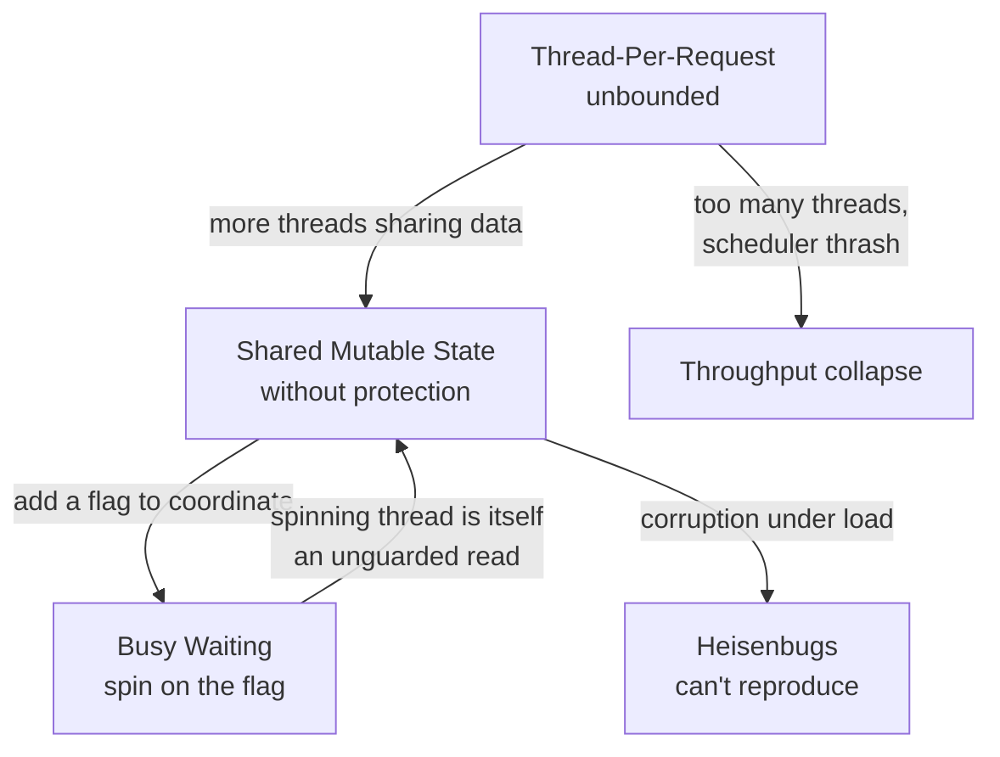

# Shared State Anti-Patterns — Junior Level

> **Category:** [Concurrency Anti-Patterns](../README.md) → **Shared State** — *mutable data crosses threads without protection, or with the wrong protection.*
> **Covers (collectively):** Shared Mutable State Without Protection · Busy Waiting / Spin Loop · Thread-Per-Request Without Bounds

---

## Table of Contents

1. [Introduction](#introduction)
2. [Prerequisites](#prerequisites)
3. [Glossary](#glossary)
4. [The Three at a Glance](#the-three-at-a-glance)
5. [Shared Mutable State Without Protection](#shared-mutable-state-without-protection)
6. [Busy Waiting / Spin Loop](#busy-waiting--spin-loop)
7. [Thread-Per-Request Without Bounds](#thread-per-request-without-bounds)
8. [How They Reinforce Each Other](#how-they-reinforce-each-other)
9. [A Quick Spotting Checklist](#a-quick-spotting-checklist)
10. [Common Mistakes](#common-mistakes)
11. [Test Yourself](#test-yourself)
12. [Cheat Sheet](#cheat-sheet)
13. [Summary](#summary)
14. [Further Reading](#further-reading)
15. [Related Topics](#related-topics)

---

## Introduction

> Focus: **What does it look like?** and **Why is it bad?** — plus the one basic fix you should reach for.

The first time you write concurrent code — two goroutines, two threads, a pool of workers — you discover a new kind of bug. It isn't a typo. The code reads correctly. It compiles. It passes your tests. It runs ten thousand times in a row on your laptop. Then, once, in production, under load, it returns the wrong number, or hangs forever, or the whole process is killed for using too much memory.

That gap between *"it works"* and *"it is correct"* is the entire subject of concurrency anti-patterns. This file covers the three that show up earliest, all rooted in how threads share data:

- **Shared Mutable State Without Protection** — two threads read and write the same variable with no lock or channel. The result is *sometimes* right.
- **Busy Waiting / Spin Loop** — one thread burns a whole CPU core in a tight loop, asking "are you done yet?" millions of times a second.
- **Thread-Per-Request Without Bounds** — you start a brand-new thread (or goroutine) for every request, and under load you start a *million* of them.

> **The mindset shift:** in single-threaded code, the order things happen is the order you wrote them. In concurrent code, **there is no single order** — the OS and the runtime interleave your threads however they like, differently every run. A bug that depends on timing won't show up when you go looking for it. So you don't test concurrency in afterward; you *design* it in by controlling how state is shared.

At the junior level your goal is to **recognize these three shapes on sight** and reach for the **one standard fix** each has. You are not expected to design lock-free data structures yet — that's [`senior.md`](senior.md) and [`professional.md`](professional.md).

---

## Prerequisites

- **Required:** You can write a function, a loop, and a conditional in at least one language. Examples here use **Go**, **Java**, and **Python**.
- **Required:** You know roughly what a *thread* is — an independent path of execution that the OS can run at the same time as another. In Go the lightweight version is a **goroutine**; you start one with `go f()`.
- **Helpful:** You've run a program that uses more than one thread and seen output appear in an order you didn't expect.
- **Helpful:** You can run a command in a terminal — Go ships a *race detector* (`go test -race`) that catches the first anti-pattern automatically, and we'll use it.

---

## Glossary

| Term | Definition |
|------|-----------|
| **Data race** | Two or more threads access the same memory location at the same time, at least one of them writes, and there's no synchronization ordering the accesses. The result is undefined — not "the old value or the new value," but genuinely *anything*. |
| **Mutable shared state** | Data that more than one thread can both see *and* change. The combination of "shared" + "mutable" is what makes it dangerous; either one alone is safe. |
| **Condition variable** | A synchronization primitive that lets a thread *sleep* until another thread signals "the thing you're waiting for happened." The cure for busy waiting. (`sync.Cond` in Go, `wait`/`notify` in Java, `threading.Condition` in Python.) |
| **Spin loop** | A loop that repeatedly checks a condition with no pause, consuming CPU the entire time it waits. |
| **Worker pool** | A *fixed* number of long-lived threads that pull tasks from a queue. Bounds concurrency: 1,000 incoming tasks are handled by, say, 8 workers — not 1,000 threads. |
| **Backpressure** | When work arrives faster than it can be processed, the system *slows the producer down* (blocks or rejects) instead of accepting unlimited work and collapsing. A bounded queue gives you backpressure for free. |
| **Semaphore** | A counter that limits how many threads may do something at once. "At most N in flight." A common way to bound concurrency without a full worker pool. |

---

## The Three at a Glance

| Anti-pattern | One-line symptom | The smell you feel | Basic fix |
|---|---|---|---|
| **Shared Mutable State** | Two threads write one variable, no lock | "It gives a different total every run." | Lock, channel, or don't share (copy / immutable) |
| **Busy Waiting** | `while (!done) {}` pins a core | "CPU is at 100% but nothing's happening." | Condition variable / channel / `WaitGroup` |
| **Thread-Per-Request** | `go handle(req)` per request, unbounded | "It dies under load with OOM or thrash." | Bounded worker pool / semaphore |

All three are about **how state and work cross thread boundaries**. The deepest cure, repeated across this whole chapter, is the same: *share less, and protect what you must share.* Read each section for the shape, a runnable example, why it hurts, and the fix.

---

## Shared Mutable State Without Protection

### What it looks like

Two or more threads read **and** write the same variable, and nothing orders those accesses. The classic example is a counter incremented from many goroutines:

```go
// Go — a data race. DO NOT ship this.
package main

import (
	"fmt"
	"sync"
)

func main() {
	counter := 0
	var wg sync.WaitGroup

	for i := 0; i < 1000; i++ {
		wg.Add(1)
		go func() {
			defer wg.Done()
			counter++ // read counter, add 1, write counter — NOT atomic
		}()
	}

	wg.Wait()
	fmt.Println(counter) // expect 1000... you'll often get 987, 994, 1000, 991...
}
```

`counter++` looks like one step, but it's three: **read** the current value, **add** one, **write** it back. Two goroutines can both read `41`, both compute `42`, and both write `42` — one increment is silently lost. The Go race detector pinpoints it:

```bash
$ go run -race main.go
==================
WARNING: DATA RACE
Write at 0x00c0000a4010 by goroutine 8:
  main.main.func1()
Previous write at 0x00c0000a4010 by goroutine 7:
  main.main.func1()
==================
```

The same bug in Java:

```java
// Java — two threads, one unguarded int field
class Counter {
    int value = 0;          // not volatile, not synchronized, not atomic
    void inc() { value++; } // read-modify-write — same three-step race
}
```

And in Python — *even with the GIL.* People wrongly believe the GIL makes Python thread-safe. It serializes bytecode, but `count += 1` compiles to multiple bytecodes, and the interpreter can switch threads between them:

```python
# Python — the GIL does NOT save you here
import threading

count = 0
def work():
    global count
    for _ in range(100_000):
        count += 1          # LOAD, ADD, STORE — interruptible between steps

threads = [threading.Thread(target=work) for _ in range(4)]
for t in threads: t.start()
for t in threads: t.join()
print(count)                # expect 400000; you'll get less, e.g. 312874
```

### Why it's bad

- **It's correct *most* of the time.** That's the trap. The bug appears only when the unlucky interleaving happens, which is rare on a quiet laptop and common under production load. You can't reproduce it on demand, so you can't debug it the normal way.
- **The corruption is silent.** No exception, no crash — just a wrong number, a half-written struct, a map in an inconsistent state. The damage surfaces far away from the cause.
- **It gets worse with success.** More users → more threads → more interleavings → the rare bug becomes frequent exactly when it costs the most.

### The junior-level fix

You have three options, in order of preference: **don't share**, **share immutably**, or **protect with a lock/channel**.

**Option 1 — Don't share (Go: channels; pass values, don't pass pointers to shared state).** Each goroutine sends its result; one goroutine owns the total. *"Don't communicate by sharing memory; share memory by communicating."*

```go
// Go — no shared variable at all. Each goroutine sends; main sums.
func main() {
	results := make(chan int, 1000)
	for i := 0; i < 1000; i++ {
		go func() { results <- 1 }()
	}
	total := 0
	for i := 0; i < 1000; i++ {
		total += <-results // only main touches total — single owner, no race
	}
	fmt.Println(total) // always 1000
}
```

**Option 2 — Protect the shared variable with a lock.** When sharing is genuinely simpler, guard every access — read *and* write — with the same mutex.

```go
// Go — a mutex makes read-modify-write atomic as a unit.
var (
	mu      sync.Mutex
	counter int
)
// inside the goroutine:
mu.Lock()
counter++
mu.Unlock()
```

```java
// Java — synchronized makes inc() atomic; or use AtomicInteger.
class Counter {
    private final java.util.concurrent.atomic.AtomicInteger value =
        new java.util.concurrent.atomic.AtomicInteger();
    void inc() { value.incrementAndGet(); } // one atomic operation
}
```

```python
# Python — a Lock around the compound operation.
import threading
lock = threading.Lock()
count = 0
def work():
    global count
    for _ in range(100_000):
        with lock:          # only one thread in here at a time
            count += 1
```

**Option 3 — Make it immutable.** If the data never changes after creation, it can be shared freely — there's no write to race against. Build a new value instead of mutating the old one. (See [Clean Code → Immutability](../../../clean-code/14-immutability/README.md).)

> **Smell test:** point at a variable and ask *"can two threads touch this at the same time, and does at least one of them write?"* If yes, and there's no lock or channel guarding it, you have a data race. In Go, settle the argument with `go test -race` — if it warns, it's a race, full stop.

---

## Busy Waiting / Spin Loop

### What it looks like

One thread needs to wait for another to finish something. Instead of *sleeping until notified*, it loops as fast as the CPU allows, re-checking a flag:

```go
// Go — busy waiting: this loop runs millions of times a second doing nothing.
var done bool

func worker() {
	time.Sleep(2 * time.Second) // simulate real work
	done = true                 // (also a data race on `done` — bonus bug!)
}

func main() {
	go worker()
	for !done {                 // SPIN — burns a full CPU core for 2 seconds
		// nothing
	}
	fmt.Println("finished")
}
```

The same in Java and Python:

```java
// Java
while (!done) { }          // 100% CPU on one core, accomplishing nothing
```

```python
# Python
while not done:            # spins, and fights every other thread for the GIL
    pass
```

You'll spot it in a monitoring graph: one core pinned at 100% while the program appears idle. A laptop fan roaring during a "wait" is the audible version.

### Why it's bad

- **It wastes an entire CPU core** doing nothing but asking "yet? yet? yet?" millions of times. On a laptop that's heat and dead battery; on a paid cloud instance that's money burned and a core stolen from real work.
- **In Python it's actively harmful:** the spinning thread keeps grabbing the GIL, starving the worker thread that's trying to *set* the flag — so it can make the wait *longer*.
- **It usually hides a data race too** (the flag itself is unprotected shared state — the first anti-pattern), so without a memory barrier the spinning thread may never even see the updated value.

### The junior-level fix

Wait on an **event**, not in a loop. Sleep until you're woken. The right tool depends on the language:

**Go — a channel (the idiomatic wait).** Receiving from a channel blocks the goroutine for free until something is sent or it's closed; the runtime parks it, using zero CPU.

```go
// Go — block on a channel; no spinning, no race.
func main() {
	done := make(chan struct{})
	go func() {
		time.Sleep(2 * time.Second)
		close(done) // signal: receivers wake up
	}()
	<-done          // parked, 0% CPU, until close
	fmt.Println("finished")
}
```

**Go — `sync.WaitGroup` when you're waiting for N goroutines to finish.**

```go
var wg sync.WaitGroup
wg.Add(1)
go func() { defer wg.Done(); doWork() }()
wg.Wait() // sleeps until the counter hits zero
```

**Java — `wait`/`notify` (a condition variable) or higher-level primitives.**

```java
// Java — the waiting thread sleeps; the worker wakes it with notify.
synchronized (lock) {
    while (!done) {          // guard against spurious wakeups
        lock.wait();         // releases the lock and sleeps — 0% CPU
    }
}
// worker side:
synchronized (lock) { done = true; lock.notifyAll(); }
```

**Python — `threading.Event` or `threading.Condition`.**

```python
import threading
done = threading.Event()
# worker: done.set()
done.wait()   # blocks (no CPU) until set
```

> **Smell test:** any loop whose body is empty or only re-reads a flag — `while (!flag) {}`, `for !done {}`, `while not ready: pass` — is busy waiting. The fix is always *"how do I get woken up instead of asking repeatedly?"*: a channel, a `WaitGroup`, a condition variable, or an `Event`.

---

## Thread-Per-Request Without Bounds

### What it looks like

A server gets a request and starts a fresh thread (or goroutine) to handle it — one per request, with no limit:

```go
// Go — unbounded goroutines. Fine at 10 req/s; fatal at 100,000.
func serve(listener net.Listener) {
	for {
		conn, _ := listener.Accept()
		go handle(conn) // a NEW goroutine for EVERY connection, forever
	}
}
```

```java
// Java — a brand-new OS thread per request: even worse (threads are heavy)
while (true) {
    Socket s = serverSocket.accept();
    new Thread(() -> handle(s)).start(); // ~1 MB stack each; thousands = OOM
}
```

It looks clean and works perfectly in testing, where requests trickle in. The bug is invisible until the day traffic spikes.

### Why it's bad

- **Memory exhaustion.** Each Java thread reserves on the order of a megabyte of stack; ten thousand requests can mean gigabytes, then `OutOfMemoryError`. Goroutines start small (a few KB) but a *sudden* burst of hundreds of thousands still piles up memory faster than work completes.
- **Scheduler thrash.** With far more runnable threads than CPU cores, the OS spends its time *switching between* threads (context switching) instead of running them. Throughput collapses — adding more concurrency makes the system slower.
- **No backpressure.** Accepting unlimited work means that when you're overloaded, you don't slow down — you fall over. A bounded pool would instead make new work *wait*, keeping the system alive and responsive for the work already in flight.

### The junior-level fix

Cap concurrency. Use a **fixed worker pool** (a set number of long-lived workers draining a queue) or a **semaphore** (at most N in flight). The number of requests can be unlimited; the number of *simultaneous workers* must not be.

**Go — a worker pool: start N workers, feed them through a channel.**

```go
// Go — exactly `workers` goroutines, no matter how many jobs arrive.
func runPool(jobs <-chan Conn, workers int) {
	var wg sync.WaitGroup
	for i := 0; i < workers; i++ {
		wg.Add(1)
		go func() {
			defer wg.Done()
			for conn := range jobs { // pull work until the channel closes
				handle(conn)
			}
		}()
	}
	wg.Wait()
}
// The accept loop sends to `jobs`; a buffered channel gives you backpressure:
// when full, Accept-side sends block, slowing intake instead of exploding.
```

**Go — a semaphore when you want to keep the per-request goroutine but cap how many run at once.**

```go
sem := make(chan struct{}, 100) // at most 100 concurrent handlers
for {
	conn, _ := listener.Accept()
	sem <- struct{}{}            // blocks once 100 are in flight (backpressure)
	go func(c net.Conn) {
		defer func() { <-sem }()
		handle(c)
	}(conn)
}
```

**Java — a fixed thread pool via `ExecutorService` (never `new Thread()` per request).**

```java
// Java — 16 threads handle any number of submitted tasks.
ExecutorService pool = Executors.newFixedThreadPool(16);
while (true) {
    Socket s = serverSocket.accept();
    pool.submit(() -> handle(s)); // queued if all 16 are busy
}
// On shutdown: pool.shutdown();
```

**Python — `concurrent.futures` for the same bounded pool.**

```python
from concurrent.futures import ThreadPoolExecutor
with ThreadPoolExecutor(max_workers=16) as pool:
    for conn in accept_loop():
        pool.submit(handle, conn)   # capped at 16 in flight
```

> **Smell test:** see `go someHandler(...)`, `new Thread(...).start()`, or `Thread(target=...).start()` *inside a loop with no limit*? Ask: *"what stops this from creating a million of them?"* If the answer is "nothing," you have unbounded thread-per-request. The fix is a fixed pool or a semaphore.

---

## How They Reinforce Each Other

These three rarely appear alone — solving one carelessly can summon the others:



- **Thread-Per-Request** multiplies the number of threads, which multiplies the chances any **Shared Mutable State** gets touched concurrently — turning a rare race into a frequent one.
- A naive attempt to coordinate shared state introduces a **flag**, and waiting on that flag in a tight loop is **Busy Waiting**.
- The busy-waiting loop *itself* reads an unprotected flag, so it's **another data race** — the patterns feed each other.

The practical lesson, repeated across this whole chapter: **the root cause is shared mutable state.** Bound your concurrency, share as little as possible, and protect (or eliminate) what's left.

---

## A Quick Spotting Checklist

Run this over any concurrent code you touch this week:

- [ ] Is there a variable two threads can both *write* (or one writes while another reads) with no lock or channel guarding it? → **Shared Mutable State**
- [ ] In Go, does `go test -race` print a warning? → **confirmed data race**
- [ ] Is there a loop whose body just re-checks a flag (`while (!done) {}`)? → **Busy Waiting**
- [ ] Is one CPU core pinned at 100% while the program seems to be "waiting"? → **Busy Waiting**
- [ ] Is there a `go f()` / `new Thread().start()` / `Thread().start()` inside a request loop with no cap? → **Thread-Per-Request Without Bounds**
- [ ] If traffic suddenly 100×'d, is there *anything* that limits how many threads exist at once? If no → **Thread-Per-Request**

Any checked box is a concurrency bug waiting for production load to expose it.

---

## Common Mistakes

Mistakes juniors make *about* these anti-patterns:

1. **"It passed my tests, so it's thread-safe."** Concurrency bugs are timing-dependent; a passing test means *that interleaving* worked once. Run Go's `-race` flag, run the test 1,000 times, run it under load — absence of a crash is not proof of correctness.
2. **Believing Python's GIL makes you safe.** The GIL prevents two bytecodes running at once; it does *not* make `count += 1` (multiple bytecodes) atomic. Compound operations still race. Use a `Lock`.
3. **Adding `volatile` (Java) or thinking a flag "fixes" the race.** `volatile` guarantees visibility of a single read/write — it does *not* make read-modify-write (`count++`) atomic. You need a lock or an atomic type. (More in the sibling [Synchronization Misuse](../01-synchronization/junior.md).)
4. **"Fixing" busy waiting with `sleep(100ms)` in the loop.** Sleeping reduces the CPU burn but adds latency and is still polling. Use a real wait primitive (channel / condition variable / `Event`) that wakes on the event itself.
5. **Setting the worker pool to a huge number** like 10,000 "to be safe." That's thread-per-request with extra steps. Size pools to your cores and your workload (a few to a few dozen for CPU work; more is reasonable for I/O-bound work — measure).
6. **Locking everything "just in case."** Over-locking serializes your program (it becomes effectively single-threaded) and risks deadlock. Protect the *shared* state, not every line. The deeper fix is often to *not share* — pass copies, use channels, prefer immutability.

---

## Test Yourself

1. Name the three Shared-State anti-patterns and give the one-line symptom of each.
2. Why is `counter++` from multiple threads unsafe even though it's "one line"? What are the three real steps?
3. Does Python's GIL make `count += 1` thread-safe across threads? Explain.
4. This Go loop pins a CPU core. What's the idiomatic fix, and why is it better?
   ```go
   for !done {
       // wait for the worker
   }
   ```
5. A server does `go handle(conn)` for every connection and works fine in testing. Describe two distinct ways it can fail under a traffic spike, and the one-word category of the fix.

<details>
<summary>Answers</summary>

1. **Shared Mutable State Without Protection** (two threads write one variable, no lock — wrong results sometimes), **Busy Waiting / Spin Loop** (a loop re-checks a flag, pinning a CPU core), **Thread-Per-Request Without Bounds** (a new thread/goroutine per request, unlimited — dies under load).
2. `counter++` is **read** the current value, **add** one, **write** it back. Two threads can both read `41`, both compute `42`, both write `42` — one increment is lost. The three steps are not atomic, so they can interleave. Fix with a lock, an atomic type, or a channel.
3. **No.** The GIL serializes *bytecode*, but `count += 1` compiles to several bytecodes (load, add, store) and the interpreter can switch threads between them, so increments are lost. Use a `threading.Lock`.
4. Block on a channel: `done := make(chan struct{})`, then `<-done`, and the worker calls `close(done)`. It's better because the runtime *parks* the goroutine — 0% CPU until the signal — instead of burning a core polling, and it also avoids the data race on the `done` flag.
5. (a) **Memory exhaustion** — too many threads/goroutines pile up faster than they finish, eventually OOM. (b) **Scheduler thrash** — far more runnable threads than cores means the OS spends its time context-switching, so throughput collapses. The fix category: **bounded** (a fixed worker pool or a semaphore).

</details>

---

## Cheat Sheet

| Anti-pattern | Spot it by | Basic fix |
|---|---|---|
| **Shared Mutable State** | Unguarded variable two threads write; `go test -race` warns | Channel (don't share) · mutex/atomic (protect) · immutability |
| **Busy Waiting** | Empty loop re-checking a flag; one core at 100% while "idle" | Channel · `WaitGroup` · condition variable (`wait`/`notify`) · `Event` |
| **Thread-Per-Request** | `go f()` / `new Thread().start()` in an unbounded loop | Fixed worker pool · semaphore (`ExecutorService`, `ThreadPoolExecutor`) |

> **One rule to remember:** *Share less; protect what you must share; bound how much runs at once.* Every concurrency bug in this file is a violation of one of those three.

---

## Summary

- **Shared-state anti-patterns** are the concurrency bugs you hit first, and they share one root: **mutable data crossing thread boundaries** without the right protection.
- **Shared Mutable State Without Protection** corrupts data silently and *works most of the time*, which is exactly why it's dangerous. Fix it by not sharing (channels / copies), making it immutable, or guarding every access with a lock or atomic.
- **Busy Waiting** burns a whole CPU core polling a flag. Fix it by waiting on an *event* — a channel, `WaitGroup`, condition variable, or `Event` — so the runtime can sleep your thread until it's needed.
- **Thread-Per-Request Without Bounds** works in testing and collapses under load via OOM or scheduler thrash. Fix it with a *bounded* worker pool or a semaphore, which also gives you backpressure.
- At the junior level your job is to **recognize each shape** and reach for the **standard fix** — and in Go, to make `go test -race` part of how you write concurrent code.
- They reinforce each other, with shared mutable state at the center. Next: [`middle.md`](middle.md) — *how to detect these reliably and choose the right primitive under real load.*

---

## Further Reading

- **Java Concurrency in Practice** — Brian Goetz et al. (2006) — the canonical text on data races, visibility, and thread pools (Java-flavored but universal).
- **The Go Memory Model** — [go.dev/ref/mem](https://go.dev/ref/mem) — what "happens before" actually guarantees; required reading before using `sync` or channels.
- **The Go Blog: "Share Memory By Communicating"** — [go.dev/blog/codelab-share](https://go.dev/blog/codelab-share) — the channels-over-shared-state philosophy.
- **Go Race Detector** — [go.dev/doc/articles/race_detector](https://go.dev/doc/articles/race_detector) — how to run and read `-race`.
- **Python docs — `threading` and `concurrent.futures`** — the GIL, `Lock`, `Event`, `Condition`, and `ThreadPoolExecutor`.

---

## Related Topics

- [Synchronization Misuse](../01-synchronization/junior.md) — the sibling category: locks and memory primitives applied wrongly (`volatile`, double-checked locking).
- [Coordination](../02-coordination/junior.md) — the sibling category: deadlocks and lock-ordering, where protecting shared state goes wrong.
- [Clean Code → Concurrency](../../../clean-code/11-concurrency/README.md) — positive principles for writing thread-safe code.
- [Clean Code → Immutability](../../../clean-code/14-immutability/README.md) — the deepest cure: data that can't change can't be raced.
- [Concurrency Anti-Patterns](../README.md) — the chapter overview and all nine patterns.
