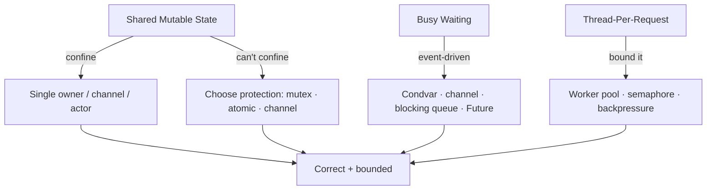

# Shared State Anti-Patterns — Middle Level

> **Category:** [Concurrency Anti-Patterns](../README.md) → **Shared State** — *mutable data crosses threads without protection, or with the wrong protection.*
> **Covers (collectively):** Shared Mutable State Without Protection · Busy Waiting / Spin Loop · Thread-Per-Request Without Bounds

---

## Table of Contents

1. [Introduction](#introduction)
2. [Prerequisites](#prerequisites)
3. [The Real Question: When Does This Creep In?](#the-real-question-when-does-this-creep-in)
4. [Shared Mutable State — Confine, Communicate, or Lock](#shared-mutable-state--confine-communicate-or-lock)
5. [Busy Waiting — Wake on the Event, Don't Poll](#busy-waiting--wake-on-the-event-dont-poll)
6. [Thread-Per-Request — Bound the Concurrency](#thread-per-request--bound-the-concurrency)
7. [Detection: Race Detectors and CPU Profiles](#detection-race-detectors-and-cpu-profiles)
8. [Common Mistakes](#common-mistakes)
9. [Test Yourself](#test-yourself)
10. [Cheat Sheet](#cheat-sheet)
11. [Summary](#summary)
12. [Further Reading](#further-reading)
13. [Related Topics](#related-topics)

---

## Introduction

> Focus: **When does this creep in?** and **What do I do instead?**

At the junior level you learned to *recognize* the three shapes: a variable two threads touch without a lock, a `while (!done) {}` loop that pins a core, and a `go handle(req)` (or `new Thread(...)`) per request that eventually exhausts the machine. None of them looks dangerous in the moment — each is the *shortest path* to making something work on your laptop.

The middle-level skill is **choosing the right coordination primitive instead of the first one that compiles.** That means three decisions, made deliberately:

- **Where does this state live?** The cheapest race is the one that can't happen because only one owner ever touches the data.
- **When state must be shared, what guards it?** Mutex, atomic, or a channel — each fits a different shape of problem, and "share memory by communicating" is often the cleanest answer.
- **How much parallelism do I actually want?** Unbounded concurrency is a resource leak with a delay timer; bounded pools and backpressure turn an OOM into a queue.

Every one of these has a **trap** — the over-correction that looks safe and isn't. This file names the forces, the countermoves, and the traps.

---

## Prerequisites

- **Required:** Comfortable with [`junior.md`](junior.md) — you can spot an unguarded shared variable, a spin loop, and an unbounded thread spawn.
- **Required:** You've shipped concurrent code — used a mutex, started a goroutine or thread, or consumed a thread pool.
- **Helpful:** Basic memory-model awareness: writes by one thread aren't automatically visible to another. See the sibling [Synchronization Misuse](../01-synchronization/middle.md).
- **Helpful:** Familiarity with your language's race detector (`go test -race`, Java's `-Xlint`/ThreadSanitizer, Python's GIL semantics).
- **Helpful:** Awareness of [immutability](../../../clean-code/14-immutability/README.md) as a design tool.

---

## The Real Question: When Does This Creep In?

These anti-patterns have predictable triggers. Name the moment and you can intervene before it ships:

| Trigger | What happens | Which anti-pattern |
|---|---|---|
| **"Just make it a package-level var / field"** | Two goroutines/threads now read-modify-write the same memory | Shared Mutable State |
| **"I'll add the lock later"** | The unguarded write ships; works 99.9% of runs, corrupts the rest | Shared Mutable State |
| **"I need to wait until the worker sets `ready`"** | `for !ready {}` — a poll loop that burns a core | Busy Waiting |
| **"Polling every iteration is simplest"** | Tight loop with no sleep, no blocking primitive | Busy Waiting |
| **"One goroutine/thread per connection is the obvious design"** | Spawn count tracks load; a traffic spike exhausts memory or the scheduler | Thread-Per-Request Unbounded |
| **"The queue is just a slice/list, it'll be fine"** | Unbounded queue absorbs the spike — into OOM | Thread-Per-Request Unbounded |

The common thread: **the cheap local move (share a var, poll a flag, spawn a thread) pushes the cost to a place you can't see — another core, another thread, or the heap under load.** The middle engineer pays the small structural cost up front.



---

## Shared Mutable State — Confine, Communicate, or Lock

### How it creeps in

A counter, a cache, a map of sessions — born single-threaded, then a second worker is added "to speed things up." The data is now shared, but the *change* that made it shared touched the spawn site, not the data, so nobody updated the access discipline. Reads and writes interleave; on most runs the timing is benign, and the bug hides until production load reorders the instructions.

```go
// Go — DATA RACE: two goroutines read-modify-write `count` with no synchronization.
var count int
func worker() { for i := 0; i < 1000; i++ { count++ } } // count++ is read, add, write
// launch 10 workers → final count is < 10000, nondeterministically
```

`count++` is three operations. Two goroutines can both read `41`, both write `42`, and one increment vanishes. This is not a probability you can tune away — it's *undefined behavior*; the compiler is allowed to assume no race exists.

### What to do instead — the ladder of cures

Climb from cheapest-and-safest to most-flexible. Stop at the first rung that fits.

**Rung 1 — Confine the state to one owner.** A race needs *two* accessors. Give the data a single owner and the race is structurally impossible. In Go this is the literal advice "**share memory by communicating**": don't share the variable, hand ownership over a channel.

```go
// Go — one goroutine owns `count`; others send deltas. No lock, no race.
func counter(deltas <-chan int, result chan<- int) {
    count := 0
    for d := range deltas { count += d } // sole owner of count
    result <- count
}
// workers send `deltas <- 1`; close(deltas) when done; read total from result.
```

**Rung 2 — Make the state immutable.** Data that never changes can be shared freely — there's nothing to race. Replace in-place mutation with "produce a new value." For read-heavy state, **copy-on-write** lets readers go lock-free while writers swap a fresh snapshot atomically.

```go
// Go — copy-on-write config: readers never lock; writer publishes a new pointer.
type Config struct{ /* ...immutable fields... */ }
var cfg atomic.Pointer[Config]            // atomic publication of the snapshot

func Get() *Config { return cfg.Load() }   // lock-free read
func Update(next *Config) { cfg.Store(next) } // writer swaps the whole snapshot
```

**Rung 3 — Lock the smallest consistent unit.** When the state must be mutated in place by many, guard it. Pick the primitive to match the operation:

```go
// Go — a single integer counter: atomic is the right tool (no critical section needed).
var count atomic.Int64
func worker() { for i := 0; i < 1000; i++ { count.Add(1) } } // correct, lock-free
```

```java
// Java — compound invariant across two fields: a mutex (synchronized) is required.
// Atomics can't protect "balance and history stay consistent together."
class Account {
    private long balance;
    private final List<Long> history = new ArrayList<>();
    synchronized void deposit(long amt) {   // both mutations under one lock
        balance += amt;
        history.add(amt);
    }
    synchronized long balance() { return balance; }
}
```

### Choosing the protection: mutex vs atomic vs channel

| Situation | Use | Why |
|---|---|---|
| One scalar (counter, flag, pointer) | **Atomic** | No critical section; lock-free, fastest |
| Multiple fields that must stay consistent together | **Mutex** | Atomics protect *one* word; invariants spanning fields need a critical section |
| Transferring **ownership** of data between workers | **Channel** (Go) / blocking queue (Java) | "Share by communicating" — the receiver owns it, no shared access |
| Read-heavy, rarely written | **Copy-on-write / RWMutex** | Readers don't block each other |

> **Python note:** the **GIL** serializes *bytecode*, so `int` reads/writes won't tear — but it does **not** make `count += 1` atomic (it's still read-add-write across bytecodes and can interleave). You still need `threading.Lock` for compound updates. The GIL also means CPU-bound threads don't run in parallel; reach for `multiprocessing` or native extensions for parallelism, at which point you're back to real shared-memory discipline.

> **Rust note:** the type system refuses to compile a shared mutable value without `Mutex`/`RwLock`/atomics behind `Arc`. Rust closes most of this anti-pattern at compile time — the others must enforce the discipline by hand.

---

## Busy Waiting — Wake on the Event, Don't Poll

### How it creeps in

You need thread B to proceed only after thread A finishes. The fastest thing to type is a loop that re-checks a flag:

```go
// Go — BUSY WAIT: pins a CPU core spinning, and `done` may never be observed
// (no happens-before edge — the write in A might never become visible to B).
var done bool
func waiter() { for !done {} /* spin */; process() }
```

Two bugs in one: it **burns 100% of a core** doing nothing, and without a synchronizing primitive there's **no memory barrier**, so the flag's update may never be seen — an infinite loop. Junior code "fixes" the CPU burn with `time.Sleep(10 * time.Millisecond)` inside the loop, trading a hot spin for added latency and *still* polling.

### What to do instead — block on the event

Replace the poll with a primitive that **parks the thread** and the scheduler wakes it when the event fires. Pick by shape:

```go
// Go — channel close is the idiomatic "signal once, fan-out to all waiters."
done := make(chan struct{})
go func() { work(); close(done) }() // signal
<-done                              // blocks, zero CPU, with happens-before guarantee
process()
```

```go
// Go — WaitGroup when you wait for N workers to finish.
var wg sync.WaitGroup
for i := 0; i < n; i++ { wg.Add(1); go func() { defer wg.Done(); task() }() }
wg.Wait() // parks until all Done; no polling
```

```java
// Java — condition variable: wait() releases the lock and sleeps until signalled.
// ALWAYS guard with a while-loop predicate (spurious wakeups + lost-wakeup safety).
synchronized (lock) {
    while (!ready) { lock.wait(); }  // parks; re-checks predicate on wake
    consume();
}
// producer: synchronized (lock) { ready = true; lock.notifyAll(); }
```

| You're waiting for… | Use (Go) | Use (Java) |
|---|---|---|
| A one-shot signal, fan-out to many | `close(chan struct{})` | `CountDownLatch` |
| N workers to finish | `sync.WaitGroup` | `CountDownLatch` / `join()` |
| An item to be produced | receive on channel | `BlockingQueue.take()` |
| A condition over shared state | channel + select | `Condition.await()` in a `while` loop |
| A result of an async computation | channel / `errgroup` | `Future` / `CompletableFuture` |

### The TRAP: a bounded spin is *sometimes* right

Don't over-correct into "blocking primitives everywhere." When the wait is expected to be **nanoseconds to a few microseconds**, parking and waking the thread (a syscall + context switch) costs *more* than spinning. Lock-free libraries, mutex fast paths, and ring buffers deliberately spin briefly before blocking. The legitimate forms:

```go
// Go — yield to the scheduler instead of hot-spinning, when a brief wait is expected.
for !ready() {
    runtime.Gosched() // let other goroutines run; not a syscall, not a sleep
}
```

```go
// Go — bounded exponential backoff: spin a little, then escalate to sleeping.
for delay := time.Microsecond; !tryAcquire(); {
    if delay < time.Millisecond { time.Sleep(delay); delay *= 2 } else { time.Sleep(delay) }
}
```

The line between anti-pattern and optimization: a spin is acceptable only if it is **bounded** (it escalates to blocking or returns), the expected wait is **shorter than a context switch**, and you've **measured** that spinning wins. An *unbounded* spin on an event another thread controls is always the anti-pattern.

---

## Thread-Per-Request — Bound the Concurrency

### How it creeps in

The model "one request, one thread/goroutine" is intuitive and reads cleanly. It works in dev and in light traffic. The failure is **load-triggered**: spawn count tracks arrival rate, and a spike spawns faster than work completes. Goroutines are cheap (~2 KB stack) but not free; OS threads are expensive (~1 MB). Either way, unbounded spawning turns a traffic spike into scheduler thrash or an OOM kill.

```go
// Go — UNBOUNDED: a slow downstream + a traffic burst = millions of goroutines, OOM.
for req := range incoming {
    go handle(req) // no limit; nothing applies backpressure to `incoming`
}
```

```java
// Java — UNBOUNDED: a fresh OS thread per request; ~1 MB stack each → OutOfMemoryError.
while (true) {
    Socket s = serverSocket.accept();
    new Thread(() -> handle(s)).start();
}
```

### What to do instead — cap the parallelism

**Pattern A — Worker pool (fixed set of workers draining a queue).** Decouple arrival rate from processing rate; concurrency is capped at the worker count.

```go
// Go — bounded worker pool. N goroutines, one BOUNDED job channel = backpressure.
jobs := make(chan Request, 100) // bounded buffer; a full channel blocks producers
var wg sync.WaitGroup
for i := 0; i < runtime.NumCPU(); i++ { // size to the resource, not to load
    wg.Add(1)
    go func() { defer wg.Done(); for r := range jobs { handle(r) } }()
}
for req := range incoming { jobs <- req } // blocks when full → natural backpressure
close(jobs); wg.Wait()
```

```java
// Java — a bounded pool with a bounded queue and an explicit rejection policy.
// Never Executors.newCachedThreadPool() for untrusted load — it's unbounded.
ExecutorService pool = new ThreadPoolExecutor(
    8, 8, 0L, TimeUnit.MILLISECONDS,
    new ArrayBlockingQueue<>(100),                 // BOUNDED queue
    new ThreadPoolExecutor.CallerRunsPolicy());    // backpressure: caller runs it
pool.submit(() -> handle(req));
```

**Pattern B — Semaphore (limit in-flight work, keep the per-request structure).** When you like the readability of one-goroutine-per-request, cap how many run at once.

```go
// Go — semaphore via a buffered channel: at most `limit` handlers run concurrently.
sem := make(chan struct{}, 64) // the limit
for req := range incoming {
    sem <- struct{}{}                 // acquire; blocks once 64 are in flight
    go func(r Request) { defer func() { <-sem }(); handle(r) }(req)
}
```

### The TRAP: pool sizing and unbounded queues

Two ways to "fix" Thread-Per-Request that recreate the problem:

1. **An unbounded queue in front of a bounded pool.** The pool caps *threads*, but if the queue is unbounded (`LinkedBlockingQueue` with no capacity, or `jobs := make(chan T)` fed without a limit), the queue absorbs the spike straight into OOM. **The queue must be bounded too**, and you must decide what happens when it's full: block the producer (backpressure), drop, or run-on-caller. Backpressure that propagates to the *source* (slowing accepts, returning `503`) is the only thing that actually protects the box.

2. **Wrong pool size.** Too small starves throughput; too large reintroduces contention and the very exhaustion you were avoiding. Rough starting points: **CPU-bound** work → `numCPU` (or `+1`); **I/O-bound** work → higher, governed by Little's Law (`threads ≈ targetThroughput × avgLatency`) and capped by the downstream's own limits (DB connection pool, upstream rate limit). **Measure, then tune** — a pool sized larger than your database's connection pool just moves the queue.

> **Python note:** for I/O-bound work, `concurrent.futures.ThreadPoolExecutor(max_workers=N)` bounds concurrency despite the GIL (threads block on I/O, releasing the GIL). For CPU-bound work the GIL serializes threads — use `ProcessPoolExecutor` with a bounded `max_workers`, or `asyncio` with a `Semaphore` for I/O fan-out.

---

## Detection: Race Detectors and CPU Profiles

You cannot reliably reproduce these with an ordinary unit test — the timing window is too narrow. Use tooling that *forces* the bug to the surface.

### Race detectors (Shared Mutable State)

```bash
# Go — instrument every memory access; reports the two conflicting accesses + stacks.
go test -race ./...
go run -race ./cmd/server   # also works on a running binary under load
```

The Go race detector catches a race only if the racy access *actually executes* during the run, so run it against realistic load and your full test suite — but a single report is proof of a real bug. For **Java**, run under **ThreadSanitizer** (via the JVM TSan support) or use static/dynamic tools like SpotBugs' multithreading detectors and `jcstress` for memory-model stress testing. **Rust** needs none for the common cases — the borrow checker rejects the code.

> Treat `-race` as a CI gate on concurrent packages. It has ~5–10× runtime overhead, so it's a CI/staging tool, not a production default.

### CPU profiles (Busy Waiting)

A spin loop has an unmistakable signature: **a core pinned at ~100% while doing no useful work**. Find it by sampling where CPU time goes.

```bash
# Go — pprof CPU profile; the spinning function dominates the flame graph.
go test -cpuprofile cpu.out -bench .
go tool pprof -http=: cpu.out      # the hot loop sits at the top of the graph
```

```bash
# Any language on Linux — sample a live process; a busy loop shows one frame eating CPU.
perf top -p <pid>                  # or: py-spy top / async-profiler for the JVM
```

If `top` shows a process at 100% CPU but throughput is flat, suspect a spin loop or a lock convoy. A profile that attributes nearly all samples to one tight predicate-check confirms it.

### Resource metrics (Thread-Per-Request)

Watch **goroutine/thread count** and **memory** under load. A line that climbs with traffic and never plateaus is unbounded spawning. In Go, `runtime.NumGoroutine()` (or `pprof`'s goroutine profile) trending up without bound is the tell; on the JVM, a thread count tracking request rate is the same signal.

```bash
go tool pprof http://localhost:6060/debug/pprof/goroutine   # snapshot of all goroutines
```

---

## Common Mistakes

1. **Reaching for a mutex when a channel (or confinement) is cleaner.** If the real operation is "hand this data to whoever processes it next," a channel transfers *ownership* and eliminates the shared access entirely. Locking shared state is the fallback, not the default.
2. **Using an atomic where you need a mutex.** Atomics protect a *single* word. The moment two fields must stay consistent together (balance + history, head + tail), an atomic per field has a race *between* them. Use a lock.
3. **"Fixing" a spin loop with `Sleep` inside it.** That's still polling — it trades CPU burn for latency and a magic constant. Block on the actual event instead.
4. **`wait()` without a `while`-loop predicate.** Spurious wakeups are real, and a notified condition can change before you reacquire the lock. Always re-check the predicate in a loop, never an `if`.
5. **Bounding the pool but not the queue.** A bounded pool with an unbounded queue still OOMs under spike. Bound both, and define the full-queue policy (block / drop / caller-runs).
6. **Sizing a pool larger than the downstream can serve.** A 200-thread pool in front of a 20-connection database just moves the queue and adds contention. Size to the *bottleneck resource*.
7. **Trusting "it passed once" over `-race`.** Concurrency bugs are nondeterministic; one green run proves nothing. A race detector or stress harness is the evidence.
8. **Over-correcting away every spin.** A bounded backoff or a `runtime.Gosched()` on a sub-microsecond wait can be correct and faster than blocking. The anti-pattern is the *unbounded* spin, not all spinning.

---

## Test Yourself

1. Ten goroutines run `count++` on a shared `int`. The total is wrong and varies per run. Give two structurally different fixes — one that removes the sharing and one that keeps it.
2. You need to protect `balance` and a `history` list so they always update together. Why is "make each an atomic" wrong, and what's the right primitive?
3. A code reviewer sees `for !ready {}`. Name the *two* distinct bugs in that line.
4. When is a spin loop (or `runtime.Gosched`) the *correct* choice rather than the anti-pattern?
5. A service does `go handle(req)` per request and OOMs under a traffic spike. You add a worker pool but it still OOMs occasionally. What did you most likely forget?
6. How would you size a worker pool for (a) CPU-bound work and (b) I/O-bound work hitting a database with a 20-connection pool?
7. Your monitoring shows one core at 100% CPU but request throughput is flat. What anti-pattern do you suspect, and which tool confirms it?

<details>
<summary>Answers</summary>

1. **Remove the sharing:** give `count` a single owner goroutine and have workers send `+1` deltas over a channel (`share by communicating`). **Keep it shared:** use `atomic.Int64.Add(1)` (correct because a counter is a single word) or guard `count++` with a `sync.Mutex`.
2. Two separate atomics can each be updated atomically but a reader (or another writer) can observe `balance` updated and `history` not yet updated — the *invariant spanning the two fields* races. You need a **mutex** so both mutations happen in one critical section.
3. (a) **Busy wait** — it pins a CPU core spinning. (b) **No memory barrier / no happens-before edge** — the write to `ready` in the other thread may never become visible, so the loop can spin forever even after `ready` is "set." Fix with a channel/condvar/WaitGroup.
4. When the expected wait is **shorter than a context switch** (nanoseconds–microseconds), the spin is **bounded** (escalates to blocking or returns), and you've **measured** that spinning beats parking. E.g., a mutex fast path, a lock-free retry loop, or `runtime.Gosched()` to yield briefly.
5. A **bounded queue**. The pool caps concurrent *threads*, but if the job queue (channel buffer / `LinkedBlockingQueue`) is unbounded, the spike pools up in the queue and OOMs. Bound the queue and choose a full-queue policy (block for backpressure, drop, or caller-runs).
6. (a) **CPU-bound:** ~`numCPU` (sometimes `+1`); more just adds context-switch overhead. (b) **I/O-bound to a 20-connection DB:** the pool size is capped by the *downstream* — going above ~20 concurrent DB-touching workers just queues at the connection pool. Size in-flight DB work to ≤ the connection pool (often with a small margin), and apply Little's Law for the target throughput.
7. **Busy waiting / spin loop** (or a lock convoy). Confirm with a **CPU profile** — `go tool pprof`, `perf top`, `py-spy`, or async-profiler — which shows nearly all samples in one tight predicate-checking frame.

</details>

---

## Cheat Sheet

| Anti-pattern | Creeps in when… | Countermove | The trap |
|---|---|---|---|
| **Shared Mutable State** | "Just make it a shared var/field" | Confine to one owner → channel/actor → immutable/COW → mutex/atomic | Atomic where a mutex is needed (multi-field invariant) |
| **Busy Waiting** | "Wait until `ready` is true" | Block on the event: channel close, `WaitGroup`, condvar (`while` predicate), `Future`, blocking queue | A *bounded* spin/backoff/`Gosched` is sometimes faster — measure |
| **Thread-Per-Request** | "One goroutine/thread per request" | Bounded worker pool · semaphore · backpressure to the source | Bounding threads but not the queue → still OOM; wrong pool size |

**Decision shortcuts:**
- *Transferring ownership → channel. One word → atomic. Multi-field invariant → mutex. Read-heavy → COW/RWMutex.*
- *Never poll a flag — block on the event. Bound every queue and every pool. Size to the bottleneck resource, then measure with `-race` and a profiler.*

---

## Summary

- Shared-state anti-patterns are the **fastest path that compiles**: share a var, poll a flag, spawn a thread. Each pushes the cost out of sight — to another core, another thread, or the heap under load.
- **Shared Mutable State:** climb the ladder — *confine* the data to one owner (share by communicating), make it *immutable* (copy-on-write for read-heavy), then *lock* if you must. Match the primitive: atomic for one word, mutex for invariants spanning fields, channel for ownership transfer.
- **Busy Waiting:** replace the poll with a primitive that parks the thread and wakes on the event (channel close, `WaitGroup`, condvar with a `while` predicate, `Future`, blocking queue). The trap: a *bounded* spin or `runtime.Gosched` on a sub-microsecond wait can be correct — the anti-pattern is the *unbounded* spin.
- **Thread-Per-Request:** cap parallelism with a bounded worker pool or semaphore, and make sure the *queue* is bounded too with an explicit full-queue policy, so backpressure reaches the source instead of the heap. Size to the bottleneck resource.
- **Detect** with race detectors (`go test -race`, ThreadSanitizer) for state races, **CPU profiles** (a pinned core, one hot frame) for spin loops, and **resource metrics** (goroutine/thread count climbing with load) for unbounded spawning.
- Next: [`senior.md`](senior.md) — diagnosing these under production load, lock-free trade-offs, and refactoring a contended hot path without a rewrite.

---

## Further Reading

- **Java Concurrency in Practice** — Brian Goetz et al. (2006) — confinement, the right primitive, bounded executors, `Condition`/`wait` discipline (Ch. 3, 8).
- **The Go Memory Model** — [go.dev/ref/mem](https://go.dev/ref/mem) — what establishes happens-before; why an unguarded flag may never be observed.
- **Effective Go — Concurrency** — [go.dev/doc/effective_go#concurrency](https://go.dev/doc/effective_go#concurrency) — "Do not communicate by sharing memory; share memory by communicating."
- **Java™ Tutorials — Concurrency** — Oracle — `BlockingQueue`, `ThreadPoolExecutor`, rejection policies.
- **Programming Rust** — Blandy, Orendorff, Tindall (2nd ed., 2021), "Concurrency" — how the type system closes the data-race anti-pattern at compile time.

---

## Related Topics

- [Coordination Anti-Patterns](../02-coordination/middle.md) — the sibling category; what happens once you *do* take locks (ordering, granularity, holding during I/O).
- [Synchronization Misuse](../01-synchronization/middle.md) — the other sibling; memory ordering, `volatile`/atomic, lazy init done right.
- [Clean Code → Immutability](../../../clean-code/14-immutability/README.md) — designing state that can be shared because it never changes.
- [Async Anti-Patterns](../../04-async/README.md) — the single-threaded event-loop analogues of these problems.
- [Clean Code → Concurrency](../../../clean-code/11-concurrency/README.md) — the positive patterns and primitives behind these countermoves.
