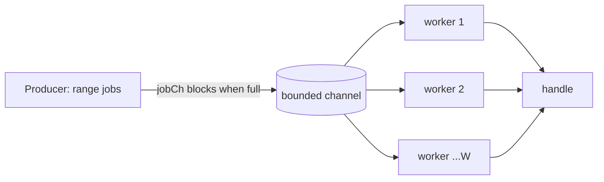
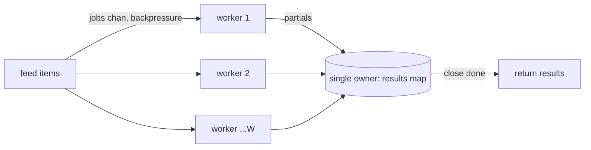

# Shared State Anti-Patterns — Refactoring Practice

> **Category:** [Concurrency Anti-Patterns](../README.md) → **Shared State** — *mutable data crossing threads without the right protection.*
> **Covers (collectively):** Shared Mutable State Without Protection · Busy Waiting / Spin Loop · Thread-Per-Request Without Bounds

---

These are not "spot the race" puzzles — [`find-bug.md`](find-bug.md) does that. Here the code **already runs and usually produces the right answer**, and your job is to make it **correct under concurrency *and* scalable under load without changing what it computes**. The skill on display is the *discipline*, not the destination:

1. **Reproduce the failure with a tool, not with luck.** A race is invisible until you point an instrument at it: Go's `-race` detector, Java's `jcstress`/TSan, a `ThreadSanitizer` build, or a load generator that drives real concurrency. "It passed once" is not evidence.
2. **Fix with the *cheapest correct* primitive.** Confinement < immutability < channel/queue < atomic < mutex < lock-free, roughly in order of how easy they are to reason about. Reach for the simplest one that makes the invariant true.
3. **Verify the fix the same way you reproduced the bug.** Re-run `-race` to green; re-run the load test and watch the metric move (CPU drops, p99 stabilizes, goroutine count plateaus). Then benchmark to confirm you didn't trade a race for a contention cliff.

> **How to use this file:** read the "Before," predict *which tool would catch the bug* and *which primitive you'd reach for* before expanding the solution. The gap between your plan and the worked plan is the learning.

A recurring theme: **the fastest fix is often to stop sharing.** Confinement, value-passing, and immutability remove the data race at the root; locks and atomics only manage a race you chose to keep. The exercises deliberately include cases where keeping a plain mutex (or a small unbounded fan-out) is the *correct, simple* answer — knowing when *not* to reach for the fancy primitive is senior judgment.

---

## Table of Contents

| # | Exercise | Anti-pattern(s) | Lang | Key move |
|---|---|---|---|---|
| 1 | [The lost-update counter](#exercise-1--the-lost-update-counter) | Shared Mutable State | Go | Replace racy `++` with `atomic` |
| 2 | [Map written from many goroutines](#exercise-2--map-written-from-many-goroutines) | Shared Mutable State | Go | Guard with `sync.Mutex` (the simple right answer) |
| 3 | [Confine state to one owner goroutine](#exercise-3--confine-state-to-one-owner-goroutine) | Shared Mutable State | Go | Channel-as-monitor / confinement |
| 4 | [Stop the spin: a `done` flag](#exercise-4--stop-the-spin-a-done-flag) | Busy Waiting | Go | Replace poll-loop with a channel close |
| 5 | [Condition variable, not `sleep(10ms)`](#exercise-5--condition-variable-not-sleep10ms) | Busy Waiting | Java | `wait`/`notifyAll` on a predicate |
| 6 | [Producer/consumer with a blocking queue](#exercise-6--producerconsumer-with-a-blocking-queue) | Busy Waiting + Shared State | Java | `BlockingQueue` replaces poll + lock |
| 7 | [Bound the goroutine-per-request fan-out](#exercise-7--bound-the-goroutine-per-request-fan-out) | Thread-Per-Request | Go | Bounded worker pool + backpressure |
| 8 | [Bound a thread-per-task server](#exercise-8--bound-a-thread-per-task-server) | Thread-Per-Request | Java | Fixed `ThreadPoolExecutor` + bounded queue |
| 9 | [Semaphore-limited concurrency](#exercise-9--semaphore-limited-concurrency) | Thread-Per-Request | Go | `golang.org/x/sync/semaphore` cap |
| 10 | [Kill false sharing with padding](#exercise-10--kill-false-sharing-with-padding) | Shared State (cache line) | Go | Pad to a cache line; `-bench` proof |
| 11 | [Immutable snapshot for readers](#exercise-11--immutable-snapshot-for-readers) | Shared Mutable State | Go | Copy-on-write `atomic.Pointer` |
| 12 | [Channel vs mutex — pick the right one](#exercise-12--channel-vs-mutex--pick-the-right-one) | Shared Mutable State | Go | Trade-off, and a counter-case to KEEP |
| 13 | [The full combo: racy, spinning, unbounded](#exercise-13--the-full-combo-racy-spinning-unbounded) | All three | Go | Whole toolbox, in order |

> **Python note.** The CPython GIL serializes bytecode, so `x += 1` *looks* atomic — but it is **not**: `+=` is `LOAD`/`ADD`/`STORE`, three bytecodes, and a thread switch can land between them, so lost updates happen in pure Python too. The GIL only guarantees that a *single* bytecode is uninterrupted. Use `threading.Lock`, `queue.Queue`, or `concurrent.futures` exactly as you would elsewhere; and for CPU-bound work the GIL means you want `multiprocessing`/a process pool, not threads, regardless of correctness. Go and Java examples below transfer directly.

---

## Exercise 1 — The lost-update counter

**Anti-pattern:** Shared Mutable State Without Protection. **Goal:** make a concurrent counter correct. **Constraints:** same final value as a single-threaded run (`N` increments ⇒ `N`); must pass `-race`.

```go
// Before — N goroutines each do counter++ on a shared int. Racy.
func CountConcurrently(n int) int {
	counter := 0
	var wg sync.WaitGroup
	wg.Add(n)
	for i := 0; i < n; i++ {
		go func() {
			defer wg.Done()
			counter++ // read-modify-write, not atomic
		}()
	}
	wg.Wait()
	return counter // often < n, and varies run to run
}
```

<details>
<summary>Refactored</summary>

**Discipline: reproduce → fix → verify**

1. **Reproduce with the tool.** `counter++` compiles to load/add/store; two goroutines interleave and one increment is lost. Run `go test -race -run TestCount` — the detector reports the write/write conflict at the `counter++` line with both stacks. *Don't* try to reproduce by eye; the race detector is the proof.
2. **Pick the cheapest correct primitive.** The operation is a single independent integer increment — the textbook case for `atomic`, not a mutex. `atomic.Int64.Add` is one lock-free instruction (`LOCK XADD`).
3. **Verify.** `go test -race` is now green; assert `CountConcurrently(100000) == 100000` deterministically across many runs.

```go
// After — atomic increment; lock-free and correct.
func CountConcurrently(n int) int64 {
	var counter atomic.Int64
	var wg sync.WaitGroup
	wg.Add(n)
	for i := 0; i < n; i++ {
		go func() {
			defer wg.Done()
			counter.Add(1)
		}()
	}
	wg.Wait()
	return counter.Load()
}
```

**Why atomic over a mutex here.** The protected region is a single arithmetic op with no invariant spanning multiple fields — exactly the niche `atomic` exists for. A `sync.Mutex` would also be correct but adds lock/unlock overhead and a contention point for zero benefit. **Verify:** `go test -race -count=20` green; `go test -bench=Count` to confirm throughput.

> **The trap:** `atomic` only protects *one* word. The moment you have *two* fields that must stay consistent with each other, atomics are not enough — that's Exercise 2.

</details>

---

## Exercise 2 — Map written from many goroutines

**Anti-pattern:** Shared Mutable State Without Protection. **Goal:** make a concurrent word-frequency aggregator correct. **Constraints:** same counts as a serial run; must pass `-race`. This is the **counter-case where a plain mutex is the right, simple answer** — keep it.

```go
// Before — concurrent writes to a map. Go maps are NOT safe for concurrent write.
func WordCounts(docs [][]string) map[string]int {
	counts := map[string]int{}
	var wg sync.WaitGroup
	for _, doc := range docs {
		wg.Add(1)
		go func(d []string) {
			defer wg.Done()
			for _, w := range d {
				counts[w]++ // concurrent map write → fatal "concurrent map writes"
			}
		}(doc)
	}
	wg.Wait()
	return counts
}
```

<details>
<summary>Refactored</summary>

**Discipline: reproduce → fix → verify**

1. **Reproduce.** Unlike the int race, this one *crashes*: the Go runtime has a built-in detector that panics with `fatal error: concurrent map writes`. `go test -race` also flags it. So it fails loudly — but intermittently, which is worse than always.
2. **Why not atomic?** A map insert touches buckets, the count header, and possibly triggers a grow/rehash — many words, no single-word primitive covers it. The invariant ("the whole map is structurally consistent") spans more than one machine word. **This is precisely the case for a mutex.**
3. **Fix — guard the map with a `sync.Mutex`.** Lock around the `counts[w]++`. Keep it simple; do **not** reach for `sync.Map` (it's tuned for disjoint-key, read-heavy caches, not write-heavy aggregation) or sharding until a benchmark says contention hurts.

```go
// After — a plain mutex. The correct, simple answer for a shared map.
func WordCounts(docs [][]string) map[string]int {
	counts := map[string]int{}
	var mu sync.Mutex
	var wg sync.WaitGroup
	for _, doc := range docs {
		wg.Add(1)
		go func(d []string) {
			defer wg.Done()
			local := map[string]int{} // count per-doc lock-free...
			for _, w := range d {
				local[w]++
			}
			mu.Lock() // ...then merge under the lock once per doc
			for w, c := range local {
				counts[w] += c
			}
			mu.Unlock()
		}(doc)
	}
	wg.Wait()
	return counts
}
```

**Why this shape.** Locking *inside* the per-word loop would serialize the whole thing — the lock would be held for nearly the entire runtime, killing parallelism. Counting into a goroutine-local map (confinement) and merging **once per document** under the lock shrinks the critical section to O(distinct words per doc), so the parallel parse actually parallelizes. This is "size the lock to the smallest consistent unit" in practice. **Verify:** `go test -race` green; compare totals against a serial reference; `-bench` to confirm the merge isn't the bottleneck. Resist the urge to gold-plate with sharded maps unless the benchmark demands it.

</details>

---

## Exercise 3 — Confine state to one owner goroutine

**Anti-pattern:** Shared Mutable State Without Protection. **Goal:** serve a counter to many callers without a lock, by *confining* the state. **Constraints:** correct totals; `-race` clean; demonstrates the channel-as-monitor alternative to locking.

```go
// Before — shared balance behind ad-hoc, inconsistent locking.
type Account struct {
	mu      sync.Mutex
	balance int
}

func (a *Account) Deposit(n int) { a.mu.Lock(); a.balance += n; a.mu.Unlock() }
func (a *Account) Balance() int  { return a.balance } // BUG: unlocked read races with Deposit
```

<details>
<summary>Refactored</summary>

**Discipline: reproduce → fix → verify**

1. **Reproduce.** `Balance()` reads `a.balance` without the lock while `Deposit` writes it — `go test -race` flags a read/write data race even though `Deposit` itself is "correctly" locked. *Partial* locking is a classic trap: every access to shared mutable state must be synchronized, reads included.
2. **Two correct fixes — pick by taste/shape.**
   - **(a) Fix the lock** (smallest change): lock the read too. Correct and idiomatic; keep this if the type is otherwise lock-friendly.
   - **(b) Confinement via a channel-owned goroutine** ("don't communicate by sharing memory; share memory by communicating"). The balance lives inside *one* goroutine; callers send requests over channels. No mutex, no shared field — the race is *structurally impossible*.
3. **Verify both with `-race`.**

```go
// After (a) — the minimal correct fix: lock the read as well.
func (a *Account) Balance() int {
	a.mu.Lock()
	defer a.mu.Unlock()
	return a.balance
}
```

```go
// After (b) — confinement: state owned by one goroutine, accessed via channels.
type Account struct {
	deposits chan int
	queries  chan chan int
}

func NewAccount() *Account {
	a := &Account{deposits: make(chan int), queries: make(chan chan int)}
	go a.loop() // the single owner of `balance`
	return a
}

func (a *Account) loop() {
	balance := 0 // confined: no other goroutine can touch this
	for {
		select {
		case n := <-a.deposits:
			balance += n
		case reply := <-a.queries:
			reply <- balance
		}
	}
}

func (a *Account) Deposit(n int) { a.deposits <- n }
func (a *Account) Balance() int {
	reply := make(chan int)
	a.queries <- reply
	return <-reply
}
```

**The channel-vs-mutex trade-off, made concrete.** Version (a) is *less code, faster, and simpler to read* — for guarding a couple of fields, a mutex usually wins. Version (b) shines when the state is a **workflow with sequencing** (e.g., the owner must apply events in order, coordinate timers, or fan results to subscribers) — then the serialized event loop is clearer than a web of locks, and it composes with `context` cancellation. **Rule of thumb:** *mutex for guarding state, channels for transferring ownership or orchestrating steps.* Don't convert every mutex into a goroutine-and-channels monitor — that's the over-correction. **Verify:** `-race` clean on both; identical balances under a concurrent deposit storm.

</details>

---

## Exercise 4 — Stop the spin: a `done` flag

**Anti-pattern:** Busy Waiting / Spin Loop. **Goal:** wait for completion without burning a CPU. **Constraints:** same "wait until worker finishes" semantics; CPU usage during the wait must drop to ~0.

```go
// Before — spin on a bool. 100% of one core, and the read is itself a race.
func WaitForWorker(work func()) {
	done := false
	go func() {
		work()
		done = true // racy write
	}()
	for !done { // busy-wait: pegs a core; may also never observe the write
		// nothing
	}
}
```

<details>
<summary>Refactored</summary>

**Discipline: reproduce → fix → verify**

1. **Reproduce two distinct problems.**
   - **CPU burn:** run it and watch `top` — one core sits at 100% for the entire wait. A spin loop is a denial-of-service against your own scheduler.
   - **Correctness:** `go test -race` flags the unsynchronized `done` read/write. Worse, without a memory barrier the waiting goroutine may *never* see the write (the compiler can hoist `done` into a register).
2. **Fix — wake on the event, don't poll.** A closed channel is the idiomatic Go "this happened" signal: a receive on a closed channel returns immediately, and `close` establishes a happens-before edge (memory-safe). The waiter *blocks* (zero CPU) until the close.
3. **Verify.** `-race` green; `top` shows the waiter consuming ~0% CPU while blocked.

```go
// After — block on a channel close. Zero CPU while waiting, memory-safe.
func WaitForWorker(work func()) {
	done := make(chan struct{})
	go func() {
		work()
		close(done) // signal + happens-before edge
	}()
	<-done // parks the goroutine; no spinning
}
```

**What improved & how to verify.** The waiter is descheduled until the close, so CPU during the wait goes from one-core-pegged to zero. `close(done)` is also a *broadcast*: any number of waiters can `<-done`. **Verify** with `-race` and a CPU observation; for a unit test, assert the function returns only after `work()`'s side effect is visible. **If you genuinely must poll** (e.g., a hardware register with no interrupt), at least `time.Sleep` a backoff inside the loop — never a tight empty spin — but treat that as a last resort, not the default.

</details>

---

## Exercise 5 — Condition variable, not `sleep(10ms)`

**Anti-pattern:** Busy Waiting / Spin Loop (sleep-poll variant). **Goal:** block until a bounded buffer has space, without periodic wakeups. **Constraints:** identical "wait until not full" semantics; no fixed-interval polling.

```java
// Before — Java. "Poll-sleep" is busy waiting with extra latency AND a race.
class Buffer {
    private final int[] data;
    private int size = 0;
    Buffer(int cap) { data = new int[cap]; }

    void put(int x) throws InterruptedException {
        while (size == data.length) {
            Thread.sleep(10); // wake every 10ms to re-check — wasteful AND racy
        }
        data[size++] = x;     // unsynchronized: size races with take()
    }
    int take() {
        int x = data[--size]; // also unsynchronized
        return x;
    }
}
```

<details>
<summary>Refactored</summary>

**Discipline: reproduce → fix → verify**

1. **Reproduce.** Two faults: (a) `sleep(10)` adds up to 10 ms of latency per wakeup *and* wakes pointlessly when still full — measure with a microbenchmark and you'll see jittery, sleep-quantized latency; (b) `size` is read and written from multiple threads with no synchronization — run under Java's `-ea` with a stress harness (or `jcstress`) and you'll see lost/duplicated slots and `ArrayIndexOutOfBounds`.
2. **Fix — `wait`/`notifyAll` on a predicate, under a lock.** A condition variable lets the thread sleep until *specifically* notified, with no polling interval. The canonical shape is **`while (!condition) wait();`** — `while`, never `if`, to defend against spurious wakeups and lost races.
3. **Verify.** Stress test passes; latency histogram loses the 10 ms quantization; no out-of-bounds under load.

```java
// After — intrinsic lock + condition predicates. Blocks precisely, no polling.
class Buffer {
    private final int[] data;
    private int size = 0;
    Buffer(int cap) { data = new int[cap]; }

    synchronized void put(int x) throws InterruptedException {
        while (size == data.length) {
            wait();                 // releases the lock, parks until notified
        }
        data[size++] = x;
        notifyAll();                // a slot was added → wake takers
    }

    synchronized int take() throws InterruptedException {
        while (size == 0) {
            wait();
        }
        int x = data[--size];
        notifyAll();                // a slot freed → wake putters
        return x;
    }
}
```

**What improved & how to verify.** `synchronized` makes `size` access mutually exclusive (correctness); `wait` parks the thread with zero CPU until `notifyAll` (no polling, no 10 ms tax). The `while` guard re-checks the predicate after waking, which is mandatory: a notified thread is not guaranteed the condition still holds. **Verify** with a producer/consumer stress test for correctness and a latency benchmark for the polling removal. **Idiomatic alternative:** in real Java code, prefer `java.util.concurrent.ArrayBlockingQueue`, which encapsulates exactly this — see the next exercise. Hand-rolling `wait`/`notify` is for learning the mechanism or when no library type fits.

</details>

---

## Exercise 6 — Producer/consumer with a blocking queue

**Anti-pattern:** Busy Waiting + Shared Mutable State. **Goal:** hand work from producers to consumers without polling or hand-rolled locking. **Constraints:** every produced item consumed exactly once; no busy-wait; bounded memory.

```java
// Before — shared ArrayList + a poll loop. Racy and spinning.
class Pipeline {
    private final List<Task> queue = new ArrayList<>(); // not thread-safe

    void produce(Task t) { queue.add(t); }              // concurrent add → corruption

    void consumeLoop() {
        while (true) {
            if (!queue.isEmpty()) {
                Task t = queue.remove(0);                // races with add and other consumers
                t.run();
            } // else: spin (busy wait), pegging the CPU
        }
    }
}
```

<details>
<summary>Refactored</summary>

**Discipline: reproduce → fix → verify**

1. **Reproduce.** `ArrayList` under concurrent `add`/`remove` corrupts internal state — you'll see `IndexOutOfBounds`, dropped tasks, or duplicate execution under a stress run. The empty-queue path spins at 100% CPU. Both are visible in seconds under load; the corruption is intermittent (the dangerous kind).
2. **Fix — replace the whole apparatus with a `BlockingQueue`.** `ArrayBlockingQueue` is thread-safe *and* blocks: `take()` parks until an item exists (no spin), `put()` parks when full (backpressure + bounded memory). This deletes both anti-patterns at once.
3. **Shutdown cleanly** with a poison pill (or `LinkedBlockingQueue` + interrupt) so consumers exit instead of blocking forever.

```java
// After — ArrayBlockingQueue carries thread-safety, blocking, and backpressure.
class Pipeline {
    private final BlockingQueue<Task> queue = new ArrayBlockingQueue<>(1024);
    private static final Task POISON = () -> {};

    void produce(Task t) throws InterruptedException {
        queue.put(t);            // blocks if full → backpressure, bounded memory
    }

    void consumeLoop() throws InterruptedException {
        while (true) {
            Task t = queue.take(); // blocks (0 CPU) until an item arrives
            if (t == POISON) {
                queue.put(POISON); // re-arm for sibling consumers, then exit
                return;
            }
            t.run();
        }
    }
}
```

**What improved & how to verify.** One library type replaces a hand-rolled list + poll loop + (missing) locking: thread-safety, blocking semantics (no busy-wait), and a hard capacity that bounds memory and applies backpressure to fast producers. **Verify:** submit `N` tasks across many producers, drain with several consumers, assert each task ran exactly once (an `AtomicInteger` tally) and the queue ends empty; observe consumers idling at 0% CPU when the queue is empty. **Backpressure is the headline feature** — the bounded queue is what makes Exercise 8's server survive overload.

</details>

---

## Exercise 7 — Bound the goroutine-per-request fan-out

**Anti-pattern:** Thread-Per-Request Without Bounds. **Goal:** process a stream of jobs concurrently *with a ceiling*, so a traffic spike can't exhaust memory. **Constraints:** every job processed; total concurrency capped; survives a load test that OOM'd the original.

```go
// Before — one goroutine per job, unbounded. 1M jobs → 1M goroutines → OOM/scheduler thrash.
func ProcessAll(jobs []Job) {
	var wg sync.WaitGroup
	for _, j := range jobs {
		wg.Add(1)
		go func(j Job) { // unbounded fan-out
			defer wg.Done()
			handle(j) // each holds a buffer, a conn, etc.
		}(j)
	}
	wg.Wait()
}
```

<details>
<summary>Refactored</summary>

**Discipline: reproduce → fix → verify**

1. **Reproduce with a load test.** Feed it a large slice (e.g., 1,000,000 jobs where `handle` allocates a buffer or opens a connection). Watch RSS climb and `runtime.NumGoroutine()` explode; the scheduler thrashes and the process OOMs or the downstream (DB/HTTP) sheds connections. Goroutines are cheap (~2 KB stack) but *not free*, and the resources each one *holds* are the real limit.
2. **Fix — a bounded worker pool fed by a channel.** A fixed number `W` of long-lived workers pull from a jobs channel. Concurrency is capped at `W` regardless of input size. The channel provides **backpressure**: a bounded channel blocks the producer when workers are saturated, so memory stays flat.
3. **Verify.** Re-run the load test: RSS plateaus, goroutine count is `~W`, throughput is steady, downstream connection count is capped.

```go
// After — fixed worker pool; concurrency capped at W; channel gives backpressure.
func ProcessAll(jobs []Job, workers int) {
	jobCh := make(chan Job) // unbuffered → producer blocks when all workers are busy
	var wg sync.WaitGroup

	wg.Add(workers)
	for i := 0; i < workers; i++ {
		go func() {
			defer wg.Done()
			for j := range jobCh { // pull until channel closed
				handle(j)
			}
		}()
	}

	for _, j := range jobs {
		jobCh <- j // blocks here under load = backpressure, not unbounded spawn
	}
	close(jobCh) // no more work → workers drain and exit
	wg.Wait()
}
```



**What improved & how to verify.** Peak concurrency is now a tunable constant (`W`), not a function of incoming traffic — the defining property of a system that *survives* load instead of amplifying it. Set `W` from the bottleneck resource (CPU cores for CPU-bound work, downstream connection-pool size for I/O-bound). **Verify:** the load test that previously OOM'd now holds steady RSS and `NumGoroutine() ≈ W + const`; throughput graph is flat under sustained input. Add `context.Context` to `handle` for cancellation in production. **Sizing note:** measure — too small `W` underutilizes; too large reintroduces the contention you fixed.

</details>

---

## Exercise 8 — Bound a thread-per-task server

**Anti-pattern:** Thread-Per-Request Without Bounds. **Goal:** stop spawning an OS thread per connection. **Constraints:** same request handling; bounded threads; defined behavior under overload (reject or queue, not crash).

```java
// Before — new Thread per accepted socket. OS threads are ~1MB stack each.
void serve(ServerSocket server) throws IOException {
    while (true) {
        Socket conn = server.accept();
        new Thread(() -> handle(conn)).start(); // 10k connections → 10k threads → OOM
    }
}
```

<details>
<summary>Refactored</summary>

**Discipline: reproduce → fix → verify**

1. **Reproduce.** OS threads cost ~1 MB of stack each and context-switch poorly past a few thousand. A load test opening 10,000 connections drives the JVM into `OutOfMemoryError: unable to create new native thread` or grinds to a halt under context-switch overhead — observable in `jstack` (thousands of threads) and GC/CPU graphs.
2. **Fix — a `ThreadPoolExecutor` with a *bounded* queue and an explicit rejection policy.** A fixed pool caps threads; the bounded queue caps memory; the `RejectedExecutionHandler` defines overload behavior. **Do not** use `Executors.newCachedThreadPool()` — it has an unbounded thread count and reproduces the original bug under load. **Do not** use a default `newFixedThreadPool` blindly either: its queue is unbounded (`LinkedBlockingQueue` with no cap), trading thread-OOM for queue-OOM.
3. **Verify.** Load test: thread count plateaus at the pool size, memory is bounded, and overload produces a *defined* response (`CallerRunsPolicy` throttles by running on the acceptor thread, or `AbortPolicy` rejects fast).

```java
// After — fixed pool + bounded queue + explicit overload policy.
ExecutorService pool = new ThreadPoolExecutor(
    /* core   */ 32,
    /* max    */ 32,
    /* keepAlive */ 0L, TimeUnit.MILLISECONDS,
    /* bounded queue */ new ArrayBlockingQueue<>(1000),
    /* on overload  */ new ThreadPoolExecutor.CallerRunsPolicy() // backpressure to acceptor
);

void serve(ServerSocket server) throws IOException {
    while (true) {
        Socket conn = server.accept();
        pool.execute(() -> handle(conn)); // capped threads; queue absorbs bursts
    }
}
```

**What improved & how to verify.** Three numbers now define the server's resource envelope: thread count (32), queue depth (1000), and the rejection policy. Under a flood, `CallerRunsPolicy` makes the *acceptor* run the task, which naturally slows `accept()` — backpressure all the way to the TCP layer instead of an OOM. **Verify:** `jstack` shows a flat 32 threads; the connection flood yields steady latency then graceful throttling, not a crash. **Tuning:** size the pool from the workload (CPU-bound ≈ cores; I/O-bound ≈ cores × (1 + wait/compute)). On Java 21+, virtual threads (`Executors.newVirtualThreadPerTaskExecutor()`) make thread-per-task cheap *again* — but you still bound the *downstream* resource (DB pool, semaphore), because the constraint just moves, it doesn't vanish.

</details>

---

## Exercise 9 — Semaphore-limited concurrency

**Anti-pattern:** Thread-Per-Request Without Bounds. **Goal:** limit concurrent *calls to a downstream* (e.g., an API allowing 10 in-flight requests) while still launching goroutines naturally. **Constraints:** never more than `N` in flight; all calls complete; respects cancellation.

```go
// Before — fan out one goroutine per URL with no cap. Downstream gets hammered / rate-limited.
func FetchAll(urls []string) []Result {
	results := make([]Result, len(urls))
	var wg sync.WaitGroup
	for i, u := range urls {
		wg.Add(1)
		go func(i int, u string) { // 10k URLs → 10k simultaneous requests → 429s / connection storm
			defer wg.Done()
			results[i] = fetch(u)
		}(i, u)
	}
	wg.Wait()
	return results
}
```

<details>
<summary>Refactored</summary>

**Discipline: reproduce → fix → verify**

1. **Reproduce.** Point it at a server with a concurrency limit (or just many URLs) — you'll see `429 Too Many Requests`, refused connections, or exhausted local ephemeral ports. The fan-out is unbounded; the *downstream* is the resource that breaks.
2. **Fix — a counting semaphore caps in-flight work.** `golang.org/x/sync/semaphore` (or a simple buffered channel as a semaphore) acquires a token before each call and releases after. At most `N` goroutines hold a token, so at most `N` requests are in flight. (Note: writing each result to its *own* index `results[i]` is race-free — disjoint memory, no shared slot — so no lock is needed for the results.)
3. **Verify.** Instrument in-flight count; it never exceeds `N`. With `context`, cancellation aborts pending acquisitions.

```go
// After — semaphore caps concurrency at N; context-aware.
import "golang.org/x/sync/semaphore"

func FetchAll(ctx context.Context, urls []string, max int64) ([]Result, error) {
	results := make([]Result, len(urls))
	sem := semaphore.NewWeighted(max)
	var wg sync.WaitGroup

	for i, u := range urls {
		if err := sem.Acquire(ctx, 1); err != nil { // blocks past N; aborts on ctx cancel
			break
		}
		wg.Add(1)
		go func(i int, u string) {
			defer wg.Done()
			defer sem.Release(1)
			results[i] = fetch(u) // results[i] is a disjoint slot → no lock needed
		}(i, u)
	}
	wg.Wait()
	return results, ctx.Err()
}
```

**What improved & how to verify.** The downstream sees at most `max` concurrent requests no matter how many URLs you pass — the cap lives on the *limited resource*, not on the goroutine count, which is exactly the right place. **Verify:** wrap `fetch` with an `atomic.Int64` gauge incremented on entry and decremented on exit; assert the max observed never exceeds `max`. **Lighter alternative** when you don't need weights: a `chan struct{}` of capacity `N` used as `sem <- struct{}{}` / `<-sem` is the zero-dependency idiom. Pick the semaphore when acquisitions must respect `context` cancellation cleanly.

</details>

---

## Exercise 10 — Kill false sharing with padding

**Anti-pattern:** Shared State at the cache-line level (false sharing). **Goal:** stop independent per-worker counters from thrashing the same cache line. **Constraints:** identical results; measurably faster under `-bench`. This one is correct-but-slow — a *performance* race, not a data race.

```go
// Before — per-worker counters packed adjacently. They share a 64-byte cache line.
type Counters struct {
	c [8]int64 // 8 × 8 bytes = 64 bytes = ONE cache line; 8 cores fight over it
}

func (cs *Counters) Bump(worker int) {
	atomic.AddInt64(&cs.c[worker], 1) // correct, but every core invalidates the others' line
}
```

<details>
<summary>Refactored</summary>

**Discipline: reproduce → fix → verify**

1. **Reproduce with a benchmark, not a race detector.** This is *correct* code — `-race` says nothing. The problem is **false sharing**: although each worker touches a *different* counter, all eight `int64`s sit in one 64-byte cache line, so every atomic write invalidates the line in the other cores' caches (cache-line ping-pong / "MESI storm"). The symptom is throughput that *gets worse* with more cores. Measure it:

   ```bash
   go test -bench=BumpParallel -cpu=1,2,4,8 -benchmem
   # Before: ns/op climbs sharply from 1→8 CPUs (contention on one line)
   ```

2. **Fix — pad each counter to its own cache line.** Put each counter in a struct padded to 64 bytes so no two live on the same line. Now eight cores write eight independent lines with zero cross-invalidation.
3. **Verify with the same benchmark.** ns/op should stay flat (or improve) as `-cpu` rises.

```go
// After — each counter owns a full cache line. No false sharing.
const cacheLine = 64

type paddedCounter struct {
	v   int64
	_   [cacheLine - 8]byte // pad so the next counter starts on a new line
}

type Counters struct {
	c [8]paddedCounter
}

func (cs *Counters) Bump(worker int) {
	atomic.AddInt64(&cs.c[worker].v, 1)
}
```

**Benchmark sketch.**

```go
func BenchmarkBumpParallel(b *testing.B) {
	cs := &Counters{}
	b.RunParallel(func(pb *testing.PB) {
		w := int(rand.Int31n(8))
		for pb.Next() {
			cs.Bump(w)
		}
	})
}
```

**What improved & how to verify.** The computed result is unchanged; only the memory layout differs. Padding trades 56 bytes per counter for the elimination of cache-line ping-pong — on an 8-core box this commonly turns a 5–10× slowdown back into near-linear scaling. **Verify:** `go test -bench=BumpParallel -cpu=1,2,4,8`; the before/after curves diverge dramatically at high `-cpu`. **Caveat — measure first.** False sharing only bites *hot, frequently-written, adjacent* data; padding everything wastes memory and cache. This is a profile-driven optimization (measure before you optimize), not a default. Go's `runtime/internal` uses exactly this trick (`cpu.CacheLinePad`) for its own hot counters.

</details>

---

## Exercise 11 — Immutable snapshot for readers

**Anti-pattern:** Shared Mutable State Without Protection (read-heavy config). **Goal:** let many goroutines read a config that an occasional writer replaces, with zero reader locking. **Constraints:** readers always see a consistent snapshot; `-race` clean; readers never block.

```go
// Before — readers and the writer touch the same map under no / partial locking.
type Config struct {
	settings map[string]string // writer mutates in place; readers race
}

func (c *Config) Get(k string) string { return c.settings[k] }    // racy read
func (c *Config) Reload(m map[string]string) { c.settings = m }   // racy write + torn for readers
```

<details>
<summary>Refactored</summary>

**Discipline: reproduce → fix → verify**

1. **Reproduce.** Concurrent `Get` during a `Reload` is a data race on the map header — `go test -race` flags it. Even if it didn't crash, a reader could observe a half-swapped map.
2. **Fix — copy-on-write with an immutable snapshot behind `atomic.Pointer`.** The map is never mutated after publication; `Reload` builds a *new* map and atomically swaps the pointer. Readers atomically load the pointer and read a frozen snapshot — no lock, no blocking, always consistent. This is the *immutability* cure: you eliminate the shared *mutable* state by making the shared thing immutable. (See [Clean Code → Immutability](../../../clean-code/14-immutability).)
3. **Verify.** `-race` clean; readers never block; a reader holding an old snapshot during a reload sees the old, fully-consistent values (acceptable for config).

```go
// After — immutable snapshots, atomic pointer swap. Lock-free reads.
type Config struct {
	snapshot atomic.Pointer[map[string]string]
}

func NewConfig(initial map[string]string) *Config {
	c := &Config{}
	c.snapshot.Store(&initial) // initial is treated as frozen from here on
	return c
}

func (c *Config) Get(k string) string {
	m := *c.snapshot.Load() // atomic load of an immutable map
	return m[k]
}

func (c *Config) Reload(next map[string]string) {
	c.snapshot.Store(&next) // publish a brand-new map; never mutate in place
}
```

**What improved & how to verify.** Reads are a single atomic pointer load — no mutex, no `RWMutex` reader contention, and readers never block a writer or each other. The invariant ("every reader sees one whole config version") holds because each published map is never mutated again. **Verify:** `-race` clean under concurrent `Get`/`Reload`; a benchmark shows read throughput scaling linearly with cores (vs. an `RWMutex` whose reader lock still has a serialization point on the atomic counter). **The contract you must honor:** the maps are *immutable after Store* — never write into a published map. If callers might mutate the map they passed, defensively copy in `Reload`. This pattern (`RWMutex` → `atomic.Pointer` to immutable) is the canonical fix for read-mostly shared state.

</details>

---

## Exercise 12 — Channel vs mutex — pick the right one

**Anti-pattern:** Shared Mutable State Without Protection — *and the judgment of when the simple guard is correct.* **Goal:** make a small in-memory cache safe, and decide between a mutex and a channel-owned goroutine. **Constraints:** correct under concurrency; choose the *simpler* correct design and justify it; this is the **KEEP-the-mutex counter-case**.

```go
// Before — a tiny LRU-ish cache with an unsynchronized map. Racy.
type Cache struct {
	m map[string][]byte
}

func (c *Cache) Get(k string) ([]byte, bool) { v, ok := c.m[k]; return v, ok } // racy
func (c *Cache) Put(k string, v []byte)      { c.m[k] = v }                    // racy
```

<details>
<summary>Refactored</summary>

**Discipline: reproduce → decide → fix → verify**

1. **Reproduce.** Concurrent `Get`/`Put` is a classic map data race → `-race` flags it (and may panic with "concurrent map read and map write").
2. **Decide — channel monitor or mutex?** Apply the rule from Exercise 3:
   - The cache **guards a couple of fields**; operations are short, independent reads/writes; there's **no multi-step workflow** to serialize. → **Mutex.**
   - A channel-owned goroutine would add a goroutine, two channels per operation, and request/reply allocation — *more code, more latency, no clearer invariant.* That's the over-correction.
   - **Verdict: keep it simple — `sync.Mutex` (or `RWMutex` if reads dominate).** This is the right, simple choice, and we keep it.
3. **Fix.** Wrap both methods in a mutex. Use `RWMutex` only if a benchmark shows read-heavy contention (don't assume).
4. **Verify.** `-race` clean; benchmark to confirm the lock isn't a bottleneck for the real read/write mix.

```go
// After — a plain mutex. The correct, simple answer; we deliberately do NOT use channels.
type Cache struct {
	mu sync.RWMutex
	m  map[string][]byte
}

func NewCache() *Cache { return &Cache{m: map[string][]byte{}} }

func (c *Cache) Get(k string) ([]byte, bool) {
	c.mu.RLock()
	defer c.mu.RUnlock()
	v, ok := c.m[k]
	return v, ok
}

func (c *Cache) Put(k string, v []byte) {
	c.mu.Lock()
	defer c.mu.Unlock()
	c.m[k] = v
}
```

**Where a channel *would* win (for contrast).** If the cache had to *coordinate* — e.g., serialize "check-then-fetch-then-store" so only one goroutine fetches a missing key (singleflight), drive TTL eviction on a timer, and publish invalidation events — then an owner goroutine with a `select` over request/timer/event channels expresses that *sequencing* more clearly than a tangle of locks and condition variables. **The trade-off in one line:** *mutex = guard a small amount of state; channel = orchestrate a sequence or transfer ownership.* **Verify:** `-race` clean; resist converting this into a goroutine-monitor — the mutex version is fewer lines, lower latency, and obviously correct. Choosing *not* to use the fancier tool is the senior move here.

> **`RWMutex` caveat:** it only helps when reads vastly outnumber writes *and* the critical section is non-trivial; for a one-line map lookup the `RWMutex` bookkeeping can be *slower* than a plain `Mutex`. Benchmark before choosing it — see Exercise 11 for the lock-free escalation when reads truly dominate.

</details>

---

## Exercise 13 — The full combo: racy, spinning, unbounded

**Anti-pattern:** all three at once. **Goal:** refactor a "results aggregator" that shares an unprotected map, busy-waits for completion, and spawns an unbounded goroutine per item. **Constraints:** same aggregated result; `-race` clean; bounded concurrency; no spinning; tackle the patterns in a safe order.

```go
// Before — a bit of everything wrong.
func Aggregate(items []int) map[int]int {
	results := map[int]int{} // shared mutable state, unprotected
	pending := len(items)

	for _, it := range items {
		go func(it int) { // unbounded goroutine-per-item
			results[expensive(it)]++ // concurrent map write → race/panic
			pending--                // racy decrement
		}(it)
	}

	for pending > 0 { // busy-wait spin on a racy counter
		// nothing
	}
	return results
}
```

<details>
<summary>Refactored</summary>

**Move sequence — order matters: fix correctness, then waiting, then bounding.**

1. **Characterize.** Compute the expected aggregate serially for a fixture; that's the reference the concurrent version must match exactly.
2. **Reproduce all three.** `go test -race` flags the map write and the `pending--`; the runtime may panic on concurrent map write; `top` shows the spin pegging a core; a large `items` slice shows goroutine count = `len(items)`.
3. **Fix waiting first (cheapest, removes the spin + the racy counter):** replace `pending` + spin with `sync.WaitGroup` — `wg.Wait()` blocks at 0 CPU and carries a happens-before edge.
4. **Bound the fan-out:** introduce a fixed worker pool over a jobs channel (Exercise 7), so concurrency is capped and producers get backpressure.
5. **Fix the shared state:** each worker computes locally and sends a partial result over a results channel; a single collector goroutine owns the map (**confinement**, Exercise 3) — no lock needed at all because only one goroutine touches `results`.
6. **Verify** after each step: `-race` green, aggregate matches the reference, goroutine count `≈ W`, CPU during wait `≈ 0`.

```go
// After — confinement + worker pool + WaitGroup. No race, no spin, bounded.
func Aggregate(items []int, workers int) map[int]int {
	jobs := make(chan int)
	partials := make(chan int) // each worker sends the key it computed

	var wg sync.WaitGroup
	wg.Add(workers)
	for i := 0; i < workers; i++ {
		go func() {
			defer wg.Done()
			for it := range jobs {
				partials <- expensive(it) // hand the result to the single owner
			}
		}()
	}

	// Single owner of `results` → confinement → no lock required.
	results := map[int]int{}
	done := make(chan struct{})
	go func() {
		for key := range partials {
			results[key]++ // only this goroutine ever writes the map
		}
		close(done)
	}()

	// Feed jobs (backpressure: unbuffered channel blocks when workers are busy).
	for _, it := range items {
		jobs <- it
	}
	close(jobs)        // workers finish their range and exit
	wg.Wait()          // all workers done...
	close(partials)    // ...so no more partials will be sent; collector can finish
	<-done             // wait for the collector to drain (0 CPU, no spin)
	return results
}
```



**What improved & how to verify.** Three anti-patterns gone in one safe sequence: the spin became `wg.Wait()` + `<-done` (0 CPU, memory-safe), the unbounded fan-out became `W` workers (bounded, backpressured), and the unprotected map became single-owner-confined (no lock, no race *by construction*). **Verify:** `-race` green; aggregate equals the serial reference for every fixture; `runtime.NumGoroutine()` plateaus near `W`; CPU during the wait is ~0. **Commit discipline:** make each numbered step its own commit with `-race` green after each — if a later step regresses, `git bisect` lands on the exact change. **The ordering rule:** fix *correctness* before *performance/bounding*; a fast program that computes the wrong answer is worthless, and a correct-but-unbounded one at least gives the right result while you bound it.

</details>

---

## Refactoring discipline (concurrency) — the recap

Every exercise above runs the same loop. Internalize it and the specific primitives become mechanical:

```text
reproduce with a tool  →  fix with the cheapest correct primitive  →  verify with the same tool  →  benchmark  →  commit
```

- **Reproduce with an instrument, never by eye.** A data race is invisible until `-race` / `jcstress` / TSan points at it; a busy-wait is invisible until `top` shows a pegged core; an unbounded fan-out is invisible until a load test OOMs. "It passed once" proves nothing about concurrency. **Make the failure reproducible before you touch the code.**
- **Prefer eliminating the share over guarding it.** Confinement (one owner goroutine), value-passing, and immutability remove the race at the root; locks and atomics only *manage* a race you chose to keep. Reach down the ladder — **confinement < immutability < channel/queue < atomic < mutex < lock-free** — and stop at the first rung that makes the invariant true.
- **Match the primitive to the shape.** `atomic` for one independent word (Ex. 1); a **plain mutex** for a couple of guarded fields (Ex. 2, 12); a **channel/condition var/blocking queue** to *wait on an event* without spinning (Ex. 4, 5, 6); a **bounded pool/semaphore** to cap concurrency on the limiting resource (Ex. 7, 8, 9); an **immutable snapshot** for read-mostly state (Ex. 11).
- **Bound on the *resource*, not the request.** Thread/goroutine-per-request fails because each one *holds* memory, a connection, a downstream slot. Put the cap where the scarce resource is, and use a bounded channel/queue so saturation becomes **backpressure**, not a crash.
- **Verify, then benchmark.** Re-run the detector to green; re-run the load test and watch the metric move; *then* `-bench` to confirm you didn't trade a race for a contention cliff (false sharing, Ex. 10) or an over-engineered monitor for a one-line mutex (Ex. 12).
- **Know when to keep it simple.** A plain mutex on a small map (Ex. 2) and choosing a mutex over a channel monitor (Ex. 12) are the *right* answers. Converting every lock into a goroutine-and-channels machine, or padding every struct, or sharding every map, is the over-correction — concurrency's version of [Lasagna Code](../../01-development/03-over-engineering/middle.md).

| Cure | Anti-pattern | Exercises |
|---|---|---|
| `atomic` for one independent word | Shared Mutable State | 1 |
| Plain `sync.Mutex` / `RWMutex` (the simple right answer) | Shared Mutable State | 2, 12 |
| Confinement (state owned by one goroutine) | Shared Mutable State | 3, 13 |
| Channel close / `WaitGroup` to wake on an event | Busy Waiting | 4, 13 |
| Condition variable (`wait`/`notifyAll`, `while`-guard) | Busy Waiting | 5 |
| Blocking queue (`ArrayBlockingQueue`) | Busy Waiting + Shared State | 6 |
| Bounded worker pool + backpressure | Thread-Per-Request | 7, 8, 13 |
| Counting semaphore on the downstream | Thread-Per-Request | 9 |
| Cache-line padding (profile first) | False sharing | 10 |
| Immutable snapshot + `atomic.Pointer` (copy-on-write) | Shared Mutable State (read-mostly) | 11 |

---

## Related Topics

- [`tasks.md`](tasks.md) — guided exercises building these primitives from scratch.
- [`find-bug.md`](find-bug.md) — the *spotting* counterpart: identify the race / spin / unbounded fan-out, don't fix it.
- [`junior.md`](junior.md) · [`middle.md`](middle.md) · [`senior.md`](senior.md) · [`professional.md`](professional.md) — recognize → countermove → refactor-at-scale → memory models & lock-free.
- [Refactoring → Refactoring Techniques](../../../refactoring/02-refactoring-techniques/README.md) — the mechanical catalog (Extract Function, Replace Conditional, etc.) underpinning the structural moves above.
- [Clean Code → Immutability](../../../clean-code/14-immutability) — the immutable-snapshot cure (Ex. 11) at the principle level.
- [Over-Engineering](../../01-development/03-over-engineering/middle.md) — Lasagna Code: the over-correction to avoid when reaching past a simple mutex.
- [Concurrency Anti-Patterns](../README.md) — the chapter overview and the other two categories (Synchronization Misuse, Coordination).
