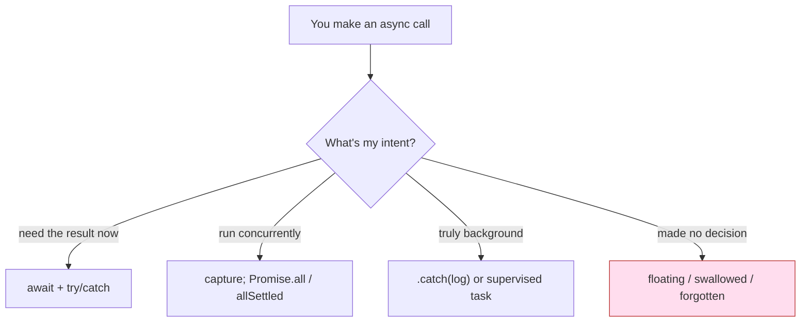

# Async Error-Handling Anti-Patterns — Middle Level

> **Category:** [Async Anti-Patterns](../README.md) → **Error Handling** — *errors that fall on the floor instead of propagating.*
> **Covers (collectively):** Swallowed Promise Rejection · Floating Promise · Fire-and-Forget Without Logging · Forgotten `await`

---

## Table of Contents

1. [Introduction](#introduction)
2. [Prerequisites](#prerequisites)
3. [The Real Question: When Does This Creep In?](#the-real-question-when-does-this-creep-in)
4. [Forgotten `await` — Making the Mistake Impossible](#forgotten-await--making-the-mistake-impossible)
5. [Floating Promise — Await It or Own It](#floating-promise--await-it-or-own-it)
6. [Swallowed Rejection — Designing Error Propagation](#swallowed-rejection--designing-error-propagation)
7. [Fire-and-Forget Without Logging — Making Background Work Observable](#fire-and-forget-without-logging--making-background-work-observable)
8. [The Trap: Don't `await` Things You Meant to Run Concurrently](#the-trap-dont-await-things-you-meant-to-run-concurrently)
9. [Python `asyncio` Equivalents](#python-asyncio-equivalents)
10. [Go Contrast: `errgroup` and `context`](#go-contrast-errgroup-and-context)
11. [Tooling: Types, Linters, and the Global Net](#tooling-types-linters-and-the-global-net)
12. [Common Mistakes](#common-mistakes)
13. [Test Yourself](#test-yourself)
14. [Cheat Sheet](#cheat-sheet)
15. [Summary](#summary)
16. [Further Reading](#further-reading)
17. [Related Topics](#related-topics)

---

## Introduction

> Focus: **When does this creep in?** and **What do I do instead?**

At the junior level you learned to *recognize* these four shapes: a Promise that fails with no observer, a function called without `await`, a `.then()` with no `.catch()`, a background task whose failures vanish. They all collapse into one sentence: **a Promise rejected and nobody was listening.**

The middle-level skill is **designing error propagation on purpose** instead of discovering its absence in production. That means deciding — for *every* async call — one of three things: *I await this and let errors flow through `try/catch`*, *I run this concurrently and collect its result with the rest*, or *I deliberately let it run in the background, and I attach an observer so its failures are visible.* The anti-patterns are all the same root failure: a call slipped through without any of those three decisions being made.

This file is about the **forces** that produce floating, swallowed, and forgotten async work, and the **practical countermoves** — `await` + `try/catch`, `Promise.allSettled`, supervised tasks, types, and linters — that make the mistake hard to commit in the first place.

---

## Prerequisites

- **Required:** Comfortable reading [`junior.md`](junior.md) — you can identify all four anti-patterns by sight.
- **Required:** You've shipped async code that talks to a network, database, or queue.
- **Helpful:** Working knowledge of `async/await`, `Promise.all`, and Promise states (pending / fulfilled / rejected).
- **Helpful:** You use TypeScript or typed Python (`mypy`) and run a linter in CI.
- **Helpful:** Familiarity with synchronous [error-handling principles](../../../clean-code/06-error-handling/README.md) — the async versions are the same ideas under a microtask delay.

---

## The Real Question: When Does This Creep In?

These bugs are rarely written on purpose. They appear at predictable seams:

| Trigger | What happens | Which anti-pattern |
|---|---|---|
| **Refactor sync → async** | A function becomes `async`; its callers still call it like a sync function, no `await` added | Forgotten `await` |
| **"It's just a log / metric / cache write"** | A non-critical side effect is called without `await` "to not block" | Floating Promise |
| **`.then()` chain copied from a tutorial** | The happy path is wired; the `.catch()` never gets added | Swallowed Rejection |
| **"Kick off the email and return fast"** | A background task is spawned with no supervisor, no logging | Fire-and-Forget |
| **Loop over async calls** | Each item is `await`ed; later someone removes the `await` to "speed it up" | Floating Promise (now N of them) |
| **`void` to silence the linter** | `no-floating-promises` fires; `void promise` is pasted in without a `.catch()` | Swallowed Rejection |

The common thread: **the cheap local move (drop the `await`, skip the `.catch()`) defers the cost to production**, where the failure is invisible until a user reports corrupted data or a silent dropped email. The middle engineer pays the small cost of an explicit decision at the call site.



Every async call lands in one of the three good buckets — or it's a bug. There is no fourth safe option.

---

## Forgotten `await` — Making the Mistake Impossible

### How it creeps in

The classic moment is a **sync-to-async refactor**. `getUser(id)` used to return a `User`; you add a database call and make it `async`. Now it returns `Promise<User>`, but the caller wasn't touched:

```js
const user = getUser(id);     // user is a Promise<User>, not a User
console.log(user.name);       // undefined — Promise has no .name
if (user.isAdmin) { ... }     // always falsy — a Promise is always truthy... wait, it's truthy → always runs!
```

The bug is silent: no exception, just wrong values. Worse, if `getUser` *rejects*, the rejection floats — see the next section.

### What to do instead

**1. Let the type system catch it.** In TypeScript, `Promise<User>` does not assign to `User`. The `console.log` above compiles (because `.name` on a Promise is `undefined`, valid structurally), but the moment you treat it as a `User` you get an error:

```ts
async function getUser(id: string): Promise<User> { /* ... */ }

const user = getUser(id);      // user: Promise<User>
greet(user);                   // ❌ TS2345: Promise<User> not assignable to User
const ok = await getUser(id);  // ✅ ok: User
```

This is why **typed return values are your first line of defense** — the forgotten `await` becomes a compile error, not a runtime mystery.

**2. Turn on the linter rule.** `@typescript-eslint/no-floating-promises` flags any Promise-returning expression that is neither awaited, returned, nor `.catch`-handled. The `@typescript-eslint/await-thenable` and the broader `no-misused-promises` rules catch Promises passed where a boolean or `void` callback is expected (e.g. `if (getUser())`, `arr.forEach(async ...)`).

**3. Prefer `return await` at the boundary you care about.** Inside a `try/catch`, `return somePromise` (without `await`) lets the rejection escape the `try` block — the `catch` never runs. `return await somePromise` keeps the error inside the handler:

```js
async function load() {
  try {
    return await fetchData();   // ✅ a rejection is caught here
  } catch (e) {
    return fallback();          // without `await`, this catch is dead code
  }
}
```

> **Rust comparison:** in Rust this entire class of bug is a *compile error* — a `Future` does nothing until `.await`, and the compiler warns `unused_must_use` on a dropped `Future`. JS and Python rely on tooling to approximate what Rust gets from the type system.

---

## Floating Promise — Await It or Own It

### How it creeps in

A Floating Promise is an async call whose result nobody holds: not awaited, not returned, not `.then`/`.catch`-chained. It usually starts as a "fire-and-forget" optimization — *"this audit-log write isn't on the critical path, don't block the response."*

```js
function handleRequest(req, res) {
  auditLog.write(req);          // floating: starts, runs, maybe rejects — silently
  res.send("ok");
}
```

If `auditLog.write` rejects, you get an `unhandledRejection` event (and in modern Node, **the process can crash by default**). Even when it doesn't crash, the failure is invisible.

### What to do instead

The decision is binary: **await it, or explicitly own it.**

**1. Await it** if its success is part of the operation's correctness:

```js
async function handleRequest(req, res) {
  await auditLog.write(req);    // if the audit must succeed, wait and let errors propagate
  res.send("ok");
}
```

**2. Own it** if it's genuinely background work. "Owning" means attaching an observer and signalling the intent with `void`:

```js
function handleRequest(req, res) {
  // `void` documents "I know this is not awaited"; `.catch` keeps it observable
  void auditLog.write(req).catch((e) => logger.error("audit write failed", e));
  res.send("ok");
}
```

The `void` operator satisfies `no-floating-promises` *and* tells the next reader "this was a deliberate decision." The `.catch(log)` is the minimum bar; the next section raises it.

> **The wrong fix:** `void auditLog.write(req);` with **no** `.catch` silences the linter and *re-introduces a swallowed rejection*. `void` is not a handler — it's an annotation. Always pair it with `.catch`.

---

## Swallowed Rejection — Designing Error Propagation

### How it creeps in

A swallowed rejection is a Promise that *has* an observer for success but not for failure — the `.then(onSuccess)` with no second argument and no `.catch()`. Or a `try/catch` that catches and does nothing. The error reaches a handler that drops it.

```js
fetchUser(id).then((u) => render(u));   // no .catch — rejection floats
fetchUser(id).then(render, () => {});   // explicit empty handler — even worse, hides it on purpose
```

### What to do instead — design the propagation

**1. Use `await` + `try/catch` as the default shape.** It reads top-to-bottom and unifies sync and async errors under one handler:

```js
async function showUser(id) {
  try {
    const u = await fetchUser(id);
    render(u);
  } catch (e) {
    showError(e);                 // one place; both fetch and render errors land here
  }
}
```

**2. Decide *return vs. throw* per layer.** Low-level functions should **throw** (or reject) so the error carries up. Only the boundary that can *act* on the error (the request handler, the job runner, the UI) should catch it. Catching too early — logging and returning `null` deep in a helper — turns a real failure into a confusing downstream `null`-dereference. Let it propagate to where there's enough context to decide.

**3. Choose `Promise.all` vs `Promise.allSettled` deliberately.** This is the central design decision for concurrent error handling:

| You want… | Use | Behavior on failure |
|---|---|---|
| All to succeed; fail fast if any fails | `Promise.all` | Rejects on the **first** rejection; other Promises keep running but their results (and *their* rejections) are abandoned → **hidden rejections** |
| Every result regardless of individual failures | `Promise.allSettled` | Never rejects; returns `{status, value}` / `{status, reason}` per entry — you inspect each |

```js
// Promise.all: one failure rejects the whole thing, AND the other rejections
// become unhandled (they already started and will reject into the void).
const [a, b, c] = await Promise.all([fa(), fb(), fc()]);

// Promise.allSettled: you get every outcome and handle failures explicitly.
const results = await Promise.allSettled([fa(), fb(), fc()]);
for (const r of results) {
  if (r.status === "rejected") logger.warn("partial failure", r.reason);
}
const ok = results.filter((r) => r.status === "fulfilled").map((r) => r.value);
```

Rule of thumb: **`all` for "all-or-nothing" operations** (load everything a page needs, or fail), **`allSettled` for "best-effort" batches** (send N notifications, report which ones failed). Using `all` where you meant `allSettled` is a quiet way to swallow the rejections of the siblings.

---

## Fire-and-Forget Without Logging — Making Background Work Observable

### How it creeps in

Fire-and-Forget is the *intentional* cousin of Floating Promise: you genuinely want the work to run in the background. The anti-pattern is doing so **without observability** — no logging, no metrics, no supervisor. When it fails in production, there is no signal at all.

```js
sendWelcomeEmail(user);   // intentional background work — but if it fails, who knows?
```

### What to do instead — supervise, log, measure

**1. Minimum bar: `.catch(log)`.** Never let background work fail silently:

```js
void sendWelcomeEmail(user).catch((e) =>
  logger.error("welcome email failed", { userId: user.id, err: e })
);
```

**2. Better: a supervised-task helper** that centralizes logging, metrics, and tracking so leaks and failures are countable:

```js
const inflight = new Set();

function supervise(name, promise) {
  inflight.add(promise);
  promise
    .then(() => metrics.increment(`task.${name}.ok`))
    .catch((e) => {
      metrics.increment(`task.${name}.fail`);
      logger.error(`background task failed: ${name}`, e);
    })
    .finally(() => inflight.delete(promise));
  return promise;
}

supervise("welcome_email", sendWelcomeEmail(user));
// On graceful shutdown: await Promise.allSettled([...inflight]);
```

Now failures emit a metric you can alert on, and `inflight` lets you drain background work before the process exits (otherwise a deploy mid-task drops it).

**3. Best: push it off-process.** Truly important background work — emails, webhooks, image processing — belongs in a **durable queue / job system**, not an in-memory floating Promise. A floating Promise dies with the process; a queued job survives restarts and retries. See [Background Job Processing](../../../../../Backend/distributed-systems/README.md). In-process fire-and-forget is for *cheap, loss-tolerant* work (a cache warm, a non-critical metric).

> **Structured concurrency** (the senior-level idea) takes this further: a task is *owned* by a scope that cannot exit until its children finish, so a fire-and-forget that "outlives" its parent is impossible by construction.

---

## The Trap: Don't `await` Things You Meant to Run Concurrently

Here is the counterweight to all of the above. The fix for floating Promises is "await it" — but **applied blindly, `await` serializes work that should run in parallel.** Not every async call should be awaited *inline, immediately*.

```js
// TRAP: each await blocks the next — three sequential round trips (~3× latency)
const user = await fetchUser(id);
const posts = await fetchPosts(id);
const prefs = await fetchPrefs(id);
```

These three calls are independent. Awaiting them in sequence is the [`await`-in-a-loop](../02-execution-shape/middle.md) anti-pattern in disguise. The fix is to **capture the Promises first, then await them together** — they all start immediately, and you still handle errors:

```js
// Start all three concurrently, then await as a group — ~1× latency.
const userP  = fetchUser(id);
const postsP = fetchPosts(id);
const prefsP = fetchPrefs(id);

const [user, posts, prefs] = await Promise.all([userP, postsP, prefsP]);
// or, common shorthand:
const [user, posts, prefs] = await Promise.all([fetchUser(id), fetchPosts(id), fetchPrefs(id)]);
```

The mental model: **`await` is "I need this value before the next line." `Promise.all` is "I need all of these before continuing, and I want them in flight at once."** A captured-but-not-yet-awaited Promise is *not* a floating Promise — it's a value you're holding, and you await (or `allSettled`) it before the function returns. The anti-pattern is only when nobody ever observes it.

> The narrow line: capturing `const p = doAsync()` and then **never** awaiting/handling `p` is a floating Promise. Capturing it and awaiting it two lines later is correct concurrent design. Intent is everything — make it explicit.

---

## Python `asyncio` Equivalents

The same four anti-patterns appear in Python, with different names for the same failures.

**Forgotten `await`** produces a *coroutine object*, not a value — and a `RuntimeWarning: coroutine was never awaited`:

```python
async def get_user(uid): ...

user = get_user(uid)        # user is a coroutine, NOT a User — the body never ran
print(user.name)            # AttributeError / wrong — and a RuntimeWarning at GC
user = await get_user(uid)  # ✅ runs the coroutine, yields the value
```

**Floating / Fire-and-Forget**: `asyncio.create_task` schedules a coroutine but you must **keep a reference** — the event loop only holds a *weak* reference, so a task with no reference can be garbage-collected mid-flight and silently cancelled:

```python
# Anti-pattern: task may be GC'd before it finishes; exceptions are lost.
asyncio.create_task(send_email(user))

# Better: hold a reference and attach a done-callback that retrieves the exception.
_background = set()
def _supervise(coro, name):
    task = asyncio.create_task(coro)
    _background.add(task)
    task.add_done_callback(_background.discard)
    def _log(t):
        if not t.cancelled() and t.exception():
            logger.error("background task %s failed", name, exc_info=t.exception())
    task.add_done_callback(_log)
    return task

_supervise(send_email(user), "welcome_email")
```

**Swallowed rejection**: a Task's exception is only raised when you `await` the task or call `task.result()`. If you never retrieve it, asyncio logs *"Task exception was never retrieved"* — Python's analog of `unhandledRejection`.

**`all` vs `allSettled`**: `asyncio.gather(*coros)` re-raises the **first** exception (like `Promise.all`); `asyncio.gather(*coros, return_exceptions=True)` returns exceptions as values (like `Promise.allSettled`). Python 3.11+ also offers `asyncio.TaskGroup`, which gives **structured concurrency** — the `async with` block won't exit until all child tasks complete, and a failure cancels the siblings:

```python
async with asyncio.TaskGroup() as tg:          # 3.11+
    t1 = tg.create_task(fetch_user(uid))
    t2 = tg.create_task(fetch_posts(uid))
# both guaranteed done here; any exception surfaces as an ExceptionGroup
```

---

## Go Contrast: `errgroup` and `context`

Go has no Promises, but the same design questions apply to goroutines. A bare `go doWork()` is the purest fire-and-forget: a panic in that goroutine **crashes the whole process**, and a returned `error` is simply discarded. The idiomatic fix for concurrent work with error propagation is `golang.org/x/sync/errgroup`:

```go
g, ctx := errgroup.WithContext(ctx)
var user User
var posts []Post

g.Go(func() error { u, err := fetchUser(ctx, id); user = u; return err })
g.Go(func() error { p, err := fetchPosts(ctx, id); posts = p; return err })

if err := g.Wait(); err != nil {   // returns the FIRST error; ctx cancels the others
    return err                     // like Promise.all — fail-fast with propagation
}
```

`errgroup` is the Go equivalent of `Promise.all` *done right*: errors propagate (no swallowing), and the shared `context` cancels in-flight siblings on the first failure (no orphaned work). For best-effort semantics (`allSettled`), you collect each goroutine's error into a slice instead of returning early. The lesson transfers across all three languages: **concurrent work needs a single place that joins the results and surfaces the errors** — `Promise.all`/`allSettled`, `asyncio.gather`/`TaskGroup`, or `errgroup`.

---

## Tooling: Types, Linters, and the Global Net

Defense in depth — each layer catches what the previous misses.

### TypeScript (compile-time)

- **Typed return values.** `Promise<T>` not assigning to `T` turns a forgotten `await` into a compile error — your strongest guarantee.
- **`strict: true`** in `tsconfig.json` — without it, several of these checks soften.

### ESLint (lint-time)

```jsonc
// .eslintrc — requires @typescript-eslint with type information
{
  "rules": {
    // flags any Promise not awaited, returned, or .catch-handled
    "@typescript-eslint/no-floating-promises": "error",
    // flags Promises passed where void/boolean is expected (e.g. forEach(async))
    "@typescript-eslint/no-misused-promises": "error",
    // flags `async` functions with no `await` (the "async without await" smell)
    "@typescript-eslint/require-await": "warn",
    // flags `await` on a non-Promise (a forgotten-await tell)
    "@typescript-eslint/await-thenable": "error"
  }
}
```

`no-floating-promises` is the single highest-value rule in this whole category. It mechanically eliminates Floating Promise *and* the common form of Swallowed Rejection — provided you don't "fix" its warnings with a bare `void`.

In Python, `mypy` with `warn_unused_coroutines`/`--warn-unused-ignores`, plus `ruff`'s `RUF006` (store reference to `asyncio.create_task`) and `ASYNC` rules, play the same role.

### The global safety net (runtime)

Even with types and linters, install a process-level handler as a backstop and an alerting signal — **not** as a substitute for local handling:

```js
// Node.js
process.on("unhandledRejection", (reason, promise) => {
  logger.error("UNHANDLED REJECTION", { reason });
  metrics.increment("unhandled_rejection");   // alert on this — it means a bug slipped through
  // Node's default already exits the process on unhandled rejection; consider a clean shutdown.
});
process.on("uncaughtException", (err) => {
  logger.fatal("UNCAUGHT EXCEPTION", err);
  process.exit(1);                              // state is unknown — fail fast, let the supervisor restart
});
```

```js
// Browser
window.addEventListener("unhandledrejection", (event) => {
  reportToSentry(event.reason);
  // event.preventDefault();  // suppress the console error only if you've truly handled it
});
```

```python
# Python asyncio
loop = asyncio.get_event_loop()
loop.set_exception_handler(lambda loop, ctx:
    logger.error("asyncio unhandled: %s", ctx.get("message"), exc_info=ctx.get("exception")))
```

Treat **any** hit on the global handler as a defect to fix at the source. It exists to make invisible failures visible and to fail loudly — it is the smoke alarm, not the fire-suppression system.

---

## Common Mistakes

1. **Silencing `no-floating-promises` with a bare `void`.** `void p` removes the warning but still swallows rejections. Always `void p.catch(log)` or `await` it.
2. **Catching too early.** Logging-and-returning-`null` deep in a helper converts a real error into a downstream null-dereference with no stack trace. Throw; catch at the boundary that can act.
3. **`Promise.all` where you meant `allSettled`.** One sibling's rejection abandons the others' results — and the siblings' *own* rejections become unhandled. Use `allSettled` for best-effort batches.
4. **`return promise` instead of `return await promise` inside `try`.** The rejection escapes the `try`, so the `catch` is dead code. Use `return await` when you need the local handler.
5. **`await`-ing independent calls in sequence.** The over-correction to "always await": serializes parallelizable work. Capture, then `Promise.all`.
6. **Relying on `unhandledRejection` as your handler.** It's a backstop and an alert, not error handling. Anything reaching it is a bug.
7. **In-memory fire-and-forget for important work.** A floating Promise dies on deploy/restart. Critical background work belongs in a durable queue.
8. **Python: `create_task` with no saved reference.** The task can be GC'd and silently cancelled. Keep a reference (or use `TaskGroup`).

---

## Test Yourself

1. You refactor `getConfig()` from sync to `async`. What two mechanisms will catch the callers that forgot to add `await`, and which is stronger?
2. A reviewer sees `void cache.set(k, v);`. Why might this still be a bug, and what's the minimum fix?
3. You're sending 50 push notifications concurrently and want to know which ones failed without aborting the batch. `Promise.all` or `Promise.allSettled`? Why?
4. Inside a `try { ... } catch`, a colleague writes `return fetchData();`. The `catch` never fires on a rejection. Why, and what's the one-word fix?
5. When is capturing a Promise without immediately awaiting it *correct* rather than a Floating Promise?
6. Your service kicks off `sendWelcomeEmail(user)` as fire-and-forget. List three escalating levels of making it observable/reliable.
7. What is the Python `asyncio` equivalent of an `unhandledRejection`, and how does `asyncio.create_task` cause it?

<details>
<summary>Answers</summary>

1. **(a) TypeScript types** — `Promise<T>` won't assign to `T`, so using the result as a value is a compile error; **(b) the `@typescript-eslint/no-floating-promises` lint rule.** Types are stronger: they fail the build deterministically wherever the value is *used*, while the linter catches the unobserved-Promise pattern. Use both.
2. `void` only silences the linter; if `cache.set` rejects, the rejection is now unhandled (swallowed). Minimum fix: `void cache.set(k, v).catch((e) => logger.warn("cache set failed", e));`.
3. **`Promise.allSettled`.** `Promise.all` rejects on the first failure and abandons the rest (and their rejections float). `allSettled` returns every outcome so you can report exactly which notifications failed while keeping the others.
4. Without `await`, the function *returns* the Promise and exits the `try` block before the Promise settles, so the rejection propagates to the caller, not the local `catch`. Fix: `return await fetchData();`.
5. When you capture it to start it concurrently and then await it (or `Promise.all`/`allSettled` it) before the function returns — e.g. `const p = fetchPosts(id); ...; const posts = await p;`. It's only a Floating Promise if *nothing ever* awaits or `.catch`-handles it.
6. (a) `.catch(log)` so failures are logged; (b) a supervised-task wrapper that emits success/failure **metrics** and tracks in-flight tasks for graceful-shutdown draining; (c) move it to a **durable job queue** so it survives restarts and retries.
7. The *"Task exception was never retrieved"* log message. `asyncio.create_task` schedules the coroutine but its exception is only surfaced when you `await` the task or call `.result()`; if you keep no reference and never retrieve it, the exception is reported (or lost if the task is GC'd first).

</details>

---

## Cheat Sheet

| Anti-pattern | Creeps in when… | Countermove |
|---|---|---|
| **Forgotten `await`** | sync→async refactor; caller untouched | Typed `Promise<T>`; `no-floating-promises`; `return await` in `try` |
| **Floating Promise** | "don't block, just fire it" | `await` it, **or** `void p.catch(log)` to own it explicitly |
| **Swallowed Rejection** | `.then()` with no `.catch`; empty catch | `await`+`try/catch`; throw low, catch at the boundary; `allSettled` for batches |
| **Fire-and-Forget (no logging)** | "kick it off and return fast" | `.catch(log)` → supervised task + metrics → durable queue |

**Three rules:**
- *Every async call gets a decision: await it, gather it concurrently, or own it with a `.catch`. No fourth option.*
- *Don't blindly `await` independents in sequence — capture, then `Promise.all`/`allSettled`.*
- *The `unhandledRejection` handler is a smoke alarm, not a handler — every hit is a bug to fix at the source.*

---

## Summary

- All four anti-patterns reduce to **a Promise that rejected with no observer.** The middle skill is making the *decision* explicit at every call site: await, gather, or own.
- **Forgotten `await`**: kill it with typed return values (`Promise<T>` ≠ `T`) and `no-floating-promises`; use `return await` inside `try`. **Floating Promise**: await it or own it with `void p.catch(log)` — never a bare `void`. **Swallowed Rejection**: default to `await`+`try/catch`, throw low and catch at the boundary, and choose `Promise.all` (fail-fast) vs `Promise.allSettled` (best-effort) on purpose. **Fire-and-Forget**: escalate from `.catch(log)` to supervised tasks with metrics to durable queues.
- **The trap**: don't over-correct into awaiting independent calls in sequence — capture the Promises, then `Promise.all` them.
- **Python** mirrors all of this (`gather` / `gather(return_exceptions=True)` / `TaskGroup`, task references, "exception never retrieved"); **Go** does it with `errgroup` + `context`; **Rust** prevents most of it at compile time.
- **Tooling is the durable fix**: types catch forgotten `await`, ESLint catches floating/misused Promises, and a global `unhandledRejection` handler is the backstop and alert.
- Next: [`senior.md`](senior.md) — instrumenting async failures at scale, structured concurrency, and refactoring legacy Promise-chain error handling.

---

## Further Reading

- **Async Programming in C#** — Stephen Cleary — the canonical treatment of `async` over `void`, fire-and-forget, and propagation; the principles map directly to JS/Python.
- **You Don't Know JS: Async & Performance** — Kyle Simpson — Promise states, the microtask queue, and why rejections float.
- **Notes on structured concurrency** — Nathaniel J. Smith (2018) — the argument that fire-and-forget is a language-level anti-pattern; motivates `TaskGroup` / nurseries.
- **`@typescript-eslint` rules docs** — `no-floating-promises`, `no-misused-promises`, `require-await`, `await-thenable`.
- **Python `asyncio` docs** — `gather`, `TaskGroup`, `create_task`, and `loop.set_exception_handler`.

---

## Related Topics

- [Execution Shape](../02-execution-shape/middle.md) — `await` in a loop and Promise-chain hell; the concurrency counterpart to the trap above.
- [Async Misuse](../03-misuse/middle.md) — `async` without `await` and the Promise-constructor anti-pattern (another rejection-loser).
- [Concurrency Anti-Patterns](../../03-concurrency/README.md) — the multi-thread sibling chapter; different failure modes, same need for error propagation.
- [Clean Code → Error Handling](../../../clean-code/06-error-handling/README.md) — the synchronous principles (throw, don't return null; fail at the boundary) these async patterns extend.
- [Backend → Distributed Systems](../../../../../Backend/distributed-systems/README.md) — durable queues, retries, and timeouts for background work that must not be lost.
