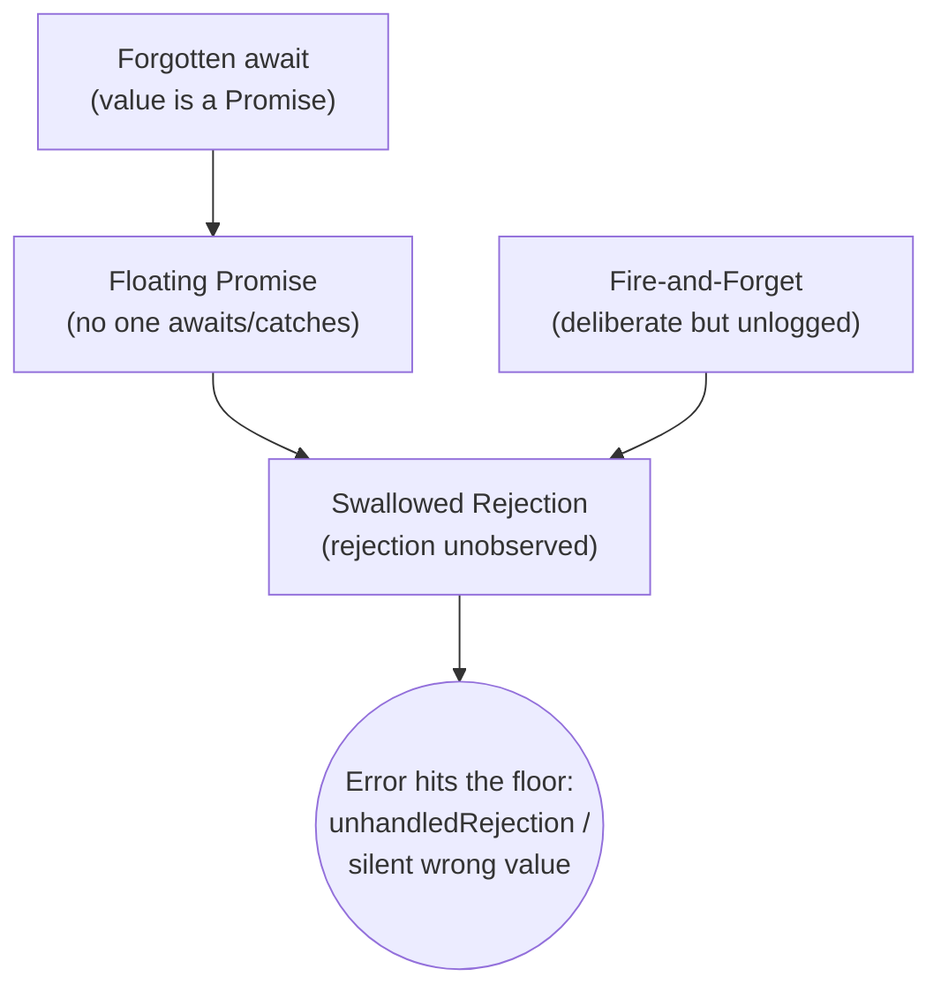
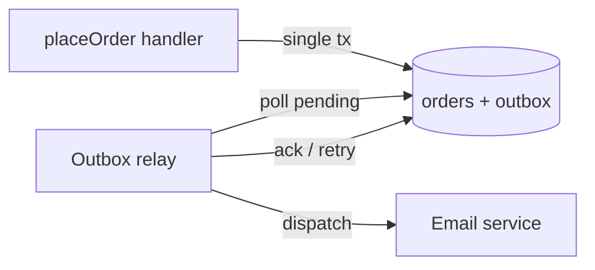

# Async Error-Handling Anti-Patterns — Refactoring Practice

> **Category:** [Async Anti-Patterns](../README.md) → **Error Handling** — *async work whose failures fall on the floor instead of propagating.*
> **Covers (collectively):** Swallowed Promise Rejection · Floating Promise · Fire-and-Forget Without Logging · Forgotten `await`

---

These are not "spot the bug" puzzles — [`find-bug.md`](find-bug.md) does that. Here the code **works on the happy path and looks reasonable**, but a rejection somewhere goes unobserved: it is logged nowhere, surfaces as a process-level `unhandledRejection`, or silently produces a wrong value. Your job is to **make the error path observable and correct without breaking the success path**.

The discipline mirrors the structural exercises, with one async-specific twist:

1. **Reproduce the dropped error first.** Before you fix, write a test that proves the failure is currently invisible — assert that a rejection is *not* propagated today (or that a `Promise` leaks where a value was expected). This is the async analogue of a characterization test: you are pinning the broken behavior so the fix is provable.
2. **Apply one named move.** *Convert `.then` chain to `async/await` + `try/catch`*, *await the floating promise*, *capture-and-catch*, *supervise the background task*, *swap `Promise.all` for `allSettled`*, *adopt structured concurrency*. One move, re-run the test.
3. **Verify the rejection now propagates.** The fix is done when a test using `await expect(...).rejects` (or `pytest.raises`) goes from red to green — i.e., the error reaches a caller who can act on it.

> **The golden rule of async errors:** *every Promise must have exactly one owner who will observe its outcome.* An unowned Promise is a future error with no destination. The four anti-patterns here are four ways to create an unowned Promise; every fix re-establishes ownership.

> **How to use this file:** read the "Before," write down the move *and the test you'd write to expose the dropped error* before expanding the solution. The gap between your plan and the worked plan is the learning.

---

## Table of Contents

| # | Exercise | Anti-pattern(s) | Lang | Key move |
|---|---|---|---|---|
| 1 | [Add the missing `.catch`](#exercise-1--add-the-missing-catch) | Swallowed Rejection | JS | `.catch()` / try-catch |
| 2 | [`.then` chain → `async/await` + try/catch](#exercise-2--then-chain--asyncawait--trycatch) | Swallowed Rejection | TS | Linearize chain |
| 3 | [Await the floating promise](#exercise-3--await-the-floating-promise) | Floating Promise | TS | Await the result |
| 4 | [Fix the forgotten `await`](#exercise-4--fix-the-forgotten-await) | Forgotten `await` | TS | Insert `await`; let types catch it |
| 5 | [Forgotten `await` inside `try/catch`](#exercise-5--forgotten-await-inside-trycatch) | Forgotten `await` + Swallowed | JS | Await so the catch can fire |
| 6 | [Capture-and-catch a deliberate background task](#exercise-6--capture-and-catch-a-deliberate-background-task) | Floating Promise | TS | `void p.catch(log)` |
| 7 | [Supervise fire-and-forget work](#exercise-7--supervise-fire-and-forget-work) | Fire-and-Forget | TS | Tracked, logged, awaited at shutdown |
| 8 | [Fire-and-forget → durable outbox](#exercise-8--fire-and-forget--durable-outbox) | Fire-and-Forget | TS | Outbox / queue handoff |
| 9 | [`Promise.all` → `allSettled` for partial results](#exercise-9--promiseall--allsettled-for-partial-results) | Swallowed + fail-fast | TS | `allSettled` + reject-collection |
| 10 | [`asyncio.gather` swallows a cancelled sibling](#exercise-10--asynciogather-swallows-a-cancelled-sibling) | Swallowed (Python) | Python | `return_exceptions` done right |
| 11 | [Unsupervised `create_task` → `TaskGroup`](#exercise-11--unsupervised-create_task--taskgroup) | Floating + Fire-and-Forget | Python | Structured concurrency |
| 12 | [Hand-rolled fan-out → `errgroup` semantics](#exercise-12--hand-rolled-fan-out--errgroup-semantics) | Swallowed + Floating | Go/TS | Structured error propagation |
| 13 | [The combo: a route handler with all four](#exercise-13--the-combo-route-handler-with-all-four) | All four | TS | Whole toolbox, in order |
| 14 | [Counter-case: keep a correct fire-and-forget](#exercise-14--counter-case-keep-a-correct-fire-and-forget) | (none — keep it) | TS | Recognize when *not* to refactor |

---

## How the four anti-patterns connect



All four end at the same place — **an error with no observer**. Forgotten `await` *accidentally* creates a floating promise; fire-and-forget creates one *on purpose but without a safety net*; both let a rejection go unhandled. The cure is always the same shape: **re-establish an owner that observes the outcome** — by awaiting, by catching, or by supervising.

---

## Exercise 1 — Add the missing `.catch`

**Anti-pattern:** Swallowed Rejection. **Goal:** ensure a failed save surfaces to the caller. **Constraints:** preserve the success return value; the error must propagate, not vanish.

```js
// Before — the rejection has no observer. If save() rejects,
// Node prints an UnhandledPromiseRejection and the caller never knows.
function persist(record) {
  db.save(record).then((id) => {
    cache.set(id, record);
  });
  return "queued"; // returns synchronously, before save resolves OR rejects
}
```

<details>
<summary>Refactored</summary>

**Reproduce the dropped error first**

```js
// This test PASSES against the "Before" code — proving the bug:
// persist() resolves "queued" even though the save rejected.
test("save failure is currently swallowed (documents the bug)", async () => {
  db.save = jest.fn().mockRejectedValue(new Error("disk full"));
  const captured = [];
  process.once("unhandledRejection", (e) => captured.push(e));
  expect(persist({ x: 1 })).toBe("queued");
  await flushMicrotasks(); // let the .then microtask run
  expect(captured[0].message).toBe("disk full"); // the error went to the process, not the caller
});
```

**Move sequence**

1. **Pin the bug.** The test above shows the error escapes to `process`, not the caller.
2. **Make the function honest about being async.** It does async work, so its result must be a `Promise` the caller can `await`. Convert to `async` and `await` the save.
3. **Let the rejection propagate** to the caller (don't swallow it with an empty `.catch`). The cache write only happens on success.

```js
// After — the function returns a Promise that rejects if save rejects.
async function persist(record) {
  const id = await db.save(record); // rejection propagates to the awaiter
  cache.set(id, record);
  return "queued";
}
```

**How to verify.** Replace the "documents the bug" test with one that asserts propagation:

```js
test("save failure now reaches the caller", async () => {
  db.save = jest.fn().mockRejectedValue(new Error("disk full"));
  await expect(persist({ x: 1 })).rejects.toThrow("disk full");
});
test("success path unchanged", async () => {
  db.save = jest.fn().mockResolvedValue("id-1");
  await expect(persist({ x: 1 })).resolves.toBe("queued");
});
```

The caller now decides what to do with the failure. Callers must be updated to `await persist(...)` — that propagation up the call stack is the *point*, not a regression.

</details>

---

## Exercise 2 — `.then` chain → `async/await` + try/catch

**Anti-pattern:** Swallowed Rejection (chain with a `.catch` that hides errors). **Goal:** linearize the chain and make the error handling explicit. **Constraints:** same resolved value; a failure in *any* step must reject, not resolve to a misleading default.

```ts
// Before — a chain whose .catch swallows everything into a fake default,
// so a network failure is indistinguishable from an empty cart.
function loadCartTotal(userId: string): Promise<number> {
  return fetchUser(userId)
    .then((user) => fetchCart(user.cartId))
    .then((cart) => fetchPrices(cart.items))
    .then((prices) => prices.reduce((a, b) => a + b, 0))
    .catch(() => 0); // ← swallows: a 500 from fetchPrices looks like a $0 cart
}
```

<details>
<summary>Refactored</summary>

**Reproduce the dropped error first**

```ts
test("a price-service failure is masked as $0 (documents the bug)", async () => {
  mockFetchPrices.mockRejectedValue(new Error("price service down"));
  await expect(loadCartTotal("u1")).resolves.toBe(0); // wrong: looks like an empty cart
});
```

**Move sequence**

1. **Pin the bug.** A failing dependency resolves to `0` — a silent wrong value, worse than a crash.
2. **Convert `.then` chain to `async/await`** (linearize). Each `.then(x => …)` becomes a sequential `await`. This alone changes no error semantics yet.
3. **Replace the blanket `.catch(() => 0)`** with a `try/catch` that *narrows*: only the conditions that legitimately mean "empty cart" return `0`; everything else re-throws so the caller sees the real failure.

```ts
// After — linear, and the catch distinguishes "no cart" from "service failed".
async function loadCartTotal(userId: string): Promise<number> {
  try {
    const user = await fetchUser(userId);
    const cart = await fetchCart(user.cartId);
    const prices = await fetchPrices(cart.items);
    return prices.reduce((a, b) => a + b, 0);
  } catch (err) {
    if (err instanceof EmptyCartError) return 0; // the ONE case where 0 is correct
    throw err; // real failures propagate
  }
}
```

**How to verify.**

```ts
test("service failure now propagates", async () => {
  mockFetchPrices.mockRejectedValue(new Error("price service down"));
  await expect(loadCartTotal("u1")).rejects.toThrow("price service down");
});
test("genuinely empty cart still returns 0", async () => {
  mockFetchCart.mockRejectedValue(new EmptyCartError());
  await expect(loadCartTotal("u1")).resolves.toBe(0);
});
```

**Lesson:** a `.catch` that maps *every* error to a default is the most dangerous form of swallowed rejection, because it converts crashes into wrong-but-plausible data. The fix is not "add error handling" — it already had a `.catch` — it is **catch narrowly, re-throw the rest**.

</details>

---

## Exercise 3 — Await the floating promise

**Anti-pattern:** Floating Promise. **Goal:** ensure the function does not return until its async work completes (and surfaces failures). **Constraints:** the audit write must finish before the response is sent.

```ts
// Before — writeAudit() is floating: the function returns while it's in flight.
// If it rejects, nobody catches it; if it's slow, the response races ahead of it.
async function deleteAccount(id: string): Promise<void> {
  await db.deleteUser(id);
  writeAudit({ action: "delete", id }); // ← floating: no await, no catch
}
```

<details>
<summary>Refactored</summary>

**Reproduce the dropped error first**

```ts
test("audit failure is swallowed and delete still 'succeeds' (bug)", async () => {
  mockWriteAudit.mockRejectedValue(new Error("audit log unavailable"));
  // Resolves cleanly even though the audit write rejected in the background.
  await expect(deleteAccount("u1")).resolves.toBeUndefined();
});
```

**Move sequence**

1. **Pin the bug.** The function resolves while `writeAudit` may still be running or already failed unobserved.
2. **Decide: is this work required-before-return, or genuinely background?** Here an audit record is a compliance requirement — it is *required*. So the move is **await it** (Exercise 6 handles the genuinely-background case).
3. **Await `writeAudit`.** Its rejection now propagates and the function only resolves once the audit is durable.

```ts
// After — the audit is part of the operation's contract, so we await it.
async function deleteAccount(id: string): Promise<void> {
  await db.deleteUser(id);
  await writeAudit({ action: "delete", id }); // failure now propagates
}
```

**How to verify.**

```ts
test("audit failure now fails the operation", async () => {
  mockWriteAudit.mockRejectedValue(new Error("audit log unavailable"));
  await expect(deleteAccount("u1")).rejects.toThrow("audit log unavailable");
});
```

**Tooling that prevents recurrence:** enable `@typescript-eslint/no-floating-promises`. It flags exactly this pattern — a `Promise` expression statement that is neither awaited, returned, nor `void`-ed. The rule is the cheapest long-term fix; this exercise is what it catches.

> If `deleteUser` should *not* be undone by a failed audit, that's a transaction-ordering decision (write audit first, or use an outbox — see Exercise 8). The await is step one regardless.

</details>

---

## Exercise 4 — Fix the forgotten `await`

**Anti-pattern:** Forgotten `await`. **Goal:** stop treating a `Promise<User>` as a `User`. **Constraints:** same final behavior; the dereference must operate on the resolved value.

```ts
// Before — `user` is a Promise<User>, not a User.
// user.name is undefined; the welcome email goes to "undefined".
async function welcome(id: string): Promise<void> {
  const user = getUser(id);          // ← missing await: user is Promise<User>
  await sendEmail(user.name, "Welcome!"); // user.name === undefined
}
```

<details>
<summary>Reproduce the dropped error first</summary>

```ts
test("forgotten await sends to undefined (bug)", async () => {
  mockGetUser.mockResolvedValue({ name: "Ada" });
  await welcome("u1");
  expect(mockSendEmail).toHaveBeenCalledWith(undefined, "Welcome!"); // wrong recipient
});
```

**Move sequence**

1. **Pin the bug.** `getUser(id)` returns a `Promise`; `.name` on a Promise is `undefined`. No exception — just silently wrong data. This is the most insidious of the four because nothing throws.
2. **Insert the missing `await`.** `const user = await getUser(id);`
3. **Lean on the type system / linter so it can't recur.** In `strict` TypeScript, accessing `.name` on `Promise<User>` is already a type error *if* `User` has no `name` and `Promise` has no `name` — but because both lack it the symptom is `undefined`, so add `@typescript-eslint/no-floating-promises` and `await-thenable` to catch it mechanically. (Rust and C# catch this at compile time; JS/Python need the linter.)

```ts
// After — await the promise; user is a real User.
async function welcome(id: string): Promise<void> {
  const user = await getUser(id);
  await sendEmail(user.name, "Welcome!");
}
```

**How to verify.**

```ts
test("email now goes to the real user", async () => {
  mockGetUser.mockResolvedValue({ name: "Ada" });
  await welcome("u1");
  expect(mockSendEmail).toHaveBeenCalledWith("Ada", "Welcome!");
});
test("a failed lookup now propagates instead of emailing undefined", async () => {
  mockGetUser.mockRejectedValue(new Error("not found"));
  await expect(welcome("u1")).rejects.toThrow("not found");
});
```

The second test shows the bonus: the forgotten `await` *also* swallowed `getUser`'s rejection (the rejected Promise was discarded). One missing keyword caused both a wrong-value bug and a swallowed-rejection bug — fixed by one `await`.

</details>

---

## Exercise 5 — Forgotten `await` inside `try/catch`

**Anti-pattern:** Forgotten `await` + Swallowed Rejection. **Goal:** make the `try/catch` actually catch the async failure it was written to handle. **Constraints:** the fallback must run only on real failure.

```js
// Before — the try/catch looks correct but catches nothing async:
// without await, charge() returns a Promise that rejects LATER, outside the try.
async function checkout(order) {
  try {
    return charge(order.card, order.total); // ← no await: rejection escapes the try
  } catch (e) {
    return { status: "failed", reason: e.message }; // never reached for async errors
  }
}
```

<details>
<summary>Refactored</summary>

**Reproduce the dropped error first**

```js
test("async rejection bypasses the catch (bug)", async () => {
  mockCharge.mockRejectedValue(new Error("card declined"));
  // The catch never runs; the rejection propagates as if there were no try.
  await expect(checkout({ card: "x", total: 10 })).rejects.toThrow("card declined");
});
```

**Why it's broken:** `try/catch` only catches errors thrown *synchronously* within the block, or rejections of a Promise that is `await`-ed inside it. Returning the Promise without `await` hands it to the caller; it rejects after the `try` has already exited. The `catch` is dead code.

**Move sequence**

1. **Pin the bug.** The catch never fires for an async rejection — the fallback object is unreachable.
2. **Insert `await`** so the rejection happens *inside* the `try`, where the `catch` can see it.

```js
// After — await brings the rejection into the try block.
async function checkout(order) {
  try {
    return await charge(order.card, order.total); // await is what makes catch work
  } catch (e) {
    return { status: "failed", reason: e.message };
  }
}
```

**How to verify.**

```js
test("decline now produces the fallback object", async () => {
  mockCharge.mockRejectedValue(new Error("card declined"));
  await expect(checkout({ card: "x", total: 10 }))
    .resolves.toEqual({ status: "failed", reason: "card declined" });
});
test("success still returns the charge result", async () => {
  mockCharge.mockResolvedValue({ status: "ok", id: "ch_1" });
  await expect(checkout({ card: "x", total: 10 }))
    .resolves.toEqual({ status: "ok", id: "ch_1" });
});
```

**Lesson — `return await` is not redundant inside `try/catch`.** Many linters flag a bare `return await` as a "useless await" *outside* try/catch (where it is). Inside a `try`, the `await` is load-bearing: it is the difference between a working catch and dead code. Configure `no-return-await` to allow it within try blocks (the modern `@typescript-eslint` rule does this).

</details>

---

## Exercise 6 — Capture-and-catch a deliberate background task

**Anti-pattern:** Floating Promise (where backgrounding is *intended*). **Goal:** keep the work fire-and-forget *by design*, but make it impossible to lose the error silently. **Constraints:** the request must not wait for the cache warm-up; a warm-up failure must be logged, never an `unhandledRejection`.

```ts
// Before — warmCache is intentionally not awaited (we don't want to block the response),
// but it's floating: a failure becomes an unhandledRejection with no context.
async function getProduct(id: string): Promise<Product> {
  const product = await db.getProduct(id);
  warmRelatedCache(id); // ← floating; intended-async but unobserved on failure
  return product;
}
```

<details>
<summary>Refactored</summary>

**Move sequence**

1. **Confirm the intent.** Cache warm-up is a best-effort optimization; the response must *not* block on it. So "just await it" (Exercise 3) is wrong here — that would couple response latency to a non-essential task.
2. **Capture-and-catch.** Attach a `.catch` that logs (with context), and prefix the statement with `void` to tell readers and the linter "this Promise is deliberately not awaited; its failure is handled here."

```ts
// After — deliberately backgrounded, but its failure has an owner: the logger.
async function getProduct(id: string): Promise<Product> {
  const product = await db.getProduct(id);
  void warmRelatedCache(id).catch((err) =>
    logger.warn({ err, id }, "cache warm-up failed (non-fatal)")
  );
  return product;
}
```

**How to verify.**

```ts
test("warm-up failure is logged, not thrown, and does not affect the response", async () => {
  mockWarm.mockRejectedValue(new Error("redis timeout"));
  const warn = jest.spyOn(logger, "warn");
  const captured: unknown[] = [];
  process.once("unhandledRejection", (e) => captured.push(e));

  await expect(getProduct("p1")).resolves.toEqual(expect.objectContaining({ id: "p1" }));
  await flushMicrotasks();

  expect(warn).toHaveBeenCalledWith(expect.objectContaining({ id: "p1" }), expect.any(String));
  expect(captured).toHaveLength(0); // ← no unhandledRejection
});
```

**Key distinction from Exercise 3:** there, the work was *required before return* → `await`. Here it is *genuinely background* → `void …catch(log)`. The `void` operator is the explicit, lint-satisfying signal of intent. This is the bridge to Exercise 14, where this exact shape is the *correct* end state and you keep it.

> Caveat: this fixes *observability*, not *durability*. If the process exits before the warm-up settles, it's lost — acceptable for a cache warm-up, **not** acceptable for, say, sending a receipt. That distinction drives Exercises 7 and 8.

</details>

---

## Exercise 7 — Supervise fire-and-forget work

**Anti-pattern:** Fire-and-Forget Without Logging. **Goal:** turn untracked background sends into *supervised* work — logged on failure and drained on shutdown so in-flight tasks aren't killed mid-flight. **Constraints:** the HTTP handler must stay fast (non-blocking), but no task may be silently dropped or lost at shutdown.

```ts
// Before — fire-and-forget with neither logging nor lifecycle tracking.
// Failures vanish; on SIGTERM, in-flight sends are killed with no trace.
function handleSignup(req: Req, res: Res) {
  const user = createUser(req.body);
  sendWelcomeEmail(user.email); // ← fire-and-forget: unlogged, untracked
  res.status(201).json({ id: user.id });
}
```

<details>
<summary>Refactored</summary>

**Move sequence**

1. **Pin the bug.** Two failure modes: (a) a send rejection disappears; (b) a `SIGTERM` during a send loses it because nothing waits for in-flight work. A test can prove (a); (b) is verified by the drain assertion.
2. **Introduce a task supervisor** — a small registry that tracks in-flight promises, logs each failure, and exposes `drain()` for graceful shutdown. (In Node 18+, `AbortSignal` + a tracking set; libraries: `p-queue`, or a framework's background-task primitive.)
3. **Register the task** instead of floating it. The handler still doesn't `await` the send (stays fast), but the supervisor owns the outcome.
4. **Drain on shutdown.** Wire `drain()` into the `SIGTERM` handler before closing the server.

```ts
// After — a tiny supervisor owns every background task.
class TaskSupervisor {
  private inFlight = new Set<Promise<unknown>>();

  run(label: string, fn: () => Promise<void>): void {
    const p = fn()
      .catch((err) => logger.error({ err, label }, "background task failed"))
      .finally(() => this.inFlight.delete(p));
    this.inFlight.add(p);
  }

  async drain(): Promise<void> {
    await Promise.allSettled([...this.inFlight]); // wait for in-flight work
  }
}

const tasks = new TaskSupervisor();

function handleSignup(req: Req, res: Res) {
  const user = createUser(req.body);
  tasks.run("welcome-email", () => sendWelcomeEmail(user.email)); // tracked + logged
  res.status(201).json({ id: user.id });
}

// shutdown wiring
process.on("SIGTERM", async () => {
  server.close();
  await tasks.drain(); // no in-flight send is killed mid-flight
  process.exit(0);
});
```

**How to verify.**

```ts
test("a failed send is logged, not lost", async () => {
  mockSend.mockRejectedValue(new Error("smtp down"));
  const err = jest.spyOn(logger, "error");
  handleSignup(reqFixture, resFixture);
  await tasks.drain();
  expect(err).toHaveBeenCalledWith(
    expect.objectContaining({ label: "welcome-email" }), expect.any(String));
});

test("drain waits for in-flight tasks", async () => {
  let settled = false;
  mockSend.mockImplementation(() => delay(50).then(() => { settled = true; }));
  handleSignup(reqFixture, resFixture);
  await tasks.drain();
  expect(settled).toBe(true); // drain didn't return until the send finished
});
```

**What improved.** Failures are observable (logged with a label); shutdown is graceful (no truncated sends). This is the right answer when the work *can* be safely lost on a crash-before-drain — i.e., a hard kill is tolerable. When even a crash must not lose the work, you need durability → Exercise 8.

</details>

---

## Exercise 8 — Fire-and-forget → durable outbox

**Anti-pattern:** Fire-and-Forget Without Logging (where the work is *business-critical* and must survive a crash). **Goal:** replace in-process fire-and-forget with a durable handoff so the task survives process death. **Constraints:** the email must be sent eventually even if the process crashes the instant after the HTTP response; the user-creation and the enqueue must be atomic.

```ts
// Before — a critical receipt sent fire-and-forget. If the process dies
// between res.json and the SMTP call, the receipt is lost forever.
async function placeOrder(req: Req, res: Res) {
  const order = await db.insertOrder(req.body);
  sendReceiptEmail(order); // ← critical work, fire-and-forget, no durability
  res.status(201).json({ orderId: order.id });
}
```

<details>
<summary>Refactored</summary>

**Move sequence**

1. **Pin the requirement.** A lost receipt is a real business defect; logging (Ex. 7) isn't enough because a crash *before* the send loses it with nothing to retry. The work must be **durable**.
2. **Transactional Outbox pattern.** In the *same database transaction* that creates the order, insert an `outbox` row describing the email. If the transaction commits, the intent is durably recorded; if it rolls back, neither the order nor the email exists. This removes the dual-write race entirely.
3. **A separate relay** polls the outbox and performs the send, marking rows done, retrying failures with backoff. The relay is restart-safe: a crash mid-send leaves the row un-acked, so it's retried.

```ts
// After — order + outbox row committed atomically; a relay does the send durably.
async function placeOrder(req: Req, res: Res) {
  const order = await db.transaction(async (tx) => {
    const o = await tx.insertOrder(req.body);
    await tx.insertOutbox({
      type: "receipt-email",
      payload: { orderId: o.id, email: o.email },
    }); // same tx — atomic with the order
    return o;
  });
  res.status(201).json({ orderId: order.id });
}

// relay (separate process / worker) — at-least-once delivery, restart-safe
async function relayOutbox() {
  const rows = await db.claimPending("outbox", { limit: 100 });
  for (const row of rows) {
    try {
      await dispatch(row); // e.g. sendReceiptEmail
      await db.markDone(row.id);
    } catch (err) {
      logger.error({ err, id: row.id }, "outbox dispatch failed; will retry");
      await db.scheduleRetry(row.id); // backoff; row stays pending
    }
  }
}
```



**How to verify.**

```ts
test("order and outbox row commit atomically", async () => {
  const { order } = await placeOrderTx(fixture);
  const rows = await db.query("SELECT * FROM outbox WHERE payload->>'orderId' = $1", [order.id]);
  expect(rows).toHaveLength(1);
});
test("a crash before the send loses nothing — relay still delivers", async () => {
  await placeOrderTx(fixture); // simulate: handler returns, process restarts
  mockDispatch.mockResolvedValue(undefined);
  await relayOutbox();
  expect(mockDispatch).toHaveBeenCalledWith(expect.objectContaining({ type: "receipt-email" }));
});
test("a transient send failure is retried, not dropped", async () => {
  await placeOrderTx(fixture);
  mockDispatch.mockRejectedValueOnce(new Error("smtp 4xx"));
  await relayOutbox();
  const [row] = await db.query("SELECT * FROM outbox WHERE status = 'pending'");
  expect(row).toBeDefined(); // still pending → will retry
});
```

**Trade-off to name.** The outbox gives **at-least-once** delivery — the relay may send twice if it crashes between `dispatch` and `markDone`. Make the send **idempotent** (dedupe key on the email, or an idempotency token at the SMTP provider). Durability and exactly-once are different guarantees; the outbox buys the first, idempotency approximates the second.

> **When to use which.** Ex. 6 (`void …catch`): truly disposable work. Ex. 7 (supervisor): important, loggable, survivable-if-drained. Ex. 8 (outbox): must-not-lose, crash-survivable. Escalate only as far as the business need demands — the outbox has real operational cost.

</details>

---

## Exercise 9 — `Promise.all` → `allSettled` for partial results

**Anti-pattern:** Swallowed Rejection via fail-fast aggregation. **Goal:** when partial results are useful, stop letting one rejection discard every sibling's result *and* swallow the other rejections. **Constraints:** return every success; report every failure; never silently drop either.

```ts
// Before — Promise.all rejects on the FIRST failure. The other 9 dashboard
// widgets' data is thrown away, and their results (if any) are abandoned.
async function loadDashboard(widgetIds: string[]): Promise<WidgetData[]> {
  return Promise.all(widgetIds.map((id) => fetchWidget(id)));
  // one slow/failing widget → the whole dashboard is empty
}
```

<details>
<summary>Refactored</summary>

**Reproduce the dropped error first**

```ts
test("one failing widget blanks the whole dashboard (bug)", async () => {
  mockFetchWidget.mockImplementation((id) =>
    id === "w3" ? Promise.reject(new Error("widget down")) : Promise.resolve({ id }));
  await expect(loadDashboard(["w1", "w2", "w3"])).rejects.toThrow("widget down");
  // user sees nothing — even though w1 and w2 were fine
});
```

**Move sequence**

1. **Decide the semantics.** Is this all-or-nothing (a DB transaction → keep `Promise.all`) or partial-results-are-useful (a dashboard → `allSettled`)? Here, showing 9 of 10 widgets is the right product behavior.
2. **Replace `Promise.all` with `Promise.allSettled`.** It never rejects; it returns a result-or-reason per input. This stops the fail-fast discard.
3. **Don't re-swallow.** Split fulfilled from rejected, return the successes, and *surface* the failures (return them alongside, log them, or throw an `AggregateError` if the caller wants strictness). The anti-pattern is half-fixed if you keep only the successes and drop the reasons.

```ts
// After — successes returned, failures reported (not swallowed).
async function loadDashboard(
  widgetIds: string[]
): Promise<{ data: WidgetData[]; failures: { id: string; error: Error }[] }> {
  const settled = await Promise.allSettled(widgetIds.map((id) => fetchWidget(id)));

  const data: WidgetData[] = [];
  const failures: { id: string; error: Error }[] = [];
  settled.forEach((r, i) => {
    if (r.status === "fulfilled") data.push(r.value);
    else failures.push({ id: widgetIds[i], error: r.reason });
  });

  for (const f of failures) logger.warn({ err: f.error, widget: f.id }, "widget failed");
  return { data, failures }; // caller can render partial UI + an error badge
}
```

**How to verify.**

```ts
test("partial results survive one failure, and the failure is reported", async () => {
  mockFetchWidget.mockImplementation((id) =>
    id === "w3" ? Promise.reject(new Error("widget down")) : Promise.resolve({ id }));
  const { data, failures } = await loadDashboard(["w1", "w2", "w3"]);
  expect(data.map((d) => d.id)).toEqual(["w1", "w2"]);
  expect(failures).toEqual([{ id: "w3", error: expect.any(Error) }]);
});
```

**The trap `allSettled` sets:** it makes it *easy* to ignore `reason`. `Promise.all` at least fails loudly; a careless `allSettled` that keeps only `fulfilled` values is a *new* swallowed-rejection bug. The discipline: **every rejected element must go somewhere observable** — returned, logged, or aggregated. Use `Promise.all` when partial results are meaningless; `allSettled` + explicit failure handling when they aren't.

</details>

---

## Exercise 10 — `asyncio.gather` swallows a cancelled sibling

**Anti-pattern:** Swallowed Rejection (Python). **Goal:** make a fan-out that currently hides exceptions surface them, without the subtle `return_exceptions` foot-gun. **Constraints:** one task's failure must not silently leave the others' exceptions unobserved.

```python
# Before — return_exceptions=True turns gather into "never raises",
# and the caller ignores the returned exception objects → swallowed.
import asyncio

async def fetch_all(ids):
    results = await asyncio.gather(
        *(fetch(i) for i in ids),
        return_exceptions=True,   # exceptions become *return values*...
    )
    return [r for r in results if not isinstance(r, Exception)]  # ...and are dropped here
```

<details>
<summary>Refactored</summary>

**Reproduce the dropped error first**

```python
import pytest

@pytest.mark.asyncio
async def test_failure_is_silently_dropped():
    async def fetch(i):
        if i == 2:
            raise RuntimeError("boom")
        return i
    # bug: returns [1, 3]; the RuntimeError vanished with no log, no raise
    assert await fetch_all([1, 2, 3], _fetch=fetch) == [1, 3]
```

**Two correct fixes depending on intent**

1. **If any failure should abort the batch** (all-or-nothing): drop `return_exceptions`. `gather` then re-raises the first exception — but **cancel the rest** in a `finally` so siblings don't leak (this is exactly the wart `TaskGroup` fixes; see Ex. 11).
2. **If partial results are useful** (like Ex. 9): keep `return_exceptions=True`, but **separate and surface** the exceptions instead of dropping them.

```python
# After (intent = partial results): exceptions are surfaced, not discarded.
import asyncio, logging

log = logging.getLogger(__name__)

async def fetch_all(ids):
    results = await asyncio.gather(*(fetch(i) for i in ids), return_exceptions=True)

    values, failures = [], []
    for i, r in zip(ids, results):
        if isinstance(r, Exception):
            failures.append((i, r))
            log.warning("fetch failed for %s: %r", i, r)  # observable
        else:
            values.append(r)
    return values, failures   # caller sees both — nothing swallowed
```

```python
# After (intent = all-or-nothing): re-raise, but don't leak siblings.
async def fetch_all_strict(ids):
    tasks = [asyncio.ensure_future(fetch(i)) for i in ids]
    try:
        return await asyncio.gather(*tasks)   # raises the first exception
    except Exception:
        for t in tasks:
            t.cancel()                        # don't leave siblings running unobserved
        raise
```

**How to verify.**

```python
@pytest.mark.asyncio
async def test_partial_surfaces_the_failure():
    values, failures = await fetch_all([1, 2, 3])
    assert values == [1, 3]
    assert failures[0][0] == 2 and isinstance(failures[0][1], RuntimeError)

@pytest.mark.asyncio
async def test_strict_reraises():
    with pytest.raises(RuntimeError, match="boom"):
        await fetch_all_strict([1, 2, 3])
```

**Python-specific trap:** `return_exceptions=True` is *not* error handling — it's error *deferral*. It converts a raise into a value you must then inspect. Dropping those values (the `Before`) is a swallowed rejection dressed up as a list comprehension. And plain `gather` (without `return_exceptions`) leaks siblings on first failure — the motivation for `TaskGroup`, next.

</details>

---

## Exercise 11 — Unsupervised `create_task` → `TaskGroup`

**Anti-pattern:** Floating Promise + Fire-and-Forget (Python). **Goal:** replace bare `create_task` (whose exceptions surface only via `unhandled exception in task` warnings, if at all) with structured concurrency. **Constraints:** if any child fails, the others are cancelled and the failure propagates to the caller.

```python
# Before — create_task without keeping/awaiting the reference.
# If a task raises, the exception is only seen when the task is GC'd,
# as a "Task exception was never retrieved" warning — easily missed.
import asyncio

async def process(orders):
    for o in orders:
        asyncio.create_task(handle(o))   # ← floating task; exception unobserved
    # function returns immediately; failures lost
```

<details>
<summary>Refactored</summary>

**Reproduce the dropped error first**

```python
@pytest.mark.asyncio
async def test_create_task_failure_is_not_propagated():
    async def handle(o):
        if o == "bad":
            raise ValueError("bad order")
    # bug: process() returns cleanly; the ValueError is never raised to the caller
    await process(["ok", "bad"])  # does NOT raise
    # the error only appears later as a logged "Task exception was never retrieved"
```

**Move sequence**

1. **Pin the bug.** `create_task` schedules work but returns a `Task` the code discards. The function returns before the tasks run; any exception is detached from the caller's stack.
2. **Adopt `asyncio.TaskGroup`** (Python 3.11+). It is structured concurrency: the `async with` block does not exit until *all* child tasks finish, and **if any child raises, the group cancels the siblings and propagates** (as an `ExceptionGroup`).
3. The function now naturally awaits all children and surfaces failures — no manual tracking, no leaked tasks.

```python
# After — structured concurrency: failures propagate, siblings are cancelled.
import asyncio

async def process(orders):
    async with asyncio.TaskGroup() as tg:        # 3.11+
        for o in orders:
            tg.create_task(handle(o))
    # block exits only when all children are done;
    # a child failure raises ExceptionGroup here.
```

**How to verify.**

```python
@pytest.mark.asyncio
async def test_taskgroup_propagates_child_failure():
    async def handle(o):
        if o == "bad":
            raise ValueError("bad order")
    with pytest.raises(ExceptionGroup) as ei:
        await process(["ok", "bad"])
    assert any(isinstance(e, ValueError) for e in ei.value.exceptions)

@pytest.mark.asyncio
async def test_all_good_completes():
    await process(["ok", "ok"])  # no raise
```

**Why this is the senior answer.** `TaskGroup` (and Go's `errgroup`, Trio's nurseries, Kotlin's `coroutineScope`) make the *floating task* unrepresentable: a task's lifetime is bounded by a lexical scope, so it cannot outlive — and thus cannot orphan its exception past — the block that owns it. This is the same "re-establish an owner" cure as every other exercise, lifted to a language construct. Pre-3.11, approximate it with a tracked list + `asyncio.gather` and explicit cancellation (Ex. 10's strict variant).

> Match the catch: a `TaskGroup` raises `ExceptionGroup`, so callers use `except*` (3.11+) or unpack `.exceptions`.

</details>

---

## Exercise 12 — Hand-rolled fan-out → `errgroup` semantics

**Anti-pattern:** Swallowed Rejection + Floating Promise. **Goal:** replace a manual concurrent fan-out that loses errors with structured propagation modeled on Go's `errgroup`. **Constraints:** the first error cancels the rest and is returned; no goroutine/promise is left running unobserved.

```go
// Before (Go) — fan-out with a WaitGroup but no error channel:
// errors from each goroutine are logged-and-forgotten; the caller gets nil.
func fetchAll(ctx context.Context, ids []string) ([]Item, error) {
	var wg sync.WaitGroup
	items := make([]Item, len(ids))
	for i, id := range ids {
		wg.Add(1)
		go func(i int, id string) {
			defer wg.Done()
			item, err := fetch(ctx, id)
			if err != nil {
				log.Println("fetch failed:", err) // ← swallowed: caller never sees it
				return
			}
			items[i] = item
		}(i, id)
	}
	wg.Wait()
	return items, nil // always nil error, even if half the fetches failed
}
```

<details>
<summary>Refactored</summary>

**Move sequence (Go)**

1. **Pin the bug.** A failed `fetch` logs and returns from the goroutine; the parent always returns `nil` error and a partially-zeroed slice. The error is swallowed and the partial state is silent.
2. **Adopt `golang.org/x/sync/errgroup`.** `errgroup.WithContext` gives a `Group` whose `Go` collects the first non-nil error, cancels the shared `ctx` (so siblings short-circuit), and returns that error from `Wait`.
3. The caller now receives the real error; no goroutine outlives `Wait`.

```go
// After (Go) — errgroup: first error cancels siblings and propagates.
import "golang.org/x/sync/errgroup"

func fetchAll(ctx context.Context, ids []string) ([]Item, error) {
	g, ctx := errgroup.WithContext(ctx)
	items := make([]Item, len(ids))
	for i, id := range ids {
		i, id := i, id // capture
		g.Go(func() error {
			item, err := fetch(ctx, id)
			if err != nil {
				return fmt.Errorf("fetch %s: %w", id, err) // returned, not logged-and-dropped
			}
			items[i] = item
			return nil
		})
	}
	if err := g.Wait(); err != nil { // first error surfaces here
		return nil, err
	}
	return items, nil
}
```

**The TypeScript equivalent** (no built-in `errgroup`; compose `AbortController` + `Promise.all`):

```ts
// After (TS) — abort the rest on first failure; reject with the real error.
async function fetchAll(ids: string[]): Promise<Item[]> {
  const ac = new AbortController();
  try {
    return await Promise.all(
      ids.map((id) =>
        fetchWidget(id, { signal: ac.signal }).catch((err) => {
          ac.abort(); // cancel siblings on first failure
          throw new Error(`fetch ${id} failed: ${(err as Error).message}`);
        })
      )
    );
  } catch (err) {
    ac.abort();
    throw err; // propagates — not swallowed, not a silent partial result
  }
}
```

**How to verify (Go).**

```go
func TestFetchAll_PropagatesError(t *testing.T) {
	_, err := fetchAll(context.Background(), []string{"ok", "bad"})
	if err == nil || !strings.Contains(err.Error(), "fetch bad") {
		t.Fatalf("expected propagated error, got %v", err)
	}
}
```

**Lesson.** `errgroup` and `TaskGroup` are the same idea in two languages: a scope that owns concurrent children, propagates the first failure, and cancels the rest. "Log it inside the goroutine and return nil" is the Go dialect of `.catch(() => {})` — a swallowed rejection. Return the error; let the scope decide.

</details>

---

## Exercise 13 — The combo: route handler with all four

**Anti-pattern:** all four at once. **Goal:** refactor one Express-style handler exhibiting a forgotten `await`, a floating promise, an unlogged fire-and-forget, and a swallowed rejection. **Constraints:** preserve the HTTP response shape; fix in a safe order; each fix independently testable.

```ts
// Before — a handler with a bit of every error-handling anti-pattern.
async function createOrder(req: Req, res: Res) {
  try {
    const user = getUser(req.userId);        // (A) forgotten await → user is a Promise
    const order = await db.insert({ ...req.body, userName: user.name }); // user.name === undefined

    chargeCard(user, order.total);           // (B) floating + critical work unawaited

    sendConfirmation(order);                 // (C) fire-and-forget, unlogged

    res.status(201).json({ id: order.id });
  } catch (e) {
    res.status(500).json({ error: "oops" }); // (D) swallows the real reason; charge error never arrives here
  }
}
```

<details>
<summary>Refactored</summary>

**Move sequence — fix in order of blast radius, smallest/safest first**

1. **Characterize the happy path + each failure.** Tests for: a charge decline, a DB failure, a confirmation-send failure, and success. Snapshot the response `{status, body}`.
2. **(A) Forgotten `await`** — smallest, highest-impact. `await getUser`. This alone fixes the `undefined` userName *and* makes `getUser`'s rejection reachable by the `catch`.
3. **(B) Floating + critical** — `chargeCard` is essential and must complete before responding success. `await` it (Ex. 3). Now a decline propagates into the `catch`.
4. **(C) Fire-and-forget** — `sendConfirmation` is best-effort but must be observable. Supervise + log (Ex. 6/7); do not `await` it on the request path.
5. **(D) Swallowed rejection** — the `catch` discards the reason and always says "oops". Narrow it: map known errors to proper status codes, log the rest with the request id, and stop flattening everything to 500.

```ts
// After — every async outcome has an owner.
async function createOrder(req: Req, res: Res, tasks: TaskSupervisor) {
  try {
    const user = await getUser(req.userId);                 // (A) awaited
    const order = await db.insert({ ...req.body, userName: user.name });

    await chargeCard(user, order.total);                    // (B) awaited — decline reaches catch

    tasks.run("order-confirmation", () => sendConfirmation(order)); // (C) supervised + logged

    res.status(201).json({ id: order.id });
  } catch (err) {
    if (err instanceof CardDeclinedError) {                 // (D) narrowed, not swallowed
      return res.status(402).json({ error: "card_declined" });
    }
    if (err instanceof NotFoundError) {
      return res.status(404).json({ error: "user_not_found" });
    }
    logger.error({ err, reqId: req.id }, "createOrder failed"); // real reason captured
    res.status(500).json({ error: "internal_error" });
  }
}
```

**How to verify.**

```ts
test("decline → 402, not a swallowed 500", async () => {
  mockCharge.mockRejectedValue(new CardDeclinedError());
  await createOrder(req, res, tasks);
  expect(res.status).toHaveBeenCalledWith(402);
});
test("userName is the real name (forgotten-await fixed)", async () => {
  mockGetUser.mockResolvedValue({ name: "Ada" });
  await createOrder(req, res, tasks);
  expect(mockInsert).toHaveBeenCalledWith(expect.objectContaining({ userName: "Ada" }));
});
test("confirmation failure is logged, response still 201", async () => {
  mockSendConfirmation.mockRejectedValue(new Error("smtp down"));
  const err = jest.spyOn(logger, "error");
  await createOrder(req, res, tasks);
  await tasks.drain();
  expect(res.status).toHaveBeenCalledWith(201);
  expect(err).toHaveBeenCalled();
});
```

**Commit discipline.** Four commits, tests green after each: (a) add `await getUser`, (b) add `await chargeCard`, (c) supervise `sendConfirmation`, (d) narrow the catch. If a later commit regresses a test, the small steps make the culprit obvious. Never bundle them — each fixes a *different* dropped-error mechanism.

</details>

---

## Exercise 14 — Counter-case: keep a correct fire-and-forget

**Anti-pattern:** none — this code is **already correct**. **Goal:** recognize a *legitimate* fire-and-forget and resist the reflex to "fix" it by awaiting. **Constraints:** the request path must not block on the metric; a metric failure must never affect the response or crash the process.

```ts
// Looks like fire-and-forget — but it is captured, logged, and idempotent.
// This is the RIGHT shape. Do not await it; do not "promote" it to an outbox.
async function handleSearch(req: Req, res: Res): Promise<void> {
  const results = await search(req.query);
  res.json(results); // respond immediately

  // best-effort, non-blocking analytics; failure is logged and harmless
  void recordSearchMetric(req.query, results.length).catch((err) =>
    logger.debug({ err }, "search metric drop (non-fatal)")
  );
}
```

<details>
<summary>Why this stays — and the checklist that proves it</summary>

It is tempting to "fix" every un-awaited promise. Resist it when **all** of these hold — they do here:

1. **The work is genuinely non-essential.** A dropped search-analytics data point does not affect correctness, money, or compliance. (Contrast: a receipt → Ex. 8 outbox.)
2. **It is captured and caught**, not floating. `void … .catch(log)` gives the rejection an owner — the logger. There is no `unhandledRejection`, no swallowed error. (This is the cure from Ex. 6, *already applied*.)
3. **Blocking on it would be a regression.** Awaiting `recordSearchMetric` would couple p99 search latency to the analytics backend's health — a worse outcome than occasionally losing a metric.
4. **It is idempotent / loss-tolerant.** Losing it on a crash-before-flush is acceptable by design; no retry or durability is warranted.

If any item failed — money involved, must survive a crash, or no `.catch` — you'd escalate (await it → Ex. 3; supervise it → Ex. 7; durable outbox → Ex. 8).

**How to verify it's correct (and stays that way).**

```ts
test("response is not delayed by the metric", async () => {
  mockMetric.mockImplementation(() => delay(10_000)); // pathologically slow
  const start = Date.now();
  await handleSearch(req, res);
  expect(Date.now() - start).toBeLessThan(100); // response did NOT wait
});
test("a metric failure never crashes or alters the response", async () => {
  mockMetric.mockRejectedValue(new Error("statsd down"));
  const captured: unknown[] = [];
  process.once("unhandledRejection", (e) => captured.push(e));
  await handleSearch(req, res);
  await flushMicrotasks();
  expect(res.json).toHaveBeenCalled();   // response unaffected
  expect(captured).toHaveLength(0);      // no unhandledRejection
});
```

**The lesson.** "Every Promise must have an owner" does **not** mean "every Promise must be awaited." The owner here is the `.catch` logger, and the deliberate decision *not* to await is correct engineering. The anti-pattern was never "fire-and-forget" per se — it was **fire-and-forget without an observer**. Add the observer (and a `void` to declare intent), and a backgrounded task is a legitimate, sometimes superior, design.

</details>

---

## Refactoring discipline (async) — the recap

Every exercise ran the same async-flavored loop:

```text
reproduce the dropped error  →  one named move  →  the rejection now propagates  →  commit  →  repeat
```

- **Reproduce before you fix.** The async characterization test asserts the *broken* behavior first — a rejection that resolves to a wrong value, a `Promise` where a value was expected, an `unhandledRejection` that should have reached the caller. If you can't write a test that fails on the old code, you don't yet understand the bug.
- **One owner per Promise.** Every Promise must be observed by exactly one of: an `await`, a `.catch`, or a supervising scope (`TaskGroup` / `errgroup`). An unowned Promise is the root of all four anti-patterns. Fixing them is always "give it an owner."
- **`await` vs `void …catch` vs supervise vs outbox is a *requirements* decision, not a style choice.** Required-before-return → `await`. Genuinely background but loggable → `void p.catch(log)`. Important and must drain on shutdown → supervisor. Must survive a crash → durable outbox. Escalate only as far as the business need (Ex. 14 is the discipline of *not* over-escalating).
- **`Promise.all` fails loud; `allSettled` and `return_exceptions=True` defer.** Deferral is not handling — the deferred reasons must still be surfaced (returned, logged, aggregated), or you've traded a loud failure for a silent one.
- **Prefer structured concurrency.** `TaskGroup`, `errgroup`, nurseries make floating tasks *unrepresentable* by binding a task's lifetime to a lexical scope. They turn "remember to handle the error" into "the language won't let you forget."
- **Let tooling enforce it.** `@typescript-eslint/no-floating-promises`, `require-await`, `await-thenable`, `no-misused-promises`; Python's `-W error::RuntimeWarning` to make "coroutine never awaited" fatal in tests; Go's `go vet` / `errcheck`. The linter is the cheapest permanent fix — most of these exercises are exactly what those rules catch.

| Move | Cures | Exercises |
|---|---|---|
| Add `.catch` / convert `.then` to `await` + try-catch | Swallowed Rejection | 1, 2 |
| Insert the missing `await` (let the catch fire) | Forgotten `await` | 4, 5, 13 |
| `await` a required result | Floating Promise (essential work) | 3, 13 |
| `void p.catch(log)` (capture-and-catch) | Floating Promise (intended background) | 6, 14 |
| Supervise + log + drain on shutdown | Fire-and-Forget (important, survivable) | 7, 13 |
| Transactional outbox / durable queue | Fire-and-Forget (must survive a crash) | 8 |
| `allSettled` / `return_exceptions` + surface failures | Swallowed via fail-fast aggregation | 9, 10 |
| Structured concurrency (`TaskGroup` / `errgroup`) | Floating + Fire-and-Forget at scale | 11, 12 |
| Recognize a correct fire-and-forget and keep it | (over-correction) | 14 |

---

## Related Topics

- [`tasks.md`](tasks.md) — guided async programs to fix from scratch, building these moves step by step.
- [`find-bug.md`](find-bug.md) — the *spotting* counterpart: identify the dropped error, don't fix it.
- [Async Anti-Patterns](../README.md) — the chapter overview and the other two categories (Execution Shape, Misuse).
- [Concurrency Anti-Patterns](../../03-concurrency/README.md) — the multi-thread sibling (locks, races) — different failure modes, same discipline.
- [Refactoring → Refactoring Techniques](../../../refactoring/02-refactoring-techniques/README.md) — the mechanical catalog for the structural moves named above.
- [Backend → Distributed Systems](../../../../../Backend/distributed-systems/README.md) — retries, timeouts, and the outbox/saga patterns at the network layer.
