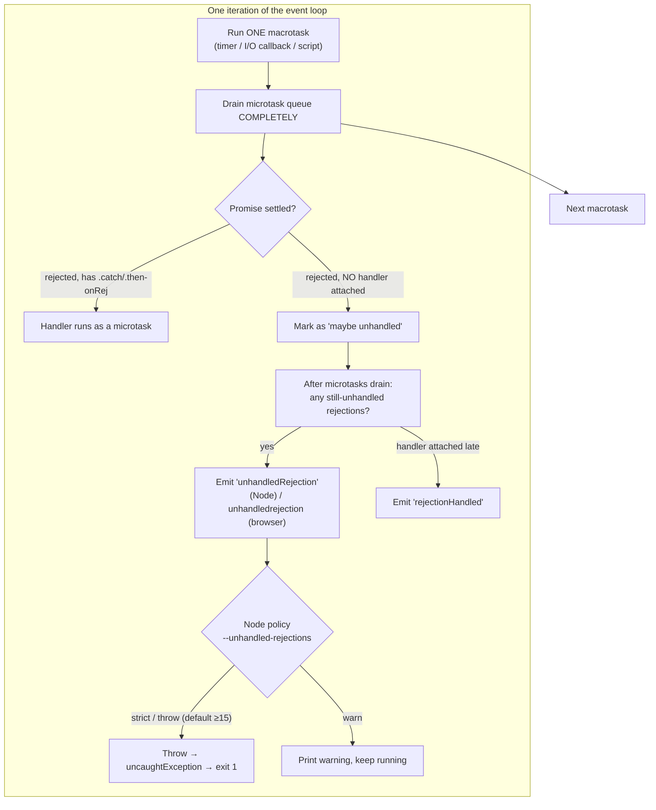

# Async Error-Handling Anti-Patterns — Professional Level

> **Category:** [Async Anti-Patterns](../README.md) → **Error Handling** — *errors that fall on the floor instead of propagating.*
> **Covers (collectively):** Swallowed Promise Rejection · Floating Promise · Fire-and-Forget Without Logging · Forgotten `await`

---

## Table of Contents

1. [Introduction](#introduction)
2. [Prerequisites](#prerequisites)
3. [The Event Loop & Microtask Queue — Where Rejections Actually Go](#the-event-loop--microtask-queue--where-rejections-actually-go)
4. [Swallowed Rejection — `unhandledrejection` and the Process-Kill Policy](#swallowed-rejection--unhandledrejection-and-the-process-kill-policy)
5. [Floating Promise & the Memory It Pins](#floating-promise--the-memory-it-pins)
6. [Fire-and-Forget — Listener, Timer, and Task Leaks Without Logging](#fire-and-forget--listener-timer-and-task-leaks-without-logging)
7. [Forgotten `await` — The Truthy Promise and the Silent Logic Bug](#forgotten-await--the-truthy-promise-and-the-silent-logic-bug)
8. [Tracing Across Async Boundaries — `AsyncLocalStorage` and Its Cost](#tracing-across-async-boundaries--asynclocalstorage-and-its-cost)
9. [Python `asyncio` — Destroyed Tasks and Un-Retrieved Exceptions](#python-asyncio--destroyed-tasks-and-un-retrieved-exceptions)
10. [Go Contrast — Errors Are Values, Goroutines Still Leak](#go-contrast--errors-are-values-goroutines-still-leak)
11. [A Combined Worked Example — A Leak You Can Watch Grow](#a-combined-worked-example--a-leak-you-can-watch-grow)
12. [Common Mistakes](#common-mistakes)
13. [Test Yourself](#test-yourself)
14. [Cheat Sheet](#cheat-sheet)
15. [Summary](#summary)
16. [Further Reading](#further-reading)
17. [Related Topics](#related-topics)

---

## Introduction

> Focus: **what these four anti-patterns cost the runtime** — the microtask queue, the heap, event-listener and timer tables, the tracing context — and **how you observe a failure that, by definition, made itself invisible.**

`junior.md` taught you to recognize the four shapes. `middle.md` taught you to handle errors correctly. `senior.md` taught you to instrument async failures at scale. This file goes one layer down — to the **event loop, the garbage collector, and the observability toolchain**.

The defining property of these four anti-patterns is that they are **silent**. A swallowed rejection produces no stack trace at the throw site. A floating promise that fails leaves no caller to blame. A fire-and-forget task that dies takes its error with it. A forgotten `await` returns a `Promise` that is *truthy*, so every downstream `if` passes and every log line looks fine — until a row is missing three hours later. None of these trip a test that only asserts the happy path, and none of them appear as a hot frame in a CPU profile. They appear as **rising memory, mysterious gaps in data, and a process that exits with no explanation.**

Two disciplines define this level:

1. **Know exactly when the runtime notices.** Each runtime has a precise rule for *when* an unhandled rejection becomes observable — it is tied to microtask draining and GC. If you can't state that rule, you can't predict whether your handler fires before or after the process dies.
2. **Instrument the invisible.** The cure is never "be more careful." It is a process-level handler, a linter that fails the build, a structured log on every fire-and-forget path, and a trace context that survives the `await` boundary. You make the silent failure *loud* before it ships.

> **The mental model:** a Promise is a value with a hidden second channel — the rejection. `await`, `.catch()`, and `.then(_, onRej)` are the only ways to read that channel. Any code path that creates a Promise and reads neither has handed the rejection to the *runtime*, which has its own opinion — increasingly, "terminate the process."

---

## Prerequisites

- **Required:** Fluent with [`senior.md`](senior.md) — you can add structured logging and a global rejection handler to a service.
- **Required:** A working model of the **JS event loop**: the macrotask queue (timers, I/O, `setImmediate`), the **microtask queue** (Promise reactions, `queueMicrotask`, `process.nextTick`), and the rule that microtasks drain *completely* between each macrotask.
- **Required:** A working model of a tracing GC — reachability, what keeps an object alive, why a pending Promise with live `.then` callbacks is *not* collectable.
- **Helpful:** Node CLI flags (`--unhandled-rejections`, `--trace-warnings`, `--inspect`), heap-snapshot reading in Chrome DevTools, and Python `asyncio` debug mode.
- **Helpful:** memory-leak-detection, observability-stack, error-handling-patterns skills for the measurement vocabulary.

---

## The Event Loop & Microtask Queue — Where Rejections Actually Go

You cannot reason about swallowed rejections without knowing *when* the runtime checks for them. A rejection is not "lost" the instant it happens; it is lost when a microtask **settles with no reaction attached** and stays that way until GC or the next tick proves no handler is coming.



The mechanics that matter at this level:

- **Microtasks drain to empty between macrotasks.** A chain of `.then().then().then()` all runs before the next timer or I/O callback. This is why a forgotten `await` can let *unrelated* work interleave (the rejection's "handler check" happens after the current microtask batch drains).
- **The "unhandled" check is deferred, not immediate.** When a Promise rejects with no reaction, the engine flags it but waits — you can still attach `.catch()` *synchronously after* and the engine will fire `rejectionHandled` instead of `unhandledRejection`. The deferral is what lets `const p = reject(); p.catch(...)` on the next line be safe.
- **GC participates.** In V8, a rejected Promise with no handler that becomes *unreachable* triggers the unhandled-rejection callback at GC time if it hasn't already. This is why the *timing* of the warning is non-deterministic — it can be tied to a GC cycle.

> **The professional consequence:** the window between "rejection occurs" and "runtime declares it unhandled" is real and observable, but it is *short and not under your control*. Never design around it. The only safe rule is: attach a handler in the same synchronous turn that creates the Promise.

---

## Swallowed Rejection — `unhandledrejection` and the Process-Kill Policy

A swallowed rejection is `someAsync().then(handle)` with no rejection branch, or `await`ed work inside a `try` that catches and `console.error`s into the void. The professional concern is the **runtime policy** that decides what happens next — and it has changed across Node versions in ways that have broken production deploys.

### Node's unhandled-rejection policy and its version history

| Node version | Default behavior on unhandled rejection |
|---|---|
| ≤ 14 | **`warn`** — print a deprecation warning, keep running |
| 15+ (current default) | **`throw`** — promote to an uncaught exception → **process exits with code 1** |

The mode is controlled by `--unhandled-rejections=<mode>`:

```bash
# Modes: throw (default ≥15) | strict | warn | warn-with-error-code | none
node --unhandled-rejections=strict app.js   # also print the stack, then exit
node --unhandled-rejections=warn   app.js    # legacy behavior — survives, logs
node --unhandled-rejections=none   app.js    # silence entirely — almost always wrong
```

The migration from `warn` to `throw` is the single most common cause of "it ran fine on Node 14, it crash-loops on Node 18." Code that *relied* on rejections being swallowed now takes down the process. That is a feature: a swallowed rejection was always a bug; the runtime just stopped hiding it.

### The correct global handler — log, don't swallow

Install a process-level handler so that a rejection that escapes every local `catch` is *recorded with full context* before the process decides to die. Do not use it to keep running — by the time `unhandledRejection` fires, the program is in an unknown state.

```js
// Node — structured capture of the last line of defense.
process.on('unhandledRejection', (reason, promise) => {
  logger.error({
    event: 'unhandledRejection',
    reason: reason instanceof Error ? { msg: reason.message, stack: reason.stack } : reason,
  });
  // Let the process die (default 'throw' mode will). Flush logs, then exit.
  // Do NOT resume as if nothing happened.
});

process.on('uncaughtException', (err) => {
  logger.fatal({ event: 'uncaughtException', stack: err.stack });
  process.exit(1);
});
```

```js
// Browser — the same channel, plus the chance to suppress the console error
// once you've reported it to your telemetry pipeline.
window.addEventListener('unhandledrejection', (e) => {
  telemetry.captureException(e.reason, { kind: 'unhandledrejection' });
  // e.preventDefault();  // only if you've truly handled/reported it
});
```

### The subtler swallow — caught, then dropped

The textbook case (`then` with no `catch`) is easy to lint. The expensive case is the rejection that *is* caught, then discarded:

```js
// BEFORE — the rejection is "handled," so no unhandledRejection fires,
// no linter complains, and the error is gone. This is worse than a crash:
// the system keeps serving wrong results.
try {
  await chargeCard(order);
} catch (e) {
  // swallowed: no log, no metric, no rethrow. The order ships unpaid.
}
```

```js
// AFTER — handle means: record, classify, and decide. Swallowing is a decision
// you must justify per call site, never a default.
try {
  await chargeCard(order);
} catch (e) {
  logger.error({ event: 'charge_failed', orderId: order.id, err: e });
  metrics.increment('charge.failure', { reason: classify(e) });
  throw new PaymentError('charge failed', { cause: e }); // propagate — let the caller abort the order
}
```

> **Diagnose it:** run with `--unhandled-rejections=strict` in CI and staging so a single escaped rejection fails the test run loudly. For the caught-then-dropped case, no runtime flag helps — only review, a `catch` that always logs/rethrows, and metrics on every error path.

---

## Floating Promise & the Memory It Pins

A floating Promise is one created but neither `await`ed nor `.then`/`.catch`-ed nor stored. The control-flow bug (the caller continues before the work finishes) is covered at lower levels. The professional concern is **memory and observability**: a floating Promise is a live object with live reactions, and everything its closures capture stays reachable until it settles.

### Why a pending Promise is not garbage

A `Promise` that is pending and has registered reactions is reachable from the engine's internal microtask/reaction bookkeeping *and* from whatever holds its callbacks. Its closure captures — the request object, the buffer, the DB row you loaded — are all retained for the Promise's entire lifetime. Spawn thousands of slow floating Promises and you have a heap that grows with in-flight work that nobody is bounding or watching.

```js
// BEFORE — a floating promise per request, capturing the whole `req`/`res`
// closure and a large payload. Under load these pile up; if `enrich` is slow
// or hangs, the closures (and their captured buffers) are pinned in the heap.
app.post('/ingest', (req, res) => {
  const payload = req.body;                 // possibly large
  enrichAndStore(payload);                  // floating: not awaited, not caught
  res.status(202).end();                    // returns immediately
});
// If enrichAndStore rejects → unhandledRejection (process may die on Node ≥15).
// If it just hangs → `payload` is retained for as long as it hangs, times the
// number of concurrent requests. Heap climbs; no error; eventual OOM.
```

```js
// AFTER — bound it, await it (or track it deliberately), and ensure it can fail
// loudly. Here we await so backpressure is natural and the closure is released
// as soon as the work settles.
app.post('/ingest', async (req, res) => {
  try {
    await enrichAndStore(req.body);
    res.status(201).end();
  } catch (e) {
    logger.error({ event: 'ingest_failed', err: e });
    res.status(502).end();
  }
});
```

### Proving the leak with a heap snapshot

You do not argue this from intuition — you watch the heap.

```bash
# Run with the inspector open, drive load, then take two heap snapshots
# in Chrome DevTools (chrome://inspect) and use "Comparison" view.
node --inspect server.js

# Or programmatically dump a snapshot under load:
node -e '
  const v8 = require("v8");
  const fs = require("fs");
  const s = v8.getHeapSnapshot();
  s.pipe(fs.createWriteStream("/tmp/heap-1.heapsnapshot"));
'
```

In the Comparison view, a floating-Promise leak shows as a growing count of `Promise` objects plus the retained closure types (`Buffer`, your request/context objects). The **retainer path** points straight back to the pending Promise — that is your evidence and your culprit.

### If you genuinely want fire-and-forget, say so

The legitimate "I do not want to wait" case must still attach a failure handler. The `void` keyword documents intent for both humans and linters:

```js
// Explicit: "I am deliberately not awaiting, but failure is still observed."
void enrichAndStore(payload).catch((e) =>
  logger.error({ event: 'background_enrich_failed', err: e }));
```

### TypeScript catches it at build time

The `@typescript-eslint/no-floating-promises` rule fails the build on any Promise-returning expression whose result is discarded — unless you explicitly `void` it or `await` it. With `strict` typing on, this is the single highest-leverage guard against three of the four anti-patterns in this file.

```jsonc
// .eslintrc — require every promise to be awaited, returned, or void-ed.
{
  "rules": {
    "@typescript-eslint/no-floating-promises": "error",
    "@typescript-eslint/no-misused-promises": "error" // catches `if (asyncFn())`, async event handlers
  }
}
```

> **Diagnose it:** `no-floating-promises` at build; two-snapshot heap comparison under load to *see* the retained closures; in production, an in-flight-task gauge (count of un-settled background tasks) that should oscillate around a steady state, not trend upward.

---

## Fire-and-Forget — Listener, Timer, and Task Leaks Without Logging

Fire-and-forget is intentional floating: you *mean* to start background work and not wait. The anti-pattern is doing it **without logging, without a supervisor, and without cleaning up the resources it registers.** Failures vanish, and the side effects — event listeners, timers, intervals — accumulate.

### The listener / timer leak

The classic production leak is a fire-and-forget routine that registers a listener or interval on a long-lived emitter and never removes it. Each invocation adds a handler; the emitter's listener array grows without bound.

```js
// BEFORE — every call to watch() adds a listener and a setInterval that are
// never removed. Call watch() per request and you leak one of each per request.
function watch(stream) {
  stream.on('data', onData);                 // never removed
  const t = setInterval(() => flush(), 1000); // never cleared
  doBackgroundSync();                         // floating, unlogged: failures vanish
}
```

Node will warn you about the listener side once you cross the threshold:

```
(node:12345) MaxListenersExceededWarning: Possible EventEmitter memory leak
detected. 11 data listeners added to [Socket]. Use emitter.setMaxListeners()
to increase limit
```

Run with `--trace-warnings` to get a **stack trace for that warning**, pointing at the exact `stream.on('data', ...)` line:

```bash
node --trace-warnings server.js   # turns the one-line warning into a full stack
```

```js
// AFTER — tie every registration to a lifecycle, log failures, and use
// AbortSignal so a single signal tears down listeners and timers together.
function watch(stream, signal) {
  stream.on('data', onData, { signal });            // removed on abort
  const t = setInterval(() => flush(), 1000);
  signal.addEventListener('abort', () => clearInterval(t), { once: true });

  doBackgroundSync().catch((e) =>                    // failures are now LOUD
    logger.error({ event: 'bg_sync_failed', err: e }));
}
// const ac = new AbortController(); watch(s, ac.signal); ... ac.abort();
```

### Spawn under a supervisor, not into the void

Structured concurrency says background work should have an *owner* that observes its completion and its failure. Even a minimal tracker beats `void fn()`:

```js
// A tiny supervisor: track in-flight tasks, log every failure, expose a count
// for metrics, and allow graceful drain on shutdown.
class TaskSupervisor {
  #inflight = new Set();
  spawn(label, fn) {
    const p = (async () => {
      try { await fn(); }
      catch (e) { logger.error({ event: 'task_failed', label, err: e }); }
      finally { this.#inflight.delete(p); }
    })();
    this.#inflight.add(p);
    return p;
  }
  get size() { return this.#inflight.size; }        // export as a gauge
  drain() { return Promise.allSettled([...this.#inflight]); } // call on SIGTERM
}
```

Now every fire-and-forget failure is logged, the in-flight count is a metric you can alert on, and shutdown can wait for outstanding work instead of dropping it.

> **Diagnose it:** `--trace-warnings` to locate the `MaxListenersExceededWarning` source; heap snapshots showing growing `EventEmitter`/`Timeout` retainers; an in-flight-task gauge that trends upward; and — the simplest tell — **zero log lines from a code path you know is running and sometimes failing.** Absence of logs *is* the symptom.

---

## Forgotten `await` — The Truthy Promise and the Silent Logic Bug

This is the most insidious of the four because it usually produces **no error at all** — just wrong behavior. `const user = getUser(id)` makes `user` a `Promise<User>`, not a `User`. A Promise is an object, so it is **truthy**, has no `.name` (yields `undefined`), and is not equal to anything you compare it to.

### Why it is silent — a value, not a throw

```js
// BEFORE — three different silent bugs from one missing await.
async function handle(id) {
  const user = getUser(id);            // Promise<User>, not User

  if (user) { /* always true: a Promise is truthy */ }      // (1) guard never fails
  console.log('hello', user.name);     // (2) "hello undefined" — no such prop on a Promise
  if (user.role === 'admin') grant();  // (3) undefined === 'admin' → false: admin check silently denies

  await saveAudit(id);                 // meanwhile getUser may still be in flight,
                                       // and if it rejects → unhandledRejection later
}
```

Nothing throws here. The guard passes, the log prints garbage, the admin check quietly fails closed (or worse, *open* in the inverse case), and the original Promise — never awaited — may reject *after* this function returns, surfacing as an unhandled rejection with a stack trace that points nowhere useful.

```js
// AFTER — await yields the value; the type now behaves as written.
async function handle(id) {
  const user = await getUser(id);      // User
  if (!user) throw new NotFoundError(id);
  console.log('hello', user.name);     // real name
  if (user.role === 'admin') grant();  // real check
  await saveAudit(id);
}
```

### Wasted work and lost ordering

A forgotten `await` also breaks *sequencing*. Code that reads as "do A, then B" runs A and B concurrently, and B may observe state before A committed:

```js
// BEFORE — looks sequential, runs concurrently. The read can race the write.
function transfer(from, to, amt) {
  debit(from, amt);                    // forgotten await — fire-and-forget write
  return readBalance(from);            // may read the pre-debit balance
}
```

The work isn't wasted, but the *ordering guarantee the code visually promises* is gone — a class of bug no profiler catches because the CPU work is fine; only the data is wrong.

### Tooling that prevents it

- **TypeScript** with `no-floating-promises` and `no-misused-promises`: assigning `Promise<User>` to a slot used as `User` is often caught by type errors downstream, and the discarded-Promise case is caught directly.
- **`require-await`** (`@typescript-eslint/require-await`): flags `async` functions with no `await`, a frequent smell near a forgotten one.
- **Code review heuristic:** any call to a function whose name you know is async, where the result is used synchronously on the next line, is suspect.

> **Diagnose it:** the linter is your primary defense. At runtime, `"hello undefined"`-style log lines and assertions that compare a result against a known value (`expect(typeof user).toBe('object')` is *not* enough — assert a field) catch what slips through. A forgotten `await` on a *rejecting* call also shows up as an `unhandledRejection` whose stack doesn't match where the value was consumed — a strong tell.

---

## Tracing Across Async Boundaries — `AsyncLocalStorage` and Its Cost

When a request's work hops across `await` points, callbacks, and timers, the call stack is gone — by the time a rejection fires in a microtask, there is no synchronous frame tying it back to the request that started it. This is why async errors are so hard to attribute. The runtime gives you two tools to carry context across those hops.

### `async_hooks` and `AsyncLocalStorage`

`AsyncLocalStorage` (built on `async_hooks`) propagates a value through every async continuation spawned within a `run()` scope — so a log line emitted three `await`s deep still knows its `requestId`, and an `unhandledRejection` handler can fish the context out.

```js
const { AsyncLocalStorage } = require('node:async_hooks');
const als = new AsyncLocalStorage();

app.use((req, res, next) => {
  als.run({ requestId: req.id, route: req.path }, () => next());
});

// Anywhere downstream — even inside a floating .catch — context is available:
function logErr(e) {
  const ctx = als.getStore() ?? {};
  logger.error({ ...ctx, event: 'async_error', err: e });   // now attributable
}
```

### The cost is real — measure it

`AsyncLocalStorage` is not free. `async_hooks` adds bookkeeping to *every* async resource creation, and historically (Node ≤ 16) the overhead was significant — double-digit percentage regressions on async-heavy microbenchmarks were common. Modern Node (using V8's `Promise` continuation hooks) is far cheaper, but the cost is non-zero and grows with async resource churn.

```bash
# Quantify the overhead on YOUR workload — never assume.
node --prof app.js          # then: node --prof-process isolate-*.log
# Or A/B two builds (ALS on/off) under identical load with autocannon/wrk
# and compare p50/p99 latency and RSS. Trace-level hooks are the expensive part.
```

The discipline mirrors the structural file: **enable context propagation deliberately, measure its cost on your traffic, and prefer the lightweight `AsyncLocalStorage` API over raw `async_hooks` callbacks** (which are markedly more expensive). For full distributed tracing, an OpenTelemetry SDK uses these primitives under the hood — same trade-off, larger blast radius.

> **Diagnose it:** `--prof` / `0x` flame graphs to see `async_hooks` frames; an A/B latency test toggling ALS; RSS comparison. If the overhead is unacceptable on a hot path, scope ALS narrowly rather than wrapping the entire process.

---

## Python `asyncio` — Destroyed Tasks and Un-Retrieved Exceptions

Python's `asyncio` has the same four anti-patterns with its own diagnostics. The two warnings every professional must recognize on sight:

### "Task was destroyed but it is pending!"

This is Python's floating-Promise / fire-and-forget tell. If you create a Task with `asyncio.create_task()` and **drop the reference**, the event loop's only strong reference may be weak, and the GC can collect the Task before it finishes — or the loop closes with it still pending:

```python
# BEFORE — create_task whose result is discarded. Two failure modes:
# (1) the Task may be GC'd mid-flight → "Task was destroyed but it is pending!"
# (2) if it raises, the exception is never retrieved → warning at GC time.
async def handler(req):
    asyncio.create_task(enrich(req))   # reference dropped immediately
    return 202
```

```
Task was destroyed but it is pending!
task: <Task pending name='Task-7' coro=<enrich() running at app.py:12>>
```

The fix is to **keep a strong reference** (a set) and observe completion — the asyncio analogue of the `TaskSupervisor` above:

```python
# AFTER — hold a reference so the Task can't be GC'd, and log failures.
_background = set()

async def handler(req):
    task = asyncio.create_task(enrich(req))
    _background.add(task)                          # strong ref: won't be collected
    task.add_done_callback(_background.discard)    # release when done
    task.add_done_callback(_log_if_failed)         # observe failure
    return 202

def _log_if_failed(task: asyncio.Task):
    if not task.cancelled() and task.exception():
        logging.error("background task failed", exc_info=task.exception())
```

Better still, use **structured concurrency** (`asyncio.TaskGroup`, Python 3.11+), which owns its children, propagates their exceptions, and cancels siblings on failure — making fire-and-forget impossible by construction:

```python
async def handler(req):
    async with asyncio.TaskGroup() as tg:     # awaits all children; raises on any failure
        tg.create_task(enrich(req))
        tg.create_task(audit(req))
```

### "Task exception was never retrieved"

The swallowed-rejection analogue: a Task raised, nobody called `.result()` / `.exception()` / awaited it, and at collection time `asyncio` warns:

```
Task exception was never retrieved
future: <Task finished coro=<enrich()> exception=ValueError('bad')>
```

### Turn on debug mode in development and CI

`asyncio` ships a debug mode that surfaces these aggressively — slow callbacks, coroutines never awaited, tasks destroyed pending:

```python
asyncio.run(main(), debug=True)          # programmatic
```

```bash
PYTHONASYNCIODEBUG=1 python app.py       # environment-driven; also logs slow callbacks (>100ms)
python -W error::RuntimeWarning app.py   # promote "coroutine was never awaited" to a hard error
```

The forgotten-`await` analogue in Python is even louder than JS: calling `coro()` without `await` returns a *coroutine object* that never runs, and Python emits `RuntimeWarning: coroutine 'foo' was never awaited`. Promote it to an error in CI with `-W error::RuntimeWarning`.

> **Diagnose it:** `PYTHONASYNCIODEBUG=1` and `asyncio.run(debug=True)` in dev/CI; `-W error` to fail on never-awaited coroutines; in production, the `loop.set_exception_handler()` callback is the asyncio analogue of `process.on('unhandledRejection')` — install it to capture and log un-retrieved task exceptions with context.

---

## Go Contrast — Errors Are Values, Goroutines Still Leak

Go has no Promises and no `await`, so two of these anti-patterns can't exist in the same form — and one becomes a *compile-time* concern of a different kind.

- **Forgotten `await` — impossible.** There is no Promise to forget. A function that does work returns `(T, error)` synchronously, or you start a goroutine explicitly. There is no truthy-Promise trap.
- **Swallowed rejection → ignored `error`.** The Go analogue is `result, _ := doThing()` — discarding the returned `error` with `_`. The compiler doesn't force you to check it, but `errcheck` / `golangci-lint` does, and it's the single most enforced lint in Go codebases.
- **Floating Promise / fire-and-forget → leaked goroutine.** This one is alive and dangerous. `go doWork()` with no way to observe its completion or its panic is exactly fire-and-forget — and a panic in a goroutine with no `recover` **crashes the whole process**, the inverse of a swallowed JS rejection.

```go
// BEFORE — fire-and-forget goroutine: a panic here takes down the process,
// and a blocked send leaks the goroutine forever (it never exits).
go func() {
    ch <- enrich(req)   // if nobody ever reads ch, this goroutine leaks
}()

// AFTER — context for cancellation, recover for the panic, log the failure.
go func() {
    defer func() {
        if r := recover(); r != nil {
            log.Error("background panic", "recover", r, "stack", debug.Stack())
        }
    }()
    select {
    case ch <- enrich(req):
    case <-ctx.Done():     // bounded: exits when the request is cancelled
    }
}()
```

Go's tooling for the leak: the **`go test -race`** detector finds the data races that fire-and-forget goroutines invite, and **`runtime.NumGoroutine()`** (exported as a metric) is the direct analogue of the in-flight-task gauge — a count that trends upward is a goroutine leak, the same shape as a climbing Promise count in V8.

> **The contrast in one line:** Go pushes errors into the *value* channel (visible, lint-enforced) and panics into the *crash* channel (loud), so the JS "silent rejection" mode largely disappears — but the *resource* leak (goroutine vs pending Promise) is the same problem with a different name and a different counter.

---

## A Combined Worked Example — A Leak You Can Watch Grow

The four anti-patterns compound. Here is a single endpoint that commits all of them, followed by the instrumented fix and the evidence each step produces.

**Before — every sin, every silent failure:**

```js
// A God-endpoint of async error handling: forgotten await, floating promise,
// fire-and-forget with no logging, and a swallowed rejection.
app.post('/order', (req, res) => {
  const order = createOrder(req.body);        // (1) FORGOTTEN await → order is a Promise

  notifyWarehouse(order);                     // (2) FLOATING promise (and order is wrong type)

  setInterval(() => syncInventory(), 5000);   // (3) FIRE-AND-FORGET timer, per request, never cleared,
                                              //     failures unlogged → leaks + invisible errors

  chargeCard(order).then(() => {}, () => {}); // (4) SWALLOWED rejection: empty onRejected

  res.status(201).json({ id: order.id });     // order.id is undefined (it's a Promise)
});
```

Symptoms in production: response bodies with `"id": null`; RSS climbing linearly with request count (a `Timeout` and its closure leaked per request); `MaxListenersExceededWarning` in the logs; occasional `unhandledRejection` from `notifyWarehouse` with a stack that points at no business logic; and **zero error logs** despite charges silently failing.

**After — structure and instrumentation fixed together:**

```js
const ac = new AbortController();             // one shared lifecycle for timers
const interval = setInterval(() => {
  syncInventory().catch((e) => logger.error({ event: 'inventory_sync_failed', err: e }));
}, 5000);
process.on('SIGTERM', () => { clearInterval(interval); ac.abort(); });  // not per-request!

app.post('/order', async (req, res) => {
  try {
    const order = await createOrder(req.body);            // (1) awaited → real Order
    await chargeCard(order);                              // (4) awaited inside try → failures propagate

    // (2)/(3) deliberate background work, observed and logged:
    supervisor.spawn('notify_warehouse', () => notifyWarehouse(order));

    res.status(201).json({ id: order.id });               // real id
  } catch (e) {
    logger.error({ event: 'order_failed', err: e, ...als.getStore() });  // attributable via ALS
    metrics.increment('order.failure', { reason: classify(e) });
    res.status(502).json({ error: 'order_failed' });
  }
});
```

The evidence trail that proves each fix:

| Fix | Tool that confirms it |
|---|---|
| Forgotten `await` removed | `no-floating-promises` lint passes; response `id` is non-null in a contract test |
| Floating/fire-and-forget bounded | Two-snapshot heap comparison: `Promise`/`Timeout` count steady, not growing; in-flight gauge oscillates |
| Timer leak removed | `--trace-warnings` no longer emits `MaxListenersExceededWarning`; RSS flat under sustained load |
| Swallowed rejection fixed | `--unhandled-rejections=strict` in CI passes; `order.failure` metric now increments on real failures |

> **The discipline, restated:** you did not "be more careful." You made each silent failure produce a *signal* — a lint error, a metric, a steady heap, a non-null field — and then you watched the signal. Measure the leak before and after; never trust that the fix worked without the snapshot.

---

## Common Mistakes

Professional-level mistakes — sophisticated, and therefore expensive:

1. **Using `process.on('unhandledRejection')` to keep running.** By the time it fires, your program is in an undefined state. Log with full context, then exit. Treating it as a `catch`-of-last-resort that *resumes* hides corruption.
2. **Relying on `--unhandled-rejections=none` to "stabilize" a service.** This re-hides the bug the runtime is trying to show you. The crash-loop after a Node upgrade is the symptom; the swallowed rejection is the disease — fix the call site.
3. **Assuming a caught rejection is a handled one.** An empty `catch` (or one that only `console.error`s in dev) is a swallowed rejection that no linter flags. Every `catch` must log/metric *and* decide (rethrow, fallback, or justified swallow).
4. **`void promise` without `.catch`.** `void` silences the linter but does *not* attach a handler — a `void`-ed rejecting Promise is still an unhandled rejection. Always `void p.catch(log)`, never bare `void p`.
5. **Creating fire-and-forget tasks per request.** A `setInterval`/listener registered inside a request handler leaks one resource per request. Lifecycle-scoped resources belong to the *server*, not the *request*; request-scoped ones must be torn down with an `AbortSignal`.
6. **Enabling `async_hooks`/`AsyncLocalStorage` globally without measuring.** Context propagation has real per-async-resource cost. A/B it under load; scope it narrowly on hot paths; prefer the `AsyncLocalStorage` API over raw hook callbacks.
7. **Dropping the Task reference in Python.** `asyncio.create_task(f())` without holding the returned Task invites GC mid-flight and "Task was destroyed but it is pending!". Keep a strong reference set, or use `TaskGroup`.
8. **Trusting that a forgotten `await` will throw.** It usually won't — a Promise is a truthy object. Assert *fields* of results in tests (not just truthiness), and let `no-floating-promises` + `no-misused-promises` catch the rest at build time.
9. **Shipping with the linter off in CI.** `no-floating-promises` is the highest-leverage guard against three of these four anti-patterns. If it's not failing the build, the anti-patterns are not prevented — they're just unobserved.

---

## Test Yourself

1. In Node, exactly *when* does the runtime decide a Promise rejection is "unhandled," and why does that timing make `const p = Promise.reject(x); p.catch(f)` on the next line safe?
2. Node 14 ran your service fine; Node 18 crash-loops on the same code. What changed in the default policy, and what flag would reproduce the old behavior (and why is using it the wrong fix)?
3. A floating Promise that *hangs* (never settles) causes a memory leak even though it never errors. Explain what is retained and why, and name the tool that proves it.
4. What does `void someAsyncFn()` accomplish, and what does it fail to accomplish, with respect to unhandled rejections?
5. `const user = getUser(id); if (user.role === 'admin') grant();` — `getUser` is async and the `await` is missing. Walk through why this throws no error and what it does instead.
6. In Python, you write `asyncio.create_task(enrich(req))` in a handler and discard the result. Name the two distinct warnings this can produce and the conditions for each.
7. What is the runtime cost of `AsyncLocalStorage`, where does it come from, and how would you decide whether to enable it on a hot path?
8. Go has no swallowed-rejection problem in the JS sense, yet `go doWork()` can still be a fire-and-forget anti-pattern. What are the two failure modes of an unsupervised goroutine, and which counter detects the leak?

<details>
<summary>Answers</summary>

1. When a Promise rejects with **no reaction attached** and the **microtask queue finishes draining** for the current macrotask, the engine flags it as a candidate; the `unhandledRejection`/`unhandledrejection` event fires after that drain (or at GC for unreachable rejected Promises). Because the check is deferred to *after* the synchronous turn, attaching `.catch(f)` on the very next synchronous line registers a reaction before the check runs — the engine then fires `rejectionHandled` instead.
2. The default `--unhandled-rejections` mode changed from **`warn`** (≤14) to **`throw`** (15+), so an unhandled rejection now becomes an uncaught exception and exits the process with code 1. `--unhandled-rejections=warn` restores the old behavior, but it only re-hides the bug — the rejection was always unhandled; fix the call site (add `.catch`/`try`).
3. A pending Promise with registered reactions is reachable from the engine's reaction bookkeeping and from whatever holds its callbacks; its **closure captures** (request objects, buffers, rows) stay reachable for the Promise's whole lifetime. A hung Promise never settles, so those captures are pinned indefinitely — times the concurrency. Prove it with a **two-snapshot heap comparison** in DevTools (or `v8.getHeapSnapshot()`): a growing `Promise` count with retainer paths to your closure types.
4. `void p` documents "deliberately not awaiting" and **silences `no-floating-promises`**. It does **not** attach a rejection handler — a `void`-ed rejecting Promise is still an unhandled rejection. The correct form is `void p.catch(logFn)`.
5. `getUser(id)` returns a `Promise<User>` (truthy object). `user.role` is `undefined` (no such property on a Promise), `undefined === 'admin'` is `false`, so `grant()` is silently skipped — no throw, just a wrong (fail-closed here) decision. Meanwhile the un-awaited Promise may reject later and surface as an `unhandledRejection` with a misleading stack.
6. **"Task was destroyed but it is pending!"** — the Task was GC'd or the loop closed while it was still running, because the only reference was dropped. **"Task exception was never retrieved"** — the Task finished by raising, but nobody awaited it or called `.result()`/`.exception()`, so at collection time asyncio warns. Hold a strong reference set and add a done-callback, or use `TaskGroup`.
7. `AsyncLocalStorage` is built on `async_hooks`, which adds bookkeeping at **every async resource creation/continuation**; the cost scales with async churn and was double-digit % on async-heavy benchmarks in older Node (cheaper now via V8 continuation hooks, but non-zero). Decide by **A/B testing p50/p99 and RSS** under realistic load with ALS on vs off; if the hot path can't absorb it, scope ALS narrowly rather than wrapping the whole process, and prefer the ALS API over raw hook callbacks.
8. (a) A **panic with no `recover`** crashes the entire process; (b) a **blocked channel send/receive or missing cancellation** leaks the goroutine forever (it never exits, pinning its stack and captures). `runtime.NumGoroutine()` exported as a gauge detects the leak — a count that trends upward, the direct analogue of a climbing pending-Promise count in V8.

</details>

---

## Cheat Sheet

| Anti-pattern | Runtime / observability cost | Measure / catch with | Fix |
|---|---|---|---|
| **Swallowed Rejection** | No stack at throw site; on Node ≥15 default, an *escaped* rejection kills the process; caught-then-dropped corrupts state silently | `--unhandled-rejections=strict` in CI; `process.on('unhandledRejection')`; metrics on every `catch` | `await` in `try`/`catch` that logs **and** decides (rethrow/fallback); global handler that logs then exits |
| **Floating Promise** | Pending Promise pins its closure captures → heap grows with in-flight work; rejection becomes unhandled | `no-floating-promises` lint; two-snapshot heap comparison; in-flight gauge | `await`, or `void p.catch(log)`; bound concurrency |
| **Fire-and-Forget (no logging)** | Listener/timer/task leaks per call; failures invisible (no logs) | `--trace-warnings` (`MaxListenersExceededWarning`); heap retainers; **absence of logs** | Supervisor/`TaskGroup` that logs failures; `AbortSignal` lifecycle; server-scoped not request-scoped timers |
| **Forgotten `await`** | Truthy Promise → silent wrong logic; broken ordering; late unhandled rejection | `no-floating-promises` + `no-misused-promises`; `require-await`; assert result *fields* | `await` the call; let types enforce `Promise<T> ≠ T` |
| **Python analogues** | "Task destroyed but pending", "exception never retrieved", "coroutine never awaited" | `PYTHONASYNCIODEBUG=1`, `asyncio.run(debug=True)`, `-W error::RuntimeWarning`; `loop.set_exception_handler` | Strong-ref Task set + done-callback; `asyncio.TaskGroup` |
| **Go analogue** | Ignored `error`; leaked/​panicking goroutine crashes process | `errcheck`/`golangci-lint`; `go test -race`; `runtime.NumGoroutine()` gauge | Check the `error`; `context` cancellation + `recover` in goroutines |

**Three golden rules:**
- *Attach a rejection handler in the same synchronous turn you create the Promise — the runtime's "unhandled" window is real but not yours to design around.*
- *The cure is a signal, never "be more careful": a failing lint, a metric on every error path, a steady heap, a non-null field. Make the silent failure loud, then watch it.*
- *Run `--unhandled-rejections=strict` / `PYTHONASYNCIODEBUG=1` in CI so an escaped async error fails the build, not production.*

---

## Summary

- These four anti-patterns share one property — **silence**. They produce no stack at the throw site, no failed happy-path test, and no hot frame in a profiler; they surface as rising memory, missing data, and unexplained process exits.
- **Swallowed Rejection:** know the event-loop rule for *when* a rejection is declared unhandled (after microtask drain / at GC) and Node's **`warn`→`throw`** policy shift at v15 — the cause of post-upgrade crash-loops. Install a global handler that **logs then exits**; never resume. The expensive variant is the caught-then-dropped rejection no linter sees.
- **Floating Promise:** a pending Promise **pins its closure captures**, so unbounded floating work is a heap leak; prove it with a two-snapshot heap comparison and prevent it with `no-floating-promises`. `void p` silences the linter but still needs `.catch`.
- **Fire-and-Forget:** intentional background work without logging or lifecycle leaks **listeners and timers** (per-request `setInterval` is the classic) and hides failures; `--trace-warnings` locates the `MaxListenersExceededWarning`, a supervisor/`TaskGroup` makes failures loud, and `AbortSignal` ties teardown to a lifecycle.
- **Forgotten `await`:** a `Promise` is **truthy**, so a missing `await` yields silent wrong logic (guards that never fail, `undefined` field reads, broken ordering) rather than a throw; types and `no-floating-promises`/`no-misused-promises` are the primary defense.
- **Python `asyncio`:** recognize "Task was destroyed but it is pending!", "Task exception was never retrieved", and "coroutine was never awaited" on sight; turn on `PYTHONASYNCIODEBUG=1` / `debug=True` / `-W error` in CI; hold strong Task references or use `TaskGroup`.
- **Go contrast:** errors are values (lint-enforced via `errcheck`) and panics crash loudly, so the JS silent-rejection mode mostly vanishes — but the **goroutine leak** is the same resource problem, detected by `runtime.NumGoroutine()`.
- **Tracing:** `AsyncLocalStorage` carries context across `await` boundaries so async errors become attributable — at a real, measurable cost you must A/B before enabling on a hot path.
- This completes the level ladder for Async Error Handling: [`junior.md`](junior.md) (recognize) → [`middle.md`](middle.md) (handle) → [`senior.md`](senior.md) (instrument at scale) → **professional.md** (event loop, memory, observability). Drill with the practice files.

---

## Further Reading

- **Node.js docs — `process` events** (`unhandledRejection`, `uncaughtException`, `rejectionHandled`) and the `--unhandled-rejections` CLI flag history.
- **Node.js docs — `async_hooks` and `AsyncLocalStorage`** — the API, the performance notes, and the migration away from raw hooks.
- **V8 blog — "Faster async functions and promises"** — microtask scheduling, why `await` is a microtask hop, and continuation-hook cost.
- **You Don't Know JS: Async & Performance** — Kyle Simpson — the event loop, microtask vs macrotask, Promise mechanics.
- **Python docs — `asyncio` Developer Mode** and `loop.set_exception_handler` — the debug warnings and the global exception channel.
- **PEP 654 / `asyncio.TaskGroup`** (Python 3.11) — structured concurrency and exception groups that make fire-and-forget impossible.
- **Notes on structured concurrency, or: Go statement considered harmful** — Nathaniel J. Smith (2018) — the argument that fire-and-forget is a language-level anti-pattern.
- **Effective Go — Concurrency** and **`go test -race`** docs — goroutine leaks, panic propagation, the race detector.

---

## Related Topics

- [Execution Shape → `await` in a Loop](../02-execution-shape/professional.md) — the sibling category; accidental serialization and the microtask scheduling cost of `await`.
- [Concurrency Anti-Patterns](../../03-concurrency/README.md) — the multi-thread sibling chapter; shared-memory races vs the cooperative-multitasking failures here.
- [Refactoring → Error Handling](../../../refactoring/01-code-smells/README.md) — the smell-level treatment of swallowed errors.
- [Clean Code → Error Handling](../../../clean-code/README.md) — propagate-don't-swallow as a source-level discipline.
- memory-leak-detection · observability-stack · error-handling-patterns — the heap-snapshot, tracing, and error-design toolkits referenced throughout.
- [Backend → Distributed Systems](../../../../../Backend/distributed-systems/README.md) — fire-and-forget, retry, and timeout at the network layer.
