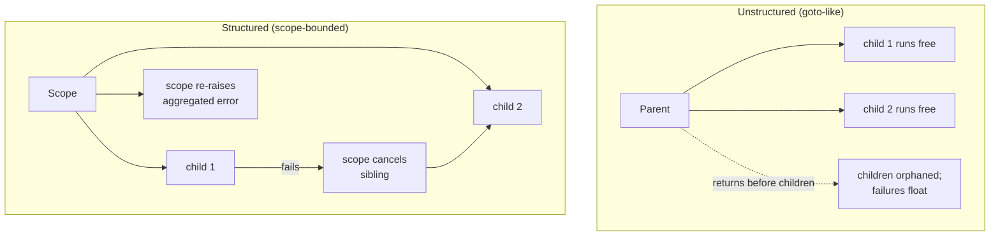

# Async Error-Handling Anti-Patterns — Senior Level

> **Category:** [Async Anti-Patterns](../README.md) → **Error Handling** — *errors that fall on the floor instead of propagating.*
> **Covers (collectively):** Swallowed Promise Rejection · Floating Promise · Fire-and-Forget Without Logging · Forgotten `await`

---

## Table of Contents

1. [Introduction](#introduction)
2. [Prerequisites](#prerequisites)
3. [How Did the Codebase Get Here? — Root-Cause Forces](#how-did-the-codebase-get-here--root-cause-forces)
4. [The Propagation Contract: Every Async Call Has an Owner](#the-propagation-contract-every-async-call-has-an-owner)
5. [Structured Concurrency: The Gold Model](#structured-concurrency-the-gold-model)
6. [Cancellation and Timeouts as First-Class Concerns](#cancellation-and-timeouts-as-first-class-concerns)
7. [Supervising Background Work: Beyond Fire-and-Forget](#supervising-background-work-beyond-fire-and-forget)
8. [Observability for Async Failures](#observability-for-async-failures)
9. [The `unhandledRejection` Policy: Crash vs. Report](#the-unhandledrejection-policy-crash-vs-report)
10. [Rolling Out Eradication at Scale: TypeScript Strict + Lint Gates](#rolling-out-eradication-at-scale-typescript-strict--lint-gates)
11. [When Fire-and-Forget Is Acceptable](#when-fire-and-forget-is-acceptable)
12. [Common Mistakes](#common-mistakes)
13. [Test Yourself](#test-yourself)
14. [Cheat Sheet](#cheat-sheet)
15. [Summary](#summary)
16. [Further Reading](#further-reading)
17. [Related Topics](#related-topics)

---

## Introduction

> Focus: **How did the codebase get here?** and **How do I fix it safely at scale?**

At the junior level you learned to *recognize* a missing `.catch()` and a forgotten `await`; at the middle level you learned to *handle* errors correctly in a single function — `try/await/catch`, `Promise.allSettled`, capturing rejections. This file is about the situation you inherit as a senior: a 400k-line Node service where `grep -c 'await' src` returns 9,000 hits, `no-floating-promises` was never enabled, and *something* is leaking memory and silently dropping a slice of every nightly billing run. Nobody can point to the bug, because the bug is **structural**: the codebase has no contract for who owns an async failure, and so failures own nobody.

These four anti-patterns are not four bugs. They are **one missing abstraction** seen from four angles:

- **Forgotten `await`** — the result type was `Promise<T>`, the code treated it as `T`. The rejection escapes the function that should have caught it.
- **Floating Promise** — a Promise is created and never attached to a continuation (`await`, `.then`, `.catch`, or `void … .catch`). It runs, it may fail, nobody is listening.
- **Swallowed Rejection** — a continuation *exists* but discards the error (`.then(handle)` with no `.catch`, or `catch {}` that logs nothing).
- **Fire-and-Forget Without Logging** — a *deliberate* background task with no supervisor and no observability. The intent was fine; the lack of a tracker is the defect.

The common root is the **broken propagation chain**: in synchronous code, an unhandled exception unwinds the stack to a boundary that logs and responds. Async code has no stack to unwind to — once you cross an `await` boundary without a parent waiting, the error has nowhere to go but `process.on('unhandledRejection')`, which in most codebases is unset or set to "log and continue forever."

> **The senior mindset shift:** the junior asks "did I handle this error?"; the senior asks "what is the *contract* that guarantees every async operation in this codebase has exactly one owner who will see its failure — and how do I make that contract impossible to violate?" You are not fixing a `.catch()`; you are designing an error-propagation regime and rolling it out across thousands of call sites without an outage.

---

## Prerequisites

- **Required:** Fluency with [`junior.md`](junior.md) and [`middle.md`](middle.md) — you can explain why `getUser(id).name` is `undefined`, and you reach for `Promise.all` / `Promise.allSettled` / `try/await/catch` without thinking.
- **Required:** You have operated an async-heavy service in production, owned an incident, and debugged a memory leak or a silently-dropped task.
- **Helpful:** Working knowledge of `AbortController` (JS), `asyncio` (Python), and `context.Context` (Go), plus at least one tracing system (OpenTelemetry, Datadog APM).
- **Helpful:** A CI pipeline you can extend with type-check and lint gates, and authority to set engineering norms.
- **Helpful:** Familiarity with [error-handling design](../../../clean-code/06-error-handling/README.md) and the multi-thread sibling chapter, [Concurrency Anti-Patterns](../../03-concurrency/README.md).

---

## How Did the Codebase Get Here? — Root-Cause Forces

Every floating-Promise epidemic has a biography. Before you write a lint rule, understand the forces — because the same forces will refill the codebase faster than you can drain it.

### The language lets you

This is the single largest cause and it is unique to async error-handling. In synchronous code, ignoring a return value is *visibly* a no-op. In JavaScript, `doAsync();` is **syntactically valid, type-checks without `strict`, and silently starts work**. The language does not require you to consume a Promise. Forgotten `await` and Floating Promise are the *default* outcome of a momentary lapse, not an exotic mistake. A codebase without `no-floating-promises` accumulates them at the rate of human fallibility.

### The callback-to-async migration sediment

Large JS codebases were written in layers: callbacks (`fn(err, data)`), then Promise chains (`.then().catch()`), then `async/await`. Each migration left rejections handled in the *old* idiom while new code assumed the *new* one. A `.then()` migrated to `await` often loses its trailing `.catch()` in the edit. Half-migrated files are where Swallowed Rejections breed.

### The deadline ratchet

"Just log it and move on" ships the feature today; wiring the background task into a real queue with retries and a dead-letter is next sprint's problem that never comes. Fire-and-forget is the ratchet's sediment: each best-effort `void notify(user)` is individually defensible and collectively a system with no observability into its own failures.

### Ownership gaps in the async boundary

Nobody owns "what happens when a background task fails." The request handler's author thinks the task framework handles it; there is no task framework. The platform team thinks product teams set their own `unhandledRejection` policy; product teams never knew it existed. The error has no owner because the *boundary* has no owner.

### Broken windows

One `catch {}` empty block in a file signals "swallowing is acceptable here," and the next edit copies the pattern. One un-awaited call in a hot path that "seems fine" teaches the next engineer that `await` is optional. Async sloppiness is contagious because, unlike a crash, it has **no immediate feedback** — the code appears to work in dev, in the demo, and in the happy path of production. The failure only surfaces under load, in the rare branch, weeks later, with no stack trace pointing home.

```mermaid
graph TD
    LANG[Language lets you<br/>drop a Promise] --> FA[Forgotten await]
    LANG --> FP[Floating Promise]
    MIG[Callback→Promise→async<br/>migration sediment] --> SR[Swallowed Rejection]
    DR[Deadline ratchet:<br/>'just log and move on'] --> FAF[Fire-and-Forget<br/>without logging]
    OG[Ownership gap at<br/>the async boundary] --> FAF
    OG --> SR
    BW[Broken windows:<br/>no immediate feedback] -. "lowers local standard" .-> FP
    BW -. .-> SR
    FA --> FP
    FP --> SR
```

The practical takeaway, identical to structural decay: **a senior plan names the force, not just the smell.** "Add `.catch()` everywhere" is whack-a-mole. "Enable `strict` + `no-floating-promises` as a ratcheting CI gate, define a codebase-wide propagation contract, give the platform team ownership of the `unhandledRejection` policy, and replace fire-and-forget with a supervised task tracker" is a plan that *stays fixed*.

---

## The Propagation Contract: Every Async Call Has an Owner

The unifying design principle: **every Promise (coroutine, future) must have exactly one owner who awaits its result or explicitly handles its rejection.** State it as a rule the whole codebase agrees on, then make tooling enforce it. There are exactly three legal dispositions of an async call:

| Disposition | Idiom (JS/TS) | Meaning |
|---|---|---|
| **Awaited** | `const x = await fn();` (inside `try` or under a caller that catches) | The current function owns the failure; it propagates up the call stack. |
| **Delegated** | `return fn();` | Ownership is handed to the caller; the rejection flows through the returned Promise. |
| **Adopted by a supervisor** | `tracker.spawn(() => fn())` / `void fn().catch(report)` | A background owner is explicitly named and *will* observe failure. |

The illegal fourth case — **abandoned** (`fn();` with none of the above) — is precisely Floating Promise / Forgotten `await`. The contract makes the abandoned case the *only* thing the linter must forbid, which is exactly what `no-floating-promises` does.

```ts
// The three legal dispositions, made explicit.
async function handler(req: Request): Promise<Response> {
  const user = await loadUser(req.id);          // AWAITED — handler owns failure
  if (!user) return notFound();

  return renderProfile(user);                   // DELEGATED — caller of handler owns it
}

// ADOPTED — a background owner is named, and it cannot fail silently:
tracker.spawn("warm-cache", () => warmCache(user.id));
//  ❌ abandoned:  warmCache(user.id);          // floating; no owner; linter rejects
```

> **Why `Promise<T>` not assigning to `T` is your best friend.** TypeScript's type system already encodes most of the contract for free: `const u: User = getUser(id)` where `getUser` returns `Promise<User>` is a *compile error*. The Forgotten `await` that produces `undefined` at runtime in plain JS is caught at build time in TS — *if* you read the value. The case TS can't catch alone is the *fully discarded* result (`getUser(id);`), which is exactly the gap `no-floating-promises` fills. Types + that one lint rule close the contract.

---

## Structured Concurrency: The Gold Model

The deepest fix for async error-handling chaos is **structured concurrency**: the principle that the lifetime of a concurrent task is bounded by a lexical scope, and that scope does not exit until all its children have completed — *propagating any child's failure and cancelling its siblings.* It is to async what `{ }` blocks and structured `if`/`while` were to `goto`. Nathaniel J. Smith's *Notes on structured concurrency* argues that **fire-and-forget is the `goto` of concurrency**: a task whose lifetime escapes the scope that created it, leaving no parent to receive its result or its error.

### Why `Promise.all` is *not* structured concurrency

`Promise.all` looks like a nursery, but it has a subtle, dangerous gap: **it rejects on the first failure but does not cancel the other in-flight Promises.** They keep running, detached, and *their* rejections are now floating.

```ts
// LOOKS structured. ISN'T. If fetchA rejects, fetchB and fetchC keep running.
// Promise.all rejects immediately, but B and C are now orphaned: if either
// later rejects, it's an UNHANDLED rejection — Promise.all already settled.
await Promise.all([fetchA(), fetchB(), fetchC()]);
```

Real structured concurrency requires that a sibling's failure **cancels** the others. JavaScript has no built-in nursery; you simulate one with `AbortController` (next section) or a library (`p-cancelable`, the proposed `AbortSignal.any`). The point is to *recognize the gap* — `Promise.all` gives you fan-out and first-error, but **not** cancellation, and the leaked siblings are a classic source of floating rejections in "correct-looking" code.

### Python: the gold standard in the language — `asyncio.TaskGroup`

Python 3.11 added `TaskGroup`, which *is* a nursery. On any child failure it cancels the remaining children, waits for them, and raises an `ExceptionGroup`. No task can escape the `async with` block.

```python
import asyncio

# STRUCTURED. If fetch_b raises, the group cancels fetch_a and fetch_c,
# awaits their cancellation, then re-raises as an ExceptionGroup. No orphans.
async def load_dashboard(user_id: int) -> Dashboard:
    async with asyncio.TaskGroup() as tg:
        a = tg.create_task(fetch_profile(user_id))
        b = tg.create_task(fetch_orders(user_id))
        c = tg.create_task(fetch_recommendations(user_id))
    # Reached ONLY if all succeeded; results are ready.
    return Dashboard(a.result(), b.result(), c.result())
# A bare `asyncio.create_task(x)` whose handle is dropped is the Python
# Floating Promise: it can be garbage-collected mid-flight and its exception
# is logged only at GC time, if ever. TaskGroup makes that impossible.
```

### Go: structured concurrency by convention — `errgroup` + `context`

Go has no `async/await`; it has goroutines and the discipline of `context.Context` for cancellation. `errgroup.WithContext` is the canonical structured pattern: the first goroutine to return an error cancels the shared context, which the others observe and abandon.

```go
import "golang.org/x/sync/errgroup"

// STRUCTURED. g.Wait() returns the first error; ctx is cancelled on first
// failure so the sibling goroutines observe ctx.Done() and stop. The whole
// group's lifetime is bounded by this function.
func LoadDashboard(ctx context.Context, userID int) (*Dashboard, error) {
    g, ctx := errgroup.WithContext(ctx)
    var profile *Profile
    var orders []Order

    g.Go(func() error {
        p, err := fetchProfile(ctx, userID) // MUST honor ctx cancellation
        profile = p
        return err
    })
    g.Go(func() error {
        o, err := fetchOrders(ctx, userID)
        orders = o
        return err
    })

    if err := g.Wait(); err != nil { // first non-nil error; siblings cancelled
        return nil, fmt.Errorf("load dashboard: %w", err)
    }
    return &Dashboard{Profile: profile, Orders: orders}, nil
}
```

> **The lesson to carry into JS/TS:** Go and Python make the *right* thing the *structural* thing — a task cannot outlive its scope, and a sibling's failure cancels the rest. In JS you must *impose* this discipline with `AbortController` and a task tracker, because the runtime won't. Architect your async code so that "fire-and-forget" requires writing extra, named, reviewable code — never the path of least resistance.



---

## Cancellation and Timeouts as First-Class Concerns

A swallowed rejection's evil twin is the **task that never completes** — the `await fetch(url)` with no timeout, holding a connection and a request context open forever when the upstream hangs. Structured concurrency is incomplete without **cancellation**, and the unit of cancellation in modern JS is `AbortController`/`AbortSignal` — the direct analogue of Go's `context.Context`.

```ts
// A timeout is just a cancellation on a timer. AbortSignal.timeout (Node 17.3+)
// makes it a one-liner; combine signals with AbortSignal.any (Node 20+).
async function fetchWithDeadline(url: string, ms: number, parent: AbortSignal) {
  const signal = AbortSignal.any([parent, AbortSignal.timeout(ms)]);
  const res = await fetch(url, { signal }); // rejects with AbortError on timeout
  return res.json();                        //   OR when the parent aborts
}
```

The senior design rule: **a cancellation signal threads through every async boundary the way `context.Context` does in Go.** A request handler creates a controller (or inherits the request's `AbortSignal`), passes the signal down to every I/O call, and aborts it when the client disconnects or the deadline fires. This converts "stuck forever, eventually a swallowed timeout" into "deterministic `AbortError` that propagates through the contract."

```python
# Python: asyncio.timeout (3.11+) is a cancellation scope. On expiry it cancels
# the body and raises TimeoutError — structured, not a swallowed hang.
async def fetch_with_deadline(url: str, seconds: float):
    async with asyncio.timeout(seconds):
        return await http_get(url)  # cancelled cleanly if it overruns
```

```go
// Go: the same idea is the language's native style. The deadline is in the ctx;
// every downstream call honors it; cancel() releases resources on every path.
func fetchWithDeadline(ctx context.Context, url string, d time.Duration) ([]byte, error) {
    ctx, cancel := context.WithTimeout(ctx, d)
    defer cancel()
    return httpGet(ctx, url)
}
```

> The anti-pattern these prevent is subtle: an un-cancellable, un-timed-out `await` doesn't *swallow* an error — it *prevents one from ever being raised*, which is worse, because the symptom is a slow leak (growing in-flight requests, exhausted connection pools) with no error in any log. Cancellation makes "no response" a *first-class, observable failure* instead of an invisible hang. See [retry / timeout patterns at the network layer](../../../../../Backend/distributed-systems/README.md).

---

## Supervising Background Work: Beyond Fire-and-Forget

The hard truth about Fire-and-Forget Without Logging: the fix is *not* "add a `.catch(log)`." That stops the rejection from floating, but the work itself is still **unsupervised and non-durable** — if the process restarts mid-task, the work is simply lost, with no record it was ever owed. The senior fix climbs a ladder of durability, choosing the rung that matches the work's importance.

### The supervision ladder

| Rung | Mechanism | Survives process crash? | Use for |
|---|---|---|---|
| 0 — *Abandoned* | `notify(u);` | ❌ (and floats) | **Never.** This is the anti-pattern. |
| 1 — *Logged best-effort* | `void notify(u).catch(reportError)` | ❌ | Truly best-effort, idempotent, loss-tolerant work (see [below](#when-fire-and-forget-is-acceptable)). |
| 2 — *In-process tracker* | `tracker.spawn("notify", () => notify(u))` | ❌ but observable + drained on shutdown | Background work within one request's blast radius; graceful-shutdown awaits in-flight tasks. |
| 3 — *Durable queue* | enqueue a job to Redis/SQS/Kafka; a worker consumes with retries + DLQ | ✅ | Work that must not be lost: emails, webhooks, billing side-effects. |
| 4 — *Transactional outbox* | write the job to an `outbox` table **in the same DB transaction** as the state change; a relay publishes it | ✅ + atomic with the state change | Work that must fire *if and only if* the business transaction committed. |

### An in-process task tracker (rung 2)

The minimum viable supervisor. It guarantees three things abandoned tasks lack: **every failure is observed, every task is named for tracing, and shutdown waits for in-flight work** instead of killing it.

```ts
// A tiny supervisor. Every background task goes through spawn(); none float.
class TaskTracker {
  private inFlight = new Set<Promise<unknown>>();

  spawn(name: string, fn: () => Promise<void>): void {
    const p = fn()
      .catch((err) => {
        logger.error("background task failed", { task: name, err });
        metrics.increment("bg_task.failure", { task: name }); // OBSERVABLE
      })
      .finally(() => this.inFlight.delete(p));
    this.inFlight.add(p);
  }

  // Called on SIGTERM: don't drop tasks the process already owed.
  async drain(timeoutMs: number): Promise<void> {
    await Promise.race([
      Promise.allSettled([...this.inFlight]),
      new Promise((r) => setTimeout(r, timeoutMs)),
    ]);
  }
}
```

### The transactional outbox (rung 4)

The gold standard when a side-effect must be consistent with a state change. Fire-and-forget *after* a DB commit can fire even though the commit rolled back (or fail to fire even though it committed) — the classic dual-write inconsistency. The outbox makes the side-effect part of the *same* transaction:

```sql
BEGIN;
  UPDATE orders SET status = 'paid' WHERE id = $1;
  INSERT INTO outbox (topic, payload) VALUES ('order.paid', $2); -- same tx
COMMIT;
-- A separate relay polls `outbox` and publishes; if it crashes, the row
-- survives and is retried. The event fires IFF the order actually became paid.
```

This is **durable queues / event-driven architecture, not async error-handling** — but it's the destination the senior steers fire-and-forget toward for anything that matters. See [distributed-systems messaging patterns](../../../../../Backend/distributed-systems/README.md).

---

## Observability for Async Failures

You cannot fix what you cannot see, and async failures are *designed by gravity* to be invisible: no stack unwinds to a logger, the failing task ran on a microtask hop with no caller frame, and the symptom (a missing email, a leaked connection) shows up far from the cause. Three instruments make async failures visible.

### 1. Context propagation across `await` points

A synchronous stack trace tells you who called whom. Across an `await`, the synchronous stack is gone — the continuation runs on a fresh stack. To answer "which request triggered this background failure?" you need **context that flows across async boundaries**, not the call stack.

```ts
// Node's AsyncLocalStorage propagates a context across await/then boundaries,
// the way Go threads context.Context. The trace/request id survives the hop.
import { AsyncLocalStorage } from "node:async_hooks";
const als = new AsyncLocalStorage<{ traceId: string }>();

app.use((req, _res, next) =>
  als.run({ traceId: req.headers["x-trace-id"] ?? crypto.randomUUID() }, next));

function logger_error(msg: string, err: unknown) {
  // The traceId is available even three awaits deep in a background task.
  baseLogger.error(msg, { err, traceId: als.getStore()?.traceId });
}
```

OpenTelemetry's context propagation does this for you and connects the async failure to the originating trace span — the senior default. In Go, you pass `context.Context` explicitly and attach the span to it; the same trace links the goroutine's failure to its parent.

### 2. The `unhandledRejection` / `uncaughtException` firehose, *labelled*

Every floating rejection that escapes the contract lands here. In production, this handler must do three things: **report with enough context to find the source, emit a metric you can alert on, and apply the crash policy** (next section). An `unhandledRejection` rate above zero is a *contract-violation alarm*, not noise to be filtered.

### 3. Async failure metrics, not just logs

Logs answer "what happened to this one"; metrics answer "is the rate of silent failures rising?" Emit a counter on every supervised-task failure, every `unhandledRejection`, every abort/timeout, tagged by task name. A dashboard of `bg_task.failure` and `unhandled_rejection` rates turns the entire class of "errors on the floor" into something you can *see trending* and alert on **before** the nightly billing run drops 3% of its work. See [observability and monitoring](../../../../../DevOps/devops/README.md).

---

## The `unhandledRejection` Policy: Crash vs. Report

This is a deliberate, codebase-wide *policy decision* that most teams make by accident (i.e., never), and it is squarely the senior's call. When a Promise rejects with no handler, what should the process do?

**Node's own guidance, since v15, is to crash** (`--unhandled-rejections=throw` is the default). The reasoning mirrors `uncaughtException`: a rejection nobody handled means the program reached a state its author did not anticipate, and **continuing from an unknown state risks corrupting data or serving wrong results.** A clean crash + automatic restart (under a supervisor like Kubernetes, PM2, or systemd) returns the process to a *known-good* state.

The senior decision matrix:

| Context | Policy | Why |
|---|---|---|
| Stateless HTTP service behind a restarter (k8s) | **Crash** (let it default-throw), restart fast | A single bad request shouldn't poison subsequent ones; a fresh process is safest. |
| Service holding critical in-memory state (in-flight payments) | **Report + drain + crash** | Log, flush metrics, finish in-flight work via the tracker, *then* exit non-zero. |
| CLI / batch job | **Crash non-zero** | A swallowed rejection that exits 0 makes a *failed* job look successful in CI/cron — the worst outcome. |
| Legacy service mid-migration, rejection rate unknown | **Report-only, temporarily** | Crashing on an unknown baseline = an outage. Report, measure, drive the rate to zero, *then* flip to crash. |

```ts
// The migration-safe handler: never silently continue, but don't trade a leak
// for an outage until you know the baseline. Report + metric now; flip the
// last line to a crash once the rate is provably ~zero.
process.on("unhandledRejection", (reason) => {
  logger.error("UNHANDLED REJECTION — contract violation", { reason });
  metrics.increment("unhandled_rejection");      // alert on this rate
  // PHASE 1 (legacy): report-only — measure the baseline, don't crash blind.
  // PHASE 2 (clean):  drainAndExit(1);           // crash to a known-good state
});
```

> **The trap:** a permanent global `unhandledRejection` handler that *only* logs is itself the Swallowed-Rejection anti-pattern promoted to architecture — it makes floating Promises *officially survivable*, so the codebase stops being pressured to fix them. Report-only is a *migration phase with an exit date*, not a destination.

---

## Rolling Out Eradication at Scale: TypeScript Strict + Lint Gates

You have 9,000 `await`s and an unknown number of floating Promises. You cannot fix them in a branch — it would conflict daily and never merge (the long-lived-rewrite anti-pattern). You **ratchet**: make the *existing* mess legal-for-now, the *new* mess impossible, and grind the existing count to zero.

### Step 1 — Turn on the detectors (without breaking the build)

`@typescript-eslint/no-floating-promises` and `no-misused-promises` are the two rules that catch all four anti-patterns; they require type information (`parserOptions.project`). `require-await` flags `async` functions with no `await`. Enable them at `warn`, run once, and **count**:

```jsonc
// .eslintrc — phase 1: detect, don't block. Count the debt.
{
  "rules": {
    "@typescript-eslint/no-floating-promises": "warn",
    "@typescript-eslint/no-misused-promises": "warn",
    "@typescript-eslint/require-await": "warn"
  }
}
```

```bash
# The baseline. This number is your burndown chart.
npx eslint . -f json | jq '[.[].messages[] | select(.ruleId|test("floating|misused"))] | length'
```

### Step 2 — The ratchet: error on *new* code, baseline the old

Two proven mechanics to make the rule blocking for new violations only:

- **`eslint-nibble` / a baseline file** (e.g. `eslint-plugin-only-warn` + a committed baseline, or tools like `betterer`): the build fails if the *count goes up*, passes if it stays flat or drops. New violations are blocked; you burn down the old ones on your schedule.
- **Changed-files lint in CI:** run the rule at `error` only on files in the PR diff. Touch a file, you must fix its floating Promises. The codebase cleans itself along the lines of natural churn — exactly where the [structural-decay](../../01-development/01-bad-structure/senior.md) playbook says to spend effort.

```yaml
# CI — block new violations on changed files; baseline protects the rest.
- run: npx betterer ci          # fails if any tracked metric regresses
```

### Step 3 — TypeScript `strict` closes the type-level gap

`strict` (and especially `noImplicitAny` + `strictNullChecks`) is what makes `const u: User = getUser(id)` a compile error when `getUser` returns `Promise<User>` — eradicating a whole subclass of Forgotten `await` at the type layer, before lint even runs. Migrate file-by-file with `// @ts-strict-ignore` or a `tsconfig` `include` allow-list that only grows.

### Step 4 — Make the easy path the correct path

Tooling forbids the bad; ergonomics must make the good *effortless*, or developers fight the linter. Ship a `void fn().catch(report)` helper, the `TaskTracker.spawn`, and a `fetchWithDeadline` so the supervised path is shorter to type than the abandoned one. **The rule and the helper ship together** — a gate with no paved road just generates `// eslint-disable-next-line`.

> Same discipline as every scaled migration: **ratcheting CI gate** (quality only goes up), **changed-files enforcement** (clean along churn lines), **types before lint** (catch at the cheapest layer), and **a paved road** so the contract is the easy path. See the fitness-function ratchet in [Bad Structure](../../01-development/01-bad-structure/senior.md).

---

## When Fire-and-Forget Is Acceptable

Not all background work needs a durable queue, and a senior who turns every `void log()` into a Kafka topic is over-engineering. Fire-and-forget (rung 1) is *acceptable* when **all** of these hold:

1. **Truly best-effort.** The system is fully correct if the task never runs. A cache warm-up, a "last seen" timestamp bump, a metrics ping, a non-critical analytics event.
2. **Idempotent & loss-tolerant.** Losing it on a crash causes no inconsistency — there is no state that *depends* on it having run.
3. **Has logging *and* a metric.** This is the line between acceptable fire-and-forget and the anti-pattern. `void warmCache(id).catch(reportError)` with a failure counter is fine; `warmCache(id);` is the defect. The "Without Logging" in the anti-pattern's name is the whole point.
4. **Bounded and observable on shutdown.** Ideally routed through the in-process tracker so graceful shutdown can drain it, and so its failure rate is on a dashboard.

```ts
// ACCEPTABLE fire-and-forget: best-effort, idempotent, logged, metered, named.
tracker.spawn("touch-last-seen", () => db.users.touchLastSeen(userId));
//          ▲ named for tracing   ▲ failure logged + metered inside spawn()

// NOT acceptable for these — they belong on rung 3/4 (durable queue / outbox):
//   sending a receipt email      (loss = customer never billed-confirmed)
//   firing a payment webhook      (loss = partner never notified of a charge)
//   decrementing inventory        (loss = oversell / data inconsistency)
```

> The senior judgment is the *same* as the [YAGNI](../../03-concurrency/README.md) and Boat-Anchor judgment elsewhere: match the mechanism to the actual durability requirement. The mistake juniors make is *no* supervision; the mistake over-engineers make is a Kafka topic for a "last seen" bump. Best-effort + logged + metered + drainable is a perfectly good engineering answer for genuinely best-effort work.

---

## Common Mistakes

Mistakes seniors make when designing and rolling out an async error strategy:

1. **Treating it as a bug hunt, not a contract problem.** Adding `.catch()` at the sites you can find is whack-a-mole; the leak refills at the rate of human error. *Define a propagation contract and enforce it with `no-floating-promises` + `strict`, ratcheted in CI.*
2. **A permanent log-only `unhandledRejection` handler.** It promotes Swallowed Rejection to architecture and removes all pressure to fix floating Promises. *Report-only is a migration phase with an exit date; the destination is crash-to-known-good (or report+drain+crash for stateful services).*
3. **Mistaking `Promise.all` for structured concurrency.** It rejects on first error but leaves siblings running; their later rejections float. *Use cancellation (`AbortController` / `errgroup`+ctx / `TaskGroup`) so a sibling's failure cancels the rest.*
4. **`await` with no timeout or cancellation.** Doesn't swallow an error — *prevents* one, turning a hang into an invisible connection/memory leak. *Thread an `AbortSignal`/`context` through every I/O boundary; make "no response" a first-class, observable failure.*
5. **"Fixing" fire-and-forget with just `.catch(log)`.** Stops the float but the work is still non-durable — lost on restart with no record it was owed. *Climb the supervision ladder: tracker for in-process, durable queue/outbox for work that must not be lost.*
6. **Logging the failure but emitting no metric.** A log entry no one reads is invisible at scale; you find out from the customer. *Every async failure increments a counter you alert on; trends matter more than individual lines.*
7. **Losing the trace across the `await`.** The background failure logs with no request id, so it's un-investigable. *Propagate context with `AsyncLocalStorage`/OpenTelemetry/`context.Context` so the failure links to its originating trace.*
8. **Big-bang lint rollout that breaks the build.** Turning `no-floating-promises` to `error` across 9,000 sites blocks all PRs and gets reverted. *Detect → baseline → error-on-changed-files → burn down along churn; ship the paved-road helper with the rule.*

---

## Test Yourself

1. State the **propagation contract** in one sentence and name its three legal dispositions of an async call. Which single lint rule enforces the only illegal case?
2. Why is `await Promise.all([a(), b(), c()])` *not* structured concurrency? Describe the precise failure mode when `a()` rejects while `b()` is still in flight.
3. You inherit a service whose `unhandledRejection` rate is unknown. Why is "flip Node to crash-on-rejection today" the wrong first move, and what is the correct phased sequence?
4. A teammate "fixes" a Fire-and-Forget bug by changing `sendReceipt(order)` to `void sendReceipt(order).catch(log)`. Why is this still wrong for a *receipt email*, and what rung of the supervision ladder does it belong on?
5. An `await fetch(url)` in a request handler occasionally causes the service's in-flight request count and memory to climb until it OOMs, with *no errors in any log*. What is the defect, and what is the structural fix?
6. You must enable `@typescript-eslint/no-floating-promises` on a 400k-line codebase with thousands of violations. Outline the rollout so the build never breaks and the count only goes down.
7. Give the four conditions under which fire-and-forget is an acceptable engineering choice, and the one word in the anti-pattern's name that marks the boundary.

<details>
<summary>Answers</summary>

1. **Every async call must have exactly one owner who awaits its result or explicitly handles its rejection.** Legal dispositions: **awaited** (`await fn()` under a catcher — current function owns it), **delegated** (`return fn()` — caller owns it), **adopted by a supervisor** (`tracker.spawn(...)` / `void fn().catch(report)` — a named background owner observes failure). The illegal case is **abandoned** (`fn();`), enforced by `@typescript-eslint/no-floating-promises`.
2. `Promise.all` rejects on the *first* failure but **does not cancel the other in-flight Promises** — it only stops *waiting* for them. When `a()` rejects, `Promise.all` settles, but `b()` and `c()` keep running detached; if either later rejects, it's now an **unhandled rejection** (the `all` already settled, so nothing observes it) — the sibling failures float. Real structured concurrency cancels the siblings on first failure (`AbortController`, `errgroup`+ctx, `asyncio.TaskGroup`).
3. Crashing on an *unknown* baseline rejection rate trades a silent leak for an immediate outage — the process restart-loops. Correct sequence: **(a)** add the `unhandledRejection` handler as **report-only** + a metric; **(b)** measure the baseline and drive the rate to ~zero by fixing floating Promises; **(c)** *then* flip to crash-to-known-good (or report + drain in-flight via the tracker + exit non-zero for a stateful service). Report-only is a migration phase with an exit date, not a destination.
4. A receipt email is **not loss-tolerant**: if the process restarts after the charge but before the email, the customer is billed with no confirmation and there's *no record the email was owed*. `.catch(log)` stops the float but the work is still non-durable (rung 1). It belongs on **rung 3 (durable queue)** or **rung 4 (transactional outbox)** — ideally the outbox, so the email fires *iff* the order transaction committed.
5. The defect is an `await` with **no timeout and no cancellation**: when the upstream hangs, the request holds a connection and context open *forever*. It doesn't *swallow* an error — it prevents one from being raised, so the symptom is a slow leak (rising in-flight count, exhausted pool, eventual OOM) with nothing in the logs. Structural fix: thread an `AbortSignal` (with `AbortSignal.timeout`) — or `context.WithTimeout` in Go — through every I/O boundary, so an overrun becomes a deterministic, observable `AbortError`/`TimeoutError` that propagates through the contract.
6. **(a)** Enable the rule at `warn`, run once, count the violations (the burndown baseline). **(b)** Make it blocking via a **baseline/ratchet** (`betterer` or a committed baseline) so the build fails only if the count *increases*. **(c)** Run the rule at `error` on **changed files only** so any touched file must fix its violations — the codebase cleans along churn lines. **(d)** Turn on TS `strict` file-by-file (allow-list that only grows) to kill Forgotten-`await` at the type layer. **(e)** Ship the paved-road helper (`spawn`, `void … .catch(report)`) *with* the rule so the correct path is the easy path.
7. Acceptable when **all** hold: truly **best-effort** (system is correct if it never runs), **idempotent & loss-tolerant**, has **logging *and* a metric**, and is **bounded/drainable** (routed through a tracker). The boundary word is **"Without Logging"** in *Fire-and-Forget Without Logging* — logged + metered best-effort work is fine; the *unobserved* version is the anti-pattern.

</details>

---

## Cheat Sheet

| Anti-pattern at scale | Root-cause force | Senior strategy | Safety / enforcement mechanism |
|---|---|---|---|
| **Forgotten `await`** | Language lets you; the type was `Promise<T>` | TypeScript `strict` (Promise<T> ≠ T) catches it at compile time | Ratcheted `strict` migration; changed-files type-check in CI |
| **Floating Promise** | Language default; broken windows | Propagation contract: every call awaited / delegated / adopted | `no-floating-promises` + `no-misused-promises`, baselined then changed-files-error |
| **Swallowed Rejection** | Callback→async migration sediment | Ban empty `catch`; report + metric on every catch boundary | `unhandledRejection` firehose (report→crash policy); lint for empty catch |
| **Fire-and-Forget (no log)** | Deadline ratchet + ownership gap | Climb the supervision ladder: tracker → durable queue → outbox | Task tracker drains on SIGTERM; outbox = atomic with the state change |
| **Stuck `await` (no timeout)** | (the silent cousin) | `AbortController`/`AbortSignal.timeout`; `context.WithTimeout` | Signal threaded through every I/O boundary; abort/timeout metrics |

**Structured-concurrency exemplars:** Go `errgroup.WithContext` (first error cancels siblings) · Python `asyncio.TaskGroup` (cancels + `ExceptionGroup`) · JS — *impose it* with `AbortController` (no native nursery; `Promise.all` is **not** one).

**Three golden rules:**
- *Every async call has exactly one owner — awaited, delegated, or adopted by a named supervisor. There is no fourth option.*
- *Make the right thing the structural thing: a task that can outlive its scope is the `goto` of concurrency. Cancellation and supervision, not `.catch(log)`, are the fix.*
- *Eradicate at scale by ratchet, not rewrite: detect → baseline → error-on-changed-files → burn down; ship the paved road with the gate.*

---

## Summary

- **How it got here:** the four anti-patterns are one missing abstraction — **no contract for who owns an async failure** — fueled by a language that lets you drop a Promise, callback-to-async migration sediment, the deadline ratchet ("just log it"), ownership gaps at the async boundary, and broken windows that spread because async sloppiness has *no immediate feedback*.
- **The propagation contract:** every async call is **awaited**, **delegated** (`return`), or **adopted by a named supervisor**. The illegal fourth case (abandoned) is exactly what `no-floating-promises` forbids; TypeScript's `Promise<T> ≠ T` already closes the Forgotten-`await` gap at compile time.
- **Structured concurrency is the gold model:** a task's lifetime is bounded by its scope, and a sibling's failure cancels the rest. Go's `errgroup`+`context` and Python's `asyncio.TaskGroup` make this native; **`Promise.all` does *not*** (it leaves siblings running), so in JS you impose it with `AbortController`.
- **Cancellation/timeouts are first-class:** an `await` with no `AbortSignal`/`context` deadline doesn't swallow an error — it *prevents* one, turning a hang into an invisible leak. Thread a signal through every I/O boundary.
- **Supervise background work** up a ladder: logged-best-effort → in-process tracker (observed + drained on shutdown) → durable queue → **transactional outbox** (atomic with the state change). `.catch(log)` alone is not durability.
- **Observability:** propagate context across `await` points (`AsyncLocalStorage`/OpenTelemetry/`context`), make `unhandledRejection` a labelled, alertable firehose, and emit **metrics** (not just logs) so silent-failure *rates* are visible before they bite.
- **`unhandledRejection` policy is a deliberate decision:** crash-to-known-good for stateless services, report+drain+crash for stateful ones, crash-non-zero for jobs — and report-only is a *measured migration phase with an exit date*, never a permanent log-and-continue.
- **Roll out by ratchet, not rewrite:** detect at `warn` → baseline → error on changed files → burn down along churn, with TS `strict` catching the type-level subset and a paved-road helper shipping alongside the rule.
- **Fire-and-forget is acceptable** only when best-effort, idempotent/loss-tolerant, **logged + metered**, and drainable — match the mechanism to the durability requirement; neither no-supervision nor a Kafka topic for a "last seen" bump.
- Next: [`professional.md`](professional.md) — the event-loop, microtask-queue, and runtime internals beneath these fixes.

---

## Further Reading

- **Notes on structured concurrency, or: Go statement considered harmful** — Nathaniel J. Smith (2018) — the foundational argument that fire-and-forget is the `goto` of concurrency; nurseries.
- **Async Programming in C#** — Stephen Cleary — the canonical guide; names most of these anti-patterns and the crash-vs-report tradeoff directly.
- **Trio documentation** — Smith's Python library that pioneered nurseries; the design `asyncio.TaskGroup` later adopted.
- **Python `asyncio` docs** — `TaskGroup`, `timeout`, `create_task`, and the GC-time-warning behavior of orphaned tasks.
- **`golang.org/x/sync/errgroup`** & the Go blog **"Go Concurrency Patterns: Context"** — the context-propagation gold standard.
- **Node.js docs** — `process.on('unhandledRejection')`, `--unhandled-rejections`, `AsyncLocalStorage`, `AbortController`/`AbortSignal.timeout`.
- **`typescript-eslint` rules** — `no-floating-promises`, `no-misused-promises`, `require-await` (require type information).
- **Designing Data-Intensive Applications** — Martin Kleppmann (2017) — the transactional outbox and the dual-write problem behind durable background work.

---

## Related Topics

- [Async Anti-Patterns (chapter)](../README.md) — the other two categories: Execution Shape and Misuse.
- [Concurrency Anti-Patterns](../../03-concurrency/README.md) — the multi-thread sibling; shared themes, different failure modes (locks, races, deadlocks).
- [Clean Code → Error Handling](../../../clean-code/06-error-handling/README.md) — error-hierarchy and silent-failure principles, the synchronous foundation.
- [Refactoring → Refactoring Techniques](../../../refactoring/02-refactoring-techniques/README.md) — the mechanical moves for the ratcheted, changed-files-along-churn rollout.
- [Bad Structure (Development)](../../01-development/01-bad-structure/senior.md) — the same scaled-migration discipline: fitness-function ratchets, trunk-only, paved roads.
- [Backend → Distributed Systems](../../../../../Backend/distributed-systems/README.md) — durable queues, retries, timeouts, and the transactional outbox at the network layer.
- [Architecture → System Design](../../../../../Architecture/system-design/README.md) — event-driven architecture and messaging guarantees behind supervised background work.
- [DevOps](../../../../../DevOps/devops/README.md) — tracing, metrics, and alerting that make async failures observable in production.
