# Async Execution-Shape — Refactoring Practice

> **Category:** [Async Anti-Patterns](../README.md) → **Execution Shape** — *code whose async control flow runs differently than it reads.*
> **Covers (collectively):** `await` in a Loop · Promise Chain Hell / Callback Pyramid · Mixing Callbacks and Promises

---

These are not "spot the bug" puzzles — [`find-bug.md`](find-bug.md) does that. Here the code **already works and returns the right answer**; it is just *slow* (accidentally serialized), *tangled* (nested chains and callback pyramids), or *mixed* (callback + Promise in one API). Your job is to make it **fast and clean while producing the identical result**.

Async refactoring has one extra hazard over synchronous refactoring: **changing the execution shape can change behavior** — order of side effects, error semantics, and resource pressure all shift when you go from serial to parallel. So the discipline is tighter:

1. **Measure first.** Record wall-clock latency (and, for I/O fan-out, the number of in-flight calls). You cannot claim "faster" without a before number. A serial loop over *N* calls of round-trip time *RTT* costs ≈ `N × RTT`; the same calls in parallel cost ≈ `RTT` (plus tail). That gap is the prize.
2. **Preserve results — and order where the contract requires it.** `Promise.all` preserves *array order* even though completion order is nondescript. A reduction that depends on previous results is *genuinely sequential* — parallelizing it is a bug, not a refactor (Exercise 6 is the counter-case).
3. **Bound concurrency for large lists.** Unbounded `Promise.all` over 10,000 URLs opens 10,000 sockets and gets you rate-limited or OOM-killed. Bounded concurrency (semaphore / `p-limit`) is the production-correct shape.
4. **Verify same output, then verify faster.** Re-run the characterization test (same returned value, same set of side effects); only then compare latency. Both gates must pass.

> **How to use this file:** read the "Before", write down your refactor plan *and a latency prediction* yourself, then expand the solution and compare. The prediction is the part that builds intuition.

---

## Table of Contents

| # | Exercise | Anti-pattern(s) | Lang | Key move |
|---|---|---|---|---|
| 1 | [Parallelize independent `await`s in a loop](#exercise-1--parallelize-independent-awaits-in-a-loop) | await in Loop | TS | `Promise.all(map(...))` |
| 2 | [Flatten a `.then` chain to async/await](#exercise-2--flatten-a-then-chain-to-asyncawait) | Promise Chain Hell | JS | Linearize chain |
| 3 | [Collapse the callback pyramid](#exercise-3--collapse-the-callback-pyramid) | Callback Pyramid | JS | Promisify + await |
| 4 | [Parallelize independent `await`s — Python `asyncio`](#exercise-4--parallelize-independent-awaits--python-asyncio) | await in Loop | Python | `asyncio.gather` |
| 5 | [Promisify a callback API and remove the mix](#exercise-5--promisify-a-callback-api-and-remove-the-mix) | Mixing Callbacks + Promises | JS | `util.promisify` |
| 6 | [Keep the sequential loop (counter-case)](#exercise-6--keep-the-sequential-loop-counter-case) | *not* await-in-Loop | TS | Recognize a real dependency |
| 7 | [Bound the concurrency of a large fan-out](#exercise-7--bound-the-concurrency-of-a-large-fan-out) | await in Loop (unbounded) | TS | Semaphore / `p-limit` |
| 8 | [Bounded concurrency in Python](#exercise-8--bounded-concurrency-in-python) | await in Loop (unbounded) | Python | `asyncio.Semaphore` |
| 9 | [Collect errors without aborting the batch](#exercise-9--collect-errors-without-aborting-the-batch) | await in Loop + error shape | TS | `allSettled` |
| 10 | [Batch the N+1 into one query / DataLoader](#exercise-10--batch-the-n1-into-one-query--dataloader) | await in Loop (N+1) | TS | Batch + DataLoader |
| 11 | [Convert buffer-everything to a streaming async iterator](#exercise-11--convert-buffer-everything-to-a-streaming-async-iterator) | await in Loop + memory | TS | `async function*` |
| 12 | [Dependent fan-out: serial → fan-out per parent](#exercise-12--dependent-fan-out-serial--fan-out-per-parent) | await in Loop (nested) | TS | Two-phase gather |
| 13 | [The full combo: callback API + chain + serial loop](#exercise-13--the-full-combo-callback-api--chain--serial-loop) | All three | JS | Promisify → await → parallelize |

---

## Exercise 1 — Parallelize independent `await`s in a loop

**Anti-pattern:** `await` in a Loop. **Goal:** turn N serialized network calls into one parallel fan-out. **Constraints:** identical returned array, same order; each `fetchUser` call still happens exactly once.

```ts
// Before — each iteration waits for the previous request to finish.
// 100 users × 50 ms RTT ≈ 5,000 ms wall-clock.
async function loadUsers(ids: number[]): Promise<User[]> {
  const users: User[] = [];
  for (const id of ids) {
    const user = await fetchUser(id); // serialized: next request starts only after this resolves
    users.push(user);
  }
  return users;
}
```

<details>
<summary>Refactored</summary>

**Move sequence**

1. **Measure.** Wrap the call: `const t = performance.now(); await loadUsers(ids); console.log(performance.now() - t)`. With 100 ids and ~50 ms RTT you'll see ~5,000 ms. Record it.
2. **Confirm independence.** Each `fetchUser(id)` depends only on `id`, never on a previous result. Independent ⇒ safe to parallelize.
3. **Replace the loop with `map` + `Promise.all`.** Start every request synchronously (the `map` callback returns a Promise *immediately*), then await them together.
4. **Keep order.** `Promise.all` resolves to results in *input order*, regardless of completion order — so `users[i]` still corresponds to `ids[i]`.

```ts
// After — all requests in flight at once; order preserved by Promise.all.
// 100 users × 50 ms RTT ≈ 50 ms wall-clock (one RTT + tail).
async function loadUsers(ids: number[]): Promise<User[]> {
  return Promise.all(ids.map((id) => fetchUser(id)));
}
```



```mermaid
gantt
    title Serial (Before) vs Parallel (After) — 4 calls @ 50ms
    dateFormat  X
    axisFormat %s
    section Before (await in loop)
    fetch id0 :0, 1
    fetch id1 :1, 2
    fetch id2 :2, 3
    fetch id3 :3, 4
    section After (Promise.all)
    fetch id0 :0, 1
    fetch id1 :0, 1
    fetch id2 :0, 1
    fetch id3 :0, 1
```

**What improved & how to verify.** Latency drops from `N × RTT` to ≈ `RTT` (the slowest single call dominates). **Verify same output:** assert `deepEqual(await loadUsers(ids), expected)` — the array and its order are identical. **Verify faster:** the measured wall-clock falls from ~5,000 ms to ~50 ms. **One caveat:** `Promise.all` is now firing *all* requests at once. For 100 it's fine; for 10,000 you'd hammer the server — that's Exercise 7. Also note: with `Promise.all`, the *first* rejection rejects the whole call (fail-fast) and the other in-flight requests still run but their results are dropped — if you need every result regardless, see Exercise 9.

</details>

---

## Exercise 2 — Flatten a `.then` chain to async/await

**Anti-pattern:** Promise Chain Hell. **Goal:** linearize a nested `.then` chain so it reads top-to-bottom. **Constraints:** same returned value; same error propagation (a failure anywhere still rejects the result).

```js
// Before — nested .then closures so each step can see the previous values.
function checkout(cartId) {
  return loadCart(cartId).then((cart) => {
    return priceCart(cart).then((priced) => {
      return chargeCard(priced.total, priced.card).then((charge) => {
        return saveOrder(cart, priced, charge).then((order) => {
          return { orderId: order.id, total: priced.total };
        });
      });
    });
  });
}
```

<details>
<summary>Refactored</summary>

**Move sequence**

1. **Characterize.** A test that stubs the four async steps and asserts the returned `{ orderId, total }`, plus one test where `chargeCard` rejects and asserts the same rejection bubbles out of `checkout`.
2. **Why it nested:** each step needs values from *earlier* steps (`saveOrder` needs `cart`, `priced`, and `charge`). Nesting was the only way to keep them all in scope with `.then`. `await` keeps them in scope *for free* as plain local variables.
3. **Rewrite as `async`/`await`**, one `.then` per line. The closures collapse into sequential `const`s.
4. **Error handling stays identical:** an unhandled rejection in any `await` rejects the `async` function's returned Promise — exactly what the chain did. No `try/catch` is needed unless you want to *transform* the error.

```js
// After — flat, linear, every intermediate value in scope.
async function checkout(cartId) {
  const cart = await loadCart(cartId);
  const priced = await priceCart(cart);
  const charge = await chargeCard(priced.total, priced.card);
  const order = await saveOrder(cart, priced, charge);
  return { orderId: order.id, total: priced.total };
}
```

**What improved & how to verify.** Five levels of nesting become five flat lines; the data dependency is now obvious (each line uses names defined above it). **Verify same output:** the success test returns the identical object; the rejection test still rejects with the same error (await re-throws the rejection reason unchanged). **Latency note:** this refactor is *not* about speed — these steps are genuinely sequential (each needs the previous), so it stays `O(sum of steps)`. The win is readability and correct error flow. Resist the urge to `Promise.all` these; they're a dependency chain, not independent work.

</details>

---

## Exercise 3 — Collapse the callback pyramid

**Anti-pattern:** Callback Pyramid (the "pyramid of doom"). **Goal:** turn nested Node-style callbacks into linear `await`. **Constraints:** same final result passed to the caller; the first error short-circuits (as the callback version did via `if (err) return cb(err)`).

```js
// Before — classic callback pyramid; error handling repeated at every level.
function buildReport(userId, cb) {
  getUser(userId, (err, user) => {
    if (err) return cb(err);
    getOrders(user.id, (err, orders) => {
      if (err) return cb(err);
      getInvoices(orders, (err, invoices) => {
        if (err) return cb(err);
        renderReport(user, invoices, (err, pdf) => {
          if (err) return cb(err);
          cb(null, pdf);
        });
      });
    });
  });
}
```

<details>
<summary>Refactored</summary>

**Move sequence**

1. **Characterize.** Test the happy path (a PDF comes back) and an error at each level (the error reaches `cb` / rejects). This pins both the success value and the short-circuit-on-first-error behavior.
2. **Promisify the leaf callback APIs.** If `getUser` etc. are Node-style `(args..., cb)` functions, wrap each once with `util.promisify` (Node) or a small adapter. Do this at the boundary, not inline.
3. **Rewrite the body as linear `await`.** Each `if (err) return cb(err)` is replaced by *not* catching — a rejected await propagates automatically, giving identical first-error short-circuit.
4. **Expose a Promise, not a callback.** The new `buildReport` returns a Promise. If legacy callers still pass a `cb`, keep a thin shim (see note) — but new code should consume the Promise.

```js
import { promisify } from "node:util";

const getUserP = promisify(getUser);
const getOrdersP = promisify(getOrders);
const getInvoicesP = promisify(getInvoices);
const renderReportP = promisify(renderReport);

// After — flat; rejection propagates once, no repeated err checks.
async function buildReport(userId) {
  const user = await getUserP(userId);
  const orders = await getOrdersP(user.id);
  const invoices = await getInvoicesP(orders);
  return renderReportP(user, invoices);
}
```

**What improved & how to verify.** Four levels of indentation and four duplicated `if (err)` lines collapse to four readable statements; errors propagate in one place. **Verify same output:** the success test gets the same PDF; the per-level error tests now reject the returned Promise (assert with `await expect(buildReport(id)).rejects.toThrow(...)`) — same first-error short-circuit as the old `cb(err)`. **If a legacy caller still needs the callback signature,** wrap once at the edge — never inside the logic:

```js
function buildReportCb(userId, cb) {
  buildReport(userId).then((pdf) => cb(null, pdf), (err) => cb(err));
}
```

That shim is the *only* place callbacks and Promises meet — which is exactly the discipline Exercise 5 enforces.

</details>

---

## Exercise 4 — Parallelize independent `await`s — Python `asyncio`

**Anti-pattern:** `await` in a Loop. **Goal:** the same fan-out win as Exercise 1, in `asyncio`. **Constraints:** identical returned list, same order.

```python
# Before — awaiting inside the loop serializes the coroutines.
# 50 ids × 40 ms ≈ 2,000 ms.
async def load_prices(ids: list[int]) -> list[float]:
    prices = []
    for id in ids:
        price = await fetch_price(id)  # next coroutine starts only after this awaits done
        prices.append(price)
    return prices
```

<details>
<summary>Refactored</summary>

**Move sequence**

1. **Measure.** `t = time.perf_counter(); await load_prices(ids); print(time.perf_counter() - t)`. ~2,000 ms for 50 ids.
2. **Key insight:** in `asyncio`, *creating* a coroutine (`fetch_price(id)`) does **not** start it — only `await`/`gather`/`create_task` schedules it. So you must hand the coroutines to `gather` to get concurrency; a list comprehension of coroutines is inert until gathered.
3. **Replace the loop with `asyncio.gather(*coros)`.** It schedules all coroutines on the event loop concurrently and returns results **in argument order** — preserving the list order.

```python
import asyncio

# After — all fetches run concurrently; order preserved by gather.
# ≈ 40 ms wall-clock (one RTT + tail).
async def load_prices(ids: list[int]) -> list[float]:
    return list(await asyncio.gather(*(fetch_price(id) for id in ids)))
```

**What improved & how to verify.** Latency falls from `N × RTT` to ≈ `RTT`. **Verify same output:** `assert await load_prices(ids) == expected` — `gather` guarantees positional order. **Verify faster:** measured time drops from ~2,000 ms to ~40 ms. **Caveats:** (1) `gather` is fail-fast by default — the first exception propagates and the rest are cancelled; pass `return_exceptions=True` to collect results+errors instead (the `allSettled` analogue, see Exercise 9). (2) Like JS, this is *unbounded* — for thousands of ids, bound it with a semaphore (Exercise 8). (3) `gather(*gen)` materializes the coroutines eagerly, which is what we want here.

</details>

---

## Exercise 5 — Promisify a callback API and remove the mix

**Anti-pattern:** Mixing Callbacks and Promises. **Goal:** one function that *both* takes a callback *and* returns a Promise is ambiguous and double-fires side effects; collapse it to a single model. **Constraints:** the data read is unchanged; callers get exactly one notification of completion.

```js
// Before — readConfig invokes the callback AND returns a Promise.
// A caller that does `const p = readConfig(path, cb)` triggers BOTH paths:
// the callback fires, and the Promise resolves — two completion signals, easy to double-handle.
function readConfig(path, cb) {
  return new Promise((resolve, reject) => {
    fs.readFile(path, "utf8", (err, data) => {
      if (err) {
        cb(err);          // callback path
        return reject(err); // AND promise path
      }
      const parsed = JSON.parse(data);
      cb(null, parsed);   // callback path
      resolve(parsed);    // AND promise path
    });
  });
}
```

<details>
<summary>Refactored</summary>

**Move sequence**

1. **Characterize.** Pin the parsed value for a known file and the rejection for a missing file. Note the bug being removed: today a caller can be notified *twice*.
2. **Pick one model.** Modern code: return a Promise, drop the callback parameter entirely. This also removes the hand-rolled `new Promise` wrapper around a callback API.
3. **Promisify the underlying callback API once** with `util.promisify` (or use `fs.promises.readFile`, which is already promise-based). Don't hand-roll the executor — that's the [Promise Constructor anti-pattern](../README.md) (Misuse category) and it's where the double-resolve bug crept in.
4. **Migrate callers** to `await` (or `.then`). If a legacy caller truly needs a callback, give it a *separate* thin shim — never one function serving both.

```js
import { readFile } from "node:fs/promises";

// After — single model: returns a Promise, parses, done. No callback, no manual executor.
async function readConfig(path) {
  const data = await readFile(path, "utf8");
  return JSON.parse(data);
}

// If — and only if — a legacy caller needs a callback, shim at the edge:
function readConfigCb(path, cb) {
  readConfig(path).then((cfg) => cb(null, cfg), (err) => cb(err));
}
```

**What improved & how to verify.** The dual-signal bug is structurally impossible now — there is exactly one completion path. The hand-rolled `new Promise` (a place errors love to leak) is gone. **Verify same output:** `await readConfig(goodPath)` returns the identical parsed object; `await expect(readConfig(missing)).rejects` for the error case. **Verify single-fire:** a test that counts completion notifications must see exactly one (the old code could see two). This is a *behavioral fix* riding along with the refactor — call it out explicitly in review, because removing the second notification changes observable behavior for any caller that (wrongly) relied on both.

</details>

---

## Exercise 6 — Keep the sequential loop (counter-case)

**Anti-pattern:** *None — this is a trap.* **Goal:** recognize a loop that *must* stay sequential and refrain from "fixing" it. **Constraints:** the running balance must remain correct; each step depends on the previous result.

```ts
// Before — looks like await-in-loop, but each step reads the PREVIOUS step's output.
async function applyTransactions(accountId: string, txns: Txn[]): Promise<number> {
  let balance = await getBalance(accountId);
  for (const txn of txns) {
    // applyTxn validates against the *current* balance and returns the new one;
    // the server enforces ordering and rejects overdrafts.
    balance = await applyTxn(accountId, txn, balance);
  }
  return balance;
}
```

<details>
<summary>Refactored</summary>

**Move sequence — the answer is "don't parallelize"**

1. **Test the dependency, don't assume it away.** Each `applyTxn` consumes `balance` (the prior result) and the server enforces order (an overdraft check, a ledger append). The output of iteration *i* is the input of iteration *i+1*. This is a **fold/reduce over async steps**, not independent fan-out.
2. **What parallelizing would break.** `Promise.all(txns.map((t) => applyTxn(accountId, t, balance)))` sends every transaction against the *same starting balance*, races them on the server, and produces a wrong (and nondeterministic) balance. Order-of-side-effects matters here.
3. **The correct "refactor" is cosmetic only** — the shape stays sequential. You may use `for...of` with `await` (idiomatic and correct) and add a comment explaining *why* it's intentional, so the next reader doesn't "optimize" it.

```ts
// After — still sequential, by design. The comment is the deliverable.
async function applyTransactions(accountId: string, txns: Txn[]): Promise<number> {
  let balance = await getBalance(accountId);
  for (const txn of txns) {
    // SEQUENTIAL ON PURPOSE: each apply depends on the running balance and the
    // server enforces ordering. Do NOT Promise.all this — it would race the ledger.
    balance = await applyTxn(accountId, txn, balance);
  }
  return balance;
}
```

**What improved & how to verify.** Nothing structural — and that's the lesson. The win is a comment that *prevents a future bug*. **Verify:** the result balance is identical (it was already correct); a "parallelized" version fails a test where two debits against a $100 balance must not both succeed. **Rule of thumb:** `await`-in-loop is only an anti-pattern when the iterations are *independent*. When iteration *i+1* needs the result (or the side effect) of iteration *i*, the loop is a sequential fold and must stay serial. Always answer "are these independent?" before reaching for `Promise.all`.

</details>

---

## Exercise 7 — Bound the concurrency of a large fan-out

**Anti-pattern:** `await` in a Loop "fixed" into *unbounded* `Promise.all`. **Goal:** process a large list fast *without* opening thousands of simultaneous connections. **Constraints:** same returned results (order preserved); at most `K` requests in flight at any time.

```ts
// Before (over-corrected) — fully parallel over 10,000 urls.
// Opens 10,000 sockets at once → ECONNRESET / rate-limit 429 / OOM.
async function crawl(urls: string[]): Promise<string[]> {
  return Promise.all(urls.map((u) => fetchBody(u)));
}
```

<details>
<summary>Refactored</summary>

**Move sequence**

1. **Measure the failure, not just latency.** Unbounded fan-out over 10k urls isn't "fast" — it's *broken* (connection resets, 429s, memory spike). The metric here is "stays under K concurrent and finishes."
2. **Choose a concurrency limit `K`.** Pick from the bottleneck: server rate limit, socket pool size, or CPU for parsing. A typical web crawl uses K = 10–50.
3. **Use a semaphore (or `p-limit`).** A semaphore caps in-flight work; results still land in input order if you index them.
4. **Preserve order with an index.** Write each result into `results[i]` so completion order doesn't scramble the output.

```ts
// After — a tiny semaphore caps concurrency at K; order preserved by index.
async function crawl(urls: string[], k = 20): Promise<string[]> {
  const results: string[] = new Array(urls.length);
  let next = 0;

  async function worker() {
    while (true) {
      const i = next++;          // claim an index atomically (single-threaded JS: safe)
      if (i >= urls.length) return;
      results[i] = await fetchBody(urls[i]);
    }
  }

  // launch K workers; each pulls the next url until the queue drains
  await Promise.all(Array.from({ length: Math.min(k, urls.length) }, worker));
  return results;
}
```

Equivalent with the `p-limit` library (often the right production choice):

```ts
import pLimit from "p-limit";

async function crawl(urls: string[], k = 20): Promise<string[]> {
  const limit = pLimit(k);
  return Promise.all(urls.map((u) => limit(() => fetchBody(u)))); // limit() queues beyond K
}
```

**What improved & how to verify.** Throughput is high *and* the system stays within `K` concurrent requests — no resets, no rate-limit bans, bounded memory. **Verify same output:** `deepEqual(await crawl(urls, k), expected)` — the worker-index version keeps order; `p-limit` + `Promise.all` keeps order too. **Verify bounded:** wrap `fetchBody` with an in-flight counter and assert it never exceeds `k`. **Latency:** ≈ `ceil(N / K) × RTT` — far below serial's `N × RTT`, and *reliable* unlike unbounded. The single-threaded event loop makes `next++` atomic, so the worker pool needs no lock (contrast with [Concurrency Anti-Patterns](../../03-concurrency/README.md), where it would).

</details>

---

## Exercise 8 — Bounded concurrency in Python

**Anti-pattern:** `await` in a Loop "fixed" into unbounded `gather`. **Goal:** the bounded fan-out from Exercise 7, in `asyncio`. **Constraints:** same returned list, order preserved; at most `K` coroutines doing I/O at once.

```python
# Before — gather over 10,000 coroutines: unbounded, will exhaust file descriptors / get throttled.
async def crawl(urls: list[str]) -> list[str]:
    return list(await asyncio.gather(*(fetch_body(u) for u in urls)))
```

<details>
<summary>Refactored</summary>

**Move sequence**

1. **Bound with `asyncio.Semaphore(k)`.** Acquire before the I/O, release after (use `async with` so it's exception-safe).
2. **Wrap each unit of work** so the semaphore is held only around the actual call.
3. **Still use `gather`** for ordered results — the semaphore throttles, `gather` collects in order.

```python
import asyncio

# After — semaphore caps concurrent fetches at K; gather preserves order.
async def crawl(urls: list[str], k: int = 20) -> list[str]:
    sem = asyncio.Semaphore(k)

    async def bounded(u: str) -> str:
        async with sem:               # at most K inside this block at once
            return await fetch_body(u)

    return list(await asyncio.gather(*(bounded(u) for u in urls)))
```

**What improved & how to verify.** Concurrency is capped at `k`; no FD exhaustion or throttling, bounded memory. **Verify same output:** `assert await crawl(urls, k) == expected` — `gather` keeps positional order. **Verify bounded:** increment a counter inside the `async with` and assert it never exceeds `k`. **Latency:** ≈ `ceil(N / K) × RTT`. **Error mode:** add `return_exceptions=True` to `gather` if one failing url should not cancel the rest (Exercise 9's analogue). For very large lists where even *creating* all coroutines is wasteful, prefer `asyncio.TaskGroup` (3.11+) or an `asyncio.Queue` with K consumer tasks.

</details>

---

## Exercise 9 — Collect errors without aborting the batch

**Anti-pattern:** `await` in a Loop, plus wrong error shape when parallelized. **Goal:** fan out, but a single failure must *not* discard the other (successful) results. **Constraints:** return one entry per input, in order, distinguishing success from failure.

```ts
// Before — serial loop with per-item try/catch; correct but slow.
async function fetchAll(ids: number[]): Promise<Result<User>[]> {
  const out: Result<User>[] = [];
  for (const id of ids) {
    try {
      out.push({ ok: true, value: await fetchUser(id) });
    } catch (err) {
      out.push({ ok: false, error: err as Error });
    }
  }
  return out;
}
```

<details>
<summary>Refactored</summary>

**Move sequence**

1. **Why not `Promise.all`?** `Promise.all` is fail-fast: the first rejection rejects the whole thing and you *lose* the successful results. The serial loop's per-item `try/catch` is what gives the "one entry per input" contract — we must preserve that.
2. **Use `Promise.allSettled`.** It waits for every Promise and returns a `{ status, value | reason }` per input, in order — never rejecting. This is the parallel form of "catch each item."
3. **Map the settled results** into your `Result<User>` shape.

```ts
// After — parallel, but every result is preserved (success or failure), in order.
async function fetchAll(ids: number[]): Promise<Result<User>[]> {
  const settled = await Promise.allSettled(ids.map((id) => fetchUser(id)));
  return settled.map((s) =>
    s.status === "fulfilled"
      ? { ok: true, value: s.value }
      : { ok: false, error: s.reason as Error },
  );
}
```

**What improved & how to verify.** Latency drops from `N × RTT` to ≈ `RTT`, *and* the all-results-preserved contract is kept (unlike a naive `Promise.all`). **Verify same output:** feed a mix of ids where some `fetchUser` reject; assert the returned array has the same length and the same per-index `{ok}` shape as the serial version. **Verify faster:** measured wall-clock falls to one RTT. **Decision rule:** `Promise.all` when *any* failure should abort the unit of work (a transaction); `Promise.allSettled` when each item is independent and partial success is meaningful (a dashboard, a batch import). Python's analogue is `asyncio.gather(..., return_exceptions=True)`.

</details>

---

## Exercise 10 — Batch the N+1 into one query / DataLoader

**Anti-pattern:** `await` in a Loop manifesting as **N+1 queries**. **Goal:** replace per-item lookups with a single batched call. **Constraints:** same mapping from id → record; same returned shape and order.

```ts
// Before — one query per post to fetch its author: 1 + N round-trips to the DB.
async function postsWithAuthors(postIds: number[]): Promise<PostView[]> {
  const posts = await db.posts.findMany(postIds); // 1 query
  const out: PostView[] = [];
  for (const post of posts) {
    const author = await db.users.findOne(post.authorId); // N queries — one per post
    out.push({ ...post, author });
  }
  return out;
}
```

<details>
<summary>Refactored</summary>

**Move sequence**

1. **Measure round-trips, not just time.** Log query count: this issues `1 + N` (101 queries for 100 posts). That, not CPU, is the latency source.
2. **Collect the keys, then batch.** Gather all `authorId`s, fetch them in *one* `findMany(ids)` (`WHERE id IN (...)`), and build an `id → author` map for O(1) assembly.
3. **De-duplicate keys** — many posts may share an author; a `Set` avoids fetching the same author twice.
4. **For request-scoped, cross-resolver batching (GraphQL especially), use DataLoader** — it coalesces `.load(id)` calls made in the same tick into one batch automatically (the canonical fix for the GraphQL resolver N+1).

```ts
// After — two queries total, regardless of N. Order preserved by mapping back over posts.
async function postsWithAuthors(postIds: number[]): Promise<PostView[]> {
  const posts = await db.posts.findMany(postIds);                 // query 1
  const authorIds = [...new Set(posts.map((p) => p.authorId))];   // de-dup
  const authors = await db.users.findMany(authorIds);             // query 2 (batched)
  const byId = new Map(authors.map((a) => [a.id, a]));
  return posts.map((p) => ({ ...p, author: byId.get(p.authorId)! }));
}
```

DataLoader form (batches automatically across all callers in a tick):

```ts
import DataLoader from "dataloader";

// keys collected this tick → one batch call; cached per request.
const authorLoader = new DataLoader<number, User>(
  async (ids) => {
    const rows = await db.users.findMany([...ids]);
    const byId = new Map(rows.map((r) => [r.id, r]));
    return ids.map((id) => byId.get(id)!); // MUST return one result per key, in key order
  },
);

async function postsWithAuthors(postIds: number[]): Promise<PostView[]> {
  const posts = await db.posts.findMany(postIds);
  const authors = await Promise.all(posts.map((p) => authorLoader.load(p.authorId)));
  return posts.map((p, i) => ({ ...p, author: authors[i] }));
}
```

**What improved & how to verify.** Query count drops from `1 + N` to `2` (or `1 + 1` batch with DataLoader) — the dominant latency term collapses. **Verify same output:** `deepEqual(await postsWithAuthors(ids), expected)` — the map-back preserves post order and the id→author mapping is unchanged. **Verify fewer queries:** assert the DB mock saw exactly 2 calls, not 101. **DataLoader contract gotcha:** the batch function *must* return an array the same length and order as `keys` (use the map-back pattern), or you'll mismatch ids to authors silently.

</details>

---

## Exercise 11 — Convert buffer-everything to a streaming async iterator

**Anti-pattern:** `await` in a Loop that **buffers the whole dataset** before yielding any of it. **Goal:** stream pages as they arrive so memory stays flat and the consumer starts working immediately. **Constraints:** same records, same order; consumer sees identical data.

```ts
// Before — loads every page into one giant array before returning.
// 1,000 pages × 1,000 rows = 1,000,000 rows resident in memory at once.
async function loadAllRows(): Promise<Row[]> {
  const all: Row[] = [];
  let cursor: string | null = null;
  do {
    const page = await fetchPage(cursor); // serial (each page needs the prior cursor — genuinely sequential)
    all.push(...page.rows);
    cursor = page.nextCursor;
  } while (cursor);
  return all; // caller waits for ALL pages, holds ALL rows
}
```

<details>
<summary>Refactored</summary>

**Move sequence**

1. **Note what's *not* the problem.** Pagination is genuinely sequential — each request needs the previous `nextCursor`, so you *cannot* parallelize the page fetches (it's Exercise 6's situation). The waste is **buffering**, not serialization.
2. **Turn the function into an async generator** (`async function*`). Instead of accumulating into `all`, `yield` each row (or each page) as it arrives.
3. **The consumer uses `for await...of`** and processes rows incrementally — memory holds one page, not the whole dataset, and work starts after the *first* page instead of the last.

```ts
// After — streaming async iterator; constant memory, early first byte.
async function* streamRows(): AsyncGenerator<Row> {
  let cursor: string | null = null;
  do {
    const page = await fetchPage(cursor);
    yield* page.rows;        // hand each row to the consumer as it arrives
    cursor = page.nextCursor;
  } while (cursor);
}

// Consumer — processes incrementally; never holds more than one page.
async function summarize(): Promise<number> {
  let total = 0;
  for await (const row of streamRows()) {
    total += row.amount;     // work begins after page 1, not after page 1000
  }
  return total;
}
```

**What improved & how to verify.** Peak memory drops from `O(all rows)` to `O(one page)`; time-to-first-row drops from "after the last page" to "after the first page." Total wall-clock for *consuming everything* is similar (pages are still sequential), but the consumer can short-circuit (`break`) early and the system never holds the full dataset. **Verify same output:** collect the stream (`for await` into an array) and `deepEqual` it against the old `loadAllRows()` — same rows, same order. **Verify memory:** a heap snapshot mid-iteration shows one page resident, not a million rows. **Bonus:** the generator is naturally cancellable — `break`ing the `for await` stops fetching further pages.

</details>

---

## Exercise 12 — Dependent fan-out: serial → fan-out per parent

**Anti-pattern:** nested `await` in a Loop where the *inner* loop is independent but accidentally serialized. **Goal:** parallelize the parts that are independent while respecting the one real dependency. **Constraints:** same nested result; the per-author fetch must still map to the right author.

```ts
// Before — outer is a dependency (need authors first), but the inner book fetches are serialized too.
// authors: 1 RTT, then for EACH author, books serialized: A authors × B books × RTT.
async function library(): Promise<AuthorWithBooks[]> {
  const authors = await fetchAuthors();        // must happen first — inner needs author.id
  const out: AuthorWithBooks[] = [];
  for (const author of authors) {
    const books: Book[] = [];
    for (const bookId of author.bookIds) {
      books.push(await fetchBook(bookId));      // serialized AND nested-serialized
    }
    out.push({ author, books });
  }
  return out;
}
```

<details>
<summary>Refactored</summary>

**Move sequence**

1. **Separate the real dependency from the false one.** Phase 1 (`fetchAuthors`) *must* complete first — its output feeds phase 2. But within phase 2, every `fetchBook` is independent: independent across authors *and* across a single author's books.
2. **Phase 1: await once.** Keep `await fetchAuthors()` — it's the genuine prerequisite.
3. **Phase 2: fan out two levels with nested `Promise.all`.** Map authors to a Promise that itself `Promise.all`s that author's books. All book fetches across the whole library run concurrently; order is preserved at both levels by `Promise.all`.

```ts
// After — phase 1 sequential (required), phase 2 fully parallel.
// authors: 1 RTT, then ALL books in ≈ 1 RTT → ~2 RTT total.
async function library(): Promise<AuthorWithBooks[]> {
  const authors = await fetchAuthors();        // phase 1: genuine dependency
  return Promise.all(
    authors.map(async (author) => {            // phase 2: independent per author...
      const books = await Promise.all(
        author.bookIds.map((id) => fetchBook(id)), // ...and independent per book
      );
      return { author, books };
    }),
  );
}
```

**What improved & how to verify.** Latency goes from `1 + (A × B) × RTT` to ≈ `2 × RTT` — both nesting levels collapse to parallel. **Verify same output:** `deepEqual` the nested structure — `Promise.all` preserves author order *and* book order within each author. **Verify faster:** measured time drops from (say) 50 authors × 10 books × 50 ms ≈ 25 s to ~100 ms. **Bounding note:** this can now fire `A × B` requests at once; in production wrap `fetchBook` with the Exercise 7 semaphore so the total in-flight stays under `K`. The skill is *distinguishing the one required `await` from the fan-out that follows it* — keep the dependency, parallelize the rest.

</details>

---

## Exercise 13 — The full combo: callback API + chain + serial loop

**Anti-pattern:** all three at once — a callback-based data layer, a `.then` chain wrapping it, and a serial loop inside. **Goal:** clean *and* fast, in a safe order. **Constraints:** same final result and order; first hard error still rejects.

```js
// Before — promisified-by-hand callbacks, a .then chain, and an await-in-loop equivalent via reduce.
function buildDashboard(userIds) {
  return new Promise((resolve, reject) => {
    // hand-rolled promise wrapper around a callback API (mixing models)
    db.getUsers(userIds, (err, users) => {
      if (err) return reject(err);
      // serialize profile fetches via a .then reduce chain (accidentally sequential)
      users
        .reduce(
          (chain, user) =>
            chain.then((acc) =>
              new Promise((res, rej) => {
                db.getProfile(user.id, (e, profile) => {     // callback again
                  if (e) return rej(e);
                  res([...acc, { user, profile }]);
                });
              }),
            ),
          Promise.resolve([]),
        )
        .then(resolve, reject);
    });
  });
}
```

<details>
<summary>Refactored</summary>

**Move sequence — safest, most-isolated moves first**

1. **Characterize.** Pin the success result (`[{user, profile}, ...]` in order) and that an error in `getUsers` or any `getProfile` rejects the whole call. This is the safety net across all three rewrites.
2. **Promisify the callback API once** (`util.promisify` / `fs.promises`-style). This kills the *Mixing* anti-pattern and removes the two hand-rolled `new Promise` executors (also the Promise Constructor anti-pattern).
3. **Flatten the `.then`/`reduce` chain to `await`.** The `reduce(chain.then(...))` is a sequential fold disguised as functional code — replace it with a plain `await`.
4. **Decide independence, then parallelize.** Each `getProfile(user.id)` depends only on its own user — independent ⇒ `Promise.all`. (If profiles needed each other, it'd be Exercise 6 and we'd stop at step 3.)

```js
import { promisify } from "node:util";

const getUsersP = promisify(db.getUsers.bind(db));
const getProfileP = promisify(db.getProfile.bind(db));

// After — one model (Promises), flat, and parallel where it's safe.
async function buildDashboard(userIds) {
  const users = await getUsersP(userIds);                        // required first (dependency)
  return Promise.all(
    users.map(async (user) => ({                                 // independent → parallel
      user,
      profile: await getProfileP(user.id),
    })),
  );
}
```

**What improved & how to verify.** Three anti-patterns removed in one pass: no callback/Promise mixing (one model), no nested chain (flat `await`), no serial profile loop (parallel `Promise.all`). Latency for the profile phase drops from `N × RTT` to ≈ `RTT`. **Verify same output:** the characterization test returns the identical ordered array (`Promise.all` preserves order; `getUsers` is still awaited first). **Verify error behavior:** an error in `getUsers` rejects immediately; an error in any `getProfile` rejects the whole call (`Promise.all` fail-fast) — matching the old reduce-chain's first-error reject. If partial success is wanted instead, swap to `Promise.allSettled` (Exercise 9) — but that's a *behavioral change*, so make it a separate, reviewed decision. **Commit discipline:** three commits — (a) promisify the data layer, (b) flatten the chain, (c) parallelize — tests green after each, so a regression points at exactly one move.

</details>

---

## Refactoring discipline (async) — the recap

Every exercise above ran the same loop, with one async-specific twist (the latency gate):

```text
measure latency  →  confirm independence  →  reshape execution  →  verify SAME result  →  verify FASTER  →  commit
                                                                    (both gates must pass)
```

- **Measure before you reshape.** "Faster" needs a before-number. For fan-out, also measure *concurrency* (in-flight count) and *round-trips* (query count), not just wall-clock — those are the real latency sources (Exercises 7, 10).
- **Independence is the whole question.** `await`-in-loop is only a defect when iterations are independent. If iteration *i+1* needs the result or side effect of iteration *i*, it's a sequential fold — keep it serial (Exercise 6) and *comment why*, so nobody "optimizes" it into a bug.
- **`Promise.all`/`gather` preserve input order** even though completion order is arbitrary — so parallelizing rarely changes the *result array*; it changes the *order of side effects*, which is what to watch.
- **Bound concurrency for large lists.** Unbounded fan-out isn't fast, it's broken (connection resets, 429s, OOM). Cap it with a semaphore / `p-limit` / `asyncio.Semaphore` (Exercises 7, 8).
- **Choose the error shape deliberately.** `Promise.all` / `gather` are fail-fast (one failure aborts the unit); `Promise.allSettled` / `gather(return_exceptions=True)` preserve every result (Exercise 9). Switching between them is a *behavioral* change — review it as one.
- **One async model per API.** Promisify callback APIs once at the boundary (`util.promisify`); never let one function both take a callback and return a Promise (Exercise 5). The only legal callback↔Promise meeting point is a thin shim at the edge.
- **Flatten chains and pyramids with `await`.** Nested `.then`/callbacks exist to keep earlier values in scope; `await` gives you that for free with linear, debuggable code (Exercises 2, 3).
- **Stream instead of buffer** when the dataset is large; an async generator yields constant memory and early first-byte without changing the result (Exercise 11).

| Move | Cures | Exercises |
|---|---|---|
| `Promise.all` / `asyncio.gather` over `map` | await in Loop (independent) | 1, 4, 12 |
| Flatten `.then` chain to `await` | Promise Chain Hell | 2, 13 |
| Promisify + linear `await` | Callback Pyramid | 3, 13 |
| `util.promisify`, single model + edge shim | Mixing Callbacks + Promises | 5, 13 |
| Recognize a dependency; *keep* the loop | (counter-case) | 6, 11 |
| Semaphore / `p-limit` / `asyncio.Semaphore` | await in Loop (unbounded) | 7, 8 |
| `allSettled` / `return_exceptions=True` | error shape under fan-out | 9 |
| Batch query + map / DataLoader | await in Loop (N+1) | 10 |
| `async function*` + `for await` | buffer-everything | 11 |
| Two-phase: await dependency, then fan out | nested await in Loop | 12 |

---

## Related Topics

- [`tasks.md`](tasks.md) — guided exercises building these moves from scratch.
- [`find-bug.md`](find-bug.md) — the *spotting* counterpart: identify the execution-shape bug, don't fix it.
- [`junior.md`](junior.md) · [`middle.md`](middle.md) · [`senior.md`](senior.md) — recognize → countermove → refactor-at-scale.
- [Refactoring → Refactoring Techniques](../../../refactoring/02-refactoring-techniques/README.md) — the mechanical catalog (Combine Functions into Pipeline, Replace Loop with Pipeline) behind these moves.
- [Async Error-Handling Anti-Patterns](../01-error-handling/senior.md) — sibling category: the error shapes that fan-out must respect.
- [Async Anti-Patterns (chapter)](../README.md) — the Misuse category covers the Promise Constructor anti-pattern removed in Exercises 5 and 13.
- [Concurrency Anti-Patterns](../../03-concurrency/README.md) — the multi-thread sibling, where the bounded-worker pool *would* need a lock.
- [Backend → Distributed Systems](../../../../../Backend/distributed-systems/README.md) — fan-out, bounded concurrency, and batching at the network/service layer.
