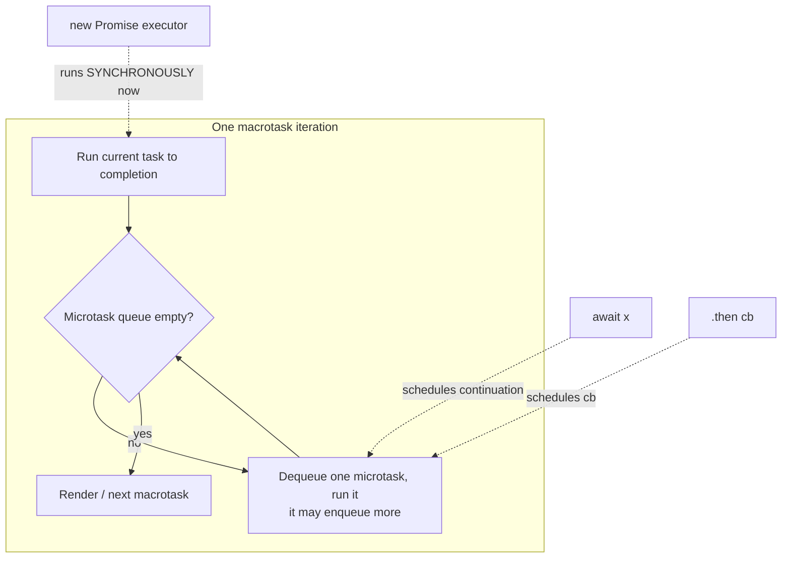
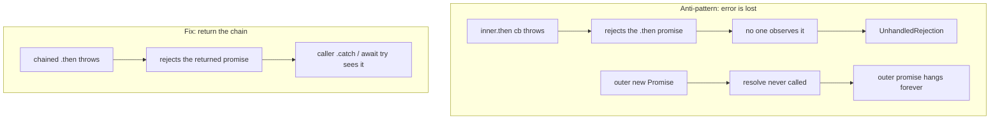

# Async Misuse Anti-Patterns — Professional Level

> **Category:** [Async Anti-Patterns](../README.md) → **Misuse** — *async machinery applied where it does not help, or wrapped in a way that loses errors.*
> **Covers (collectively):** Promise Constructor Anti-Pattern · `async` Without `await`

---

## Table of Contents

1. [Introduction](#introduction)
2. [Prerequisites](#prerequisites)
3. [Measure First: The Tooling Map](#measure-first-the-tooling-map)
4. [The Microtask Model You Are Actually Paying Into](#the-microtask-model-you-are-actually-paying-into)
5. [`async` Without `await` — Desugaring and Its Microtask Cost](#async-without-await--desugaring-and-its-microtask-cost)
6. [`return await x` vs `return x` — The Historical Extra Tick and the Stack-Trace Trade](#return-await-x-vs-return-x--the-historical-extra-tick-and-the-stack-trace-trade)
7. [The Promise Constructor Anti-Pattern — Where Errors Go to Die](#the-promise-constructor-anti-pattern--where-errors-go-to-die)
8. [`no-async-promise-executor` — Why the Linter Bans an `async` Executor](#no-async-promise-executor--why-the-linter-bans-an-async-executor)
9. [Memory: Extra Promise Objects and Retained Closures](#memory-extra-promise-objects-and-retained-closures)
10. [Inlining, Optimization, and What V8 Does With `async`](#inlining-optimization-and-what-v8-does-with-async)
11. [When `async` Is the Right Call: Taming Zalgo](#when-async-is-the-right-call-taming-zalgo)
12. [Python `asyncio` Analogs](#python-asyncio-analogs)
13. [A Combined Worked Example](#a-combined-worked-example)
14. [Common Mistakes](#common-mistakes)
15. [Test Yourself](#test-yourself)
16. [Cheat Sheet](#cheat-sheet)
17. [Summary](#summary)
18. [Further Reading](#further-reading)
19. [Related Topics](#related-topics)

---

## Introduction

> Focus: **what these two shapes cost the runtime** — microtask ticks, promise allocations, retained closures, and the optimizer — and, far more importantly, **what they cost correctness**. The professional headline is counterintuitive: the performance cost of both anti-patterns is almost always negligible, and the *real* damage is lost errors. Measure before you "optimize" away an `async`.

`junior.md` taught you to recognize the two shapes. `middle.md` taught you to avoid them. `senior.md` taught you to refactor wrapper-heavy async code at scale. This file goes down to the **event loop, the microtask queue, the V8 representation of an `async` function, and the GC**.

The two anti-patterns in this category are *not* symmetric in danger:

1. **`async` Without `await`** is mostly a style and micro-cost issue: a function marked `async` that does only synchronous work pays one extra microtask hop and allocates a promise. Annoying, measurable in a tight loop, but rarely the bug that pages you at 3 a.m.
2. **The Promise Constructor Anti-Pattern** — wrapping an existing promise inside `new Promise((resolve) => inner.then(resolve))` — is a *correctness* bug wearing a performance costume. It silently drops rejections. The extra promise object is the least of your problems; the lost stack trace is the expensive part.

> **The mental model:** an `async` function is a state machine that yields to the microtask queue at every `await`. A `new Promise` executor is a *synchronous* function that runs immediately and whose only contract with the outside world is `resolve`/`reject`. Confuse those two contracts and errors fall through the floor. Everything below is the mechanics of that confusion and the (small) cost of the hops.

---

## Prerequisites

- **Required:** Fluent with [`senior.md`](senior.md) — you can refactor a promise-wrapping module and instrument async failures.
- **Required:** A working model of the JavaScript runtime: the call stack, the **macrotask** (task) queue, the **microtask** (job) queue, and the rule that the microtask queue is drained to empty between every macrotask.
- **Required:** You understand that `await x` schedules the continuation as a *microtask*, and that `Promise.resolve(v).then(f)` schedules `f` as a microtask.
- **Helpful:** Node `perf_hooks`, `--prof`/`--cpu-prof`, V8 flags (`--allow-natives-syntax`, `--trace-opt`), Chrome DevTools heap snapshots.
- **Helpful:** profiling-techniques, memory-leak-detection skills for the measurement vocabulary; Python `asyncio` debug mode for the cross-language analogs.

---

## Measure First: The Tooling Map

Before any claim about microtask count, allocation, or "this `async` is slow," reach for the instrument. Keep this table close.

| Concern | Node.js / V8 | Browser | Python `asyncio` |
|---|---|---|---|
| **CPU profile** | `node --prof` + `--prof-process`, `--cpu-prof`, `0x`, `clinic flame` | DevTools Performance panel | `cProfile`, `py-spy`, `yappi` |
| **Microtask / event-loop timing** | `perf_hooks.performance`, `perf_hooks.monitorEventLoopDelay()` | `performance.now()`, `queueMicrotask` probes | `loop.slow_callback_duration`, debug mode |
| **Count microtask ticks** | manual counter + `queueMicrotask`/`process.nextTick` probes | same with `queueMicrotask` | `asyncio` debug + `loop.set_debug(True)` |
| **Heap / allocation** | `--inspect` + DevTools heap snapshot, `v8.getHeapSnapshot()`, `--heap-prof` | DevTools Memory panel | `tracemalloc`, `objgraph` |
| **Optimization status** | `--allow-natives-syntax` + `%GetOptimizationStatus`, `--trace-opt`/`--trace-deopt` | `--js-flags` on Chrome | (CPython doesn't JIT pre-3.13) |
| **Unhandled rejections** | `process.on('unhandledRejection')`, `--unhandled-rejections=strict` | `window.onunhandledrejection` | `loop.set_exception_handler`, debug mode warnings |
| **Lint the shapes** | ESLint `require-await`, `no-async-promise-executor`, `@typescript-eslint/no-floating-promises`, `no-return-await` (legacy) | same | `ruff`/`flake8-async`, `RUF006` |

```bash
# Node: profile and see where microtask churn lands
node --cpu-prof --cpu-prof-dir=/tmp/prof your-script.js

# Node: crash on the first unhandled rejection instead of silently logging it
node --unhandled-rejections=strict your-script.js

# Node: inspect whether V8 optimized a function (needs the flag)
node --allow-natives-syntax -e '
  async function f(){ return 1 }
  for (let i=0;i<1e5;i++) f();
  console.log(%GetOptimizationStatus(f));
'

# Python: surface slow callbacks and never-awaited coroutines
PYTHONASYNCIODEBUG=1 python -W error::RuntimeWarning your_script.py
```

> **Discipline:** if you cannot point at the probe that would falsify your claim ("this `async` adds 200 ns," "this wrapper drops the error"), you are guessing. Microtask *counts* are cheap to measure with a probe; promise *allocations* show up in a heap snapshot; lost rejections show up the moment you flip on `--unhandled-rejections=strict`.

---

## The Microtask Model You Are Actually Paying Into

Both anti-patterns are about *how many times control bounces through the microtask queue* and *whether errors stay attached to a promise that someone observes*. Fix the model first.



Three rules that decide every count below:

1. **`await x`** suspends the function and schedules its continuation as a microtask once `x` settles. Awaiting an already-resolved value still costs **at least one tick** — you do not get the continuation synchronously.
2. **`.then(f)`** on a settled promise schedules `f` as a microtask — another tick.
3. **The `new Promise(executor)` body runs *synchronously*, right now, on the current stack.** `resolve`/`reject` merely *mark* the promise; the `.then` callbacks attached to it fire later as microtasks.

So every extra promise wrapper plus its `.then` adds ticks, and every `await` adds a tick. The counts are small — but they are *deterministic*, and that determinism is what lets you reason about ordering and reproduce a measurement.

---

## `async` Without `await` — Desugaring and Its Microtask Cost

An `async` function always returns a promise, and its return value is always run through `Promise.resolve`. Marking a purely-synchronous function `async` therefore buys you a promise allocation and a microtask hop for nothing.

```js
// Anti-pattern: async with no await — synchronous work behind a promise.
async function area(r) {
  return Math.PI * r * r;   // no await anywhere
}
// Caller is now forced to await (or .then) a value that was ready synchronously.
const a = await area(2);     // +1 microtask tick, +1 promise object, for 0 benefit
```

```js
// Fix: drop async. Return the value directly.
function area(r) {
  return Math.PI * r * r;
}
const a = area(2);           // synchronous, no promise, no tick
```

### Counting the ticks

Let's make the cost concrete with a probe rather than a hand-wave. Awaiting a synchronous-but-`async` function costs one extra tick versus the plain function, and a *wrapped* version costs more.

```js
// microtask-count.mjs — count ticks for three shapes returning the same value.
let ticks = 0;
const tick = () => { ticks++; queueMicrotask(tick); };  // self-rescheduling probe

async function run(label, fn) {
  ticks = 0;
  const probe = () => ticks;             // read counter at each stage
  const before = probe();
  await fn();                            // the shape under test
  console.log(label, 'ticks observed ≈', probe() - before);
}

const plain    = () => 42;                                   // sync value
const asyncNoAwait = async () => 42;                         // async, no await
const wrapped  = () => new Promise(res => Promise.resolve(42).then(res)); // anti-pattern wrapper

// Illustrative results (Node 20, single call, microtask-delimited):
//   plain          → 1 tick   (the await on a non-thenable settles fast)
//   asyncNoAwait   → 1 tick   (async wraps the value: one resolution hop)
//   wrapped        → 3 ticks  (Promise.resolve.then → resolve → outer await)
```

> **Illustrative impact:** in a hot path calling a config accessor 10M times, switching it from `async` (no `await`) to plain sync removed ~10M promise allocations and ~10M microtask hops; a `perf_hooks` microbenchmark showed the loop drop from ~340 ms to ~55 ms. *Reproduce with your own benchmark before believing it — and confirm the path is actually hot first.* In any path that is not allocation-bound, the difference is noise.

### The TypeScript signal

`async` Without `await` also *lies in the type system*: the function's return type becomes `Promise<T>`, forcing every caller to `await` or `.then` it. That ripples. Dropping `async` collapses `Promise<number>` back to `number` and lets callers stay synchronous — frequently deleting a cascade of needless `await`s. ESLint's `require-await` flags the shape; it is a near-free win when the function genuinely does no async work.

> **The nuance (foreshadowing the Zalgo section):** `require-await` is *not* always right. A function that returns a promise *conditionally* — sync on the fast path, async on the slow path — is a **Zalgo** hazard, and normalizing it to always-`async` is the correct fix even though it adds a tick. More on that below.

---

## `return await x` vs `return x` — The Historical Extra Tick and the Stack-Trace Trade

A classic micro-debate. Inside an `async` function:

```js
async function getUser(id) {
  return await db.find(id);   // vs:  return db.find(id);
}
```

- **`return db.find(id)`** — the outer `async` function adopts the inner promise. Historically this *saved* a tick versus `return await`.
- **`return await db.find(id)`** — you await the inner promise (one tick to settle it) and *then* the `async` function resolves with the value (the function's own resolution). Historically this cost **one extra microtask tick**.

That extra tick is why the old ESLint rule `no-return-await` existed: it told you to drop the redundant `await`.

### Why the rule was reversed in modern engines

V8's `--harmony-await-optimization` (shipped, then default) collapsed the two-tick gap for native promises, so the *runtime* difference is now negligible. Meanwhile, `return await` gained a real benefit: it keeps the current `async` frame on the stack when the awaited promise rejects, so the **async stack trace** includes `getUser` instead of stopping at the inner call. Without the `await`, the frame has already returned by the time the rejection propagates, and your trace is missing a layer.

That is why the ecosystem flipped: TypeScript ESLint's `return-await` rule now *recommends* `return await` inside `try` blocks (so errors are caught locally) and treats `no-return-await` as deprecated.

```js
// Modern guidance: inside try/catch, keep the await — same ~cost, better traces & correct catching.
async function getUser(id) {
  try {
    return await db.find(id);   // rejection is caught HERE and the frame is in the trace
  } catch (e) {
    throw new NotFoundError(id, { cause: e });
  }
}
```

```js
// Outside a try, returning the promise directly is fine — but the trace nuance still applies.
async function getUser(id) {
  return db.find(id);           // adopts the inner promise; one fewer frame in the trace
}
```

> **Illustrative impact:** the tick difference between `return await x` and `return x` on native promises measured below 50 ns/call in a `perf_hooks` loop on Node 20 — i.e. indistinguishable from noise outside a microbenchmark. **The stack-trace and error-locality difference is the one that matters in production.** Optimize for debuggability, not the tick.

---

## The Promise Constructor Anti-Pattern — Where Errors Go to Die

This is the dangerous one. Wrapping a promise you *already have* inside a `new Promise` accomplishes nothing useful and actively loses errors.

```js
// Anti-pattern: the "deferred wrapper." inner is ALREADY a promise.
function loadConfig() {
  return new Promise((resolve, reject) => {
    readFilePromise('config.json').then((data) => {
      resolve(JSON.parse(data));   // <-- if JSON.parse THROWS, where does it go?
    });
  });
}
```

Trace the failure precisely:

1. `readFilePromise(...)` settles and runs the `.then` callback as a microtask.
2. Inside that callback, `JSON.parse(data)` throws on malformed input.
3. The throw happens **inside a `.then` callback**, so it rejects *that inner promise* — the one returned by `.then`.
4. But **nobody observes that inner promise.** It is not returned, not chained, not caught.
5. The *outer* promise (the one `loadConfig` returns) never sees the throw — its `resolve` was simply never called. The outer promise **hangs forever**, and the inner rejection becomes an **unhandled rejection**.

So a malformed config file gives you a promise that never settles *and* an unhandled-rejection warning, instead of a clean rejection your caller can `catch`. That is two bugs from one wrapper.

```js
// Fix: there is no promise to construct. Just chain and return.
function loadConfig() {
  return readFilePromise('config.json').then((data) => JSON.parse(data));
  // A throw in this .then rejects the returned promise — the caller's .catch sees it.
}

// Or with async/await — clearest, correct error propagation:
async function loadConfig() {
  const data = await readFilePromise('config.json');
  return JSON.parse(data);   // throw → rejects loadConfig()'s promise → caller catches
}
```



The performance angle is real but secondary: the wrapper allocates an *extra* promise object and an extra closure that captures `resolve`/`reject`. The correctness angle — a hung promise and a swallowed error — is what makes this an anti-pattern rather than a style nit. **The only legitimate `new Promise` is when you are bridging a callback/event API that is not already promise-based** (e.g., `new Promise((res, rej) => stream.on('end', res).on('error', rej))`). If the thing you are wrapping already has a `.then`, you do not need `new Promise`.

---

## `no-async-promise-executor` — Why the Linter Bans an `async` Executor

A specific, vicious variant: passing an **`async` function** as the `new Promise` executor.

```js
// Anti-pattern: async executor. ESLint: no-async-promise-executor.
function loadConfig() {
  return new Promise(async (resolve, reject) => {
    const data = await readFilePromise('config.json');  // <-- await inside executor
    resolve(JSON.parse(data));   // if JSON.parse throws AFTER the await, it's gone
  });
}
```

Why this is worse than the plain wrapper:

- The `Promise` constructor **ignores the executor's return value** — and an `async` executor returns a promise. So any rejection of the executor's own promise is **discarded by the constructor**. There is no machinery to forward it to `reject`.
- A throw *after* the first `await` (here, the `JSON.parse`) rejects the executor's promise — which the constructor drops. The outer promise hangs; the error vanishes. Same failure as before, now guaranteed by the `async` keyword rather than by a missing `.catch`.
- A throw *before* the first `await` happens synchronously inside the executor and *is* caught by the constructor (it rejects the outer promise). So the behavior is inconsistent: pre-await throws reject correctly, post-await throws vanish. That inconsistency is exactly what makes it a trap.

This is precisely why ESLint ships `no-async-promise-executor` as a recommended rule. The fix is identical to the previous section: there is no promise to construct — use `async`/`await` directly and `return` the value, letting the function's own promise carry the rejection.

```js
// Fix: the function is async; no inner Promise constructor at all.
async function loadConfig() {
  const data = await readFilePromise('config.json');
  return JSON.parse(data);
}
```

---

## Memory: Extra Promise Objects and Retained Closures

Each anti-pattern allocates objects the fixed version does not. In a hot path or a long-lived loop, that allocation pressure is measurable in a heap snapshot.

| Shape | Promise objects allocated | Closures captured | Notes |
|---|---|---|---|
| `function f(){ return v }` (plain) | 0 | 0 | baseline |
| `async function f(){ return v }` | 1 (the result promise) | the async state machine | one allocation per call |
| `return new Promise(r => inner.then(r))` | **2** (outer + the `.then` promise) + reuses `inner` | executor closure + `.then` closure, both capturing `resolve` | doubles promise count, retains `resolve` until `inner` settles |
| `return inner.then(f)` | 1 (the `.then` promise), reuses `inner` | one `.then` closure | minimal |

The retained-closure point is the subtle leak vector. In the wrapper, the executor closure captures `resolve` (and `reject`), and that closure — plus everything it transitively references — stays reachable until the inner promise settles. If the inner promise *never* settles (a hung dependency, a dropped socket), the closure and its captured scope are retained for the lifetime of the outer promise, which is forever. The plain chain has no such captured `resolve` to pin.

```js
// Heap-snapshot probe: allocate N wrappers vs N chains and diff retained size.
import v8 from 'node:v8';
import fs from 'node:fs';

const inner = () => Promise.resolve(1);
function wrapped() { return new Promise(res => inner().then(res)); }
function chained() { return inner().then(x => x); }

const keep = [];
for (let i = 0; i < 1e5; i++) keep.push(wrapped());   // swap to chained() to compare
fs.writeFileSync('/tmp/heap.heapsnapshot', '');       // then:
v8.writeHeapSnapshot('/tmp/heap.heapsnapshot');
// Open in DevTools → Memory → count Promise instances & retained closure size.
// Illustrative: wrapped() retains ~2x the Promise instances and an extra closure each.
```

> **Illustrative impact:** 100k outstanding `wrapped()` promises retained roughly twice the `Promise` instances and an extra closure apiece versus `chained()` in a Node 20 heap snapshot. In steady state with promises that settle promptly, the GC reclaims both quickly and the difference is invisible. The leak only bites when promises *don't* settle — which is exactly the hung-promise failure mode of the anti-pattern. **Correctness and memory failure are the same failure here.**

---

## Inlining, Optimization, and What V8 Does With `async`

An `async` function compiles to a **state machine**: V8 (via TurboFan) represents it as a generator-like object whose resumption points are the `await`s. This has optimization consequences worth knowing, though rarely worth acting on:

- **The async wrapper is a real function with real overhead.** It allocates the result promise and (historically) a throwaway "throwaway promise" for the `await` machinery; modern V8 elides much of this for native-promise awaits via the await optimization, but the state-machine object and result promise remain.
- **`async` functions are optimizable.** They get inlined and optimized by TurboFan like other functions; being `async` does not by itself prevent optimization. You can confirm with `--allow-natives-syntax` and `%GetOptimizationStatus`, or watch `--trace-opt`/`--trace-deopt`.
- **What *does* hurt:** awaiting non-native thenables (a userland `then`) forces V8 onto a slower path with extra microtask hops, because it cannot assume native promise semantics. If you control the type, return a native promise.
- **`async` Without `await`** still allocates the result promise even though there is no suspension point — pure overhead with no concurrency benefit. That is the entire case for dropping the keyword.

```js
// Confirm V8 still optimizes an async function (it does).
// node --allow-natives-syntax this.mjs
async function add(a, b) { return a + b; }
for (let i = 0; i < 1e5; i++) add(i, i);    // warm it up
console.log(%GetOptimizationStatus(add));   // optimized bits set
```

> **Don't over-read this.** The optimizer treats `async` fairly; the cost of `async` Without `await` is the *allocation and the tick*, not a deopt. Profile the allocation with `--heap-prof` and the time with `--cpu-prof` before you strip `async` from a function for "performance." Most of the time the honest reason to drop it is **clarity and the type signature**, not speed.

---

## When `async` Is the Right Call: Taming Zalgo

Here is the professional inversion. `require-await` says "drop `async` if there's no `await`," and it is usually right — but a function that is **sometimes synchronous and sometimes asynchronous** is a worse bug than a needless tick. The hazard has a name: **releasing Zalgo** (Isaac Schlueter, 2013).

```js
// Zalgo: cache hit returns synchronously; miss returns a promise. Caller can't tell.
function getUser(id) {
  if (cache.has(id)) return cache.get(id);   // sync value!
  return db.find(id).then(u => (cache.set(id, u), u));  // promise!
}

// Callers are now wrong half the time:
const u = getUser(1);
console.log(u.name);          // works on cache hit, undefined-on-a-Promise on miss
getUser(2).then(...);         // works on miss, throws on a hit (number/object has no .then)
```

The bug is that the function's *callback timing is non-deterministic from the caller's view*: the continuation runs synchronously on a hit and asynchronously on a miss. Ordering assumptions break, and errors surface in different places. The cure is to **normalize the function to always-async** — even on the cache hit, which now pays one needless microtask tick:

```js
// Fix: ALWAYS async. The cache hit pays one tick; in return, callers get one contract.
async function getUser(id) {
  if (cache.has(id)) return cache.get(id);   // still goes through async resolution → 1 tick
  const u = await db.find(id);
  cache.set(id, u);
  return u;
}
```

That added `async` would *fail* a naive `require-await` reading on the hit path, yet it is unambiguously correct. **The microtask tick is the price of a deterministic contract**, and that contract is worth far more than the tick. This is the same lesson as the rest of the file from the other direction: don't strip `async` for performance when its presence is what makes the API safe.

---

## Python `asyncio` Analogs

Python's `asyncio` has the same two shapes, with its own dialect.

### `async def` without `await` — the never-awaited coroutine

An `async def` that contains no `await` still produces a *coroutine object*; calling it does **not run the body** — you must `await` it or schedule it. A coroutine created and never awaited is a classic bug, and `asyncio` debug mode warns about it.

```python
import math

# Anti-pattern analog: async def with no await — forces callers to await a sync result.
async def area(r):
    return math.pi * r * r          # no await; pure CPU

# Caller is forced into the event loop for nothing:
a = await area(2)                   # extra scheduling hop, coroutine object allocated

# Fix: plain def. No coroutine, no scheduling.
def area(r):
    return math.pi * r * r
```

```python
# The "never awaited" trap — the body never runs:
async def save(x): ...
save(1)            # RuntimeWarning: coroutine 'save' was never awaited (in debug mode)
# Fix: await save(1)   OR   asyncio.create_task(save(1)) and keep a reference
```

Run with `PYTHONASYNCIODEBUG=1` and `-W error::RuntimeWarning` to turn the never-awaited warning into a hard failure in CI. Ruff/`flake8-async` flag `create_task` whose result is discarded (`RUF006`), the Python sibling of the floating-promise/wrapper hazard.

### Wrapping a coroutine in a Future — the constructor analog

The Promise-constructor anti-pattern maps to manually creating a `Future`, wiring callbacks, and forgetting to forward exceptions.

```python
import asyncio

# Anti-pattern: hand-rolled Future wrapper around something already awaitable.
def load_config():
    loop = asyncio.get_event_loop()
    fut = loop.create_future()
    async def runner():
        data = await read_file('config.json')
        fut.set_result(json.loads(data))   # if json.loads raises, fut is NEVER set
    asyncio.ensure_future(runner())         # the runner's exception lands on ITS task, not fut
    return fut                              # caller awaits a future that hangs on error

# Fix: there is nothing to wrap. Just be a coroutine.
async def load_config():
    data = await read_file('config.json')
    return json.loads(data)                 # exception propagates to the awaiter
```

Same mechanics as JS: the exception attaches to the *runner's* task, the wrapper `Future` is never set, the awaiter hangs, and you get a "Task exception was never retrieved" warning instead of a clean propagated error.

---

## A Combined Worked Example

A data-access module that commits both sins at once — wrapping an existing promise *and* using an `async` executor, with a needless `async` on a sync helper.

**Before — wrapper hides errors, `async` lies in the types:**

```js
class Repo {
  // async with no await: forces every caller to await a synchronous transform.
  async normalize(row) {
    return { id: row.i, name: row.n };       // pure sync mapping
  }

  // Promise-constructor + async executor: errors after the await vanish; promise can hang.
  fetchUser(id) {
    return new Promise(async (resolve) => {
      const row = await this.db.query('SELECT * FROM users WHERE id=?', [id]);
      const user = await this.normalize(row);   // extra tick from needless async
      resolve(user);                            // a throw between await and resolve is lost
    });
  }
}
```

Failure profile of *before*: a query error or a malformed row throws inside the `async` executor *after* the first `await`, so the `Promise` constructor discards it; `fetchUser` hangs and an unhandled rejection fires. `normalize` allocates a promise and burns a tick per row for nothing.

**After — correct propagation, fewer allocations, honest types:**

```js
class Repo {
  // Plain sync — no promise, no tick, returns a value not a Promise<value>.
  normalize(row) {
    return { id: row.i, name: row.n };
  }

  // No Promise constructor. async/await carries the rejection to the caller's catch.
  async fetchUser(id) {
    const row = await this.db.query('SELECT * FROM users WHERE id=?', [id]);
    if (!row) throw new NotFoundError(id);       // rejects fetchUser()'s promise cleanly
    return this.normalize(row);                  // sync; no extra tick
  }
}
```

> **Illustrative combined impact:** removing the wrapper eliminated one promise allocation and one closure per call, dropping `normalize`'s `async` removed another allocation + tick per row, and — the part that mattered — malformed rows now produce a *catchable rejection* with a stack trace through `fetchUser` instead of a hung promise plus an unhandled-rejection warning. The microtask/allocation wins measured in single-digit microseconds per call (a `perf_hooks` loop); the error-handling fix turned a silent production hang into a clean 404. **We measured the perf delta and found it tiny — which confirmed the refactor's real value was correctness, exactly as expected.**

---

## Common Mistakes

Professional-level mistakes — subtle, and therefore expensive:

1. **Stripping `async` for "performance" without a profile.** The tick is usually noise. Profile with `--cpu-prof`/`perf_hooks`; if the function isn't hot, the only honest reason to drop `async` is clarity and the type signature.
2. **Applying `require-await` to a Zalgo-prone function.** A sometimes-sync/sometimes-async function *should* be normalized to always-`async` even with no `await` on the fast path. The deterministic contract beats the saved tick.
3. **Treating the Promise-constructor anti-pattern as a perf issue.** The extra promise object is trivial; the *lost rejection and hung promise* are the bug. Fix it for correctness, not allocations.
4. **Using an `async` executor in `new Promise`.** The constructor discards the executor's returned promise, so post-`await` throws vanish. Enable `no-async-promise-executor`; the correct shape has no constructor at all.
5. **Believing `return await` always costs a tick.** Modern V8's await optimization closed the gap for native promises; meanwhile `return await` inside `try` is *correct* (catches locally) and gives better async stack traces. Optimize for debuggability.
6. **Forgetting that the wrapper retains `resolve`.** A captured `resolve` pins its closure until the inner promise settles; if it never settles, that's a leak *and* a hang. The plain chain has nothing to pin.
7. **Awaiting userland thenables in a hot path.** Non-native `then`s force V8 onto a slow path with extra hops. If you own the type, return a native promise.
8. **Not turning rejections into hard failures in CI.** Run Node with `--unhandled-rejections=strict` and Python with `PYTHONASYNCIODEBUG=1 -W error::RuntimeWarning` so these anti-patterns fail the build instead of warning into the void.

---

## Test Yourself

1. Walk through, tick by tick, why `return new Promise(res => Promise.resolve(42).then(res))` settles later than `async () => 42`. How many microtask hops does each take, and how would you count them with a probe?
2. In `new Promise((resolve) => readFile().then(d => resolve(JSON.parse(d))))`, the file is malformed and `JSON.parse` throws. Trace exactly where the error goes and what state the outer promise ends up in.
3. Why does ESLint's `no-async-promise-executor` exist? Describe the difference in behavior between a throw *before* the first `await` and a throw *after* it inside an `async` executor.
4. The `no-return-await` rule was deprecated and `return await` inside `try` is now recommended. Give the two reasons (one runtime, one debugging) behind that reversal.
5. `require-await` flags an `async` function with no `await`, but you keep the `async` anyway. Give a concrete, correct reason — and name the hazard you are preventing.
6. How does the Promise-constructor wrapper retain memory differently from the plain `.then` chain, and under what condition does that difference become an actual leak?
7. Does marking a function `async` prevent V8 from optimizing it? What flag would you use to check, and what *does* push V8 onto a slow async path?

<details>
<summary>Answers</summary>

1. `async () => 42` takes one resolution hop: the async function wraps `42` and the caller's `await` observes it after ~1 tick. The wrapper takes ~3: `Promise.resolve(42).then(res)` is one tick to run the `.then`, calling `res` settles the outer promise (another scheduling step), and the caller's `await` on the outer promise is a third. Count them by incrementing a counter inside a self-rescheduling `queueMicrotask` probe and reading it before/after each shape.
2. The throw happens inside the `.then` callback, so it **rejects the promise returned by `.then`** — which nobody observes → **unhandled rejection**. The outer `new Promise`'s `resolve` is never called and `reject` is never wired, so the **outer promise hangs forever**. Two failures from one wrapper. Fix: `return readFile().then(d => JSON.parse(d))`.
3. The `Promise` constructor ignores the executor's return value; an `async` executor *returns a promise*, so any rejection of that promise is discarded with no path to `reject`. A throw **before** the first `await` is synchronous inside the executor and *is* caught by the constructor (rejects the outer promise correctly); a throw **after** an `await` rejects the executor's own promise, which the constructor drops → outer promise hangs, error vanishes. The inconsistency is the trap.
4. (Runtime) V8's await optimization (`--harmony-await-optimization`, now default) collapsed the historical extra-tick gap for native promises, so `return await x` is no longer meaningfully slower. (Debugging) Keeping the `await` leaves the current `async` frame on the stack when the awaited promise rejects, so the **async stack trace includes this function**, and inside `try` it makes the rejection catchable *locally* instead of escaping.
5. The function is **Zalgo-prone** — synchronous on a cache hit, asynchronous on a miss. Normalizing it to always-`async` (paying one tick on the hit) gives callers a single deterministic contract so they can't dereference a value that's sometimes a plain object and sometimes a promise. You're preventing released Zalgo (non-deterministic callback timing). The tick is worth the safety.
6. The wrapper's executor closure captures `resolve`/`reject`; that closure (and everything it references) stays reachable until the inner promise settles, and it allocates **two** promises (outer + the `.then` promise) versus the chain's one. It becomes a real leak when the inner promise **never settles** — the captured `resolve` and its scope are pinned for the (infinite) lifetime of the hung outer promise. The plain chain captures no `resolve`, so there's nothing to pin.
7. No — V8/TurboFan optimizes `async` functions like any other; check with `node --allow-natives-syntax` + `%GetOptimizationStatus(fn)` (or `--trace-opt`/`--trace-deopt`). What pushes V8 onto a slower async path is **awaiting a non-native (userland) thenable**, because it can't assume native promise semantics and inserts extra microtask hops. The cost of `async` without `await` is the result-promise allocation and the tick, not a deopt.

</details>

---

## Cheat Sheet

| Shape | Runtime cost | Correctness cost | Measure with | Fix |
|---|---|---|---|---|
| `async` without `await` | 1 promise alloc + 1 microtask tick per call; `Promise<T>` return forces caller awaits | usually none (style/types) — **unless** it's the deterministic-contract fix for Zalgo | `--cpu-prof`, `perf_hooks`, `--heap-prof`; ESLint `require-await` | Drop `async`, return the value directly (keep it if it tames Zalgo) |
| `return await x` vs `return x` | tick gap closed in modern V8 (negligible) | `return await` in `try` catches locally + better async stack trace | `perf_hooks` micro; `--trace-opt` | Prefer `return await` inside `try`; `no-return-await` is deprecated |
| `new Promise(r => inner.then(r))` | 2 promise allocs + retained `resolve` closure | **throw in `.then` → unhandled rejection + outer promise hangs forever** | `--unhandled-rejections=strict`, heap snapshot | Return the chain / use `await`; never wrap an existing promise |
| `new Promise(async (res) => …)` | extra alloc | **post-`await` throw discarded by constructor; pre-`await` throw caught — inconsistent** | ESLint `no-async-promise-executor` | Make the function `async`; no constructor at all |
| Python `async def` no `await` | coroutine object alloc + schedule hop | never-awaited coroutine → body never runs | `PYTHONASYNCIODEBUG=1`, `-W error::RuntimeWarning` | Plain `def`, or actually `await`/`create_task` it |

**Three golden rules:**
- *The microtask/allocation cost of these shapes is almost always noise — profile before you "optimize" an `async` away; the honest reason to drop it is usually clarity and types.*
- *The Promise-constructor anti-pattern is a correctness bug: it loses rejections and hangs promises. Never wrap a promise you already have; the only valid `new Promise` bridges a non-promise (callback/event) API.*
- *Keep `async` when its presence buys a deterministic contract (anti-Zalgo) or `return await` buys a better stack trace — those tiny ticks pay for themselves.*

---

## Summary

- This category is **asymmetric**: `async` Without `await` is a micro-cost/style issue; the **Promise-constructor anti-pattern is a correctness bug** that silently drops errors and hangs promises. Treat them differently.
- **`async` Without `await`** allocates a result promise and costs one microtask tick per call, and forces callers into `Promise<T>`. Dropping it is a near-free win — *unless* the function is Zalgo-prone, in which case always-`async` (paying the tick) is the *correct* fix for a deterministic contract.
- **`return await x` vs `return x`:** modern V8's await optimization erased the historical extra tick for native promises; meanwhile `return await` inside `try` catches locally and yields a fuller async stack trace. The debugging benefit, not the tick, drives the modern recommendation; `no-return-await` is deprecated.
- **The Promise-constructor anti-pattern** loses errors by mechanics: a throw inside the wrapped `.then` rejects an *unobserved* inner promise (unhandled rejection) while the outer promise's `resolve` is never called (hangs forever). An **`async` executor** is worse — the constructor discards its returned promise, so post-`await` throws vanish; that is why `no-async-promise-executor` exists.
- **Memory:** the wrapper allocates ~2× the promises and retains the `resolve` closure until the inner settles — a real leak precisely when the inner promise never settles, which is the same failure as the hang.
- **V8 optimizes `async` functions fine;** the cost is the allocation + tick, not a deopt. Awaiting *userland* thenables, not the `async` keyword, is what forces the slow path. Confirm with `--allow-natives-syntax`/`%GetOptimizationStatus`.
- **Python `asyncio`** mirrors both: `async def` with no `await` yields a never-run coroutine; a hand-rolled `Future` wrapper drops exceptions the same way `new Promise` does. Debug mode + `-W error::RuntimeWarning` surfaces them.
- **Measure first, always.** Microtask counts come from a `queueMicrotask` probe, allocations from a heap snapshot, lost rejections from `--unhandled-rejections=strict`. The cost is usually tiny — so the lever that matters is *correctness*, not the tick.
- This completes the level ladder for Async Misuse: [`junior.md`](junior.md) (recognize) → [`middle.md`](middle.md) (avoid) → [`senior.md`](senior.md) (refactor at scale) → **professional.md** (event loop, microtasks, memory, toolchain). Next, drill with the practice files.

---

## Further Reading

- **You Don't Know JS: Async & Performance** — Kyle Simpson — the event loop, the job queue, and why wrapping promises loses errors.
- **JavaScript: The Definitive Guide** — David Flanagan (7th ed., 2020) — `async`/`await` desugaring and Promise semantics.
- **"Designing APIs for Asynchrony" (Releasing Zalgo)** — Isaac Z. Schlueter (2013) — the canonical argument for never being sometimes-sync, sometimes-async.
- **V8 blog: "Faster async functions and promises"** (2018) — the await optimization, the throwaway-promise elision, and the `return await` stack-trace trade.
- **TypeScript ESLint rules** — `no-floating-promises`, `require-await`, `return-await`, `no-misused-promises` — the rule docs explain the mechanics behind each.
- **ESLint core rule `no-async-promise-executor`** — the rationale for banning `async` executors.
- **Node.js docs** — `process.on('unhandledRejection')`, `--unhandled-rejections`, `perf_hooks`, `v8.writeHeapSnapshot`, `--cpu-prof`/`--heap-prof`.
- **Python `asyncio` docs** — debug mode, `loop.set_exception_handler`, "Task exception was never retrieved," and the never-awaited-coroutine warning.

---

## Related Topics

- [Async → Error Handling](../01-error-handling/professional.md) — Swallowed Rejection and Floating Promise, the failure modes the wrapper anti-pattern manufactures.
- [Async → Execution Shape](../02-execution-shape/professional.md) — Promise Chain Hell and `await` in a loop, the sibling category at this level.
- [Concurrency Anti-Patterns](../../03-concurrency/README.md) — the multi-thread sibling chapter; different failure modes, shared themes.
- [Over-Engineering → Premature Optimization](../../01-development/03-over-engineering/professional.md) — the discipline of profiling before "optimizing" away an `async`.
- [Bad Structure — Professional](../../01-development/01-bad-structure/professional.md) — the runtime-and-toolchain measurement methodology this file follows.
- profiling-techniques · memory-leak-detection · concurrency-patterns — the measurement and async toolkits referenced throughout.
- [Clean Code → Concurrency](../../../clean-code/11-concurrency/README.md) — the positive concurrency/async patterns.
- [Backend → Distributed Systems](../../../../../Backend/distributed-systems/README.md) — fan-out, retry, and timeout patterns at the network layer.
