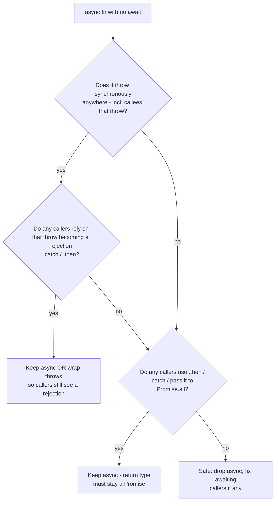

# Async Misuse Anti-Patterns — Senior Level

> **Category:** [Async Anti-Patterns](../README.md) → **Misuse** — *async machinery applied where it doesn't help, in ways that quietly lose errors.*
> **Covers (collectively):** Promise Constructor Anti-Pattern · `async` Without `await`

---

## Table of Contents

1. [Introduction](#introduction)
2. [Prerequisites](#prerequisites)
3. [How Did the Codebase Get Here? — Root-Cause Forces](#how-did-the-codebase-get-here--root-cause-forces)
4. [The Promise Constructor Anti-Pattern at Scale](#the-promise-constructor-anti-pattern-at-scale)
5. [Building the Bridge Once: A Hardened `eventToPromise` Utility](#building-the-bridge-once-a-hardened-eventtopromise-utility)
6. [`async` Without `await`: Reasoning About Semantic Effects](#async-without-await-reasoning-about-semantic-effects)
7. [When Each Construct Is Legitimately Needed](#when-each-construct-is-legitimately-needed)
8. [Eradicating Both at Scale: Lint Gates, Codemods, Review](#eradicating-both-at-scale-lint-gates-codemods-review)
9. [Python `asyncio` Analogs](#python-asyncio-analogs)
10. [When NOT to Change It](#when-not-to-change-it)
11. [Common Mistakes](#common-mistakes)
12. [Test Yourself](#test-yourself)
13. [Cheat Sheet](#cheat-sheet)
14. [Summary](#summary)
15. [Further Reading](#further-reading)
16. [Related Topics](#related-topics)

---

## Introduction

> Focus: **How did the codebase fill up with hand-rolled `new Promise` wrappers and decorative `async`? How do I remove them safely without changing behavior?**

The junior file taught you to *recognize* these two shapes; the middle file taught you to *rewrite* a single instance correctly. This file is about the situation you inherit as a senior: there are **300 hand-rolled `new Promise` wrappers** across the codebase, a third of them swallow errors, half the service's functions are marked `async` "to be safe," and the team has been copy-pasting a subtly broken `promisify` for two years. You cannot fix this one PR at a time forever, and a careless global rewrite will change behavior in ways that surface as a production incident three weeks later.

Two questions define the work:

1. **How did it get this way?** Both anti-patterns are the deterministic output of a *missing shared utility* plus a *cargo-culted habit*. Nobody built one well-tested promise-bridge, so everyone hand-rolls `new Promise` at every callback/event boundary — and most get the error path wrong. Nobody articulated what `async` *costs*, so it became a reflexive decoration. The fix is not 300 local edits; it is **one hardened utility, a lint gate that forbids the hand-roll, and a codemod that migrates the rest.**

2. **How do I change it without changing behavior?** `async` is not a no-op keyword. It wraps the return value in a Promise, converts a *synchronous* throw into a *rejection*, and inserts an extra microtask hop. Removing it (or adding it) can change *when* and *how* an error is observed. A senior refactor here is exact: you reason about return-wrapping, sync-throw-to-rejection, and microtask timing *before* you touch the keyword, so the diff is behavior-preserving by construction.

> **The senior mindset shift:** the junior asks "is this `new Promise` necessary?"; the senior asks "what is the *failure mode at scale* of this habit, what one utility eliminates the whole class, and what is the smallest behavior-preserving migration?" You are not fixing a wrapper — you are eradicating a category and codifying the convention so it stays dead.

---

## Prerequisites

- **Required:** Fluency with [`junior.md`](junior.md) and [`middle.md`](middle.md) — you can spot a redundant `new Promise(r => p.then(r))` and an `async` function with no `await`, and rewrite either one in isolation.
- **Required:** You understand the microtask queue well enough to predict the order of `.then` callbacks vs `setTimeout`, and you have owned an unhandled-rejection incident.
- **Helpful:** Working ESLint/`typescript-eslint` config you can extend with rules and CI gates; experience writing or running a codemod (jscodeshift / ts-morph / `comby`).
- **Helpful:** Familiarity with the "releasing Zalgo" hazard — APIs that are *sometimes* synchronous and *sometimes* asynchronous.
- **Helpful:** Python `asyncio` basics (coroutines, `Future`, `loop.call_soon`) for the cross-language section.

---

## How Did the Codebase Get Here? — Root-Cause Forces

Before touching 300 call sites, understand the forces, because the same forces will refill the codebase if they persist.

### No shared bridging utility

The single largest cause. There is exactly one *correct* way to bridge a callback or event API into a Promise, and it is fiddly: settle once, attach the success and error listeners, and **remove every listener on settle** so you don't leak. When no team-owned helper exists, every engineer re-derives it under deadline pressure and most stop at the happy path — `new Promise(resolve => emitter.on('done', resolve))` with no `error` listener, no `removeListener`, no timeout. A codebase full of redundant and broken `new Promise` is the negative space left by an absent `promisify`/`eventToPromise`.

### Cargo-culted `async`

`async` became a reflex — "this is in the service layer, service methods are `async`." The keyword reads as a *category marker* ("this is async-ish code") rather than a *semantic operator* (this function returns a Promise and turns sync throws into rejections). So it gets stamped onto pure-synchronous helpers that pay a microtask hop and mislead every reader into adding a needless `await`.

### "Wrap it to be safe"

Engineers wrap an *existing* Promise in `new Promise` because they don't trust that returning it directly "works," or because they want a place to "add error handling later." The wrapper then loses errors precisely because the inner `.then(resolve)` has no paired `.catch(reject)` — the very error handling it was supposed to enable.

### The microtask is invisible

Unlike a slow query, the cost of a spurious `async` (one extra microtask drain) and the *error-loss* of a bad `new Promise` are invisible in normal testing. They surface only under load (microtask churn) or on the rare error path (the rejection that vanished). Invisible costs don't get cleaned up — until an incident makes them visible.

```mermaid
graph TD
    NSU[No shared bridging utility] --> PCA[Hand-rolled new Promise everywhere]
    PCA --> EL[Error-loss / unhandled rejection]
    PCA --> LEAK[Listener leaks - no cleanup]
    CC[Cargo-culted async as a category marker] --> AWA[async without await]
    WTS[Wrap-it-to-be-safe distrust] --> PCA
    INV[Microtask cost + lost error invisible] -. "no feedback signal" .-> PCA
    INV -. .-> AWA
```

The practical takeaway: **name the force, not just the smell.** "Remove the redundant Promises" is a wish that regrows. "Ship one hardened `eventToPromise`/`promisify`, turn on `no-async-promise-executor` + `require-await` as errors, and codemod the existing 300 wrappers" is a plan that stays fixed.

---

## The Promise Constructor Anti-Pattern at Scale

The anti-pattern has two distinct failure modes, and seniors must separate them because the cures differ.

### Failure mode 1 — the redundant wrap (style, mostly harmless)

```ts
// ANTI-PATTERN: wrapping an existing Promise in a new Promise for no reason.
function getUser(id: string): Promise<User> {
  return new Promise((resolve, reject) => {
    fetchUser(id).then(resolve).catch(reject);   // a verbose identity function
  });
}

// CORRECT: just return the Promise. fetchUser already is one.
function getUser(id: string): Promise<User> {
  return fetchUser(id);
}
```

This one *usually* works — but it is fragile: forget the `.catch(reject)` and the rejection is lost (mode 2). It also adds a Promise allocation and a microtask for nothing.

### Failure mode 2 — error loss and unhandled rejections (the dangerous one)

The constructor executor runs **synchronously** and is *not* wrapped in a try/catch that routes to `reject`. Two ways errors vanish:

```ts
// BUG A: a throw inside the executor that happens AFTER an await/async boundary
// is NOT caught — it becomes an unhandled rejection or is silently dropped.
new Promise(async (resolve, reject) => {   // <-- async executor: the smell
  const data = await loadData();           // if this rejects, NOTHING catches it.
  resolve(transform(data));                // transform throwing is also lost.
});

// BUG B: forgot to wire the error path. The inner rejection has no observer.
new Promise((resolve) => {
  doRiskyAsync().then(resolve);            // rejection -> floating, unhandled.
});
```

The `async` *executor* (Bug A) is the canonical disaster: the executor's return value (a Promise) is ignored by the constructor, so any rejection inside it has **no path to `reject`**. This is exactly what the `no-async-promise-executor` ESLint rule exists to forbid — and at scale, turning that rule from `warn` to `error` is the single highest-leverage gate against this whole family.

### The scale picture

At one site this is a code-review nit. At 300 sites it is a *reliability liability*: a meaningful fraction silently swallow errors, and each is a candidate `unhandledRejection` that — depending on runtime config — either logs nothing or crashes the process. The senior move is to treat it as a **category to eradicate**, not a list of nits to comment on:

1. **Measure.** Grep/AST-count the occurrences and classify them (redundant-wrap vs genuine-bridge vs async-executor). `grep -rn 'new Promise' src | wc -l` is the crude version; an AST query (ts-morph) that finds `NewExpression` with identifier `Promise` is the accurate one.
2. **Gate the inflow.** `no-async-promise-executor: error` and a custom rule (or review norm) banning `new Promise` outside the one blessed utility module.
3. **Drain the backlog.** Codemod the redundant wraps (mechanical), and replace the genuine bridges with the shared utility (semi-mechanical, reviewed).

---

## Building the Bridge Once: A Hardened `eventToPromise` Utility

The legitimate need behind most `new Promise` calls is **bridging a non-Promise API** (a callback, an event emitter, a `MessagePort`) into a Promise. The senior solution is to build *one* utility that gets the hard parts right — settle-once, error wiring, **cleanup**, cancellation, timeout — and forbid the hand-roll everywhere else.

### What "correct" requires (the checklist the hand-roll always misses)

- **Settle once.** A Promise can only settle once; subsequent `resolve`/`reject` are no-ops, but the *listeners* keep firing and the *work* keeps running unless you stop it.
- **Wire the error path.** Every success listener needs a paired error listener (`'error'`, or the callback's `err` arg).
- **Remove listeners on settle.** Otherwise every call leaks a listener on a long-lived emitter → a slow memory leak and `MaxListenersExceededWarning`.
- **Support a timeout.** A bridged event that never fires must not hang forever.
- **Support cancellation.** An `AbortSignal` lets the caller stop waiting (and triggers cleanup).

```ts
// The ONE blessed bridge. Build it once, test it hard, ban new Promise elsewhere.
export interface EventToPromiseOptions {
  errorEvent?: string;          // default 'error'
  timeoutMs?: number;
  signal?: AbortSignal;
}

export function eventToPromise<T = unknown>(
  emitter: NodeJS.EventEmitter,
  successEvent: string,
  { errorEvent = 'error', timeoutMs, signal }: EventToPromiseOptions = {},
): Promise<T> {
  // Reject synchronously if the signal is already aborted — no wasted listeners.
  if (signal?.aborted) {
    return Promise.reject(signal.reason ?? new Error('aborted'));
  }

  return new Promise<T>((resolve, reject) => {
    // Single cleanup path — the part hand-rolls forget. Removes EVERY listener
    // and clears the timer, so settling once truly stops everything.
    let timer: NodeJS.Timeout | undefined;
    const cleanup = () => {
      emitter.off(successEvent, onSuccess);
      emitter.off(errorEvent, onError);
      signal?.removeEventListener('abort', onAbort);
      if (timer) clearTimeout(timer);
    };
    const onSuccess = (value: T) => { cleanup(); resolve(value); };
    const onError   = (err: unknown) => { cleanup(); reject(err); };
    const onAbort   = () => { cleanup(); reject(signal!.reason ?? new Error('aborted')); };

    emitter.once(successEvent, onSuccess);
    emitter.once(errorEvent, onError);
    signal?.addEventListener('abort', onAbort, { once: true });
    if (timeoutMs != null) {
      timer = setTimeout(() => {
        cleanup();
        reject(new Error(`timed out after ${timeoutMs}ms waiting for "${successEvent}"`));
      }, timeoutMs);
    }
  });
}
```

This is the *only* place `new Promise` is allowed to live. Every call site that used to hand-roll `new Promise(r => emitter.on('done', r))` becomes `await eventToPromise(emitter, 'done', { timeoutMs: 5_000, signal })` — correct error path, cleanup, timeout, and cancellation for free.

### The callback analog: prefer the platform `promisify`

For Node-style `(err, value)` callbacks, **do not hand-roll** — `util.promisify` already handles the settle-once and error wiring:

```ts
import { promisify } from 'node:util';
const readFile = promisify(fs.readFile);   // correct error path, once, no leak.
```

A hand-rolled callback bridge is only justified when the API is *not* `(err, value)`-shaped (e.g. `(value)`-only, or multi-arg). Even then, wrap that one-off in your utility module behind a named function, tested once — never inline at the call site.

> **The discipline:** the error-loss failure mode of the Promise constructor is *eradicated structurally* by having exactly one tested bridge with a single `cleanup()` path and a wired `reject`. The lint gate (next section) is what keeps engineers from re-introducing the hand-roll the utility was built to replace.

---

## `async` Without `await`: Reasoning About Semantic Effects

`async` is not decoration. Before you add or remove it in a refactor, you must be able to state its three semantic effects precisely, because each one can change observable behavior.

### The three effects

1. **Return-value wrapping.** An `async` function *always* returns a Promise. `return 42` becomes `Promise.resolve(42)`; `return aPromise` is *adopted* (flattened, not double-wrapped). Removing `async` from a function whose callers `await` it is safe — `await 42` is `42` — but removing it from a function whose callers do `.then()` breaks them, because a plain `42` has no `.then`.

2. **Sync-throw → rejection.** Inside an `async` function, a synchronous `throw` produces a *rejected Promise*, not a thrown exception. This is the subtle one:

```ts
// async: the throw becomes a REJECTION. Caller must .catch()/try-await.
async function parseA(s: string): Promise<Obj> {
  if (!s) throw new Error('empty');   // -> rejected Promise
  return JSON.parse(s);               // JSON.parse throwing -> rejected Promise too
}

// non-async: the throw is SYNCHRONOUS. Caller must try/catch around the call.
function parseB(s: string): Obj {
  if (!s) throw new Error('empty');   // -> thrown synchronously
  return JSON.parse(s);
}
```

If you strip `async` from `parseA`, every `try/await parseA()` still catches the throw — but any caller that did `parseA(s).catch(...)` now sees a **synchronous exception that bypasses `.catch`** and may crash. The error *moved in time*.

3. **The extra microtask.** An `async` function with no `await` still resumes on a microtask after its synchronous body. This is observable: it changes the *ordering* relative to other microtasks and is pure overhead when there is no async work.

```ts
// Pure-sync work behind a needless async: pays a microtask, misleads readers.
async function fullName(u: User): Promise<string> {  // no await anywhere
  return `${u.first} ${u.last}`;
}
// Cure: drop async. Callers that `await fullName(u)` still work (await on a
// non-Promise is a no-op that costs... one microtask. So fix the callers too.)
function fullName(u: User): string {
  return `${u.first} ${u.last}`;
}
```

### The behavior-preserving refactor rule

Removing a redundant `async` is **only** safe when you have checked all three:



The trap is `require-await`'s naive fix: the rule flags an `async` with no `await` and an autofixer or a hasty engineer just deletes the keyword. That is correct *only* in the bottom-right leaf of this flowchart. A senior wires `require-await` as a *signal to investigate*, not as an autofix.

> **`no-return-await` nuance.** `return await x` inside an `async` function used to be called a redundant extra microtask — and the old `no-return-await` rule removed it. But `return await x` inside a `try` block is **necessary**: without the `await`, the function returns the Promise and the surrounding `try/catch` cannot catch its rejection (the `try` has already exited). Modern guidance (and the `@typescript-eslint/return-await` rule with `in-try-catch`) keeps `return await` exactly where the try/catch needs it. Do not blanket-strip `return await`.

---

## When Each Construct Is Legitimately Needed

Eradicating an anti-pattern means knowing its *legitimate* twin, so the lint gate has correct exceptions.

### `new Promise` is legitimate when…

- **Bridging a genuinely non-Promise API** — a callback, an event emitter, a timer, a `MessagePort`, a DOM event, an FFI handle. This is the *only* real reason, and it belongs inside your shared bridge utility, not inline. `setTimeout` → `delay(ms)`, `emitter` → `eventToPromise`, `(err, v)` callback → `promisify`.
- **Deferred / externally-resolved promises** — a `Deferred` whose `resolve`/`reject` are stored and called later by some other code path (a request/response correlation map, a one-shot signal). This too lives in a tested helper.

It is **never** legitimate to wrap an *existing* Promise in `new Promise`. If you already hold a Promise, return it or `await` it.

### `async` is legitimate when…

- **You `await` something.** The obvious case.
- **You want to normalize a sometimes-sync / sometimes-async API into *always* async — avoiding "releasing Zalgo."** This is the subtle, *correct* use of an `async` with no `await`:

```ts
// "Releasing Zalgo": this function calls back synchronously on a cache hit and
// asynchronously on a miss. Callers can't reason about ordering -> bugs.
function getConfig(key: string, cb: (v: string) => void) {
  if (cache.has(key)) cb(cache.get(key)!);              // SYNC path
  else loadFromDisk(key).then(v => { cache.set(key, v); cb(v); }); // ASYNC path
}

// FIX: an async function guarantees the callback/return is ALWAYS asynchronous.
// Here the `async` with a sync-returning body is INTENTIONAL and correct: it
// normalizes the contract. require-await would flag it — this is a real exception.
async function getConfig(key: string): Promise<string> {
  if (cache.has(key)) return cache.get(key)!;   // still resolves on a microtask
  const v = await loadFromDisk(key);
  cache.set(key, v);
  return v;
}
```

The first `getConfig` "releases Zalgo": a function that is sometimes synchronous and sometimes asynchronous is a notorious source of order-dependent bugs. Making it *uniformly* async — even when one branch has no real async work — is the cure. When you hit a `require-await` warning, this is the case to recognize and exempt (with a comment), not delete.

---

## Eradicating Both at Scale: Lint Gates, Codemods, Review

The durable fix is automation that outlasts the engineer who cares.

### Lint gates (the inflow valve)

```jsonc
// .eslintrc — turn the relevant rules from warn to error in CI.
{
  "rules": {
    // Bans `new Promise(async (res, rej) => ...)` — the error-loss disaster.
    "no-async-promise-executor": "error",

    // Flags `async` functions with no `await`. NOT an autofix — a signal to
    // investigate (could be the legitimate Zalgo-normalizing case).
    "require-await": "warn",

    // Keep `return await` where a try/catch needs it; remove it elsewhere.
    "@typescript-eslint/return-await": ["error", "in-try-catch"],

    // Floating/unhandled promises — the runtime consequence of bad bridges.
    "@typescript-eslint/no-floating-promises": "error"
  }
}
```

A custom flat-config rule (or a `no-restricted-syntax` entry) can ban bare `new Promise` outside your `async-utils` module, pointing offenders at `eventToPromise`/`promisify`:

```jsonc
"no-restricted-syntax": ["error", {
  "selector": "NewExpression[callee.name='Promise']",
  "message": "Don't hand-roll new Promise. Use eventToPromise/promisify from @lib/async-utils."
}]
// (Then disable this rule, file-locally, inside async-utils itself.)
```

### Runtime safety net

Regardless of the lint state, install a process-level handler so a *lost* rejection is at least observable, never silent:

```ts
process.on('unhandledRejection', (reason) => {
  metrics.inc('unhandled_rejection');
  log.error('unhandled rejection', { reason });
  // In strict mode you may choose to crash; in a service, log + alert and let
  // the orchestrator decide. The point is: it is never invisible.
});
```

### Codemod the backlog (the outflow drain)

The redundant-wrap form is mechanically rewritable. With `ts-morph`/jscodeshift, find `new Promise((resolve, reject) => p.then(resolve).catch(reject))` and replace with `p`; find `new Promise(resolve => p.then(resolve))` and (after confirming the inner Promise's rejection is handled elsewhere or surfacing it) replace with `p`. The *genuine bridges* are not mechanical — route them to the shared utility in reviewed PRs, classified by hand. Run the codemod in **small, per-package commits** so any behavior change is bisectable, and rely on the test suite plus the `unhandledRejection` metric to catch a wrap whose `.catch(reject)` was load-bearing.

### Review norms and codified convention

- **One async-utils module, owned.** Put `eventToPromise`, `delay`, `Deferred`, and the `promisify` re-export in one owned file; `CODEOWNERS` it to the platform team. New bridges land there with tests, not inline.
- **ADR for the convention.** "We do not hand-roll `new Promise`; `async` means *this awaits something or deliberately normalizes to async*." Written down, it answers the next engineer's "why is this lint rule on?"
- **`require-await` exceptions are commented.** A legitimate Zalgo-normalizing `async` carries `// eslint-disable-next-line require-await -- normalize to always-async (no Zalgo)`, so the exception is intentional and reviewable, not noise.

---

## Python `asyncio` Analogs

The same two shapes appear in `asyncio`, with Python-specific spellings.

### "Promise constructor" → manual `Future` wiring

The Python analog of `new Promise` is creating a bare `asyncio.Future` and wiring callbacks by hand. The redundant-wrap and error-loss modes both recur:

```python
import asyncio

# ANTI-PATTERN: wrapping an existing awaitable in a manual Future for no reason,
# and (worse) forgetting to propagate the exception.
async def get_user_bad(uid: str):
    fut = asyncio.get_event_loop().create_future()
    async def run():
        result = await fetch_user(uid)   # if this raises, the Future is never
        fut.set_result(result)           # set -> the awaiter hangs forever.
    asyncio.ensure_future(run())         # the task's exception is also orphaned
    return await fut

# CORRECT: just await the coroutine. No manual Future.
async def get_user_good(uid: str):
    return await fetch_user(uid)
```

The legitimate use of a manual `Future` is the same as `new Promise`: **bridging a callback/event API**. The platform gives you `loop.run_in_executor` for blocking calls and `Future` for true callback bridges — wrap them once:

```python
# The blessed bridge for a callback-style API. Settle once, propagate errors,
# support a timeout. (asyncio.wait_for adds the timeout + cancellation.)
async def event_to_future(register, *, timeout=None):
    loop = asyncio.get_running_loop()
    fut = loop.create_future()
    def on_done(value=None, error=None):
        if fut.done():
            return                       # settle-once guard
        if error is not None:
            fut.set_exception(error)
        else:
            fut.set_result(value)
    register(on_done)                    # caller wires the callback API to on_done
    return await (asyncio.wait_for(fut, timeout) if timeout else fut)
```

### "`async` without `await`" → `async def` with no `await`

An `async def` with no `await` is still a coroutine: calling it returns a *coroutine object* that does nothing until awaited (and emits a `RuntimeWarning: coroutine was never awaited` if dropped). The fix mirrors JS — make it a plain `def` unless you are deliberately normalizing to a coroutine contract:

```python
# Needless coroutine: no await, pays a scheduling hop, misleads callers.
async def full_name(u):           # no await
    return f"{u.first} {u.last}"

# Cure: a plain function. Callers stop needing `await`.
def full_name(u):
    return f"{u.first} {u.last}"
```

The Zalgo-normalizing exception applies here too: keeping `async def` with a synchronous body is correct when you must guarantee a coroutine return type across a sometimes-sync/sometimes-async boundary. There is no `require-await` in stock linters, but `flake8-async` / `ruff`'s async rules and a code-review norm play the same role.

---

## When NOT to Change It

The senior skill juniors lack: knowing when to leave the smell alone.

- **A `new Promise` that is a genuine bridge.** It is *supposed* to use the constructor (callback/event API). Don't "fix" it into a broken `await` of a non-Promise. The cure is to move it into the shared utility, and even that is optional for a one-off in cold code.
- **An `async` with no `await` that normalizes a sometimes-sync API.** This is the legitimate Zalgo cure. Deleting `async` here *reintroduces* a real bug. Comment it and move on.
- **`return await` inside `try/catch`.** It is load-bearing for error propagation. Do not strip it.
- **Cold, stable, single-call code.** A redundant `async` on a startup helper called once costs one microtask, once. The migration risk and reviewer time exceed the benefit. Spend the codemod budget on hot, high-fan-in paths.
- **No safety net.** If a `new Promise` site has no test and you can't tell whether its missing `.catch` is load-bearing, do not blindly codemod it. Add the `unhandledRejection` metric, watch a business cycle, then migrate with evidence.

> **The frame:** removing these is risk-adjusted investment in *correctness and clarity*, not virtue. The payoff is fewer silent rejections and code that reads like it runs. Where there's no payoff — genuine bridges, Zalgo cures, cold code — leave it.

---

## Common Mistakes

1. **Autofixing `require-await` by blindly deleting `async`.** Breaks callers that `.then()` the result and converts deliberate sync-throw-to-rejection into an uncaught synchronous throw. *Treat the rule as a signal to investigate, not an autofix; walk the three-effects flowchart.*
2. **Blanket-stripping `return await`.** Inside `try/catch`, the `await` is what lets the `catch` see the rejection. *Use `@typescript-eslint/return-await` with `in-try-catch`, not the old blanket `no-return-await`.*
3. **Codemodding `new Promise(r => p.then(r))` → `p` without checking the error path.** If the dropped `.catch(reject)` was the *only* observer of the inner rejection, you may move where the unhandled rejection surfaces. *Run per-package, watch the `unhandledRejection` metric, keep commits bisectable.*
4. **Leaving the `async` *executor* in place.** `new Promise(async (res, rej) => {...})` silently loses every rejection in its body. *`no-async-promise-executor: error` — non-negotiable.*
5. **Hand-rolling the bridge "just this once" at a call site.** It will be copy-pasted, missing the `error` listener and the `removeListener` cleanup, leaking listeners on a long-lived emitter. *One owned utility; ban inline `new Promise` via lint.*
6. **Removing the Zalgo-normalizing `async`.** Reintroduces a sometimes-sync/sometimes-async contract — an order-dependent-bug factory. *Recognize it, comment the lint exception, keep it.*
7. **Forgetting cleanup in the bridge.** A bridge with no `removeListener`/`clearTimeout`/abort wiring leaks on every call and never times out. *The single `cleanup()` path that runs on every settle is the heart of a correct bridge.*
8. **Treating it as 300 review nits.** Commenting one site at a time never drains the backlog and the habit refills it. *Measure, gate the inflow with lint, codemod the outflow.*

---

## Test Yourself

1. Why is `new Promise(async (resolve, reject) => { await x(); resolve(...) })` dangerous, and which lint rule eradicates the whole class?
2. State the three semantic effects of the `async` keyword, and for each, give a way removing `async` could change observable behavior.
3. A linter flags `async function fmt(u) { return \`${u.first} ${u.last}\`; }` under `require-await`. Under what condition is deleting `async` safe, and under what condition would deleting it be a *bug*?
4. What is "releasing Zalgo," and why is an `async` function with no `await` sometimes the *correct* fix rather than the anti-pattern?
5. List the five things a *correct* event-to-Promise bridge must do that a hand-rolled `new Promise(r => emitter.on('done', r))` typically misses.
6. Why must you keep `return await x` inside a `try` block, even though `return x` would "work"?
7. You have 300 hand-rolled `new Promise` sites. Describe the three-part senior strategy to eradicate the class (not fix them one by one), and the one runtime safety net you add regardless.

<details>
<summary>Answers</summary>

1. The constructor ignores the executor's return value, so a rejection from `await x()` (or any throw after the `await`) has **no path to `reject`** — it becomes a floating/unhandled rejection, silently lost or process-crashing. `no-async-promise-executor` (set to `error`) bans the `async` executor entirely.
2. **(a) Return-value wrapping** — `async` always returns a Promise; removing it breaks callers that call `.then()` / pass it to `Promise.all` because a plain value has no `.then`. **(b) Sync-throw → rejection** — inside `async`, a `throw` becomes a rejected Promise; removing `async` turns it into a synchronous exception that bypasses any caller's `.catch` and may crash. **(c) Extra microtask** — an `async` function resumes on a microtask even with no `await`; removing it changes microtask ordering relative to other queued callbacks (and removes the overhead).
3. Safe to delete `async` only if: no caller uses `.then`/`.catch`/`Promise.all` on the result (return type can become a plain value), AND no caller relies on a synchronous throw inside it becoming a rejection, AND you don't need it to normalize a sometimes-sync API. It is a *bug* to delete if any caller does `fmt(u).catch(...)` or `Promise.all([fmt(u)])`, or if it was deliberately `async` to avoid Zalgo.
4. Releasing Zalgo = shipping an API that calls back / returns *synchronously* on some paths and *asynchronously* on others (e.g. cache hit vs miss), so callers cannot reason about ordering — a classic source of intermittent bugs. Marking the function `async` makes its result *uniformly* asynchronous (it always settles on a microtask), so the contract is consistent — even if one branch does no real async work, the `async`-with-no-`await` is intentional and correct here.
5. (a) Settle once (guard against double-resolve); (b) wire the error path (an `'error'` listener paired with the success listener); (c) **remove every listener on settle** (`removeListener`/`off`) to avoid leaking on long-lived emitters; (d) support a **timeout** so a never-firing event doesn't hang forever; (e) support **cancellation** (`AbortSignal`) that also triggers cleanup. The hand-roll typically does only the happy-path success listener.
6. Without `await`, the function returns the Promise immediately and the surrounding `try` block exits *before* the Promise rejects — so the `catch` never runs and the rejection escapes. `return await x` keeps the awaited rejection inside the `try`, so `catch` can handle it. (`@typescript-eslint/return-await` with `in-try-catch` enforces exactly this.)
7. **(a) Measure & classify** the sites by AST (redundant-wrap vs genuine bridge vs `async` executor). **(b) Gate the inflow** — `no-async-promise-executor: error`, `no-floating-promises: error`, and a `no-restricted-syntax` rule banning bare `new Promise` outside the owned `async-utils` module. **(c) Drain the outflow** — codemod the mechanical redundant-wraps to direct returns and route genuine bridges to the shared `eventToPromise`/`promisify`, in small bisectable per-package commits. Regardless of progress, install a process-level `unhandledRejection` handler that logs + emits a metric, so any lost rejection is observable, never silent.

</details>

---

## Cheat Sheet

| Anti-pattern at scale | Root-cause force | Senior eradication move | Safety / exception |
|---|---|---|---|
| **Promise constructor — redundant wrap** | No shared bridge utility + "wrap to be safe" distrust | Codemod `new Promise(r => p.then(r).catch(rej))` → `p` | Per-package commits; watch `unhandledRejection` metric |
| **Promise constructor — async executor** | Habit + no lint gate | `no-async-promise-executor: error` | None — always a bug |
| **Promise constructor — genuine bridge** | (legitimate need) | Move into one owned `eventToPromise`/`promisify`; ban inline `new Promise` via lint | Keep `new Promise` *inside* the utility only |
| **`async` without `await` — decoration** | Cargo-culted `async` as a category marker | `require-await` as a *signal*; drop `async` per the three-effects flowchart | Only when no `.then`/no sync-throw reliance/not Zalgo-cure |
| **`async` without `await` — Zalgo normalizer** | (legitimate need) | Keep it; comment the lint exception | Deleting it reintroduces a sometimes-sync bug |
| **`return await` in try/catch** | (legitimate need) | Keep it | `@typescript-eslint/return-await` `in-try-catch` |

**Three golden rules:**
- *Build the promise-bridge once (settle-once + error path + cleanup + timeout + cancel); ban the hand-rolled `new Promise` everywhere else.*
- *`async` has three semantic effects — return-wrapping, sync-throw→rejection, an extra microtask; reason about all three before adding or removing it.*
- *Eradicate the class with lint gates + codemods + an owned utility, not 300 review nits; and never let a lost rejection be silent (`unhandledRejection` metric).*

---

## Summary

- **How it got here:** both shapes are the deterministic output of a **missing shared bridging utility** plus **cargo-culted `async`** and **"wrap-it-to-be-safe" distrust** — refilled because the microtask cost and the lost rejection are invisible until an incident. Name the force, not the smell.
- **Promise constructor at scale:** separate the **redundant wrap** (style, codemoddable to a direct return) from the **error-loss / async-executor** form (a reliability liability). Eradicate the executor form with `no-async-promise-executor: error`.
- **Build the bridge once:** one owned `eventToPromise`/`promisify` that **settles once, wires the error path, removes every listener on settle, supports timeout and `AbortSignal`** — and ban inline `new Promise` via lint. The single `cleanup()` path is the heart of correctness.
- **`async` without `await`:** know its **three semantic effects** — return-wrapping, sync-throw→rejection, extra microtask — and walk the flowchart before removing it. `require-await` is a *signal to investigate*, never a blind autofix; keep `return await` inside `try/catch`.
- **Legitimate uses:** `new Promise` only to **bridge a non-Promise API** (inside the utility); `async`-with-no-`await` only to **normalize a sometimes-sync API and avoid releasing Zalgo**. These are the exceptions your lint gate must allow (with a comment).
- **Eradicate at scale:** **measure & classify → gate the inflow (lint) → drain the outflow (codemod)**, in small bisectable commits, plus a process-level `unhandledRejection` handler so no lost rejection is silent. Codify the convention in an owned `async-utils` module, `CODEOWNERS`, and an ADR.
- **Python:** the analogs are manual `asyncio.Future` wiring (bridge once via `event_to_future`/`run_in_executor`) and `async def` with no `await` (drop it unless normalizing a coroutine contract).
- **When not to:** genuine bridges, Zalgo-normalizing `async`, `return await` in try/catch, and cold/single-call code — leave them. No payoff → no change.

---

## Further Reading

- **You Don't Know JS: Async & Performance** — Kyle Simpson — the event loop, the microtask queue, and the "releasing Zalgo" hazard in depth.
- **JavaScript: The Definitive Guide** — David Flanagan (7th ed., 2020) — the precise semantics of `async`/`await`, return-wrapping, and Promise adoption.
- **Async Programming in C#** — Stephen Cleary — names the "elided async" and "fake-async" anti-patterns and the cost of the state-machine hop (the same reasoning transfers to JS/Python).
- **Designing Data-Intensive Applications** — Martin Kleppmann — not async-specific, but the discipline of *making failures observable* underpins the `unhandledRejection` safety net.
- **`typescript-eslint` rules docs** — `no-floating-promises`, `require-await`, `return-await`, `no-misused-promises` — the canonical reference for the gates in this file.
- **Node.js `util.promisify` & `events.once`** — the platform-provided correct bridges; read the source to see the settle-once + cleanup discipline done right.
- **"Designing APIs for Asynchrony" / "Don't Release Zalgo!"** — Isaac Z. Schlueter — the original argument for never shipping a sometimes-sync API.

---

## Related Topics

- [Clean Code → Async & Functional](../../../clean-code/12-async-and-functional/README.md) — the positive patterns these anti-patterns violate: returning Promises directly, awaiting at the right boundary.
- [Refactoring → Refactoring Techniques](../../../refactoring/02-refactoring-techniques/README.md) — the mechanical moves behind a behavior-preserving codemod (Substitute Algorithm, Inline Function).
- [Design Patterns](../../../design-patterns/README.md) — the Adapter/Facade shape that a shared `eventToPromise` bridge embodies.
- [Async → Error Handling](../01-error-handling/senior.md) — the sibling category; the swallowed/unhandled rejections that the Promise-constructor anti-pattern *produces*.
- [Async → Execution Shape](../02-execution-shape/senior.md) — the other sibling; mixing callbacks and Promises is where hand-rolled bridges go most wrong.
- [Backend → Distributed Systems](../../../../../Backend/distributed-systems/README.md) — timeouts, cancellation, and retry at the network layer, where your bridge's `AbortSignal`/`timeoutMs` connect to the wider system.
