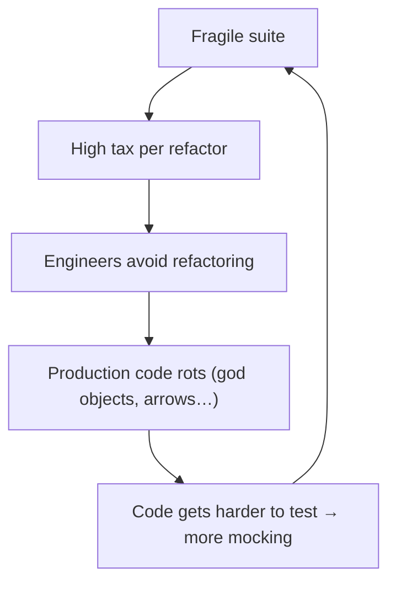
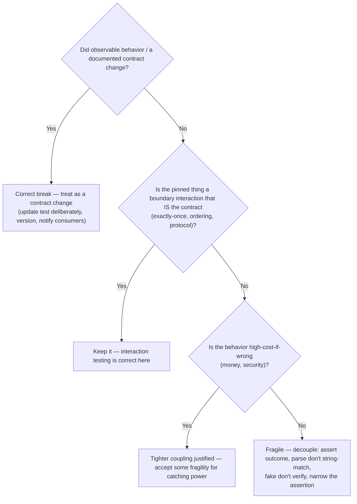

# Fragile Tests — Professional Level

> **Category:** [Testing Anti-Patterns](../README.md) → **Fragile Tests** — *a test that breaks when you change code without changing its behavior.*

---

## Table of Contents

1. [Introduction](#introduction)
2. [Prerequisites](#prerequisites)
3. [When Fragility Is Correct: The Test Should Break](#when-fragility-is-correct-the-test-should-break)
4. [Where the Contract/Implementation Boundary Actually Sits](#where-the-contractimplementation-boundary-actually-sits)
5. [Coupling vs Coverage: The Real Trade-Off](#coupling-vs-coverage-the-real-trade-off)
6. [Golden-Master and Snapshot Trade-Offs](#golden-master-and-snapshot-trade-offs)
7. [Fragility and Refactoring Velocity](#fragility-and-refactoring-velocity)
8. [Interaction Testing That Is Not Fragile](#interaction-testing-that-is-not-fragile)
9. [A Decision Framework](#a-decision-framework)
10. [Common Mistakes](#common-mistakes)
11. [Test Yourself](#test-yourself)
12. [Cheat Sheet](#cheat-sheet)
13. [Summary](#summary)
14. [Further Reading](#further-reading)
15. [Related Topics](#related-topics)

---

## Introduction

> Focus: **The trade-offs and edge cases** — when "fragility" is actually correct, where the contract boundary truly sits, the coupling-vs-coverage tension, golden-master economics, and how all of it bears on refactoring velocity.

The earlier files treated fragility as a defect to eliminate. That's the right *default*, and it's wrong as an *absolute*. The professional truth is sharper and more uncomfortable: **a test breaking is information, and not all of that information is bad.** A test that goes red when you delete a public method, change a documented response schema, or alter exactly-once payment semantics is not fragile — it is *doing its job*. If you "de-fragilize" it into silence, you've removed a guarantee customers depend on.

So the professional question is never "is this test fragile?" in the abstract. It is "**did this test break because I changed behavior the contract promises** (good — that's a caught change) **or because I changed an implementation detail it never should have pinned** (bad — that's fragility)?" Same red bar, two opposite meanings. Telling them apart is the entire skill, and it requires knowing *exactly where the contract boundary sits* — which is itself a judgment call that varies by what you're building (a library vs an internal service vs a UI), how stable the contract must be, and who pays when it breaks.

This file is about that judgment: where breakage is a feature, where the boundary genuinely blurs, how to trade coupling against coverage on purpose, when golden-master fragility earns its keep, and how every one of these decisions either accelerates or strangles the team's ability to change code.

> **The mental model:** a test suite is a *specification with teeth*. The teeth are supposed to bite when you violate the spec. Fragility is when the teeth bite on things that aren't in the spec. The professional designs *which things are in the spec* — and that design is what determines whether breakage is signal or noise.

---

## Prerequisites

- **Required:** Fluency with [`senior.md`](senior.md) — you can run a de-fragilization campaign and tell a brittle cluster from a healthy one.
- **Required:** You've owned a public API or library where a contract change cost downstream consumers real money/time — you've felt *why* contract tests *should* break.
- **Required:** Comfort weighing competing test qualities (regression-catching power vs resistance-to-refactoring vs speed vs readability) rather than maximizing one.
- **Helpful:** Experience with golden-master/approval testing on a non-trivial system, and with consumer-driven contract testing (Pact) across services.

---

## When Fragility Is Correct: The Test Should Break

Some breakage is the safety net working. Catalog the cases where a red test on change is *desired*, so you never mistake them for fragility:

| Change you made | Test breaks because | Verdict |
|---|---|---|
| Removed/renamed a **public method** | callers (incl. the test) relied on it | **Correct** — it's a breaking change; the test caught it |
| Changed a **documented response schema** | clients parse that schema | **Correct** — consumers will break; you want to know now |
| Altered **exactly-once** payment semantics | the interaction *is* the contract | **Correct** — strict verification is appropriate here |
| Changed an **error type** a caller catches | error type is part of the API | **Correct** — it's a contract change |
| Reordered output where **order is specified** (sorted, paginated) | order is the contract | **Correct** |
| Renamed a **private** field | nothing observable changed | **Fragile** — the test pinned an internal |
| Reordered two **internal** calls with same result | nothing observable changed | **Fragile** |
| Reworded a **log line** | logs aren't the contract | **Fragile** |

The defining question for every row: **is the thing that changed part of the promise this unit makes to its callers?** If yes, the break is a *caught contract change* — you update the test deliberately (and probably bump a version, notify consumers, write a migration). If no, it's fragility — you fix the test.

> **The trap to avoid:** treating *all* red-on-change as fragility and reflexively loosening tests until they stop biting. That's how a suite quietly loses its teeth. A test that *never* breaks no matter what you change isn't robust — it's *vacuous*. The goal is a test that breaks on **exactly** the contract and **nothing** else.

```java
// This test SHOULD break when someone changes the public refund contract.
// That is not fragility — it's the API guarantee, enforced.
@Test
void refund_returnsCreditNote_forSettledPayment() {
    RefundResult r = api.refund(settledPaymentId, Money.of("50.00"));
    assertThat(r.creditNote()).isNotNull();            // documented public output
    assertThat(r.status()).isEqualTo(REFUNDED);        // documented public state
}
// If a refactor makes this red, a consumer's integration is also about to break.
// Correct response: treat as a breaking change, not "fix the test."
```

---

## Where the Contract/Implementation Boundary Actually Sits

"Test the contract, not the implementation" is sound, but the boundary is not a law of nature — *you draw it*, and where you draw it has consequences. The same line of code can be contract or implementation depending on the unit's role:

- **A published library** — the contract is *wide*: every public method, every documented exception, often serialization format and even performance characteristics. Consumers you can't see depend on all of it. Here, tight tests that break on public changes are *correct and necessary*; the cost of an accidental breaking change is enormous.
- **An internal service with one consumer you control** — the contract is *narrower and softer*. You can change a JSON field and update the one consumer in the same PR. Tight serialization tests here are closer to fragility, because the "contract" is really just "the other half of my own code."
- **A UI component** — the contract is *user-observable behavior* (the button submits, the error shows), almost never the DOM structure or CSS classes. Snapshotting the rendered markup pins implementation; asserting "the form submits and shows a success message" pins the contract.
- **A private helper** — there *is no external contract*. It should generally be tested *through* its public caller, not directly, because a direct test pins an internal that has no promise to keep.

The boundary also **moves over time**. Something private today can become contractual tomorrow (you publish it, another team starts depending on it). Part of professional test design is *making the boundary explicit* — marking public API, documenting which fields are stable, versioning schemas — so the "is this the contract?" question has a written answer instead of an argument.

> **The judgment:** draw the boundary at the *widest stable promise you actually intend to keep*, and test exactly there. Too tight (pinning internals) → fragility. Too loose (testing nothing the contract guarantees) → vacuity and uncaught breaking changes. The right boundary depends on blast radius: the more consumers and the harder they are to fix, the wider and tighter the contract tests should be.

---

## Coupling vs Coverage: The Real Trade-Off

There's an honest tension the dogma elides. Tests that couple *more tightly* to a unit often catch *more* — they pin precise behavior and fail fast on subtle regressions. Tests that couple *loosely* survive refactors but can miss a narrow break. You are trading **resistance-to-refactoring** against **regression-catching power**, and the right point on that curve is not always "loosest."

Consider a financial calculation. An over-specified test that asserts the exact intermediate rounding at each step is fragile (refactor the algorithm, it breaks) — *but* it also catches a one-cent rounding regression that an outcome-only test ("the total is roughly right") would miss. For money, that precision may be worth the fragility. For a recommendation ranking, it isn't — exact ordering is an implementation detail and pinning it buys fragility with no real guarantee.

The professional resolution is not to pick a global point but to **vary coupling by the cost of the behavior being wrong**:

| Behavior | Cost if subtly wrong | Coupling choice |
|---|---|---|
| Money/tax/billing math | High (legal, financial) | **Tighter** — pin exact values, accept some fragility |
| Security/authz decisions | High (breach) | **Tighter** — pin the exact allow/deny matrix |
| Ranking/recommendations | Low (slightly worse UX) | **Looser** — assert properties, not exact order |
| Internal data shapes | None (no contract) | **Loosest** — don't assert at all; test through behavior |

```python
# High-cost behavior: tighter coupling is justified.
def test_tax_exact_to_the_cent():
    assert compute_tax(Decimal("99.99"), region="NY") == Decimal("8.87")  # exact, on purpose

# Low-cost behavior: loose coupling, assert a property not an exact value.
def test_recommendations_are_relevant():
    recs = recommend(user, k=5)
    assert len(recs) == 5
    assert all(r.category in user.interests for r in recs)   # property, not exact list/order
```

> **The discipline:** coupling is a dial, not a switch. Turn it up where being subtly wrong is expensive and the behavior is stable; turn it down where the detail is incidental and changes often. "Always loose" is as naive as "always tight."

---

## Golden-Master and Snapshot Trade-Offs

Golden-master (approval/snapshot) testing is the sharpest example of *deliberate, accepted fragility*. The whole technique is "fail if the output changes at all" — maximally coupled by design. That's a feature in the right context and a disaster in the wrong one. The economics:

**When the fragility pays:**
- **Legacy characterization.** You must change code you don't understand. A golden master freezes *all* current behavior so any behavior-preserving refactor stays green and any accidental change is caught. The fragility is the point, and it's temporary — you delete it once you've replaced it with focused tests.
- **Complex output that *is* the contract.** A compiler's generated assembly, a report's exact format, a public API's serialized payload. Here "the output changed" genuinely means "the contract changed," so the snapshot's sensitivity is correctly aligned with the contract.
- **High-fan-out output where enumerating assertions is infeasible.** A 400-field rendered document where writing individual assertions would take days — a reviewed snapshot is pragmatic.

**When the fragility is pure cost:**
- **Volatile output** (timestamps, random ids, ordering that isn't contractual) — the snapshot fails constantly and gets re-recorded reflexively, blessing whatever the code does.
- **No reviewer.** A snapshot updated with `--update` and merged without anyone reading the diff is not a test; it's a record of the bug you just shipped.
- **As a substitute for understanding.** Snapshotting *because you don't want to think about what should be true* permanently encodes that avoidance.

The make-or-break factor is **diff review discipline**. A golden master is only a test if a human reads and approves every diff. The moment "update snapshots" becomes muscle memory, it inverts into an anti-pattern: it asserts the output equals the output. Guard it: keep snapshots small, scrub volatile fields before snapshotting, fail CI on un-reviewed snapshot changes, and treat a snapshot diff in code review like a behavior change — because that's what it claims to be.

> **The rule:** accept golden-master fragility only where (1) the output *is* the contract or you're characterizing legacy, (2) volatile fields are scrubbed, and (3) every diff is reviewed. Miss any of the three and the technique decays into a rubber stamp.

---

## Fragility and Refactoring Velocity

Step back to the economics that make this matter. The reason fragility is worth a five-file treatment is that **it sets a tax rate on every future change.** A team's refactoring velocity is roughly: *(value of a change) − (cost of updating tests that break for non-behavioral reasons).* When that tax is high, the rational individual stops refactoring — and the codebase rots in exactly the way the rest of this anti-patterns roadmap describes.

This produces a vicious cycle worth naming explicitly:



Fragile tests don't just annoy — they *cause* production-code anti-patterns by making the cleanup that would prevent them too expensive. This is why the testing chapter sits inside the anti-patterns roadmap: a brittle suite is an upstream cause of the structural decay catalogued elsewhere.

But the inverse trade-off is real too, and the professional doesn't pretend otherwise: **a suite tuned purely for refactoring resistance can lose regression-catching power.** Loosen every assertion to survive every refactor and you eventually have tests that pass no matter what breaks. The target is not "minimize fragility" — it's "**maximize the change the team can safely make per unit time**," which means tests sensitive to *contract* changes (so breaking changes are caught) and insensitive to *implementation* changes (so refactors are free). Both sensitivities matter; optimizing one to zero destroys the suite.

> **The number to optimize:** not test count, not coverage, not fragility — *the cost of safely changing this system.* Fragility raises it from one side (refactor tax); vacuity raises it from the other (uncaught breaks, debugging in prod). Tune for the minimum total.

---

## Interaction Testing That Is Not Fragile

The blanket advice "assert outcomes, not interactions" has principled exceptions. Some contracts *are* interactions, and verifying them is correct, not white-box:

- **Commands with no observable return** — fire-and-forget side effects (sending an email, publishing an event, charging a card). There's no return value or queryable state to assert; the *only* observable contract is "the collaborator at the boundary was invoked correctly." Verifying it is legitimate.
- **Exactly-once / at-most-once semantics** — "charge the card exactly once even under retry" is a contract about *call count*. You verify the interaction because the interaction is the promise.
- **Ordering that is contractual** — "write to the WAL *before* acknowledging the commit" is a guarantee about call order; `InOrder` verification here pins the contract, not an implementation detail.
- **Protocol conformance** — a driver that must call `open → use → close`, or send a heartbeat every N seconds, has an interaction contract.

The distinction from fragile white-box mocking is *which* interactions you pin: verify interactions **at genuine boundaries** (the real external system) that **are themselves the contract**; never verify interactions with **internal collaborators** whose call pattern is an implementation choice. Mock the payment gateway and assert "charged exactly once" — contractual. Mock the internal `DiscountCalculator` and assert "called before `TaxCalculator`" — fragile.

```go
// NOT fragile: the interaction at the boundary IS the contract.
func TestCharge_isExactlyOnce_underRetry(t *testing.T) {
    gw := NewFakeGateway()                 // fake at the REAL boundary
    svc := NewPayments(gw, RetryPolicy{Max: 3})

    svc.Charge(order)                      // gateway flakes then succeeds internally

    assert.Equal(t, 1, gw.ChargeCount(order.ID))   // exactly-once is the promise we MUST pin
}
```

> **The refinement:** interaction testing is fragile when it pins *internal choreography*; it's correct when it pins a *boundary contract*. "Outcomes over interactions" is the default; "the interaction is the contract" is the principled exception — at the boundary, never inside.

---

## A Decision Framework

When a test breaks on a change, or you're deciding how tightly to write one, run this:



And for golden masters specifically: *is the output the contract (or am I characterizing legacy)? are volatile fields scrubbed? is every diff reviewed?* All three yes → keep. Any no → replace with targeted assertions.

---

## Common Mistakes

1. **Treating every red-on-change as fragility.** Reflexively loosening tests until they stop biting strips the suite of teeth. A test that breaks on a *contract* change is working — update it deliberately, don't silence it.
2. **Pretending the boundary is objective.** Where contract ends and implementation begins is a *design decision* that varies by unit role (library vs internal service vs UI) and changes over time. Make it explicit; don't argue it ad hoc.
3. **Optimizing fragility to zero.** A suite tuned only for refactoring resistance loses regression-catching power and becomes vacuous — green no matter what breaks. Optimize *total* change-cost, not one axis.
4. **Using golden masters without diff-review discipline.** Snapshots updated by reflex are rubber stamps. Scrub volatile fields, keep them small, review every diff, or don't use them.
5. **Banning all interaction testing.** Exactly-once, ordering, and fire-and-forget contracts *are* interactions. Verify them — at the boundary, never on internal collaborators.
6. **Uniform coupling everywhere.** Pinning exact values for a recommendation ranking is wasteful fragility; pinning them for tax math is justified precision. Vary the dial by the cost of being subtly wrong.

---

## Test Yourself

1. A refactor turns a test red. Give the single question that decides whether it's fragility or a caught contract change.
2. Why is a test that "never breaks no matter what you change" not actually robust?
3. The same JSON-field-order assertion is reasonable in one codebase and fragile in another. What differs?
4. Give two behaviors where *tighter* coupling (accepting some fragility) is the right call, and say why.
5. Under exactly what three conditions is golden-master fragility acceptable?
6. Verifying `gateway.charge()` was called exactly once is fine, but verifying the internal `DiscountCalculator` ran before `TaxCalculator` is fragile. State the principle that separates them.

<details>
<summary>Answers</summary>

1. **"Is the thing that changed part of the promise this unit makes to its callers?"** If yes → caught contract change (update deliberately, version, notify). If no → fragility (decouple).
2. Because it has no **teeth** — it's *vacuous*. A useful test must break on *contract* changes; one that survives every change can't catch a real regression. The goal is breaking on exactly the contract and nothing else, not breaking on nothing.
3. The **width and stability of the contract**, which depends on the unit's role and consumers. For a **published library/public API**, the serialized format may be a real contract that many unseen consumers parse → asserting it is correct. For an **internal service with one consumer you control**, the format is "the other half of my own code" → pinning it is closer to fragility.
4. Any two of: **money/tax/billing math** (a one-cent regression is legally/financially costly, so pin exact values) and **security/authorization decisions** (a wrong allow/deny is a breach, so pin the exact matrix). In both, the cost of a subtle wrong result exceeds the cost of occasional refactor fragility.
5. (1) The output **is the contract** (or you're temporarily **characterizing legacy**), (2) **volatile fields are scrubbed** before snapshotting, and (3) **every diff is reviewed** like a behavior change. Miss any one and it decays into a rubber stamp.
6. **Verify interactions at genuine boundaries that are themselves the contract** (exactly-once at the payment gateway is a promise you must keep); **never verify interactions with internal collaborators** whose call pattern is an implementation choice (discount-before-tax is internal choreography that a refactor may freely change without altering the result).

</details>

---

## Cheat Sheet

| Situation | Verdict |
|---|---|
| Test breaks on **public method / schema / error-type** change | Correct break — caught contract change; update deliberately |
| Test breaks on **private rename / internal reorder / log reword** | Fragile — decouple |
| **Exactly-once / ordering / protocol** at a real boundary | Interaction testing correct — keep |
| **Money / security** behavior | Tighter coupling justified — pin exact values |
| **Ranking / incidental** behavior | Looser — assert properties, not exact output |
| **Golden master** | Keep only if: output *is* contract (or legacy), volatile scrubbed, every diff reviewed |
| Test that **never breaks on anything** | Vacuous — has lost its teeth |

> **One rule to remember:** *break on exactly the contract and nothing else. Fragility is breaking on what isn't the contract; vacuity is not breaking on what is. Tune for minimum total change-cost, not minimum fragility.*

---

## Summary

- Not all breakage is fragility. A test that goes red on a **public-contract change** (removed method, changed schema, altered error type, exactly-once semantics) is the **safety net working** — update it deliberately, don't silence it.
- The **contract/implementation boundary is a design decision you draw**, and it varies by the unit's role (library vs internal service vs UI) and blast radius. Draw it at the *widest stable promise you intend to keep*, make it explicit, and test exactly there.
- Coupling is a **dial, not a switch.** Vary it by the cost of being subtly wrong: tighter (accept some fragility) for money/security; looser (assert properties) for rankings/incidental detail. "Always loose" is as naive as "always tight."
- **Golden-master fragility is deliberate** and pays only with diff-review discipline, scrubbed volatile fields, and an output that genuinely *is* the contract — otherwise it rubber-stamps the bug you shipped.
- Fragility's real cost is the **tax it puts on refactoring velocity**, which feeds the production-code anti-patterns elsewhere in this roadmap. But optimizing fragility to *zero* yields a **vacuous** suite. Optimize total change-cost: sensitive to contract changes, insensitive to implementation changes.
- **Interaction testing is correct at boundaries that are themselves the contract** (exactly-once, ordering, protocol) and fragile only when it pins internal choreography.
- Next: [`interview.md`](interview.md) — *30+ Q&A across all levels: what makes a test fragile, behavior vs implementation, over-specification, mock-induced fragility, when breakage is desirable, snapshot trade-offs, and measuring suite brittleness.*

---

## Further Reading

- **xUnit Test Patterns** — Gerard Meszaros (2007) — *Fragile Test* and the precise vocabulary for over-specification vs justified sensitivity.
- **Unit Testing Principles, Practices, and Patterns** — Vladimir Khorikov (2020) — the four-pillar model (protection against regressions, resistance to refactoring, fast feedback, maintainability) and how they *trade off* — the theoretical backbone of this file.
- **"Mocks Aren't Stubs"** and **"Test Behaviour, Not Implementation"** — Martin Fowler — classicist vs mockist and when interaction verification is appropriate.
- **Working Effectively with Legacy Code** — Michael Feathers (2004) — golden-master/characterization as deliberate, temporary fragility.
- **Pact / consumer-driven contracts** — pact.io — making the service contract explicit so contract-breaks are caught at the *right* boundary, by the right tests.

---

## Related Topics

- [Over-Mocking](../06-over-mocking/professional.md) — when interaction verification is correct vs fragile, at the boundary level.
- [Flaky Tests](../02-flaky-tests/professional.md) — the other side of an untrustworthy suite; trade-offs in determinism.
- [Slow Tests](../05-slow-tests/professional.md) — speed vs realism trades against the same change-cost economics.
- [Refactoring → Code Smells](../../../refactoring/01-code-smells/README.md) — fragile suites cause production-code smells by taxing cleanup.
- [Architecture → Anti-Patterns](../../../../../Architecture/anti-patterns/README.md) — contract boundaries at the service/system level.
- The `mocking-strategies`, `unit-testing-patterns`, and `api-versioning` skills — boundary contracts, interaction testing, and managing breaking changes.
