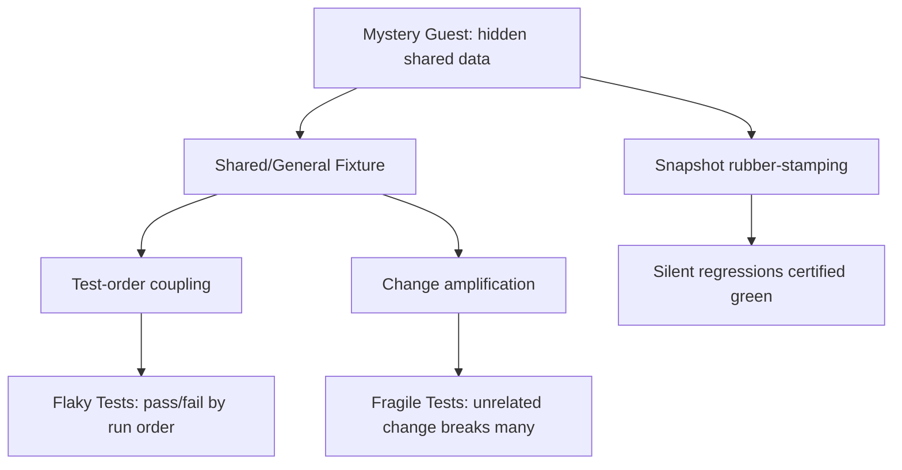

# Mystery Guest — Professional Level

> **Category:** [Testing Anti-Patterns](../README.md) → **Mystery Guest** — *a test whose inputs or expected results come from outside the test, where the reader cannot see them.*

---

## Table of Contents

1. [Introduction](#introduction)
2. [Prerequisites](#prerequisites)
3. [The Real Question: Visible vs. Honest](#the-real-question-visible-vs-honest)
4. [When External Data Is Genuinely Right](#when-external-data-is-genuinely-right)
5. [The Discipline of Honest External Data](#the-discipline-of-honest-external-data)
6. [Shared Fixture vs. Fresh Fixture: A Cost Model](#shared-fixture-vs-fresh-fixture-a-cost-model)
7. [Mystery Guest as a Cause of Fragility and Flakiness](#mystery-guest-as-a-cause-of-fragility-and-flakiness)
8. [Deliberate Fixtures vs. Mystery Guests](#deliberate-fixtures-vs-mystery-guests)
9. [Governance: Keeping a Suite Honest at Scale](#governance-keeping-a-suite-honest-at-scale)
10. [Common Mistakes](#common-mistakes)
11. [Test Yourself](#test-yourself)
12. [Cheat Sheet](#cheat-sheet)
13. [Summary](#summary)
14. [Further Reading](#further-reading)
15. [Related Topics](#related-topics)

---

## Introduction

> Focus: **The trade-offs.** When external/golden data is the *correct* engineering choice (large realistic payloads, contract fixtures), how to keep it non-mysterious, how to reason quantitatively about shared vs. fresh fixtures, and the causal chain from hidden data to fragility and flakiness.

The junior and middle files treated the Mystery Guest as a thing to eliminate. The senior file admitted some data must stay external and showed how to migrate a tangle. This level confronts the uncomfortable truth a staff engineer lives with: **"inline everything" is wrong as often as "share everything" is.** A test that pastes a 4,000-line JSON payload inline is *also* unreadable; a contract fixture *should* be shared with the team that owns the contract; a golden render is the *only* sane way to assert on a complex artifact.

The professional skill is not purity — it's drawing the line correctly and defending it. The reframing that makes this tractable: the enemy was never "external data." The enemy is **mystery** — data whose origin, meaning, and authority the reader can't determine from the test. External data can be perfectly honest; inline data can be perfectly mysterious (a magic number is inline and still a guest). This file is about telling the two apart and keeping a large suite on the honest side of the line. The **test-data-management** and **integration-testing** skills are the operational backbone for everything here.

---

## Prerequisites

- **Required:** Fluent with [`senior.md`](senior.md) — you can migrate a General/Shared Fixture to fresh-per-test and manage the speed cost.
- **Required:** You've owned a suite's reliability and run-time as a metric, not a vibe.
- **Required:** You've worked with contract testing, snapshot/golden testing, or large realistic test payloads in production.
- **Helpful:** You've had to defend a testing decision in design review against both "too much duplication" and "too much magic" critics.

---

## The Real Question: Visible vs. Honest

Reframe the whole topic around two orthogonal properties:

- **Visible** — the data is physically in the test body.
- **Honest** — the reader can determine the data's *origin, meaning, and authority* (where it came from, what it represents, who owns it, how to regenerate it) — whether or not it's in the test body.

|  | **Visible** | **Not visible** |
|---|---|---|
| **Honest** | Inline builder with named fields — the ideal for small data | Co-located, named, regenerable golden file with a visible input — the ideal for large data |
| **Dishonest** | A magic number (`assert == 42`) — inline but unexplained | A seeded `findById(4071)` against a shared DB — the classic Mystery Guest |

The junior advice ("make it visible") is really a *proxy* for "make it honest," and for small data, visible *is* the cheapest way to be honest. But the matrix shows the two failure modes the proxy misses: **visible-but-dishonest** (magic numbers) and the achievable **honest-but-not-visible** (good golden files). At professional scale you optimize for *honest*, and choose visibility as the implementation when the data is small enough.

> The Mystery Guest is the bottom-right cell. Everything in this file is about staying out of it — sometimes by making data visible, sometimes by making external data honest, never by pretending the choice doesn't exist.

---

## When External Data Is Genuinely Right

There are three cases where pulling data *out* of the test is the correct call, not a smell:

**1. Large realistic payloads.** Testing a parser, a webhook handler, or a migration against a real-world 3 KB Stripe event or a 2 MB FHIR document. Inlining it would bury the test in noise; a hand-trimmed version risks *not* being realistic (the bug you're guarding against lives in the messy real shape). Keep the payload external, in a named file, with the *input identity* and the *assertion* visible in the test:

```go
// Go — the payload is external (realistically large), but the test is honest
func TestWebhook_RefundEvent(t *testing.T) {
    payload := loadFixture(t, "stripe/charge.refunded.json")  // named, realistic, co-located
    evt, err := ParseEvent(payload)
    require.NoError(t, err)
    assert.Equal(t, "charge.refunded", evt.Type)   // the ONE fact under test is on screen
    assert.Equal(t, int64(2000), evt.AmountRefunded)
}
```

The 3 KB of JSON stays in `testdata/stripe/charge.refunded.json` — but the test asserts on *named, visible facts* extracted from it, and the fixture's name tells you exactly what it is. Not a Mystery Guest: you know its origin (a real Stripe refund event), meaning (named), and the test doesn't depend on any unseen field.

**2. Contract fixtures.** When two services agree on a schema, the *shared* fixture (a Pact file, an OpenAPI example, a `.proto`-derived golden) is the point — it's the *single source of truth* both sides test against. Inlining it per-test would let the two copies drift, which is the exact failure the contract test exists to prevent. Shared is correct; the honesty discipline is that the contract file is *owned*, *versioned*, and *referenced by name*.

**3. Golden/snapshot artifacts.** A rendered invoice, a generated SQL migration, a formatted report, a compiler's output. The expected value is large and structural; a golden file plus a diff is the right tool. (Covered in depth below.)

> The discriminator: external data is *right* when the data's realism, sharedness, or size is *intrinsic to what you're testing*. It's a Mystery Guest when external storage is merely *convenient* and the test depends on fields you can't see.

---

## The Discipline of Honest External Data

External data earns its place only under a discipline. The same five rules apply whether it's a payload, a contract, or a golden file:

- **Identity in the test.** The test names *which* fixture it loads (`stripe/charge.refunded.json`), and that name describes the case. `loadFixture(t, "case3.json")` fails this — the reader can't tell what case 3 is.
- **Assertion is visible.** The test asserts on *named facts* (`evt.AmountRefunded == 2000`), not "equals the whole blob with no explanation." Even a full golden comparison should be accompanied by a comment on *what the artifact is*.
- **Regenerable, never hand-edited.** A committed generator + a documented `-update`/`--snapshot-update` flag. A hand-edited golden file drifts from what the code actually produces and becomes authoritative for no reason. If you can't regenerate it from a command, it's a liability.
- **Diff on failure.** A golden mismatch must print a unified diff, not "files differ." Without a diff, every failure is a 20-minute investigation and reviewers rubber-stamp `-update` regenerations — which is how snapshot suites quietly stop testing anything.
- **Reviewed like code.** A golden-file change in a PR must be *read*, not approved on faith. A regenerated 500-line snapshot that nobody reads is a green test that asserts whatever the (possibly buggy) code now produces. This is the central risk of snapshot testing: it can ratify a regression.

```python
# Python (pytest) — an honest golden test: input visible, regenerable, diffed
def test_render_invoice(snapshot):           # snapshot lib regenerates with --snapshot-update
    invoice = an_invoice(                     # INPUT is a visible builder, not a mystery
        customer=a_customer(tier="gold"),
        lines=[line("SKU-9", qty=1, price=99.00)],
    )
    rendered = render(invoice)               # large structural artifact
    assert rendered == snapshot              # compared to testdata/__snapshots__/...,
                                             # diffed on failure, reviewed in the PR
```

The expected output is external and large — correctly so — but the input is a visible builder, the snapshot is named and regenerable, and a failure shows a diff a reviewer can judge. Honest, not mysterious.

> **The snapshot trap (state it out loud):** the danger of golden/snapshot testing is *not* that the expected value is external. It's that regeneration is so easy that humans stop scrutinizing it, and a green snapshot can certify a bug. The discipline — small reviewable artifacts, mandatory diff review, a visible input — is what keeps a snapshot honest. Without it, snapshots are the most insidious Mystery Guest: one that passes *and* lies.

---

## Shared Fixture vs. Fresh Fixture: A Cost Model

The senior file said "isolation is non-negotiable, speed is negotiable." At the professional level you make that quantitative, because there *are* cases where a shared fixture is defensible and you need to argue it on numbers, not dogma.

Model the two choices on three axes:

| Axis | Shared fixture | Fresh fixture |
|---|---|---|
| **Setup cost** | Paid **once** per suite/class | Paid **N times** (once per test) |
| **Isolation** | None — order-coupling, cross-test pollution possible | Total — each test independent, parallelizable |
| **Readability** | Low — data is off-screen, "which field matters?" | High — relevant data local and named |

The decision rule:

- **Fresh by default.** Isolation and readability are worth the CPU almost always, and transaction rollback usually makes the setup cost negligible (schema once, data cheap).
- **Shared is defensible only when *all* of:** the fixture is **immutable** (frozen reference data — a currency table, a static lookup), its setup is **genuinely expensive** (seconds, not milliseconds — spinning a container, loading a large model), and **no test asserts on its hidden internals**. Then you share an honest, named, read-only fixture once and accept the residual readability cost, documented.
- **Never share mutable state.** The moment a shared fixture can be mutated, the cost model collapses — you've traded measurable CPU for unmeasurable, intermittent failures (see next section). That trade is always bad.

A worked decision: a suite spins a Postgres container (8 s) and runs 400 tests. Per-container-per-test is 400 × 8 s ≈ 53 min — untenable. So you share the *container* (expensive, immutable infrastructure) once, but give each test a **fresh transaction** rolled back at teardown. You've shared the expensive immutable thing and kept the data fresh and isolated. That's the correct factoring: *share infrastructure, not data.*

> The shared/fresh debate is usually a false binary. The professional answer is almost always "share the expensive immutable layer (the container, the schema, the loaded model); keep the *data* fresh and local." That gives you the shared fixture's speed and the fresh fixture's isolation.

---

## Mystery Guest as a Cause of Fragility and Flakiness

The Mystery Guest isn't just a readability smell — it's an upstream *cause* of the two worst suite diseases. Make the causality explicit, because it's how you justify the cleanup work to people who only care about reliability:



- **Hidden shared data → fragility.** Because the data is shared and off-screen, one edit (reprice a SKU, change a seed row) breaks every test that silently depended on it. The edit and the breakage are far apart, so the failure looks mysterious — the defining feature of a [Fragile Test](../01-fragile-tests/professional.md).
- **Hidden shared mutable data → flakiness.** A shared fixture mutated by one test changes behavior for another, so the suite passes or fails by **run order** — and parallelism makes the ordering nondeterministic. That's a [Flaky Test](../02-flaky-tests/professional.md) whose root cause is a Mystery Guest, not a race in the code under test.
- **Hidden expectation → certified regressions.** A snapshot regenerated without review (the dishonest golden file) makes the suite assert whatever the code now does — so a genuine bug can turn the suite green. The hidden *expectation* is the most dangerous guest of all.

This is the argument that funds the work: chasing flaky CI failures one at a time is endless if the root cause is a shared fixture. Eliminating the Mystery Guest removes the *class* of failures.

---

## Deliberate Fixtures vs. Mystery Guests

Not every off-screen helper is a Mystery Guest. Distinguish a **deliberate fixture** (a sanctioned, honest, reusable setup) from the anti-pattern:

| | Deliberate fixture | Mystery Guest |
|---|---|---|
| **Origin** | Owned, named, documented | Accreted; "it's always been there" |
| **Authority** | Single source of truth (contract, reference data) | Convenience copy nobody owns |
| **Mutability** | Immutable / fresh per test | Mutable and shared |
| **Visibility at call site** | Identity + asserted facts are visible | Test silently depends on unseen fields |
| **Regeneration** | Reproducible from a command | Hand-edited or lost to history |

A Pact contract file, a frozen currency table, a named realistic payload, a reviewed snapshot — all *deliberate*. A `standard_data` blob 200 tests bolt onto, a magic `findById(4071)`, a hand-edited golden nobody can regenerate — all *Mystery Guests*. The shape can be identical (both are "data in a file"); the difference is **ownership, authority, mutability, and call-site honesty.** Judge by those, never by "is it in a file."

---

## Governance: Keeping a Suite Honest at Scale

On a large team you can't rely on everyone remembering these rules. Encode them:

- **Randomized test order in CI** (`go test -shuffle=on`, `pytest -p randomly`, JUnit random orderer). This makes order-coupling — the Shared-Fixture symptom — fail *loudly and early* instead of intermittently. Non-negotiable for any suite touching shared state.
- **Forbid expanding the General Fixture.** A lint rule or review convention: new tests build local data; nobody adds fields to `standard_data`. Drains the pile over time.
- **Golden-file review gate.** PRs that change `testdata/*.golden` or `__snapshots__/` require explicit reviewer acknowledgment, and CI fails if a snapshot changed without the `-update` flag being intentional. Stops silent regeneration.
- **Fixture budget / timing visibility.** Surface per-test setup time (`pytest --durations`, Gradle build scans, `go test` timing). When a fixture gets expensive, the team sees it and can decide *share-the-infrastructure-not-the-data* deliberately.
- **Name conventions for `testdata`.** `testdata/<test_name>/<case>.golden` so every external artifact's owner is obvious from its path. Orphaned fixtures (no referencing test) get swept by a linter — a Boat Anchor of test data.

> Governance turns the individual discipline into a property of the suite. The goal: make the *honest* path the path of least resistance, and make the Mystery Guest path fail in CI before it merges.

---

## Common Mistakes

1. **Inlining a 4,000-line payload "to avoid a Mystery Guest."** That trades one unreadable test for another. Large realistic data belongs external; make it *honest* (named, input-visible, asserted on named facts), not visible.
2. **Treating all snapshot tests as a smell.** Golden tests are the right tool for large structural artifacts. The smell is an *un-reviewed, un-regenerable, un-diffed* snapshot — fix the discipline, not the technique.
3. **Sharing a contract fixture by copying it into each test.** That defeats the contract — the copies drift. Shared *is* correct here; the honesty lies in ownership and versioning.
4. **Defending a shared mutable fixture on speed grounds.** The cost model only favors sharing for *immutable, expensive* fixtures. Mutable sharing trades measurable CPU for unmeasurable flakiness — always a loss.
5. **Approving regenerated snapshots without reading them.** This is how a suite certifies a regression. A snapshot diff is code; review it.
6. **Chasing flaky failures without suspecting the fixture.** If failures correlate with test order, the root cause is a shared fixture (a Mystery Guest), not the code under test. Fix the cause, not the symptom.

---

## Test Yourself

1. Reframe "Mystery Guest" using the *visible* vs. *honest* distinction. Give an example of visible-but-dishonest and honest-but-not-visible data.
2. Name the three cases where external test data is the *correct* choice, and the property that makes each one intrinsic rather than convenient.
3. What is "the snapshot trap," and what discipline defuses it?
4. State the cost-model rule for when a shared fixture is defensible. Why is "share the infrastructure, not the data" usually the resolution?
5. Explain the causal chain from a Mystery Guest to flaky tests, and to certified silent regressions.
6. A teammate says "this Pact file is a Mystery Guest — it's data in a file the test doesn't show." Are they right? Explain using the deliberate-fixture criteria.

<details>
<summary>Answers</summary>

1. The Mystery Guest is really *dishonest* data — data whose origin, meaning, and authority the reader can't determine from the test — independent of whether it's physically in the test. **Visible-but-dishonest:** `assert total == 42` (inline, but unexplained — a magic number). **Honest-but-not-visible:** a co-located, named, regenerable golden file whose input is a visible builder and whose failure prints a diff.
2. **Large realistic payloads** (realism is intrinsic — a trimmed inline copy might miss the messy shape the bug lives in); **contract fixtures** (sharedness is intrinsic — a single source of truth both services test against, which per-test copies would let drift); **golden/snapshot artifacts** (size/structure is intrinsic — a large rendered artifact can't be sanely inlined). Each is right because realism/sharedness/size is *part of what's being tested*, not mere convenience.
3. The snapshot trap: regenerating a golden file is so easy that humans stop scrutinizing it, so a green snapshot can certify a bug — the most insidious Mystery Guest, one that passes *and* lies. Defused by: small reviewable artifacts, a visible input, mandatory diff-on-failure, mandatory review of snapshot changes in PRs, and CI gating on intentional `-update`.
4. A shared fixture is defensible only when it is **immutable**, its setup is **genuinely expensive** (seconds), and **no test asserts on its hidden internals**. "Share the infrastructure, not the data" resolves the binary: share the expensive immutable layer (container, schema, loaded model) once, but give each test fresh, isolated data (e.g. a rolled-back transaction) — getting the shared fixture's speed and the fresh fixture's isolation simultaneously.
5. Mystery Guest → data is hidden *and* shared → a **Shared/General Fixture**. If that shared state is **mutable**, one test's mutation changes another test's behavior → pass/fail depends on **run order** → **flaky**, especially under parallelism. Separately, a hidden *expectation* (a snapshot regenerated without review) makes the suite assert whatever the code now produces → a real bug turns the suite green → a **certified silent regression**.
6. They're wrong (assuming the Pact file is owned, versioned, and named). A deliberate fixture is judged by ownership, authority, mutability, and call-site honesty — not by "is it in a file." A Pact file is the *single source of truth* shared deliberately with the other service (sharedness is the point), it's versioned and owned, and the test references it by name. It's a deliberate fixture, not a Mystery Guest. (It *would* become one if it were an unowned copy nobody could regenerate.)

</details>

---

## Cheat Sheet

| Question | Professional answer |
|---|---|
| Is external data always a smell? | No. Smell = *mystery* (hidden origin/meaning/authority), not *external*. Optimize for honest, not visible. |
| When is external data right? | Large realistic payloads, contract fixtures, golden artifacts — when realism/sharedness/size is *intrinsic*. |
| How to keep external data honest | Identity in test · assertion visible · regenerable not hand-edited · diff on failure · reviewed like code. |
| Shared vs. fresh fixture | Fresh by default; share only immutable + expensive + not-asserted-on. **Share infrastructure, not data.** |
| Mystery Guest → reliability | Hidden shared data → fragility; hidden mutable shared data → flakiness; hidden expectation → certified regressions. |
| Deliberate fixture vs. guest | Judge by ownership, authority, mutability, call-site honesty — not by "is it in a file." |
| Governance | Shuffle order in CI · forbid fixture growth · gate golden-file reviews · surface fixture timing · name `testdata` by test. |

> **One rule to remember:** *the enemy is mystery, not externality. Make data honest — known origin, meaning, authority, and a way to regenerate it — and choose visibility as the cheapest honesty for small data.*

---

## Summary

- Reframe the topic: the failure is **dishonest** data, not *external* data. Use the visible/honest matrix — the Mystery Guest is the *not-visible-and-dishonest* cell, but *visible-but-dishonest* (magic numbers) and *honest-but-not-visible* (good golden files) both exist.
- External data is the **correct** choice for large realistic payloads, contract fixtures, and golden artifacts — when realism, sharedness, or size is intrinsic to what you're testing. Keep it honest with five rules: identity in the test, visible assertion, regenerable-not-hand-edited, diff on failure, reviewed like code.
- The **snapshot trap** is the worst Mystery Guest: easy regeneration lets a green snapshot certify a bug. Small artifacts, visible inputs, mandatory diffs and reviews defuse it.
- Reason about **shared vs. fresh fixtures** on a cost model — fresh by default; share only immutable, expensive, not-asserted-on fixtures. The usual resolution is **share the infrastructure, not the data.**
- The Mystery Guest is an *upstream cause* of **fragility** (change amplification) and **flakiness** (order-coupling), and hidden expectations cause **certified regressions** — which is the business case for the cleanup.
- This completes the Mystery Guest track: from spotting hidden inputs (`junior.md`), to local explicit setup and builders (`middle.md`), to untangling shared fixtures at suite scale (`senior.md`), to the trade-offs of legitimate external data here. Next, apply it: [`interview.md`](interview.md), [`tasks.md`](tasks.md), [`find-bug.md`](find-bug.md), and [`optimize.md`](optimize.md).

---

## Further Reading

- **xUnit Test Patterns: Refactoring Test Code** — Gerard Meszaros (2007) — **Mystery Guest**, **Shared Fixture**, **General Fixture**, **Obscure Test**, **Fresh Fixture**, and the full fixture-strategy taxonomy this file operationalizes.
- **Growing Object-Oriented Software, Guided by Tests** — Freeman & Pryce (2009) — Test Data Builders and honest, readable test setup at scale.
- **Unit Testing Principles, Practices, and Patterns** — Vladimir Khorikov (2020) — fixture lifecycle, the cost of integration tests, and the speed/isolation trade-off as a quantified decision.

---

## Related Topics

- [Fragile Tests](../01-fragile-tests/professional.md) — change amplification, the fragility half of the causal chain.
- [Flaky Tests](../02-flaky-tests/professional.md) — order-coupling and nondeterminism, the flakiness half.
- [Slow Tests](../05-slow-tests/professional.md) — the cost side of fresh fixtures, quantified.
- [Over-Mocking](../06-over-mocking/professional.md) — the other way tests stop testing real behavior.
- [Bad Structure → Development Anti-Patterns](../../01-development/01-bad-structure/professional.md) — production-code structure and its runtime cost.
- [Architecture Anti-Patterns](../../../../../Architecture/anti-patterns/README.md) — shared state and coupling as system-level diseases.
