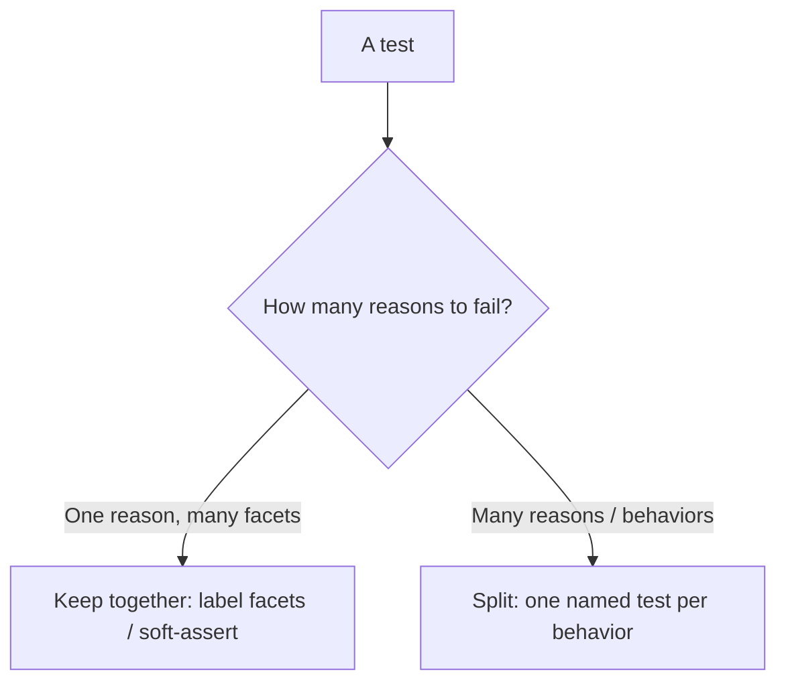

# Assertion Roulette — Senior Level

> **Category:** [Testing Anti-Patterns](../README.md) → **Assertion Roulette** — *a test with many unlabelled assertions, so when one fails you cannot tell which — or why.*

---

## Table of Contents

1. [Introduction](#introduction)
2. [Prerequisites](#prerequisites)
3. [The Design Principle: One Reason to Fail](#the-design-principle-one-reason-to-fail)
4. [AAA Makes the Assert Block Legible](#aaa-makes-the-assert-block-legible)
5. [Naming Tests by Behavior](#naming-tests-by-behavior)
6. [Parameterized Tests Replace the Mega-Test](#parameterized-tests-replace-the-mega-test)
7. [Custom Domain Assertions](#custom-domain-assertions)
8. [Fixing It Across a Suite](#fixing-it-across-a-suite)
9. [Balancing Granularity vs Test Count](#balancing-granularity-vs-test-count)
10. [Common Mistakes](#common-mistakes)
11. [Test Yourself](#test-yourself)
12. [Cheat Sheet](#cheat-sheet)
13. [Summary](#summary)
14. [Further Reading](#further-reading)
15. [Related Topics](#related-topics)

---

## Introduction

> Focus: **The design behind one-reason-to-fail**, and **how to remove roulette from a whole suite** — not one test at a time, but as a refactoring of how the suite is structured.

`middle.md` gave you four cures. This file is about applying them with judgement at the scale of a real suite, and about the *design principle* underneath all of them: **a test should have exactly one reason to fail**. Once you internalize that, the cures stop being a checklist and become consequences of a single idea.

A senior engineer doesn't just label assertions; they restructure tests so that each one is a small, named specification with a single failure mode, expressed in the domain's vocabulary. The result is a suite where a red run reads like a list of broken requirements — `pro_plan_grants_14_trial_days FAILED` — rather than a list of line numbers.

> **The mental model:** treat each test as a *theorem* with one conclusion. The test name is the theorem statement; the assertions are its verification. If a test could fail for two unrelated reasons, it's two theorems crammed together — split it. If it fails for one reason expressed in five facets, keep it together and make those facets legible.

---

## Prerequisites

- **Required:** Fluent with [`middle.md`](middle.md) — split-by-behavior, messages, matchers, soft assertions.
- **Required:** You maintain a suite large enough that test *naming* and *organization* matter, not just individual tests.
- **Helpful:** Comfort with parameterized/table-driven tests in your stack and the `unit-testing-patterns` skill.

---

## The Design Principle: One Reason to Fail

Every cure in `middle.md` is an instance of one rule: **each test should fail for exactly one reason.** This is the test-side mirror of the Single Responsibility Principle.

- If a test verifies registration *and* login, it has two reasons to fail → roulette. **Split.**
- If a test verifies the four facets of "an invoice was computed correctly" (subtotal, tax, discount, total), it has *one* reason to fail — "the invoice math is wrong" — expressed in four assertions. **Keep, but label.**

The distinction is **reason to fail**, not assertion count. "One assert per test" is a crude proxy that misleads as often as it helps: it pushes you to split cohesive facet-checks (tripling Arrange cost) while saying nothing about an Eager Test that has one assert per behavior across six behaviors. Replace the proxy with the principle.



When you look at a roulette-ridden suite, you're really looking at tests whose *reasons to fail* haven't been separated. The whole refactor is "give each reason its own named test."

---

## AAA Makes the Assert Block Legible

**Arrange–Act–Assert** isn't decoration — it physically separates the assertions into their own block so a reader (and you, at failure time) sees exactly what's being verified, undiluted by setup.

```go
// Go — AAA with a clear, single Act and a focused Assert block
func TestApplyCoupon_ReducesTotalByPercent(t *testing.T) {
    // Arrange
    cart := NewCart(Item{Price: 1000, Qty: 2})   // 2000
    coupon := Coupon{Percent: 10}

    // Act
    total := cart.ApplyCoupon(coupon)

    // Assert — one reason to fail: the discount math
    assert.Equal(t, 1800, total, "10%% off 2000")
}
```

Two senior habits AAA enforces:

- **One Act.** If a test has *two* Act lines (call `register`, then call `login`), it almost certainly has two reasons to fail — a structural signal to split. A single Act is the cleanest guard against Eager Tests.
- **Assertions only assert.** No logic, no branching, no incidental calls in the Assert block. The block should read as a list of facts about the one outcome.

When every test follows AAA, roulette becomes visually obvious in review: a fat Assert block following multiple Acts is a code smell you can spot at a glance.

---

## Naming Tests by Behavior

The single most effective anti-roulette move at suite scale is **naming**. If the test name fully describes the behavior and expected outcome, a red run is self-diagnosing before anyone opens a file.

```python
# Weak names — failure tells you nothing
def test_checkout(): ...
def test_user(): ...

# Behavior names — failure IS the diagnosis
def test_checkout_rejects_expired_card(): ...
def test_checkout_applies_loyalty_discount_for_gold_tier(): ...
def test_signup_sends_welcome_email_once(): ...
```

A useful convention is `Unit_Scenario_ExpectedOutcome` (or pytest's readable snake-case sentence). The test name carries the *reason to fail*, so the assertion messages only need to disambiguate facets within that one reason. Good names also stop people from *adding* asserts: if a new check doesn't fit the name, that's the signal it belongs in a new test.

> **Heuristic:** if you can't name the test without the word "and," it has more than one reason to fail. `test_register_and_login` is two tests wearing a trench coat.

---

## Parameterized Tests Replace the Mega-Test

A common roulette source is the "let me test all the cases in one method" mega-test: one body, twenty asserts covering twenty inputs. The right tool is a **parameterized / table-driven test** — same logic, each case isolated, each failure labelled with its case.

**Before — roulette across cases:**

```python
def test_discounts():
    assert discount("gold", 100) == 10
    assert discount("silver", 100) == 5
    assert discount("bronze", 100) == 0
    assert discount("gold", 0) == 0      # if this fails, which case? you re-read
```

**After — pytest parameterize: one failing case names itself:**

```python
import pytest

@pytest.mark.parametrize("tier, amount, expected", [
    ("gold",   100, 10),
    ("silver", 100,  5),
    ("bronze", 100,  0),
    ("gold",     0,  0),
], ids=["gold-100", "silver-100", "bronze-100", "gold-zero"])
def test_discount(tier, amount, expected):
    assert discount(tier, amount) == expected
```

A failure reports `test_discount[silver-100]` — the exact case, by name. Every case runs independently (no fail-fast masking), and adding a case is one table row, not one more assert in a growing pile.

```java
// Java + JUnit 5 — @ParameterizedTest with @CsvSource
@ParameterizedTest(name = "{0} on {1} -> {2}")
@CsvSource({ "gold,100,10", "silver,100,5", "bronze,100,0", "gold,0,0" })
void discount(String tier, int amount, int expected) {
    assertThat(discount(tier, amount)).isEqualTo(expected);
}
```

```go
// Go — idiomatic table-driven test with subtests; each case is named and isolated
func TestDiscount(t *testing.T) {
    cases := []struct {
        name           string
        tier           string
        amount, expect int
    }{
        {"gold-100", "gold", 100, 10},
        {"silver-100", "silver", 100, 5},
        {"gold-zero", "gold", 0, 0},
    }
    for _, c := range cases {
        t.Run(c.name, func(t *testing.T) {                 // subtest = isolated failure
            assert.Equal(t, c.expect, Discount(c.tier, c.amount))
        })
    }
}
```

Parameterized tests are the senior answer to "I had to cram these or I'd have twenty near-identical methods": you get isolation *and* DRY, with each case self-labelling.

---

## Custom Domain Assertions

When the same multi-facet check recurs, extract a **named domain assertion**. It collapses several asserts into one call whose *name* describes the invariant, and centralizes the messages.

```java
// Java + AssertJ custom assert — reads as a domain statement, fails legibly
public class OrderAssert extends AbstractAssert<OrderAssert, Order> {
    public OrderAssert(Order actual) { super(actual, OrderAssert.class); }
    public static OrderAssert assertThat(Order o) { return new OrderAssert(o); }

    public OrderAssert isConfirmed() {
        isNotNull();
        if (actual.status() != CONFIRMED)
            failWithMessage("expected order <%s> to be CONFIRMED but was <%s>",
                            actual.id(), actual.status());
        return this;
    }
    public OrderAssert hasTotal(int cents) {
        if (actual.totalCents() != cents)
            failWithMessage("expected total <%d> but was <%d>", cents, actual.totalCents());
        return this;
    }
}

// In the test — one reason to fail, named in domain terms:
OrderAssert.assertThat(order).isConfirmed().hasTotal(1800);
```

```python
# Python — a helper assertion with a clear name and message
def assert_valid_invoice(inv, *, subtotal, tax, total):
    assert inv.subtotal == subtotal, f"subtotal: {inv.subtotal}"
    assert inv.tax == tax,           f"tax: {inv.tax}"
    assert inv.total == total,       f"total: {inv.total}"

def test_pro_invoice():
    assert_valid_invoice(build_invoice("pro"), subtotal=1000, tax=100, total=1100)
```

Custom assertions are the cure when splitting would be *too* granular (you'd duplicate Arrange across five tests) but a raw stack of asserts would be roulette. The helper's name is the "one reason to fail"; its internal messages disambiguate the facet. This is also the cleanest way to apply a single fix across a whole suite — change the message once, every call site improves.

---

## Fixing It Across a Suite

A repeatable program for de-rouletting an existing suite, highest-leverage first:

1. **Adopt a matcher library globally.** Swap bare `assertTrue`/`if got != want` for AssertJ/testify/pytest-rewrite. This alone turns most "expected true, got false" failures into self-describing ones with no per-test thought. (Biggest win per hour.)
2. **Rename tests by behavior.** A red CI that reads like a list of broken requirements is half the diagnostic value, recovered cheaply.
3. **Split Eager Tests** — anywhere you see two Acts or an "and" in the name. Start with the tests that fail most often (highest debugging cost).
4. **Collapse case-piles into parameterized tests** — each case self-labelling, independent.
5. **Extract custom domain assertions** for the invariants you assert repeatedly.
6. **Introduce soft assertions** only where one behavior has several facets you want fully reported in one run.

Steps 1–2 are mechanical and touch the whole suite quickly; 3–6 are targeted at the worst offenders. Don't try to perfect every test — apply effort where failures are most frequent and most confusing.

---

## Balancing Granularity vs Test Count

Over-splitting is a real cost, not a virtue. If you shatter every cohesive check into one-assert tests you get:

- **Duplicated Arrange** — every micro-test rebuilds the same fixture, multiplying setup code and runtime.
- **A slower suite** — more test methods = more setup/teardown cycles; `professional.md` quantifies this.
- **Noise** — a hundred near-identical green dots obscure the few that matter.

The senior balance: **one named test per *behavior*; within it, as many assertions as that one behavior needs, all legible.** Use parameterized tests to keep many *cases* DRY, and custom assertions to keep many *facets* DRY. You're trading off two failure modes — roulette (too coarse) and fragment-itis (too fine) — and the sweet spot is "one reason to fail," not "one assertion."

---

## Common Mistakes

1. **Worshipping "one assert per test."** It over-splits cohesive facet-checks and ignores Eager Tests with one assert per behavior. Use **one reason to fail** instead.
2. **Multiple Acts in one test.** The clearest structural cause of roulette. Two Acts → two reasons to fail → split.
3. **Parameterizing without `ids`/case names.** A parameterized test whose cases are anonymous (`[0]`, `[1]`) reintroduces roulette across cases. Always name the cases.
4. **Custom assertions that hide *which* facet failed.** A helper that does `assert a == x and b == y` with one generic message is roulette in a wrapper. Give each internal check its own message.
5. **De-rouletting test-by-test when a global matcher swap would fix 80%.** Reach for the mechanical, suite-wide wins first.
6. **Splitting so far that Arrange dominates.** If five tests share twenty lines of identical setup, that's a signal to use a parameterized test or a custom assertion, not five more methods.

---

## Test Yourself

1. State the design principle that replaces "one assert per test," and explain why it's better.
2. In AAA, what structural feature most reliably signals that a test should be split?
3. You have a method with 18 assertions covering 18 input/output pairs. What's the right refactor, and what must you not forget?
4. When is a custom domain assertion the right call instead of splitting into more tests?
5. Why can over-splitting make a suite *worse*, and what two tools let you stay DRY without rouletting?

<details>
<summary>Answer</summary>

1. **One reason to fail per test.** It's better because it targets *behaviors*, not a surface count: it keeps cohesive multi-facet checks together (avoiding duplicated Arrange) while correctly flagging Eager Tests that have one assert per behavior across many behaviors — exactly the cases "one assert per test" gets wrong.
2. **More than one Act.** A single test that calls two distinct operations (register, then login) has two reasons to fail and should be split; a single Act is the cleanest guard against Eager Tests.
3. Convert it to a **parameterized / table-driven test** — one logic body, 18 cases as a table. Don't forget to **name each case** (`ids=`, `@CsvSource` with a `name` template, Go subtest names) so a failure reports the exact case instead of an index.
4. When the same multi-facet invariant is asserted repeatedly and splitting would **duplicate Arrange** across many tests. The custom assertion's *name* becomes the one reason to fail; its internal per-facet messages keep failures legible.
5. Over-splitting duplicates setup (slower suite, more code) and buries the meaningful failures in noise. Stay DRY with **parameterized tests** (for many cases) and **custom domain assertions** (for many facets of one outcome).

</details>

---

## Cheat Sheet

| Tool | Solves | Keep in mind |
|---|---|---|
| One reason to fail | Deciding split vs keep | Behaviors, not assert count |
| AAA, single Act | Eager Tests | Two Acts → split |
| Behavior naming | Undiagnosable red runs | No "and" in the name |
| Parameterized tests | Case-pile roulette | Name every case |
| Custom domain assertions | Repeated facet-checks | One message per facet |
| Soft assertions | Facets you want all reported | Within one behavior only |

> **One rule to remember:** *a test is a theorem with one conclusion — name it for that conclusion, give it one Act, and make every assertion in it say what it checked.*

---

## Summary

- Every cure reduces to one principle: **a test should have exactly one reason to fail** — the SRP of testing, and the real rule behind the "one assert per test" myth.
- **AAA with a single Act** makes roulette visible; two Acts is the structural signal to split.
- **Behavior naming** turns a red run into a list of broken requirements; **parameterized tests** isolate and label many cases; **custom domain assertions** keep repeated facet-checks DRY and legible.
- Fix a suite **mechanically first** (matcher library, renames), then target the worst Eager Tests.
- Avoid **over-splitting**: duplicated Arrange and a slower, noisier suite. Balance granularity around "one reason to fail," using parameterized tests and custom assertions to stay DRY.
- Next: [`professional.md`](professional.md) — *the trade-offs: when multiple assertions in one test are correct, the real cost of over-splitting, soft-assert vs fail-fast, and assertion-message discipline at scale.*

---

## Further Reading

- **xUnit Test Patterns** — Gerard Meszaros (2007) — *Assertion Roulette*, *Eager Test*, *Verify One Condition per Test*, *Custom Assertion*, *Parameterized Test*.
- **Unit Testing: Principles, Practices, and Patterns** — Vladimir Khorikov (2020) — one behavior per test; the "reason to fail" framing.
- **Growing Object-Oriented Software, Guided by Tests** — Freeman & Pryce (2009) — test naming and readable failures.
- **AssertJ** — writing custom assertions; **JUnit 5** — `@ParameterizedTest`; **Go** — table-driven tests with `t.Run`.

---

## Related Topics

- [Fragile Tests](../01-fragile-tests/senior.md) — behavior-vs-internals naming pairs with one-reason-to-fail.
- [Slow Tests](../05-slow-tests/senior.md) — the runtime cost of over-splitting and duplicated Arrange.
- [Mystery Guest](../03-mystery-guest/senior.md) — local, explicit fixtures that keep tests readable when you split them.
- [Architecture Anti-Patterns](../../../../../Architecture/anti-patterns/README.md) — large-scale structure.
- [Bad Structure](../../01-development/01-bad-structure/senior.md) — SRP in production code; this file is its test-side mirror.
