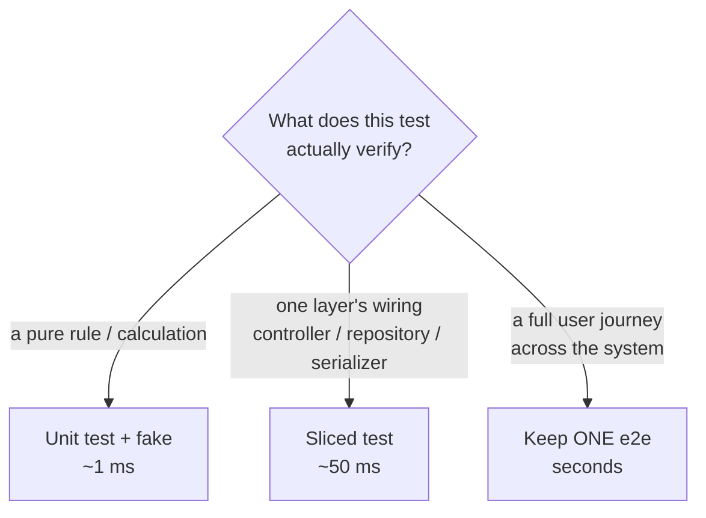
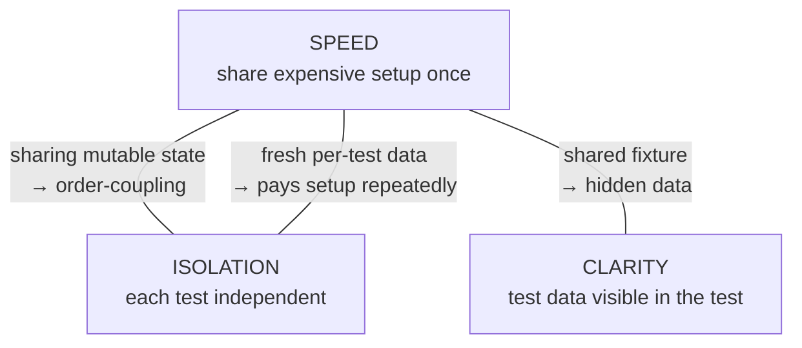
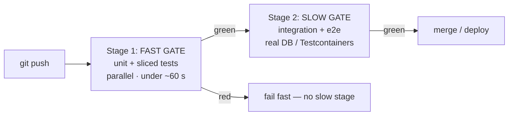

# Slow Tests — Senior Level

> **Category:** [Testing Anti-Patterns](../README.md) → **Slow Tests** — *a suite so slow the team stops running it before pushing.*

---

## Table of Contents

1. [Introduction](#introduction)
2. [Prerequisites](#prerequisites)
3. [Profile the Suite, Not a Guess](#profile-the-suite-not-a-guess)
4. [Reshaping an Inverted Pyramid](#reshaping-an-inverted-pyramid)
5. [Test Slicing — Boot the Slice, Not the World](#test-slicing--boot-the-slice-not-the-world)
6. [Parallelization Needs Isolation](#parallelization-needs-isolation)
7. [Shared Fixtures: the Speed/Isolation/Mystery-Guest Triangle](#shared-fixtures-the-speedisolationmystery-guest-triangle)
8. [Staging CI: Fast Gate, Slow Gate](#staging-ci-fast-gate-slow-gate)
9. [A Worked Speed-Up](#a-worked-speed-up)
10. [Common Mistakes](#common-mistakes)
11. [Test Yourself](#test-yourself)
12. [Cheat Sheet](#cheat-sheet)
13. [Summary](#summary)
14. [Further Reading](#further-reading)
15. [Related Topics](#related-topics)

---

## Introduction

> Focus: **Speeding up a real suite** — profiling, reshaping an inverted pyramid, parallelizing safely, slicing, and staging CI.

The junior and middle files were about *not creating* slow tests. The senior reality is that you inherit a suite that is *already* slow — 40 minutes of CI, an inverted pyramid built over three years, a dozen tests that each boot a full application context, parallelism turned off because "it was flaky." Nobody runs it locally; people push and wait. Your job is to make it fast again **without** losing coverage and **without** introducing flakiness, on a suite you can't stop the world to rewrite.

This is an optimization problem, and it obeys the same laws as any other: **profile first, attack the dominant cost, measure the delta, and respect the constraints** — here the binding constraint is *isolation*. The naïve speed-ups (turn on parallelism, share all setup) trade slowness for [flakiness](../02-flaky-tests/senior.md), which is a worse disease: a flaky suite is *also* ignored, and now you've spent effort making the safety net less trustworthy. Every technique in this file is paired with the isolation discipline that keeps it honest.

> **The senior mindset:** test speed is a system property with a budget, not a per-test afterthought. You manage it the way you manage a latency SLO — measure it continuously, attribute regressions, and defend the budget in CI. And you never buy speed with correctness: a fast-but-flaky suite is a regression, not a win.

---

## Prerequisites

- **Required:** Fluency with [`middle.md`](middle.md) — the five causes, fakes vs mocks, and ranking tests by duration.
- **Required:** You've owned a CI pipeline and can add stages, caching, and parallelism to it.
- **Required:** A working model of test isolation — why two tests sharing mutable state order-couple, and what a transaction-rollback or unique-key strategy buys.
- **Helpful:** Familiarity with test-sliced frameworks (`@DataJpaTest`, `@WebMvcTest`, `httptest`, pytest fixtures) and with Testcontainers.
- **Helpful:** `integration-testing`, `unit-testing-patterns`, and `profiling-techniques` skills for the vocabulary.

---

## Profile the Suite, Not a Guess

Optimizing tests by intuition wastes effort on the wrong tests. Get the data first, at three resolutions:

1. **Per-test ranking** (from `middle.md`): `pytest --durations=0`, `go test -json`, JUnit Surefire XML. Find the power-law top.
2. **Setup vs body.** pytest splits `setup`/`call`/`teardown`; a fat `setup` total across many tests means a fixture-scope problem, not slow test bodies. In Go, time `TestMain` and any package-level `init`; in JUnit, separate `@BeforeAll`/`@BeforeEach` cost from the method.
3. **Wall-clock vs CPU.** If the suite takes 12 minutes of wall-clock but the CPU was 80% idle, you're **I/O- or wait-bound** (real I/O, sleeps, serial execution waiting on the network) — the fix is fakes/awaits/parallelism. If the CPU was pinned, you're **compute-bound** — the fix is less work per test or fewer redundant tests. These call for opposite remedies, so measure which one you have.

```bash
# Go: total wall time vs whether the box was busy.
/usr/bin/time -v go test ./...     # look at "Elapsed (wall clock)" vs "Percent of CPU"
go test -cpuprofile=cpu.out ./...  # if compute-bound, profile what the tests spend on
```

Build a quick **histogram**: how many tests under 10 ms, 10–100 ms, 100 ms–1 s, over 1 s? A healthy unit suite is almost entirely sub-10 ms with a thin tail. A heavy tail of >1 s "unit" tests is the inverted pyramid showing up as a distribution.

---

## Reshaping an Inverted Pyramid

The dominant cost in most slow suites is structural: too many tests run through too many layers. You can't fix this test-by-test in an afternoon; it's a campaign. The move is to **reclassify and rehome**, not to delete.

For each slow, broad test, ask *what does it actually verify?* and push it to the lowest layer that catches that bug:



The campaign, run incrementally so it ships in safe steps:

1. **Inventory the e2e tests** and tag what each one *uniquely* covers. Many "end-to-end" tests redundantly re-verify the same business rule through the front door.
2. **Extract the rule into a unit test** with a fake, asserting the same behavior. Keep the e2e test for now.
3. **Demote or delete the redundant e2e test** once the rule is covered faster below it. You're not losing coverage — you moved it down and made it 1000× faster.
4. **Keep the genuinely-end-to-end few** — the critical-path smoke tests that prove the wiring actually holds in aggregate. A handful, not hundreds.

The end state isn't "no slow tests" — it's a pyramid where the slow tests are *few and deliberate*, each earning its cost by covering something the fast tests structurally can't.

> **Don't over-correct into the opposite failure.** A suite of only fast unit tests with fakes can be **green while the system is broken** — every unit passes but the parts don't actually fit together, because the fakes lied about the real boundary. You need the integration layer. The pyramid is *narrow* at the top, not *empty* (the professional file argues this debate — "honeycomb"/"trophy" — in full).

---

## Test Slicing — Boot the Slice, Not the World

A major source of slowness is per-test heavyweight setup (middle Cause 4). The senior refinement is **slicing**: boot only the layer the test exercises, not the entire application.

The textbook case is Spring. A full `@SpringBootTest` starts the whole context — every bean, every auto-configuration, the web server. If the test only exercises a JPA repository, that's enormous waste:

```java
// SLOW — full application context to test one repository query (~3–6 s to boot).
@SpringBootTest
class UserRepositoryTest {
    @Autowired UserRepository repo;
    @Test void findsByEmail() { /* ... */ }
}

// FAST — slice: only the JPA layer + an in-memory/Testcontainers DB (~hundreds of ms).
@DataJpaTest
class UserRepositoryTest {
    @Autowired UserRepository repo;
    @Test void findsByEmail() { /* ... */ }   // no web layer, no service beans booted
}
```

The same principle generalizes across stacks: **test the unit, not the world.**

| You're testing | Don't boot | Slice to |
|---|---|---|
| A repository query (Spring) | full context | `@DataJpaTest` |
| A controller's routing/JSON (Spring) | full context | `@WebMvcTest` + mocked service |
| An HTTP handler (Go) | the whole server | `httptest.NewRecorder` + the handler func |
| A Django view | live server + full middleware | the test client against one view |
| A pure rule | any framework | a plain unit test with a fake |

Slicing cuts both the **boot cost** (fewer beans/components started) and the **blast radius** (a slice failure points at one layer). It's the structural complement to fakes: fakes remove I/O from a *test*; slicing removes layers from the *harness*.

> Slices still touch real infrastructure where it matters — `@DataJpaTest` against a real Postgres (via Testcontainers) verifies the *actual* SQL dialect, not an H2 approximation that lies. The slice makes that integration test cheap enough to keep; it doesn't turn it into a unit test. This is the `integration-testing` skill's core move: real boundary, minimal harness.

---

## Parallelization Needs Isolation

A serial suite leaves most of your cores idle. Parallelism is often the single biggest wall-clock win — and the single biggest way to *introduce flakiness*, because parallel tests that share state race. **Parallelism is a multiplier on isolation, not a substitute for it.**

The runners:

```go
// Go — t.Parallel() opts a test into the parallel pool within its package;
// packages already run in parallel by default.
func TestThing(t *testing.T) {
    t.Parallel()
    // ...must not touch shared globals, fixed ports, or shared files.
}
```

```bash
pytest -n auto          # pytest-xdist: one worker per core
go test -p 8 ./...      # up to 8 packages concurrently (default = GOMAXPROCS)
# JUnit 5: junit.jupiter.execution.parallel.enabled=true (+ a strategy)
```

Parallelism is only safe if tests are **independent**. The shared-state hazards, and their fixes:

| Shared resource | Race symptom | Isolation fix |
|---|---|---|
| A real database / table | tests see each other's rows | a **schema/DB per worker**, or transaction-rollback per test, or unique keys per test |
| A fixed TCP port | "address already in use" | bind port `:0` and read the assigned port |
| A temp file / fixed path | one test clobbers another's file | a unique temp dir per test (`t.TempDir()`, `tmp_path`) |
| A global singleton / clock | nondeterministic reads | inject the dependency; no shared mutable globals |
| An external sandbox account | rate limits, cross-talk | namespace by worker, or fake it |

```python
# pytest-xdist: give each worker its own database so they can't collide.
@pytest.fixture(scope="session")
def db_url(worker_id):                       # worker_id = "gw0", "gw1", ... or "master"
    name = f"test_{worker_id}"
    create_database(name)
    yield connection_string(name)
    drop_database(name)
```

This is the deep link to [Flaky Tests](../02-flaky-tests/senior.md): the work you do to make tests *isolated enough to parallelize* is exactly the work that makes them *not flaky*. The two anti-patterns share a cure. If turning on `-n auto` makes tests fail, the tests were already non-isolated — parallelism didn't break them, it *revealed* a latent dependency. Fix the isolation; don't turn parallelism back off.

---

## Shared Fixtures: the Speed/Isolation/Mystery-Guest Triangle

Here is the central senior tension. Three forces pull against each other:



- Push for **speed** by sharing setup, and you risk **order-coupling** (lost isolation, → flakiness).
- Push for speed by sharing *data*, and the data is no longer visible in the test — a [**Mystery Guest**](../03-mystery-guest/senior.md): the reader can't see what the test depends on.
- Push for perfect **isolation and clarity** with a fresh fixture per test, and you pay the expensive setup on every test — slow again.

The senior resolution is to **split the fixture by mutability and visibility**:

- **Share the expensive, immutable, behavior-neutral part** once: the running container, the booted context, the applied schema, a read-only reference dataset. It has no per-test state, so sharing it can't order-couple anything.
- **Make the mutable, behavior-relevant part fresh and local** to each test, and *visible in the test body* so it's not a Mystery Guest. The cheap mechanisms:
  - **Transaction per test, rolled back** — the database engine is shared and warm; each test's writes vanish on rollback. Fast *and* isolated.
  - **Unique keys per test** — namespace rows by a per-test id so tests can't see each other's data even on a shared table.
  - **In-test construction** — build the specific entities the test asserts on *in the test*, against the shared schema, so the data is explicit.

```java
// Pattern: share the warm engine, isolate (and reveal) the data.
@DataJpaTest                               // ← shared sliced context, booted once
@Transactional                             // ← each test rolls back: isolation + speed
class OrderRepositoryTest {
    @Autowired OrderRepository repo;

    @Test void findsPendingOrders() {
        repo.save(new Order("o-1", PENDING)); // ← data built IN the test: not a Mystery Guest
        repo.save(new Order("o-2", SHIPPED));
        assertEquals(1, repo.findByStatus(PENDING).size());
    }                                          // rollback here — next test starts clean
}
```

This single arrangement satisfies all three forces: the context boots once (speed), the transaction rolls back (isolation), and the data is constructed in the test (clarity). That's the senior target whenever expensive setup meets per-test data.

---

## Staging CI: Fast Gate, Slow Gate

You will not make every test fast — some integration and e2e tests are *legitimately* slow because realism costs time. The senior move is to **segregate them by speed and run them at different cadences**, so slow tests never block fast feedback.



- **Tag tests by speed/class:** `@Tag("slow")` / `@Tag("integration")` (JUnit), `@pytest.mark.slow`, Go build tags (`//go:build integration`).
- **Stage 1 — the fast gate:** the unit + sliced suite, parallelized, on every push. Under a minute. This is the gate developers feel; it must be fast and reliable.
- **Stage 2 — the slow gate:** integration and e2e, only after Stage 1 is green (no point booting Testcontainers if a unit test already failed). Run pre-merge and on `main`.
- **Locally**, the default `make test` runs only the fast set; `make test-all` runs everything. The fast set is what people run constantly; the slow set is what CI guarantees.

```makefile
test:        ## fast feedback — what you run before every push
	go test -short ./...                # skip tests guarded by testing.Short()
test-all:    ## everything, including real-infra integration tests
	go test ./... -tags=integration
```

The economics matter at scale (the professional file goes deep): CI minutes cost money and queue time. Running 200 Testcontainers boots on every keystroke is wasteful; running them once per merge, in parallel, after the fast gate, is cheap insurance. Staging buys you both fast local feedback *and* realistic pre-merge coverage — you stop choosing between them.

---

## A Worked Speed-Up

A concrete before/after on a representative slow `OrderService` suite (40 tests).

**Before — 4 minutes 50 seconds, run by nobody locally.**

- 28 "unit" tests each connect to a real Postgres → ~40 ms × 28 ≈ 1.1 s, but each also boots a full Spring context (`@SpringBootTest`) → ~4 s × 28 ≈ 112 s of boot.
- 6 tests use `Thread.sleep(2_000)` after submitting async jobs → 12 s, and occasionally flaky.
- The whole thing runs serially.
- 6 genuine e2e tests, ~5 s each → 30 s.

**The plan, in dominant-cost order (from the profile):**

1. **Kill the per-test context boot** (112 s — the giant). Replace `@SpringBootTest` with `@DataJpaTest` slices for the repository tests and plain unit tests + fakes for the pure-rule tests. Context boots drop from 28× to a couple of cached slices.
2. **Replace the 6 sleeps with Awaitility** (12 s → < 1 s, and the flakiness disappears).
3. **Move 18 of the 28 "unit" tests off the database entirely** — they tested business rules, not SQL — into fakes. The 10 that genuinely test queries stay as `@DataJpaTest` against a Testcontainers Postgres, `@Transactional` so they roll back.
4. **Parallelize** the now-isolated suite (`-n`/JUnit parallel; each worker gets its own schema).
5. **Stage CI:** the unit + sliced suite is the fast gate; the 6 e2e tests move to the slow gate, run pre-merge only.

**After — fast gate ~14 seconds, run on every push; slow gate ~35 seconds pre-merge.**

| Slice | Before | After | How |
|---|---|---|---|
| 28 context boots | ~112 s | ~3 s | `@DataJpaTest` slice / unit + fake; context cached |
| Real-DB "unit" tests | (in above) | moved | 18 → fakes; 10 → `@DataJpaTest` + rollback |
| 6 `sleep(2s)` | ~12 s | < 1 s | Awaitility `await().until(...)` |
| Serial execution | ×1 | ~×4 | parallel, schema-per-worker isolation |
| 6 e2e × 5 s | 30 s | 0 s on push | moved to slow gate (pre-merge only) |
| **Local fast suite** | **~4 m 50 s** | **~14 s** | the sum of the above |

The win wasn't a single trick — it was **profile → attack the dominant cost (context boots) → award realism only where it pays (10 DB tests) → parallelize with isolation → stage the rest.** And critically, coverage didn't drop: the SQL is still tested (sliced), the async completion is still tested (awaited), the journeys are still tested (e2e, just pre-merge). Faster *and* not flakier.

---

## Common Mistakes

1. **Turning on parallelism without isolation.** It doesn't *break* tests — it *reveals* that they were never independent. Fix the shared state (DB-per-worker, port `:0`, temp dirs); don't disable parallelism.
2. **Buying speed with flakiness.** A fast flaky suite is a regression: it's *also* ignored, and now untrustworthy. Every speed-up must keep tests isolated.
3. **Sharing mutable fixtures to go fast.** Share the warm *engine* (context, container, schema); isolate the *data* (transaction-rollback, unique keys). Sharing mutable data creates order-coupling and Mystery Guests.
4. **`@SpringBootTest` everywhere.** A full context per test is the most common hidden cost. Slice to `@DataJpaTest` / `@WebMvcTest`; reserve the full boot for a few true end-to-end tests.
5. **Deleting integration tests to win the budget.** Fast-only suites pass while the system is broken (the parts don't fit). Narrow the top of the pyramid; don't remove it.
6. **One CI stage for everything.** Slow tests blocking the fast gate trains people to ignore CI. Stage it: fast gate on push, slow gate pre-merge.
7. **Optimizing without re-profiling.** After each change, re-rank. The dominant cost shifts; chase the *new* top, not the one you already fixed.

---

## Test Yourself

1. You inherit a 40-minute suite. Before changing any test, what three things do you measure, and why each?
2. A test boots `@SpringBootTest` to verify one repository query. What's the fix, and what coverage do you keep vs lose?
3. You turn on `pytest -n auto` and 15 tests start failing randomly. What does this tell you about the tests, and what's the fix (not "turn parallelism off")?
4. Explain the speed/isolation/clarity triangle and the single arrangement that satisfies all three when expensive setup meets per-test data.
5. Why does a suite of *only* fast unit tests with fakes risk being green while the system is broken?
6. Design a two-stage CI split for a suite of unit, sliced, integration, and e2e tests. What runs where, and in what order?

<details>
<summary>Answers</summary>

1. (a) **Per-test ranking** — find the power-law top to attack first. (b) **Setup vs body** — a fat setup total means a fixture-scope problem, not slow bodies. (c) **Wall-clock vs CPU** — I/O/wait-bound (→ fakes/awaits/parallelism) and compute-bound (→ less work/fewer tests) need opposite fixes; measure which you have.
2. Replace `@SpringBootTest` with `@DataJpaTest` (a slice that boots only the JPA layer + a real DB via Testcontainers). You **keep** real-SQL coverage (the query is verified against the real dialect) and **lose** nothing meaningful — the web/service beans weren't exercised by that test anyway. Boot cost drops from seconds to hundreds of ms.
3. The tests were **never isolated** — they share mutable state (a table, a port, a file, a global) and parallelism made the races visible. Fix the isolation: DB/schema per worker, bind port `:0`, unique temp dirs, inject the clock. Parallelism revealed a latent bug; don't hide it again.
4. **Speed** wants shared setup; **isolation** wants independent tests; **clarity** wants the data visible in the test. Sharing mutable state breaks isolation; sharing data hides it (Mystery Guest); fresh-everything is slow. The arrangement: **share the expensive immutable engine once** (booted context/container/schema) and **make the mutable data fresh, local, and built in the test** — e.g. `@DataJpaTest` + `@Transactional` rollback with entities constructed in the test body. Fast, isolated, and explicit.
5. Fakes stand in for real boundaries, and a fake can **lie** about how the real system behaves (SQL dialect quirks, serialization, wiring, transaction semantics). Every unit can pass while the *integration* between them — which no unit test exercises — is broken. You need a narrow band of integration tests to catch that.
6. **Stage 1 (fast gate, every push, parallel):** unit + sliced tests — under ~60 s. **Stage 2 (slow gate, pre-merge / on main, only if Stage 1 is green):** integration (real DB/Testcontainers) + e2e. Order matters: don't pay to boot containers if a unit test already failed. Locally, default `test` runs Stage 1; `test-all` runs both.

</details>

---

## Cheat Sheet

| Technique | When | Watch out for |
|---|---|---|
| Profile (rank, setup-vs-body, wall-vs-CPU) | always first | optimizing un-ranked tests |
| Reshape pyramid (push tests down) | inverted/ice-cream cone | over-correcting to *no* integration tests |
| Slice (`@DataJpaTest`, `httptest`, `@WebMvcTest`) | per-test full-context boot | a slice that fakes away the real boundary you meant to test |
| Parallelize (`-n auto`, `t.Parallel()`) | serial suite, idle cores | **non-isolated** tests → flakiness |
| Isolate (DB-per-worker, rollback, port `:0`) | before/with parallelism | sharing mutable state |
| Share warm engine + fresh data | expensive setup + per-test data | shared *mutable* data (Mystery Guest / coupling) |
| Stage CI (fast gate / slow gate) | legitimately slow tests exist | one stage for everything blocks fast feedback |

> **One rule to remember:** *Profile, attack the dominant cost, and never buy speed with isolation — the work that makes tests parallelizable is the same work that makes them not flaky.*

---

## Summary

- **Profile at three resolutions:** per-test ranking, setup-vs-body, and wall-clock-vs-CPU. They point at different fixes; guessing wastes effort on the wrong tests.
- **Reshape the inverted pyramid** as a campaign: reclassify each slow test to the lowest layer that catches its bug, move the rule down to a fast unit test, then demote the redundant e2e test. Keep a narrow top — don't delete the integration band.
- **Slice the harness:** boot the layer under test (`@DataJpaTest`, `@WebMvcTest`, `httptest`), not the whole application. The structural complement to fakes.
- **Parallelize, but only with isolation** — DB/schema per worker, port `:0`, unique temp dirs, injected clock. Parallelism *reveals* non-isolation; it doesn't cause it. This is the shared cure with Flaky Tests.
- **Resolve the speed/isolation/clarity triangle** by sharing the warm *engine* and keeping the *data* fresh, local, and visible (transaction-rollback + in-test construction).
- **Stage CI:** fast gate (unit + sliced, parallel, on push) then slow gate (integration + e2e, pre-merge). Slow tests never block fast feedback.
- Next: [`professional.md`](professional.md) — *the pyramid-vs-trophy debate, test-time budgets, CI cost economics, and amortizing an expensive shared container.*

---

## Further Reading

- **Succeeding with Agile** — Mike Cohn (2009) — the test pyramid as a budget for where coverage lives.
- **xUnit Test Patterns** — Gerard Meszaros (2007) — **Slow Tests**; *Shared Fixture* vs *Fresh Fixture*; *Lazy Setup* / *Suite Fixture Setup*.
- **Test Pyramid** — Martin Fowler — reshaping a suite away from the ice-cream cone.
- **Unit Test** (bliki) — Martin Fowler — *solitary* vs *sociable*, and what a slice should and shouldn't fake.

---

## Related Topics

- [Flaky Tests](../02-flaky-tests/senior.md) — the isolation work that enables parallelism is the same that removes flakiness.
- [Mystery Guest](../03-mystery-guest/senior.md) — the clarity cost of shared fixtures; the third corner of the triangle.
- [Over-Mocking](../06-over-mocking/senior.md) — when a fake/slice fakes away the boundary you meant to test.
- [Performance → Premature Optimization Traps](../../06-performance/01-premature-optimization-traps/senior.md) — profile-first optimization, applied to test time.
- [Architecture → Anti-Patterns](../../../../../Architecture/anti-patterns/README.md) — system structures that resist change.
