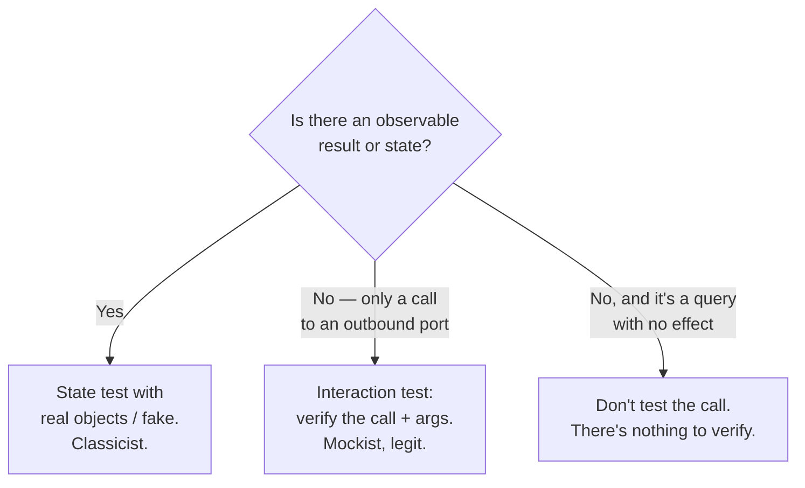

# Over-Mocking — Senior Level

> **Category:** [Testing Anti-Patterns](../README.md) → **Over-Mocking** — *mocking so much that the test verifies the mocks, not the behavior.*

---

## Table of Contents

1. [Introduction](#introduction)
2. [Prerequisites](#prerequisites)
3. ["Hard to Test Without Mocking Everything" Is a Design Smell](#hard-to-test-without-mocking-everything-is-a-design-smell)
4. [The Two Schools: London vs Detroit](#the-two-schools-london-vs-detroit)
5. [Pushing I/O to the Edges](#pushing-io-to-the-edges)
6. [Building Fakes and In-Memory Doubles That Scale](#building-fakes-and-in-memory-doubles-that-scale)
7. [Contract Tests for the Mocked Boundaries](#contract-tests-for-the-mocked-boundaries)
8. [Right-Sizing Doubles Across the Suite](#right-sizing-doubles-across-the-suite)
9. [Common Mistakes](#common-mistakes)
10. [Test Yourself](#test-yourself)
11. [Cheat Sheet](#cheat-sheet)
12. [Summary](#summary)
13. [Further Reading](#further-reading)
14. [Related Topics](#related-topics)

---

## Introduction

> Focus: **Right-sizing test doubles across a suite, and reading mocking pain as design feedback.** "Hard to test without mocking everything" is a *design* smell, not a testing problem. Push I/O to the edges so the core needs no mocks; build fakes for the boundaries; cover the seams with contract tests.

[`junior.md`](junior.md) taught recognition; [`middle.md`](middle.md) gave the per-collaborator decision. At the senior level the unit of concern is no longer one test — it's the **whole suite and the design it reflects**. Two ideas drive everything here:

1. **Mocking pain is a sensor, not an obstacle.** When a test needs eight mocks to run, the honest response is not "write eight mocks faster" — it's "the unit under test has eight dependencies, and *that* is the problem." Over-mocking is frequently the **symptom**; tangled, boundary-ignorant design is the **disease**.
2. **You shape the production code so the tests barely need doubles.** A well-factored system has a large, pure core (testable with real objects and zero mocks) and a thin shell of adapters at the boundaries (testable with fakes and a handful of contract tests). The amount of mocking a codebase requires is a *readout* of how well I/O has been separated from logic.

> **The senior mental model:** the number of mocks a test needs is roughly the number of boundaries the unit touches. If that number is high, don't make the test smarter — make the unit touch fewer boundaries.

---

## Prerequisites

- **Required:** Fluent with [`middle.md`](middle.md) — boundaries, fakes over mocks, don't-mock-what-you-don't-own.
- **Required:** You can refactor production code, not just tests, in response to test pain (extract a port, invert a dependency, move I/O out of a method).
- **Required:** Comfortable with dependency injection and hexagonal/ports-and-adapters thinking (the `dependency-injection` skill).
- **Helpful:** You've maintained a suite long enough to watch mock-heavy tests rot — drift from reality, break on refactors, and erode trust.
- **Helpful:** Familiarity with consumer-driven contract testing (Pact or equivalent) and the `integration-testing` skill.

---

## "Hard to Test Without Mocking Everything" Is a Design Smell

The most valuable signal a senior reads from over-mocking is **diagnostic**. Listen to the complaints that lead to it:

> "I can't test `OrderService` without mocking the DB, the mailer, the payment gateway, the clock, the inventory API, and the audit log."

That sentence is not describing a hard test. It's describing a **God-class with too many dependencies** (see [Design → Coupling and State](../../02-design/02-coupling-and-state/senior.md)). The mocks are the messenger. Killing the messenger — writing the eight mocks — locks the bad design in place and produces a test that is fragile, slow to write, and useless at catching real bugs.

The map from mocking pain to its design cause:

| Mocking pain you feel | The design smell it reveals | The real fix |
|---|---|---|
| Need many mocks to construct the unit | Too many dependencies / low cohesion | Split the class; extract focused collaborators |
| Must mock a class you instantiate inside the method | Hidden dependency, no seam | Inject it; depend on an interface |
| Mocking deep chains: `a.getB().getC().doD()` | Train-wreck coupling (Law of Demeter) | Tell, don't ask; pass `C` directly, or return a value |
| Have to mock the clock/DB/HTTP *inside* domain logic | I/O entangled with business rules | Push I/O to the edges; keep the core pure |
| Mock returns feed straight into the next mock | The unit is just plumbing between boundaries | There may be no logic to test — delete the test or test the seam with integration |

**Deep stub chains** deserve special mention because they're a fork of over-mocking that screams design feedback:

```java
// Smell: mocking a chain means coupling to a chain.
when(order.getCustomer().getAddress().getCountry().getCode()).thenReturn("US");
```

To write that mock you had to know — and freeze — the entire navigation path. Any change to how an order reaches a country code breaks the test. The mock didn't cause the coupling; it *exposed* it. The fix lives in production code: pass the `country code` (a value) to the unit, or have `Order` answer `order.shippingCountry()` directly. Now the test needs no chain and no mock.

> **The reframe:** when a test is hard to write because it needs many mocks, stop and treat it as a code review of the *production* code. The test is telling you the design has too many seams in the wrong places.

---

## The Two Schools: London vs Detroit

You cannot reason about over-mocking without the two schools of TDD, because they disagree about how much mocking is *correct*.

| | **Detroit / Classicist** (Beck, Khorikov) | **London / Mockist** (Freeman & Pryce, GOOS) |
|---|---|---|
| Default double | Real objects + fakes | Mocks for collaborators |
| Tests are | **Sociable** — exercise the unit *and* its real collaborators | **Solitary** — isolate one class, mock its neighbours |
| Verifies | **State / outcome** | **Interactions** between roles |
| Design pressure | Toward cohesive modules | Toward small objects with clear roles ("tell, don't ask") |
| Failure mode | Larger units; a bug can implicate several classes | **Over-mocking**; brittle, implementation-coupled tests |
| Treats a mock as | A last resort, at boundaries | A design tool for discovering interfaces |

Both schools are legitimate and both *correctly applied* avoid over-mocking — the London school explicitly says **mock roles, not objects** and **don't mock what you don't own**. Over-mocking is what you get from **the London school done carelessly**: mocking concrete classes, mocking value objects, mocking queries, and verifying every call. A disciplined mockist mocks only *roles at boundaries* and uses interaction tests where the interaction is the point.

The senior position is pragmatic, not tribal: **lean classicist for the core** (real objects, state assertions, large pure units are fine), and **use interaction tests precisely** at the few boundaries where the call is the only observable effect. Choose per-test based on *what's observable*, not by allegiance.



---

## Pushing I/O to the Edges

The structural cure that makes over-mocking *unnecessary* is **functional core, imperative shell** (a.k.a. hexagonal / ports-and-adapters). Separate the two kinds of code:

- **Functional core** — pure decision-making. Takes data in, returns data (or a description of what to do) out. No I/O. Testable with real objects and **zero mocks**.
- **Imperative shell** — the thin layer that does the I/O the core decided on. Small, mostly straight-line, covered by integration tests.

Before — I/O woven through the logic, forcing mocks:

```python
# Hard to test without mocking the clock, repo, and mailer.
class SubscriptionService:
    def renew(self, user_id):
        user = self.repo.get(user_id)                 # I/O
        if user.expires_at < datetime.utcnow():       # I/O (clock)
            user.expires_at = datetime.utcnow() + timedelta(days=30)
            self.repo.save(user)                      # I/O
            self.mailer.send(user.email, "renewed")   # I/O
```

After — the *decision* is a pure function; the I/O moves to the edge:

```python
# Pure core: no I/O, no mocks. Just data in, decision out.
@dataclass(frozen=True)
class RenewalDecision:
    new_expiry: datetime
    should_email: bool

def decide_renewal(user: User, now: datetime) -> RenewalDecision:
    if user.expires_at < now:
        return RenewalDecision(now + timedelta(days=30), should_email=True)
    return RenewalDecision(user.expires_at, should_email=False)

# Thin shell: does what the core decided. Covered by integration tests.
class SubscriptionService:
    def renew(self, user_id):
        user = self.repo.get(user_id)
        decision = decide_renewal(user, self.clock.now())   # pure call
        if decision.new_expiry != user.expires_at:
            user.expires_at = decision.new_expiry
            self.repo.save(user)
        if decision.should_email:
            self.mailer.send(user.email, "renewed")
```

Now the interesting logic — *when do we renew, for how long, do we email* — is tested with plain values and **no doubles at all**:

```python
def test_renews_when_expired():
    user = User(expires_at=datetime(2020, 1, 1))
    d = decide_renewal(user, now=datetime(2020, 6, 1))
    assert d.new_expiry == datetime(2020, 6, 1) + timedelta(days=30)
    assert d.should_email is True

def test_no_renew_when_active():
    user = User(expires_at=datetime(2099, 1, 1))
    d = decide_renewal(user, now=datetime(2020, 6, 1))
    assert d.should_email is False
```

The shell still touches the repo, clock, and mailer — but it has almost no branching, so a *few* integration tests cover it. The over-mocking problem dissolves because the part that needed mocks (the logic) no longer touches I/O.

---

## Building Fakes and In-Memory Doubles That Scale

For the boundaries that remain, invest in **fakes** rather than scattering mocks. A good fake is a small, correct, in-memory implementation of a port you own, written once and shared across the suite.

Principles for fakes that don't become liabilities:

1. **Implement the real interface.** The fake and the production adapter satisfy the same port, so they're interchangeable — and a contract test can verify both (next section).
2. **Make it behaviourally faithful for the cases tests rely on.** A fake repo must make `save` then `findById` consistent; a fake clock must let tests advance time; a fake queue must let tests drain and inspect messages.
3. **Keep it honest about failure modes tests need.** If production code handles "not found" or "duplicate key," the fake should be able to produce those, or the tests give false confidence.
4. **Don't let it diverge silently.** The single biggest risk of a fake is that it drifts from the real implementation. Contract tests are the guardrail.

```go
// Go — a fake message publisher that lets tests assert on what was published.
type FakePublisher struct{ Published []Event }

func (p *FakePublisher) Publish(e Event) error {
	p.Published = append(p.Published, e)   // record for state assertions
	return nil
}

// Test asserts on STATE (what was published), not on a mock's call log:
func TestShipOrder_PublishesEvent(t *testing.T) {
	pub := &FakePublisher{}
	svc := NewShippingService(NewFakeOrderRepo(), pub)

	require.NoError(t, svc.Ship("order-1"))

	require.Len(t, pub.Published, 1)
	require.Equal(t, "ShipmentRequested", pub.Published[0].Type)
	require.Equal(t, "order-1", pub.Published[0].OrderID)
}
```

Note this is *interaction-shaped behavior expressed as state*: instead of `verify(pub).publish(...)`, the fake **records** what happened and the test reads it back. This is the senior trick for outbound side-effects — a recording fake gives you the precision of interaction testing with the robustness of state assertions, and the same fake serves every test that touches publishing.

---

## Contract Tests for the Mocked Boundaries

Every mock and fake makes a **promise about how the real thing behaves**. Over-mocking's deepest cost is that those promises drift from reality and nobody notices until production. The senior countermeasure is to **verify the promise explicitly with contract tests** so the mocked seam can't silently lie.

Two layers:

**1. Same-suite contract test (fake vs real, in-process).** Write the port's behavioral expectations *once* as an abstract test, and run it against both the fake and the real adapter:

```java
// Java (JUnit 5) — one contract, two implementations.
abstract class AccountRepositoryContract {
    abstract AccountRepository newRepo();   // subclass supplies fake or real

    @Test void save_then_find_returns_saved() {
        var repo = newRepo();
        repo.save(new Account("a", 100));
        assertThat(repo.findById("a")).get().extracting(Account::balance).isEqualTo(100);
    }
    @Test void find_missing_returns_empty() {
        assertThat(newRepo().findById("nope")).isEmpty();
    }
}

class InMemoryAccountRepositoryTest extends AccountRepositoryContract {
    AccountRepository newRepo() { return new InMemoryAccountRepository(); }
}
class PostgresAccountRepositoryTest extends AccountRepositoryContract {  // @Tag("integration")
    AccountRepository newRepo() { return new PostgresAccountRepository(testDataSource()); }
}
```

Now your fast unit tests use the fake *with confidence*, because the contract guarantees the fake and Postgres agree on the behaviors the tests depend on. This is what makes "mock at boundaries, fake the rest" safe at scale: the seam the fake hides is *proven*, not assumed.

**2. Consumer-driven contract test (cross-service).** When the boundary is another team's HTTP service, an in-process fake can't see *their* deployments. Use a consumer-driven contract (Pact-style): your test records the request/response shapes your mock assumes, publishes them as a contract, and the *provider* runs that contract against their real service in their pipeline. If they change the API in a way that breaks your assumptions, *their* build goes red. This closes the false-confidence gap that ordinary mocks of external services leave wide open — the seam is verified against the live provider, continuously.


---

## Right-Sizing Doubles Across the Suite

Pulling it together into a suite-level policy a senior can defend in review:

- **Core / domain tests:** zero or near-zero doubles. Real objects, real value types, state assertions. If a domain test needs a mock, that's a design-review trigger.
- **Use-case / service tests:** fakes for stateful ports (repos, caches, queues); a *recording fake* for outbound side-effects; a stubbed clock/random for determinism. Assert on outcomes and on recorded effects.
- **Boundary / adapter tests:** integration tests against the real thing (or a sandbox/testcontainer). No mocking of the third party here — this is where reality gets checked.
- **Cross-service seams:** consumer-driven contract tests so external-service mocks can't drift.
- **The few legitimate interaction tests:** outbound ports with no observable state (notifier, audit logger, event publisher) — verify the call and its arguments, and prefer a recording fake where you can.

The shape of a healthy suite is a **wide pure base, a thin fake-backed middle, and a small integration/contract cap**. Over-mocking shows up as the inverse: a wide middle of mock-heavy service tests doing the work the core *should* be doing with real objects. When you see that inversion, the fix is in the production code — push logic into a pure core — not in the tests.

---

## Common Mistakes

1. **Treating mock count as a testing problem.** Eight mocks means eight dependencies. Refactor the unit; don't perfect the mocks.
2. **Mocking deep chains instead of fixing the coupling.** `when(a.getB().getC())...` freezes a navigation path. Pass the value, or add a method that returns it directly.
3. **Building fakes but never contract-testing them.** A fake that drifts from the real implementation is a slow-motion false-confidence bug. Run the same contract suite against both.
4. **Mocking external HTTP services with no consumer-driven contract.** Your mock encodes a guess about their API; when they change it, your green suite hides a production break. Add a contract.
5. **Going full mockist and mocking concrete classes / value objects / queries.** That's the London school misapplied — exactly the path to over-mocking. Mock *roles at boundaries*, not everything.
6. **Leaving I/O entangled and compensating with mocks.** If domain logic calls the clock and the DB directly, you'll mock forever. Push I/O to the shell; make the core pure.
7. **Verifying interactions when state is observable.** If you can read the result, read it. Reserve `verify` for genuinely effect-only collaborators.

---

## Test Yourself

1. A teammate says "this service is impossible to test without ten mocks." What is your *first* hypothesis, and where do you make the change?
2. Contrast the Detroit and London schools on: default double, what they verify, and their characteristic failure mode.
3. Explain "functional core, imperative shell" and why it reduces the *need* for mocks (not just the count).
4. You have an in-memory `FakeAccountRepo` and a `PostgresAccountRepo`. How do you keep the fake from lying to your unit tests over time?
5. When is mocking an *external* service insufficient even if done carefully, and what test closes the gap?
6. Rewrite this so the test needs no chain mock (production-side change is allowed):
   ```java
   when(order.getCustomer().getAddress().getCountry().getCode()).thenReturn("US");
   assertThat(taxService.rateFor(order)).isEqualTo(0.0875);
   ```

<details>
<summary>Answers</summary>

1. **First hypothesis: the service has too many dependencies / mixes I/O with logic — a design smell, not a test problem.** Make the change in the *production code*: split the class, push I/O to the edges, extract a pure core. The mocks were the messenger.
2. **Detroit/classicist:** default to real objects + fakes; verify **state/outcome**; failure mode is larger units where a bug implicates several classes. **London/mockist:** default to mocks for collaborators; verify **interactions**; failure mode is **over-mocking** — brittle, implementation-coupled tests.
3. Split code into a **pure functional core** (decisions: data in, data out, no I/O) and a **thin imperative shell** (does the I/O the core decided). The logic — the part worth testing thoroughly — no longer touches boundaries, so it's tested with real values and **zero mocks**; only the small, low-branching shell needs integration coverage. It removes the *reason* to mock, not just the mocks.
4. **A contract test:** write the port's behavioral expectations once as an abstract/shared suite and run it against *both* the fake and the real Postgres adapter. If they ever disagree, a test fails — so the fake stays faithful and unit tests that rely on it keep their integrity.
5. Mocking an external service is insufficient because your mock encodes *your assumption* about the provider's API; their deployment can change it and your suite stays green. Close the gap with a **consumer-driven contract test** (Pact-style) that the provider verifies against their real service in their pipeline.
6. Move the navigation into the domain and pass a value:
   ```java
   // production: Order exposes what the consumer needs, hiding the chain
   public String shippingCountry() { return customer.address().country().code(); }
   // test: no chain mock — use a real Order (or a one-line builder)
   Order order = anOrder().shippingTo("US").build();
   assertThat(taxService.rateFor(order)).isEqualTo(0.0875);
   ```

</details>

---

## Cheat Sheet

| Suite layer | Doubles | Assert on |
|---|---|---|
| Domain / core | **None** (real objects, value types) | State / return value |
| Use case / service | **Fakes** for stateful ports; recording fake for effects; stubbed clock | Outcomes + recorded effects |
| Adapter / boundary | **None** — integration vs real/sandbox | Real round-trip behavior |
| Cross-service seam | Consumer-driven **contract** | Provider honours your assumptions |
| Effect-only port (notifier) | Mock/spy or recording fake | The call + its arguments |

> **Senior rules:** *Mock count ≈ boundary count — if it's high, fix the design, not the mocks.* *Every mock/fake is a promise; back it with a contract test.* *Push I/O to the edges so the core needs no doubles.*

---

## Summary

- At suite scale, over-mocking is usually a **design signal**: "can't test without mocking everything" means too many dependencies or I/O tangled into logic. Fix the **production code**, not the test.
- The **London (mockist)** and **Detroit (classicist)** schools disagree on default doubles; over-mocking is the *London school done carelessly*. The senior stance: classicist for the core, precise interaction tests only at effect-only boundaries.
- **Push I/O to the edges** (functional core, imperative shell). The logic worth testing then runs with real values and **zero mocks**; a thin shell gets a few integration tests.
- Invest in **fakes** for the remaining boundaries; use **recording fakes** to express outbound side-effects as state assertions. Keep fakes honest with **contract tests** (fake-vs-real in-process; consumer-driven across services).
- A healthy suite is a wide pure base, a thin fake-backed middle, and a small integration/contract cap. The inverse — a fat mock-heavy middle — is over-mocking, and the cure is in the design.
- Next: [`professional.md`](professional.md) — *the mockist/classicist debate in full depth, when interaction testing is genuinely right, the false-confidence economics, and the precise test-double taxonomy.*

---

## Further Reading

- **Mocks Aren't Stubs** — Martin Fowler (2007) — classicist vs mockist, sociable vs solitary tests; the canonical framing.
- **Growing Object-Oriented Software, Guided by Tests** — Freeman & Pryce (2009) — "mock roles, not objects," ports and adapters discovered through TDD, *don't mock what you don't own*.
- **xUnit Test Patterns** — Gerard Meszaros (2007) — Fake Object, and the test-double taxonomy used precisely.
- **Unit Testing Principles, Practices, and Patterns** — Khorikov (2020) — Ch. 5 (mocks and test fragility), Ch. 8 (integration tests), the classicist case at scale.
- **Pact / consumer-driven contracts** (pact.io docs) — keeping cross-service mocks honest.
- **Functional Core, Imperative Shell** — Gary Bernhardt (Destroy All Software screencast) — the structural cure that removes the need to mock.

---

## Related Topics

- [Design → Coupling and State](../../02-design/02-coupling-and-state/senior.md) — why "needs many mocks" is the coupling smell wearing a test costume.
- [Fragile Tests](../01-fragile-tests/senior.md) — the failure mode over-mocking produces; the two anti-patterns share a root.
- [Mystery Guest](../03-mystery-guest/senior.md) — fixture discipline, the sibling skill to building good fakes.
- [Slow Tests](../05-slow-tests/senior.md) — the test pyramid that fakes and pure cores make achievable.
- [Architecture → Anti-Patterns](../../../../../Architecture/anti-patterns/README.md) — boundary and dependency smells at the system level.
- The `dependency-injection`, `integration-testing`, and `mocking-strategies` skills — the techniques behind ports, contract tests, and double selection.
