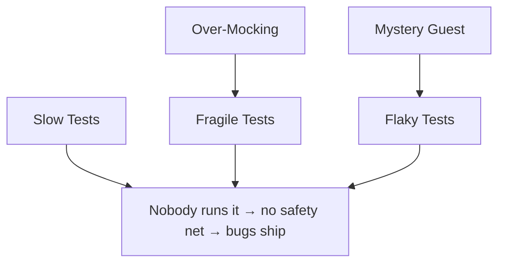

# Testing Anti-Patterns

> *"A test suite is a body of code, and code rots. The difference is that when production code rots you get bugs; when test code rots you stop trusting the tests — and then you stop running them."*

The anti-patterns in this chapter live in the **tests**, not the production code. They are the named shapes of bad tests — drawn mostly from Gerard Meszaros's *xUnit Test Patterns* and the test-smell literature that followed.

Every one of them makes the suite **lie**: it stays green while the code is broken, flips red when nothing changed, or grows so slow and brittle that the team quietly stops running it. A suite you don't trust is worse than no suite — it costs maintenance and gives false confidence.

---

## The Six Anti-Patterns

| Anti-pattern | Symptom | Primary cure |
|---|---|---|
| **[Fragile Tests](01-fragile-tests/junior.md)** | A test breaks on a change that didn't change behavior | Test behavior through the public API, not internals |
| **[Flaky Tests](02-flaky-tests/junior.md)** | Same code, same test, different result run to run | Control time, await conditions (not `sleep`), isolate state, seed randomness |
| **[Mystery Guest](03-mystery-guest/junior.md)** | A test depends on data you can't see in the test | Make fixtures local and explicit; build state in the test |
| **[Assertion Roulette](04-assertion-roulette/junior.md)** | Many unlabelled assertions; on failure you can't tell which | One logical assertion per test, or descriptive messages |
| **[Slow Tests](05-slow-tests/junior.md)** | The suite takes so long nobody runs it before pushing | Test pyramid, fakes over real I/O, parallelize, slice |
| **[Over-Mocking](06-over-mocking/junior.md)** | Tests assert on mocks, not behavior; refactors break them | Mock only at real boundaries; prefer fakes/real objects |

---

## Why These Sit in the Anti-Patterns Roadmap

Test smells are anti-patterns by the strict definition: a recurring "solution" (a way of writing the test) that looks reasonable, even diligent, but reliably produces a worse outcome — a suite that obstructs change instead of enabling it. They pair with the same cures as the rest of this roadmap: a code smell to name, and a better structure to move toward.

A fragile or flaky suite gets ignored; an ignored suite is not a safety net; without a safety net, refactoring stops and the **production** anti-patterns in the rest of this roadmap grow unchecked. Good tests are what make the other cures affordable.

---

## File Suite

Each anti-pattern ships the standard **8-file suite**:

| File | Focus |
|---|---|
| `junior.md` | What it looks like, why it's bad |
| `middle.md` | When it creeps in, what to do instead |
| `senior.md` | Fixing it across a real suite |
| `professional.md` | Edge cases, trade-offs, when it's tolerable |
| `interview.md` | 30+ Q&A |
| `tasks.md` | Exercises with solutions |
| `find-bug.md` | Spot the test smell |
| `optimize.md` | Refactor the bad test |

Code examples are in **Go**, **Java**, and **Python**, matching the rest of [Code Craft](../../README.md).

---

## Related Roadmaps

- [Anti-Patterns (parent)](../README.md) — the production-code anti-patterns these tests are supposed to catch.
- [Refactoring → Code Smells](../../refactoring/01-code-smells/README.md) — test smells are code smells in test code.
- The `unit-testing-patterns`, `mocking-strategies`, `test-data-management`, and `integration-testing` skills cover the positive patterns these anti-patterns violate.
