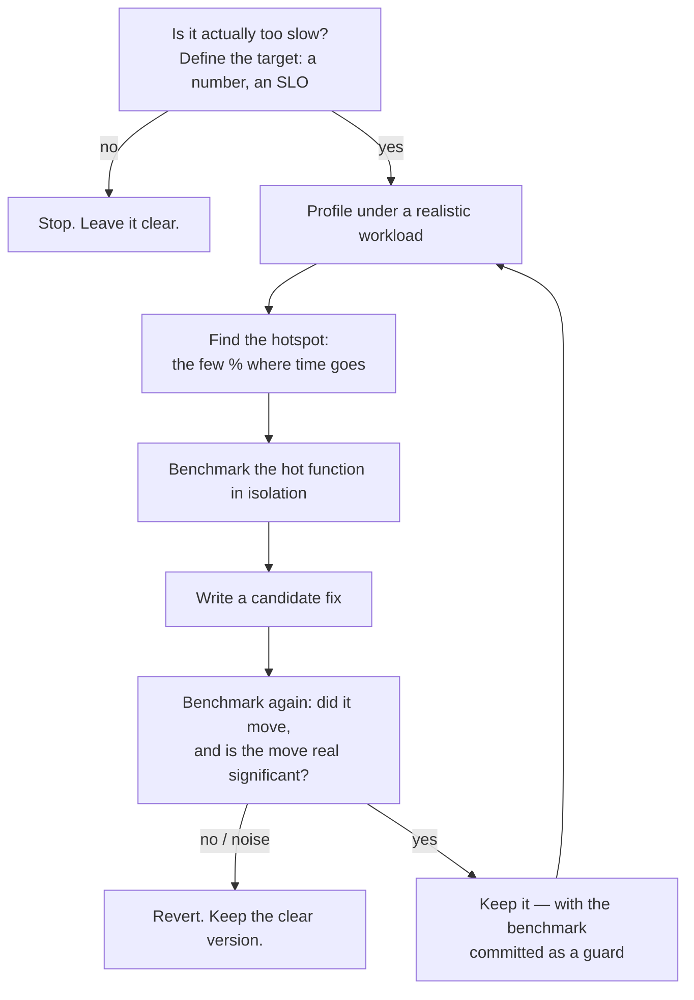

# Premature Optimization Traps — Middle Level

> **Category:** [Performance Anti-Patterns](../README.md) → **Premature Optimization Traps** — *code twisted for speed that was never measured and rarely matters.*

---

## Table of Contents

1. [Introduction](#introduction)
2. [Prerequisites](#prerequisites)
3. [The Measure-First Workflow](#the-measure-first-workflow)
4. [The 90/10 Rule (and Why Guessing Fails)](#the-9010-rule-and-why-guessing-fails)
5. [Profiling: Finding Where the Time Goes](#profiling-finding-where-the-time-goes)
6. [Benchmarking: Proving a Change Helped](#benchmarking-proving-a-change-helped)
7. [Worked Example: Profile → Hotspot → Fix Only That](#worked-example-profile--hotspot--fix-only-that)
8. [Recognizing the Trap in the Wild](#recognizing-the-trap-in-the-wild)
9. [Common Mistakes](#common-mistakes)
10. [Test Yourself](#test-yourself)
11. [Cheat Sheet](#cheat-sheet)
12. [Summary](#summary)
13. [Further Reading](#further-reading)
14. [Related Topics](#related-topics)

---

## Introduction

> Focus: **The measure-first workflow** — how to profile and benchmark *before* you optimize, so you fix the real hotspot instead of the one you guessed.

`junior.md` taught you to recognize a premature optimization by its shape: clever code, no benchmark, not hot. This file teaches the discipline that makes that shape impossible to fall into — **you measure first, and the measurement chooses the target.**

The core insight is uncomfortable: **developers are bad at guessing where time goes.** Decades of profiling experience converge on the same surprise — the slow part is almost never where the author expected. The string concatenation you fretted over is 0.1% of runtime; the JSON serialization you never thought about is 60%. This is why "optimize the code that looks slow" fails so reliably, and why the cure is not a better intuition but a tool that *shows* you the answer.

So the workflow has a fixed shape: **profile to find the hotspot → benchmark the candidate fix → keep it only if the number moved → leave everything else clear.** Skip the first step and you're guessing; skip the last and you've optimized the 97%. This file walks each step with real tools (`pprof`, `cProfile`/`py-spy`, JFR, `go test -bench`, JMH, `timeit`).

---

## Prerequisites

- **Required:** Solid with [`junior.md`](junior.md) — you can recognize the trap's shape and recite Knuth's full sentence.
- **Required:** Comfortable running tests and a command line in Go, Java, or Python.
- **Helpful:** The `profiling-techniques` and `big-o-analysis` skills — this file is their applied counterpart.
- **Helpful:** You've at least seen a flame graph, even if you couldn't read it yet. You will by the end of this file.

---

## The Measure-First Workflow

Every legitimate optimization runs the same loop. Memorize it; it's the antidote to the entire anti-pattern.



Two steps people skip, and the cost of skipping each:

- **Skip "is it actually too slow?"** → you optimize code that was already fast enough. The fastest code is the code you didn't need to make fast.
- **Skip "profile first"** → you optimize what *looks* slow, which is usually not what *is* slow. This is the engine of premature optimization.

---

## The 90/10 Rule (and Why Guessing Fails)

The empirical regularity behind all of this: **programs spend ~90% of their time in ~10% of the code** (the numbers vary — 80/20, 95/5 — but the shape holds). A small, concentrated hot path dominates; the rest is cold.

This single fact reorganizes everything:

- Optimizing the **10%** can produce large wins, because that's where the time is.
- Optimizing the **90%** is nearly worthless, because making cold code 2× faster of *zero* time is still zero.
- You **cannot tell which is which by reading.** The hot 10% is invisible to the eye — it's determined by the workload (how often each path runs), not by how the code looks.

[Amdahl's Law](../../../../../Programming/code-craft/README.md) makes the ceiling concrete: if a function is 5% of runtime, making it *infinitely* fast — free — speeds the program up by at most 5%. Premature optimization is, almost by definition, effort poured into that 5% (or 0.5%) while the dominating 90% is never touched. A profiler is the instrument that tells you which is which; without it, you're betting on a coin flip with a readability cost as the stake.

---

## Profiling: Finding Where the Time Goes

A **profiler** measures a *running* program and tells you where it spent its time. This is step one, always. The three ecosystems:

### Go — `pprof`

Go has profiling built into the toolchain. For a benchmark or a running service:

```go
// CPU profile from a benchmark:
//   go test -bench=. -cpuprofile cpu.out
//   go tool pprof -http=:8080 cpu.out      // flame graph in the browser

// Or in a running service, expose net/http/pprof:
import _ "net/http/pprof"
// then:  go tool pprof http://localhost:6060/debug/pprof/profile?seconds=30
```

In the `pprof` interactive view, `top` shows the functions with the most cumulative time, and the flame graph shows the call tree by width-as-time. The widest box is your hotspot — that, and nothing else, is what you're allowed to optimize.

### Python — `cProfile` and `py-spy`

```bash
# cProfile: deterministic, in-process, sorts by cumulative time
python -m cProfile -s cumtime myscript.py | head -20

# py-spy: a SAMPLING profiler — attach to a running process, no code change,
# produces a flame graph. Best for real services.
py-spy record -o profile.svg --pid 12345
py-spy top --pid 12345                    # live `top`-style view
```

Read the `cumtime` column: the function with the largest cumulative time is where the program lives.

### Java / JVM — JFR + async-profiler

```bash
# Java Flight Recorder (built in, low overhead):
java -XX:StartFlightRecording=duration=60s,filename=rec.jfr -jar app.jar
jfr print --events jdk.ExecutionSample rec.jfr   # or open rec.jfr in JMC

# async-profiler for flame graphs (samples wall/CPU, avoids safepoint bias):
java -agentpath:/path/libasyncProfiler.so=start,event=cpu,file=flame.html -jar app.jar
```

JMC (JDK Mission Control) renders the JFR recording as a flame graph; the hot stack frames sit at the bottom-wide part of the graph.

> **The one rule across all three:** profile under a **realistic workload**. A profile of an empty test, or of a workload that doesn't match production, points you at the wrong hotspot — and optimizing the wrong hotspot is just premature optimization with a profiler as an alibi.

---

## Benchmarking: Proving a Change Helped

A profiler tells you *where*. A **benchmark** tells you *whether your fix actually moved the number*. Without it, "I optimized this" means "I changed this and hoped." The trap isn't only in optimizing unmeasured code — it's in *believing* an unverified optimization worked.

### Go — `testing.B` + `benchstat`

```go
func BenchmarkParse(b *testing.B) {
	data := loadFixture()
	b.ResetTimer()
	for i := 0; i < b.N; i++ {
		_ = Parse(data)
	}
}
// Run old and new, compare with benchstat (10 runs each for a real p-value):
//   git stash; go test -bench=Parse -count=10 > old.txt; git stash pop
//   go test -bench=Parse -count=10 > new.txt
//   benchstat old.txt new.txt
```

`benchstat` reports a delta *and a p-value*. If it prints `~ (p=0.42)`, the change is **noise** — there is no improvement, no matter what your single-run gut said.

### Python — `timeit` / `pyperf`

```python
import timeit
old = timeit.repeat(lambda: parse_v1(data), number=1000, repeat=7)
new = timeit.repeat(lambda: parse_v2(data), number=1000, repeat=7)
print(min(old), min(new))   # min is the cleanest signal; the rest is noise/jitter
# For rigor (handles warm-up, jitter, system noise): use pyperf
#   python -m pyperf timeit -s 'from m import parse, data' 'parse(data)'
```

### Java — JMH

JMH is the only correct way to microbenchmark on the JVM; it handles warm-up, dead-code elimination, and JIT effects that naïve `System.nanoTime()` loops get wrong.

```java
@Benchmark
@BenchmarkMode(Mode.AverageTime)
@OutputTimeUnit(TimeUnit.NANOSECONDS)
public void parse(Blackhole bh) {
    bh.consume(Parser.parse(DATA));   // Blackhole stops the JIT deleting the result
}
// mvn package && java -jar target/benchmarks.jar Parse -f 3 -wi 5 -i 10
```

> **Benchmarking pitfalls** (the deep version is in `professional.md`): a single run is meaningless — measure many and compare distributions; a benchmark whose result is unused gets **dead-code-eliminated** to nothing (use `Blackhole`/`runtime.KeepAlive`); the first iterations are **warm-up** noise on the JVM. If you skip these, your "X% faster" is an artifact, and you'll ship a premature optimization while believing you measured it.

---

## Worked Example: Profile → Hotspot → Fix Only That

A report endpoint is "slow." The author's instinct is to optimize the obvious arithmetic loop. The profiler says otherwise.

```python
# The endpoint. Where does the time go? Don't guess — profile.
def build_report(orders):
    rows = []
    for o in orders:                          # 50,000 orders
        total = sum(li.qty * li.price for li in o.lines)   # looks "heavy"
        customer = db.query_customer(o.customer_id)        # one query PER order
        rows.append({"id": o.id, "name": customer.name, "total": total})
    return rows
```

**Step 1 — Profile.**

```bash
python -m cProfile -s cumtime report.py
#   ncalls  cumtime  percall  function
#    50000   41.20s    0.001  db.query_customer        <-- 96% of the time
#    50000    0.83s    0.000  build_report (sum loops) <-- the part we'd have "optimized"
```

The arithmetic loop — the thing that *looked* expensive — is 2% of runtime. The hotspot is `query_customer`, called once per order: a classic [N+1](../02-n-plus-one-in-code/middle.md). Had we "optimized" the `sum` with some numpy trick or a manual loop, we'd have made the code uglier and the endpoint **still 41 seconds slow.** That is premature optimization caught in the act by a profiler.

**Step 2 — Fix only the hotspot.** Batch the queries; leave the clear `sum` exactly as it is.

```python
def build_report(orders):
    ids = {o.customer_id for o in orders}
    customers = db.query_customers_in(ids)    # ONE query, not 50,000
    by_id = {c.id: c for c in customers}
    return [
        {"id": o.id,
         "name": by_id[o.customer_id].name,
         "total": sum(li.qty * li.price for li in o.lines)}  # unchanged, still clear
        for o in orders
    ]
```

**Step 3 — Benchmark to confirm.**

```text
            before        after
            41.2 s        0.4 s        (~100× — the real hotspot, removed)
```

Two lessons, both central to this anti-pattern:

1. **The slow part was not where intuition pointed.** Only the profile knew. Optimizing the `sum` would have been premature — effort on the cold 2%.
2. **We left the clear code clear.** The `sum` comprehension is readable and stayed. We changed *one* thing — the proven hotspot — and proved the win with a number.

---

## Recognizing the Trap in the Wild

In code review and your own work, these are the tells that an "optimization" was premature:

| Tell | What it signals |
|---|---|
| A perf-motivated change with **no benchmark in the PR** | Unmeasured — the author guessed. Ask for the number. |
| "This is faster" with no profiler output | Belief, not evidence. Where's the hotspot proof? |
| Cleverness in **cold code** — config, startup, error paths | Optimizing the 90% that isn't hot. |
| A cache/pool/bit-trick added "to be safe" / "for scale" | Speculative; that's also [over-engineering](../../01-development/03-over-engineering/senior.md). |
| A complex algorithm where `n` is provably tiny | The asymptotics never engage; you paid the constant-factor and bug cost for nothing. |
| The benchmark, if you write one, shows `~ (p>0.05)` | The change is noise. Revert it. |

The disciplined response to all of them is the same: **"Show me the profile and the benchmark."** If there isn't one, the optimization is premature until proven otherwise — and the simple version wins by default.

---

## Common Mistakes

1. **Profiling the wrong workload.** A profile of a 10-element test or an unrealistic input points at the wrong hotspot. Profile something that looks like production, or you've just guessed with extra steps.
2. **Trusting a single benchmark run.** One number is noise. Run many (`-count=10`, `repeat=7`, JMH forks) and compare distributions with `benchstat`/`pyperf`. A change inside the noise band is not a change.
3. **Optimizing before defining "fast enough."** Without a target (an SLO, a budget, a "this must finish in 200ms"), you can optimize forever and never know when to stop. Define the number first.
4. **Fixing the hotspot *and* a dozen cold spots in the same PR.** The cold-spot edits are premature and muddy the signal of the one change that mattered. Touch only what the profiler pointed at.
5. **Forgetting to re-profile after the fix.** Optimizing one hotspot often reveals the *next* one. The loop continues until you hit "fast enough," then stops.
6. **Microbenchmarking with a naïve loop on the JVM.** `nanoTime()` around a loop ignores warm-up, JIT, and dead-code elimination. Use JMH or your "result" is fiction.

---

## Test Yourself

1. State the measure-first workflow as an ordered loop. Which two steps do people most often skip, and what does skipping each cost?
2. What does the 90/10 rule imply about which code is worth optimizing — and why can't you find the 10% by reading?
3. A function is 4% of runtime per the profiler. You make it infinitely fast. What's the maximum whole-program speed-up, and what law says so?
4. You optimize a function and a single benchmark run shows it's 8% faster. Why is that not yet evidence? What do you do?
5. In the worked example, why would optimizing the `sum` comprehension have been premature, even though it's a real loop over 50,000 orders?
6. Name three tools — one each for Go, Python, Java — that find *where* time goes, and three that prove a fix *helped*.

<details>
<summary>Answers</summary>

1. **Is it actually too slow? (define a target) → profile under realistic load → find hotspot → benchmark candidate fix → keep only if the move is real → leave the rest clear → re-profile.** Most-skipped: **"is it actually too slow?"** (cost: optimizing already-fast code) and **"profile first"** (cost: optimizing what *looks* slow, not what *is* — the engine of premature optimization).
2. ~90% of time is in ~10% of code, so only that 10% is worth optimizing; the other 90% gives near-zero return. You can't find the 10% by reading because it's determined by the **workload** (how often each path runs), which is invisible in the source — only a profiler measures it.
3. **At most ~4.2%** (1 / (1 − 0.04) − 1). **Amdahl's Law.** Optimizing it is almost the definition of premature: large effort, ≤4% ceiling.
4. A single run is **noise** — jitter, GC, scheduling. Run many (e.g. `-count=10`) and compare distributions with `benchstat`/`pyperf`; if it reports `~ (p>0.05)`, the "8%" was an artifact. Keep the change only if the improvement is statistically real.
5. Because the **profiler showed it was 2% of runtime** — the hotspot was the N+1 `query_customer` at 96%. Optimizing the `sum` would have added complexity to cold code while the endpoint stayed ~41s slow. Effort on the 2% = premature.
6. **Where:** Go `pprof`; Python `cProfile`/`py-spy`; Java JFR/async-profiler. **Helped:** Go `testing.B`+`benchstat`; Python `timeit`/`pyperf`; Java JMH.

</details>

---

## Cheat Sheet

| Step | Go | Python | Java |
|---|---|---|---|
| **Profile (where)** | `pprof` (`-cpuprofile`, net/http/pprof) | `cProfile`, `py-spy` | JFR, async-profiler |
| **Benchmark (did it help)** | `testing.B` + `benchstat` | `timeit`, `pyperf` | JMH |
| **Read the result** | flame graph: widest box = hotspot | `cumtime` column | flame graph: bottom-wide frames |
| **Decide** | `~ (p>0.05)` ⇒ noise ⇒ revert | compare `min()` across repeats | needs warm-up + forks or it's fiction |

> **One rule to remember:** *Profile to choose the target; benchmark to confirm the fix; leave everything the profiler didn't point at exactly as clear as it was.*

---

## Summary

- The cure for premature optimization is a **fixed workflow**: define "fast enough" → profile under realistic load → fix only the hotspot → benchmark to confirm → leave the rest clear → re-profile.
- **Developers guess wrong about where time goes** — reliably. The hotspot is set by the workload, not by how code looks, so only a profiler can find it.
- The **90/10 rule** plus **Amdahl's Law** explain why: time concentrates in a small hot slice, and optimizing anything else has a near-zero ceiling.
- **Profilers** (`pprof`, `cProfile`/`py-spy`, JFR) tell you *where*; **benchmarks** (`benchstat`, `pyperf`, JMH) tell you *whether the fix worked* — and a single run is noise, so measure distributions.
- The worked example's lesson: the "heavy-looking" loop was 2% of runtime; the real hotspot was an N+1. Optimizing the loop would have been premature; the profiler chose the target.
- Next: [`senior.md`](senior.md) — *judgment in a real codebase: telling premature optimization from legitimate up-front design, and when a micro-opt is actually justified.*

---

## Further Reading

- **Programming Pearls** — Jon Bentley (2nd ed., 1999) — Columns on performance and the back-of-the-envelope estimate that tells you whether to bother.
- **Systems Performance** — Brendan Gregg (2nd ed., 2020) — Chapters 5–6 on CPU profiling and flame graphs; the USE method for finding hotspots.
- **Structured Programming with `go to` Statements** — Donald Knuth (1974) — re-read the efficiency section now that you can measure the 3%.
- **Go's `pprof` docs** and **JMH samples** — the canonical tutorials for the two most rigorous benchmark harnesses.

---

## Related Topics

- [Premature Optimization → senior.md](senior.md) — the judgment layer: design vs premature optimization.
- [Premature Optimization → junior.md](junior.md) — the shapes you're now measuring instead of guessing about.
- [N+1 in Code](../02-n-plus-one-in-code/middle.md) — the hotspot the worked example's profiler actually found.
- [Unnecessary Allocation](../03-unnecessary-allocation/middle.md) — profiling allocations specifically (heap profiles).
- [Wrong Data Structure](../04-wrong-data-structure/middle.md) — when the profile says "this scan is the hotspot."
- [Over-Engineering → senior.md](../../01-development/03-over-engineering/senior.md) — speculative "for scale" optimization is over-engineering too.
- The `profiling-techniques` and `big-o-analysis` skills — the measurement and complexity toolkit this file applies.
