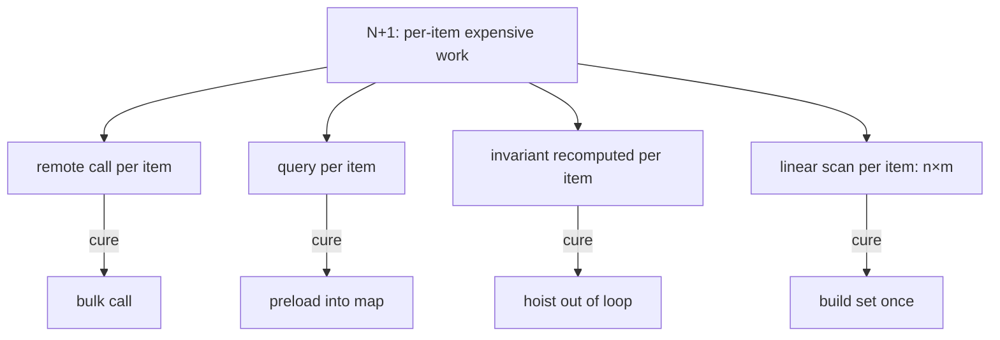

# N+1 in Code — Middle Level

> **Category:** [Performance Anti-Patterns](../README.md) → **N+1 in Code** — *per-item work in a loop that should have been done once.*

---

## Table of Contents

1. [Introduction](#introduction)
2. [Prerequisites](#prerequisites)
3. [The Four Shapes](#the-four-shapes)
4. [Shape 1 — Per-Item RPC → Bulk Call](#shape-1--per-item-rpc--bulk-call)
5. [Shape 2 — Query-in-Loop → Preload a Map](#shape-2--query-in-loop--preload-a-map)
6. [Shape 3 — Invariant Recomputed → Hoist It Out](#shape-3--invariant-recomputed--hoist-it-out)
7. [Shape 4 — Nested-Loop Membership → Set](#shape-4--nested-loop-membership--set)
8. [Picking the Right Cure](#picking-the-right-cure)
9. [Common Mistakes](#common-mistakes)
10. [Test Yourself](#test-yourself)
11. [Cheat Sheet](#cheat-sheet)
12. [Summary](#summary)
13. [Further Reading](#further-reading)
14. [Related Topics](#related-topics)

---

## Introduction

> Focus: **Spotting the different shapes, and applying the right fix to each.**

`junior.md` taught one shape (per-item call) and one cure (batch it). In real code N+1 wears several disguises, and the right fix differs:

- A **remote call per item** → replace with a **bulk call**.
- A **query per item** → **preload** the needed rows into a map before the loop.
- A **value recomputed every iteration** that doesn't depend on the item → **hoist** it out of the loop.
- A **membership check that linearly scans** a second collection inside the loop (`n × m`) → build a **set/map once** and look up.

All four are the same disease — *per-item expensive work that should be done once* — but they call for different moves. This file works each one before/after, and every fix is measured by the metric that proves it: the **call count** (or comparison count) dropping from `O(n)` to `O(1)`.

> **Why call count is the right metric.** Latency varies with machine and network; *call count* is deterministic and reveals the algorithmic shape. If a fix takes "1 + N calls" to "2 calls," it scales — regardless of how fast any one call is. Counting calls is how you *prove* you killed the N+1, not just sped it up.

---

## Prerequisites

- **Required:** Comfort with `junior.md` — the N+1 shape and the latency math (`n × latency`).
- **Required:** You can build and use a map/dictionary and a set, and you know their lookups are `O(1)` average.
- **Helpful:** Big-O basics (`big-o-analysis` skill) — the difference between `O(n)` and `O(n × m)` is the whole point of Shape 4.
- **Helpful:** You've used a repository/ORM and seen lazy-loaded relations fire queries.

---

## The Four Shapes



Same root, four cures. Recognizing *which* shape you have tells you *which* move to make.

---

## Shape 1 — Per-Item RPC → Bulk Call

A loop calls a remote service once per item. The cure is the service's batch endpoint.

```go
// Before — 1 + N RPCs. With 300 orders and a 12 ms RPC: ~3.6 s.
func enrich(orders []Order) {
    for i := range orders {
        u, _ := userClient.GetUser(ctx, orders[i].UserID) // +N RPCs
        orders[i].User = u
    }
}
```

```go
// After — 2 RPCs total, regardless of order count: ~25 ms.
func enrich(orders []Order) {
    ids := make([]int64, 0, len(orders))
    seen := map[int64]bool{}
    for _, o := range orders {
        if !seen[o.UserID] {                 // de-dupe: don't fetch the same id twice
            seen[o.UserID] = true
            ids = append(ids, o.UserID)
        }
    }
    users, _ := userClient.GetUsers(ctx, ids)             // 1 batch RPC
    byID := make(map[int64]User, len(users))
    for _, u := range users {
        byID[u.ID] = u
    }
    for i := range orders {
        orders[i].User = byID[orders[i].UserID]           // in-memory
    }
}
```

**Call count: `1 + N` → `2`.** The de-dupe step matters: if 300 orders reference 40 distinct users, you fetch 40, not 300. Always collect *distinct* keys before the bulk call.

---

## Shape 2 — Query-in-Loop → Preload a Map

A loop runs a database query per item. When there's no batch *method* but there *is* a query you can widen, preload all needed rows in one query and index them by key.

```java
// Before — 1 query for products + N queries for their categories.
List<Product> products = productRepo.findAll();          // 1
for (Product p : products) {
    Category c = categoryRepo.findById(p.getCategoryId()); // +N
    p.setCategory(c);
}
```

```java
// After — preload all categories in ONE query, index by id, look up in memory.
List<Product> products = productRepo.findAll();          // 1
Set<Long> categoryIds = products.stream()
        .map(Product::getCategoryId).collect(toSet());
Map<Long, Category> categories = categoryRepo
        .findAllById(categoryIds).stream()               // 1: WHERE id IN (...)
        .collect(toMap(Category::getId, c -> c));
for (Product p : products) {
    p.setCategory(categories.get(p.getCategoryId()));    // in-memory
}
```

**Query count: `1 + N` → `2`.** This is Fowler's *Identity Map* idea applied by hand: load each entity once, keep it in a map keyed by identity, and resolve references against the map instead of the database.

> **`IN (...)` has limits.** A single `WHERE id IN (?, ?, …)` is great up to a point, but databases cap parameter counts (Postgres ~65k, but query planners degrade well before that). For very large key sets, chunk the `IN` into batches of, say, 1,000. `professional.md` covers batch-size limits in depth.

---

## Shape 3 — Invariant Recomputed → Hoist It Out

Not all N+1 crosses a network. Sometimes the expensive per-item work is **CPU** — a value recomputed every iteration that *doesn't depend on the item*. Compute it once, before the loop.

```python
# Before — compile the regex and build the lookup EVERY iteration.
import re

def tag_matches(records, banned_words):
    out = []
    for r in records:
        pattern = re.compile("|".join(banned_words))   # recompiled N times!
        ban_set = set(banned_words)                    # rebuilt N times!
        if pattern.search(r.text) and r.author in ban_set:
            out.append(r)
    return out
```

```python
# After — compute the loop-invariants ONCE, before the loop.
def tag_matches(records, banned_words):
    pattern = re.compile("|".join(banned_words))       # once
    ban_set = set(banned_words)                        # once
    return [r for r in records
            if pattern.search(r.text) and r.author in ban_set]
```

**Regex compilations: `N` → `1`.** The body still runs `n` times — that's unavoidable, it's per-record work — but the *invariant* part (compiling the pattern, building the set) is hoisted out. For 100k records with a 50-word banned list, this is the difference between 100k regex compilations and one. Fowler calls the relevant move *Split Loop* when invariant and variant work are entangled; here a simple hoist suffices.

---

## Shape 4 — Nested-Loop Membership → Set

A membership test that *linearly scans* a second collection inside the loop is `O(n × m)`. Build a set once for `O(1)` lookups, collapsing it to `O(n + m)`.

```go
// Before — for each order, linearly scan the flagged-user slice. O(n × m).
func flaggedOrders(orders []Order, flaggedUserIDs []int64) []Order {
    var out []Order
    for _, o := range orders {                 // n
        for _, id := range flaggedUserIDs {    // × m — the hidden N+1
            if o.UserID == id {
                out = append(out, o)
                break
            }
        }
    }
    return out
}
```

```go
// After — build the set once; membership is O(1). Total O(n + m).
func flaggedOrders(orders []Order, flaggedUserIDs []int64) []Order {
    flagged := make(map[int64]struct{}, len(flaggedUserIDs))
    for _, id := range flaggedUserIDs {        // m, once
        flagged[id] = struct{}{}
    }
    var out []Order
    for _, o := range orders {                 // n
        if _, ok := flagged[o.UserID]; ok {    // O(1)
            out = append(out, o)
        }
    }
    return out
}
```

**Comparisons: `n × m` → `n + m`.** With 10k orders and 5k flagged users, that's 50,000,000 comparisons down to ~15,000 — a ~3,000× drop. This shape overlaps with the [Wrong Data Structure](../04-wrong-data-structure/middle.md) anti-pattern: a scan-in-loop is both an N+1 *and* a sign you reached for a slice where a set was needed.

---

## Picking the Right Cure

| You see… | Shape | Cure | Metric that proves it |
|---|---|---|---|
| Remote call per item | RPC N+1 | **Bulk call** (de-dupe keys first) | RPC count `1+N → 2` |
| Query per item | Query N+1 | **Preload** into a map (`IN (...)`) | Query count `1+N → 2` |
| Same value computed each iteration | Invariant N+1 | **Hoist** out of the loop | Computations `N → 1` |
| `contains()` / linear scan in loop | Membership N+1 | **Build a set once** | Comparisons `n×m → n+m` |

The diagnostic question is always: *"What expensive thing am I doing once per item that I could do once for all items?"* The answer names the shape and the cure follows.

---

## Common Mistakes

1. **Fixing the call but keeping the loop quadratic.** You batch the fetch into a map, then *still* `contains()`-scan a list inside the loop. Both the fetch and the lookup must become `O(1)`.
2. **Forgetting to de-dupe keys before the batch.** If 300 items reference 40 distinct ids, fetch 40. Skipping the de-dupe means a bloated `IN (...)` and redundant work.
3. **Hoisting something that *does* depend on the item.** Only loop-*invariant* work can be hoisted. Moving item-dependent computation out of the loop is a correctness bug, not an optimization.
4. **Preloading far more than you need.** `findAll()` to avoid N queries can pull millions of rows you'll never use — the opposite over-fetch trap. Preload only the keys the loop will touch. (`professional.md`.)
5. **Batching when there are only 3 items.** For a tiny, fixed `n`, three sequential calls may be simpler and fine. Batch when `n` is variable and can grow; don't add machinery to save 60 ms once. Measure first (`big-o-analysis`).
6. **Trusting a getter.** `order.getCustomer()` may *look* like a field access but fire a query (lazy load). The N+1 hides behind the abstraction — covered in `senior.md`.

---

## Test Yourself

1. You batched a per-item RPC into one bulk call but the latency barely improved. The endpoint receives 5,000 ids but the table has 200 rows. What did you forget?
2. Which of the four shapes does *not* involve crossing a network or database boundary? Give its cure.
3. A loop is `O(n × m)` because of a `list.contains()` inside it. What's the new complexity after the fix, and what data structure makes it happen?
4. Rewrite to hoist the invariant:
   ```python
   def total_with_tax(items, region):
       out = []
       for it in items:
           rate = load_tax_rate(region)        # same every iteration!
           out.append(it.price * (1 + rate))
       return out
   ```
5. Why is "call count" a better success metric for an N+1 fix than "milliseconds saved on my laptop"?

<details>
<summary>Answers</summary>

1. **De-duplication.** You passed 5,000 ids (one per item) instead of the ~200 *distinct* ids. Collect a set of distinct keys before the bulk call.
2. **Shape 3 — invariant recomputation.** It's pure CPU: a value recomputed each iteration. Cure: **hoist** the loop-invariant computation out before the loop runs.
3. From `O(n × m)` to `O(n + m)`. A **set** (or map) built once from the inner collection turns each membership check into `O(1)`.
4. ```python
   def total_with_tax(items, region):
       rate = load_tax_rate(region)            # hoisted: once
       return [it.price * (1 + rate) for it in items]
   ```
5. Call count is **deterministic** and exposes the *algorithmic shape* — `1+N` vs `2` — independent of machine, cache state, or network. Milliseconds vary run to run and machine to machine, and a fast laptop can hide an N+1 that explodes on a loaded production box with real data volume.

</details>

---

## Cheat Sheet

| Shape | Tell | Cure | Proof |
|---|---|---|---|
| **RPC per item** | `client.get(item)` in loop | bulk call + de-dupe keys | RPCs `1+N → 2` |
| **Query per item** | `repo.findById(...)` in loop | preload map via `IN (...)` | queries `1+N → 2` |
| **Invariant recompute** | same value built each iteration | hoist before the loop | computes `N → 1` |
| **Membership scan** | `list.contains()` in loop | set built once | comparisons `n×m → n+m` |

> **One rule:** *Find the expensive thing done once per item; do it once for all items. Then count calls to prove it.*

---

## Summary

- N+1 has **four common shapes**: per-item RPC, per-item query, recomputed invariant, and nested-loop membership. Each is *per-item expensive work that should be done once*, but each has its own cure.
- **Bulk call** for RPCs (de-dupe the keys first), **preload into a map** for queries (`IN (...)`, Identity Map by hand), **hoist** for loop-invariant CPU work, and **build a set once** for membership scans.
- Measure the fix by **call/comparison count**, not laptop milliseconds: `1+N → 2`, `N → 1`, `n×m → n+m`. The deterministic count proves the shape changed.
- The membership case overlaps with [Wrong Data Structure](../04-wrong-data-structure/middle.md); the recompute case overlaps with plain loop hygiene. N+1 rarely travels alone.
- Next: [`senior.md`](senior.md) — *finding N+1 across a whole system: detection with counters and traces, lazy-load traps, dataloader batching, and a test that asserts "≤1 query."*

---

## Further Reading

- **Patterns of Enterprise Application Architecture** — Martin Fowler (2002) — *Lazy Load* (the N+1 cause), *Identity Map* (the preload-into-a-map cure).
- **Programming Pearls** — Jon Bentley (2nd ed., 1999) — doing work once vs `n` times; the cost of nested loops.
- **Refactoring** — Martin Fowler (2nd ed., 2018) — *Split Loop*, *Replace Loop with Pipeline*, extracting loop-invariant code.
- The `database-performance`, `big-o-analysis`, and `caching-strategies` skills — the SQL N+1, `O(n×m)` vs `O(n+m)`, and batched cache reads (`MGET`).

---

## Related Topics

- [N+1 in Code → senior.md](senior.md) — detecting N+1 across a system; dataloader; query-count assertions.
- [N+1 in Code → junior.md](junior.md) — the shape and the latency math.
- [Wrong Data Structure → middle.md](../04-wrong-data-structure/middle.md) — the set-vs-scan decision behind Shape 4.
- [Premature Optimization Traps → middle.md](../01-premature-optimization-traps/middle.md) — measure before optimizing; a confirmed N+1 is worth fixing, an unmeasured guess is not.
- [Refactoring → Refactoring Techniques](../../../refactoring/02-refactoring-techniques/README.md) — Split Loop, hoist invariant, replace loop with pipeline.
