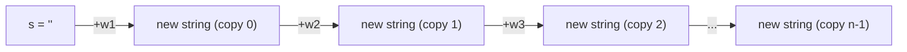

# Unnecessary Allocation — Junior Level

> **Category:** [Performance Anti-Patterns](../README.md) → **Unnecessary Allocation** — *throwaway objects, boxing, and copies churned in a hot path.*

---

## Table of Contents

1. [Introduction](#introduction)
2. [Prerequisites](#prerequisites)
3. [What "Allocation" Means](#what-allocation-means)
4. [The Classic Example: String Concatenation in a Loop](#the-classic-example-string-concatenation-in-a-loop)
5. [Why O(n²) and Not O(n)](#why-on-and-not-on)
6. [The Fix: Build the String Once](#the-fix-build-the-string-once)
7. [Allocation Isn't Free — But It's Not Always the Enemy](#allocation-isnt-free--but-its-not-always-the-enemy)
8. [A Few More Shapes to Recognize](#a-few-more-shapes-to-recognize)
9. [Common Mistakes](#common-mistakes)
10. [Test Yourself](#test-yourself)
11. [Cheat Sheet](#cheat-sheet)
12. [Summary](#summary)
13. [Further Reading](#further-reading)
14. [Related Topics](#related-topics)

---

## Introduction

> Focus: **What does it look like?** and **Why is it bad?**

**Unnecessary allocation** is creating objects, buffers, or strings that the program immediately throws away — and doing it in code that runs often enough that the *making and discarding* dominates the work you actually care about.

The textbook case is building a string by gluing pieces together in a loop. It looks innocent, it's the first thing most of us write, and on a small input it's fine. On a large input it quietly becomes **quadratic** — not because your algorithm is quadratic, but because each `+` builds a brand-new string and throws the old one away.

At the junior level your goal is to **recognize this shape on sight** and reach for a *builder* instead. You don't need to profile a garbage collector yet — that's `senior.md`. You need to stop writing the loop-concatenation version and understand *why* it's slow, so the fix feels obvious rather than superstitious.

> **The one idea:** allocation is cheap *per object* but not *free*, and "cheap × a-lot" is expensive. The cure is almost never "allocate faster" — it's "allocate fewer times."

---

## Prerequisites

- **Required:** You can write a loop that builds up a result (a string, a list, a sum) in at least one language. Examples use Go, Java, and Python.
- **Required:** You know roughly what big-O means — that O(n²) work grows much faster than O(n). The `big-o-analysis` skill is the deeper version.
- **Helpful:** You've seen a program get *slow* on a big input that ran fine on a small one. That cliff is often this anti-pattern.
- **Helpful:** A rough sense that strings in most languages are **immutable** — you can't change one, only make a new one.

---

## What "Allocation" Means

**Allocation** is asking the runtime for a fresh chunk of memory to hold a new object — a string, a slice/list, a struct, a boxed number. Two costs follow every allocation:

1. **The allocation itself** — finding and reserving the memory, zeroing it, initializing the object.
2. **The cleanup** — that memory eventually has to be reclaimed by the **garbage collector** (GC) in Go, Java, and Python. More objects created means the GC runs more often and does more work each time. That's called **GC pressure**.

So an allocation you don't need costs you twice: once to make the garbage, once to collect it. One throwaway object is nothing. A throwaway object *per loop iteration, in a loop that runs millions of times* is a real bill.

---

## The Classic Example: String Concatenation in a Loop

You want to join a list of words into one string. The natural first attempt:

```go
// Go — looks fine, is quadratic on large input.
func joinSlow(words []string) string {
	s := ""
	for _, w := range words {
		s = s + w   // builds a brand-new string every iteration
	}
	return s
}
```

```java
// Java — the exact same trap. String is immutable.
String joinSlow(List<String> words) {
    String s = "";
    for (String w : words) {
        s = s + w;          // each += allocates a new String + char array
    }
    return s;
}
```

```python
# Python — same shape (CPython sometimes optimizes this, but don't rely on it).
def join_slow(words):
    s = ""
    for w in words:
        s = s + w           # new string object each time
    return s
```

The bug isn't visible on three words. On 100,000 words it's the difference between *instant* and *seconds*.

---

## Why O(n²) and Not O(n)

Strings are **immutable**. `s = s + w` cannot append to `s` in place — it must allocate a *new* string big enough for both, copy all of `s` into it, then copy `w`. The old `s` becomes garbage.

Now watch the copying grow as the loop runs:

| Iteration | Length of `s` copied | 
|---|---|
| 1 | 1 |
| 2 | 2 |
| 3 | 3 |
| … | … |
| n | n |

Total characters copied ≈ `1 + 2 + 3 + … + n = n(n+1)/2`, which is **O(n²)**. You also created **n** throwaway strings along the way. The work isn't in joining — joining is inherently O(n) — it's in *re-copying the growing prefix every single time*.



Each arrow is a fresh allocation and a full copy of everything so far.

---

## The Fix: Build the String Once

Use a **builder** — a mutable buffer that grows in place and produces the final string exactly once. This turns O(n²) into O(n) and turns *n* allocations into a handful.

```go
// Go — strings.Builder appends into a growable buffer.
func joinFast(words []string) string {
	var b strings.Builder
	for _, w := range words {
		b.WriteString(w)   // appends in place; no per-iteration string
	}
	return b.String()      // one final string
}
```

```java
// Java — StringBuilder is the mutable buffer.
String joinFast(List<String> words) {
    StringBuilder b = new StringBuilder();
    for (String w : words) {
        b.append(w);        // in place, amortized O(1)
    }
    return b.toString();    // one final String
}
```

```python
# Python — collect, then join once. "".join is the builder.
def join_fast(words):
    return "".join(words)   # one allocation for the result
```

> **Note the language idioms.** Go and Java hand you an explicit builder. Python's idiom is "build a list, then `"".join(it)` once" — `join` computes the total size up front and allocates the result a single time. In all three, the principle is identical: **don't make a new whole-string per element.**

---

## Allocation Isn't Free — But It's Not Always the Enemy

Here's the balance you must keep, even as a junior — because the *opposite* mistake is just as real:

- The loop-concatenation bug is worth fixing **always**, because the builder version is *also clearer* and asymptotically better. It costs you nothing to do it right.
- But **don't go hunting for allocations everywhere and pre-pooling buffers "to be fast."** Most allocations in most code don't matter — the GC handles them and you'll never notice. Twisting clean code to avoid an allocation that runs ten times a request is [premature optimization](../01-premature-optimization-traps/junior.md).

The rule that governs this whole topic: **reducing allocation matters only in a measured hot path.** The string-builder fix is the rare exception that's a free win. Everything past it — buffer reuse, object pools, escape-analysis tuning — you do *only after a profiler points at it*. We measure before we optimize.

---

## A Few More Shapes to Recognize

You'll meet these in detail in `middle.md`; for now just learn to *see* them:

- **Growing a list without saying how big it'll be.** Appending to an empty list that reallocates as it grows. If you know the final size, say so up front (`make([]T, 0, n)` in Go, `new ArrayList<>(n)` in Java).
- **Boxing numbers.** `List<Integer>` in Java wraps every `int` in a heap object. `int[]` doesn't. (More in `middle.md`.)
- **A throwaway object created inside a tight loop** that could be created once *outside* it.

All of these are the same idea: a needless object, made in a place that runs a lot.

---

## Common Mistakes

1. **Assuming `s += x` in a loop is fine because "it's just a plus."** The `+` hides an allocation and a copy. On large inputs it's O(n²).
2. **Fixing it everywhere, including code that runs three times.** The cure has a cost in readability and effort; spend it where it's measured to matter, not on cold paths.
3. **Thinking the GC makes allocation free.** The GC makes it *automatic*, not free. Every object you create is work the GC must later undo.
4. **Reaching for object pools as a junior.** Pooling is an advanced, easy-to-get-wrong tool (`senior.md`). The builder and presizing fixes handle 95% of real cases.
5. **Confusing "fewer lines" with "fewer allocations."** `a + b + c + d` on one line still allocates the intermediates; one short line can hide several objects.

---

## Test Yourself

1. Why is `s = s + w` inside a loop O(n²) and not O(n)? What property of strings causes it?
2. What is "GC pressure," and how does unnecessary allocation create it?
3. Rewrite this to allocate the result once:
   ```java
   String csv = "";
   for (String field : fields) {
       csv = csv + field + ",";
   }
   ```
4. A coworker proposes adding an object pool to a function that's called once per HTTP request (a few thousand times a day). Is this the right move? Why or why not?
5. True or false: "Allocation is free because the garbage collector handles it." Explain.

<details>
<summary>Answers</summary>

1. Strings are **immutable**, so `s + w` can't append in place — it allocates a *new* string and copies all of `s` plus `w` into it. The copied prefix grows by one each iteration, so total copying is `1+2+…+n = O(n²)`. It also makes *n* throwaway strings.
2. **GC pressure** is the extra work the garbage collector does because the program creates lots of short-lived objects. More allocation → the GC runs more often and scans more, stealing CPU from your actual work.
3. Use a `StringBuilder`:
   ```java
   StringBuilder b = new StringBuilder();
   for (String field : fields) {
       b.append(field).append(',');
   }
   String csv = b.toString();
   ```
4. **No.** A few thousand calls a day is a cold path — the allocation there is invisible to the GC and to your users. Pooling adds complexity and correctness risk (`senior.md`) for zero measurable gain. This is premature optimization; measure first.
5. **False.** The GC makes reclamation *automatic*, not *free*. Every object created is memory to reserve and initialize, plus future work for the collector. Cheap per object, but "cheap × millions" is expensive.

</details>

---

## Cheat Sheet

| Shape | Spot it by | Fix it with |
|---|---|---|
| **Loop string concat** | `s = s + x` / `s += x` inside a loop | `strings.Builder` (Go), `StringBuilder` (Java), `"".join` (Python) |
| **Throwaway object in a hot loop** | `new X()` created and discarded every iteration | Hoist it out, or reuse it |
| **Un-presized growth** | Appending to an empty list of known final size | `make([]T, 0, n)` / `new ArrayList<>(n)` |
| **Boxing** | `List<Integer>`, `Integer` in hot math | `int[]` / primitive specializations (see `middle.md`) |

> **One rule to remember:** *allocate fewer times, not faster — and only bother where it's measured to be hot.*

---

## Summary

- **Unnecessary allocation** is making objects you immediately discard, in code that runs often enough that the churn dominates.
- The signature case is **string concatenation in a loop** — immutable strings make `s = s + x` re-copy a growing prefix, turning O(n) work into O(n²) and creating *n* garbage strings.
- The fix is a **builder**: `strings.Builder`, `StringBuilder`, or Python's `"".join` — build in a mutable buffer and produce the result **once**.
- **Allocation is cheap but not free**; the GC automates cleanup but charges CPU for it. Fewer allocations, not faster ones, is the cure.
- The string-builder fix is a free win; everything beyond it (pooling, presizing tuning) you do **only in a measured hot path** — don't pre-optimize cold code.
- Next: [`middle.md`](middle.md) — *the common forms (boxing, presizing, reuse-vs-recreate) and using `-benchmem` to actually **see** the allocations.*

---

## Further Reading

- **Systems Performance** — Brendan Gregg (2nd ed., 2020) — how memory allocation and reclamation show up as real CPU and latency cost.
- **Java Performance** — Scott Oaks (2nd ed., 2020) — the JVM's view of allocation, the young generation, and why short-lived objects are (mostly) cheap.
- **The Go Blog — escape analysis & memory** (go.dev/blog) — why some values stay on the stack and never allocate at all.
- **Effective Java** — Joshua Bloch (3rd ed., 2018) — Item 6, "Avoid creating unnecessary objects."

---

## Related Topics

- [Premature Optimization Traps](../01-premature-optimization-traps/junior.md) — the anchor: reduce allocation **only** where measured; don't pre-pool everything.
- [N+1 in Code](../02-n-plus-one-in-code/junior.md) — the sibling shape: repeated *work* in a loop, where this is repeated *allocation* in a loop.
- [Wrong Data Structure](../04-wrong-data-structure/junior.md) — the wrong collection often allocates as well as runs slow.
- [Big-O Analysis](../../../../../../skills) — the `big-o-analysis` skill; why O(n²) copying is the real cost of loop concatenation.
- [`middle.md`](middle.md) · [`senior.md`](senior.md) — the common forms and fixes, then reducing allocation in a real hot path.
