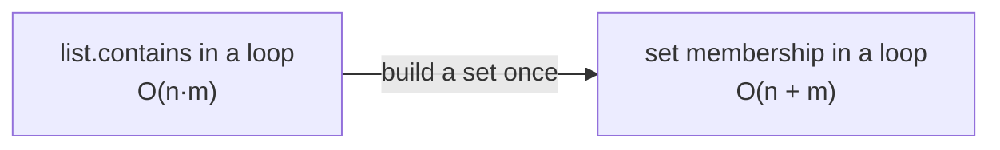

# Wrong Data Structure — Junior Level

> **Category:** [Performance Anti-Patterns](../README.md) → **Wrong Data Structure** — *a collection whose cost model fights the access pattern.*

---

## Table of Contents

1. [Introduction](#introduction)
2. [Prerequisites](#prerequisites)
3. [Glossary](#glossary)
4. [The Idea: Every Structure Is Fast at Some Things, Slow at Others](#the-idea-every-structure-is-fast-at-some-things-slow-at-others)
5. [The Classic: Membership Check in a List](#the-classic-membership-check-in-a-list)
6. [Why O(n·m) Sneaks In](#why-onm-sneaks-in)
7. [The Fix: Pick the Structure That Matches the Dominant Operation](#the-fix-pick-the-structure-that-matches-the-dominant-operation)
8. [A Few More Everyday Mismatches](#a-few-more-everyday-mismatches)
9. [Common Mistakes](#common-mistakes)
10. [Test Yourself](#test-yourself)
11. [Cheat Sheet](#cheat-sheet)
12. [Summary](#summary)
13. [Further Reading](#further-reading)
14. [Related Topics](#related-topics)

---

## Introduction

> Focus: **What does it look like?** and **Why is it bad?**

You reach for a list because a list is the first collection you learned. It holds things in order, you can append to it, you can loop over it — done. The trouble starts the moment you ask the list a question it's slow at: *"Is this id already in here?"* A list answers that by walking every element until it finds a match or runs out. Do that once, fine. Do it inside a loop over another collection, and you've quietly built an O(n·m) machine where an O(n) one would do.

That is the **Wrong Data Structure** anti-pattern: picking a collection whose operations don't match how you actually use it. The code is correct — it returns the right answer — so it passes review and tests. Then the input grows from 100 items to 100,000 and a request that took 2 ms takes 8 seconds, and nobody changed a line.

This is *not* about implementing data structures (the [DSA roadmap](../../../../../Data/datastructures-and-algorithms/README.md) does that). It's about **choosing** the right one in ordinary, everyday code — the `if x in things` you write without thinking. At the junior level your goal is to recognize the shape on sight and know the one-line fix: when you're checking membership, use a set; when you're looking things up by key, use a map.

> **The mindset shift:** a data structure is a *deal*. You trade something to make one operation cheap. A list makes ordered iteration and append cheap; it makes "find by value" expensive. Know what each structure is fast and slow at, and the right pick becomes obvious.

---

## Prerequisites

- **Required:** You can write loops, lists/arrays, and functions in at least one language (examples here use Go, Java, and Python).
- **Required:** You've seen the words *list/array*, *set*, and *map/dictionary* and used at least one of each.
- **Helpful:** A rough sense of big-O — "O(n) means the work grows with the size of the input." The `big-o-analysis` skill covers it; you don't need more than the intuition here.
- **Helpful:** You've once watched a program get slow as its input grew. That slowdown is what this anti-pattern explains.

---

## Glossary

| Term | Definition |
|------|-----------|
| **Access pattern** | *How* your code uses a collection: do you mostly append? look up by key? check membership? sort? The pattern should drive the choice of structure. |
| **Cost model** | The big-O cost of each operation on a structure — what's cheap, what's expensive. |
| **Membership test** | Asking "does this collection contain `x`?" Written `x in list` (Python), `list.contains(x)` (Java), or a loop (Go). |
| **List / array / slice** | An ordered, index-able sequence. Cheap append and iteration; **O(n)** to find a value or check membership. |
| **Set** | An unordered collection of unique values with **O(1)** average membership test. The right tool for "have I seen this?" |
| **Map / dictionary / hash** | Key → value lookup in **O(1)** average. The right tool for "find the record with this id." |
| **O(1) / O(n) / O(n²)** | Constant / linear / quadratic cost. O(1) doesn't grow with input; O(n²) blows up fast. |

---

## The Idea: Every Structure Is Fast at Some Things, Slow at Others

There is no "best" collection — only the best one *for what you're doing*. Here's the short version of the cost table you'll spend the rest of this topic internalizing:

| Structure | Append / add | Find by value (membership) | Look up by key | Keeps order? |
|---|---|---|---|---|
| **List / array** | O(1)* | **O(n)** | n/a | yes (insertion) |
| **Set** | O(1) avg | **O(1)** avg | n/a | no |
| **Map / dict** | O(1) avg | O(n) over values | **O(1)** avg by key | no (usually) |

<sub>*Amortized — see `professional.md` for why "amortized" matters.</sub>

Read that table as a set of deals. The list is great until you ask it "is `x` in here?" — then it's the slowest option. The set gives up order and key-lookups to make membership instant. The map gives up order to make key-lookups instant. **Picking the wrong one means accepting the slow column when the fast column was right there.**

---

## The Classic: Membership Check in a List

This is the single most common form of the anti-pattern. You have a collection of "blocked" or "seen" or "already-processed" ids, and you check each incoming item against it.

```python
# Python — O(n·m): for every incoming order, scan the whole blocklist.
def filter_allowed(orders, blocked_ids):     # blocked_ids is a list
    allowed = []
    for order in orders:                      # m orders
        if order.user_id not in blocked_ids:  # scans up to n blocked ids — O(n)
            allowed.append(order)
    return allowed
```

`order.user_id not in blocked_ids` looks like one cheap operation. It isn't. For a **list**, `in` walks the list element by element. If there are `m` orders and `n` blocked ids, the inner scan runs `n` times for each of the `m` orders: **O(n·m)**. With 50,000 orders and 50,000 blocked ids, that's 2.5 *billion* comparisons.

The same shape in Go and Java:

```go
// Go — contains() is a linear scan; calling it in a loop is O(n·m).
func contains(ids []int, id int) bool {
    for _, x := range ids {   // O(n)
        if x == id {
            return true
        }
    }
    return false
}

func filterAllowed(orders []Order, blocked []int) []Order {
    var allowed []Order
    for _, o := range orders {        // m times
        if !contains(blocked, o.UserID) {  // × O(n)
            allowed = append(allowed, o)
        }
    }
    return allowed
}
```

```java
// Java — List.contains is O(n); inside a loop it's O(n·m).
List<Order> filterAllowed(List<Order> orders, List<Integer> blocked) {
    List<Order> allowed = new ArrayList<>();
    for (Order o : orders) {                  // m
        if (!blocked.contains(o.userId())) {  // O(n) linear scan
            allowed.add(o);
        }
    }
    return allowed;
}
```

---

## Why O(n·m) Sneaks In

It hides because **each individual line looks innocent**. `if id in blocked` reads like a single yes/no question, the way it would in English. Nothing on that line announces "this loops over the entire blocklist." The cost is invisible until you mentally unfold what `in` / `.contains` / `contains()` actually does on a list.

It also passes every early check:

- It's **correct** — the right orders are filtered.
- It's **fast in tests** — your fixtures have 5 blocked ids, not 50,000.
- It **reads naturally** — which is exactly why reviewers wave it through.

The bug is latent. It's encoded in the *shape*, and it only detonates when the data gets big in production.

---

## The Fix: Pick the Structure That Matches the Dominant Operation

The dominant operation here is **membership** — "is this id in the blocked group?" The structure built for membership is the **set**. Convert the list to a set once, up front, then each check is O(1) average:

```python
# Python — build a set once: O(n). Then each check is O(1). Total O(n + m).
def filter_allowed(orders, blocked_ids):
    blocked = set(blocked_ids)                # O(n), done once
    return [o for o in orders if o.user_id not in blocked]  # each `in` is O(1)
```

```go
// Go — a map[int]struct{} is the idiomatic set. struct{} costs zero bytes.
func filterAllowed(orders []Order, blocked []int) []Order {
    set := make(map[int]struct{}, len(blocked))
    for _, id := range blocked {
        set[id] = struct{}{}          // build once: O(n)
    }
    var allowed []Order
    for _, o := range orders {        // m
        if _, bad := set[o.UserID]; !bad {  // O(1) average
            allowed = append(allowed, o)
        }
    }
    return allowed
}
```

```java
// Java — HashSet membership is O(1) average.
List<Order> filterAllowed(List<Order> orders, List<Integer> blocked) {
    Set<Integer> set = new HashSet<>(blocked);   // build once: O(n)
    List<Order> allowed = new ArrayList<>();
    for (Order o : orders) {
        if (!set.contains(o.userId())) {          // O(1) average
            allowed.add(o);
        }
    }
    return allowed;
}
```

The change is tiny — one line to build a set — but the cost model flips from **O(n·m) to O(n + m)**. At 50,000 × 50,000, that's 2.5 billion comparisons down to about 100,000: roughly a 25,000× reduction in the work.



> **The one move to remember:** if you're asking "is `x` in this collection?" repeatedly, the collection should be a **set** (or a map, if you also need a value), never a list.

---

## A Few More Everyday Mismatches

You'll learn these in depth in `middle.md`. For now, just recognize the shapes:

| You're doing this on a list… | …but the right structure is | Because |
|---|---|---|
| Repeatedly checking `x in list` | **Set** | O(n) membership → O(1) |
| Repeatedly finding "the item with id == k" by scanning | **Map** keyed by id | O(n) lookup → O(1) |
| Re-sorting the list and taking the smallest every time | **Heap** (priority queue) | repeated min becomes O(log n) |
| `list.pop(0)` / removing the front in a loop (a queue) | **Deque** / ring buffer | O(n) front-removal → O(1) |

Each one is the same story: a natural-looking operation that's secretly O(n) on a list, made O(1) or O(log n) by the structure built for it.

---

## Common Mistakes

1. **Reading `x in list` as one cheap operation.** On a list it's a full scan — O(n). The syntax hides the cost.
2. **Building the set *inside* the loop.** Converting `set(blocked_ids)` on every iteration re-does the O(n) build `m` times — you've kept the O(n·m). Build it **once**, before the loop.
3. **Using a list because "it's simpler."** A set is just as simple to write and reads the same. There's no simplicity tax for picking the right structure.
4. **Assuming small test data means it's fine.** Tests with 5 elements never reveal an O(n·m) shape. The slowness is proportional to *production* size.
5. **Reaching for a database / cache / threads first.** When code is slow, the wrong-structure fix is often a one-line change that beats any amount of infrastructure. Check the cost model before you scale out.
6. **Thinking sets are always better.** They're better *for membership*. If you need order, or you have ten items checked once, a list is right. (More in `senior.md`.)

---

## Test Yourself

1. What is the big-O of `x in my_list` when `my_list` is a Python list? What about when it's a Python set?
2. This function is slow on large inputs. What's the big-O, and what's the one-line fix?
   ```python
   def count_new(events, known_ids):       # known_ids is a list
       n = 0
       for e in events:
           if e.id not in known_ids:
               n += 1
       return n
   ```
3. A coworker "optimizes" the function above by building the set inside the loop: `if e.id not in set(known_ids)`. Did it get faster? Why or why not?
4. You need to repeatedly look up a user record by user id from a collection of 100,000 users. Which structure, and why not a list?
5. True or false: a set is always the better choice than a list. Explain.

<details>
<summary>Answers</summary>

1. **List: O(n)** — `in` scans element by element. **Set: O(1) average** — a set hashes the value and checks one bucket.
2. **O(n·m)** — for each of the `m` events, `e.id not in known_ids` scans up to `n` known ids. **Fix:** build a set once before the loop:
   ```python
   def count_new(events, known_ids):
       known = set(known_ids)                 # O(n), once
       return sum(1 for e in events if e.id not in known)  # each check O(1)
   ```
   Now O(n + m).
3. **No faster — actually slower.** `set(known_ids)` rebuilds the whole set on *every* iteration, paying O(n) `m` times: that's O(n·m) just to build, *worse* than the original scan. The set only helps if built **once**, outside the loop.
4. A **map/dictionary** keyed by user id — lookup is O(1) average. A list forces an O(n) scan per lookup; 100,000 lookups against 100,000 users is O(n²) ≈ 10 billion comparisons.
5. **False.** A set wins for *membership* and *dedup*. But a set loses order, can't be indexed, and for a handful of elements checked once, a list scan is just as fast and simpler. Match the structure to the operation, don't cargo-cult.

</details>

---

## Cheat Sheet

| You see… | The cost on a list | Switch to… | New cost |
|---|---|---|---|
| `x in list` / `list.contains(x)` in a loop | O(n·m) | **set** | O(n + m) |
| Find "item where id == k" by scanning | O(n) per lookup | **map** keyed by id | O(1) per lookup |
| Re-sort + take smallest each query | O(n log n) per query | **heap** | O(log n) per op |
| Remove from the front repeatedly | O(n) per pop | **deque** | O(1) per pop |

> **One rule to remember:** *name the operation you do most, then pick the structure that makes that operation cheap.* Membership → set. Lookup by key → map. Repeated min/max → heap. Front-removal → deque.

---

## Summary

- **Wrong Data Structure** = picking a collection whose cost model fights how you use it, turning O(1) work into O(n) and O(n) loops into O(n·m).
- The classic case is a **membership test in a list**: `x in list` is O(n), and doing it in a loop is O(n·m). Converting the list to a **set** once makes each check O(1), dropping the whole thing to O(n + m).
- It hides because each line looks cheap, the code is correct, and small test data never exposes it. The cost lives in the *shape*, and it detonates at production scale.
- The fix is almost always tiny: **match the structure to the dominant operation** — set for membership, map for key lookup, heap for repeated min/max, deque for a queue.
- Next: [`middle.md`](middle.md) — *the full catalog of common mismatches, the cost-table cheat sheet, and worked before/after benchmarks for each.*

---

## Further Reading

- **Programming Pearls** — Jon Bentley (2nd ed., 1999) — Column 1 and the data-structure columns; the discipline of picking the structure that fits the problem.
- **Algorithms** — Robert Sedgewick & Kevin Wayne (4th ed., 2011) — clear cost tables for arrays, hash tables, and priority queues.
- **Python docs** — [Time complexity of built-in types](https://wiki.python.org/moin/TimeComplexity); **Java** — `Collection` Javadoc; **Go** — the [maps](https://go.dev/blog/maps) blog. The official cost guarantees for each language's collections.

---

## Related Topics

- [Premature Optimization Traps](../01-premature-optimization-traps/junior.md) — the opposite failure: twisting code for speed you never measured.
- [N+1 in Code](../02-n-plus-one-in-code/junior.md) — the sibling shape: per-item work in a loop that should be done once (a set/map often fixes both).
- [Unnecessary Allocation](../03-unnecessary-allocation/junior.md) — string concatenation and throwaway-object patterns that overlap with structure choice.
- [Bad Structure (Development)](../../01-development/01-bad-structure/junior.md) — structural anti-patterns at the design level.
- The `big-o-analysis` and `hash-table-design` skills — the cost-model and set/map fundamentals behind every fix here.
