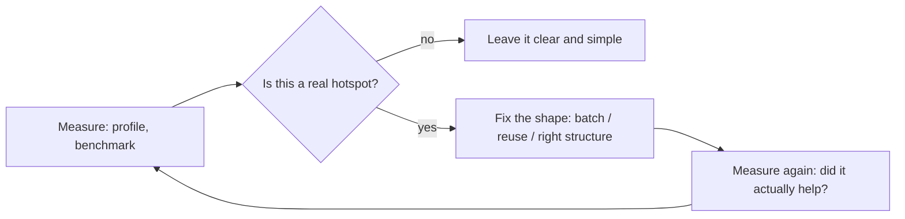

# Performance Anti-Patterns

> *"Premature optimization is the root of all evil (or at least most of it) in programming."* — Donald Knuth, *Structured Programming with go to Statements* (1974)

This chapter covers **code-level** performance anti-patterns — the wrong shapes that waste CPU, memory, or I/O inside a single function or loop. You spot them by reading a function, not by drawing a system diagram.

> Looking for **system-level** performance (caching layers, CDNs, sharding, horizontal scaling)? Those are architecture decisions — see the System Design material and the `caching-strategies`, `database-performance`, and `horizontal-vs-vertical-scaling` skills. This chapter is about the code in front of you.

The chapter is bracketed by two opposing failures. Knuth's caution warns against optimizing what you never measured; the counter-truth is **death by a thousand cuts** — a codebase where every function allocates needlessly, queries in a loop, and reaches for the wrong collection is slow everywhere and profiles flat. The skill is knowing which is which, and that always starts with measurement.

---

## The Four Anti-Patterns

| Anti-pattern | Symptom | Primary cure |
|---|---|---|
| **[Premature Optimization Traps](01-premature-optimization-traps/junior.md)** | Code twisted for speed that was never measured and rarely matters | Measure first; optimize the proven hotspot, leave the rest clear |
| **[N+1 in Code](02-n-plus-one-in-code/junior.md)** | Per-item work in a loop (a call, query, or computation) that should be done once | Batch, hoist out of the loop, preload |
| **[Unnecessary Allocation](03-unnecessary-allocation/junior.md)** | Throwaway objects, boxing, and copies churned in a hot path | Reuse buffers, avoid boxing, stream, pick value types |
| **[Wrong Data Structure](04-wrong-data-structure/junior.md)** | A collection whose cost model fights the access pattern (linear scans, repeated sorts) | Match the structure to the operations; know the big-O |

---

## The One Rule That Governs All Four

Every anti-pattern here is diagnosed and confirmed with a **profiler or benchmark**, never intuition. Premature Optimization is the failure of optimizing without step 1; the other three are the failures a profiler points you *to*. Naming them lets you recognize the shape fast — but the numbers decide whether it matters.

See [big-o-analysis](../../../../../Programming/code-craft/README.md) and the `profiling-techniques`, `memory-leak-detection`, and `big-o-analysis` skills for the measurement toolkit.

---

## File Suite

Each anti-pattern ships the standard **8-file suite** (`junior` → `professional`, plus `interview`, `tasks`, `find-bug`, `optimize`). Code is in **Go**, **Java**, and **Python**, matching the rest of [Code Craft](../../README.md). The `optimize.md` files are where this chapter shines — take the slow shape, profile it, and fix it with the numbers to prove the win.

---

## Related Roadmaps

- [Anti-Patterns (parent)](../README.md) — the sibling chapters of coding anti-patterns.
- [Refactoring](../../refactoring/README.md) — many performance fixes are refactorings with a benchmark attached.
- The `profiling-techniques`, `big-o-analysis`, `caching-strategies`, and `database-performance` skills cover the measurement and system-level companions to these code-level shapes.
