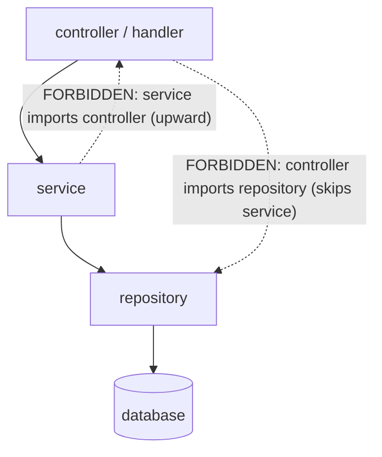
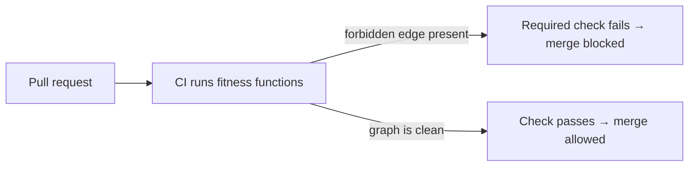

# Architecture Fitness Functions — Middle Level

> **Category:** [Anti-Patterns at Scale](../README.md) → **Architecture Fitness Functions** — *executable rules that fail the build when the architecture drifts toward an anti-pattern.*
> **Covers (collectively):** Layering & dependency rules · Cycle-detection gates · Allowed-dependency contracts · Metric thresholds · Evolutionary architecture & CI gating

---

## Table of Contents

1. [Introduction](#introduction)
2. [Prerequisites](#prerequisites)
3. [From One Edge to a Layered Contract](#from-one-edge-to-a-layered-contract)
4. [Rule 1: Layering (No Upward or Skip Imports)](#rule-1-layering-no-upward-or-skip-imports)
5. [Rule 2: No Cycles](#rule-2-no-cycles)
6. [Rule 3: Naming & Annotation Conventions](#rule-3-naming--annotation-conventions)
7. [Rule 4: Package Containment](#rule-4-package-containment)
8. [Making It a *Failing* Test](#making-it-a-failing-test)
9. [Wiring It Into CI](#wiring-it-into-ci)
10. [Reading a Violation Report](#reading-a-violation-report)
11. [Common Mistakes](#common-mistakes)
12. [Test Yourself](#test-yourself)
13. [Cheat Sheet](#cheat-sheet)
14. [Summary](#summary)
15. [Further Reading](#further-reading)
16. [Related Topics](#related-topics)

---

## Introduction

> Focus: **Writing real rules and wiring them into CI.**

`junior.md` gave you the one-line rule — *"package A must not import package B"* — and showed it running in four ecosystems. That single forbidden edge is the atom. This file builds the molecule: the four rule shapes that, together, encode most of a layered architecture, and the CI plumbing that makes any of them *actually block a merge*.

The jump from junior to middle is the jump from *"I can write one assertion"* to *"I can express my team's architecture as a set of assertions and prove they fail when violated."* Three things are new here:

1. **Real rules, not toy edges.** A layering contract (`controllers → services → repositories`, never upward) is a *family* of forbidden edges expressed once. So is "no cycles anywhere," "every repository class ends in `Repository`," and "nothing outside `internal` reaches into it."
2. **A failing test you trust.** A rule you've only ever seen pass is a rule you don't know works. You must *watch it go red* against a deliberate violation before you believe it guards anything — a discipline that becomes the whole subject of `professional.md`.
3. **A CI gate, not a local script.** A fitness function on your laptop enforces nothing. It earns its keep only when it runs on every push and turns the merge button red.

> **The mindset shift:** stop thinking "rule" and start thinking "contract." A contract names the *allowed* shape of the dependency graph in one place. Every commit is checked against it automatically — the same way a type checker checks every call against a signature.

Designing a whole suite for an *existing*, already-messy codebase (where you can't fix every violation today) is [`senior.md`](senior.md). Making the checks fast and proving they catch real regressions is [`professional.md`](professional.md). Here you learn the rules themselves and how to run them.

---

## Prerequisites

- **Required:** You can write and run [`junior.md`](junior.md)'s single forbidden-dependency rule in at least one of ArchUnit, import-linter, or madge/dependency-cruiser.
- **Required:** You understand a layered architecture — controllers/handlers on top, services in the middle, repositories/data access at the bottom — and which way dependencies are *supposed* to point.
- **Required:** You've edited a CI config (GitHub Actions, GitLab CI, or similar) and seen a job pass and fail.
- **Helpful:** You've felt a real layering violation bite — a controller that reached straight into the database and made the next change painful ([Coupling & State](../../02-design/02-coupling-and-state/professional.md) is the in-the-file view of what these rules enforce from outside).
- **Helpful:** Familiarity with the dependency-injection skill — clean layers and injectable dependencies are the structure these rules defend.

---

## From One Edge to a Layered Contract

A layered architecture is, structurally, a stack of packages where dependencies may only point *downward*:



Two kinds of edge break the layering:

- **Upward import** — a lower layer reaches up (a `service` imports a `controller`). This is almost always a hidden cycle in the making and inverts the whole point of layering.
- **Skip import** — a layer reaches *past* its neighbor (a `controller` imports a `repository` directly, bypassing the `service`). The totals still come out right, so no behavioral test fails — but the layer that was supposed to mediate is now bypassable, and the next person who needs to add caching or validation in the service layer finds half the callers route around it.

You could write each forbidden edge as its own `junior.md`-style rule. Don't. Every tool has a *layering* primitive that takes the ordered list of layers once and forbids every illegal edge between them. That's the contract: declare the stack, and the tool enforces all the downward-only rules implied by it.

---

## Rule 1: Layering (No Upward or Skip Imports)

### Java — ArchUnit's layered-architecture DSL

ArchUnit ships a `layeredArchitecture()` builder. You name each layer by its package, then declare who may access it. The rule then forbids *every* edge that violates the stack — upward and skip — in one declaration.

```java
// src/test/java/com/shop/LayeredArchitectureTest.java
import com.tngtech.archunit.junit.AnalyzeClasses;
import com.tngtech.archunit.junit.ArchTest;
import com.tngtech.archunit.lang.ArchRule;
import static com.tngtech.archunit.library.Architectures.layeredArchitecture;

@AnalyzeClasses(packages = "com.shop")
class LayeredArchitectureTest {

    @ArchTest
    static final ArchRule layers = layeredArchitecture().consideringAllDependencies()
        .layer("Controller").definedBy("..controller..")
        .layer("Service").definedBy("..service..")
        .layer("Repository").definedBy("..repository..")

        // Who is ALLOWED to depend on each layer:
        .whereLayer("Controller").mayNotBeAccessedByAnyLayer()        // top: nobody imports controllers
        .whereLayer("Service").mayOnlyBeAccessedByLayers("Controller")// only controllers call services
        .whereLayer("Repository").mayOnlyBeAccessedByLayers("Service");// only services call repos
        // → controller→repository (skip) and service→controller (upward) both fail.
}
```

The crucial line is `whereLayer(...).mayOnlyBeAccessedByLayers(...)`: it phrases the rule as *allowed* access, which automatically forbids everything else. A new layer-violating import doesn't need a new rule — it's already illegal.

### Python — import-linter's `layers` contract

import-linter has a first-class `layers` contract. You list the layers high-to-low; it forbids any lower layer importing a higher one *and* any layer skipping. (For "no skipping," declare the intermediate layers as siblings or use `independence`; the basic `layers` contract forbids upward imports, which is the common case.)

```ini
# .importlinter
[importlinter]
root_package = shop

[importlinter:contract:layers]
name = Controllers -> services -> repositories, downward only
type = layers
layers =
    shop.controllers
    shop.services
    shop.repositories
# Higher in the list = higher layer. shop.repositories importing shop.services
# (upward) fails; shop.services importing shop.controllers fails.
```

```bash
lint-imports        # exits non-zero if any upward import exists
```

### JS/TS — dependency-cruiser

`dependency-cruiser` expresses layering as a `forbidden` rule with a `from`/`to` path pattern. madge handles cycles; dependency-cruiser handles directed layer rules.

```js
// .dependency-cruiser.js
module.exports = {
  forbidden: [
    {
      name: 'no-controller-to-repo',
      comment: 'Controllers must go through services, not straight to repositories.',
      severity: 'error',
      from: { path: '^src/controllers' },
      to:   { path: '^src/repositories' },   // skip import → error
    },
    {
      name: 'no-service-to-controller',
      comment: 'Services must not import controllers (upward dependency).',
      severity: 'error',
      from: { path: '^src/services' },
      to:   { path: '^src/controllers' },     // upward import → error
    },
  ],
};
```

```bash
npx depcruise --config .dependency-cruiser.js src   # error severity → non-zero exit
```

### Go — `go list` over each layer

Go has no layering DSL, but the check is a short loop: for each layer, list its transitive imports and fail if a forbidden layer appears.

```bash
# Fail if controllers import repository directly, or services import controllers.
set -e
if go list -deps ./controllers/... | grep -q 'myapp/repository'; then
  echo "FORBIDDEN: controller imports repository (skips service)"; exit 1
fi
if go list -deps ./service/... | grep -q 'myapp/controllers'; then
  echo "FORBIDDEN: service imports controller (upward)"; exit 1
fi
echo "ok: layering holds"
```

---

## Rule 2: No Cycles

Cycles are the cheapest high-value rule because they need no layer map — a cycle is *always* suspect. Add this before any layering rule.

```java
// ArchUnit: no package may sit in a dependency cycle.
@ArchTest
static final ArchRule noCycles =
    slices().matching("com.shop.(*)..").should().beFreeOfCycles();
```

```ini
# import-linter: forbid any cycle among the listed modules with an independence contract,
# or rely on the layers contract above (a cycle implies an upward import).
[importlinter:contract:no-cycles]
name = Feature modules must not form cycles
type = independence
modules =
    shop.billing
    shop.audit
    shop.notifications
```

```bash
# JS/TS: the zero-config classic.
npx madge --circular --extensions ts,tsx src/

# Go: import cycles are a compile error already; `go build ./...` is your no-cycle gate.
go build ./...
```

> A cycle is two forbidden edges at once (A→B and B→A). Detecting it doesn't require you to know *which* direction is wrong — only that the loop exists. That's why it's the first rule most teams add.

---

## Rule 3: Naming & Annotation Conventions

Layering rules assume you can *tell* which layer a class is in. Naming and annotation rules keep that assumption true: they assert that classes live where their name/role says they do. These catch the drift where someone puts a `Repository` in the `service` package or annotates a non-controller with `@RestController`.

```java
// ArchUnit: classes named *Repository must live in a repository package,
// and only they may be annotated @Repository.
@ArchTest
static final ArchRule repoNaming =
    classes().that().haveSimpleNameEndingWith("Repository")
        .should().resideInAPackage("..repository..");

@ArchTest
static final ArchRule controllerAnnotation =
    classes().that().areAnnotatedWith(RestController.class)
        .should().resideInAPackage("..controller..")
        .andShould().haveSimpleNameEndingWith("Controller");
```

```ini
# import-linter has no naming rule; in Python this convention is usually enforced
# by a custom pytest check over the AST, or by keeping each role in its own module.
```

Naming rules look cosmetic but they're load-bearing: a layering contract that matches packages by name (`..repository..`) only works if classes are *named and placed* honestly. Rule 3 protects the precondition of Rule 1.

---

## Rule 4: Package Containment

Containment rules express *encapsulation*: "the internals of module X are private; only X's public API may be imported from outside." Go's `internal/` directory enforces this at compile time; other ecosystems express it as a rule.

```java
// ArchUnit: only com.shop.payment may use com.shop.payment.internal.
@ArchTest
static final ArchRule paymentInternalsArePrivate =
    classes().that().resideInAPackage("..payment.internal..")
        .should().onlyBeAccessed().byAnyPackage("..payment..");
```

```ini
# import-linter: forbid the wider codebase from reaching into a module's internals.
[importlinter:contract:payment-internals-private]
name = Only payment may import payment.internal
type = forbidden
source_modules =
    shop          # everything...
forbidden_modules =
    shop.payment.internal
# ...then add shop.payment to an `ignore_imports` allowance, or scope source_modules
# to the modules outside payment. (Containment is "forbidden, with one exception.")
```

```bash
# Go: free. Anything under internal/ is importable only by code rooted at internal/'s parent.
# A controller importing myapp/payment/internal/... simply won't compile.
go build ./...
```

> Containment is the structural form of "private." A skip import (Rule 1) bypasses a layer; a containment violation bypasses a module's *encapsulation*. Both let callers depend on something that was supposed to be unreachable.

---

## Making It a *Failing* Test

Here is the discipline that separates a real fitness function from a decorative one: **before you trust a rule, watch it fail.** A rule you've only seen green might be matching nothing — a typo'd package pattern, a layer name that resolves to zero classes, a `severity: warn` that never blocks. The only proof it works is a red build against a deliberate violation.

The procedure is three steps:

1. **Write the rule.** Add the layering/cycle/naming/containment rule.
2. **Inject the violation.** Add the exact forbidden import on a throwaway branch — a controller that imports a repository, two packages that import each other, a class misnamed for its package.
3. **Run and confirm red.** The check must exit non-zero and name the edge. If it stays green, the rule is broken — fix the *rule* (its scope/pattern), not the violation.

```java
// Step 2, made temporary and explicit: prove the layering rule bites.
// On a scratch branch, add to a controller class:
import com.shop.repository.OrderRepository;   // SKIP IMPORT — the rule must catch this

class OrderController {
    private final OrderRepository repo;        // controller → repository, illegal
}
```

```
# Step 3: run the test. It MUST go red, naming the edge:
$ ./gradlew test --tests '*LayeredArchitectureTest'
> Layer 'Repository' may only be accessed by ['Service'], but was accessed by:
    com.shop.controller.OrderController  (OrderController.java:14)
BUILD FAILED
```

Then **delete the deliberate violation** and confirm the build goes green again. Now you've seen both states — red on violation, green when clean — and you *know* the rule is wired correctly. A rule you never saw fail is a rule you can't trust; this is the cheap insurance against the "passes but constrains nothing" trap that `professional.md` dissects in full.

> **Make this a habit, not a one-off.** Every new rule gets this red-then-green check. It takes two minutes and is the difference between a gate and a green light that's painted to look like a gate.

---

## Wiring It Into CI

A fitness function only enforces if it runs on the *shared* build and blocks the merge. Three patterns, by ecosystem:

```yaml
# GitHub Actions — Java (ArchUnit runs as part of the normal test phase)
jobs:
  architecture:
    runs-on: ubuntu-latest
    steps:
      - uses: actions/checkout@v4
      - uses: actions/setup-java@v4
        with: { java-version: '21', distribution: 'temurin' }
      - run: ./gradlew test            # ArchUnit @ArchTest classes run here; a violation fails the job
```

```yaml
# GitHub Actions — Python (import-linter as its own fast step)
  arch-lint:
    runs-on: ubuntu-latest
    steps:
      - uses: actions/checkout@v4
      - uses: actions/setup-python@v5
        with: { python-version: '3.12' }
      - run: pip install import-linter && lint-imports   # non-zero exit fails the job
```

```yaml
# GitHub Actions — JS/TS (cycles + directed rules)
  deps:
    runs-on: ubuntu-latest
    steps:
      - uses: actions/checkout@v4
      - uses: actions/setup-node@v4
      - run: npm ci
      - run: npx madge --circular --extensions ts,tsx src/      # cycles
      - run: npx depcruise --config .dependency-cruiser.js src  # layering
```

Two non-negotiables for the gate to actually bite:

- **It must be a *required* check.** A job that runs but isn't marked required in branch protection can be merged around. The red X has to block the merge button, or it's advisory.
- **It must fail on violation, not warn.** `severity: warn` in dependency-cruiser, a non-required CI job, or a script that doesn't `exit 1` all produce a check that's permanently green-ish and enforces nothing — the exact failure `junior.md` warned about ("a warning everyone scrolls past").



---

## Reading a Violation Report

When the gate fires, the report tells you the **rule**, the **offending edge**, and **where to look** — same three facts across every tool. Your job is to remove the edge, not weaken the rule.

```
# ArchUnit — layering violation
Layer 'Repository' may only be accessed by ['Service'], but was accessed by:
  Method <com.shop.controller.OrderController.list()>
    calls <com.shop.repository.OrderRepository.findAll()> (OrderController.java:42)
```

```
# import-linter — the import chain that broke the layers contract
Broken contract: Controllers -> services -> repositories, downward only
  shop.repositories.order is not allowed to import shop.services.pricing:
    shop.repositories.order -> shop.services.pricing  (line 8)
```

```
# madge — the cycle it found
✖ Found 1 circular dependency!
  1) src/billing/index.ts > src/audit/log.ts > src/billing/index.ts
```

Read each as: *which contract broke* → *the exact edge / chain / cycle* → *the file and line*. The fix is mechanical and the same in every case — make that edge disappear:

- **Skip import** (controller → repository): route the call through the service layer that's allowed to talk to the repository.
- **Upward import** (repository → service): the lower layer shouldn't know the higher one exists; invert it (pass what it needs as a parameter or behind an interface) so the arrow points back down.
- **Cycle** (billing ↔ audit): extract the shared piece into a third module both depend on, or invert one edge with an interface — exactly the cure from [Coupling & State](../../02-design/02-coupling-and-state/professional.md).

> **The reflex to resist:** when a layering rule fires, the wrong move is to add the offending package to an allow-list. That deletes the rule, not the violation — the bad edge survives, now unguarded. Editing the rule is legitimate only when the architecture genuinely changed, which is a deliberate decision (`senior.md`), not a 6 p.m. reflex to get green.

---

## Common Mistakes

1. **Writing layering as N separate forbidden edges.** Use the tool's `layeredArchitecture()` / `layers` primitive: declare the stack once and every illegal edge is forbidden automatically, including ones you didn't think to enumerate.
2. **Never watching the rule fail.** A rule you've only seen green might match nothing (typo'd package pattern, empty layer, `severity: warn`). Inject a deliberate violation and confirm red before you trust it.
3. **Running the check locally but not in CI.** A fitness function on your laptop is a private opinion. It must run on the shared build, as a *required* check, to enforce anything.
4. **Leaving the check at `warn` severity (or non-required).** A check that runs but never blocks the merge is a warning everyone scrolls past — zero enforcement with the appearance of enforcement.
5. **Skipping the naming/containment rules.** Layering rules match by package/name; if classes are misnamed or misplaced, the layer rule silently matches the wrong set. Rules 3 and 4 protect the precondition of Rule 1.
6. **Allow-listing a violation to go green.** Adding the bad import to an exception list deletes the rule. Fix the code (reroute, invert, extract) so the forbidden edge disappears — change the rule only when the architecture truly changed.
7. **One giant rule with no message.** A bare `should().notDependOn(...)` produces a cryptic red build. Give every rule a clear `because`/`comment` so the next person fixes the code instead of cursing the check.

---

## Test Yourself

1. Name the two kinds of import that break a layered architecture, and give a one-line example of each for `controller → service → repository`.
2. Why is the `layeredArchitecture()` / `layers` contract better than writing each forbidden edge as its own rule?
3. You add a no-cycles rule and the build stays green. Your teammate says "great, no cycles." Why might that conclusion be wrong, and what's the one step that would settle it?
4. A layering rule matches packages by name (`..repository..`). What rule category must you also have for that matching to be trustworthy, and what drift does it catch?
5. Your import-linter step runs in CI on every PR, exits non-zero on a violation, but people keep merging PRs that violate it. What's almost certainly misconfigured?
6. A layering check fires: `repository.OrderRepo imports service.Pricing`. Is this an upward or a skip import, and what's the structural fix?

<details>
<summary>Answers</summary>

1. **Upward import** — a lower layer imports a higher one (`service` imports `controller`: `import shop.controllers.OrderController` inside a service). **Skip import** — a layer reaches past its neighbor (`controller` imports `repository` directly, bypassing the service: `import shop.repositories.OrderRepo` inside a controller).
2. The layering primitive takes the ordered stack **once** and forbids *every* illegal edge it implies — upward and skip, including combinations you'd never enumerate by hand. New violating edges are already illegal without writing a new rule; N hand-written edges miss the ones you forgot.
3. Green can mean "no cycles" **or** "the rule matches nothing" (typo'd pattern, wrong package root, `warn` severity). Settle it by **injecting a deliberate cycle** (make two packages import each other on a scratch branch) and confirming the check goes red — then remove it and confirm green.
4. **Naming/annotation rules** (Rule 3). They keep the assumption "a `*Repository` class lives in `..repository..`" true. Without them, a misplaced or misnamed class drops out of (or wrongly into) the layer the layering rule matches, so the layer rule silently checks the wrong set.
5. The check is **not a required status check** in branch protection — it runs and reports, but doesn't block the merge button. Mark it required (and confirm it actually `exit 1`s on violation rather than warning).
6. **Upward** — `repository` (lower) imports `service` (higher). Fix: the repository shouldn't know the service exists. Invert the dependency — pass what it needs in as a parameter or behind an interface the service implements — so the arrow points back down, or move the shared logic to a lower shared module.

</details>

---

## Cheat Sheet

| Rule | What it asserts | Tool primitive |
|---|---|---|
| **Layering** | Downward-only imports; no upward, no skip | ArchUnit `layeredArchitecture()`; import-linter `layers`; depcruise `forbidden` |
| **No cycles** | No loops in the dependency graph | ArchUnit `slices()...beFreeOfCycles()`; `madge --circular`; Go compiler |
| **Naming / annotation** | Classes live where their name/role says | ArchUnit `haveSimpleNameEndingWith`/`areAnnotatedWith` |
| **Containment** | Module internals are private to the module | ArchUnit `onlyBeAccessed().byAnyPackage`; Go `internal/`; import-linter `forbidden` |
| **CI gate** | The check blocks the merge | required status check + non-zero exit on violation |

> **One rule to remember:** *a fitness function you've never seen fail, or that isn't a required CI check, enforces nothing — watch it go red on a deliberate violation, then make it required.*

---

## Summary

- A **layered architecture** is a stack where dependencies point only **downward**. Two edges break it: **upward imports** (a lower layer imports a higher one) and **skip imports** (a layer bypasses its neighbor). No behavioral test catches either — only a fitness function does.
- Express layering with the tool's **layering primitive** (ArchUnit `layeredArchitecture()`, import-linter `layers`, dependency-cruiser `forbidden`), which declares the stack once and forbids every illegal edge automatically — never as N hand-written rules.
- The core rule families are **layering, no-cycles, naming/annotation, and containment**. Naming and containment protect the *precondition* of layering: the rule can only match by name/package if classes are named and placed honestly.
- **Watch every rule fail before you trust it.** Inject a deliberate violation, confirm a red build that names the edge, then remove it and confirm green. A rule only ever seen green might be matching nothing.
- A fitness function enforces only when it's a **required CI check that exits non-zero** on violation. A local script, a non-required job, or a `warn` severity is enforcement-by-appearance — a green light painted to look like a gate.
- When the gate fires, **read the named edge and fix the code** (reroute the skip, invert the upward edge, extract the cycle's shared piece) — don't allow-list the violation to go green.
- Next: [`senior.md`](senior.md) — *designing a fitness-function suite for an existing, already-messy codebase: baselining current violations, choosing rule categories, handling false positives, and where the rules should live.*

---

## Further Reading

- **Building Evolutionary Architectures** — Ford, Parsons, Kua (2nd ed., 2022) — fitness functions as CI gates; the layering and cycle examples this file generalizes.
- **ArchUnit User Guide** — Peick et al. (ongoing) — `layeredArchitecture()`, `slices().beFreeOfCycles()`, naming and containment rule recipes.
- **import-linter documentation** — David Seddon (ongoing) — the `layers`, `forbidden`, and `independence` contract types with runnable configs.
- **dependency-cruiser documentation** — Sander Verweij (ongoing) — directed `forbidden` rules, severities, and CI integration for JS/TS monorepos.
- **Clean Architecture** — Robert C. Martin (2017) — the dependency rule (dependencies point inward/downward) these layering contracts encode.

---

## Related Topics

- [Coupling & State Anti-Patterns](../../02-design/02-coupling-and-state/professional.md) — the in-the-file view of the cycles and skip-imports these rules forbid from outside, with the invert/extract cures.
- [Bad Structure Anti-Patterns](../../01-development/01-bad-structure/senior.md) — the God Object and tangled-flow shapes that layering rules keep from spreading.
- [Anti-Pattern Budgets & Ratcheting](../02-anti-pattern-budgets-and-ratcheting/senior.md) — what to do when the existing codebase already violates the rule you just wrote.
- [Hotspot Analysis](../03-hotspot-analysis/senior.md) — which packages deserve a fitness function first.
- [Automated Large-Scale Refactoring](../04-automated-large-scale-refactoring/senior.md) — fixing the violations a new rule surfaces, at scale.
- [Clean Code → Modules & Packages](../../../clean-code/19-modules-and-packages/README.md) — how to draw the layer and module boundaries these rules then defend.
- [Refactoring → Refactoring Techniques](../../../refactoring/02-refactoring-techniques/README.md) — Move Class, Extract Module, and invert-dependency moves that fix a violation.
- [Architecture → Anti-Patterns](../../../../../Architecture/anti-patterns/README.md) — the system-level Big Ball of Mud these layering gates guard against.
