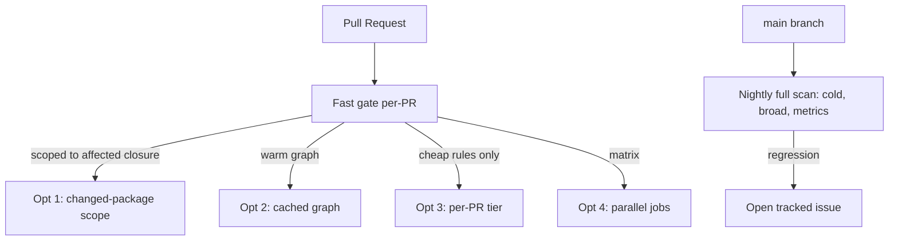

# Architecture Fitness Functions — Optimize This

> **Category:** [Anti-Patterns at Scale](../README.md) → **Architecture Fitness Functions**
> **Covers (collectively):** Layering & dependency rules · Cycle-detection gates · Allowed-dependency contracts · Metric thresholds · Evolutionary architecture & CI gating

---

These are not "spot the smell" puzzles — [`find-bug.md`](find-bug.md) does that. Here every fitness function is **correct** — it catches the right violations, it gates properly — but it's **too slow to live with.** A structural scan that adds 90 seconds to every commit gets resented, then disabled, then deleted. The skill here is keeping the enforcement while removing the tax: scope to what changed, cache the graph, move heavy checks off the hot path, and parallelize — each with its **trade-off stated explicitly**, because every speedup buys latency with some coverage or freshness.

> **The golden rule of optimizing a gate:** never trade *correctness* for speed silently. A faster check that misses violations isn't faster — it's broken (that's [`find-bug.md`](find-bug.md) Snippets 4 and 5). Every optimization below preserves "a real violation eventually goes red"; what they trade is *when* and *where* it goes red.

> **How to use this file:** read the "Before," predict the bottleneck and the fix *yourself*, then compare. The "trade-off" note under each matters more than the diff — there is no free lunch in moving a gate.

---

## Table of Contents

| # | Optimization | Bottleneck | Trade-off |
|---|---|---|---|
| 1 | [Scope the scan to changed packages](#optimization-1--scope-the-scan-to-changed-packages) | Whole-repo scan every commit | Per-PR coverage vs. speed |
| 2 | [Cache the class / import graph](#optimization-2--cache-the-class--import-graph) | Re-parsing every class every run | Cache staleness |
| 3 | [Split fast per-PR vs. heavy nightly](#optimization-3--split-fast-per-pr-vs-heavy-nightly) | One serial mega-scan on the hot path | Detection latency |
| 4 | [Parallelize independent rule sets](#optimization-4--parallelize-independent-rule-sets) | Serial execution of independent checks | CI runner cost & complexity |
| 5 | [Putting it together](#optimization-5--putting-it-together-a-tiered-pipeline) | All of the above, uncoordinated | Pipeline design effort |

---

## Optimization 1 — Scope the scan to changed packages

**Bottleneck:** the whole dependency graph is rebuilt and every rule re-evaluated on every commit, even a one-line README change.

### Before

```java
// One @AnalyzeClasses over the ENTIRE repo; runs on every commit, ~70s to import classes.
@AnalyzeClasses(packages = "com.shop")     // scans ~12,000 classes
class ArchitectureTest {
    @ArchTest static final ArchRule layered = /* full layered architecture */;
    @ArchTest static final ArchRule naming  = /* all naming rules */;
    @ArchTest static final ArchRule cycles  = /* slices().beFreeOfCycles() over everything */;
}
```

```yaml
# ci.yml — runs the full arch suite on every PR
- run: ./gradlew archTest      # 70s of class import + ~30s of rule eval, every PR
```

The dominant cost is **importing and indexing 12,000 classes into ArchUnit's `JavaClasses` model** — that happens before any rule runs, and it happens identically whether the PR touched 1 file or 500.

### After

```yaml
# ci.yml — compute the affected module closure, scan only that
- run: |
    # Modules whose code changed, PLUS modules that depend on them (the affected closure).
    AFFECTED=$(./gradlew -q :affectedModules --since=origin/main)
    if [ -z "$AFFECTED" ]; then echo "no code changes; skipping arch scan"; exit 0; fi
    ./gradlew $(echo "$AFFECTED" | sed 's/^/:/;s/$/:archTest/')
```

In a build system that understands the module graph (Gradle with a changed-module plugin, Nx, Bazel, Turborepo, or `go list` for Go), you scan only the modules the PR *affects* — the changed modules **and** everything that transitively imports them — instead of the whole repo.

### Trade-off

> **You buy speed with per-PR coverage.** Scoping to the affected closure is *sound* for changes within those modules, but a naive "only changed files" scope is **un**sound — a violation can be introduced by a change *outside* the offending file (module C newly imports A, turning the pre-existing A→B into a C→A→B cycle). You **must** scope to the affected *dependency closure*, not the literal diff, or you reintroduce [`find-bug.md`](find-bug.md) Snippet 5. And because even the closure can have edge cases (reflection, build-tool gaps), the standard safety net is a **full nightly scan** (Optimization 3) as a backstop. Net: instant per-PR feedback on the common case, with a worst-case lag of one day for anything the incremental scope missed.

---

## Optimization 2 — Cache the class / import graph

**Bottleneck:** building the dependency graph — parsing every `.class` / `.ts` / `.py` file into a model — is the expensive step, and it's thrown away and rebuilt from scratch every run.

### Before

```yaml
# madge re-parses the entire src tree on every run; no cache, no warm state.
- run: npx madge --circular --extensions ts,tsx src/   # re-parses ~4,000 modules every time
```

```java
// ArchUnit re-imports all classes each test JVM launch; nothing reused between PRs.
@AnalyzeClasses(packages = "com.shop")
```

Graph construction is `O(files)` and dominates runtime; for unchanged modules it produces a byte-identical sub-graph every time, yet pays full price to rebuild it.

### After — cache keyed by content hash

```yaml
# Cache the parsed graph; only re-parse modules whose source hash changed.
- uses: actions/cache@v4
  with:
    path: .arch-cache            # serialized dependency graph + per-module hashes
    key: arch-graph-${{ hashFiles('src/**/*.ts', 'src/**/*.tsx') }}
    restore-keys: arch-graph-    # fall back to the most recent graph, then patch deltas
- run: ./scripts/arch-scan.sh    # loads cache, re-parses only changed modules, runs rules
```

The two reusable levers:

- **Build-tool / CI cache** (above): persist the serialized graph between runs, keyed by a hash of the source files. An unchanged module's sub-graph is restored, not rebuilt.
- **ArchUnit's frozen / cached store:** `FreezingArchRule` and ArchUnit's class-cache (`@AnalyzeClasses(cacheMode = CacheMode.PER_CLASS)`) keep the imported `JavaClasses` model across rules in the same run so the 12,000-class import happens once, not once per rule class.

```java
// Import the class model ONCE and share it across all rule classes in the run.
@AnalyzeClasses(packages = "com.shop", cacheMode = CacheMode.PER_CLASS)
class ArchitectureTest { /* ... */ }
```

### Trade-off

> **You buy speed with cache-staleness risk.** A content-hash key is correct as long as the hash covers *everything* that can change the graph (source files, *and* the tool/rule version — bump the key when you upgrade madge/ArchUnit, or a stale graph hides new violations). The danger is a too-coarse or too-sticky key that serves an outdated graph and lets a violation slip through silently — the cache-equivalent of a vacuous pass. Mitigation: include the tool version and config file in the cache key, and keep the **nightly full scan** (Optimization 3) as the cold, cache-free source of truth. A cache speeds the common case; the nightly proves the cache wasn't lying.

---

## Optimization 3 — Split fast per-PR vs. heavy nightly

**Bottleneck:** one serial mega-scan runs *every* expensive rule on the PR hot path — including holistic metric thresholds and whole-repo cycle analysis that take minutes — so every PR waits for checks whose feedback could safely arrive later.

### Before

```yaml
# ci.yml — everything, every PR. Cheap and expensive rules in one serial step.
- run: |
    ./gradlew archTest                 # layered + naming + cycles + metrics, ~100s
    npx madge --circular src/          # ~25s
    ./scripts/metric-thresholds.sh     # efferent coupling, instability, abstractness ~90s
# Total: ~3.5 min added to every single PR, most of it from the metric scan.
```

### After — tier by cost and signal

```yaml
# fast-gate.yml — runs on EVERY PR. Cheap, high-signal, blocking.
name: arch-fast
on: pull_request
jobs:
  fast:
    steps:
      - run: npx madge --circular --extensions ts,tsx src/   # cycles: cheap, never false-positive
      - run: ./gradlew archTest --tests '*LayeringTest'      # the 2-3 critical layering rules
```

```yaml
# nightly-gate.yml — runs once against main. Expensive, broad, opens a ticket on regression.
name: arch-nightly
on:
  schedule: [{ cron: '0 3 * * *' }]
jobs:
  heavy:
    steps:
      - run: ./gradlew archTest                       # the FULL suite, cold (no cache)
      - run: ./scripts/metric-thresholds.sh           # all metric thresholds
      - run: ./scripts/open-issue-on-failure.sh       # file a tracked issue if anything regressed
```

The split principle: **cheap, high-signal, rarely-false-positive rules gate per-PR** (no-cycles, the handful of critical forbidden/layering edges); **expensive, broad, or fuzzy-metric rules run nightly** against `main` and open a tracked issue on regression rather than blocking a PR.

### Trade-off

> **You buy per-PR speed with detection latency on the heavy rules.** A metric regression introduced at noon is caught at 3 AM, not at PR time — so it's attributed and fixed hours later, by which point a few more PRs may have merged on top of it, and `main` is briefly "dirty." That lag is acceptable *precisely for the rules where it's cheap to fix late* (a slowly-drifting coupling metric) and unacceptable for the rules where late fixes are expensive (a hard layer breach) — which is exactly why the *hard* rules stay per-PR and only the *soft/broad* ones move nightly. What you never do is move **all** enforcement nightly: then PRs merge unchecked and `main` becomes the place violations are discovered. The nightly is a backstop and a home for fuzzy metrics — not a replacement for the gate.

---

## Optimization 4 — Parallelize independent rule sets

**Bottleneck:** independent checks run **serially** in one job, so total time is the *sum* of their durations even though they share no state and could run at once.

### Before

```yaml
# One job, four checks back-to-back: 40s + 25s + 30s + 35s = 130s wall-clock.
jobs:
  arch:
    steps:
      - run: ./gradlew :order:archTest      # 40s
      - run: ./gradlew :billing:archTest    # 25s
      - run: ./gradlew :catalog:archTest    # 30s
      - run: npx madge --circular src/      # 35s
```

### After — fan out independent checks

```yaml
# Four parallel jobs (matrix); wall-clock collapses to the SLOWEST one (~40s).
jobs:
  arch:
    strategy:
      fail-fast: false          # let every check report, don't cancel siblings on first red
      matrix:
        check: [order, billing, catalog, frontend-cycles]
    steps:
      - uses: actions/checkout@v4
      - run: ./scripts/run-arch-check.sh "${{ matrix.check }}"
```

Independent module scans and the cycle gate share no state, so a CI matrix runs them concurrently; wall-clock time drops from the **sum** (~130s) to the **max** (~40s). `fail-fast: false` ensures one failing check doesn't cancel the others — you want *all* violations reported in one run, not a whack-a-mole of one red at a time.

### Trade-off

> **You buy wall-clock time with runner cost and a little orchestration complexity.** Four parallel jobs consume four runners' worth of compute (you pay roughly the same *total* machine-seconds, just concurrently) and need a matrix/orchestration layer that's more to maintain than one linear script. The optimization is pure win *only* for genuinely independent checks — a cross-module cycle gate is **not** independent (it needs the whole graph in one place; see Optimization 3's repo-wide rule), so it stays a single job. Parallelize the per-module and per-language checks; keep the holistic ones whole.

---

## Optimization 5 — Putting it together: a tiered pipeline

The four optimizations compose into one coherent strategy. None is sufficient alone; together they keep strong enforcement off the developer's critical path.



| Tier | When | What runs | Blocking? | Optimizations applied |
|---|---|---|---|---|
| **Fast gate** | Every PR | No-cycles + 2–3 critical layering rules | **Yes** — blocks merge | 1 (scope), 2 (cache), 4 (parallel) |
| **Nightly** | Once/night vs. `main` | Full suite + all metric thresholds | No — opens an issue | None (cold, broad, authoritative) |

The division of labour:

- The **fast gate** is where the optimizations live — it must be fast enough that developers don't resent it, so it's scoped (Opt 1), cached (Opt 2), trimmed to high-signal rules (Opt 3), and parallelized (Opt 4). It blocks the merge, so it catches the dangerous, common violations *instantly*.
- The **nightly** is deliberately *un*-optimized — cold cache, whole repo, every rule — because it's the authoritative backstop that catches anything the fast gate's scoping or caching missed, plus the fuzzy metrics that don't belong on the hot path. It doesn't block; it files a ticket.

### Trade-off

> **You buy a fast, trustworthy gate with pipeline-design effort and a small, bounded latency window.** The combined system has more moving parts than one `./gradlew archTest` step — a cache key to maintain, an affected-closure computation, a matrix, a nightly job, an issue-filing script. That complexity is justified at scale (a slow gate gets disabled, and a disabled gate enforces nothing), but it's overkill for a small repo where the whole scan already runs in 5 seconds. Reach for the full tiering only when the un-optimized scan is slow enough to hurt. And keep the invariant that makes the whole thing safe: **every real violation still goes red — the optimizations change *when and where*, never *whether*.**

---

## Summary

- Fitness functions are only worth having if they're **gates**, and gates only survive if they're **fast** — a structural scan that taxes every commit gets disabled, and a disabled gate enforces nothing. Optimization here is about preserving enforcement while removing the tax.
- **Scope to the changed packages' *affected closure*** (Opt 1), not the literal diff — scoping to the diff alone is unsound and reintroduces missed cross-module violations.
- **Cache the dependency graph** keyed by a content hash that *includes the tool/config version* (Opt 2); a stale cache that hides violations is the cache-equivalent of a vacuous pass.
- **Tier the rules** (Opt 3): cheap, high-signal, rarely-false-positive rules (no-cycles, critical layering) **gate per-PR**; expensive, broad, fuzzy-metric rules run **nightly** and open a ticket. Never move *all* enforcement nightly.
- **Parallelize independent checks** (Opt 4) so wall-clock time is the max, not the sum — but keep holistic checks (cross-module cycles) whole, since they need the full graph in one place.
- The unifying invariant: **optimizations may change *when* and *where* a violation goes red, never *whether* it does.** Trading correctness for speed isn't optimization — it's the bug from [`find-bug.md`](find-bug.md).

---

## Related Topics

- [`tasks.md`](tasks.md) — build the (correct) rules these optimizations make fast.
- [`find-bug.md`](find-bug.md) — Snippets 4 and 5 are exactly the "scoped for speed, broke coverage" trap this file avoids.
- [`junior.md`](junior.md) · [`senior.md`](senior.md) — the concept → designing and operating a real suite.
- [`interview.md`](interview.md) — build-cost and incremental-check questions as interview topics.
- [Hotspot Analysis](../03-hotspot-analysis/optimize.md) — focusing expensive analysis where the churn-and-complexity signal says it pays off.
- [Anti-Pattern Budgets & Ratcheting](../02-anti-pattern-budgets-and-ratcheting/optimize.md) — keeping the budget check itself cheap as the codebase grows.
- [Architecture → Anti-Patterns](../../../../../Architecture/anti-patterns/README.md) — the system-level shapes these gates protect.
