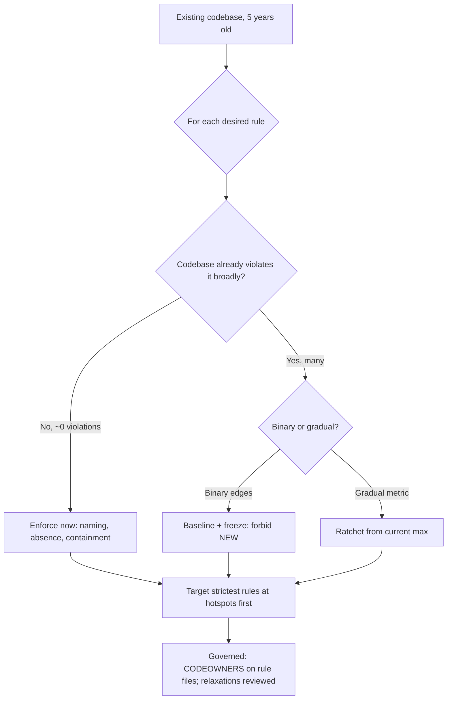

# Architecture Fitness Functions — Senior Level

> **Category:** [Anti-Patterns at Scale](../README.md) → **Architecture Fitness Functions** — *executable rules that fail the build when the architecture drifts toward an anti-pattern.*
> **Covers (collectively):** Layering & dependency rules · Cycle-detection gates · Allowed-dependency contracts · Metric thresholds · Evolutionary architecture & CI gating

---

## Table of Contents

1. [Introduction](#introduction)
2. [Prerequisites](#prerequisites)
3. [The Reality: You Inherit Violations](#the-reality-you-inherit-violations)
4. [Baseline, Freeze, Forbid New](#baseline-freeze-forbid-new)
5. [The Four Rule Categories](#the-four-rule-categories)
6. [Metric Thresholds as Fitness Functions](#metric-thresholds-as-fitness-functions)
7. [Presence / Absence Rules](#presence--absence-rules)
8. [False Positives and How to Bound Them](#false-positives-and-how-to-bound-them)
9. [Targeting Rules at Hotspots](#targeting-rules-at-hotspots)
10. [Governance: Where Rules Live and Who Owns Them](#governance-where-rules-live-and-who-owns-them)
11. [Evolving Rules as the Architecture Changes](#evolving-rules-as-the-architecture-changes)
12. [A Worked Suite Design](#a-worked-suite-design)
13. [Common Mistakes](#common-mistakes)
14. [Test Yourself](#test-yourself)
15. [Cheat Sheet](#cheat-sheet)
16. [Summary](#summary)
17. [Further Reading](#further-reading)
18. [Related Topics](#related-topics)

---

## Introduction

> Focus: **Designing a fitness-function suite for an existing codebase.**

`middle.md` taught you the rule shapes — layering, cycles, naming, containment — and how to wire one into CI against a clean, greenfield package tree. That's the easy world. The world you actually work in is different in one decisive way: **the codebase already violates the rules you want to write.** Turn on a layering rule on a five-year-old service and CI lights up with 340 violations. You can't fix them all today, and a permanently-red build trains everyone to ignore the gate — the worst possible outcome.

This file is about designing a *suite* for that real codebase. The senior skills are not "write more rules"; they are judgment calls:

- **Baselining.** How to adopt a rule the codebase already breaks — freeze the current violations as accepted debt, and forbid only *new* ones. This is where this topic meets [Anti-Pattern Budgets & Ratcheting](../02-anti-pattern-budgets-and-ratcheting/senior.md).
- **Categorizing.** Knowing the four kinds of rule — dependency, naming, metric, presence/absence — so your suite covers the real failure modes instead of three flavors of the same dependency check.
- **Containing false positives.** A fitness function that fires on legitimate code erodes trust faster than no rule at all. Bounding false positives — narrow scope, justified exceptions, the right granularity — is the difference between a suite people respect and one they route around.
- **Governance.** Where the rules live, who may change them, and how a rule is allowed to evolve when the architecture *legitimately* changes (versus when someone just wants green).
- **Targeting.** Spending your rule budget where the decay actually is — the [hotspots](../03-hotspot-analysis/senior.md) — not uniformly across a codebase where most modules are fine.

> **The mental model:** a fitness-function suite is a *living spec of your architecture*, applied to a codebase that doesn't yet conform to it. Your job is to make that spec true going forward without pretending it's already true — and to keep it honest as the architecture, and the codebase, change underneath it.

Making these checks fast at monorepo scale, and proving they catch real regressions rather than just passing, is [`professional.md`](professional.md).

---

## Prerequisites

- **Required:** Fluent with [`middle.md`](middle.md) — you can write layering, cycle, naming, and containment rules in at least one tool and wire them into CI as a required check.
- **Required:** You've worked in a large, long-lived codebase and seen architectural drift firsthand — a layer that's been bypassed in fifty places, a cycle that's been there for years.
- **Required:** Comfort with CI configuration, branch protection, and the idea of a *baseline* / snapshot file checked into the repo.
- **Helpful:** You've read [Anti-Pattern Budgets & Ratcheting](../02-anti-pattern-budgets-and-ratcheting/senior.md) — baselining is its core mechanic, applied here to fitness functions.
- **Helpful:** Familiarity with code-smell-detection and refactoring-techniques skills — fitness functions surface the work those describe how to do.

---

## The Reality: You Inherit Violations

The greenfield assumption — *write the rule, it passes, new violations fail* — almost never holds. Here is what actually happens the first time you add a layering rule to a mature service:

```
$ lint-imports
Broken contract: Controllers -> services -> repositories, downward only
  340 illegal imports found.
  shop.repositories.order -> shop.services.pricing
  shop.repositories.invoice -> shop.services.tax
  ... 338 more ...
```

You now face three bad options and one good one:

| Option | Outcome |
|---|---|
| **Merge it red, fix "later"** | A permanently-red required check. Within a week everyone learns to ignore it (or makes it non-required), and the gate is dead. |
| **Make it a warning** | Enforcement-by-appearance. The 340 stay; new violations join them invisibly; you've trained people that this check never matters. |
| **Fix all 340 first, then turn on the rule** | Often weeks of risky refactoring blocking a one-line rule. The rule never ships because the cleanup never finishes. |
| **Baseline: freeze the 340 as accepted, forbid the 341st** | The rule ships *today* and immediately stops the bleeding. Existing debt is paid down separately, on its own schedule. |

The fourth option is the only one that works at scale, and it's the senior default. You are not blessing the 340 violations — you are recording them as known debt and drawing a line: *no new ones.* The architecture stops getting worse the moment the rule ships, even though it isn't yet good.

---

## Baseline, Freeze, Forbid New

The mechanism — covered in depth in [Anti-Pattern Budgets & Ratcheting](../02-anti-pattern-budgets-and-ratcheting/senior.md) — is a **baseline file**: a checked-in snapshot of the violations that exist *now*. The gate fails only if a violation appears that isn't in the baseline.

Most tools support this directly:

```bash
# import-linter: declare known-broken imports as explicit, listed exceptions.
# Each ignored import is recorded in the contract — visible, greppable debt.
[importlinter:contract:layers]
type = layers
layers =
    shop.controllers
    shop.services
    shop.repositories
ignore_imports =
    shop.repositories.order -> shop.services.pricing
    shop.repositories.invoice -> shop.services.tax
    # ... the 340, each one a line of recorded debt ...
```

```bash
# dependency-cruiser: capture a baseline of known violations; only NEW ones fail.
npx depcruise --config .dependency-cruiser.js src --output-type baseline > .dependency-cruiser-known-violations.json
# CI then runs against that baseline; a 341st violation breaks the build.
```

```java
// ArchUnit: a FreezingArchRule stores violations in a violation store on first run,
// then fails only on violations NOT already frozen.
@ArchTest
static final ArchRule layers =
    FreezingArchRule.freeze(layeredArchitecture()
        .layer("Controller").definedBy("..controller..")
        .layer("Service").definedBy("..service..")
        .layer("Repository").definedBy("..repository..")
        .whereLayer("Repository").mayOnlyBeAccessedByLayers("Service"));
// First run records the 340; subsequent runs fail only on the 341st.
```

Two properties make a baseline honest rather than a rug to sweep under:

1. **It ratchets down, never up.** Removing a violation should *update* the baseline (the count can only shrink). Most tools fail the build if a baselined violation is *fixed* but the baseline wasn't updated — which nudges the count downward over time. A baseline that's allowed to grow silently is just a warning in disguise.
2. **It's visible.** The 340 are checked into the repo as text, greppable, reviewable, and assignable. They're *recorded debt*, not hidden debt — the opposite of a `// TODO` no tool tracks.

> **The line you're drawing:** the baseline says "this is the worst the architecture is allowed to be — and it can only get better." New code conforms to the rule immediately; old code is paid down on a schedule you choose, targeting [hotspots](../03-hotspot-analysis/senior.md) first.

---

## The Four Rule Categories

A suite that's all dependency rules has blind spots. Senior suites deliberately cover four categories, because the architecture decays in four different ways:

| Category | Asserts about | Examples | Tool |
|---|---|---|---|
| **Dependency** | Edges in the import graph | Layering, no cycles, containment, "domain ↛ framework" | ArchUnit layers, import-linter, depcruise |
| **Naming** | Names match roles/locations | `*Repository` lives in `..repository..`; `@Entity` only in `..model..` | ArchUnit naming/annotation rules, custom AST checks |
| **Metric** | A measured number stays under a threshold | Max package fan-in, class size, cyclomatic complexity, depth-of-nesting | ArchUnit metrics, lint thresholds, custom scripts |
| **Presence / Absence** | Something exists or doesn't | Every aggregate has a repository; no `System.out.println`; no `@Deprecated` annotations on new code | ArchUnit presence rules, grep-based gates |

The four are not interchangeable. A naming rule (cheap, fast, low false-positive) protects the *precondition* of your dependency rules. A metric rule catches the slow swell of a God Object that no dependency rule sees — a class can grow to 3,000 lines without ever adding a forbidden import. A presence/absence rule catches structural *omissions* (a feature shipped without its repository) and *forbidden idioms* (debug prints, a banned library) that aren't dependency-graph facts at all.

> **Design heuristic:** if every rule in your suite is a dependency rule, you're guarding one wall of a four-walled room. Map each known decay mode in *your* codebase to the category that catches it, then write the cheapest rule in that category first.

---

## Metric Thresholds as Fitness Functions

Dependency rules are binary (the edge exists or it doesn't). Many anti-patterns are *gradual* — a God Object doesn't appear, it accretes. Metric fitness functions catch gradual decay by asserting a measured number stays under a ceiling.

```java
// ArchUnit: no package may have efferent coupling (outgoing dependencies) above 20.
// A package that imports 40 others is becoming a tangle hub.
@ArchTest
static final ArchRule fanOut =
    slices().matching("com.shop.(*)..")
        .should(ArchConditions.haveFanOutLessThanOrEqualTo(20));
```

```bash
# Generic metric gate: fail if any class exceeds 750 lines (God Object early-warning).
# A presence/absence-style check works for any metric your toolchain can emit.
MAX=750
offenders=$(find src -name '*.java' | while read f; do
  lines=$(wc -l < "$f")
  [ "$lines" -gt "$MAX" ] && echo "$f: $lines"
done)
[ -n "$offenders" ] && { echo "Classes over $MAX lines:"; echo "$offenders"; exit 1; } || echo "ok"
```

The subtlety with metric thresholds is **where to set the ceiling**. Two failure modes:

- **Set it at the ideal (e.g. max 200 lines):** the existing codebase has 90 classes over it; the rule is red on day one and you're back to the baseline problem.
- **Set it at the worst current value (e.g. max 2,800 lines because that's your biggest class):** the rule allows *everything that exists* and constrains nothing — the false-confidence trap (`professional.md`'s central subject).

The senior move is the **ratchet**: baseline the metric at the current *maximum* (or current count of offenders), forbid making it worse, and tighten the ceiling as offenders are fixed. The threshold tracks reality downward — it's a budget, not a wish.

> **A metric rule with a threshold set above everything that exists is the most insidious kind of dead fitness function: it's green, it looks like governance, and it permits the exact decay it claims to prevent.** Always ask: "would this rule fail if the codebase got 10% worse?" If not, it's decoration.

---

## Presence / Absence Rules

These assert structural facts that aren't about the dependency graph at all:

```java
// Presence: every JPA @Entity must have a corresponding repository interface.
// Catches a feature shipped without its data-access layer.
@ArchTest
static final ArchRule entitiesHaveRepositories =
    classes().that().areAnnotatedWith(Entity.class)
        .should(haveACorrespondingClassThat(   // custom condition
            implement(Repository.class)));

// Absence: production code must not call System.out / printStackTrace.
@ArchTest
static final ArchRule noConsolePrints =
    noClasses().that().resideOutsideOfPackage("..test..")
        .should().callMethod(System.class, "out")        // (illustrative; use GeneralCodingRules)
        .orShould().callMethod(Throwable.class, "printStackTrace");
```

```bash
# Absence as a grep gate: ban a deprecated library import outside a migration shim.
if grep -rn --include='*.go' 'legacypkg/oldclient' ./... | grep -v '/migration/'; then
  echo "FORBIDDEN: oldclient is banned outside the migration shim"; exit 1
fi
```

Absence rules are the home of "we are migrating *off* X" and "we banned Y after the incident." Presence rules encode "every X must have a Y" structural completeness invariants. Both are cheap, both are high-signal, and both catch failures that no dependency or metric rule ever would.

---

## False Positives and How to Bound Them

A fitness function that fires on *legitimate* code is worse than no rule: it teaches the team that the gate is noise, and the next *real* violation gets waved through with the same "oh, that check is always wrong" shrug. Trust is the asset; a false positive spends it.

Sources of false positives and their bounds:

| Source | Symptom | Bound |
|---|---|---|
| **Over-broad pattern** | `..util..` matches a legitimate shared util the rule didn't mean | Narrow the matcher; match by precise package, not a loose glob |
| **A genuinely-allowed exception** | The one place the rule *should* permit (a sanctioned bridge, a generated file) | An *explicit, justified, reviewed* exception — not a blanket allow-list |
| **Generated / vendored code** | The rule fires on code you don't own or write by hand | Exclude generated/vendored paths from the scan scope entirely |
| **Wrong granularity** | A class-level rule fires on a method that's fine | Scope the rule to the right unit (package vs class vs method) |

The discipline that separates a justified exception from a rule-killing allow-list:

- **Every exception is named and reasoned.** Not `ignore: [a, b, c]` but each line with a comment: *why* this edge is allowed, who approved it, and (ideally) a ticket to remove it. A `middle.md`-style reflex allow-list deletes the rule; a senior exception is recorded, scoped, and temporary.
- **Exceptions are reviewed like architecture changes.** Adding an exception to a fitness function should require the same approval as changing the architecture, because it *is* changing what the architecture permits.
- **Prefer narrowing scope over adding exceptions.** If a rule needs ten exceptions, the rule is probably scoped wrong. Tighten what it matches so it only fires on real violations.

> **The trust ledger:** every false positive is a withdrawal; every caught real regression is a deposit. A suite that fires on legitimate code goes bankrupt — people make it non-required, route around it, or stop reading it. Bounding false positives isn't politeness; it's keeping the gate *alive*.

---

## Targeting Rules at Hotspots

You have a finite rule budget — both in authoring effort and in build time (`professional.md`). Spending it uniformly is waste: most of a codebase is stable and fine. The decay concentrates in **hotspots** — the files and packages that are *both* complex and frequently changed ([Hotspot Analysis](../03-hotspot-analysis/senior.md) is the dedicated treatment).

The targeting strategy:

1. **Find the hotspots.** Cross `git log` change-frequency with complexity/size. The intersection is where bugs and architectural decay actually live.
2. **Aim the strictest rules there.** A tight metric ceiling, a no-new-dependencies freeze, a containment rule — apply these to the hotspot package first, where they pay off, rather than codebase-wide where they mostly fire on stable code that's never edited.
3. **Loosen elsewhere.** A module nobody has touched in two years doesn't need a tight complexity ceiling; the cost (false positives, build time) outweighs the benefit (decay that isn't happening).

```bash
# Find churn-by-complexity hotspots: files changed most often in the last year.
git log --since='1 year ago' --name-only --pretty=format: \
  | grep -E '\.(java|go|py)$' | sort | uniq -c | sort -rn | head -20
# Cross the top of this list with file size / cyclomatic complexity.
# The overlap is where your strictest fitness functions belong.
```

> **The economics:** a fitness function targeted at a hot, decaying package catches drift on every one of its frequent edits. The same rule on a cold, stable package fires rarely and mostly produces false positives on code that was fine. Target the budget where change — and therefore decay — concentrates.

---

## Governance: Where Rules Live and Who Owns Them

A fitness function is a piece of the architecture's specification. Its location and ownership decide whether it's a respected contract or a thing people quietly edit to get green.

**Where rules live:**

- **Co-located with the code, in the repo.** ArchUnit tests in `src/test`, `.importlinter` / `.dependency-cruiser.js` at the repo root. They version with the code, run in the same CI, and a rule change shows up in the same PR diff as the code change — visible and reviewable.
- **Not** in a separate "governance repo" nobody reads, and **not** in a wiki (that's the `junior.md` anti-pattern — hope, not enforcement).

**Who may change them:**

- **Rule *additions* and *tightenings*** can come from anyone — they only make the architecture stricter.
- **Rule *relaxations* and *new exceptions*** are the sensitive change. These should require review by whoever owns the architecture (a CODEOWNERS entry on the rule files, an architecture-group approval). Relaxing a fitness function is relaxing the architecture; it shouldn't happen in a 6 p.m. PR to unblock a deadline.

```
# CODEOWNERS — relaxing a fitness function needs architecture-group sign-off.
/src/test/java/**/Architecture*.java   @org/architecture
/.importlinter                         @org/architecture
/.dependency-cruiser.js                @org/architecture
```

> **The governance test:** can someone delete or weaken a rule to make their PR green, without anyone who cares about the architecture noticing? If yes, the rules aren't governed — they're decorative. CODEOWNERS on the rule files turns "weaken the rule" from a silent reflex into a reviewed decision.

---

## Evolving Rules as the Architecture Changes

A fitness function is not a stone tablet. The architecture *should* change — you adopt hexagonal layering, you split a monolith, you introduce a new bounded context. When it does, the rules must change *with* it, deliberately. The senior skill is distinguishing the two reasons a rule "fails":

| The rule fires because… | Right response |
|---|---|
| Someone introduced a violation of the *current* architecture | Fix the **code** — remove the bad edge |
| The architecture *itself* changed and the rule now encodes the *old* shape | Change the **rule** — deliberately, reviewed, in the same PR as the structural change |

The trap is using the second reason as cover for the first: "the architecture changed" to justify deleting a rule that simply caught a violation. The guard is **process**: a rule change rides in the same PR as the structural change that motivates it, is reviewed by the architecture owners (CODEOWNERS above), and is explained — an ADR or a PR description that says *why* the layering is different now.

A worked example: you decide repositories may now depend on a new `domain.events` package (they couldn't before).

```diff
  [importlinter:contract:layers]
  type = layers
  layers =
      shop.controllers
      shop.services
      shop.repositories
+ # ADR-0042: repositories now publish domain events directly.
+ # domain.events is below repositories in the layering; this is intentional.
+ # Reviewed by @org/architecture.
```

The change is *additive to the spec*, *documented*, and *reviewed* — the architecture moved, and the executable spec moved with it. Compare that to silently deleting the contract to make a red build green: same diff size, opposite meaning.

> **Evolutionary architecture is the whole point** (Ford/Parsons/Kua): the architecture is *allowed* to change, and fitness functions are what let it change *safely* — they fail when a change is unintended drift, and they're *deliberately updated* when a change is intended evolution. A rule that can never change is brittle; a rule anyone can change is no rule. The middle path is governed, documented evolution.

---

## A Worked Suite Design

Putting it together for a real five-year-old order service. The decay modes, observed from hotspot analysis and incident history, map to a four-category suite:

```
Observed decay mode                          Rule (category)                         Adoption
──────────────────────────────────────────  ──────────────────────────────────────  ─────────────
Controllers reach into repositories          Layering, downward-only (dependency)    FROZEN: 340 baselined,
  (skip imports accumulating)                                                          new ones fail
billing ↔ audit cycle from last refactor     No cycles (dependency)                  Fix now (1 cycle), then
                                                                                        forbid — small enough
OrderService growing toward God Object        Class ≤ 750 lines (metric)              RATCHET: ceiling at current
                                                                                        max, tighten as fixed
Repos placed in service package by mistake    *Repository in ..repository.. (naming)  Enforce now (cheap, ~0 FPs)
Migrating off legacy HTTP client             No legacypkg/oldclient outside shim      Enforce now (absence)
                                              (absence)
payment.internal leaking to controllers       Containment (dependency)                Enforce now (Go: free)
```

The shape of the decision: **cheap, low-false-positive rules (naming, absence, containment) are enforced immediately**; **rules the codebase already breaks broadly (layering) are frozen and ratcheted**; **gradual-decay rules (class size) are ratcheted from the current maximum**; and **the strictest of these are aimed at the hotspot package (`order`) first.** Every rule either fails today on real new violations or is recorded as bounded debt — none is green-but-toothless.



---

## Common Mistakes

1. **Turning on a rule the codebase already breaks and merging it red.** A permanently-red required check trains everyone to ignore the gate. Baseline the existing violations and forbid only new ones.
2. **"Fixing" the red build by downgrading the rule to a warning.** That's enforcement-by-appearance — the violations stay, new ones join invisibly, and you've taught the team this check never matters.
3. **A suite that's all dependency rules.** You're guarding one wall of a four-walled room. Cover naming, metric, and presence/absence too — each catches a decay mode the others can't see.
4. **Setting a metric threshold above everything that exists.** A class-size ceiling of 3,000 lines (because that's your biggest class) is green and constrains nothing. Ratchet from the current maximum and tighten down.
5. **Letting false positives accumulate.** Each one spends trust; enough of them and the team makes the gate non-required. Narrow scope, exclude generated/vendored code, and keep exceptions named, reasoned, and reviewed.
6. **Allow-listing instead of narrowing.** Ten exceptions usually means the rule is scoped wrong. Tighten what it matches so it only fires on real violations, rather than papering over a broad rule with a list.
7. **Ungoverned rule files anyone can weaken.** If a dev can delete a rule to go green without architecture review, the suite is decorative. Put CODEOWNERS on the rule files so relaxations are reviewed decisions.
8. **Confusing "architecture changed" with "rule caught a violation."** Editing the rule is right *only* when the architecture genuinely evolved — documented (ADR), reviewed, in the same PR as the structural change. Otherwise fix the code.
9. **Spreading rules uniformly across a codebase that's mostly stable.** Target the strictest rules at hotspots (high churn × complexity); cold, stable modules don't need them and mostly produce false positives there.

---

## Test Yourself

1. You add a layering rule to a five-year-old service and CI reports 340 violations. List the four options and explain why "baseline and forbid new" is the only one that ships the rule *and* keeps the gate respected.
2. What does it mean for a baseline to "ratchet," and why is a baseline that's allowed to grow silently just a warning in disguise?
3. Name the four rule categories and give the decay mode each one catches that a *dependency* rule cannot.
4. You set a class-size metric ceiling at 2,800 lines because that's your biggest class today. Why is this rule worse than useless, and what's the senior fix?
5. A fitness function fires on a legitimate shared utility the rule didn't mean to catch. Give two ways to bound this, and explain why "add it to the ignore list" is the *last* resort, not the first.
6. A rule fires on a PR. The author says "the architecture changed, so I updated the rule." What three things must be true for that to be a legitimate evolution rather than disguised rule-deletion?
7. You have budget for fitness functions on only a few packages. How do you decide which, and why is uniform application across the whole codebase wasteful?
8. Why should the rule files have a CODEOWNERS entry, and specifically which *kind* of rule change should it gate?

<details>
<summary>Answers</summary>

1. (a) **Merge red, fix later** — permanently-red check, ignored within a week. (b) **Downgrade to warning** — enforcement-by-appearance, violations stay and grow invisibly. (c) **Fix all 340 first** — weeks of risky refactoring block a one-line rule; it never ships. (d) **Baseline and forbid new** — ships *today*, stops the bleeding immediately, pays down the 340 separately. Only (d) both ships the rule and keeps it as a respected, non-red required gate; the others either kill trust or never ship.
2. **Ratchet** = the baselined violation count can only *shrink*: fixing a violation updates (shrinks) the baseline, and the build fails if a fixed violation isn't removed from it, nudging the count down over time. A baseline that can grow silently lets new violations be added to the accepted list without anyone noticing — identical in effect to a warning that never blocks.
3. **Dependency** (graph edges — layering, cycles, containment). **Naming** — classes living where their name says, the precondition of dependency rules matching correctly. **Metric** — *gradual* decay (a 3,000-line God Object accreting) that adds no forbidden edge. **Presence/absence** — structural *omissions* (a feature without its repository) and *forbidden idioms* (a banned library, debug prints) that aren't graph facts at all.
4. The ceiling is set above everything that exists, so the rule is green and permits the exact decay (God Object growth) it claims to prevent — false confidence. Senior fix: **ratchet** — set the ceiling at the current maximum (or current offender count), forbid making it worse, and tighten the ceiling as classes are split. The threshold tracks reality downward.
5. Bounds: **narrow the matcher** (match the precise package, not a loose glob) and **exclude the path from scope** if it's generated/vendored. "Add to the ignore list" is last because a blanket allow-list deletes the rule for that edge; an ignore entry is acceptable only when it's a single, named, reasoned, reviewed exception — and ten of them means the rule is scoped wrong.
6. (i) The rule change rides in the **same PR** as the structural change that motivates it; (ii) it's **reviewed by the architecture owners** (CODEOWNERS); (iii) it's **documented** (ADR / PR description explaining why the architecture is now different). Absent these, "the architecture changed" is cover for deleting a rule that simply caught a violation.
7. Find **hotspots** — packages high in *both* change-frequency (`git log`) and complexity/size; that intersection is where decay concentrates. Aim the strictest rules there. Uniform application wastes budget (author effort + build time) on cold, stable modules that aren't decaying, where the rule mostly produces false positives on code that's fine and rarely edited.
8. Rule files are part of the architecture's spec; CODEOWNERS makes weakening them a **reviewed decision** rather than a silent reflex. It should gate **relaxations and new exceptions** (changes that loosen what the architecture permits) — additions and tightenings only make it stricter and can come from anyone.

</details>

---

## Cheat Sheet

| Decision | Senior default |
|---|---|
| **Codebase already violates the rule** | Baseline / freeze existing violations; forbid only new ones; ratchet the count down |
| **Gradual decay (size, complexity, fan-in)** | Metric rule, threshold at current *max*, tighten as fixed — never above what exists |
| **Structural omission / banned idiom** | Presence/absence rule (cheap, high-signal) |
| **Rule fires on legitimate code** | Narrow the matcher or exclude the path *before* adding an ignore; every exception named, reasoned, reviewed |
| **Where rules live** | In the repo, co-located, versioned with code; never a wiki or governance-repo nobody reads |
| **Who may weaken a rule** | Architecture owners only (CODEOWNERS on rule files); additions/tightenings open to all |
| **Architecture genuinely changed** | Update the rule in the *same PR*, reviewed, with an ADR — not a silent deletion to go green |
| **Limited rule budget** | Target strictest rules at hotspots (churn × complexity), loosen on cold/stable modules |

> **One rule to remember:** *a fitness function on a real codebase succeeds by freezing today's debt and forbidding tomorrow's — it makes the architecture stop getting worse before it makes it good, and every exception is recorded, reasoned, and governed.*

---

## Summary

- The greenfield assumption ("write the rule, it passes") fails on real codebases — they already violate the rules you want. The senior default is **baseline, freeze, forbid new**: record existing violations as accepted debt and block only new ones, so the architecture stops decaying *today* without a permanently-red build.
- A baseline must **ratchet** (count only shrinks) and be **visible** (checked into the repo, greppable, assignable). A silently-growing baseline is a warning in disguise.
- Cover **four rule categories**, because the architecture decays four ways: **dependency** (graph edges), **naming** (the precondition of dependency rules), **metric** (gradual decay like a swelling God Object), and **presence/absence** (omissions and banned idioms). A suite of only dependency rules guards one wall of a four-walled room.
- **Metric thresholds** must be ratcheted from the current maximum — a ceiling set above everything that exists is green and constrains nothing (the false-confidence trap `professional.md` dissects).
- **Bound false positives** — each one spends the team's trust until they make the gate non-required. Narrow scope and exclude generated code *before* reaching for an ignore list; keep every exception named, reasoned, and reviewed.
- **Target the budget at hotspots** (churn × complexity) where decay concentrates; cold, stable modules don't need the strictest rules and mostly produce false positives there.
- **Govern the rules**: co-locate them in the repo, and put CODEOWNERS on the rule files so *relaxations* are reviewed decisions. Evolve rules deliberately when the architecture genuinely changes — same PR, reviewed, documented (ADR) — never as a silent deletion to go green.
- This completes the design ladder: [`junior.md`](junior.md) (what a fitness function is) → [`middle.md`](middle.md) (write real rules, wire CI) → **senior.md** (design a suite for a real codebase). Next: [`professional.md`](professional.md) — *the cost and correctness of the checks themselves: build-time impact at monorepo scale, and the central failure of a fitness function that passes but constrains nothing.*

---

## Further Reading

- **Building Evolutionary Architectures** — Ford, Parsons, Kua (2nd ed., 2022) — fitness functions as the mechanism that lets architecture change *safely*; categories of fitness function (atomic/holistic, triggered/continuous).
- **ArchUnit User Guide** — Peick et al. (ongoing) — `FreezingArchRule`, violation stores, metric conditions (fan-in/fan-out), custom conditions for presence/absence rules.
- **import-linter documentation** — David Seddon (ongoing) — `ignore_imports` for baselining, contract types, CI integration.
- **Software Design X-Rays** — Adam Tornhill (2018) — hotspot analysis (churn × complexity) for targeting rules where decay concentrates.
- **Working Effectively with Legacy Code** — Michael Feathers (2004) — adopting discipline on a codebase that already broke every rule; the seam-finding that makes violations fixable.
- **Refactoring** — Martin Fowler (2nd ed., 2018) — the Move Class / Extract Module / invert-dependency moves that pay down a baseline.

---

## Related Topics

- [Anti-Pattern Budgets & Ratcheting](../02-anti-pattern-budgets-and-ratcheting/senior.md) — the baseline/freeze/ratchet mechanic in full; this file applies it to fitness functions.
- [Hotspot Analysis](../03-hotspot-analysis/senior.md) — finding the churn × complexity hotspots where the strictest rules belong.
- [Automated Large-Scale Refactoring](../04-automated-large-scale-refactoring/senior.md) — paying down a baseline across hundreds of files at once.
- [Coupling & State Anti-Patterns](../../02-design/02-coupling-and-state/professional.md) — the cycles, hidden dependencies, and bypassed layers a suite freezes and forbids.
- [Bad Structure Anti-Patterns](../../01-development/01-bad-structure/senior.md) — the God Object that a *metric* rule catches when a dependency rule can't.
- [Clean Code → Classes](../../../clean-code/09-classes/README.md) — the single-responsibility boundary a class-size metric rule defends.
- [Clean Code → Modules & Packages](../../../clean-code/19-modules-and-packages/README.md) — drawing the module boundaries a containment rule then enforces.
- [Refactoring → Refactoring Techniques](../../../refactoring/02-refactoring-techniques/README.md) — the moves that fix the violations a suite surfaces.
- [Architecture → Anti-Patterns](../../../../../Architecture/anti-patterns/README.md) — the Big Ball of Mud a governed suite holds back.
