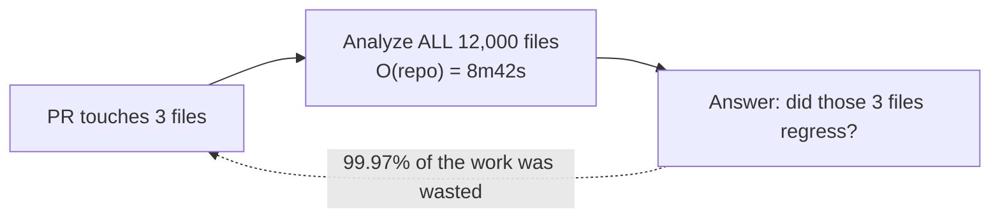
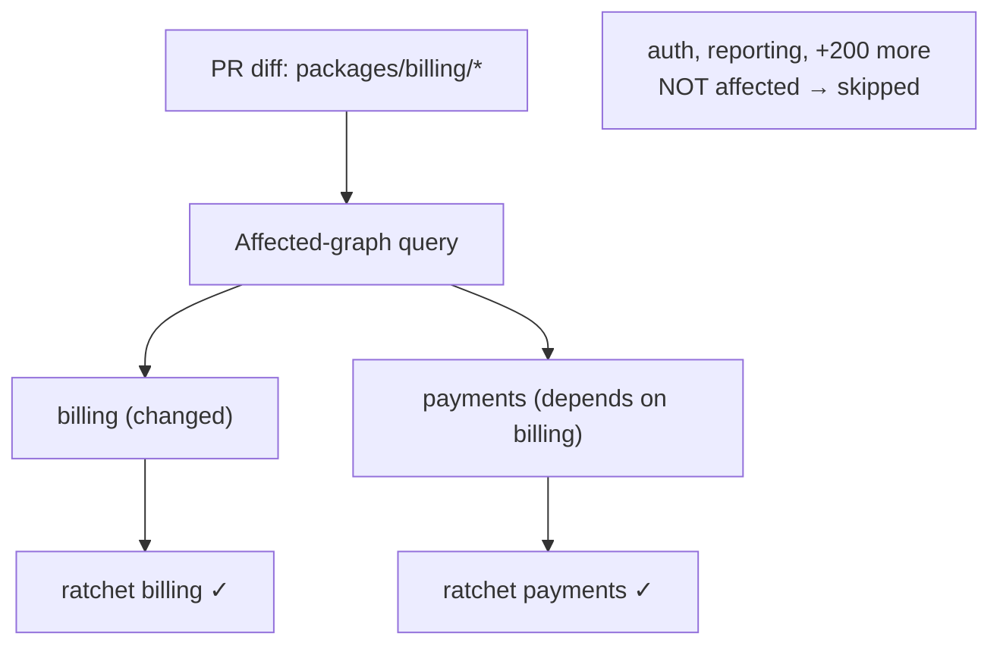
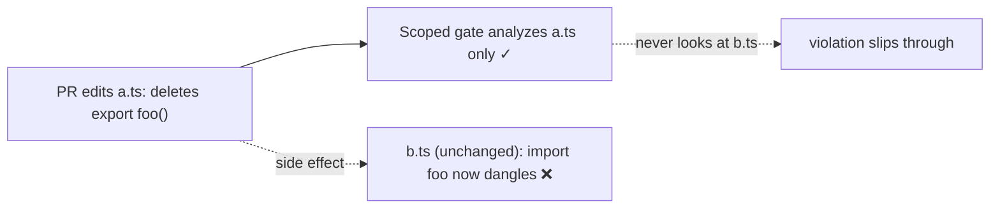
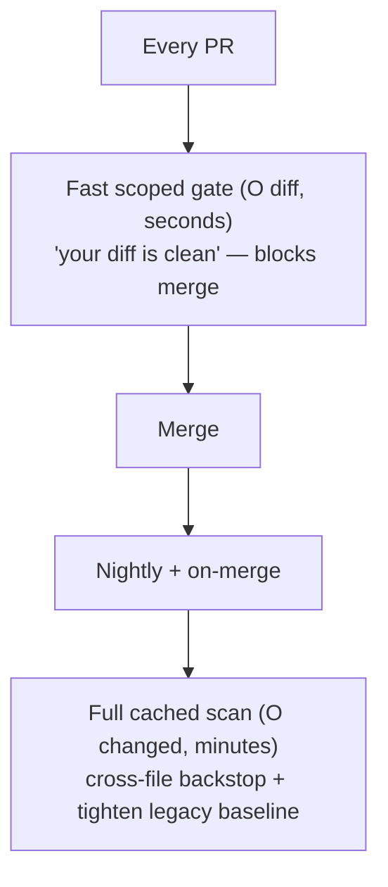

# Anti-Pattern Budgets & Ratcheting — Optimize

> **Category:** [Anti-Patterns at Scale](../README.md) → **Anti-Pattern Budgets & Ratcheting** — *make the gate fast enough that nobody wants to disable it.*
> **Covers (collectively):** Baseline-and-ratchet · "No new violations" gates · Per-area debt budgets · Ratchet tooling · Failing the build on regression

---

A ratchet that's *correct* but *slow* gets removed. When the gate adds ten minutes to every PR, someone makes it non-blocking "temporarily," and the ratchet quietly dies. This file is about the one performance anti-pattern that kills ratchets at scale — **recomputing the whole repository on every PR** — and the three levers that fix it: **scope to changed files**, **cache incrementally**, and **sample / run full scans on a slower cadence**.

> **How to use this file.** Each section has a *before* (the slow version), the *optimization*, an *after*, and the correctness caveat the speed-up introduces. The numbers are illustrative — reproduce them on your repo with a stopwatch on the PR's CI duration. Refer to [`professional.md`](professional.md) for the recompute-performance principles.

---

## Table of Contents

1. [The Problem: Whole-Repo Recompute on Every PR](#the-problem-whole-repo-recompute-on-every-pr)
2. [Optimization 1 — Scope to Changed Files](#optimization-1--scope-to-changed-files)
3. [Optimization 2 — Cache the Analysis Incrementally](#optimization-2--cache-the-analysis-incrementally)
4. [Optimization 3 — Affected-Graph in a Monorepo](#optimization-3--affected-graph-in-a-monorepo)
5. [The Correctness Caveat: What Scoping Misses](#the-correctness-caveat-what-scoping-misses)
6. [Putting It Together: Fast Gate + Slow Backstop](#putting-it-together-fast-gate--slow-backstop)
7. [Before / After Summary](#before--after-summary)
8. [Common Mistakes](#common-mistakes)
9. [Summary](#summary)
10. [Related Topics](#related-topics)

---

## The Problem: Whole-Repo Recompute on Every PR

Here is the ratchet almost everyone writes first. It works, it's correct, and on a large repo it's a disaster:

```bash
#!/usr/bin/env bash
# ratchet.sh — correct, and unbearably slow at scale.
set -euo pipefail

baseline=$(cat .baseline)
current=$(npx eslint . -f json | jq '[.[] | .errorCount + .warningCount] | add')   # lints EVERYTHING

if [ "$current" -gt "$baseline" ]; then
  echo "❌ regression: $current > $baseline"; exit 1
fi
```

The killer is `eslint .` — it analyzes **every file in the repository** to discover that the PR's 3 changed files didn't add a warning. On a 2M-line monorepo:

```
$ time npx eslint . -f json > /dev/null
real    8m42s      ← added to EVERY pull request, for a 3-file change
```

Eight minutes and forty-two seconds, every PR, to check three files. The work done is **O(repository size)** when the *information you need* is **O(diff size)**. This is the ratchet equivalent of re-reading an entire book to check whether you added a typo to one page.



The consequence is predictable: the ratchet becomes the slowest check on the board, developers grumble, and within a sprint someone flips it to non-blocking — at which point it gates nothing. **A slow ratchet is a soon-to-be-deleted ratchet.**

---

## Optimization 1 — Scope to Changed Files

A PR can only introduce new violations in the files it **changed**. So analyze the diff, not the world.

```bash
#!/usr/bin/env bash
# ratchet-scoped.sh — analyze only files this PR touched, vs the merge-base.
set -euo pipefail

base=$(git merge-base origin/main HEAD)
changed=$(git diff --name-only --diff-filter=ACM "$base"...HEAD -- '*.ts' '*.tsx')

if [ -z "$changed" ]; then
  echo "✓ no relevant files changed"; exit 0
fi

# Count new violations only in the changed set.
new=$(echo "$changed" | xargs npx eslint -f json \
      | jq '[.[] | .errorCount + .warningCount] | add')

if [ "$new" -gt 0 ]; then
  echo "❌ changed files introduced $new violation(s)"
  echo "$changed"
  exit 1
fi
echo "✓ changed files are clean"
```

**After:**

```
$ time ./ratchet-scoped.sh
real    0m6s       ← 8m42s → 6s for a 3-file PR (≈ 87× faster, illustrative)
```

This is exactly the principle behind the **new-code / "clean as you code" gate**: the work is proportional to the **PR size**, not the repo size, which is why diff-based gating scales effortlessly. The baseline became implicit — *"new code has zero new violations"* — so there's no whole-repo count to compute and no baseline file to maintain.

> **Note the shift in metric.** The scoped version no longer ratchets a *total count* down; it enforces *"your diff is clean."* That's usually what you want at scale (it's faster *and* un-gameable by swapping), but it stops *reducing* legacy on its own — you need a separate mechanism for that (see [Fast Gate + Slow Backstop](#putting-it-together-fast-gate--slow-backstop)).

---

## Optimization 2 — Cache the Analysis Incrementally

If you *do* need a whole-repo count (to drive the legacy number down, not just gate the diff), don't recompute unchanged files — **cache** the per-file analysis keyed by content. Linters and type-checkers support this natively.

```bash
# ESLint: --cache stores per-file results; unchanged files are skipped.
npx eslint . -f json --cache --cache-location .eslintcache

# tsc: --incremental writes a .tsbuildinfo so only changed files re-typecheck.
tsc --noEmit --incremental

# golangci-lint caches analysis by default under $GOLANGCI_LINT_CACHE.
golangci-lint run ./...
```

The cache must **persist across CI runs**, or every run starts cold and you've gained nothing. Restore and save it with your CI's cache action:

```yaml
# GitHub Actions — persist the ESLint cache between runs.
- uses: actions/cache@v4
  with:
    path: .eslintcache
    key: eslint-${{ hashFiles('**/*.ts', '.eslintrc*') }}
    restore-keys: eslint-

- run: npx eslint . -f json --cache --cache-location .eslintcache | ratchet-from-stdin
```

**After:**

```
$ time npx eslint . --cache          # warm cache, 3 files changed
real    0m11s      ← full-repo correctness, but only the 3 changed files are re-analyzed
```

You keep the **completeness** of a whole-repo count (so you can ratchet the total down) while paying only for **what changed** — the cache turns O(repo) back into O(changed) on warm runs. Invalidate the cache key on config/tool-version changes (the `hashFiles` on `.eslintrc*` above), or a stale cache reports the old count (a determinism bug from [`professional.md`](professional.md)).

---

## Optimization 3 — Affected-Graph in a Monorepo

In a monorepo, even "changed files" undersells what you can skip. The build system already knows the **dependency graph** — which packages are *affected* by a change. Reuse it: run the ratchet only on affected packages, not all packages.

```bash
# Nx: list projects affected by this PR's diff, lint only those.
npx nx affected --target=lint --base=origin/main --head=HEAD

# Bazel: query the targets impacted by the changed files, test only those.
bazel query "rdeps(//..., set($(git diff --name-only origin/main...)))" \
  | xargs bazel test
```

Each package carries its **own budget** (per-package `.ratchet.json` from [`professional.md`](professional.md)), so a PR touching `packages/billing/` runs only `billing`'s ratchet against `billing`'s budget — `auth`, `reporting`, and 200 other packages aren't analyzed at all.



**After:** a PR's ratchet cost drops from O(all packages) to **O(affected subtree)** — typically one or two packages — reusing the exact dependency analysis the build already computes, so you add almost no work.

---

## The Correctness Caveat: What Scoping Misses

Every speed-up here trades a sliver of completeness for a lot of speed, and you must know the gap. **Scoping to changed files can miss a violation that the PR introduces in a file it didn't touch.**

Example: your PR deletes an exported function. An *unchanged* file imported it; now that file has an unused-import (or a compile error) — a violation your change *caused* but that lives outside your diff, so a changed-files-only gate never analyzes it and passes.



For most metrics this is **rare and acceptable** — most violations are local to the changed file. But for metrics with **cross-file effects** (unused exports, dead-code reachability, dependency-cycle checks, type errors that ripple), changed-files-only is *unsound* on its own.

The fix is not to give up the speed — it's to add a **slower, complete backstop**.

---

## Putting It Together: Fast Gate + Slow Backstop

The production pattern combines a **fast, scoped gate on every PR** with a **slow, complete scan on a less frequent cadence** — speed on the hot path, completeness on a cooler one.

```yaml
# Per-PR: fast, scoped — must pass to merge. O(diff). Runs in seconds.
on: pull_request
jobs:
  fast-gate:
    steps:
      - run: ./ratchet-scoped.sh          # changed files only; catches the 99% local case

---
# Nightly + pre-merge-to-main: full, cached scan — the completeness backstop.
on:
  schedule: [{ cron: "0 3 * * *" }]
  push: { branches: [main] }
jobs:
  full-scan:
    steps:
      - uses: actions/cache@v4
        with: { path: .eslintcache, key: "eslint-${{ hashFiles('**/*.ts') }}" }
      - run: npx eslint . --cache -f json | ratchet-full   # whole repo, cached; catches cross-file misses
      - run: ./tighten-baseline.sh                         # drive the LEGACY count down here
```

This split also resolves the metric tension from Optimization 1:

- The **fast scoped gate** enforces *"your diff is clean"* — blocks new bleeding, runs in seconds, never the bottleneck.
- The **slow full scan** computes the *whole-repo count*, catches cross-file violations the scoped gate misses, and is where you **tighten the legacy baseline** (driving the total down) — work that doesn't need to run on every PR.



> **The judgment call:** put the **fast** gate where it blocks people (PRs) and the **slow, complete** gate where latency doesn't hurt (nightly, on-merge). Never make the whole-repo scan a per-PR blocker — that's the original anti-pattern, and it's how ratchets get disabled.

---

## Before / After Summary

| Approach | Cost per PR | Catches | Reduces legacy? | Use as |
|---|---|---|---|---|
| **Whole-repo, per PR** (before) | O(repo) — minutes | everything | yes | ❌ the anti-pattern |
| **Scoped to changed files** | O(diff) — seconds | new violations in touched files | no (gates diff) | per-PR fast gate |
| **Cached incremental** | O(changed) — seconds (warm) | everything | yes | full count, kept fast |
| **Affected-graph (monorepo)** | O(affected) — seconds | violations in impacted packages | per-package | per-PR in monorepos |
| **Fast gate + slow backstop** | O(diff) per PR; O(changed) nightly | everything (backstop catches cross-file) | yes (nightly) | ✅ the production pattern |

---

## Common Mistakes

1. **Re-linting the whole repo on every PR.** The original sin — O(repo) work for an O(diff) answer. Scope to changed files or cache incrementally.
2. **Caching without persisting the cache.** A per-run cache that starts cold every time buys nothing. Restore/save it across CI runs, keyed on file + config hashes.
3. **Not invalidating the cache on tool/config changes.** A stale cache reports the old count — a flaky, wrong gate. Include the linter version and config in the cache key.
4. **Scoping a cross-file metric without a backstop.** Unused-export, dead-code, and cycle checks can be *caused* by a change outside the diff. Run a full scan on a slower cadence to catch them.
5. **Making the full scan a per-PR blocker.** That's just the original anti-pattern with extra steps. Full scans belong on nightly / on-merge, where latency doesn't block developers.
6. **Forgetting that the scoped gate stopped reducing legacy.** "Your diff is clean" blocks new bleeding but doesn't drive the existing count down. Pair it with the nightly tighten-the-baseline step (and Boy-Scout / hotspot cleanup).

---

## Summary

- A ratchet that **recomputes the whole repository on every PR** does O(repo) work for an O(diff) answer, becomes the slowest check on the board, and gets disabled — *a slow ratchet is a soon-deleted ratchet.*
- **Scope to changed files** (analyze the diff vs the merge-base) turns minutes into seconds and is exactly how the **new-code gate** scales — at the cost of no longer reducing legacy on its own.
- **Cache the analysis incrementally** (`eslint --cache`, `tsc --incremental`, golangci-lint's cache), persisted across CI runs, keeps whole-repo *completeness* while paying only for *changed* files — but you must invalidate the cache on tool/config changes.
- **Ride the monorepo affected-graph** (Nx/Bazel/Turborepo) to analyze only impacted packages against their per-package budgets — reusing the dependency analysis the build already does.
- Every speed-up trades a sliver of completeness: **changed-files-only can miss cross-file violations** a change causes outside its diff. The production pattern is a **fast scoped gate on every PR** plus a **slow, complete, cached scan nightly / on-merge** that catches the misses *and* drives the legacy baseline down.
- Put the **fast** gate where it blocks people and the **slow** gate where latency is free — never the reverse.

---

## Related Topics

- [`professional.md`](professional.md) — recompute-performance principles and the determinism requirements caching introduces.
- [`find-bug.md`](find-bug.md) — the *correctness* failure modes (this file is the *performance* one).
- [`tasks.md`](tasks.md) — build the scoped, merge-base-aware, per-directory gates referenced here.
- [`senior.md`](senior.md) — diff-as-baseline storage and why it scales.
- [Hotspot Analysis](../03-hotspot-analysis/senior.md) — focusing the *slow* scan's cleanup effort where churn × complexity is highest.
- [Automated Large-Scale Refactoring](../04-automated-large-scale-refactoring/senior.md) — bulk-fixing legacy so the nightly scan can drop the baseline by hundreds.
